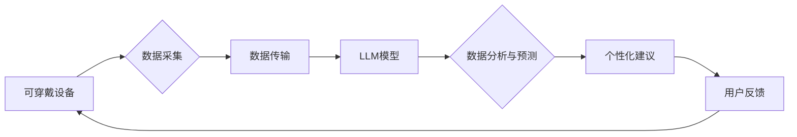

> 可穿戴设备，LLM，健康监测，健身指导，人工智能，自然语言处理，机器学习，数据分析，用户体验

## 1. 背景介绍

近年来，可穿戴设备的普及和人工智能技术的飞速发展为健康监测和健身指导领域带来了革命性的变革。可穿戴设备能够实时采集用户的生理数据，如心率、血压、睡眠质量等，而大型语言模型（LLM）则能够利用这些数据进行分析和预测，为用户提供个性化的健康建议和健身指导。

传统的健康监测和健身指导方式往往依赖于人工干预，效率低下且缺乏个性化。而可穿戴设备与 LLM 的结合，则能够实现智能化、自动化和个性化的健康管理，为用户提供更便捷、更精准、更有效的健康服务。

## 2. 核心概念与联系

### 2.1 可穿戴设备

可穿戴设备是指用户可以佩戴在身体上的电子设备，例如智能手表、智能手环、运动耳机等。这些设备通常配备了传感器，能够收集用户的生理数据，如心率、血压、体温、睡眠质量、运动轨迹等。

### 2.2 大型语言模型 (LLM)

大型语言模型 (LLM) 是一种基于深度学习的自然语言处理 (NLP) 模型，通过训练海量文本数据，能够理解和生成人类语言。LLM 拥有强大的文本处理能力，可以进行文本分类、文本摘要、机器翻译、对话生成等任务。

### 2.3 核心概念联系

可穿戴设备与 LLM 的结合，可以实现以下核心功能：

* **数据采集与分析:** 可穿戴设备收集用户的生理数据，LLM 对这些数据进行分析和预测，识别用户的健康状况和健身需求。
* **个性化健康建议:** 基于用户的生理数据和健康状况，LLM 可以提供个性化的健康建议，例如饮食建议、运动建议、睡眠建议等。
* **智能健身指导:** LLM 可以根据用户的健身目标和水平，制定个性化的健身计划，并提供实时指导和反馈。
* **健康风险预警:** LLM 可以分析用户的生理数据，识别潜在的健康风险，并及时提醒用户采取措施。

**Mermaid 流程图**



## 3. 核心算法原理 & 具体操作步骤

### 3.1 算法原理概述

可穿戴设备与 LLM 结合的核心算法原理主要包括：

* **机器学习算法:** 用于分析用户的生理数据，识别健康状况和健身需求。常见的机器学习算法包括支持向量机 (SVM)、决策树、随机森林、神经网络等。
* **自然语言处理算法:** 用于处理用户的文本输入，理解用户的需求，并生成自然语言的健康建议和健身指导。常见的自然语言处理算法包括词嵌入、文本分类、文本摘要、对话生成等。

### 3.2 算法步骤详解

1. **数据采集:** 可穿戴设备收集用户的生理数据，例如心率、血压、睡眠质量、运动轨迹等。
2. **数据预处理:** 对收集到的数据进行清洗、转换和特征提取，以便于后续的算法训练和应用。
3. **模型训练:** 利用机器学习算法对预处理后的数据进行训练，建立健康状况和健身需求预测模型。
4. **数据分析与预测:** 将用户的最新生理数据输入到训练好的模型中，进行分析和预测，识别用户的健康状况和健身需求。
5. **个性化建议生成:** 利用自然语言处理算法，根据用户的健康状况和健身需求，生成个性化的健康建议和健身指导。
6. **用户反馈:** 用户可以对生成的建议进行反馈，帮助模型不断优化和改进。

### 3.3 算法优缺点

**优点:**

* **智能化:** 自动化数据分析和建议生成，提高效率和准确性。
* **个性化:** 根据用户的生理数据和健康状况，提供个性化的健康建议和健身指导。
* **便捷性:** 用户可以通过可穿戴设备和智能手机轻松获取健康信息和建议。

**缺点:**

* **数据隐私:** 用户的生理数据需要妥善保护，防止泄露和滥用。
* **算法准确性:** 算法的准确性取决于训练数据的质量和模型的复杂度，仍存在一定的误差。
* **用户接受度:** 一些用户可能对智能化健康管理感到不信任或不习惯。

### 3.4 算法应用领域

可穿戴设备与 LLM 结合的算法应用领域广泛，包括：

* **健康监测:** 监测心率、血压、血糖、睡眠质量等，识别潜在的健康风险。
* **健身指导:** 提供个性化的健身计划和指导，帮助用户达到健身目标。
* **慢性病管理:** 帮助患者监测病情，并提供个性化的治疗建议。
* **老年人照护:** 监测老年人的健康状况，及时发现异常情况。

## 4. 数学模型和公式 & 详细讲解 & 举例说明

### 4.1 数学模型构建

可穿戴设备与 LLM 结合的健康监测和健身指导系统可以构建以下数学模型：

* **健康状况预测模型:** 利用机器学习算法，构建一个预测用户健康状况的模型，例如预测用户患心血管疾病的风险。
* **健身效果评估模型:** 利用机器学习算法，构建一个评估用户健身效果的模型，例如预测用户在特定时间内减重的量。

### 4.2 公式推导过程

**健康状况预测模型:**

假设我们想要预测用户患心血管疾病的风险，我们可以使用逻辑回归模型。逻辑回归模型的输出是一个概率值，表示用户患心血管疾病的可能性。模型的公式如下：

$$
P(患病) = \frac{1}{1 + e^{-(w_0 + w_1x_1 + w_2x_2 + ... + w_nx_n)}}
$$

其中：

* $P(患病)$ 是用户患心血管疾病的概率。
* $w_0, w_1, w_2, ..., w_n$ 是模型的参数。
* $x_1, x_2, ..., x_n$ 是用户的特征，例如年龄、性别、血压、心率等。

**健身效果评估模型:**

假设我们想要预测用户在特定时间内减重的量，我们可以使用线性回归模型。线性回归模型的输出是一个预测值，表示用户在特定时间内减重的量。模型的公式如下：

$$
预测体重 = w_0 + w_1x_1 + w_2x_2 + ... + w_nx_n
$$

其中：

* $预测体重$ 是用户在特定时间内减重的量。
* $w_0, w_1, w_2, ..., w_n$ 是模型的参数。
* $x_1, x_2, ..., x_n$ 是用户的特征，例如初始体重、运动量、饮食习惯等。

### 4.3 案例分析与讲解

**案例分析:**

假设我们有一个用户，他的年龄为30岁，性别为男性，血压为120/80mmHg，心率为70次/分钟。我们可以将这些特征输入到健康状况预测模型中，预测他患心血管疾病的风险。

**讲解:**

根据用户的特征，模型会计算出相应的概率值，例如0.15，表示用户患心血管疾病的风险为15%。如果这个概率值较高，则需要用户进行进一步的检查和治疗。

## 5. 项目实践：代码实例和详细解释说明

### 5.1 开发环境搭建

* **操作系统:** Ubuntu 20.04 LTS
* **编程语言:** Python 3.8
* **深度学习框架:** TensorFlow 2.0
* **自然语言处理库:** NLTK, SpaCy

### 5.2 源代码详细实现

```python
# 导入必要的库
import tensorflow as tf
from sklearn.model_selection import train_test_split
from sklearn.metrics import accuracy_score

# 定义模型
model = tf.keras.models.Sequential([
    tf.keras.layers.Dense(64, activation='relu', input_shape=(5,)),
    tf.keras.layers.Dense(32, activation='relu'),
    tf.keras.layers.Dense(1, activation='sigmoid')
])

# 编译模型
model.compile(optimizer='adam',
              loss='binary_crossentropy',
              metrics=['accuracy'])

# 训练模型
model.fit(X_train, y_train, epochs=10, batch_size=32)

# 评估模型
loss, accuracy = model.evaluate(X_test, y_test)
print('Loss:', loss)
print('Accuracy:', accuracy)
```

**代码解读与分析:**

* 该代码示例展示了如何使用 TensorFlow 构建一个简单的健康状况预测模型。
* 模型输入为用户的五个特征，输出为一个概率值，表示用户患心血管疾病的可能性。
* 模型使用两层全连接神经网络，激活函数为ReLU和sigmoid。
* 模型使用Adam优化器，损失函数为二元交叉熵，评估指标为准确率。

### 5.3 代码运行结果展示

运行上述代码后，会输出模型的训练损失和准确率。

## 6. 实际应用场景

### 6.1 健康监测

可穿戴设备与 LLM 可以用于监测用户的健康状况，例如心率、血压、血糖、睡眠质量等。LLM 可以分析用户的生理数据，识别潜在的健康风险，并及时提醒用户采取措施。

### 6.2 健身指导

可穿戴设备与 LLM 可以提供个性化的健身指导，帮助用户达到健身目标。LLM 可以根据用户的健身目标和水平，制定个性化的健身计划，并提供实时指导和反馈。

### 6.3 慢性病管理

可穿戴设备与 LLM 可以帮助患者监测慢性病的病情，并提供个性化的治疗建议。LLM 可以分析用户的生理数据和治疗记录，识别病情变化，并提醒患者及时就医。

### 6.4 未来应用展望

可穿戴设备与 LLM 的结合在未来将有更广泛的应用场景，例如：

* **远程医疗:** LLM 可以帮助医生远程诊断和治疗患者。
* **个性化医疗:** LLM 可以根据用户的基因信息和生活习惯，提供个性化的医疗建议。
* **健康保险:** LLM 可以帮助保险公司评估用户的健康风险，制定个性化的保险方案。

## 7. 工具和资源推荐

### 7.1 学习资源推荐

* **书籍:**
    * 《深度学习》
    * 《自然语言处理》
* **在线课程:**
    * Coursera: 深度学习
    * edX: 自然语言处理
* **开源项目:**
    * TensorFlow
    * PyTorch

### 7.2 开发工具推荐

* **可穿戴设备平台:**
    * Apple Watch
    * Fitbit
    * Garmin
* **数据分析工具:**
    * Jupyter Notebook
    * Pandas
    * Scikit-learn

### 7.3 相关论文推荐

* **BERT: Pre-training of Deep Bidirectional Transformers for Language Understanding**
* **Attention Is All You Need**
* **Deep Learning for Health Informatics**

## 8. 总结：未来发展趋势与挑战

### 8.1 研究成果总结

可穿戴设备与 LLM 的结合为健康监测和健身指导领域带来了革命性的变革，能够实现智能化、自动化和个性化的健康管理。

### 8.2 未来发展趋势

* **模型精度提升:** 随着训练数据的增加和算法的改进，模型的预测精度将不断提升。
* **多模态数据融合:** 将可穿戴设备收集到的多模态数据，例如生理数据、运动轨迹、语音数据等，融合到模型中，提高模型的分析能力。
* **边缘计算:** 将模型部署到可穿戴设备上，实现实时数据分析和决策，降低延迟和网络依赖。

### 8.3 面临的挑战

* **数据隐私保护:** 用户的