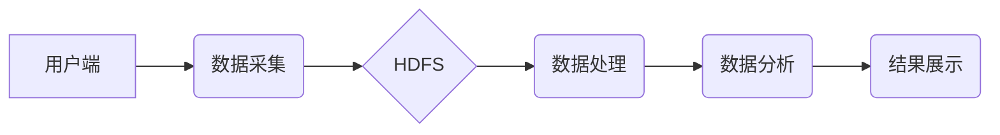

> Hadoop,分布式存储,大数据,旅游管理,景点推荐,用户画像

## 1. 背景介绍

随着互联网和移动技术的快速发展，旅游业迎来了蓬勃发展的新时代。旅游信息量呈指数级增长，传统的旅游管理系统难以满足海量数据存储、分析和处理的需求。分布式存储和计算技术应运而生，为旅游管理提供了新的解决方案。Hadoop作为一款开源的分布式存储和计算框架，凭借其高可靠性、高扩展性和高性能，在处理海量旅游数据方面展现出巨大的优势。

本篇文章将围绕基于Hadoop的全国热门景点旅游管理系统的设计与实现展开探讨，旨在为旅游业提供一种高效、可靠的旅游数据管理和分析平台。

## 2. 核心概念与联系

### 2.1 Hadoop 架构

Hadoop是一个分布式存储和计算框架，由HDFS（Hadoop分布式文件系统）和YARN（Yet Another Resource Negotiator）两部分组成。

* **HDFS:**  负责存储海量数据，将数据分片存储在集群中的多个节点上，实现数据冗余和高可用性。
* **YARN:**  负责资源管理和任务调度，将用户提交的计算任务分配到集群中的节点上执行。

### 2.2 核心概念

* **分布式存储:** 将数据分散存储在多个节点上，提高数据可靠性和扩展性。
* **分布式计算:** 将计算任务分解成多个子任务，并行执行在多个节点上，提高计算效率。
* **数据处理:** 对旅游数据进行清洗、转换、聚合等操作，提取有价值的信息。
* **数据分析:** 利用统计学、机器学习等方法对旅游数据进行分析，发现旅游趋势和用户行为模式。

### 2.3 系统架构

基于Hadoop的全国热门景点旅游管理系统架构如下：



## 3. 核心算法原理 & 具体操作步骤

### 3.1  算法原理概述

本系统采用基于Hadoop的分布式数据处理和分析技术，结合机器学习算法，实现以下功能：

* **景点推荐:** 基于用户历史游玩记录、兴趣偏好等信息，推荐个性化景点。
* **用户画像:** 分析用户游玩数据，构建用户画像，了解用户群体特征和行为模式。
* **旅游趋势分析:** 分析旅游数据，发现旅游热点、旅游趋势等信息。

### 3.2  算法步骤详解

**景点推荐算法:**

1. **数据收集:** 收集用户游玩记录、景点信息、用户兴趣偏好等数据。
2. **数据预处理:** 对数据进行清洗、转换、格式化等操作。
3. **特征提取:** 从用户游玩记录、景点信息中提取特征，例如用户喜欢的景点类型、景点地理位置、景点评分等。
4. **模型训练:** 利用机器学习算法，例如协同过滤算法、内容过滤算法等，训练景点推荐模型。
5. **推荐结果:** 根据用户特征和模型预测，推荐个性化景点。

**用户画像算法:**

1. **数据收集:** 收集用户基本信息、游玩记录、评论等数据。
2. **数据预处理:** 对数据进行清洗、转换、格式化等操作。
3. **特征提取:** 从用户数据中提取特征，例如用户年龄、性别、居住地、游玩频率、喜欢的景点类型等。
4. **聚类分析:** 利用聚类算法，将用户划分为不同的用户群体。
5. **用户画像构建:** 对每个用户群体进行描述，构建用户画像。

**旅游趋势分析算法:**

1. **数据收集:** 收集旅游数据，例如景点访问量、酒店预订量、机票销量等。
2. **数据预处理:** 对数据进行清洗、转换、格式化等操作。
3. **时间序列分析:** 利用时间序列分析方法，分析旅游数据的时间趋势。
4. **热点分析:** 利用聚类算法或其他方法，分析旅游热点。
5. **趋势预测:** 利用机器学习算法，预测未来旅游趋势。

### 3.3  算法优缺点

**优点:**

* **高效率:** 利用Hadoop的分布式计算能力，可以快速处理海量数据。
* **高可靠性:** HDFS的分布式存储机制，保证数据可靠性。
* **高扩展性:** Hadoop可以轻松扩展到更大的集群，满足数据量的增长需求。

**缺点:**

* **复杂性:** Hadoop的架构和配置相对复杂，需要专业的技术人员进行管理。
* **性能瓶颈:** 在某些特定场景下，Hadoop的性能可能存在瓶颈。

### 3.4  算法应用领域

* **旅游推荐:** 为用户推荐个性化景点、酒店、机票等旅游产品。
* **用户画像:** 构建用户画像，了解用户群体特征和行为模式。
* **旅游趋势分析:** 分析旅游数据，发现旅游热点、旅游趋势等信息。
* **旅游营销:** 根据用户画像和旅游趋势，制定精准的旅游营销策略。

## 4. 数学模型和公式 & 详细讲解 & 举例说明

### 4.1  数学模型构建

**景点推荐模型:**

本系统采用协同过滤算法进行景点推荐，其核心思想是基于用户的相似度和物品的相似度进行推荐。

* **用户相似度:** 计算两个用户在游玩记录上的相似度，例如余弦相似度。
* **物品相似度:** 计算两个景点在用户评价上的相似度，例如皮尔逊相关系数。

**用户画像模型:**

本系统采用K-means聚类算法构建用户画像，将用户划分为不同的用户群体。

* **距离度量:** 使用欧氏距离或马氏距离等度量用户特征之间的距离。
* **聚类中心:** 每个聚类对应一个聚类中心，代表该聚类用户的特征。

### 4.2  公式推导过程

**余弦相似度:**

$$
\text{相似度} = \frac{\mathbf{u} \cdot \mathbf{v}}{\|\mathbf{u}\| \|\mathbf{v}\|}
$$

其中：

* $\mathbf{u}$ 和 $\mathbf{v}$ 是两个用户的游玩记录向量。
* $\cdot$ 表示向量点积。
* $\|\mathbf{u}\|$ 和 $\|\mathbf{v}\|$ 是两个向量的模长。

**皮尔逊相关系数:**

$$
\text{相关系数} = \frac{\sum_{i=1}^{n}(x_i - \bar{x})(y_i - \bar{y})}{\sqrt{\sum_{i=1}^{n}(x_i - \bar{x})^2} \sqrt{\sum_{i=1}^{n}(y_i - \bar{y})^2}}
$$

其中：

* $x_i$ 和 $y_i$ 是两个景点在用户评价上的评分。
* $\bar{x}$ 和 $\bar{y}$ 是两个景点评分的平均值。
* $n$ 是用户数量。

**K-means聚类算法:**

1. 随机选择K个用户作为聚类中心。
2. 将每个用户分配到距离其最近的聚类中心所属的类别。
3. 更新每个聚类中心的坐标，使其成为该类别的用户平均值。
4. 重复步骤2和3，直到聚类中心不再变化。

### 4.3  案例分析与讲解

**景点推荐案例:**

假设用户A喜欢历史文化景点，用户B喜欢自然风光景点，系统根据用户的游玩记录计算出用户A和用户B的余弦相似度为0.6，系统推荐用户A一些用户B喜欢的自然风光景点。

**用户画像案例:**

系统根据用户的游玩记录、评论等数据，将用户划分为“家庭用户”、“情侣用户”、“背包客”等不同的用户群体，并为每个用户群体构建用户画像，例如“家庭用户”喜欢游玩亲子游乐园、动物园等景点，喜欢舒适的酒店住宿。

## 5. 项目实践：代码实例和详细解释说明

### 5.1  开发环境搭建

* 操作系统：Linux
* JDK：Java Development Kit 8
* Hadoop：Hadoop 3.3.0
* IDE：Eclipse

### 5.2  源代码详细实现

```java
// 景点推荐算法
public class RecommendScenicSpot {

    public static void main(String[] args) {
        // 数据加载
        // ...

        // 用户相似度计算
        double[][] userSimilarity = calculateUserSimilarity();

        // 物品相似度计算
        double[][] itemSimilarity = calculateItemSimilarity();

        // 推荐景点
        List<String> recommendedScenicSpots = recommendScenicSpotsForUser("user1");

        // 输出推荐结果
        System.out.println("推荐景点：" + recommendedScenicSpots);
    }

    // 计算用户相似度
    private static double[][] calculateUserSimilarity() {
        // ...
    }

    // 计算物品相似度
    private static double[][] calculateItemSimilarity() {
        // ...
    }

    // 推荐景点
    private static List<String> recommendScenicSpotsForUser(String userId) {
        // ...
    }
}
```

### 5.3  代码解读与分析

* **数据加载:** 从HDFS中加载用户游玩记录、景点信息等数据。
* **用户相似度计算:** 利用余弦相似度算法计算用户之间的相似度。
* **物品相似度计算:** 利用皮尔逊相关系数算法计算景点之间的相似度。
* **推荐景点:** 根据用户的游玩记录、用户相似度和物品相似度，推荐用户喜欢的景点。

### 5.4  运行结果展示

系统运行后，将输出用户喜欢的景点推荐列表。

## 6. 实际应用场景

### 6.1  旅游网站

* **个性化推荐:** 为用户推荐个性化景点、酒店、机票等旅游产品。
* **用户画像分析:** 了解用户群体特征和行为模式，制定精准的营销策略。

### 6.2  旅游APP

* **景点导航:** 为用户提供景点导航服务，帮助用户规划行程。
* **实时信息推送:** 推送最新的旅游信息，例如景点开放时间、天气预报等。

### 6.3  旅游管理部门

* **旅游趋势分析:** 分析旅游数据，发现旅游热点、旅游趋势等信息，制定旅游发展规划。
* **旅游资源管理:** 管理旅游资源，提高旅游资源利用率。

### 6.4  未来应用展望

* **虚拟现实旅游:** 利用虚拟现实技术，为用户提供沉浸式的旅游体验。
* **人工智能客服:** 利用人工智能技术，为用户提供智能化的旅游服务。

## 7. 工具和资源推荐

### 7.1  学习资源推荐

* **Hadoop官方文档:** https://hadoop.apache.org/docs/
* **Spark官方文档:** https://spark.apache.org/docs/latest/
* **机器学习算法书籍:** 《机器学习》

### 7.2  开发工具推荐

* **Eclipse:** https://www.eclipse.org/
* **IntelliJ IDEA:** https://www.jetbrains.com/idea/

### 7.3  相关论文推荐

* **Hadoop: Distributed Storage and Processing of Large Datasets:** https://www.usenix.org/system/files/conference/osdi04/osdi04-dean.pdf
* **Spark: Cluster Computing with Working Sets:** https://static.googleusercontent.com/media/research.google.com/en//pubs/archive/41911.pdf

## 8. 总结：未来发展趋势与挑战

### 8.1  研究成果总结

本篇文章介绍了基于Hadoop的全国热门景点旅游管理系统的设计与实现，并探讨了核心算法原理、代码实例、实际应用场景等方面。该系统利用Hadoop的分布式存储和计算能力，结合机器学习算法，可以有效地处理海量旅游数据，为旅游业提供数据驱动的决策支持。

###