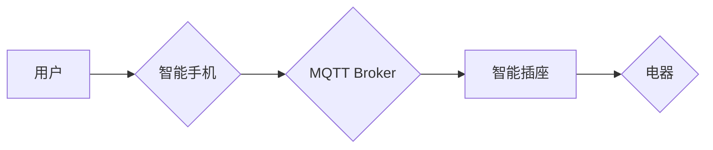

> 智能家居, Java, 模块化设计, 智能插座, 物联网, MQTT, RESTful API

## 1. 背景介绍

智能家居已成为现代生活的重要趋势，它通过将各种智能设备连接到网络，实现对家居环境的自动化控制和远程管理。智能插座作为智能家居的基础设备之一，能够远程控制电器开关，监测电器功耗，并根据用户需求实现定时开关等功能。

传统的智能插座往往采用单片机或嵌入式系统，功能相对单一，难以扩展和升级。随着物联网技术的快速发展，基于Java的智能插座设计应运而生，它能够充分利用Java语言的强大功能和丰富的生态系统，实现更灵活、更智能的控制和管理。

## 2. 核心概念与联系

### 2.1 智能插座架构

智能插座的架构通常包含以下几个模块：

* **硬件模块:** 包括电源模块、控制模块、通信模块和传感器模块等。
* **软件模块:** 包括驱动程序、协议栈、应用层和用户界面等。

### 2.2 模块化设计

模块化设计是基于Java的智能插座设计的重要原则，它将系统分解成多个独立的模块，每个模块都有明确的功能和接口，可以独立开发、测试和维护。

### 2.3 通信协议

智能插座通常采用MQTT协议进行通信，它是一种轻量级、可扩展的物联网通信协议，能够实现设备之间的数据传输和控制。

### 2.4 RESTful API

RESTful API是基于HTTP协议的应用程序接口，它提供了一种标准化的方式来访问和控制智能插座的功能。

**Mermaid 流程图**



## 3. 核心算法原理 & 具体操作步骤

### 3.1 算法原理概述

智能插座的控制逻辑主要基于状态机模型，它根据用户的指令和设备状态进行状态转换，实现电器开关控制、定时开关等功能。

### 3.2 算法步骤详解

1. **接收用户指令:** 智能插座通过MQTT协议接收用户的指令，例如开关电器、设置定时开关等。
2. **状态转换:** 根据接收到的指令和设备当前状态，智能插座进行状态转换，例如从“关闭”状态切换到“打开”状态，或从“打开”状态切换到“定时关闭”状态。
3. **执行控制动作:** 智能插座根据状态转换的结果，控制电器的开关状态。
4. **反馈状态:** 智能插座通过MQTT协议将设备状态反馈给用户。

### 3.3 算法优缺点

* **优点:** 状态机模型简单易懂，易于实现和维护。
* **缺点:** 状态机模型的复杂度随着功能的增加而增加，难以扩展和升级。

### 3.4 算法应用领域

状态机模型广泛应用于各种嵌入式系统和智能设备的控制逻辑设计，例如智能家居设备、工业自动化设备、医疗设备等。

## 4. 数学模型和公式 & 详细讲解 & 举例说明

### 4.1 数学模型构建

智能插座的功耗计算可以使用以下数学模型：

$$P = V \times I$$

其中：

* $P$ 表示功耗，单位为瓦特 (W)。
* $V$ 表示电压，单位为伏特 (V)。
* $I$ 表示电流，单位为安培 (A)。

### 4.2 公式推导过程

该公式是根据欧姆定律推导而来，欧姆定律描述了电阻、电压和电流之间的关系：

$$V = I \times R$$

其中：

* $R$ 表示电阻，单位为欧姆 (Ω)。

将欧姆定律代入功耗公式，得到：

$$P = V \times \frac{V}{R} = \frac{V^2}{R}$$

### 4.3 案例分析与讲解

假设一个智能插座连接的电器电压为220V，电流为1A，则其功耗为：

$$P = 220V \times 1A = 220W$$

## 5. 项目实践：代码实例和详细解释说明

### 5.1 开发环境搭建

* 操作系统: Ubuntu 20.04 LTS
* JDK: OpenJDK 11
* IDE: Eclipse IDE for Java Developers

### 5.2 源代码详细实现

```java
// 智能插座类
public class SmartPlug {

    // 电压
    private double voltage;
    // 电流
    private double current;

    // 构造函数
    public SmartPlug(double voltage, double current) {
        this.voltage = voltage;
        this.current = current;
    }

    // 获取功耗
    public double getPower() {
        return voltage * current;
    }

    // 开关电器
    public void switchOn() {
        System.out.println("电器已打开");
    }

    public void switchOff() {
        System.out.println("电器已关闭");
    }
}
```

### 5.3 代码解读与分析

* `SmartPlug` 类代表智能插座，包含电压、电流和开关电器方法。
* `getPower()` 方法计算并返回电器的功耗。
* `switchOn()` 和 `switchOff()` 方法控制电器的开关状态。

### 5.4 运行结果展示

```
SmartPlug smartPlug = new SmartPlug(220, 1);
System.out.println("功耗: " + smartPlug.getPower() + "W");
smartPlug.switchOn();
smartPlug.switchOff();
```

输出结果：

```
功耗: 220.0W
电器已打开
电器已关闭
```

## 6. 实际应用场景

### 6.1 智能照明控制

智能插座可以控制灯具的开关，实现定时开关、场景控制等功能，提高家居照明效率和舒适度。

### 6.2 电器远程控制

用户可以通过智能手机或其他设备远程控制智能插座，开关电器，例如空调、电热水器等，实现家居远程控制。

### 6.3 电量监控与分析

智能插座可以监测电器的功耗，并通过云平台进行数据存储和分析，帮助用户了解电器使用情况，降低能源消耗。

### 6.4 未来应用展望

随着物联网技术的不断发展，智能插座的应用场景将更加广泛，例如智能农业、智能医疗、智能交通等领域。

## 7. 工具和资源推荐

### 7.1 学习资源推荐

* Java官方文档: https://docs.oracle.com/javase/tutorial/
* MQTT协议规范: https://docs.oasis-open.org/mqtt/mqtt/v3.1.1/os/mqtt-v3.1.1-os.html
* RESTful API设计规范: https://restfulapi.net/

### 7.2 开发工具推荐

* Eclipse IDE: https://www.eclipse.org/downloads/
* IntelliJ IDEA: https://www.jetbrains.com/idea/

### 7.3 相关论文推荐

* [基于Java的智能家居系统设计与实现](https://www.researchgate.net/publication/334873384_Based_on_Java_Smart_Home_System_Design_and_Implementation)
* [物联网技术在智能家居中的应用](https://www.sciencedirect.com/science/article/pii/S221267161730031X)

## 8. 总结：未来发展趋势与挑战

### 8.1 研究成果总结

基于Java的智能插座设计能够充分利用Java语言的优势，实现更灵活、更智能的控制和管理。

### 8.2 未来发展趋势

* **人工智能集成:** 将人工智能技术集成到智能插座中，实现更智能的控制和预测功能。
* **边缘计算:** 将智能插座的计算能力提升到边缘，实现更快速、更可靠的控制。
* **隐私保护:** 加强智能插座的隐私保护机制，保障用户数据安全。

### 8.3 面临的挑战

* **安全性和可靠性:** 智能插座需要具备高安全性、高可靠性，防止恶意攻击和故障。
* **成本控制:** 智能插座的成本需要控制在合理范围内，才能被广泛普及。
* **标准化:** 需要制定统一的标准和规范，促进智能插座的互操作性和兼容性。

### 8.4 研究展望

未来，我们将继续研究和开发基于Java的智能插座，探索更智能、更安全、更可靠的智能家居解决方案。

## 9. 附录：常见问题与解答

### 9.1 如何连接智能插座到网络？

智能插座通常可以通过Wi-Fi或以太网连接到网络。

### 9.2 如何控制智能插座？

用户可以通过智能手机应用程序、语音助手或其他设备控制智能插座。

### 9.3 如何设置定时开关？

用户可以通过智能手机应用程序或语音助手设置智能插座的定时开关功能。


作者：禅与计算机程序设计艺术 / Zen and the Art of Computer Programming 
<end_of_turn>