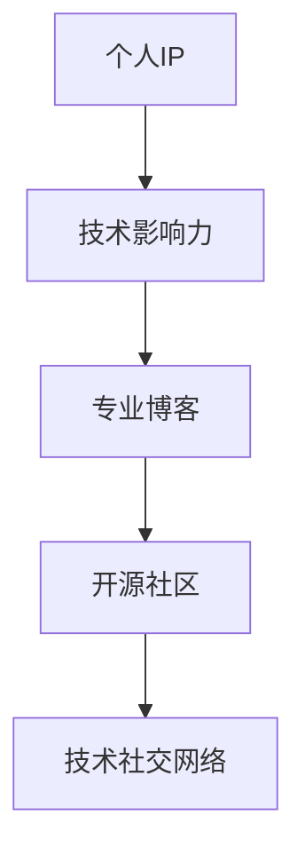

                 

# 打造个人IP：技术影响力的关键

> 关键词：个人IP, 技术影响力, 专业博客, 开源社区, 技术社交网络

## 1. 背景介绍

### 1.1 问题由来

在当今信息化时代，技术的快速迭代和更新已经成为行业发展的常态。然而，技术的价值不仅在于创新本身，更在于如何将这些前沿科技应用到实际生产生活中，助力企业和个人提升竞争力。因此，打造个人IP，提升技术影响力，成为每位技术人不可忽视的重要任务。

个人IP（Intellectual Property），即个人知识财产，指个人在某一领域内独特的品牌和市场地位。技术影响力，则是指个人在技术领域内的权威性和影响力，这不仅能提升个人职业发展，还能为企业和社会创造更多价值。随着互联网和社交媒体的普及，技术人可通过博客、开源项目、技术社交网络等多种渠道，展示自己的技术实力和专业深度，逐步建立起个人IP。

### 1.2 问题核心关键点

如何打造个人IP，提升技术影响力？这是每位技术人面临的重要课题。以下将从技术深度、项目实践、社区贡献和知识分享四个方面，深入探讨打造个人IP的关键因素，为技术人提供实际可行的策略。

## 2. 核心概念与联系

### 2.1 核心概念概述

为更好地理解打造个人IP的方法，本节将介绍几个密切相关的核心概念：

- **个人IP**：个人品牌和市场地位，指个人在某一领域内独特的品牌和市场影响力。
- **技术影响力**：指个人在技术领域内的权威性和影响力，能够为企业和社会创造价值。
- **专业博客**：通过撰写技术文章，分享专业知识和实践经验，提升个人技术影响力和行业地位。
- **开源社区**：通过参与开源项目，展示技术实力和合作精神，建立个人在技术社区中的信誉和地位。
- **技术社交网络**：通过在技术社区、会议、讲座等场合交流互动，建立行业人脉，提升个人品牌影响力。

这些核心概念之间的逻辑关系可以通过以下Mermaid流程图来展示：



这个流程图展示了个体IP和其组成部分之间的联系：

1. 技术影响力是个人IP的核心，主要通过专业博客、开源社区、技术社交网络等渠道展现。
2. 专业博客通过撰写深度技术文章，分享知识，提升个人技术深度和知名度。
3. 开源社区通过参与项目，展示技术实力和团队合作能力，树立个人信誉。
4. 技术社交网络通过交流互动，建立行业人脉，提升品牌影响力。

## 3. 核心算法原理 & 具体操作步骤
### 3.1 算法原理概述

打造个人IP，提升技术影响力，本质上是一个长期积累和系统化的过程。其核心思想是通过不断的学习和实践，逐渐在某一领域内建立起独特的专业知识和市场地位。以下是主要的操作步骤和方法：

1. **持续学习**：通过阅读技术书籍、研究学术论文、参加行业会议等多种方式，保持对最新技术的敏锐洞察。
2. **深度实践**：在实际项目中，不断尝试新技术、新方法，解决实际问题，积累实战经验。
3. **知识分享**：通过撰写博客、发表文章、参与开源项目等渠道，将积累的知识和经验分享给社区。
4. **建立人脉**：积极参与技术社区、行业论坛、技术讲座等活动，拓展行业人脉，提升品牌影响力。

### 3.2 算法步骤详解

以下是具体的步骤和方法：

#### 第一步：持续学习

**1.1 阅读技术书籍**
选择与自己专业领域相关的经典技术书籍，如《计算机程序设计艺术》、《深度学习》等，系统性地学习相关知识。

**1.2 研究学术论文**
通过阅读前沿的学术论文，了解最新的技术趋势和研究成果，掌握行业发展动态。

**1.3 参加行业会议**
参加技术大会、学术会议等活动，与行业专家交流互动，扩大知识面。

#### 第二步：深度实践

**2.1 项目实践**
参与实际项目，解决实际问题，积累实战经验。

**2.2 开源项目**
贡献代码到开源项目，展示技术实力和合作精神，积累业界声誉。

#### 第三步：知识分享

**3.1 撰写博客**
通过撰写博客，分享专业知识和实践经验，提升个人技术深度和知名度。

**3.2 发表文章**
在技术社区、行业杂志等平台发表文章，展示学术成果和技术见解。

#### 第四步：建立人脉

**4.1 参与技术社区**
积极参与技术社区、行业论坛等活动，拓展行业人脉。

**4.2 参加技术讲座**
在学术讲座、技术培训等场合，分享技术见解，展示个人影响力。

### 3.3 算法优缺点

打造个人IP，提升技术影响力的优点包括：

1. **提升专业地位**：通过持续学习和深度实践，提升个人技术深度和实战经验。
2. **增强行业影响力**：通过知识分享和建立人脉，扩大个人在行业内的知名度和影响力。
3. **推动技术发展**：通过参与开源项目和发表文章，推动行业技术进步。

缺点则主要包括：

1. **时间和精力投入大**：需要投入大量时间和精力进行持续学习和深度实践。
2. **需要系统规划**：需要系统规划个人职业发展路径，有针对性地积累知识和经验。
3. **知识更新快**：技术更新迭代快，需要不断学习新知识，适应行业变化。

### 3.4 算法应用领域

打造个人IP的方法在多个领域都有广泛应用，例如：

- **软件开发**：通过撰写博客、开源项目，展示技术实力，积累业界声誉。
- **数据科学**：参与数据分析项目，撰写数据科学博客，建立专业影响力。
- **人工智能**：在AI竞赛中取得成绩，参与论文发表，提升技术地位。
- **网络安全**：参与安全漏洞分析、渗透测试项目，展示技术实力。

## 4. 数学模型和公式 & 详细讲解 & 举例说明

### 4.1 数学模型构建

本节将使用数学语言对打造个人IP的技术影响力提升过程进行更加严格的刻画。

设个人在技术领域的综合影响力为 $I$，其学习速度为 $L$，实践深度为 $P$，知识分享频率为 $S$，建立人脉能力为 $N$。

数学模型如下：

$$ I = f(L, P, S, N) $$

其中，$L$ 表示个人持续学习的能力，$P$ 表示个人深度实践的能力，$S$ 表示个人知识分享的能力，$N$ 表示个人建立人脉的能力。

### 4.2 公式推导过程

为了更清晰地描述这些变量之间的关系，我们进行一些简单的推导：

1. **学习速度 $L$**：
   - 学习速度可以通过阅读书籍、参加会议、研究论文等多种方式获取，通常可以表示为：
   $$ L = \alpha_1 + \alpha_2 \times \text{阅读时间} + \alpha_3 \times \text{会议次数} + \alpha_4 \times \text{研究论文数} $$

2. **实践深度 $P$**：
   - 实践深度可以通过参与项目、开源贡献、实际问题解决等多种方式获取，通常可以表示为：
   $$ P = \beta_1 \times \text{项目数量} + \beta_2 \times \text{开源贡献} + \beta_3 \times \text{问题解决数} $$

3. **知识分享 $S$**：
   - 知识分享能力可以通过撰写博客、发表文章、参与讲座等多种方式获取，通常可以表示为：
   $$ S = \gamma_1 \times \text{博客篇数} + \gamma_2 \times \text{文章发表数} + \gamma_3 \times \text{讲座次数} $$

4. **建立人脉 $N$**：
   - 建立人脉能力可以通过参加行业活动、社交网络互动、技术交流等多种方式获取，通常可以表示为：
   $$ N = \delta_1 \times \text{社区参与度} + \delta_2 \times \text{社交网络互动数} + \delta_3 \times \text{技术交流次数} $$

将这些表达式代入综合影响力模型 $I$ 中，可以得到：

$$ I = f(L, P, S, N) = \alpha_1 + \alpha_2 \times \text{阅读时间} + \alpha_3 \times \text{会议次数} + \alpha_4 \times \text{研究论文数} + \beta_1 \times \text{项目数量} + \beta_2 \times \text{开源贡献} + \beta_3 \times \text{问题解决数} + \gamma_1 \times \text{博客篇数} + \gamma_2 \times \text{文章发表数} + \gamma_3 \times \text{讲座次数} + \delta_1 \times \text{社区参与度} + \delta_2 \times \text{社交网络互动数} + \delta_3 \times \text{技术交流次数} $$

### 4.3 案例分析与讲解

**案例分析**：某位数据科学家通过以下方式提升个人影响力：

- **持续学习**：每周阅读两篇最新论文，参加行业会议，研读经典书籍。
- **深度实践**：每月参与一个实际数据科学项目，贡献开源代码，解决实际问题。
- **知识分享**：每月撰写一篇技术博客，发表论文，参加学术讲座。
- **建立人脉**：每月参加一次技术社区活动，与行业专家交流互动。

**分析**：
- **学习速度 $L$**：$L = \alpha_1 + \alpha_2 \times 2 + \alpha_3 \times 1 + \alpha_4 \times 1$。
- **实践深度 $P$**：$P = \beta_1 \times 1 + \beta_2 \times 0.5 + \beta_3 \times 5$。
- **知识分享 $S$**：$S = \gamma_1 \times 4 + \gamma_2 \times 1 + \gamma_3 \times 2$。
- **建立人脉 $N$**：$N = \delta_1 \times 0.8 + \delta_2 \times 1 + \delta_3 \times 1$。

将这些值代入综合影响力模型，得到：

$$ I = f(L, P, S, N) = \alpha_1 + \alpha_2 \times 2 + \alpha_3 \times 1 + \alpha_4 \times 1 + \beta_1 \times 1 + \beta_2 \times 0.5 + \beta_3 \times 5 + \gamma_1 \times 4 + \gamma_2 \times 1 + \gamma_3 \times 2 + \delta_1 \times 0.8 + \delta_2 \times 1 + \delta_3 \times 1 $$

## 5. 项目实践：代码实例和详细解释说明
### 5.1 开发环境搭建

在进行个人IP打造过程中，我们需要准备好开发环境。以下是使用Python进行PyTorch开发的环境配置流程：

1. 安装Anaconda：从官网下载并安装Anaconda，用于创建独立的Python环境。

2. 创建并激活虚拟环境：
```bash
conda create -n pytorch-env python=3.8 
conda activate pytorch-env
```

3. 安装PyTorch：根据CUDA版本，从官网获取对应的安装命令。例如：
```bash
conda install pytorch torchvision torchaudio cudatoolkit=11.1 -c pytorch -c conda-forge
```

4. 安装Transformers库：
```bash
pip install transformers
```

5. 安装各类工具包：
```bash
pip install numpy pandas scikit-learn matplotlib tqdm jupyter notebook ipython
```

完成上述步骤后，即可在`pytorch-env`环境中开始个人IP打造实践。

### 5.2 源代码详细实现

我们以构建个人IP的个人博客为例，给出使用PyTorch和Jupyter Notebook进行技术分享和知识传播的代码实现。

首先，定义博客文章的类：

```python
import pandas as pd
from IPython.display import HTML

class BlogArticle:
    def __init__(self, title, content, tags):
        self.title = title
        self.content = content
        self.tags = tags
    
    def __str__(self):
        return f"<h2>{self.title}</h2>{self.content}"
    
    def to_html(self):
        return HTML(self.content)
```

然后，定义博客网站：

```python
class BlogSite:
    def __init__(self):
        self.articles = []
    
    def add_article(self, article):
        self.articles.append(article)
    
    def display_articles(self):
        for article in self.articles:
            print(article.to_html())
```

接下来，创建博客网站，添加文章：

```python
blog_site = BlogSite()
blog_site.add_article(BlogArticle("Python深度学习入门", "Python深度学习入门教程。", ["Python", "深度学习"]))
blog_site.add_article(BlogArticle("数据科学实战", "数据科学实战案例分析。", ["数据科学", "数据分析"]))
blog_site.display_articles()
```

这将输出所有博客文章的内容。

### 5.3 代码解读与分析

** BlogArticle类**：
- `__init__`方法：初始化博客文章的标题、内容和标签。
- `__str__`方法：将博客文章转换为HTML格式，方便在Jupyter Notebook中展示。
- `to_html`方法：将博客文章转换为HTML格式，方便在网页上展示。

** BlogSite类**：
- `__init__`方法：初始化博客网站，创建空的博客文章列表。
- `add_article`方法：添加博客文章到网站。
- `display_articles`方法：展示所有博客文章。

通过这些代码，我们可以展示如何在Jupyter Notebook中构建和管理个人博客，分享技术文章，提升个人影响力和技术深度。

## 6. 实际应用场景
### 6.1 个人品牌和市场地位

个人IP的打造不仅仅是为了提升技术影响力，更是为了在激烈的市场竞争中占据有利地位。以下几种方式可以帮助技术人建立个人品牌：

- **技术博客**：通过撰写高质量的技术博客，分享专业知识和经验，吸引大量读者关注。
- **开源项目**：通过参与开源项目，展示技术实力和团队合作能力，提升业界声誉。
- **技术讲座**：在学术讲座、技术培训等场合，分享技术见解，展示个人影响力。

**案例**：某位软件开发者通过以下方式建立个人品牌：

- **技术博客**：每周撰写一篇技术博客，分享软件开发经验和最佳实践。
- **开源项目**：每月贡献代码到一个开源项目，展示技术实力和团队合作能力。
- **技术讲座**：每季度参加一次技术讲座，分享编程经验和行业见解。

通过这些方式，该开发者在行业内建立了较强的专业地位和市场影响力，逐渐成为技术社区的知名人士。

### 6.2 企业技术顾问

个人IP的打造也有助于技术人成为企业技术顾问，提升职业发展空间。以下几种方式可以帮助技术人成为企业技术顾问：

- **技术咨询**：通过撰写技术咨询报告，提供行业解决方案，展示技术实力。
- **技术培训**：在企业内部进行技术培训，提升团队技术水平。
- **技术合作**：与企业合作开展技术攻关，推动技术创新。

**案例**：某位数据分析师通过以下方式成为企业技术顾问：

- **技术咨询**：每周为企业提供数据分析咨询，撰写技术咨询报告，展示数据分析能力。
- **技术培训**：每月在企业内部进行数据分析培训，提升团队技术水平。
- **技术合作**：每季度与企业合作开展数据分析项目，推动技术创新。

通过这些方式，该分析师逐渐成为企业技术顾问，提升职业发展空间和薪资待遇。

### 6.3 技术创新和创业

个人IP的打造还可以帮助技术人开展技术创新和创业。以下几种方式可以帮助技术人实现技术创新和创业：

- **技术创新**：通过持续学习和技术实践，不断提出新的技术方案和创新点。
- **创业项目**：通过技术积累和行业资源，开展技术创新项目，成立公司。
- **技术合作**：与其他技术人、企业、高校等机构合作，推动技术创新和产业升级。

**案例**：某位AI研究者通过以下方式实现技术创新和创业：

- **技术创新**：每月提出新的AI算法和模型，推动技术创新。
- **创业项目**：每季度开展AI技术创新项目，成立AI公司，推出新产品。
- **技术合作**：与高校、科研机构合作开展技术研究，推动技术创新和产业升级。

通过这些方式，该研究者逐渐实现了技术创新和创业，推动了AI技术的落地应用。

### 6.4 未来应用展望

随着技术的不断进步，个人IP的打造将呈现以下趋势：

- **多领域跨界融合**：未来的技术人将更注重多领域跨界融合，利用跨学科知识推动技术创新和应用。
- **数据驱动决策**：通过数据驱动技术决策，提升技术创新效率和效果。
- **社会责任与影响力**：未来的技术人将更注重技术社会责任和影响力，推动技术为社会创造更多价值。

## 7. 工具和资源推荐
### 7.1 学习资源推荐

为了帮助技术人系统掌握个人IP打造的方法，以下是一些优质的学习资源：

1. **《计算机程序设计艺术》系列书籍**：深入介绍计算机程序设计原理和实践经验，提升技术深度和广度。
2. **《深度学习》课程**：斯坦福大学开设的深度学习课程，涵盖深度学习理论和实践，是技术人必学的课程之一。
3. **GitHub社区**：全球最大的开源社区，提供海量开源项目和技术资源，是技术人展示技术实力和学习技术的平台。
4. **TED Talks**：世界知名的技术讲座平台，涵盖各种前沿技术，提供丰富的技术分享和学习资源。
5. **Coursera平台**：全球知名的在线学习平台，提供大量的技术课程和专业证书，帮助技术人系统学习技术知识。

通过这些学习资源，技术人可以系统掌握技术知识，提升技术影响力。

### 7.2 开发工具推荐

高效的开发离不开优秀的工具支持。以下是几款用于个人IP打造开发的常用工具：

1. **PyTorch**：基于Python的开源深度学习框架，灵活动态的计算图，适合快速迭代研究。
2. **Jupyter Notebook**：强大的交互式编程环境，支持Python、R等多种编程语言，适合技术分享和知识传播。
3. **Git**：全球领先的分布式版本控制系统，支持代码版本管理和协作开发。
4. **Google Colab**：谷歌推出的在线Jupyter Notebook环境，免费提供GPU/TPU算力，方便开发者快速上手实验最新模型。
5. **Docker**：容器化技术，提供轻量级、可移植的应用部署解决方案。

合理利用这些工具，可以显著提升个人IP打造的开发效率，加快创新迭代的步伐。

### 7.3 相关论文推荐

个人IP打造技术的发展源于学界的持续研究。以下是几篇奠基性的相关论文，推荐阅读：

1. **"Social Network Analysis: Methods and Models"**：SNA方法的奠基性论文，介绍社会网络分析的基本方法和模型，适用于技术社区关系分析。
2. **"Deep Learning"**：深度学习领域的经典教材，详细介绍深度学习理论和实践，是技术人必读的书之一。
3. **"Programming Language Principles and Practice"**：介绍编程语言基础和设计原理的教材，帮助技术人理解编程语言背后的设计思想。
4. **"Data Science for Business"**：介绍数据科学在商业中的应用，涵盖数据挖掘、机器学习、数据可视化等内容，是数据科学从业者必读的书之一。
5. **"Human-Computer Interaction"**：介绍人机交互理论和方法的教材，帮助技术人理解用户需求和技术产品的设计。

这些论文代表了大IP打造技术的发展脉络。通过学习这些前沿成果，可以帮助技术人把握学科前进方向，激发更多的创新灵感。

## 8. 总结：未来发展趋势与挑战
### 8.1 研究成果总结

本文对打造个人IP，提升技术影响力的关键因素进行了全面系统的介绍。通过技术深度、项目实践、社区贡献和知识分享四个方面，深入探讨了打造个人IP的关键策略。系统梳理了个人IP打造的理论和实践，为技术人提供了实际可行的建议。

### 8.2 未来发展趋势

展望未来，个人IP的打造将呈现以下趋势：

1. **多领域跨界融合**：未来的技术人将更注重多领域跨界融合，利用跨学科知识推动技术创新和应用。
2. **数据驱动决策**：通过数据驱动技术决策，提升技术创新效率和效果。
3. **社会责任与影响力**：未来的技术人将更注重技术社会责任和影响力，推动技术为社会创造更多价值。

### 8.3 面临的挑战

尽管个人IP的打造已经取得了瞩目成就，但在迈向更加智能化、普适化应用的过程中，它仍面临着诸多挑战：

1. **时间和精力投入大**：需要投入大量时间和精力进行持续学习和深度实践。
2. **需要系统规划**：需要系统规划个人职业发展路径，有针对性地积累知识和经验。
3. **知识更新快**：技术更新迭代快，需要不断学习新知识，适应行业变化。

### 8.4 研究展望

面对个人IP打造所面临的种种挑战，未来的研究需要在以下几个方面寻求新的突破：

1. **持续学习和深度实践**：开发更加高效的学习和实践工具，提升技术人学习效率。
2. **数据驱动决策**：探索数据驱动技术决策的方法，提升技术创新效率。
3. **多领域跨界融合**：推动多领域跨界融合，提升技术人的跨学科知识水平。
4. **社会责任与影响力**：加强技术社会责任和影响力研究，推动技术为社会创造更多价值。

这些研究方向将引领个人IP打造技术迈向更高的台阶，为技术人提供更多的发展机会和创新方向。

## 9. 附录：常见问题与解答
### 附录内容
**Q1：个人IP和市场地位如何衡量？**

A: 个人IP和市场地位的衡量主要包括以下几个方面：
1. **影响力指数**：通过技术博客、社交媒体、学术讲座等多种渠道的关注度和互动率，衡量个人在技术社区中的影响力。
2. **学术成果**：通过论文发表数量、引用次数、会议参与度等指标，衡量个人在学术界的影响力。
3. **商业成就**：通过技术咨询、项目合作、企业影响力等多种方式，衡量个人在商业领域的影响力。
4. **社会责任**：通过技术公益、社区贡献等多种方式，衡量个人对社会的贡献和责任。

**Q2：如何选择合适的技术社区和平台？**

A: 选择合适的技术社区和平台，需要考虑以下几个方面：
1. **领域相关性**：选择与自己技术领域相关的社区，能够获取更有价值的资源和交流。
2. **社区活跃度**：选择活跃度高的社区，能够获得更多的交流和反馈。
3. **社区文化和价值观**：选择与自己价值观和职业目标相符合的社区，能够更好地融入和发展。

**Q3：如何提升技术分享的质量？**

A: 提升技术分享的质量，需要从以下几个方面入手：
1. **深入研究**：深入研究技术原理和应用，确保分享内容的技术深度和广度。
2. **清晰表达**：通过清晰的逻辑和语言，将复杂的技术内容通俗化，便于读者理解和接受。
3. **丰富形式**：采用文章、视频、PPT等多种形式分享技术内容，增强互动效果。
4. **及时更新**：根据技术发展动态，及时更新分享内容，保持信息的及时性和准确性。

**Q4：如何提升技术社区参与度？**

A: 提升技术社区参与度，需要从以下几个方面入手：
1. **积极交流**：积极参与技术社区的讨论，提供有价值的观点和建议。
2. **贡献资源**：通过撰写技术文章、分享代码、提供技术支持等多种方式，贡献社区资源。
3. **建立关系**：积极与社区成员建立良好关系，扩大人脉资源。
4. **举办活动**：积极组织技术分享会、技术培训等活动，提升社区活跃度。

**Q5：如何平衡技术学习和职业发展？**

A: 平衡技术学习和职业发展，需要从以下几个方面入手：
1. **时间管理**：合理安排时间，确保技术学习和职业发展都得到充分投入。
2. **优先级设置**：根据职业目标和个人兴趣，设置技术学习和职业发展的优先级。
3. **跨领域学习**：通过多领域跨界学习，提升技术广度和深度。
4. **灵活调整**：根据技术发展动态和个人职业规划，灵活调整学习和发展策略。

通过以上详细分析，我们深入探讨了打造个人IP，提升技术影响力的关键因素。技术人通过系统学习、深度实践、知识分享和建立人脉，可以在激烈的市场竞争中占据有利地位，推动技术创新和社会进步。

