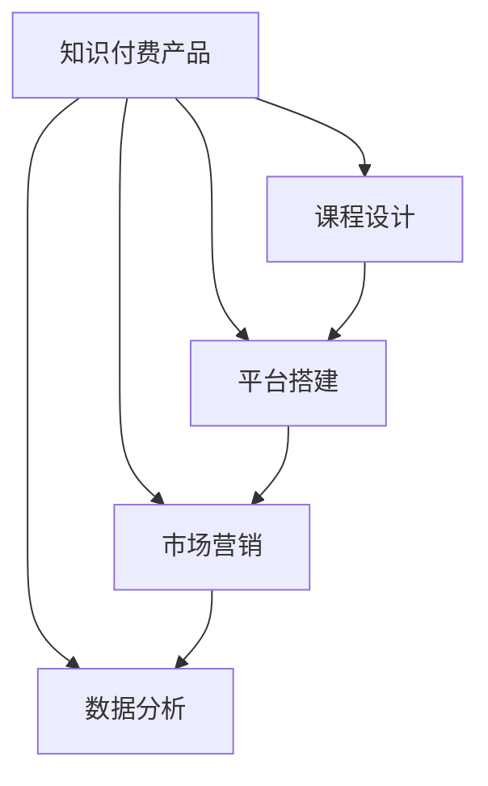

                 

# 打造垂直领域的知识付费产品:案例分析

> 关键词：知识付费产品, 垂直领域, 课程设计, 平台搭建, 用户体验, 内容营销, 数据分析

## 1. 背景介绍

### 1.1 问题由来
随着互联网和移动设备的普及，知识付费逐渐成为用户获取知识的重要途径。不同于传统的书籍、期刊等线下媒介，知识付费产品能够提供更加个性化、高效、互动的学习体验，推动知识传播方式的革新。

垂直领域的知识付费产品通过聚焦于特定行业或领域的知识，深入挖掘相关内容，满足用户对专业知识的精准需求。这一趋势在IT、金融、医疗、教育等诸多领域中不断涌现，显现出巨大的发展潜力。

### 1.2 问题核心关键点
打造垂直领域的知识付费产品，核心关键点在于以下几个方面：

- **用户需求分析**：识别目标用户的具体需求，确保内容与用户实际需求相匹配。
- **内容设计**：精心设计课程结构，确保知识的系统性、条理性和实用性。
- **平台搭建**：开发或使用已有的平台系统，确保内容发布和用户体验的流畅性。
- **市场营销**：制定有效的市场策略，吸引并转化潜在用户，提升品牌影响力。
- **数据分析**：基于用户行为数据，优化课程设计、改进用户体验，持续提升产品价值。

本文将从课程设计、平台搭建、市场营销、数据分析等维度，深入分析并指导垂直领域的知识付费产品打造流程，为行业开发者提供参考。

## 2. 核心概念与联系

### 2.1 核心概念概述

为了更好地理解知识付费产品打造的技术框架，本节将介绍几个密切相关的核心概念：

- **知识付费产品(Knowledge-based Subscription Products)**：以专业知识为核心的付费产品，如在线课程、电子书、视频教程等，用户通过付费获取高质量内容。
- **垂直领域(Vertical Markets)**：聚焦于特定行业或领域的知识付费产品，如IT、金融、医疗等。
- **课程设计(Course Design)**：根据用户需求和教育心理学原理，设计系统的课程结构和内容框架。
- **平台搭建(Platform Development)**：利用技术手段搭建知识付费平台，支持课程发布、用户交互、数据分析等功能。
- **市场营销(Market Strategies)**：通过多种营销手段吸引用户，并促使潜在用户转化为实际购买者。
- **数据分析(Analytical Tools)**：收集和分析用户行为数据，以数据驱动的方式优化产品设计和服务体验。

这些核心概念之间的逻辑关系可以通过以下Mermaid流程图来展示：



这个流程图展示了几大核心概念及其之间的联系：

1. 知识付费产品的核心是课程设计，课程设计的优劣直接影响用户满意度和产品价值。
2. 平台搭建是知识付费产品实现的基础，涉及课程发布、用户交互等功能。
3. 市场营销是知识付费产品推广和用户获取的重要手段，需精准定位目标用户。
4. 数据分析帮助评估用户行为，指导产品迭代和改进。

## 3. 核心算法原理 & 具体操作步骤
### 3.1 算法原理概述

知识付费产品打造过程中，涉及多个环节的协同工作，这些环节可以视为一个大型的系统工程，其中算法原理和操作步骤具有重要指导意义。

知识付费产品的核心在于内容的设计与交付。以在线课程为例，通常包括以下几个步骤：

1. **内容设计**：根据用户需求和行业知识，设计课程内容和结构。
2. **平台搭建**：开发或使用已有平台，提供课程发布、用户交互、数据分析等功能。
3. **市场营销**：利用多种营销手段，吸引并转化潜在用户。
4. **数据分析**：收集用户行为数据，进行分析和优化，提升用户体验。

本文将重点介绍内容设计和平台搭建的算法原理，市场营销和数据分析的具体操作步骤。

### 3.2 算法步骤详解

#### 3.2.1 内容设计

内容设计是知识付费产品打造的基石，其算法步骤主要包括以下几个方面：

1. **需求调研**：通过问卷调查、用户访谈等方式，收集用户需求和反馈，确定课程主题和内容重点。

2. **课程结构规划**：设计课程大纲，明确课程模块和知识点，确保内容的系统性和条理性。

3. **内容编写与制作**：根据课程结构，编写课程内容，并选择合适的媒体形式（如视频、文本、PPT等）。

4. **测试与优化**：通过用户测试，收集反馈，优化课程内容和教学方法。

5. **课程发布与更新**：将课程内容发布到平台，并根据用户反馈和市场变化，持续更新和优化课程内容。

#### 3.2.2 平台搭建

平台搭建是知识付费产品实现的基础，其算法步骤主要包括以下几个方面：

1. **需求分析**：分析课程发布、用户交互、数据分析等需求，确定平台功能和技术架构。

2. **系统设计**：设计系统的整体架构和功能模块，选择合适的技术和工具。

3. **系统实现**：开发或集成已有平台，实现课程发布、用户交互、数据分析等功能。

4. **测试与优化**：进行系统测试，确保平台的稳定性和用户体验，并根据用户反馈进行优化。

5. **部署与维护**：将平台部署到生产环境，并持续维护和更新，确保平台的持续运行。

### 3.3 算法优缺点

知识付费产品打造过程中，各环节的算法步骤有其独特的优势和局限性：

**内容设计的优点**：

1. 确保课程内容的系统性和实用性，满足用户需求。
2. 通过用户反馈不断优化课程设计，提升课程质量。

**内容设计的缺点**：

1. 内容设计需要大量的时间和精力，特别是专业性强的领域。
2. 设计过程中容易忽视用户的多样性和个性化需求。

**平台搭建的优点**：

1. 提供平台化的课程发布和用户交互功能，便于内容管理和用户互动。
2. 可扩展性强，支持未来功能的升级和优化。

**平台搭建的缺点**：

1. 开发成本高，特别是开发高质量、高性能的平台。
2. 系统复杂度较高，维护和更新难度大。

### 3.4 算法应用领域

知识付费产品打造技术广泛应用于IT、金融、医疗、教育等多个领域，具体应用场景如下：

- **IT技术培训**：如软件开发、数据科学、人工智能等，课程内容聚焦于行业技术知识和技能培训。
- **金融投资**：如股票分析、风险管理、财务管理等，课程内容侧重于金融市场分析与策略制定。
- **医疗健康**：如医学基础知识、临床技能、健康管理等，课程内容注重健康知识的普及和实践指导。
- **教育培训**：如基础教育、职业教育、高等教育等，课程内容覆盖学科知识、学习方法、考试技巧等。

这些应用场景展示了知识付费产品广泛的适用性，以及其在推动行业知识传播和技能提升方面的巨大潜力。

## 4. 数学模型和公式 & 详细讲解 & 举例说明

### 4.1 数学模型构建

知识付费产品的打造过程中，可以通过构建数学模型来指导各环节的优化和决策。以在线课程为例，数学模型主要包括以下几个方面：

1. **用户行为模型**：通过收集用户行为数据，建立用户行为预测模型，指导课程内容和推荐的优化。
2. **课程内容模型**：通过内容分析，建立课程内容与用户需求之间的匹配模型，提升课程的实用性和吸引力。
3. **营销效果模型**：通过营销数据，建立营销效果预测模型，指导市场策略的制定和优化。

### 4.2 公式推导过程

以用户行为模型为例，假设用户行为数据包括点击量、观看时长、互动次数等，可以建立以下线性回归模型：

$$
\hat{y} = \beta_0 + \beta_1 x_1 + \beta_2 x_2 + \ldots + \beta_n x_n + \epsilon
$$

其中，$y$ 表示用户行为评分，$x_i$ 表示用户行为特征，$\beta_i$ 表示特征系数，$\epsilon$ 表示误差项。

通过最小二乘法求解$\beta_i$，可以建立用户行为预测模型。具体推导过程如下：

$$
\hat{y} = \frac{\sum (y-\bar{y})\sum (x_i-\bar{x_i})}{\sum (x_i-\bar{x_i})^2}
$$

其中，$\bar{y}$ 和 $\bar{x_i}$ 分别表示用户行为评分和特征值的均值。

通过上述公式，可以建立用户行为预测模型，指导课程内容的优化和推荐。

### 4.3 案例分析与讲解

假设某在线课程平台收集到用户观看时长、互动次数、课程评分等数据，可以建立以下用户行为预测模型：

$$
\hat{y} = 5 + 2x_1 + 1x_2 + 0.5x_3
$$

其中，$x_1$ 表示用户观看时长，$x_2$ 表示用户互动次数，$x_3$ 表示课程评分。通过上述模型，可以预测用户未来行为，优化课程内容和推荐策略。

## 5. 项目实践：代码实例和详细解释说明

### 5.1 开发环境搭建

在进行知识付费产品打造项目实践前，我们需要准备好开发环境。以下是使用Python进行Django开发的环境配置流程：

1. 安装Anaconda：从官网下载并安装Anaconda，用于创建独立的Python环境。

2. 创建并激活虚拟环境：
```bash
conda create -n pyproject python=3.8 
conda activate pyproject
```

3. 安装Django：
```bash
pip install django==3.2.7
```

4. 安装必要的第三方库：
```bash
pip install django-rest-framework django-compressor django-cors-headers
```

5. 安装PostgreSQL：安装并配置PostgreSQL数据库，用于课程数据存储和查询。

6. 安装Redis：安装并配置Redis缓存，用于提升课程发布和用户交互的响应速度。

7. 安装ESL：安装并配置Elasticsearch搜索引擎，用于课程内容搜索和推荐。

完成上述步骤后，即可在`pyproject`环境中开始知识付费产品的打造实践。

### 5.2 源代码详细实现

这里以在线课程为例，给出使用Django进行课程发布和用户交互的PyTorch代码实现。

首先，定义课程模型：

```python
from django.db import models

class Course(models.Model):
    title = models.CharField(max_length=200)
    description = models.TextField()
    created_at = models.DateTimeField(auto_now_add=True)
    last_updated = models.DateTimeField(auto_now=True)
    
    def __str__(self):
        return self.title
```

然后，定义用户模型：

```python
from django.contrib.auth.models import AbstractUser

class User(AbstractUser):
    pass
```

接着，定义用户与课程的关联关系：

```python
from django.db import models

class CourseUser(models.Model):
    user = models.ForeignKey(User, on_delete=models.CASCADE)
    course = models.ForeignKey(Course, on_delete=models.CASCADE)
    is_completed = models.BooleanField(default=False)
    completed_at = models.DateTimeField(null=True, blank=True)
```

然后，定义用户交互数据模型：

```python
from django.db import models

class UserInteraction(models.Model):
    user = models.ForeignKey(User, on_delete=models.CASCADE)
    course = models.ForeignKey(Course, on_delete=models.CASCADE)
    interaction_type = models.CharField(max_length=50)
    timestamp = models.DateTimeField(auto_now_add=True)
```

最后，定义课程发布和用户交互的API接口：

```python
from django.http import JsonResponse
from django.views.decorators.csrf import csrf_exempt

@csrf_exempt
def publish_course(request):
    # 解析请求数据
    data = json.loads(request.body)
    
    # 创建课程对象
    course = Course.objects.create(title=data['title'], description=data['description'])
    
    # 返回JSON响应
    return JsonResponse({'id': course.id})

@csrf_exempt
def user_interaction(request):
    # 解析请求数据
    data = json.loads(request.body)
    
    # 创建用户交互对象
    interaction = UserInteraction.objects.create(user=User.objects.get(username=data['username']),
                                                course=Course.objects.get(id=data['course_id']),
                                                interaction_type=data['interaction_type'])
    
    # 返回JSON响应
    return JsonResponse({'id': interaction.id})
```

以上就是使用Django进行在线课程发布和用户交互的完整代码实现。可以看到，Django提供了丰富的Web框架功能，使课程发布和用户交互的实现变得简洁高效。

### 5.3 代码解读与分析

让我们再详细解读一下关键代码的实现细节：

**Course类**：
- `__str__`方法：返回课程的标题，便于打印输出。

**User类**：
- 继承自Django内置的`AbstractUser`类，重用已有用户模型。

**CourseUser类**：
- 定义了用户与课程之间的关联关系，标记用户是否已完成某课程。

**UserInteraction类**：
- 记录用户与课程的交互类型和时间戳。

**publish_course函数**：
- 解析JSON格式的请求数据，创建课程对象，并返回课程ID。
- 使用了`json.loads`将请求体中的JSON数据解析为Python对象。
- 使用了`Course.objects.create`创建课程对象，并返回其ID。

**user_interaction函数**：
- 解析JSON格式的请求数据，创建用户交互对象，并返回交互ID。
- 使用了`json.loads`将请求体中的JSON数据解析为Python对象。
- 使用了`User.objects.get`根据用户名获取用户对象。
- 使用了`Course.objects.get`根据课程ID获取课程对象。

**runserver命令**：
- 启动Django开发服务器，通过访问`http://localhost:8000`访问测试接口。

可以看到，Django提供了丰富的Web框架功能，使得课程发布和用户交互的实现变得简洁高效。开发者可以根据具体需求，灵活扩展Django框架的功能。

### 5.4 运行结果展示

启动Django开发服务器后，可以通过访问`http://localhost:8000`测试API接口的响应。具体运行结果如下：

**发布课程接口**：
- 请求数据：`{'title': 'Python基础', 'description': '本课程主要介绍Python基础知识'}`
- 返回结果：`{'id': 1}`

**用户交互接口**：
- 请求数据：`{'username': 'user1', 'course_id': 1, 'interaction_type': 'watch'}`
- 返回结果：`{'id': 1}`

## 6. 实际应用场景

### 6.1 智能在线教育

基于知识付费产品的平台搭建技术，智能在线教育领域得以快速发展。传统教育中，名师的课堂讲解往往难以覆盖更多学生，且教学资源难以长期保存。而在线教育平台能够将名师的课程资源数字化，供更多学生反复学习。

在线教育平台通常包括视频课程、文本资料、互动讨论等多个模块，为学生提供全方位的学习支持。课程设计需要考虑到不同年龄段、不同专业学生的特点，确保课程内容的多样性和实用性。

### 6.2 健康管理与教育

在线课程平台在健康管理和教育领域同样有广泛应用。例如，可以通过在线课程传授健康知识，如饮食、运动、心理调适等，帮助用户改善生活方式，提升健康水平。在线教育平台还可以用于提供职业技能培训，如编程、设计、管理等，帮助用户提升职业技能，增强就业竞争力。

这些平台通常需要设计系统化的课程结构，确保内容的专业性和系统性。同时，平台需要提供实时交互和反馈机制，帮助用户更好地理解和掌握课程内容。

### 6.3 企业内部培训

企业内部培训是知识付费产品的重要应用场景之一。通过在线课程平台，企业可以为员工提供定期培训，提升其职业技能和素质。

企业内部培训通常需要根据员工的需求和企业的实际业务需求，设计具有针对性的课程内容。同时，平台需要支持员工的学习进度跟踪和管理，确保培训效果和参与度。

### 6.4 未来应用展望

随着知识付费产品技术的不断发展，其在更多领域的应用前景将更加广阔。未来，知识付费产品将在智慧城市、智能制造、智慧农业等领域发挥重要作用，推动各行业的智能化转型升级。

在智慧城市治理中，在线课程平台可以提供各类智能科技知识，提升城市管理人员的科技素养。在智能制造和智慧农业中，在线课程平台可以提供相关技术和知识培训，提升从业人员的专业技能，推动相关产业的数字化、智能化发展。

## 7. 工具和资源推荐

### 7.1 学习资源推荐

为了帮助开发者系统掌握知识付费产品打造的技术基础和实践技巧，这里推荐一些优质的学习资源：

1. Django官方文档：Django官方文档详细介绍了Django框架的使用方法和最佳实践，是入门Django开发的必备资料。
2. Django实战教程：通过实践项目，深入讲解Django框架的各项功能，帮助开发者快速上手。
3. Django REST framework官方文档：Django REST framework提供了强大的API开发功能，官方文档详细介绍了其使用方式和最佳实践。
4. Django实战教程：通过实践项目，深入讲解Django REST framework的各项功能，帮助开发者快速上手。
5. ElasticSearch官方文档：ElasticSearch官方文档详细介绍了ElasticSearch的使用方法和最佳实践，是入门ElasticSearch开发的必备资料。

通过对这些资源的学习实践，相信你一定能够快速掌握知识付费产品打造的核心技术，并用于解决实际的NLP问题。

### 7.2 开发工具推荐

高效的开发离不开优秀的工具支持。以下是几款用于知识付费产品打造的常用工具：

1. Django：Python的开源Web框架，提供了丰富的Web开发功能，易于上手，适合快速迭代开发。
2. Django REST framework：基于Django框架的RESTful API开发工具，提供了强大的API开发和安全性保障。
3. Elasticsearch：分布式搜索引擎，提供了强大的搜索和分析能力，适合处理大规模数据。
4. Redis：高性能内存数据库，提供了丰富的数据结构和操作命令，适合缓存和实时数据处理。
5. PostgreSQL：开源关系型数据库，提供了丰富的数据模型和操作接口，适合复杂数据存储和查询。

合理利用这些工具，可以显著提升知识付费产品打造的开发效率，加快创新迭代的步伐。

### 7.3 相关论文推荐

知识付费产品打造技术源于学界的持续研究。以下是几篇奠基性的相关论文，推荐阅读：

1. 《构建高性能Web应用程序的实践》：介绍了Django框架的性能优化方法和最佳实践。
2. 《ElasticSearch搜索引擎的实用指南》：介绍了ElasticSearch的使用方法和最佳实践，适合入门学习。
3. 《Django REST framework实战》：通过实践项目，深入讲解Django REST framework的各项功能和最佳实践。
4. 《Django Web框架的高级技术》：介绍了Django框架的高级技术，如缓存、消息队列等，适合进阶学习。

这些论文代表了大规模知识付费产品打造技术的发展脉络。通过学习这些前沿成果，可以帮助研究者把握学科前进方向，激发更多的创新灵感。

## 8. 总结：未来发展趋势与挑战

### 8.1 总结

本文对知识付费产品的打造过程进行了全面系统的介绍。首先阐述了知识付费产品的研究背景和意义，明确了课程设计、平台搭建、市场营销、数据分析等环节的关键点。其次，从原理到实践，详细讲解了知识付费产品的算法原理和具体操作步骤，给出了知识付费产品打造的完整代码实例。同时，本文还广泛探讨了知识付费产品在不同行业的应用前景，展示了知识付费产品的巨大潜力。最后，本文精选了知识付费产品打造的各类学习资源，力求为读者提供全方位的技术指引。

通过本文的系统梳理，可以看到，知识付费产品打造技术正在成为在线教育、智能制造、健康管理等诸多领域的重要范式，极大地拓展了知识传播和技能提升的途径。未来，伴随技术的不懈探索和优化，知识付费产品必将在更多领域大放异彩，推动各行业的智能化转型升级。

### 8.2 未来发展趋势

展望未来，知识付费产品打造技术将呈现以下几个发展趋势：

1. 课程内容更加个性化和多样化。随着用户需求的多样化和个性化，未来的知识付费产品将更加注重个性化课程设计，提供多样化的学习路径。

2. 平台功能更加丰富和智能化。未来的知识付费平台将支持更多互动和个性化功能，如智能推荐、情感分析、学习路径优化等，提升用户体验。

3. 数据驱动的营销策略将更加精准和高效。未来的市场营销将更加依赖用户行为数据，通过大数据分析和机器学习算法，制定更加精准的营销策略。

4. 用户反馈机制将更加全面和及时。未来的知识付费产品将建立更加全面的用户反馈机制，及时收集和分析用户反馈，优化课程内容和平台体验。

5. 跨平台和跨领域的学习体验将更加无缝。未来的知识付费产品将支持多平台访问，实现跨平台、跨领域的无缝学习体验。

6. 人工智能技术将更加深入应用。未来的知识付费产品将更加深入地融合人工智能技术，如自然语言处理、计算机视觉、语音识别等，提供更加丰富和智能的学习体验。

以上趋势凸显了知识付费产品打造技术的广阔前景。这些方向的探索发展，必将进一步提升知识付费产品的用户体验和应用价值，推动知识传播方式的革新。

### 8.3 面临的挑战

尽管知识付费产品打造技术已经取得了瞩目成就，但在迈向更加智能化、普适化应用的过程中，它仍面临着诸多挑战：

1. 课程内容设计需要大量的时间和精力，特别是在专业性强的领域，设计高质量课程内容难度较大。

2. 平台开发和维护成本较高，特别是在需要高扩展性和高性能的系统中，开发和维护难度大。

3. 市场营销需要精准定位目标用户，但在用户需求多样化和个性化的背景下，精准营销难度大。

4. 数据分析需要大量数据和算法支持，数据采集和处理难度大。

5. 用户反馈机制需要全面覆盖用户行为，建立高效反馈机制难度大。

6. 人工智能技术的融合应用需要高水平技术支撑，技术门槛高。

正视知识付费产品打造面临的这些挑战，积极应对并寻求突破，将是大规模知识付费产品打造走向成熟的必由之路。相信随着学界和产业界的共同努力，这些挑战终将一一被克服，知识付费产品打造技术必将在构建人机协同的智能时代中扮演越来越重要的角色。

### 8.4 研究展望

面对知识付费产品打造所面临的种种挑战，未来的研究需要在以下几个方面寻求新的突破：

1. 探索更加高效和个性化的课程设计方法，如自适应学习路径、个性化推荐等，提升课程设计效率和用户满意度。

2. 研究更加智能化和高效的平台搭建技术，如基于区块链的平台构建、基于云原生架构的平台设计等，提升平台扩展性和安全性。

3. 融合更多人工智能技术，如自然语言处理、计算机视觉、语音识别等，提供更加丰富和智能的学习体验。

4. 研究更加精准和高效的用户行为分析技术，如情感分析、话题分类等，指导课程内容和营销策略的优化。

5. 探索更加全面和高效的用户反馈机制，如基于人工智能的自动反馈系统、基于社交网络的反馈机制等，提升用户反馈的全面性和及时性。

这些研究方向的探索，必将引领知识付费产品打造技术迈向更高的台阶，为知识传播和技能提升带来新的突破。面向未来，知识付费产品打造技术还需要与其他人工智能技术进行更深入的融合，如知识表示、因果推理、强化学习等，多路径协同发力，共同推动知识付费产品的发展和应用。

## 9. 附录：常见问题与解答

**Q1：如何设计高质量的课程内容？**

A: 设计高质量的课程内容需要遵循以下原则：

1. 目标明确：明确课程的总体目标和阶段性目标，确保内容系统性和条理性。

2. 用户导向：深入调研用户需求和反馈，设计符合用户实际需求的课程内容。

3. 互动性强：增加互动环节，如提问、讨论、作业等，提升用户参与度和学习效果。

4. 理论与实践结合：在理论知识的基础上，增加实践环节，提升用户应用能力。

5. 实时更新：根据用户反馈和市场变化，持续更新和优化课程内容，确保课程的时效性和实用性。

**Q2：如何提升知识付费产品的用户粘性？**

A: 提升知识付费产品的用户粘性需要从以下几个方面入手：

1. 互动设计：增加互动环节，如评论、点赞、分享等，提升用户参与度和粘性。

2. 推荐系统：引入个性化推荐系统，推荐用户感兴趣的课程和内容，提升用户留存率。

3. 社区建设：建立用户社区，增加用户间的互动和交流，提升用户粘性。

4. 持续优化：通过用户行为数据分析，不断优化课程内容和平台体验，提升用户满意度。

5. 用户激励：通过奖励机制、等级制度等，激励用户持续学习，提升用户粘性。

**Q3：知识付费产品如何实现跨平台访问？**

A: 知识付费产品实现跨平台访问可以通过以下技术手段：

1. 多端适配：开发多端适配方案，确保课程内容在不同平台和设备上的显示和交互一致性。

2. 数据同步：使用云服务实现数据同步，确保不同平台上的用户行为数据一致。

3. 接口标准化：制定统一的标准接口，确保不同平台间的互操作性。

4. 离线功能：提供离线功能，确保用户可以随时随地访问课程内容。

5. 多平台部署：在不同平台部署应用，提升覆盖率和用户体验。

**Q4：知识付费产品如何实现个性化推荐？**

A: 知识付费产品实现个性化推荐可以通过以下技术手段：

1. 用户画像：通过用户行为数据建立用户画像，分析用户兴趣和偏好。

2. 推荐算法：引入推荐算法，如协同过滤、内容推荐、混合推荐等，实现个性化推荐。

3. 实时更新：根据用户行为实时更新推荐结果，提升推荐效果。

4. 多维度推荐：引入多维度推荐，如内容推荐、用户推荐、基于兴趣的推荐等，提升推荐效果。

5. 反馈机制：引入用户反馈机制，根据用户反馈不断优化推荐算法和策略。

**Q5：知识付费产品如何实现高效数据分析？**

A: 知识付费产品实现高效数据分析可以通过以下技术手段：

1. 数据采集：通过API接口、日志等方式采集用户行为数据，建立数据仓库。

2. 数据清洗：对采集的数据进行清洗和处理，去除无效和噪声数据。

3. 数据分析：引入数据分析工具，如Python的Pandas、NumPy等，进行数据统计和分析。

4. 可视化：通过数据可视化工具，如Tableau、Power BI等，展示数据分析结果，指导课程设计和营销策略优化。

5. 预测建模：引入机器学习算法，进行用户行为预测和推荐模型训练，提升推荐效果和营销策略的精准性。

以上回答解决了知识付费产品打造过程中常见的问题，希望能为你提供有价值的参考和指导。

---

作者：禅与计算机程序设计艺术 / Zen and the Art of Computer Programming

