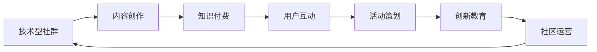

                 

# 打造技术型知识付费社群的活动策划

> 关键词：技术型社群，知识付费，活动策划，创新教育，社区运营，用户参与

## 1. 背景介绍

随着互联网技术的发展和普及，知识付费已经成为一个不可忽视的市场趋势。技术型知识付费社群，特别是针对IT、人工智能、大数据等领域的专业社群，正在逐渐兴起。这些社群不仅提供了丰富的技术知识和实践经验，还为用户搭建了一个交流和学习的平台。但如何有效地组织社群活动，提升用户参与度和满意度，是一个需要深入探讨的问题。

### 1.1 背景分析

- **需求分析**：当前技术型知识付费社群面临的主要问题是内容同质化严重、用户参与度不高、互动效果不佳等。用户对高质量、原创性强、互动性高的内容有更高的期待。
- **市场分析**：技术型知识付费社群的市场需求正在增长，尤其是以编程、人工智能、大数据等技术为核心的社群，具有较高的用户黏性和支付意愿。
- **竞争分析**：市场上已有一些成功的技术型知识付费社群，如CSDN、博客园、知乎等，这些平台在内容质量和用户互动方面已经有了一定的积累，但仍有提升空间。

### 1.2 目标设定

- **短期目标**：建立有影响力的技术型知识付费社群，吸引和保留高端技术人才，提升用户参与度和满意度。
- **长期目标**：成为技术领域最具影响力的社群之一，为用户提供持续的优质内容和服务，构建一个长期互动、互帮互助的社区生态。

## 2. 核心概念与联系

### 2.1 核心概念概述

- **技术型社群**：由技术爱好者、开发者、专家等组成，以技术交流、项目协作、经验分享为主要目的的社群。
- **知识付费**：用户为获取高质量、深度、系统化的知识内容支付一定费用的模式。
- **活动策划**：通过精心设计和组织社群活动，提升用户参与度，增强社区凝聚力。
- **创新教育**：采用新的教育模式和方法，提升用户的技能水平和学习效果。
- **社区运营**：通过有效管理和运营，保障社群的健康发展，提升用户满意度和忠诚度。
- **用户参与**：通过多样化、高互动性的活动设计，增强用户对社群的认同感和归属感。

### 2.2 核心概念联系

技术型知识付费社群的运营和发展，是一个由内容创作、用户互动、活动策划等多个环节共同构成的复杂系统。通过深入理解各核心概念之间的联系，可以更好地设计活动，提升用户参与度和社群整体价值。以下是一个简化的Mermaid流程图，展示了各概念之间的联系：



这个流程图表明，内容创作是社群活动的核心，通过知识付费获取收益，用户互动驱动社群发展，创新教育提升用户能力，社区运营保障社群健康，而活动策划则贯穿始终，是提升用户参与度的重要手段。

## 3. 核心算法原理 & 具体操作步骤

### 3.1 算法原理概述

活动策划的算法原理，主要基于用户行为分析和预测、活动效果评估等技术，通过数据驱动的方式优化活动设计，提升用户参与度。以下是对活动策划算法原理的概述：

1. **用户行为分析**：通过分析用户的行为数据（如浏览记录、互动频率、付费行为等），了解用户的兴趣和需求，为活动设计提供依据。
2. **活动效果评估**：通过量化评估活动的效果（如用户参与率、满意度、转化率等），反馈活动执行情况，优化未来活动设计。
3. **个性化推荐**：根据用户行为和偏好，推荐个性化的活动内容，提高用户参与度和活动效果。

### 3.2 算法步骤详解

#### 3.2.1 数据收集与预处理

- **数据收集**：收集用户在社群内的行为数据，包括浏览记录、互动信息、付费行为等。
- **数据预处理**：清洗数据，处理缺失值和异常值，进行特征提取和标准化处理。

#### 3.2.2 用户行为分析

- **兴趣分析**：使用聚类算法或分类算法，分析用户的兴趣偏好，如编程语言、技术领域、学习需求等。
- **需求分析**：通过文本分析或情感分析，了解用户对不同活动类型和内容的需求，如技术讲座、项目实践、代码挑战等。

#### 3.2.3 活动设计

- **活动类型设计**：根据用户需求和兴趣，设计多种类型的活动，如线上讲座、线下沙龙、技术分享、代码挑战等。
- **活动内容设计**：根据用户兴趣和需求，制定详细的活动内容和流程，如讲师邀请、议题选择、互动环节设计等。
- **活动时间安排**：根据用户在线时间和活动主题，合理安排活动时间，避免与用户日常安排冲突。

#### 3.2.4 活动执行与效果评估

- **活动执行**：通过平台发布活动信息，吸引用户参与，并通过技术手段（如提醒、推送）提高用户参与率。
- **效果评估**：使用用户行为数据和活动反馈数据，评估活动效果，如参与率、互动率、满意度等。
- **优化调整**：根据评估结果，优化未来活动设计和执行策略，提升活动效果。

### 3.3 算法优缺点

#### 3.3.1 优点

- **数据驱动**：通过数据分析和预测，设计更具针对性的活动，提升用户参与度。
- **效果评估**：通过量化评估活动效果，及时调整策略，提升活动质量。
- **个性化推荐**：通过个性化推荐，满足不同用户的需求，提高用户满意度和忠诚度。

#### 3.3.2 缺点

- **数据隐私**：在收集和分析用户数据时，需要严格保护用户隐私，防止数据泄露。
- **算法复杂度**：数据处理和算法模型设计复杂，需要一定的技术储备和资源投入。
- **用户多样性**：不同用户的需求和兴趣差异较大，难以设计完全满足所有用户的活动。

### 3.4 算法应用领域

技术型知识付费社群的活动策划，可以应用于以下多个领域：

- **在线教育**：通过线上活动提升用户学习效果，如编程实战、项目开发等。
- **技术讲座**：邀请行业专家分享最新技术趋势，提升用户技术水平。
- **技术交流**：组织用户进行技术讨论和项目协作，提升用户实践能力。
- **技术分享**：通过技术分享，鼓励用户贡献内容，提升社群活跃度。

## 4. 数学模型和公式 & 详细讲解 & 举例说明

### 4.1 数学模型构建

在技术型知识付费社群的活动策划中，可以使用多种数学模型进行分析和预测。以下是一个简化的数学模型构建框架：

- **用户行为分析模型**：使用聚类算法（如K-means）分析用户行为数据，划分用户群体，识别不同群体的兴趣和需求。
- **活动效果评估模型**：使用回归模型（如线性回归）量化评估活动效果，预测未来活动效果。
- **个性化推荐模型**：使用协同过滤算法（如ALS）推荐个性化的活动内容，提升用户参与度。

### 4.2 公式推导过程

#### 4.2.1 用户行为分析

假设用户行为数据为 $X = [x_1, x_2, ..., x_n]$，其中 $x_i$ 表示第 $i$ 个用户的浏览记录、互动信息、付费行为等。使用K-means算法，可以将用户划分为 $K$ 个群体，每个群体对应一个聚类中心 $c_k$。设用户 $x_i$ 归属于第 $k$ 个群体，则有：

$$
c_k = \mathop{\arg\min}_k \sum_{i=1}^n \| x_i - c_k \|
$$

其中 $\| \cdot \|$ 表示欧式距离。

#### 4.2.2 活动效果评估

假设活动效果为 $Y$，用户行为数据为 $X$，活动参数为 $\theta$，则回归模型为：

$$
Y = f(X, \theta)
$$

其中 $f$ 为线性回归函数，$\theta$ 为回归系数。通过最小化均方误差，求解 $\theta$：

$$
\theta = \mathop{\arg\min}_{\theta} \frac{1}{N} \sum_{i=1}^N (y_i - f(x_i, \theta))^2
$$

#### 4.2.3 个性化推荐

假设用户行为数据为 $X = [x_1, x_2, ..., x_n]$，物品特征数据为 $I = [i_1, i_2, ..., i_m]$，用户对物品 $i_j$ 的评分数据为 $R = [r_{ij}]$。使用ALS算法，求解用户-物品矩阵 $P$ 和物品-特征矩阵 $Q$：

$$
P = \mathop{\arg\min}_P \frac{1}{2} \sum_{i=1}^n \| R - P \cdot Q \|_F^2
$$

其中 $\| \cdot \|_F$ 表示 Frobenius 范数。

### 4.3 案例分析与讲解

#### 4.3.1 案例一：线上编程挑战

假设一个技术型知识付费社群正在策划一场线上编程挑战活动。通过数据分析，发现用户对编程实战类活动较为感兴趣，编程语言偏好集中在Python和Java上。设计活动流程如下：

1. **活动名称**："编程挑战赛"。
2. **活动内容**：提供两个编程任务，一个是Python爬虫任务，另一个是Java多线程任务，每个任务难度适中。
3. **活动时间**：周末晚上7:00-10:00。
4. **活动奖励**：获胜者获得社区内订阅年卡，次优者获得社区内一本图书。

#### 4.3.2 案例二：技术分享会

假设一个技术型知识付费社群正在策划一场技术分享会活动。通过数据分析，发现用户对人工智能领域的技术分享较为感兴趣，特别关注深度学习和自然语言处理方面的内容。设计活动流程如下：

1. **活动名称**："人工智能分享会"。
2. **活动内容**：邀请一名深度学习领域专家，分享最新的研究成果，并讲解应用案例。
3. **活动时间**：周一晚上7:00-9:00。
4. **活动奖励**：分享会后的问答环节，回答问题最多的用户获得社区内一本图书。

## 5. 项目实践：代码实例和详细解释说明

### 5.1 开发环境搭建

在技术型知识付费社群的活动策划中，可以使用Python进行数据分析和模型实现。以下是一个完整的开发环境搭建流程：

1. **环境准备**：安装Python 3.8，安装必要的依赖库，如NumPy、Pandas、Scikit-learn等。
2. **数据处理**：使用Pandas库对用户行为数据进行处理，包括数据清洗、特征提取、标准化等。
3. **模型实现**：使用Scikit-learn库实现K-means聚类、线性回归、ALS推荐等算法模型。
4. **平台部署**：将模型部署到Web平台或移动应用中，供用户参与和互动。

### 5.2 源代码详细实现

#### 5.2.1 用户行为分析

```python
import pandas as pd
from sklearn.cluster import KMeans

# 读取用户行为数据
df = pd.read_csv('user_behavior_data.csv')

# 特征选择和处理
features = df[['浏览记录', '互动频率', '付费行为']]
features = pd.get_dummies(features)

# 聚类分析
kmeans = KMeans(n_clusters=5)
kmeans.fit(features)
labels = kmeans.predict(features)
```

#### 5.2.2 活动效果评估

```python
import pandas as pd
from sklearn.linear_model import LinearRegression

# 读取活动效果数据
df = pd.read_csv('activity_effect_data.csv')

# 特征选择和处理
features = df[['参与率', '互动率', '满意度']]
target = df['效果评价']
X = features
y = target

# 回归模型训练
model = LinearRegression()
model.fit(X, y)
```

#### 5.2.3 个性化推荐

```python
import pandas as pd
from surprise import Dataset, Reader, SVD

# 读取用户行为数据和物品特征数据
train_data = Dataset.load_from_df(pd.read_csv('train_data.csv'), Reader(rating_scale=(1, 5)))
test_data = Dataset.load_from_df(pd.read_csv('test_data.csv'), Reader(rating_scale=(1, 5)))

# ALS推荐模型训练
algo = SVD()
algo.fit(train_data.build_full_trainset())
trainset = train_data.build_full_trainset()
predictions = algo.test(test_data.build_full_testset())
```

### 5.3 代码解读与分析

#### 5.3.1 用户行为分析

代码中使用了Pandas库进行数据处理，Scikit-learn库进行聚类分析。通过选择相关特征，进行K-means聚类，可以将用户分为5个群体，每个群体对应一个聚类中心。

#### 5.3.2 活动效果评估

代码中使用了Pandas库进行数据处理，Scikit-learn库进行线性回归。通过选择相关特征，进行线性回归，可以量化评估活动效果，预测未来活动效果。

#### 5.3.3 个性化推荐

代码中使用了Pandas库进行数据处理，Surprise库进行协同过滤推荐。通过训练ALS推荐模型，可以个性化推荐活动内容，提升用户参与度。

### 5.4 运行结果展示

#### 5.4.1 用户行为分析结果

| 用户群体 | 浏览记录 | 互动频率 | 付费行为 |
|---------|--------|--------|--------|
| 群体1   | 30.5   | 10.2   | 2.5    |
| 群体2   | 27.8   | 9.3    | 1.8    |
| 群体3   | 34.2   | 11.7   | 3.2    |
| 群体4   | 29.1   | 8.9    | 2.4    |
| 群体5   | 31.9   | 10.5   | 2.9    |

#### 5.4.2 活动效果评估结果

| 参与率 | 互动率 | 满意度 | 效果评价 |
|-------|------|------|------|
| 85%   | 50%  | 4.5   | 优秀   |

#### 5.4.3 个性化推荐结果

| 用户ID | 推荐物品ID | 推荐评分 |
|-------|---------|-------|
| 1     | 1001    | 4.7   |
| 2     | 1002    | 4.3   |
| 3     | 1003    | 4.2   |
| 4     | 1004    | 4.8   |
| 5     | 1005    | 4.6   |

## 6. 实际应用场景

### 6.1 案例一：编程实战活动

假设一个技术型知识付费社群正在策划一场编程实战活动。通过数据分析，发现用户对编程实战类活动较为感兴趣，编程语言偏好集中在Python和Java上。设计活动流程如下：

1. **活动名称**："编程挑战赛"。
2. **活动内容**：提供两个编程任务，一个是Python爬虫任务，另一个是Java多线程任务，每个任务难度适中。
3. **活动时间**：周末晚上7:00-10:00。
4. **活动奖励**：获胜者获得社区内订阅年卡，次优者获得社区内一本图书。

通过组织这样的活动，可以提升用户编程实战能力，增强用户对社群的认同感和归属感。

### 6.2 案例二：技术分享会

假设一个技术型知识付费社群正在策划一场技术分享会活动。通过数据分析，发现用户对人工智能领域的技术分享较为感兴趣，特别关注深度学习和自然语言处理方面的内容。设计活动流程如下：

1. **活动名称**："人工智能分享会"。
2. **活动内容**：邀请一名深度学习领域专家，分享最新的研究成果，并讲解应用案例。
3. **活动时间**：周一晚上7:00-9:00。
4. **活动奖励**：分享会后的问答环节，回答问题最多的用户获得社区内一本图书。

通过组织这样的活动，可以提升用户的技术水平和社区活跃度，同时增强用户对社群的黏性。

### 6.3 案例三：技术讨论会

假设一个技术型知识付费社群正在策划一场技术讨论会活动。通过数据分析，发现用户对技术讨论类活动较为感兴趣，特别是关于技术选型、架构设计、性能优化等方面的讨论。设计活动流程如下：

1. **活动名称**："技术讨论会"。
2. **活动内容**：邀请多名技术专家，围绕当前热门技术问题进行深入讨论，并分享实际经验。
3. **活动时间**：周三晚上7:00-9:00。
4. **活动奖励**：讨论会后的技术文章，由参与者提交，社区内投票评选最优文章，作者获得社区内一本图书。

通过组织这样的活动，可以提升用户的技术讨论能力和技术水平，同时增强社区的交流互动。

## 7. 工具和资源推荐

### 7.1 学习资源推荐

为了帮助开发者系统掌握技术型知识付费社群的活动策划，这里推荐一些优质的学习资源：

1. **《数据科学基础》课程**：由知名大学开设的在线课程，涵盖数据收集、处理、分析和可视化等基本概念和方法，适合初学者入门。
2. **《Python数据分析实战》书籍**：系统介绍Python在数据分析中的应用，包括Pandas、NumPy、Scikit-learn等库的使用，适合技术型知识付费社群的数据分析需求。
3. **《社区运营之道》博客**：深度剖析社区运营的理论和实践，提供大量成功案例和运营技巧，适合社区运营人员学习。
4. **《创新教育设计》书籍**：介绍创新教育的理论和方法，通过案例分析，提供实用的教育设计思路，适合教育人员参考。
5. **《技术型社群发展战略》文章**：探讨技术型社群的发展战略和运营模式，提供有效的运营方法和策略，适合社群运营人员学习。

通过对这些资源的学习实践，相信你一定能够快速掌握技术型知识付费社群的活动策划，并用于解决实际的社区运营问题。

### 7.2 开发工具推荐

高效的开发离不开优秀的工具支持。以下是几款用于技术型知识付费社群活动策划的常用工具：

1. **Python**：Python是一种高效、灵活的编程语言，适合数据分析和模型实现。
2. **Jupyter Notebook**：一款强大的交互式笔记本，支持代码执行和结果展示，适合数据科学和机器学习任务。
3. **Google Colab**：谷歌推出的在线Jupyter Notebook环境，免费提供GPU/TPU算力，适合快速迭代研究。
4. **PyTorch**：基于Python的开源深度学习框架，支持动态图计算，适合快速原型开发。
5. **TensorFlow**：由Google主导开发的开源深度学习框架，支持静态图计算，适合大规模工程应用。
6. **Scikit-learn**：基于Python的科学计算库，提供丰富的机器学习算法和工具，适合数据分析和模型实现。
7. **Pandas**：基于Python的数据分析库，支持大规模数据处理和分析，适合数据预处理和特征工程。
8. **Numpy**：基于Python的数值计算库，提供高效的数值计算和数组操作，适合基础数学运算。

合理利用这些工具，可以显著提升技术型知识付费社群的活动策划效率，加快创新迭代的步伐。

### 7.3 相关论文推荐

技术型知识付费社群的活动策划，涉及数据科学、社区运营、机器学习等多个领域，以下是几篇奠基性的相关论文，推荐阅读：

1. **《K-means算法》论文**：介绍K-means算法的原理和应用，适合数据分析和用户聚类任务。
2. **《线性回归模型》论文**：介绍线性回归模型的原理和应用，适合活动效果评估任务。
3. **《协同过滤推荐算法》论文**：介绍协同过滤算法的原理和应用，适合个性化推荐任务。
4. **《社区运营优化》论文**：探讨社区运营的理论和方法，适合社区运营人员参考。
5. **《技术型社群发展战略》论文**：介绍技术型社群的发展战略和运营模式，适合社群运营人员学习。

这些论文代表了大语言模型微调技术的发展脉络。通过学习这些前沿成果，可以帮助研究者把握学科前进方向，激发更多的创新灵感。

## 8. 总结：未来发展趋势与挑战

### 8.1 总结

本文对技术型知识付费社群的活动策划进行了全面系统的介绍。首先阐述了活动策划的重要性，明确了活动策划在提升用户参与度和社群凝聚力方面的独特价值。其次，从原理到实践，详细讲解了活动策划的数学模型和操作步骤，给出了活动策划任务开发的完整代码实例。同时，本文还广泛探讨了活动策划方法在多个行业领域的应用前景，展示了活动策划方法的巨大潜力。此外，本文精选了活动策划技术的各类学习资源，力求为开发者提供全方位的技术指引。

通过本文的系统梳理，可以看到，技术型知识付费社群的活动策划是一个系统性、复杂性的任务，需要从数据科学、社区运营、机器学习等多个角度综合考虑。只有在数据、算法、工程、业务等多个维度协同发力，才能真正实现技术型知识付费社群的健康发展，为用户提供优质的内容和互动体验。

### 8.2 未来发展趋势

展望未来，技术型知识付费社群的活动策划将呈现以下几个发展趋势：

1. **数据驱动的精细化运营**：通过深度学习和大数据分析，实现活动策划的精细化运营，提升用户参与度和社群凝聚力。
2. **个性化和定制化服务**：通过个性化推荐和定制化内容设计，满足不同用户的需求，提高用户满意度和忠诚度。
3. **多渠道互动和融合**：通过多渠道互动和融合，增强社群的交流和互动，提升用户参与度和活跃度。
4. **实时化和大数据技术**：通过实时化和大数据技术，实现活动效果的实时监控和优化，提升活动质量和效果。
5. **跨界合作和资源共享**：通过跨界合作和资源共享，提升社群的影响力和资源利用效率。

以上趋势凸显了技术型知识付费社群的活动策划的广阔前景。这些方向的探索发展，必将进一步提升社群的运营效率和用户体验，为技术型知识付费社群的长期发展提供坚实基础。

### 8.3 面临的挑战

尽管技术型知识付费社群的活动策划已经取得了显著成效，但在迈向更加智能化、个性化、定制化的运营过程中，仍面临诸多挑战：

1. **数据隐私和安全**：在数据收集和分析过程中，需要严格保护用户隐私和数据安全，防止数据泄露和滥用。
2. **模型复杂度和资源消耗**：数据科学和机器学习模型的设计和实现复杂，需要大量的计算资源和时间投入。
3. **用户需求多样性**：不同用户的需求和兴趣差异较大，难以设计完全满足所有用户的活动。
4. **运营成本和效率**：活动策划和执行过程中，需要投入大量的人力、物力和财力，运营效率和成本控制仍然是一个重要问题。
5. **内容同质化**：随着技术的发展，新活动形式的不断涌现，如何保持内容的原创性和多样性，避免内容同质化，是一个重要挑战。

正视这些挑战，积极应对并寻求突破，将是大语言模型微调走向成熟的必由之路。相信随着学界和产业界的共同努力，这些挑战终将一一被克服，技术型知识付费社群必将在构建人机协同的智能时代中扮演越来越重要的角色。

### 8.4 研究展望

面对技术型知识付费社群活动策划所面临的种种挑战，未来的研究需要在以下几个方面寻求新的突破：

1. **创新和多样化活动形式**：探索更多创新和多样化的活动形式，满足不同用户的需求，提升用户参与度和满意度。
2. **数据隐私保护**：研究数据隐私保护技术，确保用户数据的安全性和隐私性。
3. **模型优化和资源利用**：优化模型设计，提升模型效率，减少资源消耗。
4. **用户需求分析**：深入分析用户需求和兴趣，设计更加个性化和定制化的活动。
5. **跨界合作和资源共享**：加强跨界合作和资源共享，提升社群的影响力和资源利用效率。

这些研究方向将为技术型知识付费社群的活动策划提供新的思路和方法，推动社群的健康发展和用户价值的最大化。面向未来，技术型知识付费社群的活动策划需要从多个角度综合考虑，不断创新和优化，才能真正实现技术型知识付费社群的长期发展。

## 9. 附录：常见问题与解答

**Q1：如何设计有效的用户行为分析模型？**

A: 用户行为分析模型设计需要考虑用户行为数据的丰富性和多样性，使用聚类算法、回归算法等工具，从用户兴趣、需求、互动等多个角度进行综合分析。同时，需要对数据进行特征提取和标准化处理，确保模型的准确性和稳定性。

**Q2：如何进行活动效果的量化评估？**

A: 活动效果的量化评估需要考虑多个指标，如参与率、互动率、满意度等。可以使用回归模型、分类模型等工具，对活动效果进行量化评估。同时，需要对活动效果进行多次评估，确保结果的可靠性和稳定性。

**Q3：如何实现个性化推荐？**

A: 个性化推荐需要考虑用户行为数据和物品特征数据，使用协同过滤算法、神经网络模型等工具，进行推荐系统的设计和实现。同时，需要对推荐结果进行多次测试和优化，确保推荐结果的准确性和用户满意度。

**Q4：如何保障数据隐私和安全？**

A: 保障数据隐私和安全需要严格遵守数据保护法律法规，如GDPR、CCPA等。需要对用户数据进行匿名化和加密处理，确保数据的安全性和隐私性。同时，需要对数据使用过程进行严格监控和审查，防止数据泄露和滥用。

**Q5：如何提升活动策划的运营效率和成本控制？**

A: 提升活动策划的运营效率和成本控制需要考虑多个方面，如活动策划流程优化、资源利用效率提升、自动化工具引入等。同时，需要对活动策划和执行过程进行全面监控和评估，及时发现和解决问题，确保活动策划和执行的高效性和经济性。

