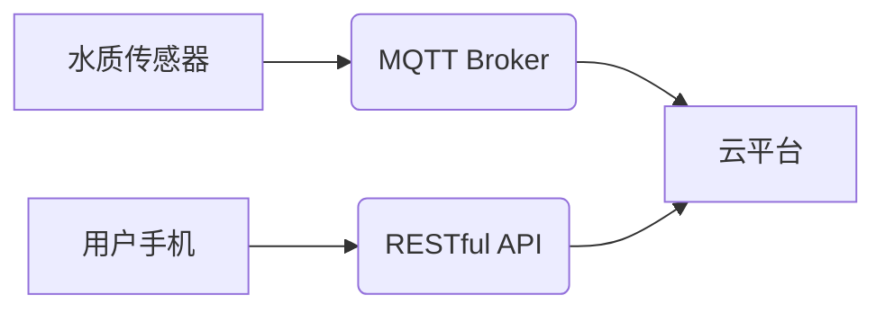

> MQTT, RESTful API, 智能家居, 水质监测, 物联网, 数据采集, 数据分析, 云平台

## 1. 背景介绍

随着物联网技术的快速发展，智能家居已成为现代生活的重要组成部分。智能家居系统能够通过传感器、 actuators 和网络连接，实现对家居环境的智能控制和管理，提升人们的生活品质和安全保障。其中，水质监测作为智能家居的重要功能之一，能够实时监测家庭用水的水质状况，及时提醒用户潜在的健康风险，保障家庭用水安全。

传统的家庭水质监测系统通常依赖于独立的硬件设备，缺乏数据共享和远程控制功能。随着云计算和物联网技术的融合，基于MQTT协议和RESTful API的智能家居水质监测系统应运而生，它能够实现数据实时采集、远程监控、智能分析和报警提醒等功能，为用户提供更加便捷、智能和安全的用水体验。

## 2. 核心概念与联系

### 2.1 MQTT协议

MQTT（Message Queuing Telemetry Transport）是一种轻量级的消息传输协议，专门设计用于物联网应用场景。它采用发布/订阅模式，能够实现设备和服务器之间的数据传输，即使网络连接不稳定也能保证消息的可靠传递。

### 2.2 RESTful API

RESTful API（Representational State Transfer Application Programming Interface）是一种基于互联网协议的软件架构风格，它使用HTTP协议进行资源访问和操作。RESTful API具有以下特点：

* 基于资源：数据以资源的形式表示，每个资源都有唯一的标识符。
* 使用HTTP方法：使用GET、POST、PUT、DELETE等HTTP方法进行资源操作。
* 状态转移：API操作会改变资源的状态。
* 无状态：每个请求都是独立的，服务器不需要记住之前的请求状态。

### 2.3 系统架构

基于MQTT协议和RESTful API的智能家居水质监测系统架构如下：



**系统架构说明：**

* 水质传感器采集水质数据，通过MQTT协议发布到MQTT Broker。
* MQTT Broker负责消息的转发和路由，将水质数据转发到云平台。
* 云平台负责数据存储、分析和处理，并通过RESTful API提供数据查询和控制接口。
* 用户手机通过RESTful API连接云平台，实时查看水质数据、设置报警阈值和控制设备。

## 3. 核心算法原理 & 具体操作步骤

### 3.1  算法原理概述

智能家居水质监测系统主要采用以下算法原理：

* **数据采集和预处理：** 水质传感器采集水质数据，并进行必要的预处理，例如去除噪声、数据校准等。
* **数据分析和特征提取：** 对预处理后的水质数据进行分析，提取关键特征，例如pH值、浊度、电导率等。
* **水质判定和报警：** 根据提取的特征和预设的阈值，判定水质是否合格，并触发报警提醒。

### 3.2  算法步骤详解

1. **数据采集：** 水质传感器采集水质数据，例如pH值、浊度、电导率等。
2. **数据预处理：** 对采集到的水质数据进行预处理，例如去除噪声、数据校准等。
3. **数据分析：** 对预处理后的水质数据进行分析，提取关键特征，例如pH值、浊度、电导率等。
4. **水质判定：** 根据提取的特征和预设的阈值，判定水质是否合格。
5. **报警提醒：** 如果水质不合格，触发报警提醒，通知用户采取相应的措施。

### 3.3  算法优缺点

**优点：**

* 能够实时监测水质状况，及时发现潜在的健康风险。
* 采用MQTT协议和RESTful API，实现数据共享和远程控制功能。
* 可根据用户需求定制报警阈值和提醒方式。

**缺点：**

* 需要专业的传感器和硬件设备。
* 数据分析算法需要不断优化和完善。
* 系统安全性需要得到保障。

### 3.4  算法应用领域

* 智能家居
* 水质监测系统
* 工业生产过程监控
* 环境监测

## 4. 数学模型和公式 & 详细讲解 & 举例说明

### 4.1  数学模型构建

水质监测系统中，常用的数学模型包括：

* **pH值计算模型：** pH值是衡量水溶液酸碱性的重要指标，其计算公式如下：

$$pH = -log_{10}[H^+]$$

其中，$[H^+]$表示水溶液中氢离子浓度。

* **浊度计算模型：** 浊度是指水溶液中悬浮颗粒物对光线的散射程度，其计算公式如下：

$$Turbidity = \frac{I_0 - I}{I_0}$$

其中，$I_0$表示入射光强度，$I$表示透过水溶液的光强度。

* **电导率计算模型：** 电导率是指水溶液导电能力的强弱，其计算公式如下：

$$Conductivity = \frac{1}{R \cdot A}$$

其中，$R$表示水溶液的电阻，$A$表示电极之间的面积。

### 4.2  公式推导过程

上述公式的推导过程基于物理学和化学原理，例如电化学原理、光学原理等。

### 4.3  案例分析与讲解

假设水质传感器采集到以下数据：

* pH值：7.2
* 浊度：10 NTU
* 电导率：500 μS/cm

根据上述公式，我们可以计算出水质的酸碱度、悬浮颗粒物含量和导电能力。

## 5. 项目实践：代码实例和详细解释说明

### 5.1  开发环境搭建

* 操作系统：Ubuntu 20.04 LTS
* 编程语言：Python 3.8
* 开发工具：VS Code
* 软件包：

```
pip install paho-mqtt requests
```

### 5.2  源代码详细实现

```python
# mqtt_client.py

import paho.mqtt.client as mqtt

# MQTT Broker地址
MQTT_BROKER = "mqtt.example.com"
# MQTT主题
MQTT_TOPIC = "water_quality"

def on_connect(client, userdata, flags, rc):
    if rc == 0:
        print("Connected to MQTT Broker!")
        client.subscribe(MQTT_TOPIC)
    else:
        print("Connection failed!")

def on_message(client, userdata, msg):
    print(f"Received message: {msg.payload.decode()}")

client = mqtt.Client()
client.on_connect = on_connect
client.on_message = on_message
client.connect(MQTT_BROKER)
client.loop_forever()

# rest_api.py

import requests

# 云平台API地址
API_URL = "https://api.example.com/water_quality"

def get_water_quality():
    response = requests.get(API_URL)
    if response.status_code == 200:
        return response.json()
    else:
        return None

# 获取水质数据
water_quality = get_water_quality()
if water_quality:
    print(f"Water quality: {water_quality}")
```

### 5.3  代码解读与分析

* `mqtt_client.py` 文件实现MQTT客户端，连接到MQTT Broker，订阅水质主题，接收水质数据。
* `rest_api.py` 文件实现RESTful API客户端，连接到云平台API，获取水质数据。

### 5.4  运行结果展示

运行上述代码，可以实现以下功能：

* 水质传感器采集水质数据，通过MQTT协议发布到MQTT Broker。
* 云平台接收水质数据，并通过RESTful API提供数据查询和控制接口。
* 用户手机通过RESTful API连接云平台，实时查看水质数据。

## 6. 实际应用场景

### 6.1 家庭用水安全监测

智能家居水质监测系统可以实时监测家庭用水的水质状况，例如pH值、浊度、电导率等，及时提醒用户潜在的健康风险，保障家庭用水安全。

### 6.2 水质污染源追踪

通过部署多个水质监测传感器，可以构建水质监测网络，追踪水质污染源，及时采取措施进行治理。

### 6.3 水资源管理

水质监测数据可以用于水资源管理，例如评估水资源质量、制定水资源利用方案等。

### 6.4 未来应用展望

随着物联网技术的不断发展，基于MQTT协议和RESTful API的智能家居水质监测系统将拥有更加广泛的应用场景，例如：

* 智能农业：监测土壤水质，优化灌溉方案。
* 水产养殖：监测水质，保障养殖动物健康。
* 水处理厂：监测水质，优化水处理工艺。

## 7. 工具和资源推荐

### 7.1 学习资源推荐

* MQTT协议官方文档：https://mqtt.org/
* RESTful API设计规范：https://restfulapi.net/

### 7.2 开发工具推荐

* VS Code：https://code.visualstudio.com/
* Eclipse Paho MQTT Client：https://github.com/eclipse/paho.mqtt.python

### 7.3 相关论文推荐

* 基于MQTT协议的智能家居水质监测系统设计与实现
* RESTful API在物联网中的应用研究

## 8. 总结：未来发展趋势与挑战

### 8.1 研究成果总结

基于MQTT协议和RESTful API的智能家居水质监测系统能够实现数据实时采集、远程监控、智能分析和报警提醒等功能，为用户提供更加便捷、智能和安全的用水体验。

### 8.2 未来发展趋势

* **人工智能技术应用：** 将人工智能技术应用于水质数据分析，实现更加精准的预测和预警。
* **边缘计算技术应用：** 将水质监测数据处理放到边缘设备上，降低网络延迟和数据传输成本。
* **区块链技术应用：** 利用区块链技术保障水质监测数据的安全性和可信度。

### 8.3 面临的挑战

* **数据安全和隐私保护：** 水质监测系统收集的用户数据需要得到妥善保护。
* **系统可靠性和稳定性：** 系统需要能够稳定运行，即使在网络不稳定或设备故障的情况下也能保证数据传输和处理。
* **成本控制：** 系统的开发和部署成本需要得到控制。

### 8.4 研究展望

未来，我们将继续研究基于MQTT协议和RESTful API的智能家居水质监测系统，探索人工智能、边缘计算和区块链等新技术的应用，提升系统的智能化、可靠性和安全性，为用户提供更加优质的服务。

## 9. 附录：常见问题与解答

### 9.1  常见问题

* **如何连接MQTT Broker？**

   需要配置MQTT客户端的连接参数，例如Broker地址、端口号、用户名和密码等。

* **如何设置报警阈值？**

   可以通过云平台的API接口设置报警阈值，例如设置pH值、浊度和电导率的报警阈值。

* **如何查看水质数据？**

   可以通过云平台的Web界面或手机APP查看水质数据。

### 9.2  解答

* **连接MQTT Broker：** 请参考MQTT协议官方文档和MQTT客户端的API文档。
* **设置报警阈值：** 请参考云平台的API文档。
* **查看水质数据：** 请参考云平台的Web界面或手机APP的使用说明。


作者：禅与计算机程序设计艺术 / Zen and the Art of Computer Programming 
<end_of_turn>