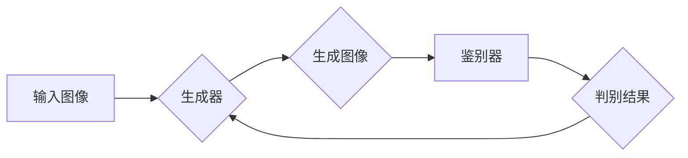

> 生成对抗网络(GAN)，深度学习，图像风格转换，美学风格，艺术生成，图像处理

## 1. 背景介绍

图像风格转换技术近年来备受关注，它能够将一种图像的风格迁移到另一幅图像上，创造出具有独特艺术美感的图像作品。这种技术在艺术创作、图像编辑、电影特效等领域有着广泛的应用前景。传统的图像风格转换方法通常依赖于手工设计的特征提取和风格融合算法，难以捕捉图像的复杂细节和艺术风格。

深度学习的兴起为图像风格转换带来了新的机遇。生成对抗网络（Generative Adversarial Networks，GAN）作为一种强大的生成模型，能够学习图像的复杂分布和风格特征，从而实现更逼真的图像风格转换效果。

## 2. 核心概念与联系

### 2.1 生成对抗网络 (GAN)

生成对抗网络 (GAN) 由两个神经网络组成：生成器 (Generator) 和鉴别器 (Discriminator)。生成器负责生成新的图像数据，而鉴别器负责判断图像是否为真实数据或生成数据。这两个网络在对抗博弈中相互竞争，生成器试图生成逼真的图像以欺骗鉴别器，而鉴别器则试图准确地区分真实图像和生成图像。

### 2.2 深度学习

深度学习是一种机器学习的子领域，它利用多层神经网络来学习数据的复杂特征。深度学习模型能够自动从数据中提取特征，无需人工特征工程，从而在图像识别、自然语言处理等领域取得了突破性的进展。

### 2.3 图像风格转换

图像风格转换是指将一种图像的风格迁移到另一幅图像上，保留原始图像的内容，同时改变其艺术风格。例如，将梵高的绘画风格应用到一张风景照片上，或者将印象派风格应用到一张肖像照片上。

**Mermaid 流程图**



## 3. 核心算法原理 & 具体操作步骤

### 3.1 算法原理概述

基于生成对抗网络的图像风格转换算法的核心思想是利用生成器学习图像的风格特征，并将这些特征应用到目标图像上。

具体来说，该算法首先训练一个生成器网络，该网络能够生成与目标风格相似的图像。然后，将目标图像和生成器生成的图像作为输入，训练一个鉴别器网络，该网络能够区分真实图像和生成图像。

生成器和鉴别器在对抗博弈中相互竞争，最终生成器能够生成与目标风格相似的图像，并欺骗鉴别器。

### 3.2 算法步骤详解

1. **数据准备:** 收集大量具有不同风格的图像数据，并将其分为训练集、验证集和测试集。

2. **网络架构设计:** 设计生成器和鉴别器网络的架构。生成器网络通常采用卷积神经网络 (CNN) 架构，而鉴别器网络通常采用全连接神经网络 (FCN) 架构。

3. **模型训练:** 使用训练集数据训练生成器和鉴别器网络。训练过程中，生成器试图生成逼真的图像以欺骗鉴别器，而鉴别器试图准确地区分真实图像和生成图像。

4. **风格迁移:** 将目标图像作为输入，通过训练好的生成器网络进行风格迁移，生成具有目标风格的图像。

5. **结果评估:** 使用验证集和测试集数据评估生成的图像的质量和风格转换效果。

### 3.3 算法优缺点

**优点:**

* 能够生成逼真的图像风格转换效果。
* 不需要人工特征工程，能够自动学习图像的风格特征。
* 能够处理各种类型的图像风格转换。

**缺点:**

* 训练过程复杂，需要大量的计算资源和时间。
* 难以控制生成的图像风格，有时会产生不期望的结果。
* 训练数据对算法性能有很大影响。

### 3.4 算法应用领域

* **艺术创作:** 生成具有独特艺术风格的图像作品。
* **图像编辑:** 将图像风格迁移到其他风格，例如将照片转换为油画风格。
* **电影特效:** 为电影场景添加艺术风格，例如将现实场景转换为卡通风格。
* **游戏开发:** 为游戏角色和场景添加不同的艺术风格。

## 4. 数学模型和公式 & 详细讲解 & 举例说明

### 4.1 数学模型构建

**生成器网络 (G):**

生成器网络是一个从随机噪声向量 $z$ 到图像 $G(z)$ 的映射函数。

**鉴别器网络 (D):**

鉴别器网络是一个从图像 $x$ 到概率 $D(x)$ 的映射函数，该概率表示图像 $x$ 为真实图像的可能性。

**损失函数:**

生成器网络的损失函数为鉴别器网络对生成图像的判别概率的负值：

$$L_G = -log(D(G(z)))$$

鉴别器网络的损失函数为真实图像和生成图像的判别概率的均值：

$$L_D = -log(D(x)) - log(1 - D(G(z)))$$

### 4.2 公式推导过程

损失函数的推导过程基于对抗博弈的思想。生成器网络的目标是最大化判别器网络对生成图像的判别概率，而鉴别器网络的目标是最大化对真实图像和生成图像的判别能力。

### 4.3 案例分析与讲解

假设我们想要将梵高的绘画风格应用到一张风景照片上。

1. 我们需要收集大量梵高绘画和风景照片作为训练数据。
2. 我们设计生成器和鉴别器网络，并使用训练数据训练这两个网络。
3. 训练完成后，我们将风景照片作为输入，通过训练好的生成器网络进行风格迁移，生成具有梵高绘画风格的图像。

## 5. 项目实践：代码实例和详细解释说明

### 5.1 开发环境搭建

* Python 3.6+
* TensorFlow 或 PyTorch 深度学习框架
* CUDA 和 cuDNN (可选，用于GPU加速)

### 5.2 源代码详细实现

```python
# 生成器网络
class Generator(nn.Module):
    def __init__(self):
        super(Generator, self).__init__()
        # ...

    def forward(self, z):
        # ...

# 鉴别器网络
class Discriminator(nn.Module):
    def __init__(self):
        super(Discriminator, self).__init__()
        # ...

    def forward(self, x):
        # ...

# 训练循环
for epoch in range(num_epochs):
    for batch_idx, (real_images, _) in enumerate(train_loader):
        # ...
```

### 5.3 代码解读与分析

* 生成器网络和鉴别器网络的架构设计需要根据具体任务和数据集进行调整。
* 训练循环中，需要不断更新生成器和鉴别器网络的权重，以最小化损失函数。
* 训练过程中需要使用批处理技术，以提高训练效率。

### 5.4 运行结果展示

运行代码后，可以生成具有目标风格的图像。

## 6. 实际应用场景

### 6.1 艺术创作

* 生成具有独特艺术风格的图像作品。
* 为艺术家提供新的创作灵感和工具。

### 6.2 图像编辑

* 将图像风格迁移到其他风格，例如将照片转换为油画风格。
* 为图像添加艺术效果，例如将照片转换为漫画风格。

### 6.3 电影特效

* 为电影场景添加艺术风格，例如将现实场景转换为卡通风格。
* 生成虚拟场景和角色，并赋予其独特的艺术风格。

### 6.4 未来应用展望

* 更逼真的图像风格转换效果。
* 更灵活的风格控制，能够根据用户需求定制风格。
* 更广泛的应用场景，例如虚拟现实、增强现实等。

## 7. 工具和资源推荐

### 7.1 学习资源推荐

* **书籍:**
    * Deep Learning by Ian Goodfellow, Yoshua Bengio, and Aaron Courville
    * Generative Adversarial Networks by Ian Goodfellow
* **在线课程:**
    * Deep Learning Specialization by Andrew Ng (Coursera)
    * Generative Adversarial Networks by David Foster (Udacity)

### 7.2 开发工具推荐

* **TensorFlow:** https://www.tensorflow.org/
* **PyTorch:** https://pytorch.org/

### 7.3 相关论文推荐

* **Generative Adversarial Networks** by Ian Goodfellow et al. (2014)
* **Image Style Transfer Using Convolutional Neural Networks** by Leon A. Gatys et al. (2015)
* **Deep Learning for Artistic Style Transfer** by Xiaohui Shen et al. (2017)

## 8. 总结：未来发展趋势与挑战

### 8.1 研究成果总结

基于生成对抗网络的图像风格转换技术取得了显著进展，能够生成逼真的图像风格转换效果。该技术在艺术创作、图像编辑、电影特效等领域有着广泛的应用前景。

### 8.2 未来发展趋势

* 更逼真的图像风格转换效果。
* 更灵活的风格控制，能够根据用户需求定制风格。
* 更广泛的应用场景，例如虚拟现实、增强现实等。

### 8.3 面临的挑战

* 训练过程复杂，需要大量的计算资源和时间。
* 难以控制生成的图像风格，有时会产生不期望的结果。
* 训练数据对算法性能有很大影响。

### 8.4 研究展望

未来研究方向包括：

* 开发更有效的训练算法，降低训练成本和时间。
* 研究更灵活的风格控制方法，能够更好地满足用户需求。
* 探索新的应用场景，将图像风格转换技术应用到更多领域。

## 9. 附录：常见问题与解答

* **Q: 如何选择合适的图像风格转换模型？**

* **A:** 选择合适的图像风格转换模型需要根据具体任务和数据集进行选择。

* **Q: 如何控制生成的图像风格？**

* **A:** 可以通过调整生成器网络的输入参数或训练过程中的超参数来控制生成的图像风格。

* **Q: 如何评估图像风格转换效果？**

* **A:** 可以使用主观评价和客观评价指标来评估图像风格转换效果。主观评价是指人工评估图像的视觉质量和风格转换效果，而客观评价指标是指使用数学公式来量化图像风格转换效果。


作者：禅与计算机程序设计艺术 / Zen and the Art of Computer Programming 
<end_of_turn>