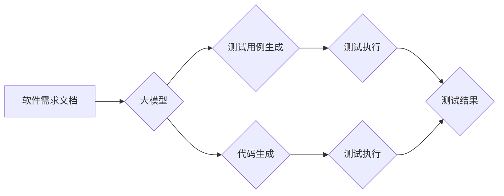

> 大模型，自动化测试，自然语言处理，代码生成，测试用例设计，软件测试

## 1. 背景介绍

在软件开发领域，自动化测试已成为不可或缺的一部分，它可以提高测试效率，降低测试成本，并确保软件质量。传统的自动化测试方法通常依赖于手工编写的测试脚本，这需要大量的开发和维护成本。近年来，随着深度学习和自然语言处理（NLP）技术的快速发展，大模型（Large Language Model，LLM）逐渐成为自动化测试领域的新兴技术，为软件测试带来了新的机遇和挑战。

大模型是指参数量巨大、训练数据海量的人工智能模型，它能够学习和理解复杂的语言模式，并生成高质量的文本内容。在软件测试领域，大模型可以用于多种任务，例如：

* **测试用例设计：**根据软件需求文档或代码，自动生成测试用例。
* **代码生成：**根据测试用例描述，自动生成测试代码。
* **缺陷检测：**分析代码或测试结果，识别潜在的缺陷。
* **测试报告生成：**自动生成测试报告，总结测试结果和发现的缺陷。

## 2. 核心概念与联系

大模型在自动化测试中的应用主要基于以下核心概念：

* **自然语言理解 (NLU)：** 大模型能够理解人类语言的含义，并将其转换为机器可理解的格式。
* **代码生成：** 大模型能够根据自然语言描述生成代码，包括测试代码和修复代码。
* **知识图谱：** 大模型可以构建知识图谱，存储软件相关知识，例如软件架构、API接口等，以便更好地理解软件功能和行为。

**Mermaid 流程图：**



## 3. 核心算法原理 & 具体操作步骤

### 3.1  算法原理概述

大模型在自动化测试中的应用主要基于深度学习算法，例如 Transformer、BERT 等。这些算法能够学习语言模式和代码结构，并生成高质量的文本内容和代码。

### 3.2  算法步骤详解

1. **数据预处理：** 收集软件需求文档、代码、测试用例等数据，并进行清洗、格式化等预处理操作。
2. **模型训练：** 使用深度学习算法训练大模型，使其能够理解软件需求和代码结构，并生成测试用例和代码。
3. **测试用例生成：** 根据软件需求文档或代码，输入到训练好的大模型中，模型会自动生成测试用例。
4. **代码生成：** 根据测试用例描述，输入到训练好的大模型中，模型会自动生成测试代码。
5. **测试执行：** 使用生成的测试用例和测试代码执行测试，并收集测试结果。
6. **结果分析：** 分析测试结果，识别潜在的缺陷，并生成测试报告。

### 3.3  算法优缺点

**优点：**

* **提高效率：** 自动化测试用例和代码生成可以显著提高测试效率。
* **降低成本：** 自动化测试可以减少人工测试成本。
* **提高质量：** 大模型能够学习和理解复杂的软件逻辑，生成更全面的测试用例，从而提高软件质量。

**缺点：**

* **数据依赖：** 大模型的性能依赖于训练数据的质量和数量。
* **解释性差：** 大模型的决策过程难以解释，这可能会导致测试结果的可信度降低。
* **维护成本：** 大模型需要定期更新和维护，这可能会增加维护成本。

### 3.4  算法应用领域

大模型在自动化测试领域具有广泛的应用前景，例如：

* **Web 应用测试：** 自动生成测试用例和代码，测试网站功能和性能。
* **移动应用测试：** 自动生成测试用例和代码，测试移动应用功能和兼容性。
* **API 测试：** 自动生成测试用例和代码，测试API接口功能和性能。
* **嵌入式系统测试：** 自动生成测试用例和代码，测试嵌入式系统的功能和可靠性。

## 4. 数学模型和公式 & 详细讲解 & 举例说明

### 4.1  数学模型构建

大模型的训练过程可以看作是一个优化问题，目标是找到模型参数，使得模型在训练数据上的预测性能达到最大。常用的数学模型包括：

* **交叉熵损失函数：** 用于分类任务，衡量模型预测结果与真实标签之间的差异。
* **均方误差损失函数：** 用于回归任务，衡量模型预测结果与真实值之间的差异。

### 4.2  公式推导过程

交叉熵损失函数的公式如下：

$$
H(p, q) = - \sum_{i=1}^{n} p(i) \log q(i)
$$

其中：

* $p(i)$ 是真实标签的概率分布。
* $q(i)$ 是模型预测的概率分布。

### 4.3  案例分析与讲解

假设我们训练一个大模型用于识别文本中的情感倾向（正面、负面、中性）。训练数据包含许多文本样本及其对应的情感倾向标签。模型训练的目标是找到模型参数，使得模型能够准确预测文本的情感倾向。

在训练过程中，模型会使用交叉熵损失函数来衡量预测结果与真实标签之间的差异。损失函数的值越小，模型的预测性能越好。模型会通过反向传播算法来更新模型参数，使得损失函数的值不断减小。

## 5. 项目实践：代码实例和详细解释说明

### 5.1  开发环境搭建

* Python 3.7+
* TensorFlow 2.0+
* PyTorch 1.0+
* 其他必要的库，例如 NLTK、spaCy 等。

### 5.2  源代码详细实现

```python
# 导入必要的库
import tensorflow as tf

# 定义模型结构
model = tf.keras.Sequential([
    tf.keras.layers.Embedding(input_dim=vocab_size, output_dim=embedding_dim),
    tf.keras.layers.LSTM(units=128),
    tf.keras.layers.Dense(units=3, activation='softmax')
])

# 编译模型
model.compile(optimizer='adam',
              loss='sparse_categorical_crossentropy',
              metrics=['accuracy'])

# 训练模型
model.fit(x_train, y_train, epochs=10)

# 评估模型
loss, accuracy = model.evaluate(x_test, y_test)
print('Loss:', loss)
print('Accuracy:', accuracy)
```

### 5.3  代码解读与分析

* **模型结构：** 该代码定义了一个简单的深度学习模型，包含嵌入层、LSTM层和全连接层。嵌入层将单词转换为向量表示，LSTM层用于捕捉文本序列中的上下文信息，全连接层用于分类情感倾向。
* **模型编译：** 使用 Adam 优化器、交叉熵损失函数和准确率作为评估指标来编译模型。
* **模型训练：** 使用训练数据训练模型，训练 epochs 次。
* **模型评估：** 使用测试数据评估模型的性能，输出损失值和准确率。

### 5.4  运行结果展示

训练完成后，可以将模型应用于新的文本数据，预测其情感倾向。

## 6. 实际应用场景

大模型在自动化测试领域已经有一些实际应用案例，例如：

* **Google 的 TensorFlow 测试套件：** 使用大模型自动生成测试用例和代码，提高测试效率。
* **Microsoft 的 Azure DevOps：** 使用大模型分析代码，识别潜在的缺陷。
* **Facebook 的 PyTorch Hub：** 提供预训练的大模型，用于自动化测试任务。

### 6.4  未来应用展望

随着大模型技术的不断发展，其在自动化测试领域的应用前景更加广阔。未来，大模型可能能够：

* **更准确地理解软件需求和代码结构，生成更全面的测试用例。**
* **自动修复代码缺陷，提高软件质量。**
* **个性化定制测试用例，满足不同用户的需求。**

## 7. 工具和资源推荐

### 7.1  学习资源推荐

* **论文：**
    * Attention Is All You Need
    * BERT: Pre-training of Deep Bidirectional Transformers for Language Understanding
* **博客：**
    * The Illustrated Transformer
    * Hugging Face Blog

### 7.2  开发工具推荐

* **TensorFlow：** 开源深度学习框架，支持大模型训练和部署。
* **PyTorch：** 开源深度学习框架，灵活易用，适合研究和开发。
* **Hugging Face Transformers：** 提供预训练的大模型和工具，方便使用。

### 7.3  相关论文推荐

* **BERT: Pre-training of Deep Bidirectional Transformers for Language Understanding**
* **GPT-3: Language Models are Few-Shot Learners**
* **T5: Text-to-Text Transfer Transformer**

## 8. 总结：未来发展趋势与挑战

### 8.1  研究成果总结

大模型在自动化测试领域取得了显著的成果，能够提高测试效率、降低测试成本，并提高软件质量。

### 8.2  未来发展趋势

未来，大模型在自动化测试领域将朝着以下方向发展：

* **模型规模和能力的提升：** 训练更大规模、更强大的大模型，使其能够更好地理解复杂软件系统。
* **模型解释性和可解释性的增强：** 研究大模型的决策过程，提高测试结果的可信度。
* **模型的个性化定制：** 根据不同用户的需求，定制化大模型，使其能够更好地满足特定测试场景。

### 8.3  面临的挑战

大模型在自动化测试领域也面临一些挑战：

* **数据依赖：** 大模型的性能依赖于训练数据的质量和数量。
* **计算资源需求：** 训练大模型需要大量的计算资源。
* **伦理问题：** 大模型的应用可能带来一些伦理问题，例如数据隐私和算法偏见。

### 8.4  研究展望

未来，需要进一步研究大模型在自动化测试领域的应用，解决其面临的挑战，并探索其更大的潜力。


## 9. 附录：常见问题与解答

**Q1：大模型的训练需要多少数据？**

A1：大模型的训练需要海量数据，通常需要数十亿甚至数千亿个数据点。

**Q2：大模型的训练需要多少计算资源？**

A2：大模型的训练需要大量的计算资源，通常需要数百甚至数千个GPU。

**Q3：大模型的应用是否会带来伦理问题？**

A3：大模型的应用可能带来一些伦理问题，例如数据隐私和算法偏见。需要谨慎考虑这些问题，并采取相应的措施来规避风险。


作者：禅与计算机程序设计艺术 / Zen and the Art of Computer Programming 
<end_of_turn>