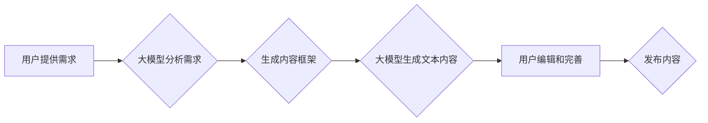

> 大模型，内容创作，人工智能，自然语言处理，文本生成，机器学习，深度学习，GPT-3，LaMDA

## 1. 背景介绍

内容创作是人类文明的重要组成部分，它驱动着信息传播、文化交流和社会发展。从古时候的文字、绘画到现代的书籍、电影、音乐，内容创作始终扮演着重要的角色。然而，随着互联网时代的到来，内容创作面临着前所未有的挑战：信息爆炸、内容同质化、创作效率低下等问题日益突出。

近年来，人工智能技术取得了长足的进步，特别是大模型的出现，为内容创作行业带来了颠覆性的变革。大模型是指参数规模庞大、训练数据海量的人工智能模型，它能够学习和理解复杂的语言模式，并生成高质量的文本内容。

## 2. 核心概念与联系

**2.1 大模型概述**

大模型是指参数规模庞大、训练数据海量的人工智能模型。这些模型通常基于深度学习架构，例如 Transformer，并通过海量文本数据进行训练。大模型能够学习和理解复杂的语言模式，并生成高质量的文本内容。

**2.2 自然语言处理 (NLP)**

自然语言处理 (NLP) 是人工智能的一个分支，致力于使计算机能够理解、处理和生成人类语言。NLP 技术广泛应用于各种领域，例如机器翻译、文本摘要、情感分析、对话系统等。大模型在 NLP 领域发挥着越来越重要的作用，例如 GPT-3 和 LaMDA 等模型能够生成逼真的对话文本，甚至可以创作诗歌、小说等文学作品。

**2.3 内容创作流程**

内容创作是一个复杂的过程，通常包括以下几个步骤：

1. **创意阶段:** 产生新的内容想法。
2. **构思阶段:** 构思内容框架和结构。
3. **写作阶段:** 将构思转化为文字。
4. **编辑阶段:** 修改和完善文字内容。
5. **发布阶段:** 将内容发布到目标平台。

**2.4 大模型在内容创作中的应用**

大模型可以应用于内容创作的各个阶段，例如：

* **创意阶段:** 大模型可以根据用户提供的关键词或主题，生成新的内容想法。
* **构思阶段:** 大模型可以帮助用户构建内容框架和结构，并提供相关信息和素材。
* **写作阶段:** 大模型可以根据用户提供的提示，自动生成文本内容。
* **编辑阶段:** 大模型可以帮助用户检查语法错误、拼写错误和风格问题。

**2.5 Mermaid 流程图**



## 3. 核心算法原理 & 具体操作步骤

**3.1 算法原理概述**

大模型的核心算法是基于深度学习的 Transformer 架构。Transformer 模型利用注意力机制，能够捕捉文本序列中长距离依赖关系，从而生成更流畅、更自然的文本内容。

**3.2 算法步骤详解**

1. **词嵌入:** 将文本中的每个词转换为向量表示，以便模型能够理解词语的语义。
2. **编码器:** 将文本序列编码成一个固定长度的向量表示，捕捉文本序列的语义信息。
3. **解码器:** 根据编码后的文本向量，生成目标文本序列。
4. **注意力机制:** 在编码和解码过程中，注意力机制能够帮助模型关注文本序列中重要的信息，从而生成更准确、更相关的文本内容。

**3.3 算法优缺点**

**优点:**

* 能够生成高质量的文本内容。
* 能够捕捉文本序列中的长距离依赖关系。
* 能够处理多种类型的文本任务，例如机器翻译、文本摘要、对话系统等。

**缺点:**

* 训练成本高，需要大量的计算资源和训练数据。
* 模型参数规模庞大，部署成本高。
* 容易受到训练数据偏差的影响，可能生成带有偏见或错误的信息。

**3.4 算法应用领域**

大模型在以下领域具有广泛的应用前景：

* **内容创作:** 自动生成新闻报道、广告文案、小说、诗歌等。
* **教育:** 提供个性化学习辅导、自动批改作业。
* **客服:** 提供智能客服机器人，自动回复用户问题。
* **科研:** 自动生成研究报告、文献综述。

## 4. 数学模型和公式 & 详细讲解 & 举例说明

**4.1 数学模型构建**

大模型的数学模型通常基于 Transformer 架构，其核心是注意力机制。注意力机制可以理解为一种加权求和操作，它根据输入序列中每个词的重要性，对序列中的其他词进行加权求和，从而得到一个新的表示。

**4.2 公式推导过程**

注意力机制的计算公式如下：

$$
\text{Attention}(Q, K, V) = \text{softmax}\left(\frac{Q K^T}{\sqrt{d_k}}\right) V
$$

其中：

* $Q$：查询矩阵
* $K$：键矩阵
* $V$：值矩阵
* $d_k$：键向量的维度
* $\text{softmax}$：softmax 函数

**4.3 案例分析与讲解**

假设我们有一个句子 "我爱吃苹果"，我们想要计算 "吃" 这个词对整个句子的注意力权重。

1. 将句子中的每个词转换为向量表示，得到 $Q$, $K$, $V$ 三个矩阵。
2. 计算 $QK^T$，得到一个矩阵，每个元素代表两个词之间的相关性。
3. 对 $QK^T$ 进行归一化，得到一个注意力权重矩阵。
4. 将注意力权重矩阵与 $V$ 进行加权求和，得到 "吃" 这个词对整个句子的注意力表示。

## 5. 项目实践：代码实例和详细解释说明

**5.1 开发环境搭建**

* Python 3.7+
* PyTorch 或 TensorFlow
* CUDA 和 cuDNN

**5.2 源代码详细实现**

```python
import torch
import torch.nn as nn

class Attention(nn.Module):
    def __init__(self, d_model, num_heads):
        super(Attention, self).__init__()
        self.d_model = d_model
        self.num_heads = num_heads
        self.head_dim = d_model // num_heads

        self.query = nn.Linear(d_model, d_model)
        self.key = nn.Linear(d_model, d_model)
        self.value = nn.Linear(d_model, d_model)
        self.fc_out = nn.Linear(d_model, d_model)

    def forward(self, query, key, value, mask=None):
        batch_size = query.size(0)

        # Linear projections
        Q = self.query(query).view(batch_size, -1, self.num_heads, self.head_dim).transpose(1, 2)
        K = self.key(key).view(batch_size, -1, self.num_heads, self.head_dim).transpose(1, 2)
        V = self.value(value).view(batch_size, -1, self.num_heads, self.head_dim).transpose(1, 2)

        # Scaled dot-product attention
        scores = torch.matmul(Q, K.transpose(-2, -1)) / torch.sqrt(torch.tensor(self.head_dim, dtype=torch.float))

        if mask is not None:
            scores = scores.masked_fill(mask == 0, -1e9)

        attention_weights = torch.softmax(scores, dim=-1)

        # Weighted sum of values
        context = torch.matmul(attention_weights, V)

        # Concatenate heads and project
        context = context.transpose(1, 2).contiguous().view(batch_size, -1, self.d_model)
        output = self.fc_out(context)

        return output, attention_weights
```

**5.3 代码解读与分析**

这段代码实现了 Transformer 模型中的注意力机制。

* `Attention` 类定义了注意力机制的结构。
* `forward` 方法计算注意力权重和上下文表示。
* `query`, `key`, `value` 线性变换将输入向量转换为查询、键和值矩阵。
* `torch.matmul` 计算注意力权重矩阵。
* `torch.softmax` 计算注意力权重。
* `torch.matmul` 计算上下文表示。
* `fc_out` 线性变换将上下文表示转换为最终输出。

**5.4 运行结果展示**

运行这段代码可以得到注意力权重矩阵和上下文表示。注意力权重矩阵可以直观地展示每个词对其他词的关注程度，上下文表示可以理解为每个词在句子中的语义信息。

## 6. 实际应用场景

**6.1 内容创作工具**

大模型可以被集成到各种内容创作工具中，例如：

* **写作助手:** 自动生成文章开头、段落、结尾等，帮助用户克服写作瓶颈。
* **文案生成器:** 根据用户提供的关键词或主题，自动生成广告文案、产品描述等。
* **创意工具:** 帮助用户生成新的故事、诗歌、剧本等创意内容。

**6.2 个性化学习平台**

大模型可以根据用户的学习进度和知识水平，提供个性化的学习辅导和练习题。

**6.3 智能客服系统**

大模型可以训练成智能客服机器人，自动回复用户常见问题，提高客服效率。

**6.4 数据分析与报告生成**

大模型可以自动分析大量数据，并生成简洁明了的报告，帮助用户洞察数据背后的信息。

**6.5 未来应用展望**

随着大模型技术的不断发展，其应用场景将更加广泛，例如：

* **虚拟助手:** 更智能、更人性化的虚拟助手，能够理解用户的自然语言指令，并提供更精准的帮助。
* **自动翻译:** 更准确、更流畅的机器翻译，能够突破语言障碍，促进全球交流。
* **个性化娱乐:** 根据用户的喜好，自动生成个性化的音乐、电影、游戏等娱乐内容。

## 7. 工具和资源推荐

**7.1 学习资源推荐**

* **书籍:**
    * 《深度学习》
    * 《自然语言处理》
    * 《Transformer 详解》
* **在线课程:**
    * Coursera: 深度学习
    * Udacity: 自然语言处理
    * fast.ai: 深度学习

**7.2 开发工具推荐**

* **PyTorch:** 开源深度学习框架，支持 GPU 加速。
* **TensorFlow:** 谷歌开源深度学习框架，支持多种平台。
* **HuggingFace Transformers:** 提供预训练的大模型和工具库。

**7.3 相关论文推荐**

* 《Attention Is All You Need》
* 《BERT: Pre-training of Deep Bidirectional Transformers for Language Understanding》
* 《GPT-3: Language Models are Few-Shot Learners》

## 8. 总结：未来发展趋势与挑战

**8.1 研究成果总结**

近年来，大模型在内容创作领域取得了显著的成果，能够生成高质量的文本内容，并应用于各种场景。

**8.2 未来发展趋势**

* **模型规模更大:** 模型参数规模将继续扩大，从而提升模型的表达能力和泛化能力。
* **训练数据更丰富:** 模型将训练于更丰富、更全面的数据，从而生成更准确、更自然的文本内容。
* **应用场景更广泛:** 大模型将应用于更多领域，例如教育、医疗、法律等。

**8.3 面临的挑战**

* **训练成本高:** 大模型的训练成本非常高，需要大量的计算资源和时间。
* **模型安全性:** 大模型可能被用于生成虚假信息、恶意内容等，需要加强模型安全性研究。
* **伦理问题:** 大模型的应用引发了伦理问题，例如版权问题、偏见问题等，需要进行深入探讨和解决。