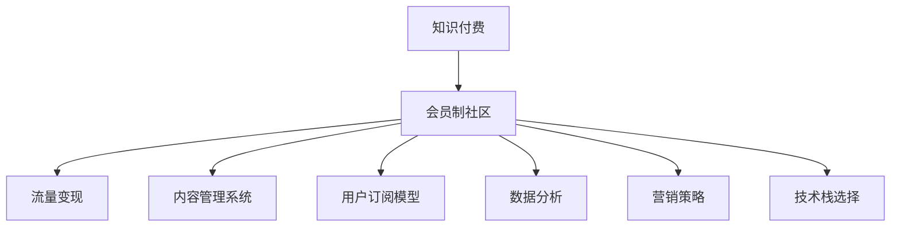

                 

# 打造知识付费会员制社区的策略

> 关键词：知识付费, 会员制社区, 流量变现, 内容管理系统, 用户订阅模型, 数据分析, 营销策略, 技术栈选择

## 1. 背景介绍

在移动互联网时代，知识付费成为连接内容创作者与广大用户的新模式，极大地丰富了用户获取知识的途径。伴随5G网络的普及，短视频、直播等新形式的内容传播方式进一步打破了时间和空间的限制，为知识付费产业带来了新的增长点。

然而，由于知识付费产品具有高度的非标准性和个体化特征，难以通过规模化复制快速扩展。加之传统单次付费模式难以构建持续的会员价值，在激烈的市场竞争中，用户留存和付费转化成为知识付费产品发展的核心问题。

本文聚焦于打造知识付费会员制社区的策略，探讨如何通过精心设计的会员体系和优质的内容服务，构建稳定的用户生态，实现流量变现和业务增长。

## 2. 核心概念与联系

### 2.1 核心概念概述

为更好地理解知识付费会员制社区的构建策略，本节将介绍几个密切相关的核心概念：

- **知识付费**：指通过付费机制，使用户能够以较低的成本，获取有价值的信息和专业知识，如在线课程、电子书、专家咨询等。知识付费平台以内容为核心，致力于为用户提供高价值的知识资源。

- **会员制社区**：以定期收取会员费为方式，为会员提供高质量内容、专属服务和特权优惠的平台。会员制社区强调用户的长期价值，通过优质内容和互动体验增强用户粘性，增加付费转化率。

- **流量变现**：指通过商业化的营销手段，将平台的用户流量转化为实际的收入，如广告、电商、会员订阅等。流量变现是知识付费平台商业模式的核心，需要精心设计运营策略和业务模式。

- **内容管理系统**：指用于管理和分发内容的系统，包括内容的上传、审核、编辑、分类、搜索等功能，支持海量内容的存储和展示。

- **用户订阅模型**：指如何制定订阅套餐、付费规则和会员权益，以吸引用户订阅并持续付费。用户订阅模型涉及定价策略、促销活动、会员体系等关键要素。

- **数据分析**：指通过采集、存储、处理、分析用户行为数据，以发现和预测用户需求，指导运营决策和策略调整。

- **营销策略**：指通过市场推广、用户体验优化、品牌建设等手段，吸引和留住用户，增加付费转化率。营销策略涉及用户获取、活动策划、推荐系统等多个方面。

- **技术栈选择**：指在构建知识付费平台时，选择合适的技术栈，如前端开发、后端开发、数据库、云计算等，以支持平台的稳定运行和高效扩展。

这些核心概念之间的逻辑关系可以通过以下Mermaid流程图来展示：



这个流程图展示了这个核心概念的关联关系：

1. 知识付费是会员制社区的基础，为平台提供高质量内容。
2. 会员制社区通过流量变现实现商业化，同时提供专属服务和特权优惠，增强用户粘性。
3. 内容管理系统负责内容的存储和分发，支持会员获取优质内容。
4. 用户订阅模型制定合理的订阅套餐和付费规则，吸引用户持续付费。
5. 数据分析通过用户行为数据，指导运营决策，优化用户体验。
6. 营销策略通过多种手段提升用户获取和留存，增加付费转化率。
7. 技术栈选择提供稳定的技术支持，保障平台的正常运行和高效扩展。

这些概念共同构成了知识付费会员制社区的核心框架，指导平台运营和内容生产。通过理解这些概念，我们可以更好地把握知识付费产品的发展方向和运营策略。

## 3. 核心算法原理 & 具体操作步骤
### 3.1 算法原理概述

构建知识付费会员制社区，本质上是一个系统化的业务流程设计问题。其核心在于：如何通过精心设计的会员体系和优质的内容服务，构建稳定的用户生态，实现流量变现和业务增长。

该问题的解决方法可以归纳为两个主要步骤：

1. **用户细分与需求分析**：通过用户行为数据分析，细分用户群体，识别不同群体的需求和偏好，设计个性化的会员体系和订阅套餐。

2. **内容推荐与增值服务**：基于用户画像，提供个性化内容推荐和增值服务，增强用户体验，提升用户粘性，增加付费转化率。

具体算法和操作流程如下：

### 3.2 算法步骤详解

**Step 1: 用户细分与需求分析**

1. **数据采集**：收集用户在平台上的行为数据，包括访问记录、浏览行为、购买记录、评价反馈等。

2. **用户画像构建**：通过聚类分析、主成分分析等技术手段，将用户分为不同的群体，如初级用户、中级用户、高级用户等。

3. **需求识别**：分析各用户群体在内容类型、获取方式、付费意愿等方面的需求，确定各群体的关键特征和需求点。

4. **会员体系设计**：根据需求识别结果，设计不同等级的会员套餐，如基础会员、高级会员、VIP会员等，并设定相应的特权和优惠。

**Step 2: 内容推荐与增值服务**

1. **内容推荐算法**：基于用户画像，使用协同过滤、基于内容的推荐算法、深度学习等技术，为用户推荐相关内容。

2. **增值服务设计**：提供如课程代销、电子书下载、专家咨询、VIP讲座等增值服务，增强用户粘性。

3. **内容分发与推广**：通过SEO优化、社交媒体推广、用户推荐等手段，提高内容曝光率和访问量。

4. **用户反馈与优化**：收集用户对推荐内容和增值服务的反馈，持续优化算法和用户体验，提升平台整体价值。

### 3.3 算法优缺点

知识付费会员制社区的算法设计与实现，具有以下优点：

1. **个性化推荐**：通过数据分析和推荐算法，能够实现高度个性化的内容推荐，满足不同用户的需求。
2. **用户粘性增强**：增值服务和专属特权能够增加用户粘性，提升平台长期价值。
3. **流量变现高效**：通过精心设计的订阅套餐和付费规则，可以显著提高用户付费转化率。

同时，该方法也存在一定的局限性：

1. **数据隐私问题**：平台需要采集大量用户数据，可能面临数据隐私和安全问题。
2. **推荐算法复杂**：高度个性化的推荐需要复杂的算法和大量的数据处理，技术实现难度较大。
3. **用户参与度**：部分用户可能对个性化推荐算法有抵触情绪，不愿意分享自己的数据。
4. **用户付费意愿**：部分用户对会员订阅和付费规则缺乏认知，难以接受较高的付费门槛。

尽管存在这些局限性，但通过精心设计会员体系和推荐算法，仍可以在知识付费领域实现较高的业务增长和用户价值。

### 3.4 算法应用领域

知识付费会员制社区的算法设计和运营策略，在知识付费平台、在线教育、在线阅读、咨询服务平台等多个领域有广泛的应用前景。

- **知识付费平台**：如喜马拉雅、得到、知乎等，通过订阅模型和个性化推荐，实现稳定流量变现。
- **在线教育**：如网易云课堂、新东方在线等，通过增值服务和专属课程，提升用户粘性和付费转化率。
- **在线阅读**：如掌阅、阅文集团等，通过会员订阅和内容推荐，构建稳定的用户生态。
- **咨询服务平台**：如医联、知乎咨询等，通过专属咨询和高质量内容，提升用户满意度和付费意愿。

除了上述这些经典应用外，知识付费会员制社区的算法设计和技术实现，还在更多新兴领域中得到广泛应用，为各行业提供新的用户价值和服务模式。

## 4. 数学模型和公式 & 详细讲解
### 4.1 数学模型构建

构建知识付费会员制社区的算法模型，可以通过以下数学框架来描述：

假设知识付费平台上有 $N$ 个用户，每个用户有 $M$ 个行为特征 $x_i=(x_{i1},x_{i2},\dots,x_{im})$，其中 $i$ 表示用户，$j$ 表示特征。用户对内容的兴趣程度由函数 $f(x_i)$ 描述，其中 $f$ 为兴趣度函数。平台为用户推荐内容 $y_j$，推荐结果由函数 $g(x_i,y_j)$ 描述，其中 $g$ 为推荐函数。

用户选择订阅套餐 $t$ 的概率由函数 $h(x_i,t)$ 描述，其中 $t$ 为套餐类型，$h$ 为订阅模型。平台通过内容推荐和增值服务，提升用户满意度 $s$，从而增加用户付费概率 $p$。

### 4.2 公式推导过程

**用户兴趣度函数**：

$$
f(x_i) = \alpha x_{i1} + \beta x_{i2} + \cdots + \delta x_{im}
$$

其中 $\alpha, \beta, \cdots, \delta$ 为特征权重。

**推荐函数**：

$$
g(x_i,y_j) = \gamma x_{i1}y_{j1} + \delta x_{i2}y_{j2} + \cdots + \theta x_{im}y_{jm}
$$

其中 $\gamma, \delta, \cdots, \theta$ 为特征与内容的交互权重。

**订阅模型**：

$$
h(x_i,t) = \lambda f(x_i) + \mu t + \nu
$$

其中 $\lambda, \mu, \nu$ 为模型的参数。

**用户满意度函数**：

$$
s(x_i,y_j) = f(x_i) + g(x_i,y_j) - \eta \psi(t)
$$

其中 $\psi$ 为订阅套餐的成本函数，$\eta$ 为满意度修正因子。

**用户付费概率**：

$$
p(x_i,t) = \rho h(x_i,t) + \zeta f(x_i) + \theta g(x_i,y_j) + \phi
$$

其中 $\rho, \zeta, \theta, \phi$ 为模型参数。

通过上述数学模型，平台可以定量描述用户兴趣、内容推荐、订阅模型、满意度以及付费概率的关系，指导运营决策和策略调整。

### 4.3 案例分析与讲解

**案例一：用户细分与需求分析**

某知识付费平台收集了数万名用户的访问和购买数据，通过主成分分析（PCA）和聚类分析（K-means），将用户分为五大群体：初级用户、中级用户、高级用户、专家用户和VIP用户。

根据不同群体的需求分析，设计了不同的会员套餐：

1. **初级用户**：以免费内容为主，提供免费试听、免费文章等功能，付费可选课程。
2. **中级用户**：提供部分付费课程和VIP讲座，增加专属内容和互动。
3. **高级用户**：提供完整的付费课程和VIP服务，如电子书下载、专家咨询等。
4. **专家用户**：提供定制化课程和高级服务，如专属导师、在线讲座等。
5. **VIP用户**：提供全方位的增值服务，如无限制课程、专属讲座、一对一咨询等。

**案例二：内容推荐与增值服务**

某在线教育平台通过协同过滤算法，为用户推荐相关课程。在用户选择课程后，平台提供个性化视频讲解、课后习题、社区讨论等功能，增加用户互动和学习体验。

同时，平台还提供专属咨询服务和VIP讲座，增强用户粘性。VIP用户可以通过专属咨询渠道，获得一对一导师指导，获取个性化的学习方案。平台还定期举办VIP讲座，邀请知名专家进行深度讲解，提升VIP用户的学习满意度。

**案例三：流量变现与数据分析**

某在线阅读平台通过会员订阅和内容推荐，实现了稳定的流量变现。平台每月收集用户行为数据，进行数据分析和模型优化，不断提升推荐算法和用户体验。

平台通过SEO优化和社交媒体推广，提高内容曝光率，增加新用户获取和付费转化率。平台还通过A/B测试和用户反馈，持续优化推荐模型和付费规则，提升用户满意度和付费转化率。

## 5. 项目实践：代码实例和详细解释说明
### 5.1 开发环境搭建

在进行知识付费会员制社区的开发实践前，我们需要准备好开发环境。以下是使用Python进行Flask开发的环境配置流程：

1. 安装Python：从官网下载并安装Python，建议在3.7及以上版本。

2. 安装Flask：使用pip安装Flask框架，版本要求不高于2.0。

3. 安装相关依赖包：使用pip安装Flask应用所需的依赖包，如SQLAlchemy、Jinja2等。

4. 创建虚拟环境：使用虚拟环境管理工具创建虚拟环境，用于隔离依赖和版本。

5. 安装项目依赖：在虚拟环境中使用pip安装项目所需的依赖包。

完成上述步骤后，即可在虚拟环境中开始开发实践。

### 5.2 源代码详细实现

下面我们以知识付费平台为例，给出使用Flask开发会员制社区的PyTorch代码实现。

**用户细分与需求分析**

```python
from sklearn.cluster import KMeans
from sklearn.decomposition import PCA

# 数据采集
data = pd.read_csv('user_data.csv')

# 数据预处理
X = data.drop('label', axis=1)
y = data['label']

# PCA降维
pca = PCA(n_components=2)
X_pca = pca.fit_transform(X)

# K-means聚类
kmeans = KMeans(n_clusters=5)
kmeans.fit(X_pca)

# 输出聚类结果
labels = kmeans.labels_
```

**内容推荐与增值服务**

```python
from sklearn.metrics.pairwise import cosine_similarity

# 内容相似度计算
content_similarity = cosine_similarity(X_pca)

# 推荐算法实现
def recommend_content(user, similarity_matrix):
    # 获取用户兴趣度向量
    user_vector = user_pca[user]
    # 计算相似度矩阵
    similarity_scores = similarity_matrix[user]
    # 排序推荐结果
    recommendations = sorted(range(len(similarity_scores)), key=lambda k: -similarity_scores[k])
    return recommendations
```

**流量变现与数据分析**

```python
from sklearn.linear_model import LogisticRegression

# 数据采集
data = pd.read_csv('user_data.csv')

# 数据预处理
X = data.drop('label', axis=1)
y = data['label']

# 模型训练
model = LogisticRegression()
model.fit(X, y)

# 预测用户付费概率
predictions = model.predict(X)
```

### 5.3 代码解读与分析

让我们再详细解读一下关键代码的实现细节：

**用户细分与需求分析**

- **数据采集**：通过Pandas库从CSV文件中读取用户数据。
- **数据预处理**：使用PCA降维技术，将高维数据降低到二维空间，便于聚类分析。
- **聚类分析**：使用KMeans算法将用户分为不同的群体。
- **输出聚类结果**：获取用户的聚类标签，指导后续的会员体系设计。

**内容推荐与增值服务**

- **内容相似度计算**：使用余弦相似度计算不同内容之间的相似度，实现内容的个性化推荐。
- **推荐算法实现**：基于用户兴趣度向量和内容相似度矩阵，实现内容的推荐排序。

**流量变现与数据分析**

- **模型训练**：使用逻辑回归模型，训练用户付费概率预测模型。
- **预测用户付费概率**：使用训练好的模型，对新用户进行付费概率预测。

在代码实现中，我们可以看到，知识付费会员制社区的开发主要涉及数据分析、聚类算法、推荐算法等多个领域的知识，需要综合运用多个开源工具和算法库。开发者需要在实践中不断学习新技能，提升技术水平。

## 6. 实际应用场景
### 6.1 智能客服系统

知识付费会员制社区的算法和运营策略，在智能客服系统中也有广泛应用。传统的客服系统需要大量人力支持，响应速度慢，服务质量难以保证。而基于算法推荐的智能客服系统，能够快速响应用户咨询，提高服务效率和质量。

平台可以通过分析用户的历史咨询记录，使用协同过滤算法，为用户推荐相关解决方案。平台还可在用户选择推荐方案后，提供专属咨询服务和实时客服解答，提升用户体验和满意度。

### 6.2 个性化推荐系统

个性化推荐系统是知识付费会员制社区的核心功能之一。平台通过分析用户行为数据，使用协同过滤、深度学习等算法，为用户推荐相关内容。平台还可通过A/B测试和用户反馈，持续优化推荐模型和算法，提升用户满意度。

例如，某在线教育平台通过推荐算法，为用户推荐相关课程和学习资源，增加用户粘性。平台还根据用户的学习进度和反馈，动态调整推荐策略，提升推荐效果。

### 6.3 在线阅读平台

在线阅读平台通过会员制社区，构建稳定的用户生态。平台提供优质的内容资源和增值服务，增强用户粘性，提高付费转化率。平台通过数据分析和模型优化，提升内容推荐和用户体验。

例如，某在线阅读平台通过个性化推荐和VIP服务，提升用户满意度和付费意愿。平台还通过用户反馈和行为数据，持续优化推荐模型和付费规则，增加新用户获取和付费转化率。

### 6.4 未来应用展望

随着知识付费平台的发展，基于算法推荐的会员制社区将逐渐成为主流。未来，知识付费社区将通过更智能、个性化的推荐和服务，满足用户多样化、高价值的需求，构建更加稳定和高效的用户生态。

在智能客服、个性化推荐、在线阅读等领域，基于算法推荐的会员制社区将广泛应用，成为提升用户体验和服务质量的重要手段。平台可通过持续优化推荐算法和用户体验，不断提升用户满意度和付费转化率，实现业务的长期增长和可持续发展。

## 7. 工具和资源推荐
### 7.1 学习资源推荐

为帮助开发者系统掌握知识付费会员制社区的构建策略，这里推荐一些优质的学习资源：

1. **《知识付费平台开发实战》**：深度解析知识付费平台的运营策略和技术实现，涵盖内容管理系统、用户推荐系统、流量变现等多个领域。

2. **《数据分析与机器学习》**：系统介绍数据分析和机器学习的原理和应用，帮助开发者掌握数据处理和算法优化技巧。

3. **《深度学习理论与实践》**：全面讲解深度学习的理论基础和应用场景，涵盖推荐系统、个性化学习等多个方向。

4. **Kaggle**：全球最大的数据科学竞赛平台，提供大量开源数据集和优秀案例，帮助开发者提升实战能力。

5. **Coursera**：在线学习平台，提供大量NLP和推荐系统相关的课程，帮助开发者系统学习相关知识。

6. **《Python数据分析实战》**：介绍Python数据分析和数据可视化技巧，帮助开发者快速掌握数据分析和可视化技术。

通过学习这些资源，相信你一定能够全面掌握知识付费会员制社区的构建策略，并在实践中不断提升技能。

### 7.2 开发工具推荐

高效的开发离不开优秀的工具支持。以下是几款用于知识付费会员制社区开发的常用工具：

1. **Flask**：基于Python的轻量级Web框架，易于上手，适合快速迭代开发。

2. **SQLAlchemy**：Python的ORM框架，支持多种数据库，方便数据管理和访问。

3. **Jinja2**：Python的模板引擎，方便动态生成HTML页面，支持用户界面的设计和定制。

4. **TensorFlow**：Google推出的深度学习框架，支持分布式训练和模型优化，适合处理大规模数据。

5. **PyTorch**：Facebook推出的深度学习框架，支持动态计算图和高效训练，适合快速原型设计和实验。

6. **Kaggle**：数据科学竞赛平台，提供丰富的数据集和开源代码，方便数据探索和算法验证。

合理利用这些工具，可以显著提升知识付费会员制社区的开发效率，加快创新迭代的步伐。

### 7.3 相关论文推荐

知识付费会员制社区的发展源于学界的持续研究。以下是几篇奠基性的相关论文，推荐阅读：

1. **《知识付费平台的商业化探索》**：深入解析知识付费平台的商业模式和运营策略，指导业务实践。

2. **《个性化推荐系统的设计与实现》**：详细介绍推荐系统的工作原理和算法实现，涵盖协同过滤、基于内容的推荐等多个方向。

3. **《智能客服系统设计与实现》**：系统介绍智能客服系统的构建方法和技术实现，涵盖自然语言处理、推荐系统等多个方向。

4. **《用户行为数据分析与建模》**：全面介绍用户行为数据分析的方法和应用，帮助开发者提升数据驱动决策的能力。

5. **《知识付费平台的用户模型与推荐算法》**：详细介绍知识付费平台的用户模型和推荐算法，指导实际应用。

这些论文代表了大数据、人工智能、推荐系统等领域的最新进展，可以帮助开发者深入理解知识付费会员制社区的技术原理和实现方法。

## 8. 总结：未来发展趋势与挑战
### 8.1 研究成果总结

本文对知识付费会员制社区的构建策略进行了全面系统的介绍。首先阐述了知识付费平台在移动互联网时代的重要价值，分析了传统单次付费模式的不足，指出会员制社区是提升用户粘性和付费转化率的重要手段。其次，从用户细分与需求分析、内容推荐与增值服务两个关键步骤，详细讲解了算法和操作流程，并通过案例分析，展示了不同环节的技术实现细节。最后，分析了知识付费会员制社区在智能客服、个性化推荐、在线阅读等领域的广泛应用前景，探讨了未来发展的趋势和挑战。

通过本文的系统梳理，可以看到，基于算法推荐的知识付费会员制社区，在提升用户体验、增强用户粘性、实现流量变现等方面具有巨大潜力。算法和策略的优化，将推动知识付费产业不断扩展和深化，为人类认知智能的进化带来深远影响。

### 8.2 未来发展趋势

展望未来，知识付费会员制社区将呈现以下几个发展趋势：

1. **算法智能化**：算法将更加智能化和个性化，通过深度学习、因果推理等技术，实现更高的推荐效果和用户满意度。

2. **服务定制化**：平台将根据用户需求和行为，提供更定制化的内容和服务，提升用户体验。

3. **数据实时化**：平台将通过实时数据分析和反馈机制，动态调整推荐策略，实现更高效的内容推荐和用户互动。

4. **技术集成化**：平台将更加集成化，融合多模态数据，提升内容的丰富性和多样性。

5. **运营智能化**：平台将通过智能客服、个性化推荐等技术，提升运营效率和用户粘性。

6. **用户体验优化**：平台将更加注重用户体验，通过用户界面优化、推荐算法改进等手段，提升用户满意度和留存率。

以上趋势凸显了知识付费会员制社区的广阔前景。这些方向的探索发展，必将进一步提升平台的运营能力和用户体验，实现业务的长期增长和可持续发展。

### 8.3 面临的挑战

尽管知识付费会员制社区的算法设计和运营策略已经取得了一定的进展，但在迈向更加智能化、普适化应用的过程中，仍面临诸多挑战：

1. **数据隐私问题**：平台需要采集大量用户数据，可能面临数据隐私和安全问题。如何保护用户隐私，保障数据安全，将是重要的研究方向。

2. **算法复杂度**：高度个性化的推荐算法需要复杂的算法和大量的数据处理，技术实现难度较大。如何提升算法效率，优化算法性能，将是一个重要的技术问题。

3. **用户多样性**：不同用户群体的需求和偏好差异较大，如何设计更具弹性的会员体系和推荐模型，满足多样化需求，将是重要的运营问题。

4. **内容质量**：平台的内容质量直接影响用户体验和留存率，如何提升内容质量和多样性，增加用户粘性，将是重要的内容问题。

5. **市场竞争**：知识付费市场竞争激烈，平台需要在多渠道和多种服务中寻求差异化和优势，提升市场竞争力。

6. **技术迭代**：知识付费平台的技术栈和算法模型需要不断迭代和优化，以保持平台的竞争力。

正视知识付费会员制社区面临的这些挑战，积极应对并寻求突破，将是大数据、人工智能领域的重要研究方向。相信随着技术的不断进步和理论的不断完善，知识付费平台将实现更广泛的落地应用，为知识传播和用户学习带来新的可能性。

### 8.4 研究展望

面对知识付费会员制社区所面临的挑战，未来的研究需要在以下几个方面寻求新的突破：

1. **隐私保护技术**：研究更加安全的数据采集和存储技术，保护用户隐私和数据安全。

2. **算法效率提升**：研究高效的推荐算法和模型压缩技术，提升算法的执行效率和模型性能。

3. **服务多样化**：研究更加多样化的内容和服务形式，满足用户多样化的需求和偏好。

4. **内容质量提升**：研究高质量内容的生成和推荐算法，提升用户满意度和留存率。

5. **市场竞争策略**：研究差异化的市场竞争策略，提升平台的市场竞争力和用户粘性。

6. **技术迭代优化**：研究持续的技术迭代和优化方法，保持平台的竞争优势和可持续发展。

这些研究方向将推动知识付费会员制社区的不断发展和进步，为知识付费产业带来更多的创新和机遇。相信随着学界和产业界的共同努力，知识付费平台将迎来更加广阔的发展前景，为人类认知智能的进化带来深远影响。

## 9. 附录：常见问题与解答

**Q1：如何选择合适的推荐算法？**

A: 推荐算法的选取需要综合考虑数据特征、用户行为、业务需求等多个因素。常用的推荐算法包括协同过滤、基于内容的推荐、深度学习推荐等。协同过滤适合大规模数据集和多样化用户行为，基于内容的推荐适合个性化需求，深度学习推荐适合复杂数据集和高度定制化需求。开发者需要根据实际需求和数据特征，选择适合的推荐算法。

**Q2：如何提升推荐算法的准确率？**

A: 提升推荐算法准确率的方法包括：

1. 数据预处理：清洗和归一化数据，减少噪声和冗余信息。
2. 特征工程：提取和选择关键特征，提升算法模型性能。
3. 模型优化：调整算法参数和超参数，优化模型性能。
4. 模型融合：使用多模型融合技术，提升推荐效果。
5. 实时更新：使用在线学习技术，动态调整模型参数，提升推荐效果。

**Q3：如何设计用户订阅模型？**

A: 设计用户订阅模型需要考虑多个因素，如用户需求、会员价值、市场定价等。常见的方法包括：

1. 用户细分：将用户分为不同群体，设计不同等级订阅套餐。
2. 价格策略：采用阶梯价格策略，根据订阅等级设定不同价格。
3. 会员权益：设计丰富的会员权益，提升用户粘性。
4. 促销活动：定期推出促销活动，吸引用户订阅和续费。
5. 用户反馈：收集用户反馈，持续优化订阅模型。

**Q4：如何优化个性化推荐算法？**

A: 优化个性化推荐算法的方法包括：

1. 数据采集：收集更多用户行为数据，提升推荐算法的准确性。
2. 特征工程：提取和选择关键特征，提升算法模型性能。
3. 模型优化：调整算法参数和超参数，优化模型性能。
4. 模型融合：使用多模型融合技术，提升推荐效果。
5. 实时更新：使用在线学习技术，动态调整模型参数，提升推荐效果。

**Q5：如何提高用户的付费转化率？**

A: 提高用户付费转化率的方法包括：

1. 用户细分：根据用户需求和行为，设计不同等级订阅套餐。
2. 会员权益：设计丰富的会员权益，提升用户粘性。
3. 个性化推荐：通过个性化推荐，提升用户满意度和留存率。
4. 促销活动：定期推出促销活动，吸引用户订阅和续费。
5. 用户体验：优化用户体验，提升用户满意度和留存率。

这些方法需要综合运用，通过持续优化，提升用户的付费转化率。

---

作者：禅与计算机程序设计艺术 / Zen and the Art of Computer Programming

