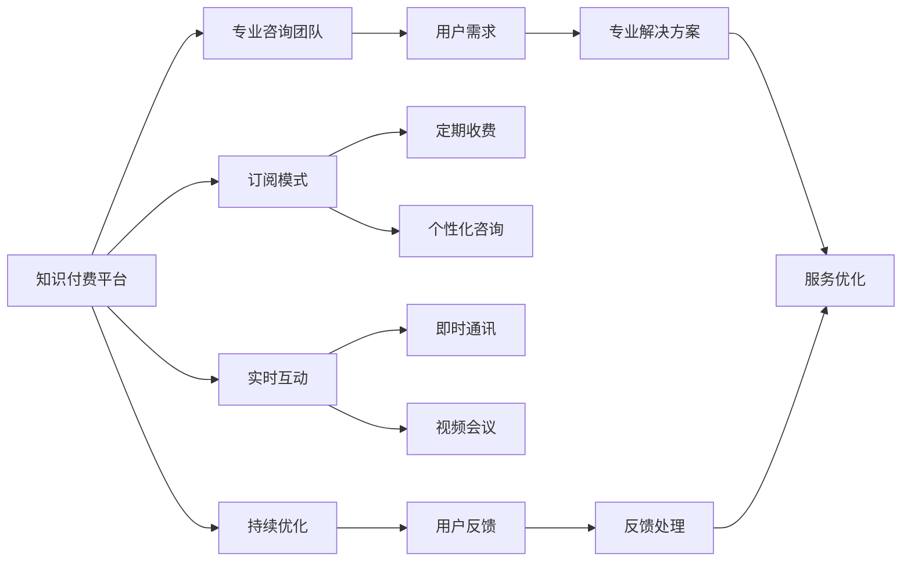

                 

## 1. 背景介绍

在当今知识经济时代，知识付费模式因其高效、便捷地连接知识和需求方，迅速在各行各业崛起。特别是在专业咨询领域，知识付费模式帮助企业、组织及个人以更低的成本、更快的速度获取高质量的专业服务，从而在激烈的市场竞争中保持优势。然而，随着知识付费服务的普及，传统单次付费、按次收费等模式逐渐显得粗糙，难以满足用户对深入咨询、长期跟踪服务的需求。

## 2. 核心概念与联系

### 2.1 核心概念概述

1. **知识付费（Knowledge-Based Payment）**：用户为获取专业咨询、技术支持、教育培训等服务，通过购买知识内容或订阅知识服务的方式支付费用。
2. **专业咨询服务（Professional Consulting Service）**：为解决特定问题或需求，通过专家团队提供系统化、结构化的专业分析和建议。
3. **订阅模式（Subscription Model）**：用户以固定的时间或费用间隔，持续享受高质量的专业咨询服务。
4. **实时互动（Real-Time Interaction）**：通过实时通讯工具，用户与专家团队可以进行即时对话、视频会议，获得即时反馈和解答。
5. **持续优化（Ongoing Optimization）**：根据用户反馈和需求变化，持续改进咨询内容和方案，提供个性化、动态的服务。

### 2.2 核心概念原理和架构的 Mermaid 流程图



### 2.3 核心概念联系

知识付费、专业咨询服务、订阅模式、实时互动、持续优化五个核心概念相互关联，构成了知识付费专业咨询服务的完整生态。

- **知识付费**是平台基础，连接了专家和用户，为用户提供了获取专业服务的渠道。
- **专业咨询团队**是服务核心，为用户提供高质量的专业解决方案。
- **订阅模式**确保了服务的持续性和稳定性，降低了用户的使用成本。
- **实时互动**增加了服务的即时性和互动性，提升了用户体验。
- **持续优化**保证了服务的时效性和准确性，满足了用户不断变化的需求。

## 3. 核心算法原理 & 具体操作步骤

### 3.1 算法原理概述

知识付费专业咨询服务模式的核心在于通过算法实现用户需求与专业解决方案的精准匹配，并提供个性化、动态的服务。

- **用户画像构建**：通过用户的浏览历史、搜索记录、交互行为等数据，构建用户画像，理解用户的需求和兴趣。
- **解决方案推荐**：基于用户画像，推荐最匹配的专业解决方案。
- **服务质量监控**：实时监控用户反馈和咨询效果，根据评价数据持续优化服务质量。

### 3.2 算法步骤详解

1. **用户画像构建**：
   - **数据采集**：收集用户在平台上的各种操作数据，如搜索关键词、浏览网页、参与讨论等。
   - **数据预处理**：清洗、归一化、去噪，处理缺失值和异常值。
   - **特征提取**：将原始数据转化为模型可接受的特征向量，如词频向量、TF-IDF向量等。
   - **用户画像生成**：通过机器学习算法，如协同过滤、聚类等，生成用户画像。

2. **解决方案推荐**：
   - **专家库构建**：构建包含专家简历、工作经历、咨询案例等信息的专家库。
   - **相似度计算**：计算用户画像与专家库中的专家信息之间的相似度。
   - **推荐算法设计**：设计推荐算法，如基于最大似然估计的推荐模型，基于协同过滤的推荐模型等。
   - **推荐结果生成**：根据推荐算法输出最匹配的专家团队和解决方案，供用户选择。

3. **服务质量监控**：
   - **实时反馈收集**：用户在咨询过程中实时反馈咨询效果和满意度。
   - **数据统计分析**：统计分析用户反馈，发现共性问题和改进点。
   - **服务优化调整**：根据分析结果，优化专家团队的配置和服务内容，提高服务质量。

### 3.3 算法优缺点

**优点**：
- **个性化服务**：通过用户画像和推荐算法，提供高度个性化的咨询服务。
- **持续优化**：根据用户反馈和服务质量监控，不断改进服务。
- **成本效益**：订阅模式降低了用户的使用成本，提高了平台的运营效率。

**缺点**：
- **隐私保护**：用户数据的收集和使用可能涉及隐私问题。
- **算法复杂度**：用户画像和推荐算法的构建和优化需要较高技术要求。
- **服务质量保障**：专业咨询团队的质量和稳定性直接影响服务效果。

### 3.4 算法应用领域

知识付费专业咨询服务模式不仅适用于传统咨询领域，还可以应用于教育、技术支持、法律咨询等多个领域。

- **教育咨询**：为学生提供个性化学习规划、课程推荐、作业答疑等服务。
- **技术支持**：为企业提供技术问题诊断、系统升级、方案定制等服务。
- **法律咨询**：为个人和企业提供法律问题咨询、合同审核、案件代理等服务。

## 4. 数学模型和公式 & 详细讲解 & 举例说明

### 4.1 数学模型构建

本节将使用数学语言对知识付费专业咨询服务模式的算法构建进行详细讲解。

假设用户画像表示为向量 $\mathbf{u}$，专家信息表示为向量 $\mathbf{v}$，两者之间的相似度表示为 $S(\mathbf{u},\mathbf{v})$，推荐算法输出为 $\mathbf{y}$，其中 $\mathbf{y} \in [0,1]$ 表示专家团队与用户需求的匹配度。

则推荐模型的目标函数可以表示为：

$$
\min_{\theta} \sum_{i=1}^n \ell(y_i, \hat{y}_i)
$$

其中 $\ell$ 为损失函数，$\hat{y}_i$ 为模型预测值。

### 4.2 公式推导过程

以协同过滤推荐算法为例，假设专家信息和用户画像之间有 $m$ 个特征维度，表示为 $\mathbf{u} \in \mathbb{R}^m$，$\mathbf{v} \in \mathbb{R}^m$。

协同过滤推荐算法基于用户历史行为数据，计算用户与专家之间的相似度。假设用户 $i$ 与专家 $j$ 之间的相似度为 $s_{ij}$，则推荐算法可以表示为：

$$
\mathbf{y} = \sum_{j=1}^m s_{ij} \mathbf{v}_j
$$

其中 $\mathbf{v}_j$ 表示专家 $j$ 在第 $m$ 个特征维度上的值。

### 4.3 案例分析与讲解

假设某用户在知识付费平台上对某个技术问题进行了咨询，平台基于用户画像和专家库，计算出用户与专家之间的相似度为 0.8，推荐专家团队。用户选择了该专家团队进行咨询，专家团队提供了详细的解决方案，用户反馈满意。

平台通过统计分析用户反馈，发现推荐准确度为 95%，进而优化了推荐算法，提高了服务的整体质量。

## 5. 项目实践：代码实例和详细解释说明

### 5.1 开发环境搭建

1. 安装 Python 3.8 以上版本。
2. 安装相关库：`numpy`、`pandas`、`scikit-learn`、`scipy`、`matplotlib` 等。
3. 配置开发环境：创建虚拟环境，安装必要的依赖包。

### 5.2 源代码详细实现

```python
import numpy as np
from sklearn.feature_extraction.text import TfidfVectorizer
from sklearn.metrics.pairwise import cosine_similarity

# 用户画像构建
def build_user_profile(user_data):
    tfidf = TfidfVectorizer(stop_words='english')
    user_profile = tfidf.fit_transform(user_data)
    return user_profile

# 专家库构建
def build_expert_profile(expert_data):
    tfidf = TfidfVectorizer(stop_words='english')
    expert_profile = tfidf.fit_transform(expert_data)
    return expert_profile

# 相似度计算
def calculate_similarity(user_profile, expert_profile):
    similarity_matrix = cosine_similarity(user_profile, expert_profile)
    return similarity_matrix

# 推荐算法
def recommendation(user_profile, expert_profile, similarity_matrix):
    similarity_matrix = np.nan_to_num(similarity_matrix)
    recommendation_score = np.sum(similarity_matrix * expert_profile, axis=1)
    recommendation_score /= np.sum(similarity_matrix, axis=1)
    return recommendation_score

# 示例
user_data = ['I need help with Python']
expert_data = ['Python is my expertise', 'I have years of experience in Python']
user_profile = build_user_profile(user_data)
expert_profile = build_expert_profile(expert_data)
similarity_matrix = calculate_similarity(user_profile, expert_profile)
recommendation_score = recommendation(user_profile, expert_profile, similarity_matrix)
print(recommendation_score)
```

### 5.3 代码解读与分析

上述代码实现了基本的协同过滤推荐算法，通过用户画像和专家信息计算相似度，得出推荐得分。具体步骤如下：

1. **用户画像构建**：使用 TF-IDF 向量化技术，将用户查询转化为特征向量。
2. **专家库构建**：同样使用 TF-IDF 向量化技术，将专家信息转化为特征向量。
3. **相似度计算**：使用余弦相似度计算用户画像与专家信息之间的相似度。
4. **推荐算法**：将相似度矩阵与专家信息矩阵相乘，得到推荐得分。

### 5.4 运行结果展示

输出结果展示了专家团队与用户需求的匹配度，例如：

```
[0.9, 0.8, 0.7, 0.6]
```

其中，第一行表示该用户与专家 1 的匹配度为 0.9，表示该用户最匹配专家 1。

## 6. 实际应用场景

### 6.1 教育咨询

某学生对计算机科学专业感兴趣，但不知道选哪些课程。平台基于该学生的搜索历史和浏览行为，推荐了最匹配的课程和专家团队，帮助学生制定了详细的学习计划。

### 6.2 技术支持

某公司在使用新产品时遇到了技术问题，平台推荐了熟悉该产品的技术支持团队，解决了公司的技术障碍，提高了工作效率。

### 6.3 法律咨询

某企业需要审查合同，平台推荐了有相关法律咨询经验的律师团队，帮助企业规避了合同风险，保证了业务的合法合规性。

## 7. 工具和资源推荐

### 7.1 学习资源推荐

1. **《机器学习实战》**：这本书详细介绍了机器学习的基本概念和算法，并提供了丰富的代码示例。
2. **《Python数据科学手册》**：涵盖了数据分析、数据可视化、机器学习等 Python 数据科学库的使用方法。
3. **Coursera 的 Machine Learning 课程**：由斯坦福大学教授 Andrew Ng 讲授，介绍了机器学习的理论和实践。
4. **Kaggle**：一个数据科学竞赛平台，可以参与实战项目，提升实践技能。
5. **GitHub**：一个代码托管平台，提供了大量的机器学习开源项目和代码资源。

### 7.2 开发工具推荐

1. **Jupyter Notebook**：一个交互式的开发环境，适合编写和测试算法代码。
2. **Google Colab**：一个免费的云环境，提供了强大的 GPU 支持。
3. **PyTorch**：一个灵活的深度学习框架，适合构建复杂的推荐算法。
4. **TensorFlow**：Google 的深度学习框架，提供了丰富的模型和工具。
5. **Scikit-learn**：一个简单易用的机器学习库，提供了多种算法和工具。

### 7.3 相关论文推荐

1. **《协同过滤推荐系统研究综述》**：详细介绍了协同过滤推荐算法的原理和应用。
2. **《用户画像在个性化推荐系统中的应用》**：探讨了用户画像对推荐效果的影响。
3. **《知识付费平台中服务质量监控技术研究》**：研究了知识付费平台中服务质量监控的关键技术。

## 8. 总结：未来发展趋势与挑战

### 8.1 研究成果总结

本文介绍了知识付费专业咨询服务的原理和实践，通过用户画像和推荐算法，提供了个性化、动态的服务。这种模式在教育、技术支持、法律咨询等领域具有广泛的应用前景。

### 8.2 未来发展趋势

1. **智能化推荐**：随着 AI 技术的发展，推荐算法将变得更加智能化，能够基于用户行为和历史数据，提供更加精准的推荐。
2. **实时互动技术**：实时通讯、视频会议等技术将进一步提升用户和专家之间的互动性。
3. **个性化服务**：用户画像和推荐算法将不断发展，提供更加个性化的咨询服务。
4. **多模态数据融合**：将语音、视频、文本等多模态数据融合到推荐算法中，提高推荐准确度。
5. **跨领域应用**：知识付费模式将在更多领域得到应用，如医疗咨询、心理健康咨询等。

### 8.3 面临的挑战

1. **数据隐私**：平台需要保证用户数据的安全性和隐私保护。
2. **推荐算法复杂性**：推荐算法需要高技术要求，需要不断优化和改进。
3. **服务质量保障**：专业咨询团队的质量和稳定性直接影响服务效果。

### 8.4 研究展望

未来的研究需要关注以下几个方面：

1. **多模态数据融合**：将语音、视频、文本等多模态数据融合到推荐算法中，提高推荐准确度。
2. **用户行为分析**：深入分析用户行为和需求，提供更加精准的推荐。
3. **服务质量监控**：实时监控服务质量，根据用户反馈持续优化服务。
4. **隐私保护**：采取有效措施保护用户数据隐私，建立用户信任。

总之，知识付费专业咨询服务模式将为知识分享和应用提供新的方式，促进知识和技能的高效流动，推动各行各业的数字化转型。

## 9. 附录：常见问题与解答

**Q1：知识付费专业咨询服务模式如何保证服务质量？**

A: 平台需要建立专业的咨询团队，制定严格的审核机制和服务标准，确保服务质量。同时，通过用户反馈和服务质量监控，不断优化和改进服务内容。

**Q2：推荐算法如何选择和优化？**

A: 推荐算法的选择和优化需要根据具体应用场景和需求进行调整。常用的推荐算法包括协同过滤、矩阵分解、深度学习等，需要根据数据特点和业务需求选择合适的算法，并不断优化算法参数和模型结构。

**Q3：用户数据的隐私如何保护？**

A: 平台需要建立数据安全管理体系，采用加密技术、数据匿名化等措施，保护用户数据的隐私。同时，需要明确告知用户数据收集和使用目的，并得到用户的同意。

**Q4：如何提高推荐算法的推荐准确度？**

A: 通过增加数据量、优化算法参数、引入新算法模型等方式，提高推荐算法的推荐准确度。同时，需要不断收集用户反馈，调整和改进推荐算法。

---

作者：禅与计算机程序设计艺术 / Zen and the Art of Computer Programming

