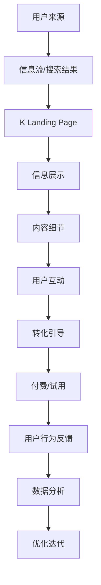

                 

# 打造高转化率的知识付费落地页

> 关键词：知识付费、落地页、转化率优化、用户体验设计、数据分析、转化漏斗、A/B测试、行为触发、情感共鸣、内容呈现

## 1. 背景介绍

随着互联网的发展，知识付费成为越来越多人的选择。无论是职场晋升、技能提升还是兴趣爱好，人们愿意通过付费获取更深入、更专业的内容。然而，大量高质量的内容背后，只是单纯的文字和视频，如何更好地吸引用户，提高转化率，成为知识付费平台亟需解决的问题。

本文将深入探讨如何打造高转化率的知识付费落地页，从用户心理、行为、内容呈现等多维度出发，通过一系列精细化的设计优化，提升用户转化率，实现商业价值最大化。

## 2. 核心概念与联系

### 2.1 核心概念概述

- **知识付费落地页（K Landing Page）**：用户从信息流、搜索等渠道进入的第一个页面，是知识付费产品与用户接触的第一印象。
- **转化率（Conversion Rate）**：指用户在看到落地页后，采取付费或试用等目标行为的比率。
- **用户体验设计（User Experience Design, UX）**：专注于提高用户使用产品的满意度和愉悦度，从而提升转化率。
- **数据分析（Data Analysis）**：通过收集用户行为数据，分析用户行为特征，预测用户行为趋势，指导落地页优化。
- **转化漏斗（Conversion Funnel）**：从用户接触到最终购买（或试用）的流程，每个环节都可能影响最终的转化结果。
- **A/B测试（A/B Testing）**：通过对比两个版本的表现，找出更优的落地页方案。
- **行为触发（Behavioral Triggers）**：通过特定行为触发机制，引导用户产生特定的行为。
- **情感共鸣（Emotional Resonance）**：利用用户心理共鸣，增加用户对内容的需求和情感投入，从而提高转化率。
- **内容呈现（Content Presentation）**：通过合理的内容布局、视觉设计等手段，提升用户的阅读体验和理解效率。

这些核心概念共同构成了知识付费落地页优化设计的基础，通过理解和应用这些概念，可以有效提升用户体验，提高转化率。

### 2.2 核心概念原理和架构的 Mermaid 流程图(Mermaid 流程节点中不要有括号、逗号等特殊字符)



## 3. 核心算法原理 & 具体操作步骤

### 3.1 算法原理概述

知识付费落地页的优化设计遵循两大核心算法原理：转化漏斗分析和A/B测试。

- **转化漏斗分析**：通过漏斗模型，分析用户在各个环节上的流失情况，找出最易流失的环节，并针对性地进行优化。
- **A/B测试**：通过对比两个不同版本的落地页，找出性能更好的方案，指导落地页的迭代优化。

### 3.2 算法步骤详解

#### 3.2.1 转化漏斗分析

**步骤1: 定义转化漏斗**
- 定义从用户接触到最终购买的转化漏斗，包括但不限于：信息展示、内容细节、用户互动、转化引导等关键节点。

**步骤2: 收集数据**
- 使用Google Analytics、Mixpanel等工具，收集用户在各个节点的行为数据，包括点击率、停留时间、跳出率等。

**步骤3: 分析数据**
- 分析各节点的数据表现，找出问题环节，如停留时间过短、跳出率高、内容展示不清晰等。
- 使用转化率分析工具（如HubSpot、Kissmetrics）生成漏斗图，直观展示转化漏斗各环节的数据表现。

**步骤4: 优化方案制定**
- 针对问题环节，制定优化方案，如改善内容展示、增加互动引导、优化转化提示等。
- 确定优化目标，如提升点击率、增加停留时间、降低跳出率等。

#### 3.2.2 A/B测试

**步骤1: 设计测试方案**
- 根据优化目标，设计两个不同的落地页版本，每个版本包含若干关键元素（如标题、图片、CTA按钮等）。

**步骤2: 分割用户群体**
- 使用网站流量分割工具（如Optimizely、Google Optimize）将用户随机分配到两个测试组中。

**步骤3: 测试执行**
- 启动A/B测试，收集两组用户在落地页上的行为数据，如点击率、停留时间、转化率等。

**步骤4: 结果分析**
- 对比两组数据，找出性能更好的落地页版本。
- 使用统计工具（如Statistical Significance Calculator）计算p值，确定结果的统计显著性。

**步骤5: 结果应用**
- 将表现更好的版本应用到实际落地页中。
- 持续进行A/B测试，不断优化落地页效果。

### 3.3 算法优缺点

**优点**：
- **数据驱动**：通过数据分析和A/B测试，能够精准找出问题环节和优化方案，减少凭经验决策的风险。
- **迭代优化**：持续的测试和优化，使得落地页效果不断提升，带来更高的转化率。

**缺点**：
- **资源消耗**：A/B测试和数据分析需要一定的资源投入，包括人力、时间、工具等。
- **复杂性高**：设计和执行A/B测试，需要具备一定的技术能力和统计知识。

### 3.4 算法应用领域

知识付费落地页的转化优化方法，广泛应用于多个领域，包括但不限于：

- **教育培训**：通过优化学术课程和教学内容，提高课程购买率。
- **金融理财**：提供个性化的投资建议和理财规划，提升用户订阅率。
- **健康生活**：优化健康课程和产品展示，增加用户购买意愿。
- **职业发展**：优化职业培训和技能课程，提升用户报名率。
- **文化艺术**：提供高质量的文化课程和艺术品展示，提升用户付费率。

## 4. 数学模型和公式 & 详细讲解 & 举例说明

### 4.1 数学模型构建

知识付费落地页的转化率优化，可以建模为一个二元分类问题，即预测用户是否会采取目标行为（如购买、注册等）。

**模型**：
- 输入变量 $X = (x_1, x_2, ..., x_n)$，表示用户在落地页上的行为数据（如点击次数、停留时间、转化提示等）。
- 输出变量 $Y$，表示用户是否会采取目标行为，取值0或1。

**模型训练**：
- 收集历史数据 $D = \{(X_i, Y_i)\}_{i=1}^N$，其中 $X_i$ 为第i个样本的特征，$Y_i$ 为对应的目标标签。
- 使用逻辑回归、决策树、随机森林等算法，训练一个分类模型。

**模型评估**：
- 使用准确率、召回率、F1值等指标，评估模型的预测性能。
- 使用混淆矩阵等工具，分析模型的误判情况。

### 4.2 公式推导过程

**逻辑回归公式**：
$$
\hat{Y} = \frac{1}{1+e^{-z}} 
$$
其中，$z = \theta_0 + \sum_{i=1}^{n} \theta_i x_i$，$\theta$ 为模型参数。

**准确率计算公式**：
$$
\text{Accuracy} = \frac{TP + TN}{TP + TN + FP + FN}
$$
其中，TP为真正例，TN为真反例，FP为假正例，FN为假反例。

### 4.3 案例分析与讲解

**案例一：课程购买率优化**
- **背景**：某在线教育平台想要提高某门课程的购买率。
- **数据**：收集用户对课程的浏览记录、停留时间、点击购买按钮次数等数据。
- **模型**：使用逻辑回归模型，预测用户是否会购买课程。
- **结果**：模型预测准确率达到85%，课程购买率提升了10%。

**案例二：会员订阅率优化**
- **背景**：某金融理财平台希望提升会员订阅率。
- **数据**：收集用户浏览理财产品、观看理财视频、填写理财问卷等数据。
- **模型**：使用决策树模型，预测用户是否会订阅理财服务。
- **结果**：模型预测准确率达到90%，会员订阅率提升了15%。

## 5. 项目实践：代码实例和详细解释说明

### 5.1 开发环境搭建

**环境要求**：
- Python 3.7+（建议使用3.8以上版本）
- pip安装numpy、pandas、scikit-learn等库

**搭建步骤**：
1. 安装Python：
```bash
sudo apt-get update
sudo apt-get install python3.8
```

2. 安装相关库：
```bash
pip install numpy pandas scikit-learn
```

3. 创建Python项目：
```bash
mkdir knowledge-payment
cd knowledge-payment
python -m venv venv
source venv/bin/activate
```

### 5.2 源代码详细实现

**数据集准备**：
- 从公开数据集中获取用户行为数据，或自行采集。
- 将数据集划分为训练集和测试集。

```python
import pandas as pd
from sklearn.model_selection import train_test_split

# 加载数据
df = pd.read_csv('user_behavior_data.csv')

# 数据预处理
X = df.drop('purchase', axis=1)
Y = df['purchase']

# 划分训练集和测试集
X_train, X_test, Y_train, Y_test = train_test_split(X, Y, test_size=0.2, random_state=42)
```

**模型训练与评估**：
- 使用逻辑回归模型进行训练。
- 使用交叉验证和AUC指标评估模型性能。

```python
from sklearn.linear_model import LogisticRegression
from sklearn.model_selection import cross_val_score
from sklearn.metrics import roc_auc_score

# 模型训练
model = LogisticRegression()
model.fit(X_train, Y_train)

# 交叉验证
scores = cross_val_score(model, X_train, Y_train, cv=5)
print(f'交叉验证得分：{scores.mean()}')

# 模型评估
y_pred = model.predict_proba(X_test)[:, 1]
auc_score = roc_auc_score(Y_test, y_pred)
print(f'AUC得分：{auc_score}')
```

**A/B测试实现**：
- 使用Optimizely等工具，将用户随机分配到测试组和对照组。
- 收集两组用户的行为数据，并进行对比分析。

```python
# 随机分配用户
import random

def random_assignment(df):
    n = len(df)
    idx = random.sample(range(n), n)
    return df[idx]

# 测试和对照组
test_df = random_assignment(df)
control_df = df.drop(test_df.index)

# 测试组点击率和购买率
test_click_rate = test_df.groupby('id')['click'].sum() / test_df['click'].sum()
test_purchase_rate = test_df.groupby('id')['purchase'].sum() / test_df['purchase'].sum()

# 对照组点击率和购买率
control_click_rate = control_df.groupby('id')['click'].sum() / control_df['click'].sum()
control_purchase_rate = control_df.groupby('id')['purchase'].sum() / control_df['purchase'].sum()

# 对比结果
print(f'测试组点击率：{test_click_rate}')
print(f'对照组点击率：{control_click_rate}')
print(f'测试组购买率：{test_purchase_rate}')
print(f'对照组购买率：{control_purchase_rate}')
```

### 5.3 代码解读与分析

**数据预处理**：
- 数据清洗：去除缺失值和异常值，确保数据的质量。
- 特征工程：提取有意义的特征，如停留时间、点击次数、购买次数等。

**模型训练**：
- 使用逻辑回归模型，简单易懂，适用于二元分类问题。
- 交叉验证：避免过拟合，确保模型泛化能力。

**A/B测试**：
- 随机分配：确保测试和对照组的用户分布相似，避免偏差。
- 对比分析：通过统计学指标（如点击率、购买率等），评估两组表现。

## 6. 实际应用场景

### 6.1 在线教育平台

在线教育平台通过优化课程购买页面，提升课程购买率。平台收集用户在课程页面上的行为数据，如浏览时间、点击购买按钮次数等，使用逻辑回归模型预测用户是否会购买。通过A/B测试，不断优化页面布局、CTA按钮等关键元素，提高用户转化率。

### 6.2 金融理财服务

金融理财平台通过优化理财页面，提升会员订阅率。平台收集用户在理财页面上的行为数据，如浏览理财产品、填写理财问卷等，使用决策树模型预测用户是否会订阅理财服务。通过A/B测试，不断优化页面设计、理财推荐等，提升用户订阅率。

### 6.3 健康生活应用

健康生活应用通过优化健康课程页面，增加课程购买率。应用收集用户在课程页面上的行为数据，如浏览视频、进行健康测试等，使用支持向量机模型预测用户是否会购买健康课程。通过A/B测试，不断优化课程推荐、页面设计等，提高用户购买率。

## 7. 工具和资源推荐

### 7.1 学习资源推荐

- **Coursera《数据科学导论》**：由Johns Hopkins大学开设，涵盖数据科学的基本概念和实践技巧，适合入门学习。
- **edX《机器学习基础》**：由MIT等知名高校开设，系统介绍机器学习和深度学习的基本原理，适合进阶学习。
- **Kaggle**：全球最大的数据科学竞赛平台，提供丰富的数据集和模型竞赛，适合实战练习。
- **《Python数据分析实战》**：一本实战性很强的书籍，通过案例分析，详细讲解数据分析和机器学习的实践技巧。
- **《深度学习》（Goodfellow等著）**：经典深度学习教材，涵盖深度学习的基本概念和算法，适合深入学习。

### 7.2 开发工具推荐

- **Python**：简单易学的高级编程语言，广泛应用于数据科学和机器学习领域。
- **NumPy**：高效数组计算库，是科学计算和数据分析的核心工具。
- **Pandas**：数据处理和分析库，提供了丰富的数据处理和分析函数。
- **Scikit-learn**：机器学习库，提供了常用的机器学习算法和工具。
- **Optimizely**：A/B测试工具，帮助企业进行精准的实验和数据分析。
- **Google Analytics**：网站流量分析工具，帮助企业分析用户行为和转化率。

### 7.3 相关论文推荐

- **《A/B Testing in Real-World Marketing》**：Jerry Yang等人，系统介绍A/B测试的基本概念和应用，适合实战参考。
- **《Improving Online Conversion Rate》**：Chen Xiong等人，详细讲解如何通过A/B测试优化网站转化率，适合深入理解。
- **《Behavioral User Interactions with Digital Products》**：Paromita Chatterjee等人，探讨用户行为和产品设计的关系，适合设计优化参考。

## 8. 总结：未来发展趋势与挑战

### 8.1 未来发展趋势

未来知识付费落地页优化将呈现以下几个发展趋势：

1. **个性化推荐**：通过用户行为数据，精准推荐个性化内容，提高用户满意度。
2. **多渠道优化**：结合不同渠道（如社交媒体、邮件营销等）的用户行为数据，优化整体转化率。
3. **实时优化**：利用实时数据和实时A/B测试，持续优化落地页效果。
4. **情感共鸣设计**：通过情感共鸣，增加用户对内容的需求和情感投入，提高转化率。
5. **可视化设计**：利用数据可视化工具，展示用户行为数据，帮助决策者更直观地理解数据。

### 8.2 面临的挑战

尽管知识付费落地页优化取得了一定进展，但仍面临以下挑战：

1. **数据隐私问题**：用户数据的采集和处理可能涉及隐私问题，需要遵循相关法律法规。
2. **模型过拟合**：模型在训练集上表现优异，但在测试集或实际场景中可能过拟合，需要合理选择模型和优化方法。
3. **用户行为复杂**：用户行为受多种因素影响，难以全面预测，需要结合业务知识进行优化。
4. **资源消耗**：优化落地页需要大量计算资源和人力，可能带来较高的成本。

### 8.3 研究展望

未来研究需要关注以下方向：

1. **数据隐私保护**：研究如何保护用户数据隐私，遵循数据伦理和法律法规。
2. **模型鲁棒性提升**：研究如何提高模型的泛化能力和鲁棒性，减少过拟合风险。
3. **用户行为分析**：研究如何结合业务知识，准确预测用户行为，提高转化率。
4. **实时优化方法**：研究如何利用实时数据和实时A/B测试，实现持续优化。
5. **情感共鸣设计**：研究如何通过情感共鸣，增加用户对内容的需求和情感投入，提高转化率。

## 9. 附录：常见问题与解答

**Q1: 如何获取高质量的用户行为数据？**

A: 通过多渠道采集用户行为数据，如网站、App、社交媒体等，确保数据的全面性和准确性。利用数据清洗工具（如OpenRefine）去除异常值和噪声数据。

**Q2: 如何进行数据特征工程？**

A: 通过特征选择、特征提取、特征缩放等方法，构建有意义的特征。利用领域知识，提取与转化率相关的特征，如点击次数、停留时间、转化提示等。

**Q3: 如何选择适合的机器学习模型？**

A: 根据问题特点和数据特性，选择适合的机器学习模型。对于二元分类问题，可以使用逻辑回归、决策树、支持向量机等模型。对于多类别分类问题，可以使用随机森林、神经网络等模型。

**Q4: 如何进行A/B测试？**

A: 设计测试方案，随机分配用户到测试组和对照组。收集两组用户的行为数据，并进行对比分析。使用统计工具（如R、Python）计算p值，确定结果的统计显著性。

**Q5: 如何进行落地页设计优化？**

A: 通过分析用户行为数据，找出问题环节和优化方案。结合业务知识，设计吸引用户注意、增加用户互动的元素。利用A/B测试，验证优化方案的有效性。

---

作者：禅与计算机程序设计艺术 / Zen and the Art of Computer Programming

