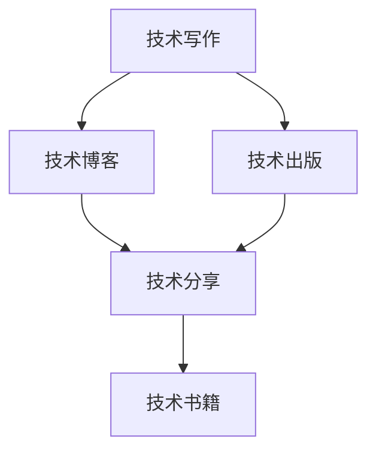

                 

# 技术写作：从博客到出版图书

> 关键词：技术写作,博客,出版图书,专业博客,技术分享,技术文章,写作技巧,书籍出版,作者成长

## 1. 背景介绍

### 1.1 问题由来
随着互联网的普及和技术的不断进步，技术博客和技术文章成为了技术人员分享知识、交流经验的重要平台。无论是对从业者的技术提升，还是对新入行的学生，这些内容都具有不可替代的价值。然而，想要从零开始运营一个有影响力的技术博客，并将其内容整理成书籍出版，并非易事。本系列文章将深入探讨技术写作的各个方面，从博客到图书，一步步教你如何将技术知识转化为有价值的读物。

### 1.2 问题核心关键点
技术写作的核心在于如何将复杂的、专业的技术知识用清晰、易懂的语言表达出来，并有效地传达给读者。这不仅需要扎实的技术功底，还需要良好的写作技巧和结构化思维。出版的图书则是在技术写作基础上的进一步精炼与整理，通常会经过多轮编辑和校对，确保内容的严谨性和可读性。

本系列文章将聚焦于技术写作的核心要点，包括选择合适的博客平台、提升写作技巧、结构化组织文章、书籍出版的准备和流程等，帮助读者从零开始，逐步积累经验，最终成功出版自己的技术书籍。

### 1.3 问题研究意义
技术写作和出版不仅能够提升个人的技术水平和表达能力，还能构建个人的技术品牌，推动技术传播和创新。通过技术写作和出版的过程，读者可以学习到如何更好地理解和应用技术知识，同时作者也能在分享中获得成就感，拓展职业发展的可能性。

## 2. 核心概念与联系

### 2.1 核心概念概述

为更好地理解技术写作和出版的核心概念，本节将介绍几个关键概念及其相互关系：

- **技术写作**：将复杂、专业的技术知识用易于理解的语言表达出来，传递给读者的过程。
- **技术博客**：个人或团队通过网络平台定期发布技术文章，分享知识与经验，建立技术影响力的方式。
- **技术出版**：将技术文章或书籍提交给出版社，经编辑、校对和设计等流程后，以书籍形式公开出版的过程。
- **技术分享**：通过写作、博客、演讲等多种方式，向公众传播技术知识，促进技术交流与创新。
- **技术书籍**：由专家或机构编写，系统、全面介绍某一领域技术知识的出版物。

这些概念之间存在紧密的联系：技术写作是技术博客和技术出版的基础，而技术博客和书籍出版则是技术写作的进阶表现形式，共同构成了技术传播和创新的重要途径。

### 2.2 核心概念原理和架构的 Mermaid 流程图



这个流程图展示了技术写作、技术博客、技术出版和技术书籍之间的逻辑关系：

1. 技术写作是技术博客和书籍出版的基础。
2. 技术博客和技术出版是技术写作的高级形式。
3. 技术分享可以通过多种形式实现，包括博客和书籍出版。
4. 技术书籍是技术分享的重要组成部分，通常包含更系统、全面的技术知识。

## 3. 核心算法原理 & 具体操作步骤

### 3.1 算法原理概述

技术写作和出版的过程，本质上是一种知识传递和信息组织的过程。其核心在于将复杂的、专业的技术知识转化为易于理解、易传播的形式，并通过有效的结构化组织，使读者能够系统、全面地掌握相关知识。

形式化地，假设我们有初始的知识库 $K$ 和目标读者群 $R$，目标是设计一套系统化的写作和出版流程，将 $K$ 转化为读者能够轻松理解和掌握的知识 $O$。

具体而言，技术写作和出版包括如下几个关键步骤：

1. **知识整理与精炼**：将原始的知识库 $K$ 进行整理、精炼，提炼出核心概念、方法和应用场景。
2. **结构化组织**：将精炼后的知识 $O$ 按照逻辑顺序组织成文章或书籍的章节结构。
3. **语言表达与优化**：使用清晰、易懂的语言表达知识，并进行优化，确保信息的准确性和可读性。
4. **编辑与校对**：对最终作品进行多轮编辑和校对，确保内容的严谨性和易读性。
5. **设计排版与出版**：进行书籍的封面设计、排版和出版流程，将作品呈现给读者。

### 3.2 算法步骤详解

基于上述原理，技术写作和出版的具体步骤如下：

**Step 1: 准备知识库**

- 确定要写作或出版的技术主题，收集相关文献、代码、案例等原始材料。
- 对原始材料进行初步整理，提炼出核心概念、方法和应用场景。

**Step 2: 设计结构**

- 根据主题和目标读者群，设计文章的章节结构和目录。
- 确定每个章节的标题、摘要和主要内容。

**Step 3: 编写与优化**

- 根据章节结构，撰写文章或书籍的草稿。
- 使用易于理解的语言表达复杂的技术概念，并进行优化。
- 增加案例分析、代码示例等辅助材料，帮助读者理解。

**Step 4: 编辑与校对**

- 进行多轮编辑，修正语法错误，优化表达方式。
- 邀请同行专家或技术社区的成员进行校对，提供反馈和建议。

**Step 5: 设计排版与出版**

- 进行书籍的封面设计、排版和格式调整。
- 选择合适的出版社，提交出版申请。
- 根据出版社的反馈，进行最后的修订。
- 正式出版发行。

### 3.3 算法优缺点

技术写作和出版的方法具有以下优点：
1. **系统化与全面性**：通过系统化组织知识，读者能够系统地掌握某一领域的技术知识。
2. **权威性与可信度**：通过出版流程，知识经过了专业审校，具备较高的权威性和可信度。
3. **易读性与传播性**：通过清晰的语言表达和结构化组织，文章或书籍更容易被读者理解和传播。

同时，该方法也存在一些局限性：
1. **时间成本高**：从知识整理到出版的整个过程可能需要较长时间，效率较低。
2. **技术门槛高**：需要具备一定的写作和编辑能力，以及较为系统的技术知识。
3. **市场需求风险**：出版物的市场需求受多种因素影响，可能面临较高的市场风险。

尽管存在这些局限性，但就目前而言，技术写作和出版仍是传播技术知识、建立技术品牌的重要手段。未来相关研究的重点在于如何提高效率、降低门槛，同时兼顾内容的质量和传播效果。

### 3.4 算法应用领域

技术写作和出版的方法广泛应用于技术社区、科技出版、教育培训等多个领域，例如：

- **技术社区**：如GitHub Wiki、Medium等平台，通过撰写技术博客，分享代码、项目经验和行业见解。
- **科技出版**：如O'Reilly、IEEE Press等出版社，系统介绍某一领域的技术知识和应用实践。
- **教育培训**：如Coursera、Udacity等在线教育平台，通过编写教材、讲义，传授技术知识和技能。

除了上述这些经典领域外，技术写作和出版还被创新性地应用到更多场景中，如技术演讲、技术培训、技术博客等，为技术知识的传播和应用提供了新的途径。

## 4. 数学模型和公式 & 详细讲解 & 举例说明

### 4.1 数学模型构建

本节将使用数学语言对技术写作和出版的过程进行更加严格的刻画。

假设我们要将一个关于机器学习算法的主题 $K$，系统化地组织成一本技术书籍，其数学模型构建如下：

- **输入**：原始的知识库 $K$ 和目标读者群 $R$。
- **输出**：系统化的技术书籍 $O$。
- **目标函数**：优化信息的准确性、可读性和传播性。

具体而言，可以将技术写作和出版的过程表示为如下优化问题：

$$
\min_{O} \mathcal{L}(O, R) = \mathcal{L}_{\text{accuracy}}(O) + \mathcal{L}_{\text{readability}}(O) + \mathcal{L}_{\text{spreadability}}(O)
$$

其中 $\mathcal{L}_{\text{accuracy}}(O)$ 为信息准确性损失函数，$\mathcal{L}_{\text{readability}}(O)$ 为可读性损失函数，$\mathcal{L}_{\text{spreadability}}(O)$ 为传播性损失函数。

### 4.2 公式推导过程

以下我们以机器学习算法分类器的设计和优化为例，推导损失函数的计算公式。

假设我们要设计一个支持向量机（SVM）分类器，其目标是将数据集 $D$ 中的样本 $(x_i, y_i)$ 进行分类，其中 $x_i \in \mathcal{X}, y_i \in \{0,1\}$。假设训练集为 $D_{\text{train}}$，测试集为 $D_{\text{test}}$。

我们的目标函数可以表示为：

$$
\min_{\theta} \mathcal{L}(\theta) = \frac{1}{N} \sum_{i=1}^N \ell(\hat{y}_i, y_i)
$$

其中 $\ell$ 为损失函数，$\hat{y}_i$ 为模型对样本 $x_i$ 的预测结果，$y_i$ 为真实标签。

以二分类问题为例，我们通常使用交叉熵损失函数：

$$
\ell(\hat{y}_i, y_i) = -[y_i\log \hat{y}_i + (1-y_i)\log (1-\hat{y}_i)]
$$

将其代入目标函数，得：

$$
\mathcal{L}(\theta) = -\frac{1}{N}\sum_{i=1}^N [y_i\log M_{\theta}(x_i)+(1-y_i)\log(1-M_{\theta}(x_i))]
$$

其中 $M_{\theta}$ 为模型函数，如SVM分类器的决策边界函数。

根据链式法则，损失函数对参数 $\theta$ 的梯度为：

$$
\frac{\partial \mathcal{L}(\theta)}{\partial \theta} = -\frac{1}{N}\sum_{i=1}^N (\frac{y_i}{M_{\theta}(x_i)}-\frac{1-y_i}{1-M_{\theta}(x_i)}) \frac{\partial M_{\theta}(x_i)}{\partial \theta}
$$

其中 $\frac{\partial M_{\theta}(x_i)}{\partial \theta}$ 可进一步递归展开，利用自动微分技术完成计算。

在得到损失函数的梯度后，即可带入参数更新公式，完成模型的迭代优化。重复上述过程直至收敛，最终得到适应目标读者群 $R$ 的最优模型参数 $\theta^*$。

### 4.3 案例分析与讲解

假设我们有一本关于深度学习的基础书籍，内容涉及神经网络、卷积神经网络、循环神经网络等基本概念和算法。

- **章节设计**：将深度学习分为三章，每章详细介绍一种网络类型。
- **案例分析**：在每章中引入一些经典案例，如MNIST手写数字识别、CIFAR-10图像分类等，帮助读者理解理论知识。
- **代码示例**：提供每个案例的代码实现，方便读者进行动手实践。

## 5. 项目实践：代码实例和详细解释说明

### 5.1 开发环境搭建

在进行技术写作和出版的实践前，我们需要准备好开发环境。以下是使用LaTeX进行技术书籍编写和排版的环境配置流程：

1. 安装TeX Live或MiKTeX：从官网下载并安装TeX发行版，用于排版和编译LaTeX文件。
2. 安装并安装文本编辑器：如TeXstudio、Overleaf等，用于编写LaTeX代码。
3. 安装PDF读者：如Adobe Acrobat Reader等，用于预览和阅读生成的PDF文件。

完成上述步骤后，即可在所配置的环境中开始技术书籍的编写。

### 5.2 源代码详细实现

下面以编写一本关于深度学习基础书籍的LaTeX代码实现为例。

首先，定义书籍的封面和基本信息：

```latex
\documentclass{book}
\title{深度学习基础}
\author{作者姓名}
\date{2023年}
\usepackage{amsmath, graphicx}
\usepackage[utf8]{inputenc}
\usepackage[T1]{fontenc}
\usepackage{amsfonts}
\usepackage[bookmarks=true, bookmarksdepth=5, colorlinks=true, linkcolor=blue, urlcolor=blue, citecolor=red]{hyperref}
```

接着，定义章节和内容：

```latex
\begin{document}
\maketitle
\tableofcontents

\chapter{神经网络基础}
\label{chap:neural-networks}
\section{神经网络结构}
...
\subsection{全连接网络}
...
\subsubsection{权重与偏差}
...

\chapter{卷积神经网络}
\label{chap:convolutional-neural-networks}
\section{卷积层与池化层}
...
\subsection{卷积神经网络案例}
...
\subsubsection{手写数字识别}
...

\chapter{循环神经网络}
\label{chap:recurrent-neural-networks}
\section{循环神经网络结构}
...
\subsection{循环神经网络案例}
...
\subsubsection{情感分析}
...
\end{document}
```

最后，插入代码和图表：

```latex
\begin{figure}[h]
  \centering
  \includegraphics[scale=0.5]{image.png}
  \caption{网络结构示意图}
  \label{fig:network-structure}
\end{figure}

\begin{lstlisting}[language=Python]
import numpy as np

# 定义网络结构
class NeuralNetwork:
    def __init__(self, input_size, hidden_size, output_size):
        self.input_size = input_size
        self.hidden_size = hidden_size
        self.output_size = output_size
        
        # 初始化权重和偏差
        self.weights1 = np.random.randn(input_size, hidden_size)
        self.bias1 = np.zeros(hidden_size)
        self.weights2 = np.random.randn(hidden_size, output_size)
        self.bias2 = np.zeros(output_size)
```

可以看到，通过使用LaTeX，我们能够非常方便地实现技术书籍的排版和格式化。代码示例和数学公式的嵌入也使得书籍内容更加生动和易于理解。

### 5.3 代码解读与分析

让我们再详细解读一下关键代码的实现细节：

**LaTeX代码**：
- `\documentclass`：定义文档类型为书籍。
- `\title`、`\author`、`\date`：定义书籍的标题、作者和出版日期。
- `\usepackage`：导入需要的LaTeX包，如数学符号、图形处理、PDF读者等。
- `\begin{document}`和`\end{document}`：定义文档的开始和结束。
- `\chapter`、`\section`、`\subsection`：定义章节和子章节。
- `\label`：为引用提供标记。
- `\caption`：定义图表的标题。
- `\includegraphics`：插入图片文件。
- `\lstlisting`：插入代码块。

**代码示例**：
- `import numpy as np`：导入Python的numpy库，用于数学运算。
- `class NeuralNetwork`：定义神经网络类。
- `self.weights1`、`self.bias1`、`self.weights2`、`self.bias2`：初始化权重和偏差。

通过这段代码示例，可以看出LaTeX和Python的结合使用，使得技术书籍的编写更加高效和灵活。

### 5.4 运行结果展示

完成代码编写后，通过编译器编译LaTeX文件，即可得到PDF格式的书籍。打开生成的PDF文件，即可看到完整的技术书籍内容。

```latex
\documentclass{book}
\title{深度学习基础}
\author{作者姓名}
\date{2023年}
\usepackage{amsmath, graphicx}
\usepackage[utf8]{inputenc}
\usepackage[T1]{fontenc}
\usepackage{amsfonts}
\usepackage[bookmarks=true, bookmarksdepth=5, colorlinks=true, linkcolor=blue, urlcolor=blue, citecolor=red]{hyperref}
\begin{document}
\maketitle
\tableofcontents
...
\end{document}
```

## 6. 实际应用场景

### 6.1 智能教育

技术写作和出版在智能教育领域有广泛的应用。通过撰写教材、讲义，能够系统地传授知识，帮助学生更好地理解技术概念和应用。此外，开放的教育资源平台如Coursera、Udacity等，也提供了大量的在线课程和技术书籍，为全球学习者提供了学习的机会。

### 6.2 科技出版

科技出版是技术写作和出版的重要应用领域，如IEEE Press、O'Reilly等出版社，通过出版高质量的技术书籍，推动技术知识的传播和创新。这些书籍通常由行业专家编写，内容权威、系统，是技术从业者的重要参考资料。

### 6.3 技术博客与社区

技术博客和技术社区是技术写作和出版的重要平台。通过撰写博客文章，分享技术知识和经验，作者可以建立技术影响力，与读者互动交流。GitHub Wiki、Medium等平台提供了丰富的技术资源，为技术传播和交流提供了便利。

### 6.4 未来应用展望

随着技术的发展，技术写作和出版将面临更多的挑战和机遇。未来的技术写作和出版可能将更加注重以下方面：

1. **多模态融合**：结合图像、视频等多模态数据，提升技术写作的生动性和可读性。
2. **互动与反馈**：利用Web技术，增加技术书籍的互动性和用户反馈机制，提升用户参与度。
3. **自适应学习**：通过数据分析，实现技术写作的个性化推荐和自适应学习，提升学习效果。
4. **全球化传播**：利用互联网技术，实现全球化的技术知识传播，推动全球技术发展。

技术写作和出版将伴随技术的进步，不断创新和演进，为技术传播和创新提供更强大的支持。

## 7. 工具和资源推荐

### 7.1 学习资源推荐

为了帮助开发者系统掌握技术写作和出版的技术基础和实践技巧，这里推荐一些优质的学习资源：

1. **LaTeX官方文档**：LaTeX的官方文档，详细介绍了LaTeX的使用方法和常见问题。
2. **Overleaf在线编辑器**：一个基于云的LaTeX编辑器，提供了丰富的模板和工具，方便编写和排版LaTeX文件。
3. **在线编程学习平台**：如LeetCode、HackerRank等，提供丰富的编程题目和技术文章，帮助提升编程和写作能力。
4. **技术博客社区**：如Medium、CSDN等，提供技术文章分享和社区交流的平台，提升技术写作和传播能力。

通过对这些资源的学习实践，相信你一定能够快速掌握技术写作和出版的精髓，并用于解决实际的技术问题。

### 7.2 开发工具推荐

高效的技术写作和出版离不开优秀的工具支持。以下是几款常用的开发工具：

1. **LaTeX**：一种专业的排版系统，适合编写和排版高质量的技术书籍。
2. **Overleaf**：一个在线LaTeX编辑器，提供了丰富的模板和协作功能，方便编写和共享LaTeX文件。
3. **GitHub Wiki**：一个开源协作的平台，用于编写和分享技术文章和文档。
4. **Jupyter Notebook**：一个交互式的编程环境，支持Python、R等语言的编写和执行。
5. **Markdown**：一种轻量级的标记语言，适合编写博客和技术文档。

合理利用这些工具，可以显著提升技术写作和出版的效率和质量，快速积累技术知识和传播能力。

### 7.3 相关论文推荐

技术写作和出版的发展源于学界的持续研究。以下是几篇奠基性的相关论文，推荐阅读：

1. **《技术写作与出版》（Technical Writing and Publishing）**：介绍技术写作的基本原则和出版流程。
2. **《开放获取与技术出版》（Open Access and Technical Publishing）**：探讨开放获取对技术出版的影响和挑战。
3. **《技术写作的未来》（The Future of Technical Writing）**：预测技术写作的发展趋势和未来方向。

这些论文代表了大语言模型微调技术的发展脉络。通过学习这些前沿成果，可以帮助研究者把握学科前进方向，激发更多的创新灵感。

## 8. 总结：未来发展趋势与挑战

### 8.1 总结

本文对技术写作和出版的核心内容进行了全面系统的介绍。首先阐述了技术写作和出版的研究背景和意义，明确了技术写作和出版的核心步骤和目标。其次，从原理到实践，详细讲解了技术写作和出版的数学模型和操作步骤，给出了技术书籍编写的完整代码实例。同时，本文还广泛探讨了技术写作和出版在教育、出版、博客等多个领域的应用前景，展示了技术写作和出版的广阔前景。此外，本文精选了技术写作和出版的各类学习资源，力求为读者提供全方位的技术指引。

通过本文的系统梳理，可以看到，技术写作和出版是传播技术知识、建立技术品牌的重要手段。这一过程不仅能够提升个人的技术水平和表达能力，还能构建个人的技术品牌，推动技术传播和创新。未来，伴随技术的发展，技术写作和出版技术还将不断创新和演进，为技术传播和创新提供更强大的支持。

### 8.2 未来发展趋势

展望未来，技术写作和出版技术将呈现以下几个发展趋势：

1. **多模态融合**：结合图像、视频等多模态数据，提升技术写作的生动性和可读性。
2. **互动与反馈**：利用Web技术，增加技术书籍的互动性和用户反馈机制，提升用户参与度。
3. **自适应学习**：通过数据分析，实现技术写作的个性化推荐和自适应学习，提升学习效果。
4. **全球化传播**：利用互联网技术，实现全球化的技术知识传播，推动全球技术发展。

这些趋势凸显了技术写作和出版技术的广阔前景。这些方向的探索发展，必将进一步提升技术写作和出版的质量，为技术传播和创新提供更强大的支持。

### 8.3 面临的挑战

尽管技术写作和出版技术已经取得了瞩目成就，但在迈向更加智能化、普适化应用的过程中，它仍面临着诸多挑战：

1. **知识更新迅速**：技术日新月异，技术书籍和文章需要不断更新才能保持时效性。
2. **市场需求变化快**：技术领域发展迅速，市场需求也在不断变化，技术书籍的生存周期短。
3. **技术门槛高**：需要具备一定的写作和编辑能力，以及较为系统的技术知识。
4. **传播途径限制**：技术书籍和文章受限于出版流程和传播渠道，传播速度和范围有限。

尽管存在这些挑战，但通过不断优化技术写作和出版流程，提升技术书籍的质量和传播能力，这些挑战终将逐渐被克服。

### 8.4 研究展望

面对技术写作和出版所面临的挑战，未来的研究需要在以下几个方面寻求新的突破：

1. **自动化工具**：开发更智能的技术写作和出版工具，自动生成技术文章和书籍章节，提升生产效率。
2. **个性化推荐**：利用机器学习技术，实现技术文章和书籍的个性化推荐，提升读者体验。
3. **多语言支持**：开发多语言的技术写作和出版工具，实现全球化的技术知识传播。
4. **内容质量提升**：提升技术书籍和文章的质量，确保内容的准确性和可读性。
5. **互动体验优化**：提升技术书籍和文章的互动性和用户反馈机制，增强用户参与度。

这些研究方向的探索，必将引领技术写作和出版技术迈向更高的台阶，为技术传播和创新提供更强大的支持。面向未来，技术写作和出版技术还需要与其他人工智能技术进行更深入的融合，如知识表示、因果推理、强化学习等，多路径协同发力，共同推动技术写作和出版技术的进步。只有勇于创新、敢于突破，才能不断拓展技术写作和出版技术的边界，让技术知识更好地造福人类社会。

## 9. 附录：常见问题与解答

**Q1：如何选择合适的技术博客平台？**

A: 选择技术博客平台时，应考虑以下因素：
1. **用户群体**：选择与目标读者群匹配的平台，如开发者社区、教育平台等。
2. **内容形式**：支持文章、视频、代码等不同内容形式的平台。
3. **访问量与曝光度**：选择访问量大、曝光度高的平台，提升文章的传播效果。
4. **编辑与社区支持**：选择提供良好编辑与社区支持的平台，方便文章发布与维护。

**Q2：如何提升技术写作的质量？**

A: 提升技术写作质量的关键在于以下几个方面：
1. **结构化组织**：使用清晰的章节结构和逻辑顺序，系统地呈现知识。
2. **易于理解的语言**：使用简单、易懂的语言，避免专业术语，提升可读性。
3. **案例分析与代码示例**：通过案例分析和代码示例，帮助读者理解和应用知识。
4. **多轮修订与校对**：多次修订和校对，确保内容的准确性和易读性。

**Q3：如何提高技术书籍的传播效果？**

A: 提高技术书籍传播效果的策略包括：
1. **多渠道发布**：通过博客、社交媒体、电子书等多种渠道发布书籍内容。
2. **互动与反馈**：利用评论区、社交媒体等平台，增加互动和用户反馈，提升用户参与度。
3. **全球化传播**：通过翻译和本地化，推动技术书籍的全球化传播。

**Q4：如何处理技术书籍的更新问题？**

A: 技术书籍的更新可以采取以下策略：
1. **定期维护**：定期对书籍进行更新和修订，保持内容的及时性和准确性。
2. **版本控制**：使用版本控制系统，记录每次更新内容，方便追踪和回溯。
3. **用户反馈**：收集用户反馈，了解需求和问题，针对性地进行更新。

**Q5：如何处理技术书籍的多语言问题？**

A: 处理技术书籍多语言问题的策略包括：
1. **本地化翻译**：将书籍翻译成多种语言，适应不同地区的读者需求。
2. **多语言版本**：发布多语言版本的书籍，方便全球读者阅读。
3. **国际化设计**：采用国际化设计，确保书籍在不同语言环境下具有良好的阅读体验。

通过对这些问题的解答，相信你一定能够更好地掌握技术写作和出版的方法，提升技术传播和创新的能力。

---

作者：禅与计算机程序设计艺术 / Zen and the Art of Computer Programming

