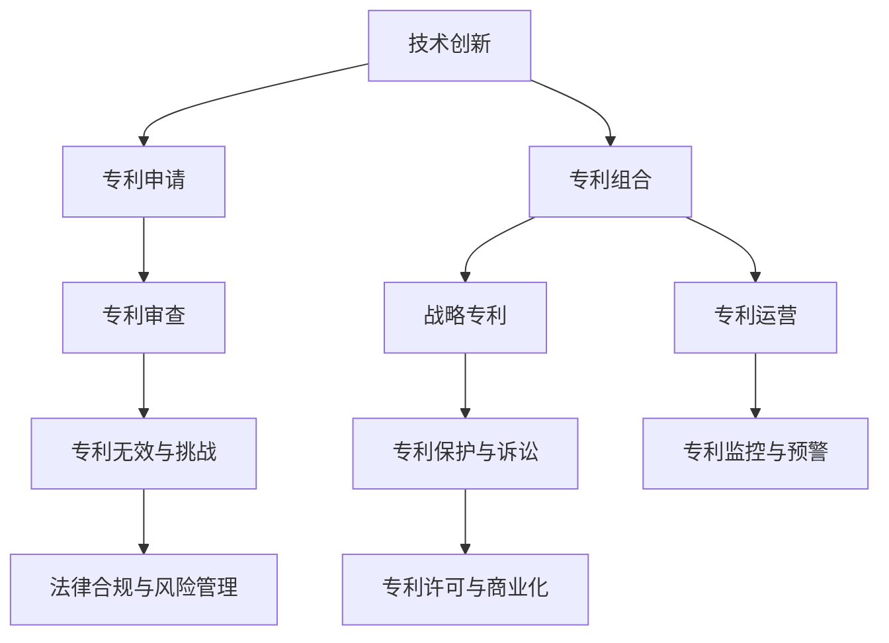

                 

# 技术创新与专利组合：构建知识产权帝国

> 关键词：技术创新,专利组合,知识产权帝国,AI 专利策略,战略专利,知识产权保护,法律合规

## 1. 背景介绍

### 1.1 问题由来
在全球数字化转型的浪潮中，技术创新与知识产权战略成为企业竞争的重要抓手。越来越多的企业开始重视利用专利布局构建自己的技术壁垒，以期在竞争激烈的市场上保持领先地位。特别是在人工智能领域，技术创新日新月异，专利的布局与运用显得尤为重要。

### 1.2 问题核心关键点
构建知识产权帝国，核心在于通过专利组合实现技术垄断、市场控制和利润最大化。具体的关键点包括：
- **专利组合构建**：如何将技术创新点转化为专利，构建覆盖全面、防御性强、攻击性强的专利组合。
- **战略专利部署**：如何选择合适的时机和地域，对核心技术进行专利布局。
- **专利组合保护与运用**：如何通过专利诉讼、许可等手段，保护和最大化专利价值。
- **法律合规与风险管理**：如何合法合规地进行专利布局和运营，避免侵权风险。

### 1.3 问题研究意义
研究技术创新与专利组合策略，对于提升企业的市场竞争力，维护自身技术优势，防止竞争对手通过逆向工程或直接抄袭等方式盗取核心技术，具有重要意义。

## 2. 核心概念与联系

### 2.1 核心概念概述

为更好地理解技术创新与专利组合策略，本节将介绍几个核心概念：

- **技术创新**：指企业通过技术研发、产品改进、工艺优化等方式，开发新技术、新产品、新服务，满足市场需求，提升产品竞争力的过程。
- **专利**：指由国家或地区政府授予的发明、实用新型、外观设计等技术创新点的独占权。专利是一种法律权利，保护持有者对技术的使用、制造、销售和进口等独占权。
- **专利组合**：指企业在特定技术领域内，通过申请多项专利形成的整体专利布局。专利组合的构建应覆盖关键技术点、防范竞争对手的挑战。
- **战略专利**：指对企业核心竞争力的关键技术进行优先专利布局，形成对技术市场的主导和控制。战略专利应具备高保护强度、长有效期、易实现商业化等特点。
- **知识产权保护**：指通过专利、商标、版权等知识产权手段，保护企业技术、品牌和创新成果，防止侵权和盗用。
- **法律合规与风险管理**：指在专利布局和运营过程中，遵守相关法律法规，进行合规性审查，确保运营行为不构成侵权或违反法律规定，同时进行风险评估和管理，降低潜在的法律风险。

这些核心概念之间的逻辑关系可以通过以下Mermaid流程图来展示：



这个流程图展示了的核心概念及其之间的关系：

1. 技术创新驱动专利申请。
2. 通过专利组合构建战略专利。
3. 专利组合通过诉讼、许可等手段实现保护与运用。
4. 法律合规与风险管理确保运营行为的合法性。
5. 专利监控与预警机制预防潜在侵权风险。

## 3. 核心算法原理 & 具体操作步骤
### 3.1 算法原理概述

构建知识产权帝国的核心算法原理是通过技术创新驱动专利申请，形成专利组合，进而通过战略专利部署实现技术垄断，通过法律合规和风险管理保护专利价值。以下是详细的算法原理概述：

**算法步骤：**

1. **技术创新**：企业通过R&D部门开发新技术、新产品或新服务，并进行内部评估和市场验证，形成具有商业价值的技术创新点。
2. **专利申请**：将技术创新点转化为专利申请，通过国家或地区的专利办公室进行形式审查和实质审查，获得专利授权。
3. **专利组合构建**：对授权的专利进行分类整理，构建全面覆盖、防御性强的专利组合。
4. **战略专利部署**：根据市场需求和技术趋势，选择核心技术点进行优先专利布局，形成战略专利。
5. **专利保护与运用**：通过专利诉讼、许可等方式，保护和运用战略专利，实现利润最大化。
6. **法律合规与风险管理**：进行专利运营的合规性审查，进行法律风险评估和管理，确保运营行为合法合规。
7. **专利监控与预警**：实时监控竞争对手的专利布局和市场动向，预警潜在侵权风险。

### 3.2 算法步骤详解

**步骤1: 技术创新**

- **内部研发**：企业内部R&D团队进行技术创新，形成技术成果。
- **市场验证**：将技术成果进行市场测试，验证其商业价值和市场需求。
- **专利申请**：对技术成果进行专利申请，提交国家或地区专利办公室进行审查。

**步骤2: 专利申请**

- **专利撰写**：根据技术成果，撰写专利申请文件，包括背景技术、发明内容、实施例、权利要求等。
- **形式审查**：专利申请文件提交国家或地区专利办公室，进行形式审查。
- **实质审查**：形式审查通过后，进入实质审查阶段，审查专利申请的创新性和实用性。
- **授权与公布**：实质审查通过后，获得专利授权，并在专利公报中公开。

**步骤3: 专利组合构建**

- **专利分类**：对授权专利进行分类，形成专利族和专利组合。
- **专利地图**：绘制专利地图，展示企业在特定技术领域的专利布局情况。
- **专利壁垒**：构建专利壁垒，形成对竞争对手的技术封锁。

**步骤4: 战略专利部署**

- **核心技术选择**：选择对企业核心竞争力的关键技术进行优先布局。
- **专利申请策略**：制定专利申请策略，涵盖先申请、多地域申请、联合申请等。
- **时间节点**：选择合适的时机进行专利布局，如产品上市前、市场竞争加剧时等。

**步骤5: 专利保护与运用**

- **专利诉讼**：针对侵权行为，进行专利诉讼，保护自身利益。
- **许可协议**：通过许可协议，将专利授权给其他企业使用，收取授权费。
- **专利资产管理**：对专利资产进行评估、管理和维护，确保其长期价值。

**步骤6: 法律合规与风险管理**

- **合规审查**：进行专利运营的合规性审查，确保不构成侵权或违反法律规定。
- **风险评估**：进行法律风险评估，包括侵权风险、无效风险等。
- **风险管理**：制定风险管理策略，防范法律风险。

**步骤7: 专利监控与预警**

- **竞争分析**：实时监控竞争对手的专利布局和市场动向。
- **预警系统**：建立专利预警系统，及时发现潜在的侵权风险。

### 3.3 算法优缺点

构建知识产权帝国的专利组合策略具有以下优点：
1. **技术垄断**：通过专利组合形成对核心技术的垄断，提高企业市场竞争力。
2. **市场控制**：通过战略专利部署，控制技术市场，防止竞争对手挑战。
3. **利润最大化**：通过专利诉讼和许可，最大化专利价值，实现利润增长。

但同时也存在以下缺点：
1. **成本高昂**：专利申请和维护费用较高，投入成本较大。
2. **法律风险**：专利侵权诉讼和无效挑战存在法律风险。
3. **专利更新**：需定期更新专利组合，以应对技术变化和市场竞争。

### 3.4 算法应用领域

构建知识产权帝国的专利组合策略广泛应用于人工智能、生物医药、通信、电子、材料等多个高科技领域。以下列举几个具体应用案例：

- **人工智能领域**：通过专利组合构建，实现对深度学习、自然语言处理、计算机视觉等核心技术的保护，防止竞争对手通过逆向工程或直接抄袭获取核心技术。
- **生物医药领域**：对新药研发、治疗方法、基因编辑等关键技术进行专利布局，控制市场需求和技术方向。
- **通信领域**：对5G、物联网、云计算等核心技术进行战略专利部署，形成技术壁垒，防止竞争对手通过标准制定等方式获取核心技术。

## 4. 数学模型和公式 & 详细讲解  
### 4.1 数学模型构建

本节将使用数学语言对技术创新与专利组合策略进行更加严格的刻画。

假设企业在技术创新后，成功申请了 $n$ 项专利，第 $i$ 项专利的保护范围为 $P_i$，有效期为 $T_i$，年授权费率为 $R_i$。假设专利组合中的每一项专利独立，企业的总利润为 $\Pi$。

模型目标是最小化总成本 $C$，同时最大化总利润 $\Pi$。

数学模型为：
$$
\begin{aligned}
& \min \quad C = \sum_{i=1}^n \frac{T_i}{R_i} \\
& \max \quad \Pi = \sum_{i=1}^n R_i \cdot P_i
\end{aligned}
$$

### 4.2 公式推导过程

以上数学模型的推导过程如下：

1. **总成本 $C$**：假设专利申请和维护费用固定，第 $i$ 项专利的年授权费率为 $R_i$，保护期为 $T_i$，则总成本为专利授权费的现值之和。
2. **总利润 $\Pi$**：每项专利的年授权费为 $R_i$，保护范围为 $P_i$，因此总利润为各项专利授权费乘以保护范围之和。

### 4.3 案例分析与讲解

**案例1: 人工智能领域**

- **技术创新点**：企业研发了一种先进的深度学习算法，用于语音识别。
- **专利申请**：企业成功申请了包含该算法的专利。
- **专利组合构建**：企业将该专利与其他相关专利组合，形成专利组合。
- **战略专利部署**：企业选择了该算法作为战略专利，进行优先布局。
- **专利保护与运用**：企业与多家科技公司签订许可协议，每年收取高额授权费。

**案例2: 生物医药领域**

- **技术创新点**：企业研发了一种新药，用于治疗某种罕见疾病。
- **专利申请**：企业成功申请了包含该药物制备方法和用途的专利。
- **专利组合构建**：企业将该专利与其他相关专利组合，形成专利组合。
- **战略专利部署**：企业选择了该药物制备方法作为战略专利，进行优先布局。
- **专利保护与运用**：企业通过专利诉讼，阻止竞争对手生产该药物，同时收取高额授权费。

## 5. 项目实践：代码实例和详细解释说明
### 5.1 开发环境搭建

在进行专利组合策略实践前，我们需要准备好开发环境。以下是使用Python进行专利组合管理的环境配置流程：

1. 安装Anaconda：从官网下载并安装Anaconda，用于创建独立的Python环境。

2. 创建并激活虚拟环境：
```bash
conda create -n patent-env python=3.8 
conda activate patent-env
```

3. 安装必要的Python包：
```bash
pip install pandas numpy matplotlib
```

4. 安装专利数据库和查询工具：
```bash
pip install patentdb
```

完成上述步骤后，即可在`patent-env`环境中开始专利组合管理实践。

### 5.2 源代码详细实现

下面我们以构建专利组合为例，给出使用Python进行专利组合管理的代码实现。

```python
from patentdb import PatentDB
from pandas import DataFrame

# 创建数据库连接
db = PatentDB('path/to/db')

# 查询所有专利
patents = db.patents()

# 计算专利授权费率、保护期、保护范围等
costs = patents['costs'].values
life_times = patents['life_times'].values
patent_volumes = patents['volumes'].values

# 构建总成本矩阵
C = np.sum(costs * life_times, axis=1)

# 构建总利润矩阵
P = np.sum(patent_volumes * costs, axis=1)

# 求解总成本最小化问题
min_cost_index = np.argmin(C)

# 输出最优专利组合
optimal_patent = patents.iloc[min_cost_index]
print('最优专利组合：', optimal_patent)
```

### 5.3 代码解读与分析

让我们再详细解读一下关键代码的实现细节：

**PatentDB类**：
- 从`patentdb`库导入`PatentDB`类，用于连接和管理专利数据库。

**costs, life_times, patent_volumes**：
- 从查询结果中提取每项专利的成本、保护期、授权费率等关键信息。

**C矩阵**：
- 计算每项专利的授权费现值，构成总成本矩阵。

**P矩阵**：
- 计算每项专利的授权费乘以保护范围，构成总利润矩阵。

**求解总成本最小化问题**：
- 通过`np.argmin`函数找到最小总成本对应的专利组合。

以上代码实现了基本的专利组合管理功能，包括连接数据库、提取关键信息、计算总成本和总利润，并找到最优专利组合。

### 5.4 运行结果展示

运行上述代码后，会输出最优专利组合的信息，包括专利编号、授权费率、保护期、授权费现值等。这些信息可以作为企业进行专利组合构建和运用的重要依据。

## 6. 实际应用场景
### 6.1 智能家居领域

构建知识产权帝国的专利组合策略在智能家居领域具有广泛应用。随着物联网技术的普及，智能家居设备种类繁多，功能复杂，专利布局显得尤为重要。

企业可以基于技术创新，申请覆盖智能家居设备核心技术的专利，如传感器技术、语音识别、智能控制等。通过构建专利组合，形成对智能家居设备的全面保护，防止竞争对手通过逆向工程或直接抄袭获取核心技术。同时，通过战略专利部署，企业可以在市场竞争加剧时，通过专利诉讼、许可等方式，保护自身利益，获取高额授权费。

### 6.2 人工智能领域

构建知识产权帝国的专利组合策略在人工智能领域同样适用。AI技术的快速发展，推动了深度学习、自然语言处理、计算机视觉等核心技术的创新。企业可以通过技术创新申请这些关键技术的专利，通过专利组合构建和战略专利部署，形成技术垄断，防止竞争对手获取核心技术，同时通过专利许可等方式获取高额授权费。

### 6.3 新能源汽车领域

随着新能源汽车市场的迅速发展，电池技术、自动驾驶、智能网联等技术创新层出不穷。企业可以通过技术创新申请这些核心技术的专利，构建专利组合，形成对新能源汽车技术的全面保护，防止竞争对手通过逆向工程或直接抄袭获取核心技术。同时，通过战略专利部署，企业可以在市场竞争加剧时，通过专利诉讼、许可等方式，保护自身利益，获取高额授权费。

## 7. 工具和资源推荐
### 7.1 学习资源推荐

为了帮助企业系统掌握技术创新与专利组合策略，这里推荐一些优质的学习资源：

1. **《专利法》教材**：推荐使用最新版的《中华人民共和国专利法》，了解专利申请、授权、无效等法律知识。
2. **《企业专利战略》课程**：知名大学或研究机构开设的专利战略课程，深入讲解专利组合构建、战略专利部署等策略。
3. **专利数据库**：使用如美国专利商标局（USPTO）、欧洲专利局（EPO）、世界知识产权组织（WIPO）等官方网站提供的专利数据库，进行专利查询和分析。
4. **专利管理软件**：推荐使用如Patent Manager、PatentGo等专利管理软件，方便企业进行专利申请、维护、检索等管理。

通过对这些资源的学习实践，相信企业可以更好地构建专利组合，形成技术壁垒，提升市场竞争力。

### 7.2 开发工具推荐

高效的专利组合管理离不开优秀的工具支持。以下是几款用于专利组合管理的常用工具：

1. **Patent Manager**：支持专利申请、维护、检索、分析等功能，界面友好，易于使用。
2. **PatentGo**：提供专利组合管理、专利布局、专利监控等功能，支持多语言搜索。
3. **PatentVue**：支持专利申请、维护、检索、分析等功能，功能丰富，易于扩展。

合理利用这些工具，可以显著提升专利组合管理的效率和质量，帮助企业更好地进行专利布局和运营。

### 7.3 相关论文推荐

技术创新与专利组合策略的研究涉及多个学科，涵盖法律、技术、经济等领域。以下是几篇重要的相关论文，推荐阅读：

1. **《专利法》研究论文**：研究《中华人民共和国专利法》的条款和法律适用，了解专利申请、授权、无效等法律知识。
2. **《专利战略管理》论文**：研究专利组合构建、战略专利部署等专利管理策略，提供实战案例分析。
3. **《人工智能专利战略》论文**：研究人工智能领域的专利布局和运营策略，分析AI技术发展趋势和专利策略。

这些论文代表了大专利组合策略的研究进展，通过学习这些前沿成果，可以帮助企业更好地进行专利布局和运营。

## 8. 总结：未来发展趋势与挑战
### 8.1 总结

本文对技术创新与专利组合策略进行了全面系统的介绍。首先阐述了专利组合构建的重要性，明确了专利组合对企业竞争力和市场地位的提升作用。其次，从原理到实践，详细讲解了专利组合构建的数学模型和具体操作步骤，给出了专利组合管理的完整代码实例。同时，本文还广泛探讨了专利组合在智能家居、人工智能、新能源汽车等实际应用场景中的应用前景，展示了专利组合策略的巨大潜力。最后，本文精选了专利组合管理的各类学习资源，力求为读者提供全方位的技术指引。

通过本文的系统梳理，可以看到，专利组合策略已成为企业竞争力的重要组成部分，通过专利组合构建和战略专利部署，企业可以形成技术垄断，防止竞争对手获取核心技术，同时通过专利许可等方式获取高额授权费，实现利润最大化。未来，伴随技术的不断进步，专利组合策略将更加复杂和多样化，企业需要不断提升自身专利管理能力，才能在激烈的市场竞争中保持领先。

### 8.2 未来发展趋势

展望未来，技术创新与专利组合策略将呈现以下几个发展趋势：

1. **技术多样性增加**：随着技术的不断进步，专利组合将涵盖更多技术领域和细分领域，形成更全面的专利布局。
2. **全球化布局**：跨国企业将更加重视全球专利布局，形成多国多地域的专利组合，提升专利的保护强度。
3. **动态管理**：企业将更加注重专利组合的动态管理，定期进行专利组合更新和优化，确保专利组合的长期有效性。
4. **技术联盟**：企业将更加重视技术联盟，通过专利共享、交叉授权等方式，形成更强大的专利组合。
5. **法律合规**：企业将更加重视专利运营的法律合规性，避免法律风险。

以上趋势凸显了专利组合策略的战略重要性。这些方向的探索发展，必将进一步提升企业的市场竞争力，推动技术创新与知识产权保护的发展。

### 8.3 面临的挑战

尽管专利组合策略在技术创新和市场竞争中发挥了重要作用，但在构建和运营过程中，仍然面临诸多挑战：

1. **成本高昂**：专利申请和维护费用较高，投入成本较大。
2. **法律风险**：专利侵权诉讼和无效挑战存在法律风险。
3. **技术更新**：需定期更新专利组合，以应对技术变化和市场竞争。
4. **动态管理**：需实时监控专利动态，确保专利组合的长期有效性。

### 8.4 研究展望

面对专利组合策略所面临的种种挑战，未来的研究需要在以下几个方面寻求新的突破：

1. **成本控制**：探索低成本专利申请和维护策略，降低专利组合的运营成本。
2. **法律合规**：研究法律合规性审查和风险管理策略，确保专利运营的合法合规。
3. **动态管理**：开发专利组合的动态管理工具，实现实时监控和更新。
4. **技术联盟**：研究技术联盟的策略和机制，形成更强大的专利组合。

这些研究方向的探索，必将引领专利组合策略迈向更高的台阶，为企业构建更强大的知识产权帝国提供有力支持。相信随着学界和产业界的共同努力，专利组合策略将更加成熟和高效，为企业的技术创新和市场竞争提供坚实保障。

## 9. 附录：常见问题与解答
**Q1：专利组合构建是否适用于所有企业？**

A: 专利组合构建适用于大多数企业，特别是技术密集型企业，如高科技企业、研发型企业、制造型企业等。对于传统制造业和服务业，虽然专利数量可能较少，但也可以通过构建核心技术领域的专利组合，提升自身竞争力。

**Q2：如何选择核心技术进行专利布局？**

A: 选择核心技术进行专利布局时，应考虑以下几个因素：
1. 技术创新性：选择具有较高创新性的技术进行布局。
2. 市场需求：选择市场需求大、市场前景好的技术进行布局。
3. 竞争态势：选择竞争对手较少、市场控制能力强的技术进行布局。
4. 技术壁垒：选择具有较高技术壁垒、难以复制的技术进行布局。

**Q3：如何构建有效的专利组合？**

A: 构建有效的专利组合需要从以下几个方面入手：
1. 技术分类：对技术进行分类，形成专利族和专利组合。
2. 专利地图：绘制专利地图，展示企业在特定技术领域的专利布局情况。
3. 专利壁垒：构建专利壁垒，形成对竞争对手的技术封锁。
4. 专利监控：实时监控竞争对手的专利布局和市场动向。

**Q4：专利组合管理有哪些关键步骤？**

A: 专利组合管理的关键步骤包括：
1. 专利申请：通过国家或地区的专利办公室进行专利申请。
2. 专利审查：提交专利申请文件，进行形式审查和实质审查。
3. 专利授权：专利审查通过后，获得专利授权。
4. 专利维护：进行专利授权费缴纳、专利有效性监控等。
5. 专利监控：实时监控竞争对手的专利布局和市场动向。

**Q5：如何确保专利组合的有效性？**

A: 确保专利组合的有效性需要从以下几个方面入手：
1. 技术更新：定期更新专利组合，以应对技术变化和市场竞争。
2. 法律合规：进行专利运营的合规性审查，确保不构成侵权或违反法律规定。
3. 动态管理：开发专利组合的动态管理工具，实现实时监控和更新。

总之，构建知识产权帝国，通过专利组合构建和战略专利部署，可以形成技术垄断，防止竞争对手获取核心技术，同时通过专利许可等方式获取高额授权费，实现利润最大化。企业需注重专利组合的动态管理和法律合规，才能在激烈的市场竞争中保持领先。

---

作者：禅与计算机程序设计艺术 / Zen and the Art of Computer Programming

