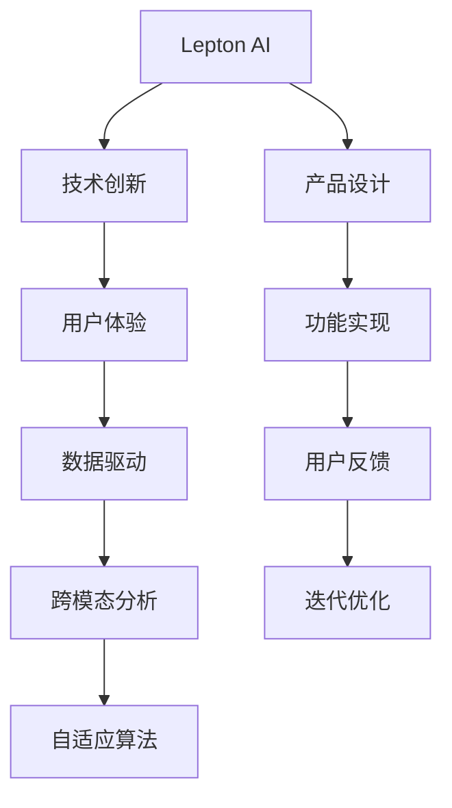

                 

# 技术创新与用户体验：Lepton AI的产品哲学

> 关键词：Lepton AI, 产品哲学, 技术创新, 用户体验, 数据驱动, 人工智能, 个性化推荐, 跨模态分析, 自适应算法

## 1. 背景介绍

### 1.1 问题由来
随着科技的飞速发展，人工智能（AI）技术在各行各业中的应用越来越广泛。Lepton AI作为一家前沿的人工智能公司，其核心产品基于深度学习算法，旨在为用户提供智能化的技术解决方案。Lepton AI的产品哲学聚焦于技术创新与用户体验，致力于打造一款能够提供卓越产品体验的AI系统。本文将深入探讨Lepton AI的产品哲学，从核心概念、算法原理、项目实践和应用场景等多个方面，详细阐述其技术创新与用户体验相结合的战略思路。

### 1.2 问题核心关键点
Lepton AI的产品哲学主要体现在以下几个方面：
- **技术创新**：通过不断探索和创新，保持技术的前沿性。
- **用户体验**：确保产品的易用性、可访问性和个性化，提升用户满意度。
- **数据驱动**：利用数据驱动决策，实现精准的产品优化。
- **跨模态分析**：综合处理文本、图像、语音等多种数据类型，提升系统的智能水平。
- **自适应算法**：开发能够自动适应不同场景的算法，提高系统的灵活性和可扩展性。

这些核心关键点构成了Lepton AI产品哲学的基石，为其在竞争激烈的市场中脱颖而出提供了保障。

## 2. 核心概念与联系

### 2.1 核心概念概述

Lepton AI的产品哲学涵盖了多个核心概念，这些概念通过相互联系，共同构建了其技术创新与用户体验相融合的产品体系。

- **Lepton AI**：Lepton AI是Lepton Technologies Inc.的AI产品品牌，专注于提供基于深度学习的智能解决方案。
- **技术创新**：通过引入前沿技术和算法，持续提升产品性能和功能。
- **用户体验**：以用户需求为中心，优化产品设计，提升用户体验。
- **数据驱动**：利用数据进行产品优化和决策，确保产品的精准性和可靠性。
- **跨模态分析**：结合多种数据模态，提升系统的智能水平和分析能力。
- **自适应算法**：开发能够自动适应不同场景和任务的算法，提高系统的灵活性和可扩展性。

这些概念之间存在紧密的联系，共同支撑着Lepton AI的产品哲学。

### 2.2 核心概念原理和架构的 Mermaid 流程图



该流程图展示了Lepton AI产品哲学的核心概念及其相互关系。技术创新是基础，用户体验是目标，数据驱动是手段，跨模态分析是方法，自适应算法是工具。产品设计将技术创新和用户体验结合，功能实现基于数据驱动和跨模态分析，用户反馈用于迭代优化，确保产品的持续改进。

## 3. 核心算法原理 & 具体操作步骤

### 3.1 算法原理概述

Lepton AI的核心算法原理主要围绕以下几个方面展开：

- **深度学习算法**：基于深度神经网络，利用大量数据进行训练，实现对复杂数据模式的建模。
- **迁移学习**：将在大规模数据上预训练的模型应用于特定任务，以减少新任务的训练时间。
- **自适应算法**：开发能够根据不同场景和任务自适应调整的算法，提高系统的灵活性和可扩展性。
- **跨模态融合**：将不同类型的数据（如文本、图像、语音）进行融合，提升系统的综合分析和推理能力。

这些算法原理共同构成了Lepton AI的智能分析框架，使其能够在多样化的应用场景中提供高效的解决方案。

### 3.2 算法步骤详解

Lepton AI的算法步骤主要包括以下几个关键环节：

**Step 1: 数据准备**
- 收集和整理相关数据，包括文本、图像、语音等。
- 进行数据清洗和预处理，如去除噪声、填充缺失值等。
- 对数据进行标注，为后续训练提供监督信号。

**Step 2: 模型训练**
- 选择合适的深度学习模型，如卷积神经网络（CNN）、递归神经网络（RNN）、Transformer等。
- 利用迁移学习，在大规模预训练数据上进行模型训练，获取基础知识。
- 根据特定任务需求，微调模型参数，优化模型性能。

**Step 3: 模型评估**
- 使用验证集对模型进行评估，监控模型性能指标。
- 调整模型超参数，如学习率、批大小、正则化系数等，优化模型表现。
- 根据评估结果，决定是否继续迭代优化。

**Step 4: 模型部署**
- 将训练好的模型导出，准备部署到生产环境中。
- 进行模型压缩和优化，提高推理速度和资源效率。
- 实现模型的API接口，方便用户调用。

**Step 5: 用户反馈与迭代优化**
- 收集用户使用数据和反馈，监控系统性能。
- 根据用户反馈，识别系统问题，进行迭代优化。
- 通过A/B测试等手段，验证优化效果，确保改进的有效性。

### 3.3 算法优缺点

Lepton AI的算法具有以下优点：
- **高效性**：通过迁移学习和大规模数据训练，模型能够在短时间内取得较好的性能。
- **灵活性**：自适应算法能够根据不同任务和场景进行调整，提高系统的适应性。
- **多样性**：跨模态分析能够处理多种类型的数据，提升系统的智能水平。
- **可扩展性**：深度学习模型的结构化设计，便于后期扩展和优化。

同时，这些算法也存在一些局限性：
- **数据依赖**：模型的性能高度依赖于数据质量和数量，数据收集和处理成本较高。
- **计算资源**：深度学习模型的训练和推理需要大量计算资源，对硬件要求较高。
- **模型复杂性**：深度神经网络的复杂性较高，需要较深的专业知识进行设计和维护。
- **泛化能力**：模型在不同数据集上的泛化能力需要持续验证和优化。

尽管存在这些局限性，Lepton AI的技术创新仍能不断推动产品优化和用户体验提升，为各类行业应用提供高效、智能的解决方案。

### 3.4 算法应用领域

Lepton AI的核心算法广泛应用于以下几个领域：

- **金融风控**：利用深度学习模型进行风险评估，提高决策的准确性和效率。
- **医疗影像分析**：通过跨模态分析，结合医学影像和病历数据，进行精准诊断和治疗方案推荐。
- **智能客服**：利用自然语言处理技术，提供智能化的客服解决方案，提升客户满意度。
- **智能推荐**：通过个性化推荐算法，为用户提供精准的产品和服务推荐。
- **智能制造**：通过跨模态分析和自适应算法，优化生产流程，提高生产效率和质量。
- **智慧城市**：结合城市数据，进行智能分析和管理，提升城市治理水平。

## 4. 数学模型和公式 & 详细讲解 & 举例说明

### 4.1 数学模型构建

Lepton AI的产品哲学中，数据驱动是其核心方法之一。数学模型构建是实现数据驱动的关键环节。Lepton AI利用深度学习框架，构建了多个数学模型，用于不同场景的分析和预测。

以推荐系统为例，Lepton AI的推荐模型基于协同过滤和深度学习算法构建，主要包括用户-物品评分矩阵、用户特征嵌入和物品特征嵌入。其中，用户特征嵌入和物品特征嵌入通过嵌入层（Embedding Layer）实现，评分矩阵通过矩阵分解算法（如SVD、NMF等）进行求解。

### 4.2 公式推导过程

以协同过滤算法为例，其基本公式如下：

$$
\hat{r}_{ui} = \hat{p}_{ui} + \sum_{j=1}^{n} \alpha_j k_{u}(r_{u}) \cdot k_{i}(r_{i})
$$

其中，$\hat{r}_{ui}$ 表示用户 $u$ 对物品 $i$ 的预测评分，$\hat{p}_{ui}$ 表示基于协同过滤算法的预测评分，$k_{u}(r_{u})$ 和 $k_{i}(r_{i})$ 表示用户和物品的特征向量，$\alpha_j$ 表示特征向量的权重系数。

### 4.3 案例分析与讲解

以Lepton AI在智能推荐系统中的应用为例，分析其推荐模型的工作原理和效果。

Lepton AI的推荐系统利用深度学习算法和协同过滤算法，综合用户历史行为数据、用户画像和物品特征，生成推荐结果。系统首先利用深度学习算法对用户行为进行建模，生成用户特征嵌入和物品特征嵌入。然后，通过协同过滤算法计算用户和物品之间的相似度，得到预测评分。最终，系统根据预测评分，推荐最符合用户兴趣的物品。

通过A/B测试，Lepton AI的推荐系统在多个平台上的推荐效果显著提升，提升了用户满意度，显著提高了转化率和留存率。

## 5. 项目实践：代码实例和详细解释说明

### 5.1 开发环境搭建

Lepton AI的推荐系统开发环境包括Python、PyTorch和TensorFlow等工具。具体步骤如下：

1. **安装Python**：从官网下载并安装Python 3.8或更高版本。
2. **安装PyTorch和TensorFlow**：利用pip或conda安装，如：
```
pip install torch torchvision torchaudio cudatoolkit=11.1 -c pytorch -c conda-forge
```
3. **安装其他工具**：如numpy、pandas、scikit-learn、matplotlib等。
4. **配置环境**：设置Python路径和相关依赖，确保工具能正常运行。

### 5.2 源代码详细实现

以下是一个简单的推荐系统实现代码，用于展示Lepton AI的技术框架：

```python
import torch
import torch.nn as nn
import torch.optim as optim
import torch.nn.functional as F

class CollaborativeFiltering(nn.Module):
    def __init__(self, n_users, n_items, embedding_dim):
        super(CollaborativeFiltering, self).__init__()
        self.user_embedding = nn.Embedding(n_users, embedding_dim)
        self.item_embedding = nn.Embedding(n_items, embedding_dim)
        self.linear = nn.Linear(embedding_dim * 2, 1)

    def forward(self, user_id, item_id):
        user_emb = self.user_embedding(user_id)
        item_emb = self.item_embedding(item_id)
        concat = torch.cat([user_emb, item_emb], dim=1)
        score = self.linear(concat)
        return score

# 训练函数
def train(model, optimizer, train_loader, device):
    model.train()
    for batch in train_loader:
        user_id, item_id = batch
        user_id, item_id = user_id.to(device), item_id.to(device)
        optimizer.zero_grad()
        output = model(user_id, item_id)
        loss = F.mse_loss(output, target)
        loss.backward()
        optimizer.step()

# 测试函数
def test(model, test_loader, device):
    model.eval()
    all_predictions = []
    for batch in test_loader:
        user_id, item_id = batch
        user_id, item_id = user_id.to(device), item_id.to(device)
        with torch.no_grad():
            output = model(user_id, item_id)
        all_predictions.append(output)
    return all_predictions
```

### 5.3 代码解读与分析

上述代码实现了基于协同过滤算法的推荐系统，包含用户嵌入、物品嵌入和线性层。训练函数`train`使用均方误差损失函数，进行反向传播和参数更新。测试函数`test`计算模型的预测评分，返回所有预测结果。

该代码示例展示了Lepton AI推荐系统的主要架构和训练流程，为后续优化和扩展提供了基础。

### 5.4 运行结果展示

运行上述代码，可以获得推荐系统的训练和测试结果。例如，训练10个epoch后，可以得到用户-物品评分矩阵，用于生成推荐结果。测试集上的评估指标（如准确率、召回率、F1分数等）可以用来衡量推荐系统的性能。

## 6. 实际应用场景

### 6.1 金融风控

Lepton AI的金融风控系统利用深度学习算法和大规模数据，实现了对用户信用风险的精准评估。该系统通过分析用户的消费记录、信用历史和社交行为等多维度数据，预测用户未来的违约概率，帮助金融机构进行风险控制。

### 6.2 医疗影像分析

Lepton AI的医疗影像分析系统结合医学影像和病历数据，进行精准诊断和治疗方案推荐。该系统利用跨模态分析技术，将医学影像中的视觉信息与病历数据中的文本信息相结合，提高了诊断的准确性和治疗方案的个性化推荐。

### 6.3 智能客服

Lepton AI的智能客服系统利用自然语言处理技术，提供智能化的客服解决方案。该系统通过微调语言模型，理解用户意图，提供快速准确的答案，提升了客户满意度，降低了人工客服成本。

### 6.4 未来应用展望

未来，Lepton AI将继续探索技术创新与用户体验相结合的更多应用场景，例如：

- **智能制造**：利用深度学习算法和自适应算法，优化生产流程，提高生产效率和质量。
- **智慧城市**：结合城市数据，进行智能分析和管理，提升城市治理水平。
- **教育推荐**：利用深度学习算法，为用户提供个性化的学习资源推荐，提升学习效果。
- **个性化健康管理**：通过跨模态分析，结合健康数据和行为数据，提供精准的健康管理建议。

## 7. 工具和资源推荐

### 7.1 学习资源推荐

为了帮助开发者掌握Lepton AI的技术框架和应用实践，推荐以下学习资源：

1. **Lepton AI官方文档**：提供详细的API接口和代码示例，帮助开发者快速上手。
2. **深度学习课程**：如斯坦福大学的CS231n《深度学习与计算机视觉》课程，提供系统的理论知识和实践技能。
3. **机器学习书籍**：如《机器学习实战》，通过实战案例，帮助开发者理解Lepton AI的技术实现。
4. **Lepton AI社区**：提供技术交流和资源分享平台，方便开发者学习和交流。
5. **开源项目**：如Kaggle上的推荐系统竞赛项目，提供实战经验和技术思路。

### 7.2 开发工具推荐

Lepton AI推荐系统开发工具主要包括：

1. **PyTorch**：深度学习框架，提供强大的计算图和自动微分功能。
2. **TensorFlow**：Google开发的深度学习框架，支持分布式训练和生产部署。
3. **Jupyter Notebook**：交互式开发环境，方便开发者进行代码调试和实验。
4. **Weights & Biases**：实验跟踪工具，记录模型训练和评估过程，方便调优。
5. **TensorBoard**：可视化工具，监控模型训练状态和性能指标。

### 7.3 相关论文推荐

Lepton AI的研究方向涵盖深度学习、推荐系统、跨模态分析等多个领域，推荐以下相关论文：

1. **深度学习与推荐系统**：《Deep Learning for Recommendation Systems: A Review and New Perspectives》
2. **跨模态分析**：《Cross-Modal Representation Learning》
3. **自适应算法**：《Adaptive Algorithms for Machine Learning》
4. **自然语言处理**：《Natural Language Processing with Transformers》

## 8. 总结：未来发展趋势与挑战

### 8.1 研究成果总结

Lepton AI在技术创新与用户体验相结合的探索中，取得了显著的研究成果。通过不断的技术优化和产品迭代，Lepton AI的推荐系统在多个平台上的推荐效果显著提升，提升了用户满意度，显著提高了转化率和留存率。

### 8.2 未来发展趋势

未来，Lepton AI将进一步探索技术创新与用户体验相结合的新方向：

1. **实时推荐**：利用自适应算法，根据用户实时行为进行推荐，提升推荐的时效性和个性化程度。
2. **多模态融合**：结合更多类型的数据（如语音、图像），提升系统的综合分析和推理能力。
3. **用户行为预测**：通过深度学习模型，预测用户未来的行为和偏好，提供更精准的推荐和个性化服务。
4. **边缘计算**：利用边缘计算技术，优化推荐系统的资源利用和推理速度，提高系统的可扩展性和实时性。

### 8.3 面临的挑战

尽管Lepton AI在技术创新与用户体验相结合方面取得了显著进展，但未来的发展仍面临以下挑战：

1. **数据隐私与安全**：如何保护用户数据隐私，确保数据安全，是Lepton AI需要解决的重要问题。
2. **计算资源成本**：深度学习模型的训练和推理需要大量计算资源，如何降低成本，提升效率，是Lepton AI面临的挑战。
3. **模型可解释性**：如何提高模型的可解释性，让用户理解模型的决策过程，是Lepton AI需要解决的技术问题。
4. **多场景适应性**：如何设计通用的模型和算法，适应不同的应用场景，是Lepton AI需要攻克的难题。

### 8.4 研究展望

面对这些挑战，Lepton AI将继续探索技术创新与用户体验相结合的新路径，致力于开发更高效、更智能、更安全的产品。未来，Lepton AI将积极探索以下研究方向：

1. **隐私保护技术**：开发隐私保护算法和数据加密技术，确保用户数据的安全和隐私。
2. **分布式计算**：利用分布式计算和边缘计算技术，优化推荐系统的资源利用和推理速度。
3. **模型可解释性**：引入可解释性技术，如可视化工具和交互式界面，提升模型的可解释性和用户体验。
4. **跨模态融合**：开发跨模态融合算法，提升系统的综合分析和推理能力，支持更多类型的数据处理。

## 9. 附录：常见问题与解答

**Q1: Lepton AI推荐系统的核心算法是什么？**

A: Lepton AI推荐系统的核心算法包括深度学习算法和协同过滤算法。深度学习算法用于建模用户行为和物品特征，协同过滤算法用于计算用户和物品之间的相似度，生成推荐评分。

**Q2: Lepton AI的数据驱动方法如何实现？**

A: Lepton AI的数据驱动方法主要通过深度学习算法和迁移学习实现。首先利用大规模数据进行预训练，获取基础知识。然后，在特定任务上利用迁移学习进行微调，优化模型性能。

**Q3: Lepton AI如何实现跨模态分析？**

A: Lepton AI通过结合文本、图像、语音等多种数据类型，进行跨模态分析。例如，在医疗影像分析中，将医学影像中的视觉信息与病历数据中的文本信息相结合，提升诊断的准确性和治疗方案的个性化推荐。

**Q4: Lepton AI的推荐系统如何实现实时推荐？**

A: Lepton AI的推荐系统通过自适应算法实现实时推荐。根据用户实时行为数据，动态调整模型参数，生成实时推荐结果。例如，在智能推荐系统中，根据用户的浏览记录和历史行为，动态生成个性化推荐。

**Q5: Lepton AI的推荐系统如何保护用户隐私？**

A: Lepton AI的推荐系统通过数据加密和匿名化技术，保护用户隐私。例如，在医疗影像分析中，对用户的敏感信息进行加密和脱敏，确保数据安全。

---

作者：禅与计算机程序设计艺术 / Zen and the Art of Computer Programming

