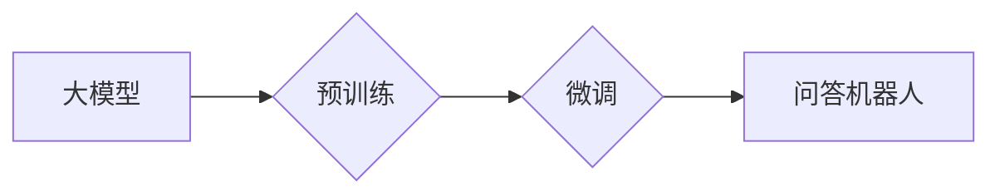

> 大模型、问答机器人、自然语言处理、深度学习、Transformer、微调

## 1. 背景介绍

近年来，人工智能技术取得了飞速发展，特别是深度学习的兴起，为自然语言处理（NLP）领域带来了革命性的变革。问答机器人作为一种重要的NLP应用，旨在通过理解用户的问题并从知识库或文本语料中获取答案，从而与用户进行自然流畅的对话。

传统的问答系统主要依赖于规则引擎和手工构建的知识库，难以应对复杂、开放式的问答场景。而大模型问答机器人则利用深度学习技术，通过训练海量文本数据，学习语言的语义和结构，从而能够理解更复杂的语言表达，并生成更准确、更自然的答案。

## 2. 核心概念与联系

大模型问答机器人的核心概念包括：

* **大模型 (Large Model):** 指参数量庞大的深度学习模型，通常拥有数十亿甚至数千亿个参数。大模型能够学习到更丰富的语言表示和知识，从而提升问答系统的性能。
* **Transformer:**  一种新型的深度学习架构，能够有效地处理序列数据，例如文本。Transformer的注意力机制能够捕捉文本中的长距离依赖关系，使其在自然语言理解和生成任务中表现出色。
* **微调 (Fine-tuning):**  将预训练的大模型在特定任务上进行进一步训练的过程。通过微调，可以将大模型的通用知识应用于特定的问答场景，提升其性能。

**Mermaid 流程图:**



## 3. 核心算法原理 & 具体操作步骤

### 3.1  算法原理概述

大模型问答机器人的核心算法原理基于Transformer架构和注意力机制。

* **Transformer:** Transformer模型由编码器和解码器组成。编码器将输入的文本序列转换为隐藏表示，解码器则根据隐藏表示生成输出文本序列。
* **注意力机制:** 注意力机制能够帮助模型关注输入文本中与当前生成词语相关的部分，从而提高生成文本的准确性和流畅性。

### 3.2  算法步骤详解

1. **预训练:** 使用海量文本数据对Transformer模型进行预训练，学习语言的语义和语法规则。
2. **微调:** 将预训练好的模型在特定问答数据集上进行微调，使其能够理解特定领域的知识和问答模式。
3. **输入处理:** 将用户的问题转换为模型可理解的格式，例如词向量表示。
4. **编码:** 使用编码器将用户的问题编码为隐藏表示。
5. **解码:** 使用解码器根据隐藏表示生成答案。
6. **输出处理:** 将解码器生成的答案转换为自然语言文本。

### 3.3  算法优缺点

**优点:**

* 能够理解复杂的语言表达。
* 生成更准确、更自然的答案。
* 可迁移性强，可以应用于不同的问答场景。

**缺点:**

* 训练成本高，需要大量的计算资源和数据。
* 容易受到训练数据质量的影响。
* 缺乏可解释性，难以理解模型的决策过程。

### 3.4  算法应用领域

大模型问答机器人技术在多个领域具有广泛的应用前景，例如：

* **客服机器人:** 自动回答用户常见问题，提高客服效率。
* **教育机器人:** 为学生提供个性化的学习辅导。
* **搜索引擎:** 提供更精准、更相关的搜索结果。
* **医疗诊断:** 辅助医生进行疾病诊断。

## 4. 数学模型和公式 & 详细讲解 & 举例说明

### 4.1  数学模型构建

大模型问答机器人的数学模型主要基于Transformer架构，其核心组件是注意力机制和多头注意力机制。

**注意力机制:**

注意力机制的目的是学习输入序列中与当前生成词语相关的部分，并赋予它们不同的权重。注意力机制的公式如下：

$$
\text{Attention}(Q, K, V) = \text{softmax}\left(\frac{QK^T}{\sqrt{d_k}}\right)V
$$

其中：

* $Q$：查询矩阵
* $K$：键矩阵
* $V$：值矩阵
* $d_k$：键向量的维度
* $\text{softmax}$：softmax函数

**多头注意力机制:**

多头注意力机制是将多个注意力机制并行执行，并对结果进行融合。其公式如下：

$$
\text{MultiHeadAttention}(Q, K, V) = \text{Concat}(head_1, head_2, ..., head_h)W_o
$$

其中：

* $head_i$：第 $i$ 个注意力头的输出
* $h$：注意力头的数量
* $W_o$：最终融合层的权重矩阵

### 4.2  公式推导过程

注意力机制的公式推导过程如下：

1. 计算查询矩阵 $Q$ 与键矩阵 $K$ 的点积，并进行归一化处理。
2. 应用softmax函数将点积结果转换为概率分布。
3. 将概率分布与值矩阵 $V$ 进行加权求和，得到注意力机制的输出。

### 4.3  案例分析与讲解

假设我们有一个句子 "The cat sat on the mat"，我们要计算 "cat" 这个词语与整个句子的注意力权重。

1. 将句子中的每个词语转换为词向量表示。
2. 计算查询向量与每个键向量的点积。
3. 对点积结果进行归一化处理，并应用softmax函数得到注意力权重。
4. 将注意力权重与值向量进行加权求和，得到 "cat" 这个词语与整个句子的注意力输出。

## 5. 项目实践：代码实例和详细解释说明

### 5.1  开发环境搭建

* Python 3.7+
* PyTorch 1.7+
* Transformers 4.0+

### 5.2  源代码详细实现

```python
from transformers import AutoModelForQuestionAnswering, AutoTokenizer

# 加载预训练模型和分词器
model_name = "bert-base-uncased"
model = AutoModelForQuestionAnswering.from_pretrained(model_name)
tokenizer = AutoTokenizer.from_pretrained(model_name)

# 定义输入文本和问题
context = "The cat sat on the mat."
question = "Where did the cat sit?"

# 将文本和问题转换为模型可理解的格式
inputs = tokenizer(question, context, return_tensors="pt")

# 进行推理
outputs = model(**inputs)

# 获取答案
answer_start = outputs.start_logits.argmax().item()
answer_end = outputs.end_logits.argmax().item()
answer = tokenizer.decode(inputs["input_ids"][0][answer_start:answer_end+1])

# 打印答案
print(f"Answer: {answer}")
```

### 5.3  代码解读与分析

* 代码首先加载预训练的BERT模型和分词器。
* 然后定义输入文本和问题。
* 使用分词器将文本和问题转换为模型可理解的格式。
* 调用模型进行推理，获取答案的起始和结束位置。
* 使用分词器将答案位置对应的词语解码成文本形式。

### 5.4  运行结果展示

```
Answer: on the mat
```

## 6. 实际应用场景

大模型问答机器人技术在多个领域具有广泛的应用前景，例如：

### 6.1  客服机器人

客服机器人可以自动回答用户常见问题，例如产品信息、订单查询、退换货政策等，从而提高客服效率，降低人工成本。

### 6.2  教育机器人

教育机器人可以为学生提供个性化的学习辅导，例如解答学生的问题、提供学习资源、评估学生的学习进度等。

### 6.3  搜索引擎

搜索引擎可以利用大模型问答机器人技术，理解用户的搜索意图，并提供更精准、更相关的搜索结果。

### 6.4  未来应用展望

随着大模型技术的不断发展，大模型问答机器人将能够处理更复杂、更开放式的问答场景，并具备更强的理解和生成能力。未来，大模型问答机器人将广泛应用于各个领域，例如医疗诊断、法律咨询、金融分析等，为人类社会带来更多便利和价值。

## 7. 工具和资源推荐

### 7.1  学习资源推荐

* **论文:**
    * Vaswani, A., Shazeer, N., Parmar, N., Uszkoreit, J., Jones, L., Gomez, A. N., ... & Polosukhin, I. (2017). Attention is all you need. In Advances in neural information processing systems (pp. 5998-6008).
    * Devlin, J., Chang, M. W., Lee, K., & Toutanova, K. (2018). Bert: Pre-training of deep bidirectional transformers for language understanding. arXiv preprint arXiv:1810.04805.
* **博客:**
    * Jay Alammar's Blog: https://jalammar.github.io/
    * The Illustrated Transformer: https://jalammar.github.io/illustrated-transformer/

### 7.2  开发工具推荐

* **PyTorch:** https://pytorch.org/
* **Transformers:** https://huggingface.co/transformers/

### 7.3  相关论文推荐

* BERT: Pre-training of Deep Bidirectional Transformers for Language Understanding
* GPT-3: Language Models are Few-Shot Learners
* T5: Text-to-Text Transfer Transformer

## 8. 总结：未来发展趋势与挑战

### 8.1  研究成果总结

近年来，大模型问答机器人技术取得了显著进展，模型性能大幅提升，应用场景不断拓展。

### 8.2  未来发展趋势

* **模型规模和能力的进一步提升:** 未来，大模型规模将继续扩大，模型能力将进一步增强，能够处理更复杂、更开放式的问答场景。
* **多模态问答:** 将文本、图像、音频等多模态信息融合到问答系统中，实现更全面的理解和回答。
* **个性化问答:** 根据用户的个性化需求和偏好，提供更精准、更个性化的问答服务。

### 8.3  面临的挑战

* **数据质量和标注成本:** 大模型训练需要海量高质量的数据，数据标注成本高昂。
* **模型解释性和可信任性:** 大模型的决策过程难以解释，缺乏可信任性。
* **伦理和安全问题:** 大模型可能被用于生成虚假信息、传播偏见等，需要关注伦理和安全问题。

### 8.4  研究展望

未来，大模型问答机器人技术将继续朝着更智能、更安全、更可解释的方向发展，为人类社会带来更多价值。

## 9. 附录：常见问题与解答

* **Q: 如何选择合适的预训练模型？**

A: 选择预训练模型需要根据具体的应用场景和任务需求进行选择。例如，对于问答任务，可以选择BERT、RoBERTa等预训练模型。

* **Q: 如何进行模型微调？**

A: 模型微调需要使用特定领域的训练数据，调整模型参数，使其能够更好地适应目标任务。

* **Q: 如何评估模型性能？**

A: 模型性能可以通过准确率、召回率、F1-score等指标进行评估。

* **Q: 如何解决数据标注成本高的问题？**

A: 可以探索使用自动标注技术、知识图谱等方法来降低数据标注成本。


作者：禅与计算机程序设计艺术 / Zen and the Art of Computer Programming 
<end_of_turn>