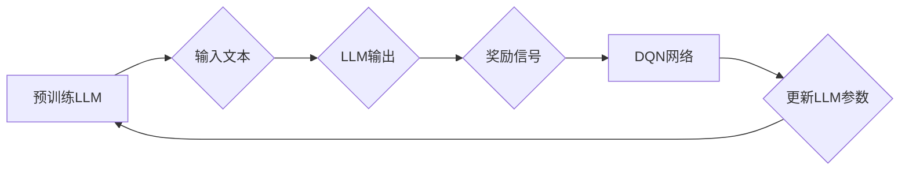

> 大语言模型、DQN、深度强化学习、强化学习、神经网络、自然语言处理

## 1. 背景介绍

近年来，深度学习在人工智能领域取得了显著进展，特别是大语言模型（LLM）的出现，为自然语言处理（NLP）任务带来了革命性的改变。LLM 能够理解和生成人类语言，在文本生成、机器翻译、问答系统等领域展现出强大的能力。然而，训练大型语言模型需要海量数据和计算资源，并且模型的训练过程往往是黑盒式的，难以解释模型的决策过程。

深度强化学习（Deep Reinforcement Learning，DRL）作为一种新兴的机器学习方法，能够通过与环境交互学习最优策略。它与传统监督学习和无监督学习不同，DRL 算法通过奖励机制引导模型学习，能够解决复杂决策问题，并具有良好的泛化能力。

结合 DRL 和 LLM 的优势，我们可以构建一种新的模型训练方法，利用强化学习来优化 LLM 的训练过程，提高模型的性能和鲁棒性。

## 2. 核心概念与联系

**2.1  大语言模型 (LLM)**

大语言模型是一种基于深度学习的强大语言模型，能够理解和生成人类语言。它通常由 Transformer 架构构成，并通过大量的文本数据进行预训练。预训练后的 LLM 可以用于各种 NLP 任务，例如文本分类、文本生成、机器翻译等。

**2.2  深度强化学习 (DRL)**

深度强化学习是一种机器学习方法，它结合了深度神经网络和强化学习算法。强化学习算法通过奖励机制引导模型学习最优策略，以最大化累积奖励。DRL 算法能够解决复杂决策问题，并具有良好的泛化能力。

**2.3  DQN 算法**

DQN（Deep Q-Network）是一种经典的深度强化学习算法，它利用深度神经网络来估计状态价值函数，并通过 Q-learning 算法更新网络参数。DQN 算法能够有效地解决离散动作空间的问题，并具有较强的学习能力。

**2.4  LLM 与 DQN 的结合**

将 DQN 算法应用于 LLM 的训练，可以利用强化学习来优化 LLM 的参数，提高模型的性能和鲁棒性。具体来说，我们可以将 LLM 的输出作为环境的反馈，并根据输出的质量给予奖励。通过 DQN 算法的学习，LLM 可以逐渐学习到生成高质量文本的策略。

**2.5  Mermaid 流程图**



## 3. 核心算法原理 & 具体操作步骤

### 3.1  算法原理概述

DQN 算法的核心思想是利用深度神经网络来估计状态价值函数，并通过 Q-learning 算法更新网络参数。

状态价值函数 Q(s, a) 表示在状态 s 下执行动作 a 的期望累积奖励。DQN 算法的目标是学习一个能够最大化累积奖励的策略。

### 3.2  算法步骤详解

1. **初始化 DQN 网络:** 创建一个深度神经网络，作为状态价值函数的估计器。

2. **收集经验数据:** 通过与环境交互，收集状态、动作、奖励和下一个状态的经验数据。

3. **更新目标网络:** 将训练网络的参数更新到目标网络中，目标网络用于计算目标 Q 值。

4. **计算 Q 值:** 使用训练网络计算每个状态-动作对的 Q 值。

5. **更新训练网络:** 使用 Q-learning 算法更新训练网络的参数，以最小化 Q 值与目标 Q 值之间的误差。

6. **重复步骤 2-5:** 持续收集经验数据，更新目标网络和训练网络，直到模型收敛。

### 3.3  算法优缺点

**优点:**

* 能够解决离散动作空间的问题。
* 具有较强的学习能力。
* 可以应用于各种强化学习任务。

**缺点:**

* 训练过程可能比较慢。
* 需要大量的经验数据。
* 容易出现震荡问题。

### 3.4  算法应用领域

DQN 算法在许多领域都有应用，例如：

* 游戏 AI
* 机器人控制
* 自动驾驶
* 医疗诊断

## 4. 数学模型和公式 & 详细讲解 & 举例说明

### 4.1  数学模型构建

DQN 算法的核心是状态价值函数 Q(s, a)，它表示在状态 s 下执行动作 a 的期望累积奖励。

**公式:**

$$Q(s, a) = E[\sum_{t=0}^{\infty} \gamma^t r_{t+1}|s_t = s, a_t = a]$$

其中：

* $s$ 表示状态。
* $a$ 表示动作。
* $r_{t+1}$ 表示在时间步 t+1 收到的奖励。
* $\gamma$ 表示折扣因子，控制未来奖励的权重。

### 4.2  公式推导过程

DQN 算法使用 Q-learning 算法更新状态价值函数。Q-learning 算法的目标是最大化以下目标函数：

$$J(\theta) = E[ (r_{t+1} + \gamma \max_{a'} Q(s', a') - Q(s, a))^2 ]$$

其中：

* $\theta$ 表示网络参数。
* $s'$ 表示下一个状态。

通过梯度下降算法，更新网络参数 $\theta$，以最小化目标函数。

### 4.3  案例分析与讲解

假设我们有一个简单的游戏，玩家需要控制一个机器人移动到目标位置。

* 状态 $s$ 可以表示机器人当前的位置。
* 动作 $a$ 可以是向上、向下、向左、向右四个方向。
* 奖励 $r_{t+1}$ 可以是到达目标位置的奖励，或者在障碍物上的惩罚。

我们可以使用 DQN 算法训练一个机器人，使其能够学习到到达目标位置的最优策略。

## 5. 项目实践：代码实例和详细解释说明

### 5.1  开发环境搭建

* Python 3.x
* TensorFlow 或 PyTorch
* OpenAI Gym

### 5.2  源代码详细实现

```python
import tensorflow as tf

# 定义 DQN 网络
class DQN(tf.keras.Model):
    def __init__(self, state_size, action_size):
        super(DQN, self).__init__()
        self.dense1 = tf.keras.layers.Dense(64, activation='relu')
        self.dense2 = tf.keras.layers.Dense(64, activation='relu')
        self.output = tf.keras.layers.Dense(action_size)

    def call(self, state):
        x = self.dense1(state)
        x = self.dense2(x)
        return self.output(x)

# 定义 DQN 算法
def dqn_agent(env, state_size, action_size, learning_rate, gamma, epsilon):
    # 初始化 DQN 网络
    model = DQN(state_size, action_size)
    optimizer = tf.keras.optimizers.Adam(learning_rate)

    # 训练循环
    for episode in range(num_episodes):
        state = env.reset()
        done = False
        total_reward = 0

        while not done:
            # 选择动作
            action = choose_action(state, epsilon)

            # 执行动作
            next_state, reward, done, _ = env.step(action)

            # 更新经验池
            experience = (state, action, reward, next_state, done)
            experience_pool.append(experience)

            # 更新状态
            state = next_state

            # 计算总奖励
            total_reward += reward

        # 更新模型参数
        update_model(model, optimizer, experience_pool)

    return model

# 选择动作
def choose_action(state, epsilon):
    if random.random() < epsilon:
        return env.action_space.sample()
    else:
        q_values = model.predict(state)
        return tf.argmax(q_values).numpy()

# 更新模型参数
def update_model(model, optimizer, experience_pool):
    # 从经验池中采样数据
    batch_size = 32
    batch = random.sample(experience_pool, batch_size)

    # 计算目标 Q 值
    with tf.GradientTape() as tape:
        target_q_values = model.predict(batch[:, 3])
        target_q_values = tf.where(batch[:, 4], target_q_values, 0.0)
        target_q_values = target_q_values + gamma * tf.reduce_max(target_q_values, axis=1, keepdims=True)
        q_values = model.predict(batch[:, 0])
        loss = tf.reduce_mean(tf.square(target_q_values - q_values[batch[:, 0], batch[:, 1]]))

    # 更新模型参数
    gradients = tape.gradient(loss, model.trainable_variables)
    optimizer.apply_gradients(zip(gradients, model.trainable_variables))


```

### 5.3  代码解读与分析

* **DQN 网络:** 定义了一个简单的 DQN 网络，包含两层全连接层和一层输出层。
* **DQN 算法:** 定义了一个 DQN 算法，包含了初始化网络、训练循环、选择动作、更新经验池和更新模型参数等步骤。
* **环境搭建:** 使用 OpenAI Gym 来搭建一个简单的游戏环境。
* **训练循环:** 训练循环中，代理会与环境交互，收集经验数据，并更新模型参数。

### 5.4  运行结果展示

训练完成后，可以将训练好的模型应用于游戏环境中，观察代理的性能。

## 6. 实际应用场景

### 6.1  文本生成

DQN 可以用于训练文本生成模型，例如生成小说、诗歌、代码等。

### 6.2  机器翻译

DQN 可以用于训练机器翻译模型，例如将英文翻译成中文。

### 6.3  问答系统

DQN 可以用于训练问答系统，例如回答用户提出的问题。

### 6.4  未来应用展望

DQN 算法在未来有很大的应用潜力，例如：

* 自动驾驶
* 医疗诊断
* 金融投资

## 7. 工具和资源推荐

### 7.1  学习资源推荐

* **书籍:**
    * Deep Reinforcement Learning Hands-On
    * Reinforcement Learning: An Introduction
* **在线课程:**
    * Deep Reinforcement Learning Specialization (Coursera)
    * Reinforcement Learning (Udacity)

### 7.2  开发工具推荐

* **TensorFlow:** https://www.tensorflow.org/
* **PyTorch:** https://pytorch.org/
* **OpenAI Gym:** https://gym.openai.com/

### 7.3  相关论文推荐

* Deep Q-Network (Mnih et al., 2015)
* Dueling Network Architectures for Deep Reinforcement Learning (Wang et al., 2015)
* Prioritized Experience Replay (Schaul et al., 2015)

## 8. 总结：未来发展趋势与挑战

### 8.1  研究成果总结

DQN 算法取得了显著的成果，在许多强化学习任务中取得了优异的性能。

### 8.2  未来发展趋势

* **探索更有效的算法:** 研究更有效的强化学习算法，例如基于模型的强化学习算法。
* **解决大规模问题:** 研究解决大规模强化学习问题的算法和方法。
* **提高算法鲁棒性:** 研究提高强化学习算法鲁棒性的方法，使其能够应对更复杂的环境。

### 8.3  面临的挑战

* **样本效率:** 强化学习算法通常需要大量的样本数据才能训练，这在现实世界中可能难以实现。
