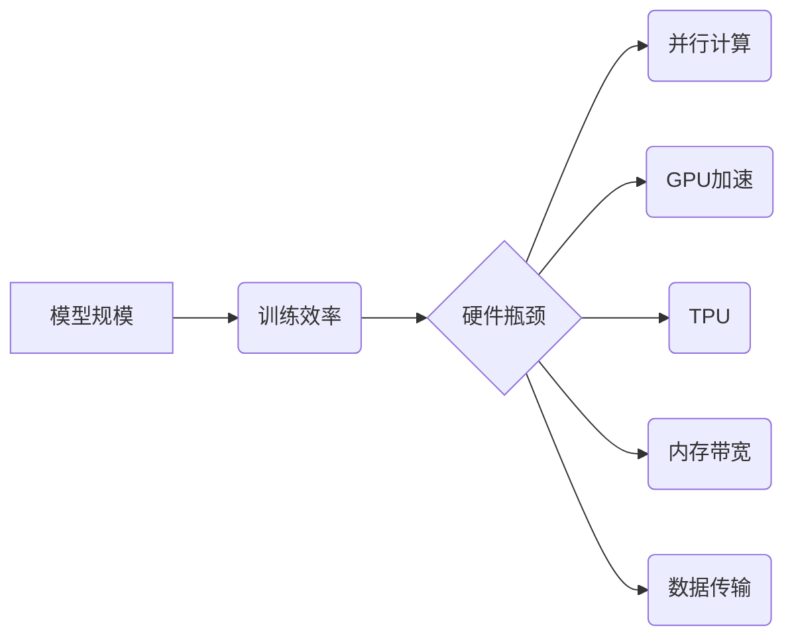

> 大语言模型，硬件瓶颈，训练效率，模型规模，并行计算，GPU加速，TPU，内存带宽，数据传输，优化算法

## 1. 背景介绍

近年来，大语言模型（LLM）在自然语言处理领域取得了显著的突破，展现出强大的文本生成、翻译、摘要和问答能力。这些模型通常拥有数十亿甚至数千亿个参数，能够学习和理解复杂的语言结构和语义关系。然而，训练和部署如此庞大的模型面临着巨大的硬件挑战。

LLM的训练过程需要消耗大量的计算资源和时间。模型参数的更新需要进行大量的矩阵运算，这些运算量呈指数级增长，随着模型规模的增加，训练成本也随之增加。此外，LLM的部署也需要强大的硬件支持，才能保证模型的实时响应和高效运行。

## 2. 核心概念与联系

**2.1 核心概念**

* **大语言模型 (LLM):** 指拥有数十亿甚至数千亿个参数的深度学习模型，能够理解和生成人类语言。
* **模型规模:** 指模型参数的数量，通常用亿或千亿表示。
* **训练效率:** 指模型训练所需的时间和资源消耗。
* **并行计算:** 指将一个任务分解成多个子任务，并同时在多个处理器上进行计算，以提高计算速度。
* **GPU加速:** 指利用图形处理单元 (GPU) 的并行计算能力加速模型训练。
* **TPU:** 指谷歌开发的专门用于深度学习训练的处理器，具有更高的计算性能和能效比。
* **内存带宽:** 指内存传输数据的速率，对于大型模型的训练至关重要。
* **数据传输:** 指模型参数和训练数据在不同硬件设备之间传输的过程，会影响训练效率。

**2.2 架构关系**



## 3. 核心算法原理 & 具体操作步骤

**3.1 算法原理概述**

大语言模型的训练主要基于深度学习算法，特别是 Transformer 架构。Transformer 模型利用自注意力机制，能够捕捉文本序列中长距离依赖关系，从而实现更准确的语言理解和生成。

**3.2 算法步骤详解**

1. **数据预处理:** 将文本数据进行清洗、分词、词嵌入等预处理操作，以便模型训练。
2. **模型构建:** 根据 Transformer 架构构建模型，定义模型层数、隐藏单元数、注意力头数等参数。
3. **模型训练:** 使用训练数据训练模型，通过反向传播算法更新模型参数，使模型预测结果与真实值尽可能接近。
4. **模型评估:** 使用验证集或测试集评估模型性能，例如准确率、困惑度等指标。
5. **模型调优:** 根据评估结果调整模型参数，例如学习率、正则化系数等，以提高模型性能。

**3.3 算法优缺点**

* **优点:**
    * 能够捕捉长距离依赖关系，实现更准确的语言理解和生成。
    * 训练效率较高，能够在较短时间内训练出高质量的模型。
* **缺点:**
    * 模型规模较大，训练和部署需要大量的计算资源。
    * 训练数据量要求较高，需要大量的文本数据进行训练。

**3.4 算法应用领域**

* **自然语言理解:** 文本分类、情感分析、问答系统等。
* **自然语言生成:** 文本摘要、机器翻译、对话系统等。
* **代码生成:** 代码补全、代码翻译、代码生成等。

## 4. 数学模型和公式 & 详细讲解 & 举例说明

**4.1 数学模型构建**

Transformer 模型的核心是自注意力机制，其数学模型可以表示为：

$$
Attention(Q, K, V) = softmax(\frac{QK^T}{\sqrt{d_k}})V
$$

其中：

* $Q$：查询矩阵
* $K$：键矩阵
* $V$：值矩阵
* $d_k$：键向量的维度
* $softmax$：softmax 函数

**4.2 公式推导过程**

自注意力机制通过计算查询向量与键向量的点积，并使用 softmax 函数归一化，得到每个键向量对查询向量的注意力权重。然后，将注意力权重与值向量相乘，得到最终的输出。

**4.3 案例分析与讲解**

假设我们有一个句子 "我爱学习编程"，将其转换为词向量表示，得到查询向量 $Q$、键向量 $K$ 和值向量 $V$。

通过计算 $QK^T$，得到每个键向量对查询向量的点积矩阵。然后，对该矩阵进行 softmax 归一化，得到每个键向量对查询向量的注意力权重。最后，将注意力权重与值向量相乘，得到最终的输出，即每个词在句子中的上下文信息。

## 5. 项目实践：代码实例和详细解释说明

**5.1 开发环境搭建**

* 操作系统：Ubuntu 20.04
* Python 版本：3.8
* 深度学习框架：PyTorch 1.8

**5.2 源代码详细实现**

```python
import torch
import torch.nn as nn

class Transformer(nn.Module):
    def __init__(self, vocab_size, embedding_dim, num_heads, num_layers):
        super(Transformer, self).__init__()
        self.embedding = nn.Embedding(vocab_size, embedding_dim)
        self.transformer_layers = nn.ModuleList([
            nn.TransformerEncoderLayer(embedding_dim, num_heads)
            for _ in range(num_layers)
        ])
        self.linear = nn.Linear(embedding_dim, vocab_size)

    def forward(self, x):
        x = self.embedding(x)
        for layer in self.transformer_layers:
            x = layer(x)
        x = self.linear(x)
        return x
```

**5.3 代码解读与分析**

* `__init__` 方法：初始化模型参数，包括词嵌入层、Transformer encoder 层和输出层。
* `forward` 方法：定义模型的正向传播过程，将输入序列转换为输出序列。

**5.4 运行结果展示**

训练完成后，可以使用模型对新的文本进行预测，例如生成文本续写、翻译文本等。

## 6. 实际应用场景

**6.1 文本生成:**

* **机器翻译:** 使用 LLMs 将文本从一种语言翻译成另一种语言。
* **文本摘要:** 使用 LLMs 从长文本中生成简短的摘要。
* **对话系统:** 使用 LLMs 创建能够与人类进行自然对话的聊天机器人。

**6.2 代码生成:**

* **代码补全:** 使用 LLMs 根据代码上下文自动补全代码。
* **代码翻译:** 使用 LLMs 将代码从一种编程语言翻译成另一种编程语言。
* **代码生成:** 使用 LLMs 根据自然语言描述生成代码。

**6.3 其他应用场景:**

* **问答系统:** 使用 LLMs 回答用户提出的问题。
* **搜索引擎:** 使用 LLMs 理解用户搜索意图，并返回更相关的搜索结果。
* **个性化推荐:** 使用 LLMs 分析用户行为，并推荐个性化的产品或服务。

**6.4 未来应用展望**

随着硬件技术的进步和算法的不断优化，LLMs 将在更多领域得到应用，例如：

* **教育:** 使用 LLMs 为学生提供个性化的学习体验。
* **医疗:** 使用 LLMs 辅助医生诊断疾病和制定治疗方案。
* **法律:** 使用 LLMs 分析法律文件和判例，提供法律建议。

## 7. 工具和资源推荐

**7.1 学习资源推荐**

* **书籍:**
    * 《深度学习》
    * 《自然语言处理》
* **在线课程:**
    * Coursera: 深度学习
    * Udacity: 自然语言处理
* **博客:**
    * The Gradient
    * Towards Data Science

**7.2 开发工具推荐**

* **深度学习框架:** PyTorch, TensorFlow
* **文本处理工具:** NLTK, SpaCy
* **云计算平台:** AWS, Google Cloud, Azure

**7.3 相关论文推荐**

* 《Attention Is All You Need》
* 《BERT: Pre-training of Deep Bidirectional Transformers for Language Understanding》
* 《GPT-3: Language Models are Few-Shot Learners》

## 8. 总结：未来发展趋势与挑战

**8.1 研究成果总结**

近年来，LLMs 在自然语言处理领域取得了显著的进展，展现出强大的能力和潜力。

**8.2 未来发展趋势**

* **模型规模的进一步扩大:** 随着硬件技术的进步，LLMs 的模型规模将继续扩大，从而提升模型的性能。
* **训练效率的提升:** 研究人员将继续探索新的训练算法和优化方法，以提高 LLMs 的训练效率。
* **多模态 LLMs 的发展:** 将文本与其他模态数据（例如图像、音频）相结合，构建多模态 LLMs，以实现更全面的理解和生成能力。

**8.3 面临的挑战**

* **硬件瓶颈:** 训练和部署大型 LLMs 需要大量的计算资源，这仍然是一个重要的挑战。
* **数据偏见:** LLMs 的训练数据可能存在偏见，这会导致模型输出结果存在偏差。
* **可解释性:** LLMs 的决策过程难以理解，这限制了模型的应用场景。

**8.4 研究展望**

未来，LLMs 将继续朝着更强大、更智能、更安全的方向发展。研究人员将继续探索新的算法、模型架构和训练方法，以克服现有的挑战，并推动 LLMs 在更多领域得到应用。

## 9. 附录：常见问题与解答

**9.1 如何选择合适的硬件平台？**

选择合适的硬件平台取决于 LLMs 的模型规模和训练需求。对于小型模型，可以使用 CPU 或 GPU 进行训练。对于大型模型，建议使用 TPU 或其他专门设计的深度学习硬件。

**9.2 如何解决数据偏见问题？**

可以通过多种方法解决数据偏见问题，例如：

* 使用更全面、更均衡的数据集进行训练。
* 使用数据增强技术，增加训练数据的多样性。
* 在模型训练过程中，加入对抗训练，以减少模型对数据偏见的敏感性。

**9.3 如何提高 LLMs 的可解释性？**

可以通过以下方法提高 LLMs 的可解释性：

* 使用可解释的机器学习模型，例如决策树或线性回归。
* 使用注意力机制，分析模型对输入数据的关注点。
* 使用反向传播算法，分析模型参数的变化对输出的影响。


作者：禅与计算机程序设计艺术 / Zen and the Art of Computer Programming 
<end_of_turn>