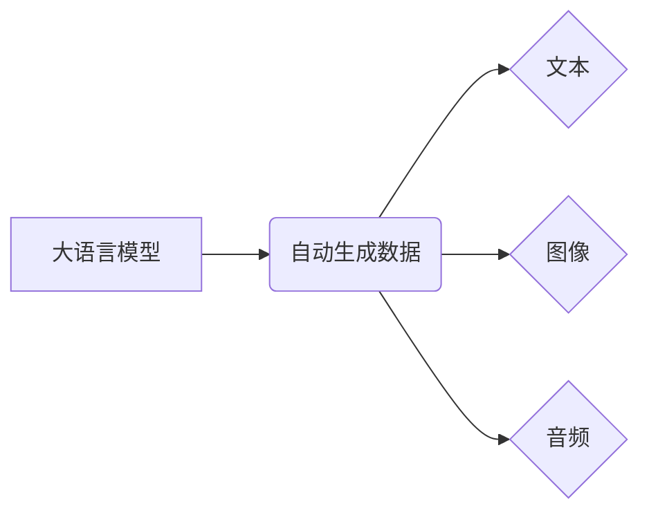

> 大语言模型、自动生成数据、风险评估、伦理问题、数据质量、可解释性、安全保障

## 1. 背景介绍

近年来，大语言模型（LLM）的快速发展掀起了人工智能领域的热潮。这些模型凭借其强大的文本生成能力，在自然语言处理、机器翻译、代码生成等领域展现出令人瞩目的潜力。然而，LLM的自动生成数据特性也引发了广泛的关注和讨论，其潜在的风险不容忽视。

自动生成数据，是指利用算法和模型自动生成各种形式的数据，包括文本、图像、音频等。LLM作为一种强大的自动生成数据工具，可以生成高质量、逼真的文本内容，但这同时也带来了以下风险：

* **信息真实性与准确性问题：** LLM生成的文本可能包含虚假信息、偏见或错误，难以辨别真伪，可能导致信息误导和社会混乱。
* **数据滥用与恶意攻击风险：** 恶意用户可以利用LLM生成虚假新闻、网络谣言、垃圾邮件等，进行信息攻击、操纵舆论或损害个人声誉。
* **版权和知识产权问题：** LLM训练数据可能包含 copyrighted 内容，其生成的文本可能侵犯版权，引发法律纠纷。
* **算法偏见与社会公平性问题：** LLM的训练数据可能存在社会偏见，导致模型生成带有偏见或歧视性的文本，加剧社会不公平。

## 2. 核心概念与联系

### 2.1 大语言模型

大语言模型（LLM）是一种基于深度学习的强大人工智能模型，能够理解和生成人类语言。其核心特点是：

* **规模庞大：** LLM拥有数亿甚至数十亿个参数，能够学习和存储海量文本数据。
* **文本理解能力强：** LLM能够理解文本的语义、语法和上下文，进行文本分类、问答、摘要等任务。
* **文本生成能力强：** LLM能够根据输入的文本或指令，生成流畅、自然的文本内容。

### 2.2 自动生成数据

自动生成数据是指利用算法和模型自动生成各种形式的数据，包括文本、图像、音频等。其主要应用场景包括：

* **数据增强：** 为机器学习模型提供更多训练数据，提高模型性能。
* **数据模拟：** 生成模拟真实数据的测试环境，验证算法和系统稳定性。
* **内容创作：** 自动生成新闻、广告、剧本等内容，提高创作效率。

### 2.3 核心概念关系

LLM作为一种强大的自动生成数据工具，可以被用于生成各种形式的数据，包括文本、图像、音频等。



## 3. 核心算法原理 & 具体操作步骤

### 3.1 算法原理概述

LLM的核心算法是基于Transformer网络结构的深度学习模型。Transformer网络具有以下特点：

* **自注意力机制：** 能够捕捉文本中单词之间的长距离依赖关系，提高文本理解能力。
* **多头注意力机制：** 通过多个注意力头，从不同的角度捕捉文本信息，增强模型的表达能力。
* **编码器-解码器结构：** 编码器负责对输入文本进行编码，解码器负责根据编码结果生成输出文本。

### 3.2 算法步骤详解

LLM的训练过程主要包括以下步骤：

1. **数据预处理：** 将原始文本数据进行清洗、分词、标记等预处理操作，使其适合模型训练。
2. **模型构建：** 根据Transformer网络结构，构建LLM模型，并设定模型参数。
3. **模型训练：** 利用预处理后的数据，训练LLM模型，通过反向传播算法不断调整模型参数，使其能够生成高质量的文本内容。
4. **模型评估：** 使用测试数据评估模型性能，并根据评估结果进行模型调优。
5. **模型部署：** 将训练好的模型部署到实际应用场景中，用于文本生成、翻译、问答等任务。

### 3.3 算法优缺点

**优点：**

* **强大的文本生成能力：** LLM能够生成流畅、自然的文本内容，在各种自然语言处理任务中表现出色。
* **可扩展性强：** LLM模型可以根据需要增加参数数量，提高模型性能。
* **通用性强：** LLM可以应用于多种自然语言处理任务，例如文本分类、问答、机器翻译等。

**缺点：**

* **训练成本高：** LLM模型参数众多，训练需要消耗大量计算资源和时间。
* **数据依赖性强：** LLM模型的性能取决于训练数据的质量和数量。
* **可解释性差：** LLM模型的决策过程复杂，难以解释模型生成的文本内容背后的逻辑。

### 3.4 算法应用领域

LLM在以下领域具有广泛的应用前景：

* **自然语言处理：** 文本分类、问答、机器翻译、文本摘要等。
* **人工智能助手：** 聊天机器人、虚拟助理等。
* **内容创作：** 自动生成新闻、广告、剧本等内容。
* **代码生成：** 自动生成代码片段，提高开发效率。

## 4. 数学模型和公式 & 详细讲解 & 举例说明

### 4.1 数学模型构建

LLM的核心数学模型是基于Transformer网络结构的深度学习模型。其核心组件是自注意力机制和多头注意力机制。

**自注意力机制：**

自注意力机制能够捕捉文本中单词之间的长距离依赖关系。其计算公式如下：

$$
Attention(Q, K, V) = softmax(\frac{QK^T}{\sqrt{d_k}})V
$$

其中：

* $Q$：查询矩阵
* $K$：键矩阵
* $V$：值矩阵
* $d_k$：键向量的维度
* $softmax$：softmax函数

**多头注意力机制：**

多头注意力机制通过多个注意力头，从不同的角度捕捉文本信息，增强模型的表达能力。其计算公式如下：

$$
MultiHeadAttention(Q, K, V) = Concat(head_1, head_2, ..., head_h)W^O
$$

其中：

* $head_i$：第 $i$ 个注意力头的输出
* $h$：注意力头的数量
* $W^O$：最终输出层的权重矩阵

### 4.2 公式推导过程

自注意力机制和多头注意力机制的推导过程较为复杂，涉及到线性变换、矩阵乘法、激活函数等操作。

### 4.3 案例分析与讲解

可以以具体的LLM模型为例，例如GPT-3，分析其模型结构、参数设置、训练数据等，并结合实际应用场景，讲解其工作原理和性能表现。

## 5. 项目实践：代码实例和详细解释说明

### 5.1 开发环境搭建

介绍搭建LLM开发环境所需的软件和工具，例如Python、PyTorch或TensorFlow等深度学习框架。

### 5.2 源代码详细实现

提供一个简单的LLM代码示例，例如使用预训练的LLM模型进行文本生成任务。

```python
from transformers import pipeline

# 使用预训练的GPT-2模型进行文本生成
generator = pipeline("text-generation", model="gpt2")

# 输入文本提示
prompt = "The quick brown fox jumps over the"

# 生成文本
output = generator(prompt, max_length=50, num_return_sequences=3)

# 打印生成结果
for text in output:
    print(text["generated_text"])
```

### 5.3 代码解读与分析

详细解释代码的每一行，包括模型选择、参数设置、文本生成过程等。

### 5.4 运行结果展示

展示代码运行的结果，例如生成的文本内容，并分析其质量和流畅度。

## 6. 实际应用场景

### 6.1 文本生成

LLM可以用于生成各种类型的文本内容，例如：

* **新闻报道：** 根据事件信息自动生成新闻报道。
* **广告文案：** 根据产品信息自动生成吸引人的广告文案。
* **小说创作：** 根据设定和情节自动生成小说情节和人物对话。

### 6.2 机器翻译

LLM可以用于将文本从一种语言翻译成另一种语言，例如：

* **网页翻译：** 将网页内容自动翻译成目标语言。
* **文档翻译：** 将文档内容自动翻译成目标语言。
* **实时翻译：** 将语音或文字实时翻译成目标语言。

### 6.3 聊天机器人

LLM可以用于构建聊天机器人，例如：

* **客服机器人：** 自动回答用户常见问题，提供客户服务。
* **陪伴机器人：** 与用户进行自然对话，提供情感支持。
* **教育机器人：** 与用户进行互动学习，提供个性化教育服务。

### 6.4 未来应用展望

LLM在未来将有更广泛的应用场景，例如：

* **代码生成：** 自动生成代码片段，提高开发效率。
* **数据分析：** 自动分析文本数据，提取关键信息。
* **个性化推荐：** 根据用户喜好，推荐个性化内容。

## 7. 工具和资源推荐

### 7.1 学习资源推荐

* **书籍：**
    * 《深度学习》
    * 《自然语言处理》
* **在线课程：**
    * Coursera
    * edX
* **开源项目：**
    * TensorFlow
    * PyTorch

### 7.2 开发工具推荐

* **Python：** 广泛用于深度学习开发。
* **Jupyter Notebook：** 用于编写和运行Python代码，可视化数据。
* **Git：** 用于代码版本控制。

### 7.3 相关论文推荐

* **Attention Is All You Need**
* **BERT: Pre-training of Deep Bidirectional Transformers for Language Understanding**
* **GPT-3: Language Models are Few-Shot Learners**

## 8. 总结：未来发展趋势与挑战

### 8.1 研究成果总结

LLM在文本生成、机器翻译、聊天机器人等领域取得了显著成果，展现出强大的应用潜力。

### 8.2 未来发展趋势

LLM将朝着以下方向发展：

* **模型规模更大：** 参数数量更大，模型能力更强。
* **训练数据更丰富：** 包含更多类型的文本数据，提高模型泛化能力。
* **可解释性更强：** 能够更好地解释模型的决策过程。
* **安全性和可靠性更高：** 能够更好地应对恶意攻击和数据滥用风险。

### 8.3 面临的挑战

LLM还面临着以下挑战：

* **训练成本高：** 训练大型LLM模型需要消耗大量计算资源和时间。
* **数据依赖性强：** 模型性能取决于训练数据的质量和数量。
* **可解释性差：** 模型的决策过程复杂，难以解释模型生成的文本内容背后的逻辑。
* **伦理问题：** LLM的自动生成数据特性可能引发信息真实性、版权、偏见等伦理问题。

### 8.4 研究展望

未来研究将重点关注以下方面：

* **降低训练成本：** 开发更有效的训练算法和硬件架构。
* **提高数据质量：** 开发更有效的文本数据标注和清洗方法。
* **增强模型可解释性：** 开发新的可解释性分析方法。
* **解决伦理问题：** 制定规范和标准，引导LLM技术安全、可持续发展。

## 9. 附录：常见问题与解答

### 9.1 如何选择合适的LLM模型？

选择合适的LLM模型需要根据具体的应用场景和需求进行考虑，例如：

* **文本生成任务：** 可以选择GPT-3、T5等文本生成模型。
* **机器翻译任务：** 可以选择BART、MarianMT等机器翻译模型。
* **聊天机器人任务：** 可以选择DialoGPT、BlenderBot等聊天机器人模型。

### 9.2 如何评估LLM模型的性能？

LLM模型的性能可以根据