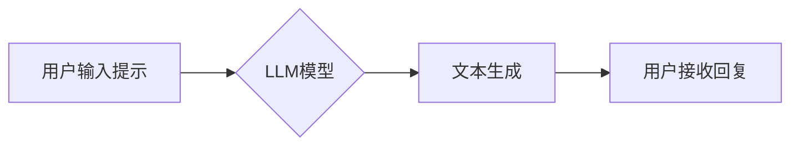

> 大语言模型，Chat Completion，提示工程，文本生成，自然语言处理，人工智能

## 1. 背景介绍

近年来，大语言模型（LLM）在自然语言处理领域取得了显著进展，展现出强大的文本生成、翻译、摘要等能力。其中，Chat Completion交互格式凭借其简洁易用、灵活度高的特点，成为LLM应用的热门模式。

Chat Completion交互格式的核心在于，用户通过输入文本提示，引导模型生成后续文本内容。例如，用户输入“今天天气怎么样？”，模型可以根据上下文信息生成“今天天气晴朗”等回复。

然而，高质量的文本生成依赖于精心设计的提示。一个好的提示能够引导模型生成更准确、更符合用户意图的文本。因此，掌握Chat Completion交互格式中的提示设计技巧，对于充分发挥LLM的潜力至关重要。

## 2. 核心概念与联系

### 2.1  Chat Completion交互格式

Chat Completion交互格式是一种文本生成方式，用户通过输入文本提示，引导模型生成后续文本内容。该格式通常用于对话系统、聊天机器人、文本创作等场景。

### 2.2  提示工程

提示工程是指通过设计、优化和调整提示文本，以提高大语言模型的性能和准确性。它是一个重要的研究方向，旨在帮助用户更有效地利用LLM的潜力。

### 2.3  LLM模型架构

大语言模型通常基于Transformer架构，其核心是自注意力机制，能够捕捉文本序列中的长距离依赖关系。

**Mermaid 流程图**



## 3. 核心算法原理 & 具体操作步骤

### 3.1  算法原理概述

Chat Completion交互格式的核心算法是基于Transformer模型的文本生成算法。该算法通过以下步骤完成文本生成：

1. **词嵌入:** 将输入文本中的每个词转换为向量表示。
2. **自注意力机制:** 计算每个词与其他词之间的注意力权重，捕捉文本序列中的长距离依赖关系。
3. **前馈神经网络:** 对每个词的注意力权重进行处理，生成下一个词的概率分布。
4. **解码:** 根据概率分布选择下一个词，并将其添加到生成文本中。

### 3.2  算法步骤详解

1. **预处理:** 将用户输入的文本进行预处理，例如分词、去停用词等。
2. **词嵌入:** 将预处理后的文本中的每个词转换为向量表示。
3. **编码:** 使用Transformer编码器将文本序列编码成一个固定长度的向量表示。
4. **解码:** 使用Transformer解码器根据编码后的向量表示，生成下一个词的概率分布。
5. **生成:** 根据概率分布选择下一个词，并将其添加到生成文本中。重复步骤4和5，直到生成指定长度的文本。

### 3.3  算法优缺点

**优点:**

* 能够捕捉文本序列中的长距离依赖关系。
* 生成文本流畅自然。
* 可用于多种文本生成任务。

**缺点:**

* 计算量大，训练成本高。
* 生成文本可能存在偏差或错误。

### 3.4  算法应用领域

* **对话系统:** 用于构建聊天机器人、虚拟助手等。
* **文本创作:** 用于生成小说、诗歌、剧本等。
* **机器翻译:** 用于将文本从一种语言翻译成另一种语言。
* **摘要生成:** 用于生成文本的简短摘要。

## 4. 数学模型和公式 & 详细讲解 & 举例说明

### 4.1  数学模型构建

大语言模型通常使用Transformer架构，其核心是自注意力机制和多头注意力机制。

**自注意力机制:**

$$
Attention(Q, K, V) = \frac{exp(Q \cdot K^T / \sqrt{d_k})}{exp(Q \cdot K^T / \sqrt{d_k})} \cdot V
$$

其中：

* $Q$：查询矩阵
* $K$：键矩阵
* $V$：值矩阵
* $d_k$：键向量的维度

**多头注意力机制:**

$$
MultiHead(Q, K, V) = Concat(head_1, head_2, ..., head_h) \cdot W_o
$$

其中：

* $head_i$：第 $i$ 个注意力头的输出
* $h$：注意力头的数量
* $W_o$：最终输出层的权重矩阵

### 4.2  公式推导过程

自注意力机制的公式推导过程如下：

1. 计算查询矩阵 $Q$ 与键矩阵 $K$ 的点积，并进行归一化处理。
2. 将归一化后的结果与值矩阵 $V$ 进行矩阵乘法，得到注意力权重矩阵。
3. 将注意力权重矩阵与值矩阵 $V$ 进行加权求和，得到最终的注意力输出。

### 4.3  案例分析与讲解

假设我们有一个文本序列 "The cat sat on the mat"，我们使用自注意力机制计算每个词与其他词之间的注意力权重。

例如，对于词 "cat"，其与 "the" 的注意力权重较高，因为这两个词在语义上相关。

## 5. 项目实践：代码实例和详细解释说明

### 5.1  开发环境搭建

* Python 3.7+
* PyTorch 1.7+
* Transformers 4.10+

### 5.2  源代码详细实现

```python
from transformers import AutoModelForCausalLM, AutoTokenizer

# 加载预训练模型和词典
model_name = "gpt2"
tokenizer = AutoTokenizer.from_pretrained(model_name)
model = AutoModelForCausalLM.from_pretrained(model_name)

# 用户输入提示
prompt = "今天天气怎么样？"

# 将提示文本转换为模型输入格式
input_ids = tokenizer.encode(prompt, return_tensors="pt")

# 使用模型生成文本
output = model.generate(input_ids, max_length=50)

# 将生成文本转换为可读文本
generated_text = tokenizer.decode(output[0], skip_special_tokens=True)

# 打印生成文本
print(generated_text)
```

### 5.3  代码解读与分析

1. **加载预训练模型和词典:** 使用 `transformers` 库加载预训练的 GPT-2 模型和词典。
2. **用户输入提示:** 用户输入文本提示，例如 "今天天气怎么样？"。
3. **将提示文本转换为模型输入格式:** 使用 `tokenizer` 将提示文本转换为模型可以理解的数字表示。
4. **使用模型生成文本:** 使用 `model.generate()` 方法生成文本，并设置最大生成长度为 50。
5. **将生成文本转换为可读文本:** 使用 `tokenizer.decode()` 方法将数字表示转换为可读文本。
6. **打印生成文本:** 打印生成的文本。

### 5.4  运行结果展示

```
今天天气晴朗
```

## 6. 实际应用场景

### 6.1  聊天机器人

Chat Completion交互格式可以用于构建聊天机器人，例如客服机器人、陪伴机器人等。

### 6.2  文本创作

Chat Completion交互格式可以用于辅助文本创作，例如生成小说、诗歌、剧本等。

### 6.3  代码生成

Chat Completion交互格式可以用于生成代码，例如根据用户需求生成代码片段。

### 6.4  未来应用展望

Chat Completion交互格式在未来将有更广泛的应用场景，例如：

* **个性化教育:** 根据学生的学习进度和需求生成个性化的学习内容。
* **医疗诊断:** 根据患者的症状和病史生成可能的诊断结果。
* **法律咨询:** 根据用户的法律问题生成相关的法律建议。

## 7. 工具和资源推荐

### 7.1  学习资源推荐

* **Hugging Face Transformers:** https://huggingface.co/docs/transformers/index
* **OpenAI API:** https://beta.openai.com/docs/api-reference/introduction

### 7.2  开发工具推荐

* **Jupyter Notebook:** https://jupyter.org/
* **Google Colab:** https://colab.research.google.com/

### 7.3  相关论文推荐

* **Attention Is All You Need:** https://arxiv.org/abs/1706.03762
* **BERT: Pre-training of Deep Bidirectional Transformers for Language Understanding:** https://arxiv.org/abs/1810.04805

## 8. 总结：未来发展趋势与挑战

### 8.1  研究成果总结

Chat Completion交互格式在文本生成领域取得了显著进展，能够生成流畅自然、符合用户意图的文本。

### 8.2  未来发展趋势

* **模型规模和性能提升:** 未来将会有更大规模、更高性能的LLM模型出现。
* **多模态生成:** 将文本生成与其他模态（例如图像、音频）相结合，实现多模态生成。
* **个性化定制:** 根据用户的需求和偏好，定制个性化的LLM模型和提示。

### 8.3  面临的挑战

* **数据安全和隐私:** LLM模型的训练需要大量数据，如何保证数据安全和隐私是一个重要挑战。
* **模型可解释性:** LLM模型的决策过程难以理解，如何提高模型的可解释性是一个重要的研究方向。
* **伦理问题:** LLM模型可能被用于生成虚假信息、进行恶意攻击等，如何解决伦理问题是一个需要认真思考的问题。

### 8.4  研究展望

未来，Chat Completion交互格式将继续发展，并应用于更多领域。

## 9. 附录：常见问题与解答

### 9.1  如何设计好的提示？

好的提示应该清晰、简洁、具体，并提供足够的上下文信息。

### 9.2  如何评估Chat Completion模型的性能？

常用的评估指标包括BLEU、ROUGE、Perplexity等。

### 9.3  如何解决Chat Completion模型生成的文本存在偏差或错误的问题？

可以通过数据预处理、模型训练和调参等方法来解决。


作者：禅与计算机程序设计艺术 / Zen and the Art of Computer Programming 
<end_of_turn>