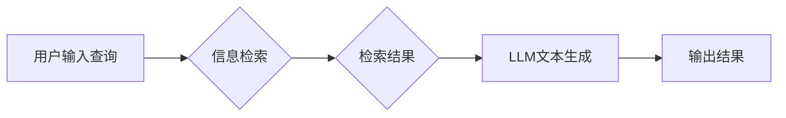

> 大语言模型 (LLM)、Retrieval Augmented Generation (RAG)、微调、知识库、信息检索、自然语言处理 (NLP)

## 1. 背景介绍

近年来，大语言模型 (LLM) 在自然语言处理 (NLP) 领域取得了显著进展，展现出强大的文本生成、翻译、问答等能力。然而，LLM 的知识储备主要来自其训练数据，缺乏对特定领域知识的深入理解和更新。为了解决这一问题，Retrieval Augmented Generation (RAG) 框架应运而生。

RAG 框架将信息检索 (IR) 与文本生成相结合，通过检索相关知识库信息，增强 LLM 的知识获取和生成能力。微调则是 RAG 框架的核心技术之一，通过在特定任务和数据集上对预训练的 LLM 进行调整，使其在目标领域表现更优。

## 2. 核心概念与联系

RAG 框架的核心概念包括：

* **大语言模型 (LLM):** 预训练的深度学习模型，能够理解和生成人类语言。
* **知识库 (Knowledge Base):** 存储结构化或半结构化知识的数据库。
* **信息检索 (IR):** 从知识库中检索与查询相关的文档或信息。
* **文本生成 (Text Generation):** 基于检索到的信息，生成高质量的文本。

RAG 框架的工作流程如下：



## 3. 核心算法原理 & 具体操作步骤

### 3.1  算法原理概述

RAG 框架的微调主要涉及以下几个步骤：

1. **预训练模型选择:** 选择合适的预训练 LLM，例如 BERT、RoBERTa、T5 等。
2. **知识库构建:** 构建包含目标领域知识的知识库，可以使用结构化数据库、文本文件等形式。
3. **信息检索模型训练:** 使用检索模型 (例如 BM25、BERT-based Retriever) 从知识库中检索与用户查询相关的文档。
4. **文本生成模型微调:** 将检索到的文档信息与用户查询一起输入到 LLM 中，并对 LLM 进行微调，使其能够生成更准确、更相关的文本。

### 3.2  算法步骤详解

1. **预训练模型选择:** 根据任务需求选择合适的预训练 LLM。例如，对于问答任务，可以选择 BERT 或 T5 等模型；对于文本摘要任务，可以选择 BART 或 T5 等模型。
2. **知识库构建:** 构建包含目标领域知识的知识库。知识库可以采用结构化数据库 (例如 MySQL、MongoDB) 或文本文件 (例如 JSON、CSV) 格式存储。
3. **信息检索模型训练:** 使用检索模型从知识库中检索与用户查询相关的文档。常用的检索模型包括 BM25、BERT-based Retriever 等。
4. **文本生成模型微调:** 将检索到的文档信息与用户查询一起输入到预训练的 LLM 中，并使用微调技术对其进行调整。微调方法包括：
    * **Fine-tuning:** 在目标任务数据集上对整个 LLM 进行训练。
    * **Prompt Engineering:** 设计合适的输入提示，引导 LLM 生成更准确的文本。
    * **Adapter Tuning:** 在 LLM 的特定层上添加小型可训练模块，进行微调。

### 3.3  算法优缺点

**优点:**

* **增强知识获取:** RAG 框架通过检索知识库信息，增强了 LLM 的知识获取能力。
* **提高文本质量:** RAG 框架可以生成更准确、更相关的文本，提高文本质量。
* **适应特定领域:** RAG 框架可以根据特定领域构建知识库，使其更适应目标领域的需求。

**缺点:**

* **知识库维护:** 知识库需要定期更新和维护，以确保其准确性和时效性。
* **检索效率:** 信息检索过程可能需要消耗大量时间和资源，影响整体效率。
* **模型复杂度:** RAG 框架的模型复杂度较高，需要更多的计算资源进行训练和推理。

### 3.4  算法应用领域

RAG 框架在以下领域具有广泛的应用前景:

* **问答系统:** RAG 框架可以构建更智能、更准确的问答系统，例如客服机器人、搜索引擎等。
* **文本摘要:** RAG 框架可以生成更准确、更全面的文本摘要，例如新闻摘要、会议记录等。
* **对话系统:** RAG 框架可以构建更自然、更流畅的对话系统，例如聊天机器人、虚拟助手等。
* **内容创作:** RAG 框架可以辅助内容创作，例如生成文章、故事、诗歌等。

## 4. 数学模型和公式 & 详细讲解 & 举例说明

### 4.1  数学模型构建

RAG 框架的数学模型主要包括信息检索模型和文本生成模型。

**信息检索模型:**

常用的信息检索模型包括 BM25 和 BERT-based Retriever。BM25 模型基于 TF-IDF 算法，计算文档中关键词的权重，并根据查询与文档的相似度进行排序。BERT-based Retriever 使用预训练的 BERT 模型，将查询和文档转换为向量，并使用余弦相似度计算其相似度。

**文本生成模型:**

常用的文本生成模型包括 Transformer、GPT 和 T5。这些模型使用注意力机制和多层神经网络结构，学习语言的语法和语义关系，并生成高质量的文本。

### 4.2  公式推导过程

**BM25 模型:**

BM25 模型的评分公式如下:

$$
score(q, d) = \sum_{t \in q} \frac{tf(t, d) \cdot idf(t)}{k_1 + (1 - b) + tf(t, d)}
$$

其中:

* $q$ 是查询
* $d$ 是文档
* $t$ 是查询或文档中的一个词
* $tf(t, d)$ 是词 $t$ 在文档 $d$ 中的词频
* $idf(t)$ 是词 $t$ 的逆文档频率
* $k_1$ 和 $b$ 是 BM25 模型的参数

**BERT-based Retriever:**

BERT-based Retriever 使用预训练的 BERT 模型，将查询和文档转换为向量，并使用余弦相似度计算其相似度:

$$
similarity(q, d) = \frac{q \cdot d}{||q|| ||d||}
$$

其中:

* $q$ 是查询向量
* $d$ 是文档向量
* $||q||$ 和 $||d||$ 分别是查询向量和文档向量的长度

### 4.3  案例分析与讲解

**案例:**

假设我们有一个知识库包含关于动物的知识，用户查询 "猫的特征是什么?"。

**信息检索:**

BM25 模型或 BERT-based Retriever 会从知识库中检索与 "猫" 和 "特征" 相关的文档。

**文本生成:**

检索到的文档信息将被输入到预训练的 LLM 中，例如 T5 模型，并生成以下文本:

"猫是一种小型哺乳动物，具有柔软的毛皮、尖锐的爪子和敏锐的听觉和视觉。它们通常是独居动物，但也会在繁殖季节形成群体。"

## 5. 项目实践：代码实例和详细解释说明

### 5.1  开发环境搭建

* Python 3.7+
* PyTorch 或 TensorFlow
* Transformers 库
* Faiss 库 (用于高效的向量检索)

### 5.2  源代码详细实现

```python
# 导入必要的库
from transformers import AutoModelForSeq2SeqLM, AutoTokenizer
from faiss import IndexFlatL2

# 加载预训练模型和词典
model_name = "t5-base"
tokenizer = AutoTokenizer.from_pretrained(model_name)
model = AutoModelForSeq2SeqLM.from_pretrained(model_name)

# 加载知识库
knowledge_base = load_knowledge_base("path/to/knowledge_base.json")

# 创建向量索引
index = IndexFlatL2(embedding_dim)
for document in knowledge_base:
    embedding = encode_document(document)
    index.add(embedding)

# 定义查询函数
def query(query):
    # 将查询转换为向量
    query_embedding = encode_query(query)
    # 在向量索引中检索相关的文档
    distances, indices = index.search(query_embedding, k=10)
    # 从知识库中获取检索到的文档
    retrieved_documents = [knowledge_base[i] for i in indices[0]]
    # 将检索到的文档信息与查询一起输入到模型中生成文本
    input_text = f"查询: {query}
检索结果:
{'
'.join(retrieved_documents)}
"
    inputs = tokenizer(input_text, return_tensors="pt")
    outputs = model.generate(**inputs)
    return tokenizer.decode(outputs[0], skip_special_tokens=True)

# 示例使用
query_text = "猫的特征是什么?"
response = query(query_text)
print(response)
```

### 5.3  代码解读与分析

* 代码首先加载预训练的 T5 模型和词典。
* 然后加载知识库，并使用 Faiss 库构建向量索引，以便高效地检索相关文档。
* `query()` 函数接受用户查询作为输入，将查询转换为向量，并使用向量索引检索相关的文档。
* 检索到的文档信息与查询一起输入到 T5 模型中，生成最终的文本响应。

### 5.4  运行结果展示

运行上述代码后，将输出关于 "猫的特征" 的文本响应，包含用户查询、检索到的文档信息以及模型生成的文本。

## 6. 实际应用场景

### 6.1  问答系统

RAG 框架可以构建更智能、更准确的问答系统，例如客服机器人、搜索引擎等。例如，一个客服机器人可以使用 RAG 框架从知识库中检索相关信息，并生成更准确的回复。

### 6.2  文本摘要

RAG 框架可以生成更准确、更全面的文本摘要，例如新闻摘要、会议记录等。例如，一个新闻网站可以使用 RAG 框架从新闻文章中检索相关信息，并生成简洁的新闻摘要。

### 6.3  对话系统

RAG 框架可以构建更自然、更流畅的对话系统，例如聊天机器人、虚拟助手等。例如，一个聊天机器人可以使用 RAG 框架从知识库中检索相关信息，并生成更自然、更符合语境的回复。

### 6.4  未来应用展望

RAG 框架在未来将有更广泛的应用前景，例如：

* **个性化教育:** RAG 框架可以根据学生的学习进度和需求，提供个性化的学习内容和答疑服务。
* **医疗诊断:** RAG 框架可以帮助医生从医学文献中检索相关信息，辅助进行诊断和治疗。
* **法律研究:** RAG 框架可以帮助律师从法律法规中检索相关信息，辅助进行法律研究和诉讼。

## 7. 工具和资源推荐

### 7.1  学习资源推荐

* **论文:**
    * "RAG: Retrieval-Augmented Generation for Knowledge-Intensive NLP Tasks"
    * "T5: Text-to-Text Transfer Transformer"
    * "BERT: Pre-training of Deep Bidirectional Transformers for Language Understanding"
* **博客:**
    * https://huggingface.co/blog/rag
    * https://www.tensorflow.org/tutorials/text/text_classification

### 7.2  开发工具推荐

* **Transformers 库:** https://huggingface.co/docs/transformers/index
* **Faiss 库:** https://github.com/facebookresearch/faiss
* **OpenAI API:** https://beta.openai.com/docs/api-reference/introduction

### 7.3  相关论文推荐

* "Retrieval Augmented Generation for Question Answering"
* "A Survey of Retrieval Augmented Generation"
* "Improving Text Summarization with Retrieval Augmented Generation"

## 8. 总结：未来发展趋势与挑战

### 8.1  研究成果总结

RAG 框架在自然语言处理领域取得了