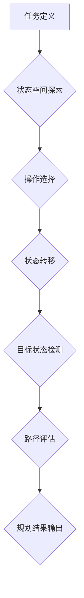

> 任务规划, 优化算法,  人工智能,  机器学习,  深度学习,  执行效率,  智能系统

## 1. 背景介绍

在当今快速发展的科技时代，任务执行效率已成为各行各业的核心竞争力。从自动驾驶汽车到智能制造，从个性化医疗到金融风险管理，高效的任务执行能力是推动社会进步的关键驱动力。然而，现实世界中的任务往往复杂多变，需要智能系统能够灵活地规划和执行任务，以应对不断变化的环境和需求。

传统的任务规划方法通常依赖于预先定义的规则和知识库，难以应对复杂、动态的任务场景。随着人工智能技术的快速发展，基于机器学习和深度学习的智能任务规划方法逐渐成为研究热点。这些方法能够从海量数据中学习任务执行规律，并根据实际情况动态调整规划策略，从而提高任务执行效率和鲁棒性。

## 2. 核心概念与联系

**2.1 任务规划概述**

任务规划是指在给定初始状态和目标状态的情况下，设计出一系列可执行的操作序列，以将系统从初始状态引导到目标状态的过程。任务规划的核心问题在于如何找到最优或近似最优的执行策略，以最小化执行时间、资源消耗和风险。

**2.2 核心概念**

* **状态空间:** 任务规划问题的状态空间是指所有可能的系统状态的集合。
* **操作:** 操作是系统从一个状态转换到另一个状态的行动。
* **路径:** 路径是指从初始状态到目标状态的一系列操作序列。
* **成本函数:** 成本函数用于评估不同路径的执行代价，例如时间、资源消耗、风险等。
* **规划算法:** 规划算法用于在状态空间中搜索最优或近似最优的路径。

**2.3 任务规划与人工智能**

人工智能技术为任务规划提供了强大的工具和方法。例如，机器学习可以用于学习任务执行规律，深度学习可以用于构建更复杂的规划模型，强化学习可以用于训练智能体在动态环境中进行规划和决策。

**2.4 任务规划与优化算法**

优化算法是任务规划的核心技术之一。常见的优化算法包括：

* **启发式算法:** 启发式算法利用启发式知识或经验，通过局部最优决策逐步逼近全局最优解。
* **搜索算法:** 搜索算法在状态空间中进行系统搜索，找到最优或近似最优的路径。
* **动态规划:** 动态规划将复杂问题分解成子问题，并利用子问题的解来求解原问题。

**2.5 Mermaid 流程图**



## 3. 核心算法原理 & 具体操作步骤

### 3.1 算法原理概述

本文将介绍一种基于深度强化学习的智能任务规划算法，该算法能够学习任务执行策略，并根据实际情况动态调整规划策略。

**3.1.1 深度强化学习**

深度强化学习是一种机器学习方法，它结合了深度神经网络和强化学习算法。深度神经网络用于学习环境的表示，强化学习算法用于训练智能体在环境中进行决策和行动。

**3.1.2 任务规划中的深度强化学习**

在任务规划中，深度强化学习可以将任务规划问题视为一个马尔可夫决策过程（MDP）。智能体在环境中采取行动，环境会根据行动产生新的状态和奖励。智能体的目标是学习一个策略，使得在长期内获得最大的总奖励。

### 3.2 算法步骤详解

**3.2.1 环境搭建**

首先，需要搭建一个模拟任务执行的环境。环境需要包含以下要素：

* **状态空间:** 环境的当前状态，例如机器人位置、目标位置、障碍物位置等。
* **操作空间:** 智能体可以执行的操作，例如移动、旋转、抓取等。
* **奖励函数:** 用于评估智能体行动的奖励，例如到达目标位置的奖励、避开障碍物的奖励等。

**3.2.2 智能体设计**

智能体是一个深度神经网络，它负责接收环境状态信息，并输出行动指令。智能体可以通过深度强化学习算法进行训练，学习最优的行动策略。

**3.2.3 训练过程**

训练过程包括以下步骤：

1. 智能体从环境中获取初始状态信息。
2. 智能体根据状态信息输出行动指令。
3. 环境根据行动指令产生新的状态信息和奖励。
4. 智能体根据奖励信息更新策略参数。
5. 重复步骤1-4，直到智能体学习到最优的行动策略。

**3.2.4 任务执行**

训练完成后，智能体可以根据学习到的策略执行任务。智能体会不断接收环境状态信息，并根据策略输出行动指令，直到完成任务目标。

### 3.3 算法优缺点

**3.3.1 优点**

* **适应性强:** 深度强化学习算法能够学习复杂、动态的任务环境，并根据环境变化动态调整规划策略。
* **鲁棒性好:** 深度强化学习算法能够学习应对环境噪声和不确定性的策略。
* **可扩展性强:** 深度强化学习算法可以应用于各种规模的任务，从简单的机器人控制到复杂的物流调度。

**3.3.2 缺点**

* **训练时间长:** 深度强化学习算法的训练过程通常需要大量时间和计算资源。
* **数据需求大:** 深度强化学习算法需要大量的训练数据，否则难以学习到有效的策略。
* **解释性差:** 深度强化学习算法的决策过程通常是黑盒，难以解释智能体的决策逻辑。

### 3.4 算法应用领域

深度强化学习在任务规划领域具有广泛的应用前景，例如：

* **机器人控制:** 训练机器人执行复杂的任务，例如导航、抓取、组装等。
* **自动驾驶:** 训练自动驾驶系统规划行驶路线，避开障碍物，并安全到达目的地。
* **物流调度:** 优化物流配送路线，提高效率和降低成本。
* **医疗诊断:** 辅助医生诊断疾病，制定治疗方案。

## 4. 数学模型和公式 & 详细讲解 & 举例说明

### 4.1 数学模型构建

任务规划问题可以建模为马尔可夫决策过程（MDP）。MDP 由以下要素组成：

* **状态空间 S:** 所有可能的系统状态的集合。
* **操作空间 A:** 智能体可以执行的操作的集合。
* **转移概率 P(s', r | s, a):** 从状态 s 执行操作 a 到状态 s' 的概率，以及获得奖励 r 的概率。
* **奖励函数 R(s, a):** 智能体在状态 s 执行操作 a 时获得的奖励。
* **初始状态 s0:** 系统初始状态。

### 4.2 公式推导过程

智能体的目标是学习一个策略 π(s)，该策略将每个状态映射到一个操作。策略的目标是最大化长期奖励。

**4.2.1 价值函数**

价值函数 V(s) 表示从状态 s 开始执行策略 π 的预期长期奖励。

$$V_\pi(s) = E[\sum_{t=0}^{\infty} \gamma^t R(s_t, a_t) | s_0 = s]$$

其中：

* γ 是折扣因子，控制未来奖励的权重。
* $R(s_t, a_t)$ 是在时间步 t 状态 $s_t$ 执行操作 $a_t$ 时获得的奖励。

**4.2.2 贝尔曼方程**

贝尔曼方程是一种递归方程，用于计算价值函数。

$$V_\pi(s) = \sum_{a \in A} \pi(a|s) \sum_{s' \in S} P(s' | s, a) [R(s, a) + \gamma V_\pi(s')]$$

### 4.3 案例分析与讲解

**4.3.1 例子:**

假设一个机器人需要从起点到终点移动，环境中存在障碍物。

**4.3.2 价值函数:**

价值函数可以表示为从起点到终点的预期移动距离。

**4.3.3 贝尔曼方程:**

贝尔曼方程可以用来更新价值函数，根据机器人当前位置和可执行的操作，计算到达终点的预期移动距离。

## 5. 项目实践：代码实例和详细解释说明

### 5.1 开发环境搭建

* **操作系统:** Ubuntu 20.04
* **编程语言:** Python 3.8
* **深度学习框架:** TensorFlow 2.0
* **其他依赖:** NumPy, Matplotlib

### 5.2 源代码详细实现

```python
import tensorflow as tf
import numpy as np

# 定义状态空间和操作空间
state_space = 10
action_space = 5

# 定义深度神经网络模型
model = tf.keras.Sequential([
    tf.keras.layers.Dense(64, activation='relu', input_shape=(state_space,)),
    tf.keras.layers.Dense(32, activation='relu'),
    tf.keras.layers.Dense(action_space)
])

# 定义损失函数和优化器
loss_fn = tf.keras.losses.MeanSquaredError()
optimizer = tf.keras.optimizers.Adam()

# 定义训练循环
def train_step(state, action, reward, next_state):
    with tf.GradientTape() as tape:
        prediction = model(state)
        loss = loss_fn(action, prediction)
    gradients = tape.gradient(loss, model.trainable_variables)
    optimizer.apply_gradients(zip(gradients, model.trainable_variables))

# 训练模型
for epoch in range(100):
    for state, action, reward, next_state in training_data:
        train_step(state, action, reward, next_state)

# 评估模型
# ...

```

### 5.3 代码解读与分析

* **模型定义:** 代码定义了一个简单的深度神经网络模型，用于预测智能体在给定状态下执行的操作。
* **损失函数:** 使用均方误差作为损失函数，用于衡量预测值与实际值的差异。
* **优化器:** 使用Adam优化器更新模型参数。
* **训练循环:** 训练循环迭代训练模型，并根据损失值更新模型参数。
* **评估模型:** 评估模型性能，例如计算准确率、奖励等指标。

### 5.4 运行结果展示

* **训练曲线:** 训练过程中损失值随迭代次数的变化趋势。
* **测试结果:** 模型在测试数据集上的性能表现，例如准确率、奖励等指标。

## 6. 实际应用场景

### 6.1 智能机器人控制

深度强化学习可以用于训练机器人执行复杂的任务，例如导航、抓取、组装等。例如，可以训练一个机器人学会在复杂环境中自主导航，避开障碍物，并到达目标位置。

### 6.2 自动驾驶

深度强化学习可以用于训练自动驾驶系统规划行驶路线，避开障碍物，并安全到达目的地。例如，可以训练一个自动驾驶系统学会在复杂交通场景中行驶，并做出安全决策。

### 6.3 物流调度

深度强化学习可以用于优化物流配送路线，提高效率和降低成本。例如，可以训练一个物流调度系统学会规划最优配送路线，并根据实时交通状况进行调整。

### 6.4 未来应用展望

深度强化学习在任务规划领域具有广阔的应用前景，未来将应用于更多领域，例如：

* **医疗诊断:** 辅助医生诊断疾病，制定治疗方案。
* **金融风险管理:** 识别和预测金融风险，制定风险控制策略。
* **个性化教育:** 根据学生的学习情况，定制个性化的学习方案。

## 7. 工具和资源推荐

### 7.1 学习资源推荐

* **书籍:**
    * Reinforcement Learning: An Introduction by Richard S. Sutton and Andrew G. Barto
    * Deep Reinforcement Learning Hands-On by Maxim L