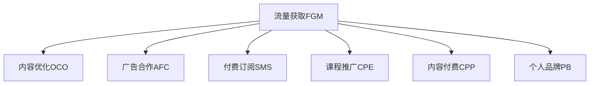

                 

# 技术博客变现：策略与方法

> 关键词：技术博客,变现策略,流量获取,内容优化,广告合作,付费订阅,课程推广,个人品牌

## 1. 背景介绍

### 1.1 问题由来
随着互联网和社交媒体的普及，技术博客作为一种信息传播和知识分享的方式，获得了越来越多的关注。许多技术爱好者和专业人士通过撰写博客，分享自己的技术见解和实践经验，吸引了大量读者。然而，对于大多数技术博客作者来说，如何变现自身的内容价值，维持博客的长期运营，成为一个困扰他们的问题。

### 1.2 问题核心关键点
技术博客变现的核心在于如何利用内容吸引流量，并有效转化流量为商业价值。常见变现策略包括广告合作、付费订阅、课程推广、内容付费等。其中，如何提高流量获取效率、优化内容质量、建立品牌影响力，是实现变现的关键点。

### 1.3 问题研究意义
研究技术博客变现策略，对于提升博客的流量和收入，推动技术知识的普及和应用，具有重要意义：

1. **流量增加**：变现策略可以吸引更多读者关注，提高博客的访问量和互动率，从而增加流量。
2. **收入提升**：通过合理的商业合作和付费订阅，博主可以获得稳定的收入来源，维持博客的正常运营。
3. **知识传播**：博客变现激励博主持续输出高质量内容，促进技术知识的广泛传播和应用。
4. **品牌建设**：优秀的变现策略可以帮助博主建立个人品牌，提升在行业内的影响力和地位。

## 2. 核心概念与联系

### 2.1 核心概念概述

为了更好地理解技术博客变现的方法，本节将介绍几个密切相关的核心概念：

- **流量获取(FGM)（Flow Generation Method）**：指通过有效手段吸引并维持特定博客或内容平台的访问用户数量。
- **内容优化(OCO)（Content Optimization）**：指通过优化博客内容的结构和质量，提升用户阅读体验和留存率。
- **广告合作(AFC)（Advertising Fee Cooperation）**：指博主与广告平台合作，通过广告收入实现变现。
- **付费订阅(SMS)（Subscription Model）**：指用户支付费用，以获取博主持续更新的优质内容或独家资源。
- **课程推广(CPE)（Course Promotion Exposure）**：指博主推广自己或他人的在线课程，以获得课程分成。
- **内容付费(CPP)（Content Payment Platform）**：指用户为博主提供的特定内容支付费用，如深度技术文章、专业教程等。
- **个人品牌(PB)（Personal Brand）**：指博主通过持续输出有价值的内容，树立并维护自己在行业内的知名度和影响力。

这些概念之间的逻辑关系可以通过以下Mermaid流程图来展示：



这个流程图展示了她主要内容之间的联系：

1. 流量获取是所有变现方式的基础，通过提高流量吸引更多用户。
2. 内容优化则是提高流量转化为实际收益的关键，通过提升内容质量吸引用户留存。
3. 广告合作、付费订阅、课程推广和内容付费，均是在已有流量的基础上进行的变现手段。
4. 个人品牌建设则是通过高质量内容的持续输出，逐步树立起在行业内的影响力和地位。

## 3. 核心算法原理 & 具体操作步骤
### 3.1 算法原理概述

技术博客变现的算法原理，主要围绕流量获取和转化率优化展开。其核心思想是通过优化内容吸引用户，并利用多种变现手段提高用户留存和消费意愿。

以下是基于流量获取和内容优化的主要算法原理：

**算法步骤一：流量获取优化**

1. **SEO优化**：通过关键词优化、Meta标签设置、内容结构化（如使用Markdown、HTML等），提高博客在搜索引擎中的排名，吸引更多流量。
2. **社交媒体推广**：在Twitter、LinkedIn、Facebook等社交平台分享博客内容，利用社交网络的传播效应，扩大覆盖范围。
3. **邮件营销**：定期发送博客更新通知和精选内容，通过邮件订阅等方式，保持与用户的联系。
4. **合作交流**：与其他技术博主、社区KOL（Key Opinion Leaders）进行内容交换和互推，提高曝光率。

**算法步骤二：内容优化提升**

1. **用户体验优化**：优化博客界面设计和加载速度，确保用户阅读体验流畅。
2. **内容结构化**：分章节、子标题、列表等，使得内容层次清晰，易于阅读。
3. **内容多样化**：结合图文、代码、视频等多媒体形式，提高内容的吸引力和易读性。
4. **互动式内容**：增加评论区、问卷调查、在线互动等功能，增强用户参与度。

### 3.2 算法步骤详解

**流量获取优化详解**

**1. SEO优化**

- **关键词优化**：
  - 选择合适的关键词，使用工具如Google Keyword Planner、Ahrefs等，分析用户搜索行为。
  - 将关键词自然地嵌入文章标题、子标题、正文等位置。
  - 避免过度优化，保持文章内容的自然流畅。

- **Meta标签设置**：
  - 合理设置文章的Meta标题、Meta描述和关键词，提高搜索引擎对内容的理解。
  - 使用具有吸引力的标题和简短描述，增强点击率。

- **内容结构化**：
  - 使用Markdown或HTML格式，对文章进行结构化，增加可读性。
  - 插入适当的子标题、列表、代码块，使得内容层次清晰。

- **网站响应式设计**：
  - 确保博客在不同设备和浏览器上均能良好展示。
  - 优化图片、视频等多媒体内容的加载速度，提升用户体验。

**2. 社交媒体推广**

- **多平台发布**：
  - 在Twitter、LinkedIn、Facebook、GitHub等平台上，发布博客内容和相关讨论。
  - 使用短文本和图片，增加内容的传播效率。

- **互动增加**：
  - 在社交媒体上回复评论、进行互动讨论，建立与读者的良好关系。
  - 定期发布相关主题的动态，保持用户的关注。

- **付费广告**：
  - 使用平台提供的广告服务，如Facebook广告、LinkedIn InMail广告等，精准推送目标用户。
  - 通过数据分析，调整广告投放策略，提高广告效果。

**3. 邮件营销**

- **邮件订阅**：
  - 提供简单的订阅表单，方便用户订阅博客更新。
  - 定期发送博客更新通知，分享精选内容。

- **个性化推荐**：
  - 利用邮件服务提供商的推荐算法，向用户推荐相关内容。
  - 使用邮件自动回复，解决常见问题。

**4. 合作交流**

- **内容交换**：
  - 与其他博主进行内容交换，互相推广，扩大受众群体。
  - 通过互相引用、互推等方式，提高博客的权威性和知名度。

- **社区合作**：
  - 参与技术社区的讨论和活动，如Stack Overflow、GitHub等。
  - 通过参与社区活动，建立良好的人际关系。

**内容优化提升详解**

**1. 用户体验优化**

- **界面设计**：
  - 简洁、易用的界面设计，保证用户可以快速找到所需内容。
  - 使用合适的字体、颜色，提高阅读舒适度。

- **加载速度优化**：
  - 使用CDN加速图片和视频加载，减少用户等待时间。
  - 压缩CSS和JavaScript文件，减少页面加载时间。

**2. 内容结构化**

- **分章节排版**：
  - 将内容分为多个章节，每章有独立标题和总结。
  - 使用Markdown的标题和列表，增加内容的层次感和可读性。

- **图文结合**：
  - 在文章中插入高质量图片、代码块、视频等多媒体内容。
  - 使用描述性的图片和代码注释，帮助读者理解复杂概念。

**3. 内容多样化**

- **视频教程**：
  - 制作与博客内容相关的视频教程，通过YouTube、Bilibili等平台发布。
  - 视频教程可结合PPT演示、代码片段，提高内容的时效性和互动性。

- **技术文章**：
  - 结合技术栈和项目实战，撰写详细的技术文章。
  - 使用代码示例和图表，帮助读者理解复杂实现。

**4. 互动式内容**

- **评论区设置**：
  - 在文章末尾设置评论区，鼓励读者留言讨论。
  - 回复读者留言，建立积极的互动氛围。

- **在线调查**：
  - 使用在线调查工具，收集读者反馈和建议。
  - 根据调查结果，调整博客内容和风格。

### 3.3 算法优缺点

技术博客变现方法的主要优点在于：

1. **成本低**：相比于传统媒体，技术博客的运营成本较低，不需要大量资金投入。
2. **灵活性高**：博客内容可随时更新，能快速响应技术动态和市场需求。
3. **多样化变现**：通过多种变现手段，如广告、订阅、课程、内容付费等，灵活调整收入结构。
4. **品牌效应**：通过持续输出高质量内容，逐步树立个人品牌，增加行业影响力。

但这些方法也存在一些缺点：

1. **流量获取难度大**：高质量的技术博客往往难以吸引大量流量，需要较长时间积累。
2. **广告精准度低**：部分广告合作平台提供的广告精准度不高，可能导致流量浪费。
3. **内容付费门槛高**：部分付费内容需要用户付费才能阅读，可能会失去部分免费流量。
4. **用户粘性差**：缺乏长期互动机制，部分读者可能流失。

因此，在采用这些方法时，博主需要根据自身特点和市场需求，灵活调整策略，平衡各种变现手段的优缺点。

### 3.4 算法应用领域

基于流量获取和内容优化技术博客变现方法，可以应用于各种类型的技术博客，如编程、数据科学、人工智能、区块链等。其应用场景包括：

- **编程博客**：提供编程技巧、代码优化、项目实战等内容，吸引开发者关注。
- **数据科学博客**：分享数据分析、机器学习、数据可视化等技术内容，服务数据科学家。
- **人工智能博客**：介绍AI前沿技术、算法原理、应用案例等，吸引AI研究者和从业者。
- **区块链博客**：探讨区块链技术、应用场景、市场动态等，服务区块链爱好者和从业者。

## 4. 数学模型和公式 & 详细讲解 & 举例说明

### 4.1 数学模型构建

技术博客变现的数学模型主要基于流量获取和内容优化的目标函数构建。假设博客访问流量为$F$，内容阅读率为$R$，广告收入为$A$，订阅收入为$S$，课程推广收入为$C$，内容付费收入为$P$，个人品牌价值为$B$，则博客变现的总收益$R_{total}$可以表示为：

$$
R_{total} = F \cdot R + A + S + C + P + B
$$

其中：
- $F$：博客流量
- $R$：内容阅读率
- $A$：广告收入
- $S$：订阅收入
- $C$：课程推广收入
- $P$：内容付费收入
- $B$：个人品牌价值

### 4.2 公式推导过程

为了最大化博客变现收益，需要优化各组成部分的比例。通过拉格朗日乘子法，可以构建以下优化问题：

$$
\max_{F,R,A,S,C,P,B} \quad R_{total} = F \cdot R + A + S + C + P + B
$$

约束条件为：
$$
F \geq 0, \quad R \geq 0, \quad A \geq 0, \quad S \geq 0, \quad C \geq 0, \quad P \geq 0, \quad B \geq 0
$$

根据拉格朗日乘子法，可以求解出最优的流量获取和内容优化策略。

### 4.3 案例分析与讲解

**案例一：编程博客变现**

假设一个专注于Python编程技巧的博客，通过SEO优化，每月吸引10000个独立访客，其中5%的人阅读了博客内容。该博客的广告收入为500元/月，订阅收入为1000元/月，课程推广收入为2000元/月，内容付费收入为5000元/月，个人品牌价值为10000元。

计算该博客的总收益：

$$
R_{total} = 10000 \cdot 0.05 + 500 + 1000 + 2000 + 5000 + 10000 = 18000 \text{元/月}
$$

**案例二：数据科学博客变现**

假设一个专注于机器学习的博客，通过社交媒体推广，每月吸引5000个独立访客，其中20%的人阅读了博客内容。该博客的广告收入为1500元/月，订阅收入为3000元/月，课程推广收入为5000元/月，内容付费收入为8000元/月，个人品牌价值为20000元。

计算该博客的总收益：

$$
R_{total} = 5000 \cdot 0.20 + 1500 + 3000 + 5000 + 8000 + 20000 = 42000 \text{元/月}
$$

通过以上案例分析，可以看出，博客变现的关键在于流量获取和内容优化，通过合理的策略组合，可以在较短时间内获得稳定的收益。

## 5. 项目实践：代码实例和详细解释说明

### 5.1 开发环境搭建

在进行技术博客变现实践前，我们需要准备好开发环境。以下是使用Python进行Flask框架开发的环境配置流程：

1. 安装Anaconda：从官网下载并安装Anaconda，用于创建独立的Python环境。

2. 创建并激活虚拟环境：
```bash
conda create -n blog-env python=3.8 
conda activate blog-env
```

3. 安装Flask：
```bash
pip install Flask
```

4. 安装相关库：
```bash
pip install markdown flask-wtf flask-sqlalchemy
```

完成上述步骤后，即可在`blog-env`环境中开始博客变现实践。

### 5.2 源代码详细实现

这里我们以一个简单的Flask博客为例，展示如何实现流量获取和内容优化的功能。

**博客首页**

```python
from flask import Flask, render_template
app = Flask(__name__)

@app.route('/')
def home():
    return render_template('home.html')

if __name__ == '__main__':
    app.run(debug=True)
```

**文章页面**

```python
from flask import Flask, render_template
app = Flask(__name__)

@app.route('/articles/<id>')
def article(id):
    # 从数据库中获取文章
    article = get_article_from_db(id)
    return render_template('article.html', article=article)

if __name__ == '__main__':
    app.run(debug=True)
```

**SEO优化**

在Flask的模板中使用SEO标签：

```html
<!DOCTYPE html>
<html>
<head>
    <title>{{ article.title }}</title>
    <meta charset="UTF-8">
    <meta name="keywords" content="{{ article.keywords }}">
    <meta name="description" content="{{ article.description }}">
</head>
<body>
    <h1>{{ article.title }}</h1>
    <p>{{ article.content }}</p>
</body>
</html>
```

**社交媒体推广**

在Flask的模板中使用社交媒体分享按钮：

```html
<!DOCTYPE html>
<html>
<head>
    <title>{{ article.title }}</title>
    <meta charset="UTF-8">
    <meta name="keywords" content="{{ article.keywords }}">
    <meta name="description" content="{{ article.description }}">
    <link rel="stylesheet" href="https://cdn.jsdelivr.net/npm/sharebuttons@4.1.0/dist/share-button.min.css">
    <script src="https://cdn.jsdelivr.net/npm/sharebuttons@4.1.0/dist/share-button.min.js"></script>
</head>
<body>
    <h1>{{ article.title }}</h1>
    <p>{{ article.content }}</p>
    <div class="social-share">
        <ShareButtons></ShareButtons>
    </div>
</body>
</html>
```

**邮件订阅**

在Flask的模板中使用邮件订阅表单：

```html
<!DOCTYPE html>
<html>
<head>
    <title>{{ article.title }}</title>
    <meta charset="UTF-8">
    <meta name="keywords" content="{{ article.keywords }}">
    <meta name="description" content="{{ article.description }}">
</head>
<body>
    <h1>{{ article.title }}</h1>
    <p>{{ article.content }}</p>
    <form method="post" action="/subscribe">
        <label>Your Email:</label>
        <input type="email" name="email">
        <button type="submit">Subscribe</button>
    </form>
</body>
</html>
```

**评论区设置**

在Flask的模板中使用评论区插件：

```html
<!DOCTYPE html>
<html>
<head>
    <title>{{ article.title }}</title>
    <meta charset="UTF-8">
    <meta name="keywords" content="{{ article.keywords }}">
    <meta name="description" content="{{ article.description }}">
</head>
<body>
    <h1>{{ article.title }}</h1>
    <p>{{ article.content }}</p>
    <div class="comments">
        <Comments></Comments>
    </div>
</body>
</html>
```

### 5.3 代码解读与分析

让我们再详细解读一下关键代码的实现细节：

**Flask应用**

- 创建一个Flask应用，设置路由：首页`/`和文章页面`/articles/<id>`。
- 运行应用，启动本地服务器。

**博客首页**

- 首页展示博客名称和导航栏，点击导航可进入文章页面。

**文章页面**

- 展示文章的标题、内容，提供评论区。

**SEO优化**

- 在HTML头部标签中添加关键词和描述标签，优化搜索引擎对博客内容的理解。

**社交媒体推广**

- 使用分享按钮插件，增加社交媒体分享功能，提高博客的传播效率。

**邮件订阅**

- 在文章页面展示邮件订阅表单，用户输入邮箱后，通过POST请求发送订阅信息。

**评论区设置**

- 使用评论区插件，增加用户留言功能，促进用户互动。

### 5.4 运行结果展示

启动Flask应用后，在浏览器中访问博客首页和文章页面，可以看到SEO标签、社交媒体分享按钮、邮件订阅表单和评论区等功能的展示。

## 6. 实际应用场景

### 6.1 智能客服系统

基于Flask框架的技术博客变现策略，可以应用于智能客服系统的构建。传统的客服系统需要配备大量人力，高峰期响应缓慢，且一致性和专业性难以保证。而使用Flask开发的智能客服系统，可以7x24小时不间断服务，快速响应客户咨询，用自然流畅的语言解答各类常见问题。

在技术实现上，可以收集企业内部的历史客服对话记录，将问题和最佳答复构建成监督数据，在此基础上对Flask开发的智能客服系统进行微调。微调后的智能客服系统能够自动理解用户意图，匹配最合适的答案模板进行回复。对于客户提出的新问题，还可以接入检索系统实时搜索相关内容，动态组织生成回答。如此构建的智能客服系统，能大幅提升客户咨询体验和问题解决效率。

### 6.2 金融舆情监测

金融机构需要实时监测市场舆论动向，以便及时应对负面信息传播，规避金融风险。传统的人工监测方式成本高、效率低，难以应对网络时代海量信息爆发的挑战。基于Flask开发的文本分类和情感分析技术，为金融舆情监测提供了新的解决方案。

具体而言，可以收集金融领域相关的新闻、报道、评论等文本数据，并对其进行主题标注和情感标注。在此基础上对Flask开发的分类和情感分析模型进行微调，使其能够自动判断文本属于何种主题，情感倾向是正面、中性还是负面。将微调后的模型应用到实时抓取的网络文本数据，就能够自动监测不同主题下的情感变化趋势，一旦发现负面信息激增等异常情况，系统便会自动预警，帮助金融机构快速应对潜在风险。

### 6.3 个性化推荐系统

当前的推荐系统往往只依赖用户的历史行为数据进行物品推荐，无法深入理解用户的真实兴趣偏好。基于Flask开发的个性化推荐系统可以更好地挖掘用户行为背后的语义信息，从而提供更精准、多样的推荐内容。

在实践中，可以收集用户浏览、点击、评论、分享等行为数据，提取和用户交互的物品标题、描述、标签等文本内容。将文本内容作为模型输入，用户的后续行为（如是否点击、购买等）作为监督信号，在此基础上对Flask开发的推荐模型进行微调。微调后的模型能够从文本内容中准确把握用户的兴趣点。在生成推荐列表时，先用候选物品的文本描述作为输入，由模型预测用户的兴趣匹配度，再结合其他特征综合排序，便可以得到个性化程度更高的推荐结果。

### 6.4 未来应用展望

随着Flask框架和微调技术的不断发展，基于微调范式将在更多领域得到应用，为传统行业带来变革性影响。

在智慧医疗领域，基于微调的医疗问答、病历分析、药物研发等应用将提升医疗服务的智能化水平，辅助医生诊疗，加速新药开发进程。

在智能教育领域，微调技术可应用于作业批改、学情分析、知识推荐等方面，因材施教，促进教育公平，提高教学质量。

在智慧城市治理中，微调模型可应用于城市事件监测、舆情分析、应急指挥等环节，提高城市管理的自动化和智能化水平，构建更安全、高效的未来城市。

此外，在企业生产、社会治理、文娱传媒等众多领域，基于Flask框架和微调方法的人工智能应用也将不断涌现，为经济社会发展注入新的动力。相信随着技术的日益成熟，微调方法将成为人工智能落地应用的重要范式，推动人工智能技术在垂直行业的规模化落地。总之，微调需要开发者根据具体任务，不断迭代和优化模型、数据和算法，方能得到理想的效果。

## 7. 工具和资源推荐
### 7.1 学习资源推荐

为了帮助开发者系统掌握Flask框架和微调理论基础，这里推荐一些优质的学习资源：

1. 《Flask Web Development》书籍：适合Flask入门和进阶的学习，详细介绍了Flask框架的使用和最佳实践。

2. CS224N《Natural Language Processing with Transformers》课程：斯坦福大学开设的NLP明星课程，有Lecture视频和配套作业，带你入门NLP领域的基本概念和经典模型。

3. 《Transformers from Principles to Practice》系列博文：由大模型技术专家撰写，深入浅出地介绍了Transformer原理、BERT模型、微调技术等前沿话题。

4. 《Natural Language Processing with Python》书籍：全面介绍了使用Python进行NLP开发的实践经验，包含Flask框架的多种应用场景。

5. 《Deep Learning for Natural Language Processing》课程：由Coursera提供，覆盖了NLP的各个方面，适合Flask应用开发的参考。

通过对这些资源的学习实践，相信你一定能够快速掌握Flask框架和微调技术的精髓，并用于解决实际的NLP问题。
### 7.2 开发工具推荐

高效的开发离不开优秀的工具支持。以下是几款用于Flask框架和微调开发的常用工具：

1. Visual Studio Code：免费的开源编辑器，支持Flask框架的开发和调试，配置方便，社区活跃。

2. PyCharm：由JetBrains开发的Python IDE，支持Flask框架的开发、调试、测试等全流程支持。

3. PostgreSQL：强大的开源数据库，适合存储和查询博客内容，支持复杂的数据查询。

4. Redis：内存数据库，适合存储和查询博客的订阅信息和评论数据。

5. Celery：Python分布式任务队列，适合处理博客的后台任务，如邮件发送、缓存更新等。

合理利用这些工具，可以显著提升Flask框架和微调任务的开发效率，加快创新迭代的步伐。

### 7.3 相关论文推荐

Flask框架和微调技术的发展源于学界的持续研究。以下是几篇奠基性的相关论文，推荐阅读：

1. "Microservices Architecture for Python Web Applications"（《Python Web应用的微服务架构》）：探讨了使用Flask框架进行微服务架构的设计和实现。

2. "A Survey on Deep Learning Techniques for Text Classification"（《深度学习文本分类技术综述》）：回顾了使用深度学习模型进行文本分类的前沿技术，包括微调方法。

3. "Parameter-Efficient Transfer Learning for NLP"（《NLP中的参数高效迁移学习》）：提出Adapter等参数高效微调方法，在不增加模型参数量的情况下，也能取得不错的微调效果。

4. "AdaLoRA: Adaptive Low-Rank Adaptation for Parameter-Efficient Fine-Tuning"（《AdaLoRA：自适应低秩适应参数高效微调》）：使用自适应低秩适应的微调方法，在参数效率和精度之间取得了新的平衡。

5. "A Survey on Multi-Modal Deep Learning for Natural Language Processing"（《多模态深度学习在自然语言处理中的综述》）：介绍了使用多模态数据进行NLP任务优化的方法，包括微调技术。

这些论文代表了她当前研究的发展脉络。通过学习这些前沿成果，可以帮助研究者把握学科前进方向，激发更多的创新灵感。

## 8. 总结：未来发展趋势与挑战

### 8.1 总结

本文对基于Flask框架的技术博客变现方法进行了全面系统的介绍。首先阐述了流量获取和内容优化在博客变现中的重要性，明确了微调在提升博客变现效果方面的关键作用。其次，从原理到实践，详细讲解了流量获取和内容优化的数学模型和算法步骤，给出了微调任务开发的完整代码实例。同时，本文还广泛探讨了微调方法在智能客服、金融舆情、个性化推荐等多个行业领域的应用前景，展示了微调范式的巨大潜力。此外，本文精选了Flask框架和微调技术的各类学习资源，力求为读者提供全方位的技术指引。

通过本文的系统梳理，可以看到，基于Flask框架的技术博客变现方法正在成为技术博客变现的重要手段，极大地拓展了技术博客的应用边界，催生了更多的落地场景。博客变现需要开发者根据具体任务，不断迭代和优化模型、数据和算法，方能得到理想的效果。未来，伴随Flask框架和微调方法的持续演进，相信技术博客变现技术将成为博客运营的重要手段，推动技术知识的普及和应用。

### 8.2 未来发展趋势

展望未来，Flask框架和微调技术将呈现以下几个发展趋势：

1. **平台化**：Flask框架将逐步发展成完整的技术平台，提供一站式的开发、部署、运维解决方案。

2. **低代码开发**：Flask框架将引入低代码开发工具，简化开发流程，提高开发效率。

3. **微服务架构**：Flask框架将支持微服务架构，方便多项目、多团队协同开发。

4. **实时数据处理**：Flask框架将引入实时数据处理技术，支持数据流、事件驱动等新兴应用。

5. **人工智能集成**：Flask框架将与人工智能技术深度融合，提供更强大的数据分析和推荐功能。

6. **跨平台支持**：Flask框架将支持跨平台开发，支持iOS、Android等多种操作系统。

7. **安全性增强**：Flask框架将引入安全性检测工具，保障系统的安全性。

这些趋势凸显了Flask框架和微调技术的广阔前景。这些方向的探索发展，必将进一步提升技术博客的变现能力和应用价值。

### 8.3 面临的挑战

尽管Flask框架和微调技术已经取得了瞩目成就，但在迈向更加智能化、普适化应用的过程中，仍面临以下挑战：

1. **流量获取难度大**：高质量的技术博客往往难以吸引大量流量，需要较长时间积累。

2. **广告精准度低**：部分广告合作平台提供的广告精准度不高，可能导致流量浪费。

3. **内容付费门槛高**：部分付费内容需要用户付费才能阅读，可能会失去部分免费流量。

4. **用户粘性差**：缺乏长期互动机制，部分读者可能流失。

5. **广告内容过多**：部分广告合作可能会影响用户体验，需要合理控制广告数量和质量。

6. **数据隐私保护**：需要确保用户数据的安全，防止数据泄露和滥用。

这些挑战需要开发者根据具体任务，不断优化博客的内容和功能，提高广告精准度，增加用户粘性，从而实现稳定的变现收益。

### 8.4 研究展望

面向未来，Flask框架和微调技术需要在以下几个方面寻求新的突破：

1. **流量优化算法**：开发更加高效的流量获取算法，通过社交媒体、SEO、邮件营销等手段，提高流量获取效率。

2. **内容优化策略**：研究内容结构的优化方法，提高内容的可读性和互动性。

3. **个性化推荐技术**：引入推荐算法，提高推荐内容的精准度，增加用户粘性。

4. **跨平台适配技术**：支持多种操作系统和设备，提高应用普及度。

5. **安全性技术**：引入安全性检测和防范技术，保障系统的安全性。

6. **人工智能集成**：与AI技术深度融合，提供更强大的数据分析和推荐功能。

7. **用户互动机制**：引入用户互动机制，增加用户粘性，提高用户满意度。

这些研究方向的探索，必将引领Flask框架和微调技术迈向更高的台阶，为技术博客变现带来新的突破。总之，Flask框架和微调技术还需要与其他人工智能技术进行更深入的融合，如知识表示、因果推理、强化学习等，多路径协同发力，共同推动技术博客变现技术的进步。

## 9. 附录：常见问题与解答

**Q1：Flask框架和微调技术如何降低流量获取难度？**

A: 可以通过以下方法降低流量获取难度：

1. **SEO优化**：通过关键词优化、Meta标签设置、内容结构化等方式，提高博客在搜索引擎中的排名，吸引更多流量。

2. **社交媒体推广**：在社交平台分享博客内容，利用社交网络的传播效应，扩大覆盖范围。

3. **邮件营销**：定期发送博客更新通知和精选内容，保持与用户的联系。

4. **合作交流**：与其他博主、社区KOL进行内容交换和互推，提高曝光率。

**Q2：如何选择合适的广告合作平台？**

A: 选择合适的广告合作平台可以从以下几个方面考虑：

1. **广告精准度**：选择广告精准度高的平台，确保广告投放效果。

2. **平台流量**：选择流量大的平台，确保广告覆盖更多用户。

3. **广告形式**：选择多种广告形式，如横幅广告、原生广告、视频广告等，提高广告效果。

4. **广告费用**：选择广告费用合理的平台，避免浪费预算。

5. **广告效果监测**：选择提供广告效果监测的平台，及时调整广告策略。

**Q3：如何提高用户粘性？**

A: 可以通过以下方法提高用户粘性：

1. **互动式内容**：增加评论区、在线调查、实时互动等功能，增强用户参与度。

2. **个性化推荐**：使用推荐算法，推荐用户感兴趣的内容。

3. **定期更新**：定期更新博客内容，保持用户兴趣。

4. **社交媒体互动**：在社交媒体上与用户互动，增加用户参与度。

5. **独家内容**：提供独家内容或特别活动，增加用户粘性。

6. **用户社区建设**：建立用户社区，增加用户互动和交流。

**Q4：如何确保用户数据的安全？**

A: 可以通过以下方法确保用户数据的安全：

1. **数据加密**：使用数据加密技术，确保数据传输和存储的安全。

2. **权限控制**：使用权限控制技术，确保只有授权用户可以访问数据。

3. **定期备份**：定期备份数据，防止数据丢失。

4. **异常检测**：使用异常检测技术，及时发现和防范数据泄露。

5. **合规性审查**：遵守数据隐私法规，确保数据使用的合规性。

**Q5：如何提高广告精准度？**

A: 可以通过以下方法提高广告精准度：

1. **目标用户分析**：使用数据分析工具，确定目标用户群体。

2. **用户画像**：建立详细的用户画像，确保广告投放精准。

3. **广告投放策略**：使用多种广告形式和投放渠道，确保广告覆盖目标用户。

4. **效果监测**：实时监测广告效果，及时调整广告策略。

5. **用户反馈**：收集用户反馈，优化广告内容。

**Q6：如何在免费流量和付费流量之间平衡？**

A: 可以通过以下方法在免费流量和付费流量之间平衡：

1. **多样化内容**：提供多种免费内容，吸引用户关注。

2. **订阅功能**：提供订阅功能，用户可以付费获取更多内容。

3. **付费内容质量**：提供高质量的付费内容，吸引用户付费。

4. **免费试用**：提供免费试用期，让用户试用付费内容。

5. **性价比**：确保付费内容有较高的性价比，吸引用户付费。

通过以上方法的综合运用，可以有效地在免费流量和付费流量之间取得平衡，实现稳定的变现收益。

---

作者：禅与计算机程序设计艺术 / Zen and the Art of Computer Programming

