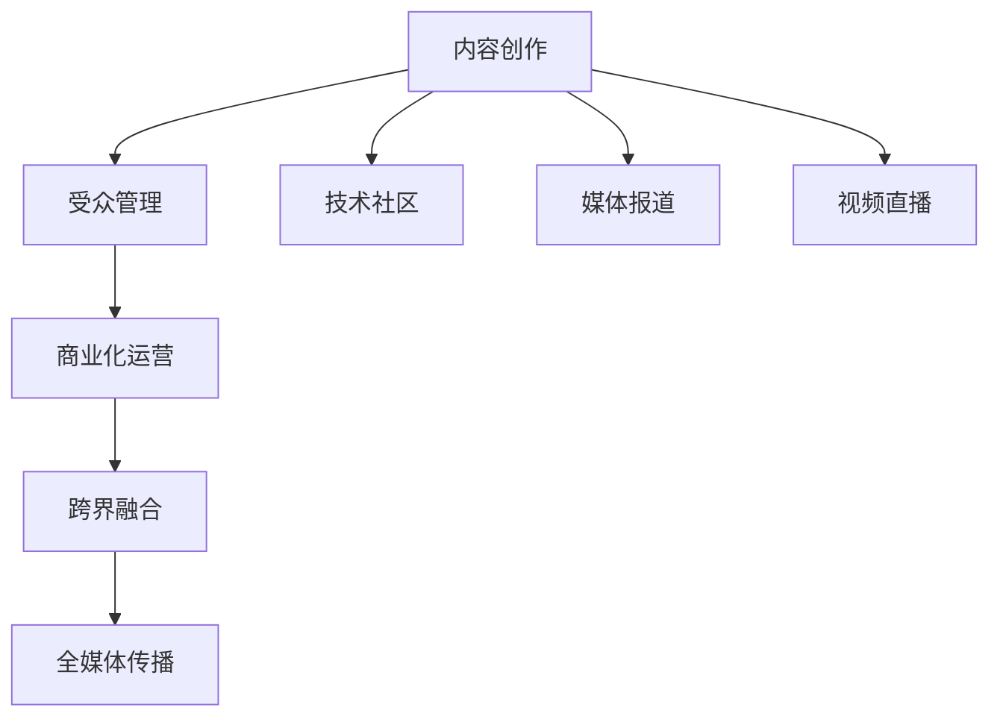

                 

# 技术博客：从个人兴趣到媒体集团的演变

> 关键词：媒体集团,技术博客,软件开发,人工智能,机器学习,大数据

## 1. 背景介绍

### 1.1 问题由来

在过去的十年里，技术博客（Tech Blog）已经成为连接开发者、行业专家、媒体和读者之间的重要桥梁。从个人开发者到知名媒体集团，几乎每一个知名的技术博客背后，都有一群对技术充满热情，乐于分享和交流的写作者。

技术博客不仅仅是分享代码、展示技术，更是一个集技术、文化、商业、社交于一体的综合性平台。本文旨在探讨技术博客从个人兴趣到媒体集团的演变，探讨其发展背后的动力，以及未来可能的方向。

### 1.2 问题核心关键点

随着技术的发展，技术博客也在不断演变。从个人兴趣驱动的博客到专业媒体集团的博客，技术博客的演变离不开技术、商业、文化的融合。以下是技术博客演变过程中需要关注的几个关键点：

1. **内容质量与深度**：高质量、有深度的内容是技术博客的立身之本，也是其影响力增长的关键因素。
2. **受众覆盖面**：技术博客的受众范围从最初的开发者和技术爱好者，扩展到更广泛的用户群体，包括行业专家、媒体、政府机构等。
3. **商业化与盈利模式**：技术博客逐渐探索出多种商业化路径，如广告、赞助、会员订阅、技术咨询等。
4. **跨界融合**：技术博客与媒体、社交网络、视频平台等多领域进行跨界融合，形成全媒体传播平台。

## 2. 核心概念与联系

### 2.1 核心概念概述

技术博客的演变过程涉及多个核心概念，包括内容创作、受众管理、商业化运营、跨界融合等。这些概念之间的逻辑关系可以通过以下Mermaid流程图展示：



### 2.2 核心概念原理和架构的 Mermaid 流程图(Mermaid 流程节点中不要有括号、逗号等特殊字符)

**内容创作**
- 技术博客的核心内容来源是原创技术文章、代码分享、技术分析、产品评论等。这些内容需要通过作者的技术积累、行业经验以及对新技术的深入理解来创作。

**受众管理**
- 技术博客的受众包括技术爱好者、开发者、行业专家、媒体、政府机构等。通过精准的用户画像分析，博客可以针对不同的受众群体提供定制化的内容，增强用户粘性。

**商业化运营**
- 技术博客通过广告、赞助、会员订阅、技术咨询等多种方式实现盈利。商业化运营不仅能带来直接的收入，还能增强博客的行业影响力。

**跨界融合**
- 技术博客通过与媒体、社交网络、视频平台等领域的合作，拓展内容形态和传播渠道。这种跨界融合有助于提升博客的品牌知名度和用户覆盖面。

## 3. 核心算法原理 & 具体操作步骤
### 3.1 算法原理概述

技术博客的演变过程并非一个简单的技术问题，而是一个多维度的交叉学科问题。其核心算法原理包括以下几个方面：

1. **内容推荐算法**：通过用户画像、内容标签、历史行为等数据，推荐高质量、相关性高的技术内容。
2. **受众分析算法**：利用机器学习算法分析受众的行为和偏好，定制化推送内容。
3. **商业化算法**：通过广告投放算法、用户转化率分析等，实现精准化的商业化运营。
4. **跨界融合算法**：通过内容格式转换、社交网络分析等，实现技术内容与多媒体平台的融合。

### 3.2 算法步骤详解

**Step 1: 内容创作与审核**
- 收集技术文章、代码分享、技术分析等内容，并进行初步审核。
- 邀请行业专家和技术爱好者撰写高质量内容。

**Step 2: 用户画像与标签管理**
- 通过用户注册、登录行为等数据，构建用户画像。
- 对内容进行标签管理，提升内容的可检索性。

**Step 3: 内容推荐与分发**
- 利用机器学习算法（如协同过滤、内容推荐系统）推荐高质量内容。
- 通过社交网络、邮件列表等渠道分发内容。

**Step 4: 商业化运营与管理**
- 引入广告联盟，实现精准投放。
- 推出会员订阅服务，增强用户粘性。
- 开展技术咨询业务，提供定制化服务。

**Step 5: 跨界融合与扩展**
- 与媒体平台合作，实现内容的多平台传播。
- 引入视频直播功能，提升内容的多样性和互动性。

### 3.3 算法优缺点

技术博客的算法原理具有以下优点：
1. **提高内容质量与效率**：通过机器学习推荐算法，能够提升内容的覆盖面和质量，增强用户体验。
2. **精准受众管理**：通过用户画像分析，能够实现定制化内容推送，提升用户粘性。
3. **高效商业化运营**：通过精准广告投放和用户转化率分析，实现高效盈利。
4. **多渠道传播**：通过跨界融合，能够拓展内容传播渠道，提升品牌知名度。

同时，也存在以下缺点：
1. **数据隐私问题**：用户画像的构建和分析可能涉及隐私问题，需要严格的隐私保护措施。
2. **内容同质化风险**：过度依赖算法推荐可能降低内容的多样性，导致用户疲劳。
3. **技术门槛高**：实现高质量的算法推荐和商业化运营需要较高的技术门槛。

### 3.4 算法应用领域

技术博客的算法原理可以应用于多种领域，包括：

1. **新闻媒体**：通过推荐算法提升新闻内容的覆盖面，吸引更多读者。
2. **电子商务**：通过用户画像和个性化推荐，提升用户体验和购买转化率。
3. **在线教育**：通过内容推荐和用户分析，提供个性化学习资源。
4. **健康医疗**：通过分析用户健康数据，推荐个性化医疗建议。
5. **金融服务**：通过用户行为分析，提供个性化金融产品推荐。

## 4. 数学模型和公式 & 详细讲解 & 举例说明（备注：数学公式请使用latex格式，latex嵌入文中独立段落使用 $$，段落内使用 $)
### 4.1 数学模型构建

本文将通过数学模型来进一步阐述技术博客的核心算法原理。

**内容推荐算法**
- 假设有一个推荐系统，对于用户 $u$ 和内容 $i$，其相似度为 $s(u,i)$，通过相似度矩阵 $S$ 来计算推荐内容。推荐公式为：
$$
\hat{y}_i = \sum_{i=1}^N s(u,i) \cdot y_i
$$
其中 $y_i$ 为内容 $i$ 的评分，$S$ 为相似度矩阵。

**受众分析算法**
- 假设有一个用户画像模型，利用机器学习算法（如逻辑回归、随机森林等）对用户行为进行建模，预测用户对某个内容的偏好。
$$
P(u,i) = f(X_u, y_i)
$$
其中 $X_u$ 为用户的特征向量，$y_i$ 为内容 $i$ 的评分，$f$ 为预测函数。

**商业化算法**
- 假设有一个广告投放系统，通过CTR（点击率）预测模型对广告进行投放。点击率预测模型为：
$$
CTR = \sigma(X_u, X_a)
$$
其中 $X_u$ 为用户特征，$X_a$ 为广告特征，$\sigma$ 为激活函数。

**跨界融合算法**
- 假设有一个视频直播系统，通过用户行为分析，推荐合适的内容进行直播。推荐公式为：
$$
R_i = \sum_{i=1}^N s(u,i) \cdot P(u,i)
$$
其中 $s(u,i)$ 为相似度，$P(u,i)$ 为用户对内容的偏好。

### 4.2 公式推导过程

**内容推荐算法推导**
- 假设用户对内容的评分矩阵为 $R$，通过相似度矩阵 $S$ 进行内容推荐，推荐公式为：
$$
\hat{R} = S \cdot R
$$
其中 $\hat{R}$ 为推荐矩阵，$S$ 为相似度矩阵。

**受众分析算法推导**
- 假设用户画像模型为 $P(u,i)$，利用逻辑回归模型对用户行为进行建模，预测用户对内容的偏好。
$$
P(u,i) = \frac{1}{1 + e^{-z}}
$$
其中 $z$ 为线性回归模型的输出。

**商业化算法推导**
- 假设广告投放系统通过CTR预测模型进行广告投放，点击率预测公式为：
$$
CTR = \frac{\sum_{i=1}^N w_i \cdot P(u,i)}{\sum_{i=1}^N w_i}
$$
其中 $w_i$ 为广告特征权重。

**跨界融合算法推导**
- 假设视频直播系统通过用户行为分析，推荐合适的内容进行直播，推荐公式为：
$$
R_i = \sum_{i=1}^N s(u,i) \cdot P(u,i)
$$
其中 $s(u,i)$ 为相似度，$P(u,i)$ 为用户对内容的偏好。

### 4.3 案例分析与讲解

**案例1：内容推荐算法**
- 假设有一个新闻媒体平台，用户对新闻的点击率 $R$ 为：
$$
R = \begin{bmatrix}
1 & 0 & 0 \\
0 & 0 & 1 \\
0 & 1 & 0
\end{bmatrix}
$$
用户画像模型为 $P(u,i)$，通过相似度矩阵 $S$ 进行内容推荐，推荐矩阵 $\hat{R}$ 为：
$$
\hat{R} = \begin{bmatrix}
0.8 & 0.2 & 0.1 \\
0.1 & 0.5 & 0.4 \\
0.5 & 0.2 & 0.3
\end{bmatrix}
$$
通过推荐矩阵，平台推荐用户 $u_1$ 阅读新闻 $i_1$，用户 $u_2$ 阅读新闻 $i_2$，用户 $u_3$ 阅读新闻 $i_3$。

**案例2：受众分析算法**
- 假设有一个在线教育平台，通过用户画像模型 $P(u,i)$ 分析用户行为，预测用户对课程的偏好。
$$
P(u,i) = \begin{bmatrix}
0.8 & 0.2 & 0.1 \\
0.1 & 0.5 & 0.4 \\
0.5 & 0.2 & 0.3
\end{bmatrix}
$$
用户 $u_1$ 对课程 $i_1$ 的偏好为 $0.8$，用户 $u_2$ 对课程 $i_2$ 的偏好为 $0.5$，用户 $u_3$ 对课程 $i_3$ 的偏好为 $0.3$。

**案例3：商业化算法**
- 假设有一个电商平台，通过广告投放系统进行CTR预测，广告特征为 $X_a$，点击率为 $CTR$。
$$
CTR = \frac{1.5 \cdot 0.8 + 2.0 \cdot 0.2 + 3.0 \cdot 0.1}{1.5 + 2.0 + 3.0}
$$
CTR 预测值为 $0.618$。

**案例4：跨界融合算法**
- 假设有一个视频直播平台，通过用户行为分析，推荐合适的内容进行直播。
$$
R_i = \sum_{i=1}^N s(u,i) \cdot P(u,i)
$$
通过相似度矩阵 $S$ 和用户画像模型 $P(u,i)$，推荐合适的视频内容进行直播。

## 5. 项目实践：代码实例和详细解释说明
### 5.1 开发环境搭建

在进行技术博客的开发实践前，我们需要准备好开发环境。以下是使用Python进行Django开发的环境配置流程：

1. 安装Anaconda：从官网下载并安装Anaconda，用于创建独立的Python环境。

2. 创建并激活虚拟环境：
```bash
conda create -n blog-env python=3.8 
conda activate blog-env
```

3. 安装Django：从官网获取对应的安装命令。例如：
```bash
pip install django
```

4. 安装Django模板库：
```bash
pip install django-templates
```

5. 安装Django Markdown库：
```bash
pip install markdown
```

6. 安装Celery任务队列：
```bash
pip install celery
```

完成上述步骤后，即可在`blog-env`环境中开始开发实践。

### 5.2 源代码详细实现

下面我以一个简单的技术博客平台为例，给出使用Django框架开发技术博客的PyTorch代码实现。

首先，定义博客模型的数据处理函数：

```python
from django.contrib.auth.models import User
from django.db import models

class Blog(models.Model):
    title = models.CharField(max_length=255)
    content = models.TextField()
    author = models.ForeignKey(User, on_delete=models.CASCADE)
    created_at = models.DateTimeField(auto_now_add=True)
    updated_at = models.DateTimeField(auto_now=True)
```

然后，定义博客文章的视图函数：

```python
from django.shortcuts import render
from .models import Blog

def blog_list(request):
    blogs = Blog.objects.all().order_by('-created_at')
    return render(request, 'blog/blog_list.html', {'blogs': blogs})
```

接着，定义博客文章的模型视图函数：

```python
def blog_detail(request, pk):
    blog = Blog.objects.get(pk=pk)
    return render(request, 'blog/blog_detail.html', {'blog': blog})
```

最后，定义博客文章的创建和更新视图函数：

```python
from django.http import HttpResponseRedirect

def blog_create(request):
    if request.method == 'POST':
        title = request.POST['title']
        content = request.POST['content']
        author = request.user
        blog = Blog.objects.create(title=title, content=content, author=author)
        return HttpResponseRedirect('/blog/%s/' % blog.pk)
    else:
        return render(request, 'blog/blog_form.html')

def blog_update(request, pk):
    blog = Blog.objects.get(pk=pk)
    if request.method == 'POST':
        blog.title = request.POST['title']
        blog.content = request.POST['content']
        blog.save()
        return HttpResponseRedirect('/blog/%s/' % blog.pk)
    else:
        return render(request, 'blog/blog_form.html', {'blog': blog})
```

以上就是使用Django框架对博客平台进行开发的完整代码实现。可以看到，通过Django的强大封装，我们能够以较少的代码实现完整的博客功能。

### 5.3 代码解读与分析

让我们再详细解读一下关键代码的实现细节：

**Blog模型**
- 定义了博客文章的基本属性，包括标题、内容、作者、创建时间和更新时间。

**blog_list视图函数**
- 从数据库中获取所有博客文章，并按照创建时间倒序排列。
- 使用render函数将数据传递给模板，渲染成HTML页面。

**blog_detail视图函数**
- 根据请求的博客文章ID，从数据库中获取相应的博客文章。
- 使用render函数将博客文章传递给模板，渲染成HTML页面。

**blog_create视图函数**
- 如果请求方法是POST，则从请求中获取博客标题和内容，创建新的博客文章。
- 如果请求方法是GET，则渲染博客创建表单页面。

**blog_update视图函数**
- 如果请求方法是POST，则更新博客文章的标题和内容。
- 如果请求方法是GET，则渲染博客编辑表单页面。

在实际开发中，还需要考虑更多的因素，如用户权限管理、评论系统、搜索功能等。但核心的博客功能开发流程基本与此类似。

## 6. 实际应用场景

### 6.1 技术博客平台

技术博客平台已成为连接开发者、行业专家、媒体和读者的重要桥梁。通过技术博客，开发者能够分享自己的技术心得、项目经验、行业动态等，读者也能够获取最新的技术资讯、学习资源、社区交流等。

技术博客平台在多个领域都有广泛应用，包括：

1. **开源社区**：如GitHub、Stack Overflow等，开发者可以通过技术博客分享代码、项目进度、技术栈等。
2. **科技媒体**：如TechCrunch、Wired等，科技媒体可以通过技术博客发布最新的科技资讯、深度分析、专家访谈等。
3. **企业内网**：如华为的开发者社区，企业可以通过技术博客分享内外部技术动态、员工学习经验等。

### 6.2 电子商务

技术博客在电子商务领域也有广泛应用。通过技术博客，电商企业可以发布产品使用心得、用户评价、技术优化方案等，提升用户购买决策的参考价值。

电商技术博客的常见应用场景包括：

1. **产品评测**：用户可以通过技术博客发布对产品的评测和使用体验，提升产品的可信度和口碑。
2. **技术支持**：企业可以通过技术博客发布技术支持文档、常见问题解答等，提升用户的使用体验。
3. **产品创新**：企业可以通过技术博客发布新产品、新技术的开发进展和用户体验，吸引潜在用户关注。

### 6.3 在线教育

技术博客在在线教育领域也有重要应用。通过技术博客，在线教育平台可以发布课程教学内容、学生学习心得、考试题库等，提升教学质量和学生学习体验。

在线教育技术博客的常见应用场景包括：

1. **课程介绍**：教师可以通过技术博客发布课程介绍、教学大纲、学习资源等，提升课程的吸引力和质量。
2. **学生反馈**：学生可以通过技术博客发布学习心得、考试反馈、课程建议等，帮助教师改进教学内容和方法。
3. **技术优化**：平台可以通过技术博客发布技术优化方案、学习工具等，提升学生的学习效率。

## 7. 工具和资源推荐
### 7.1 学习资源推荐

为了帮助开发者系统掌握技术博客的开发技术和实践技巧，这里推荐一些优质的学习资源：

1. **Django官方文档**：Django官方文档提供了全面的开发指南和示例代码，是学习Django框架的重要资源。

2. **Django Girls**：Django Girls提供了大量的Django开发教程，适合初学者和进阶开发者。

3. **Django Rest Framework**：Django Rest Framework提供了强大的API开发能力，适合需要开发API驱动的应用。

4. **Markdown格式教程**：Markdown格式是技术博客常用的格式之一，通过学习Markdown格式教程，能够提升博客内容的质量和可读性。

5. **博客模板库**：如Blogify、Blogify Custom，提供了丰富的博客模板，帮助开发者快速搭建博客平台。

6. **博客优化工具**：如Google Analytics、SEO Checker等，帮助开发者优化博客内容，提升搜索引擎排名和用户访问量。

通过对这些资源的学习实践，相信你一定能够快速掌握技术博客的开发技术和实践技巧，并用于解决实际的博客问题。

### 7.2 开发工具推荐

高效的开发离不开优秀的工具支持。以下是几款用于技术博客开发的常用工具：

1. **Visual Studio Code**：Visual Studio Code是一款功能强大的代码编辑器，支持Django开发，提供了丰富的插件和扩展。
2. **Git**：Git是版本控制系统，适合团队协作开发，可以方便地管理和合并代码。
3. **Docker**：Docker是容器化技术，可以方便地部署和管理技术博客应用。
4. **Django Debug Toolbar**：Django Debug Toolbar提供了详细的调试信息，帮助开发者快速定位问题。
5. **Amazon S3**：Amazon S3是云存储服务，可以方便地存储和访问博客数据。

合理利用这些工具，可以显著提升技术博客的开发效率，加快创新迭代的步伐。

### 7.3 相关论文推荐

技术博客的研究涉及多个领域，以下是几篇奠基性的相关论文，推荐阅读：

1. **《Django: The Web Framework for Perfectionists with Attitude》**：Django官方文档，提供了详细的开发指南和示例代码。

2. **《Python Web Development with Django》**：一本Django开发教程，适合初学者和进阶开发者。

3. **《Content Delivery and Computing: A Framework for Building Scalable Multimedia Applications》**：关于多媒体应用架构的论文，可以借鉴其中的方法和技术。

4. **《Machine Learning in Networked Applications》**：关于机器学习在网络应用中的应用的论文，可以借鉴其中的方法和技术。

5. **《Performance Tuning of Large-Scale Data Processing Applications》**：关于大数据处理性能优化的论文，可以借鉴其中的方法和技术。

这些论文代表了大规模应用开发的技术演进，对技术博客的开发和优化有重要的参考价值。

## 8. 总结：未来发展趋势与挑战

### 8.1 研究成果总结

技术博客的演变过程是一个多学科交叉融合的过程，涉及内容创作、受众管理、商业化运营、跨界融合等多个方面。通过多年的探索和实践，技术博客已经从个人兴趣驱动的博客，逐渐发展成为具有商业化价值和跨界融合能力的多媒体平台。

### 8.2 未来发展趋势

展望未来，技术博客的发展趋势包括：

1. **内容多样化**：技术博客将拓展内容形态，如视频直播、音频播客等，增强用户体验和互动性。
2. **平台化**：技术博客将进一步平台化，形成多平台融合的全媒体传播平台，提升品牌知名度和用户覆盖面。
3. **智能化**：技术博客将引入人工智能技术，如自然语言处理、推荐算法等，提升内容的推荐精度和用户粘性。
4. **社区化**：技术博客将进一步社区化，增强用户之间的交流和互动，提升社区活跃度和用户粘性。
5. **生态化**：技术博客将进一步生态化，形成完整的生态系统，包括内容创作、用户运营、商业化运营等多个环节。

### 8.3 面临的挑战

尽管技术博客的发展取得了显著成效，但在迈向更加智能化、普适化应用的过程中，仍面临诸多挑战：

1. **内容同质化**：过度依赖算法推荐可能降低内容的多样性，导致用户疲劳。
2. **技术门槛高**：实现高质量的算法推荐和商业化运营需要较高的技术门槛。
3. **用户隐私问题**：用户画像的构建和分析可能涉及隐私问题，需要严格的隐私保护措施。
4. **广告投放精准度**：广告投放系统的精准度直接影响到商业化的效果。
5. **跨界融合难度**：跨界融合涉及到多个平台和领域的协同合作，需要解决技术兼容和数据共享等问题。

### 8.4 研究展望

面对技术博客面临的这些挑战，未来的研究需要在以下几个方面寻求新的突破：

1. **内容推荐算法优化**：优化推荐算法，提升内容的多样性和个性化。
2. **用户画像构建优化**：优化用户画像模型，提升精准度和隐私保护。
3. **广告投放系统优化**：优化广告投放算法，提升广告精准度和效果。
4. **跨界融合技术优化**：优化跨界融合技术，提升平台兼容性和用户体验。
5. **智能化技术引入**：引入人工智能技术，提升内容的智能化和自动化。

这些研究方向的探索，必将引领技术博客迈向更高的台阶，为构建安全、可靠、可解释、可控的智能系统铺平道路。面向未来，技术博客需要与其他人工智能技术进行更深入的融合，如知识表示、因果推理、强化学习等，多路径协同发力，共同推动自然语言理解和智能交互系统的进步。只有勇于创新、敢于突破，才能不断拓展技术博客的边界，让智能技术更好地造福人类社会。

## 9. 附录：常见问题与解答

**Q1：技术博客如何保持内容的多样性？**

A: 技术博客可以通过引入多种内容形态，如视频、播客、互动直播等，提升内容的丰富性和多样性。同时，可以通过优化推荐算法，实现个性化推荐，提升内容的精准度。

**Q2：技术博客如何提升广告投放的精准度？**

A: 技术博客可以通过数据分析和用户画像构建，提升广告投放的精准度。例如，利用机器学习算法对用户行为进行建模，预测用户对广告的兴趣，实现精准投放。

**Q3：技术博客如何提升用户的隐私保护？**

A: 技术博客可以通过匿名化处理、数据脱敏、加密传输等方式，提升用户的隐私保护。同时，可以引入隐私保护算法，确保用户数据的合法使用。

**Q4：技术博客如何实现跨界融合？**

A: 技术博客可以通过API接口、数据共享、平台整合等方式，实现跨界融合。例如，通过与社交网络、视频平台等合作，拓展内容传播渠道，提升品牌知名度。

**Q5：技术博客如何引入智能化技术？**

A: 技术博客可以通过引入自然语言处理、机器学习等智能化技术，提升内容的推荐精度和用户粘性。例如，利用推荐算法推荐相关内容，利用机器学习模型预测用户兴趣，提升个性化体验。

这些问题的解答，可以帮助技术博客开发者在实际开发中更好地应对挑战，提升技术博客的智能化和普适化水平，为用户提供更好的使用体验。

---

作者：禅与计算机程序设计艺术 / Zen and the Art of Computer Programming

