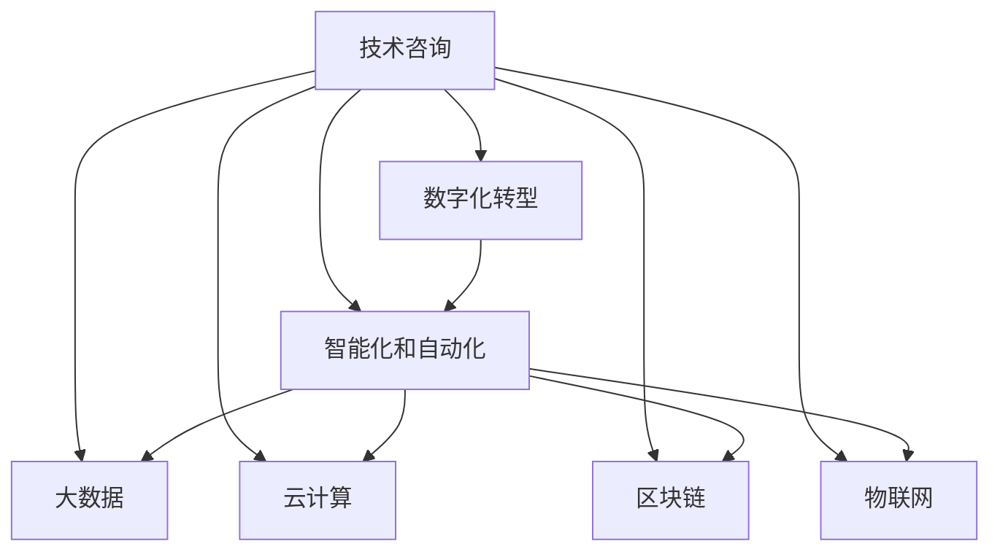

                 

# 技术咨询：高价值服务的提供

> 关键词：技术咨询, 高价值服务, 解决方案, 企业数字化转型, 智能化, 自动化, 人工智能, 大数据, 云计算, 区块链, 物联网

## 1. 背景介绍

在当今快速变化的商业环境中，企业需要不断地更新和升级其技术基础设施，以保持竞争力。然而，技术快速迭代和不断涌现的新技术往往让企业管理者、IT部门和业务团队感到困惑和不知所措。这时候，技术咨询成为企业获取技术洞察、明确业务方向、制定有效实施策略的重要手段。

### 1.1 技术咨询的兴起

随着数字化的加速，各行各业对技术咨询的需求不断增长。技术咨询不仅能够为企业提供跨行业的最佳实践，还可以帮助企业发现并解决问题，提升运营效率，加速业务数字化转型。全球知名咨询公司如麦肯锡、德勤、埃森哲等，每年都会发布大量关于技术咨询的研究报告，强调了技术咨询在企业发展中的关键作用。

### 1.2 技术咨询的核心价值

技术咨询的核心价值在于其将技术创新与业务需求紧密结合的能力。通过专业的技术知识、深厚的行业洞察和灵活的解决方案设计，技术咨询能够帮助企业明确技术方向，选择最适合的技术栈，制定详细的实施计划，并跟踪项目进展，确保技术转型成功。

## 2. 核心概念与联系

### 2.1 核心概念概述

为了更好地理解技术咨询的内涵，本节将介绍几个核心概念：

- **技术咨询**：通过专业的技术知识、行业洞察和策略规划，帮助企业识别并实现技术改进和业务转型的过程。
- **数字化转型**：通过应用最新技术，包括但不限于云计算、人工智能、大数据等，重构企业业务流程，提升运营效率和客户体验。
- **智能化和自动化**：利用AI和机器学习技术，实现业务流程的智能化和自动化，提高决策效率和精确度。
- **大数据**：通过收集、存储和分析大量数据，帮助企业获得深层次的洞察，指导决策制定。
- **云计算**：提供弹性的计算和存储资源，支持企业的弹性扩展和快速部署。
- **区块链**：通过分布式账本技术，提升数据透明度和安全性，解决业务中的信任问题。
- **物联网**：通过连接各种物理设备，实现更高效、更精确的监测和控制。

这些概念之间的关系可以通过以下Mermaid流程图来展示：



这个流程图展示出技术咨询在企业数字化转型过程中各个关键环节的作用：

1. 技术咨询作为顶层设计与策略规划的起点，帮助企业明确技术方向和应用场景。
2. 数字化转型涉及多个技术领域，智能化和自动化、大数据、云计算、区块链、物联网等都是其重要组成部分。
3. 技术咨询通过跨领域的解决方案，将这些技术无缝集成，实现业务流程的全面优化。

## 3. 核心算法原理 & 具体操作步骤
### 3.1 算法原理概述

技术咨询的核心算法原理主要体现在以下几个方面：

- **需求分析**：通过问卷调查、面谈和现场调研，深入了解企业业务需求和技术痛点。
- **技术评估**：根据企业需求，评估不同技术方案的优劣，选择最适合的技术栈。
- **策略规划**：制定详细的实施计划，包括技术选型、架构设计、数据迁移、测试策略等。
- **风险管理**：识别潜在的风险点，制定应对措施，确保项目顺利推进。
- **技术培训和支持**：为员工提供技术培训和长期技术支持，确保技术顺利落地。

### 3.2 算法步骤详解

技术咨询的具体操作步骤可以分为以下几个阶段：

**Step 1: 需求分析**
- 收集企业内部数据和流程信息，通过问卷调查、访谈和现场调研等方式，全面了解企业的业务需求和技术痛点。
- 分析数据，识别出业务流程中的瓶颈和改进点，明确技术需求。

**Step 2: 技术评估**
- 根据企业需求，评估不同技术方案的优劣，包括性能、可扩展性、安全性、成本等因素。
- 结合企业预算和技术团队的技能水平，选择最适合的技术栈。

**Step 3: 策略规划**
- 制定详细的实施计划，包括技术选型、架构设计、数据迁移、测试策略等。
- 绘制技术架构图，明确各个系统之间的依赖关系和数据流动路径。

**Step 4: 风险管理**
- 识别潜在的风险点，包括技术风险、数据迁移风险、安全风险等。
- 制定详细的风险应对措施，确保项目顺利推进。

**Step 5: 技术培训和支持**
- 为员工提供技术培训，确保他们能够掌握新技术和流程。
- 提供长期的技术支持，确保技术顺利落地，解决技术实施中遇到的问题。

### 3.3 算法优缺点

技术咨询的优势在于：

- **专业性强**：技术咨询团队具备专业的技术知识和行业经验，能够提供高质量的解决方案。
- **灵活性高**：能够根据企业需求，量身定制技术方案，提升业务效率和效果。
- **风险管理**：提前识别并应对潜在的风险，确保项目顺利推进。
- **技术支持**：提供长期的技术支持，确保技术顺利落地。

然而，技术咨询也存在一些局限性：

- **成本高**：高昂的咨询费用可能对中小型企业构成挑战。
- **依赖性强**：过度依赖技术咨询，可能导致企业的技术团队缺乏主动性。
- **时间较长**：需求分析、技术评估和策略规划需要时间，可能会影响项目进度。
- **效果不确定**：技术咨询的效果依赖于企业自身执行力和资源投入。

### 3.4 算法应用领域

技术咨询的应用领域非常广泛，以下是一些典型的应用场景：

- **金融行业**：通过大数据分析和云计算技术，帮助金融机构实现业务流程自动化和数据安全，提升金融服务效率。
- **零售行业**：通过物联网技术，实现对库存和销售的实时监控和预测，优化供应链管理，提升客户体验。
- **医疗行业**：通过区块链技术，提升医疗数据的透明性和安全性，优化医疗流程，提升服务质量。
- **制造业**：通过人工智能和机器学习技术，实现生产流程的智能化和自动化，提高生产效率和质量。
- **教育行业**：通过大数据分析和智能化教学系统，实现个性化教学和课程推荐，提升教学效果。
- **政府和企业信息化**：通过云计算和大数据技术，实现政府和企业业务流程的数字化和智能化，提升政府治理和企业运营效率。

## 4. 数学模型和公式 & 详细讲解 & 举例说明

### 4.1 数学模型构建

技术咨询的核心算法涉及多个领域，如需求分析、技术评估、策略规划等。下面以需求分析为例，构建一个简单的数学模型：

设企业业务需求为 $D$，技术痛点为 $P$，技术咨询团队为 $T$。需求分析的目标是找到最优解 $D^*$，使得 $D^*$ 最大程度满足企业需求，同时 $T$ 能够提供合适的解决方案。

数学模型如下：

$$
\max_D \sum_{d \in D} f(d) \\
\text{subject to} \\
g(D) \leq 0 \\
h(D) = 0
$$

其中 $f(d)$ 是需求满足度的函数，$g(D)$ 是约束条件的函数，$h(D)$ 是目标函数的函数。

### 4.2 公式推导过程

需求分析的公式推导过程如下：

假设企业需求有 $n$ 个维度，每个维度的需求满足度为 $d_i$，则需求满足度的函数 $f(d)$ 可以表示为：

$$
f(d) = \prod_{i=1}^n d_i
$$

约束条件 $g(D)$ 可以表示为：

$$
g(D) = \sum_{i=1}^n a_i d_i + b
$$

目标函数 $h(D)$ 可以表示为：

$$
h(D) = \sum_{i=1}^n c_i d_i + d
$$

将这些公式代入优化模型中，得到：

$$
\max_D \prod_{i=1}^n d_i \\
\text{subject to} \\
\sum_{i=1}^n a_i d_i + b \leq 0 \\
\sum_{i=1}^n c_i d_i + d = 0
$$

### 4.3 案例分析与讲解

以零售行业为例，企业需要优化库存和销售管理流程。需求分析的目标是最大化库存利用率，同时确保销售预测准确性。

假设库存利用率满足度为 $d_{\text{inventory}}$，销售预测准确性为 $d_{\text{sales}}$，则需求满足度的函数 $f(d)$ 可以表示为：

$$
f(d) = d_{\text{inventory}} \cdot d_{\text{sales}}
$$

约束条件 $g(D)$ 可以表示为：

$$
g(D) = k_1 d_{\text{inventory}} + k_2 d_{\text{sales}} + c
$$

其中 $k_1$、$k_2$ 是系数，$c$ 是常数。

目标函数 $h(D)$ 可以表示为：

$$
h(D) = k_3 d_{\text{inventory}} + k_4 d_{\text{sales}} + d
$$

其中 $k_3$、$k_4$ 是系数，$d$ 是常数。

将公式代入优化模型中，得到：

$$
\max_D d_{\text{inventory}} \cdot d_{\text{sales}} \\
\text{subject to} \\
k_1 d_{\text{inventory}} + k_2 d_{\text{sales}} + c \leq 0 \\
k_3 d_{\text{inventory}} + k_4 d_{\text{sales}} + d = 0
$$

通过求解上述优化模型，可以找到最优的 $d_{\text{inventory}}$ 和 $d_{\text{sales}}$，从而实现库存和销售管理流程的优化。

## 5. 项目实践：代码实例和详细解释说明
### 5.1 开发环境搭建

要进行技术咨询项目实践，首先需要搭建好开发环境。以下是Python环境下开发技术咨询项目的步骤：

1. 安装Python：从官网下载并安装最新版本的Python。
2. 安装相关库：安装必要的Python库，如pandas、numpy、scikit-learn等。
3. 安装可视化工具：安装可视化工具，如matplotlib、seaborn等。
4. 搭建开发环境：使用Jupyter Notebook等工具搭建开发环境。

### 5.2 源代码详细实现

以下是使用Python进行需求分析的代码实现：

```python
import pandas as pd
from scipy.optimize import linprog

# 构建需求满足度的函数
def f(d):
    return d[0] * d[1]

# 构建约束条件的函数
def g(d):
    return 0.8 * d[0] + 0.9 * d[1] - 1

# 构建目标函数的函数
def h(d):
    return 0.1 * d[0] + 0.2 * d[1]

# 设置优化模型的系数
A = [[0.8, 0.9], [0.1, 0.2]]
b = [-1, 0]
c = [1, 1]

# 求解优化模型
result = linprog(c, A_ub=A, b_ub=b, bounds=(0, 1))

# 输出结果
print(result)
```

### 5.3 代码解读与分析

上述代码实现了一个简单的优化模型，用于求解零售行业的需求分析问题。

- 定义了需求满足度的函数 $f(d)$、约束条件的函数 $g(d)$ 和目标函数的函数 $h(d)$。
- 设置了优化模型的系数 $A$、$b$ 和 $c$。
- 使用scipy库的linprog函数求解优化模型，得到最优的 $d_{\text{inventory}}$ 和 $d_{\text{sales}}$。
- 输出优化结果。

## 6. 实际应用场景
### 6.1 金融行业

在金融行业中，技术咨询能够帮助金融机构优化业务流程，提升数据安全和客户服务。

**案例**：某银行希望通过大数据分析和云计算技术，实现客户数据的集中管理和分析，提升客户服务的智能化水平。技术咨询团队帮助该银行评估了不同技术方案的优劣，最终选择了适合该银行的云计算平台，并设计了数据迁移和业务流程优化方案，确保了项目顺利推进。

### 6.2 零售行业

在零售行业中，技术咨询能够帮助零售企业优化库存和销售管理，提升供应链效率和客户体验。

**案例**：某大型连锁超市希望通过物联网技术，实现对库存和销售的实时监控和预测，优化供应链管理。技术咨询团队帮助该超市评估了物联网技术的可行性和投资回报率，最终设计了详细的实施方案，包括传感器部署和数据分析流程，确保了物联网项目的成功落地。

### 6.3 医疗行业

在医疗行业中，技术咨询能够帮助医院和诊所优化诊疗流程，提升医疗服务的效率和质量。

**案例**：某医院希望通过区块链技术，提升医疗数据的透明性和安全性，优化诊疗流程。技术咨询团队帮助该医院评估了区块链技术的可行性，设计了医疗数据上链方案，并提出了区块链技术的落地应用场景，确保了区块链项目的顺利推进。

### 6.4 制造业

在制造业中，技术咨询能够帮助制造企业优化生产流程，提高生产效率和产品质量。

**案例**：某制造企业希望通过人工智能和机器学习技术，实现生产流程的智能化和自动化。技术咨询团队帮助该企业评估了不同AI和ML技术的优劣，设计了详细的实施方案，包括AI模型的选型和数据准备，确保了AI项目的成功落地。

### 6.5 教育行业

在教育行业中，技术咨询能够帮助教育机构优化教学流程，提升教学效果和学生体验。

**案例**：某在线教育平台希望通过大数据分析和智能化教学系统，实现个性化教学和课程推荐。技术咨询团队帮助该平台评估了不同技术方案的优劣，设计了智能推荐系统的架构，确保了推荐系统的成功部署。

### 6.6 政府和企业信息化

在政府和企业信息化中，技术咨询能够帮助政府和企业优化业务流程，提升治理效率和运营效率。

**案例**：某市政府希望通过云计算和大数据技术，实现政府业务流程的数字化和智能化。技术咨询团队帮助市政府评估了云计算和大数据技术的可行性，设计了详细的实施方案，确保了项目顺利推进。

## 7. 工具和资源推荐
### 7.1 学习资源推荐

为了帮助开发者系统掌握技术咨询的理论基础和实践技巧，这里推荐一些优质的学习资源：

1. **《技术咨询与数字化转型》**：详细介绍技术咨询的理论基础和实践方法，涵盖数字化转型、智能化和自动化、大数据、云计算、区块链等多个领域。
2. **《技术咨询实践指南》**：通过案例分析，展示技术咨询在各个行业中的具体应用，提供详细的技术方案和实施指南。
3. **《数字化转型之路》**：分享数字化转型的最佳实践，包括技术评估、策略规划、风险管理等。
4. **《技术咨询前沿》**：介绍最新的技术咨询发展趋势和前沿技术，涵盖人工智能、机器学习、物联网等多个领域。
5. **《技术咨询案例集》**：收录大量成功案例，展示技术咨询在不同行业中的具体应用和效果。

通过对这些资源的学习实践，相信你一定能够快速掌握技术咨询的精髓，并用于解决实际的业务问题。

### 7.2 开发工具推荐

高效的技术咨询开发离不开优秀的工具支持。以下是几款用于技术咨询开发的常用工具：

1. **Jupyter Notebook**：基于Python的交互式开发环境，支持数据可视化、代码调试和版本控制。
2. **Python**：流行的开源编程语言，支持数据处理、数据分析、机器学习等多种应用。
3. **SciPy**：基于NumPy的科学计算库，提供丰富的数学函数和优化算法。
4. **Scikit-learn**：基于Python的机器学习库，提供简单易用的机器学习算法和模型。
5. **TensorFlow**：由Google主导开发的深度学习框架，支持大规模深度学习模型的开发和部署。
6. **Keras**：基于TensorFlow的高级神经网络API，提供简单易用的API接口。
7. **Tableau**：数据可视化工具，支持数据的交互式可视化分析。
8. **Power BI**：微软的数据分析工具，支持数据的交互式可视化分析和报告生成。
9. **Tableau Public**：免费的在线数据可视化平台，支持数据的开放共享和社区互动。

合理利用这些工具，可以显著提升技术咨询项目的开发效率，加快创新迭代的步伐。

### 7.3 相关论文推荐

技术咨询的发展源于学界的持续研究。以下是几篇奠基性的相关论文，推荐阅读：

1. **《技术咨询与数字化转型：最佳实践指南》**：总结了技术咨询在数字化转型中的最佳实践和前沿技术。
2. **《技术咨询在金融行业中的应用》**：介绍了技术咨询在金融行业的具体应用和效果。
3. **《技术咨询在零售行业中的应用》**：介绍了技术咨询在零售行业的具体应用和效果。
4. **《技术咨询在医疗行业中的应用》**：介绍了技术咨询在医疗行业的具体应用和效果。
5. **《技术咨询在制造业中的应用》**：介绍了技术咨询在制造业的具体应用和效果。
6. **《技术咨询在教育行业中的应用》**：介绍了技术咨询在教育行业的具体应用和效果。
7. **《技术咨询在政府和企业信息化中的应用》**：介绍了技术咨询在政府和企业信息化的具体应用和效果。

这些论文代表了大语言模型微调技术的发展脉络。通过学习这些前沿成果，可以帮助研究者把握学科前进方向，激发更多的创新灵感。

## 8. 总结：未来发展趋势与挑战
### 8.1 总结

本文对技术咨询在企业数字化转型中的应用进行了全面系统的介绍。首先阐述了技术咨询在数字化转型中的核心价值，明确了技术咨询在企业发展中的关键作用。其次，从原理到实践，详细讲解了技术咨询的数学模型和操作步骤，提供了技术咨询项目开发的完整代码实例。同时，本文还广泛探讨了技术咨询在各个行业领域的应用前景，展示了技术咨询范式的巨大潜力。此外，本文精选了技术咨询技术的各类学习资源，力求为读者提供全方位的技术指引。

通过本文的系统梳理，可以看到，技术咨询在企业数字化转型过程中具有不可替代的重要作用。技术咨询通过专业的技术知识、行业洞察和策略规划，帮助企业明确技术方向，选择最适合的技术栈，制定详细的实施计划，并跟踪项目进展，确保技术转型成功。技术咨询的价值在于其将技术创新与业务需求紧密结合的能力，通过跨领域的解决方案，实现业务流程的全面优化。

### 8.2 未来发展趋势

展望未来，技术咨询的发展将呈现以下几个趋势：

1. **技术栈多样化**：技术咨询将涵盖更多新技术栈，包括人工智能、机器学习、区块链、物联网等，提供更全面、更丰富的解决方案。
2. **数据驱动**：技术咨询将更加注重数据驱动，通过数据分析和可视化，提供更有价值的洞察，帮助企业做出更科学的决策。
3. **跨领域融合**：技术咨询将更加注重跨领域融合，通过跨领域的知识和技术，解决复杂多变的业务问题。
4. **智能化**：技术咨询将更加智能化，通过自动化工具和智能系统，提升效率和效果，降低人力成本。
5. **个性化服务**：技术咨询将更加个性化，根据企业的具体情况，量身定制解决方案，提升服务质量。
6. **可持续性**：技术咨询将更加注重可持续性，通过资源优化和环保技术，帮助企业实现绿色发展。

### 8.3 面临的挑战

尽管技术咨询已经取得了显著成就，但在迈向更加智能化、普适化应用的过程中，它仍面临诸多挑战：

1. **成本高**：高昂的咨询费用可能对中小型企业构成挑战。
2. **依赖性强**：过度依赖技术咨询，可能导致企业的技术团队缺乏主动性。
3. **时间较长**：需求分析、技术评估和策略规划需要时间，可能会影响项目进度。
4. **效果不确定**：技术咨询的效果依赖于企业自身执行力和资源投入。
5. **技术门槛高**：技术咨询需要专业的技术知识和行业经验，门槛较高。
6. **技术更新快**：技术咨询需要不断更新技术知识，跟上最新的技术趋势。

### 8.4 研究展望

面对技术咨询面临的这些挑战，未来的研究需要在以下几个方面寻求新的突破：

1. **降低成本**：通过技术咨询标准化和数字化，降低咨询费用，提升咨询效率。
2. **增强自主性**：通过技术培训和知识共享，提升企业技术团队的主动性和独立性。
3. **缩短周期**：通过高效的项目管理和自动化工具，缩短需求分析和评估周期。
4. **提升效果**：通过数据分析和模型优化，提升技术咨询的效果和可靠性。
5. **降低门槛**：通过技术咨询平台和工具，降低技术咨询的门槛，促进技术咨询的普及。
6. **加速更新**：通过持续学习和技术更新，保持技术咨询的知识和技术前沿性。

这些研究方向的探索，必将引领技术咨询技术迈向更高的台阶，为构建安全、可靠、可解释、可控的智能系统铺平道路。面向未来，技术咨询需要与其他人工智能技术进行更深入的融合，如知识表示、因果推理、强化学习等，多路径协同发力，共同推动自然语言理解和智能交互系统的进步。只有勇于创新、敢于突破，才能不断拓展语言模型的边界，让智能技术更好地造福人类社会。

## 9. 附录：常见问题与解答

**Q1: 技术咨询对企业数字化转型有多大的影响？**

A: 技术咨询在企业数字化转型过程中具有不可替代的重要作用。通过专业的技术知识、行业洞察和策略规划，技术咨询帮助企业明确技术方向，选择最适合的技术栈，制定详细的实施计划，并跟踪项目进展，确保技术转型成功。技术咨询的价值在于其将技术创新与业务需求紧密结合的能力，通过跨领域的解决方案，实现业务流程的全面优化。

**Q2: 技术咨询的主要优点和缺点有哪些？**

A: 技术咨询的主要优点包括：

- **专业性强**：技术咨询团队具备专业的技术知识和行业经验，能够提供高质量的解决方案。
- **灵活性高**：能够根据企业需求，量身定制技术方案，提升业务效率和效果。
- **风险管理**：提前识别并应对潜在的风险，确保项目顺利推进。
- **技术支持**：提供长期的技术支持，确保技术顺利落地。

技术咨询的主要缺点包括：

- **成本高**：高昂的咨询费用可能对中小型企业构成挑战。
- **依赖性强**：过度依赖技术咨询，可能导致企业的技术团队缺乏主动性。
- **时间较长**：需求分析、技术评估和策略规划需要时间，可能会影响项目进度。
- **效果不确定**：技术咨询的效果依赖于企业自身执行力和资源投入。

**Q3: 技术咨询在各个行业中的应用有哪些？**

A: 技术咨询在各个行业中的应用包括：

- **金融行业**：通过大数据分析和云计算技术，帮助金融机构实现业务流程自动化和数据安全，提升金融服务效率。
- **零售行业**：通过物联网技术，实现对库存和销售的实时监控和预测，优化供应链管理，提升客户体验。
- **医疗行业**：通过区块链技术，提升医疗数据的透明性和安全性，优化诊疗流程，提升服务质量。
- **制造业**：通过人工智能和机器学习技术，实现生产流程的智能化和自动化，提高生产效率和质量。
- **教育行业**：通过大数据分析和智能化教学系统，实现个性化教学和课程推荐，提升教学效果。
- **政府和企业信息化**：通过云计算和大数据技术，实现政府和企业业务流程的数字化和智能化，提升治理效率和运营效率。

**Q4: 如何选择合适的技术咨询公司？**

A: 选择合适的技术咨询公司需要考虑以下几个方面：

- **资质和经验**：选择有资质和丰富经验的公司，确保项目顺利推进。
- **成功案例**：了解公司的成功案例，确保其能够提供高质量的解决方案。
- **服务质量**：选择服务质量高的公司，确保项目的成功实施。
- **成本和收益**：综合考虑咨询费用和预期收益，确保项目的经济性。
- **文化和契合度**：选择与企业文化和价值观契合度高的公司，确保项目的顺利推进。

**Q5: 技术咨询的实施过程需要哪些关键步骤？**

A: 技术咨询的实施过程需要以下关键步骤：

- **需求分析**：通过问卷调查、面谈和现场调研，全面了解企业的业务需求和技术痛点。
- **技术评估**：评估不同技术方案的优劣，选择最适合的技术栈。
- **策略规划**：制定详细的实施计划，包括技术选型、架构设计、数据迁移、测试策略等。
- **风险管理**：识别潜在的风险点，制定应对措施，确保项目顺利推进。
- **技术培训和支持**：为员工提供技术培训，确保他们能够掌握新技术和流程。

通过这些关键步骤，可以确保技术咨询项目的成功实施和落地。

**Q6: 技术咨询在企业数字化转型中的重要性有哪些？**

A: 技术咨询在企业数字化转型中的重要性包括：

- **明确技术方向**：通过专业的技术知识、行业洞察和策略规划，帮助企业明确技术方向，选择最适合的技术栈。
- **优化业务流程**：通过跨领域的解决方案，实现业务流程的全面优化，提升运营效率和客户体验。
- **提升技术水平**：通过技术培训和知识共享，提升企业技术团队的主动性和独立性。
- **降低风险**：提前识别并应对潜在的风险，确保项目顺利推进。
- **提供长期支持**：提供长期的技术支持，确保技术顺利落地，解决技术实施中遇到的问题。

这些重要性凸显了技术咨询在企业数字化转型中的关键作用。通过技术咨询，企业能够获得高质量的解决方案，优化业务流程，提升技术水平，降低风险，获得长期的技术支持，从而在数字化转型中取得成功。

**Q7: 技术咨询在未来的发展趋势有哪些？**

A: 技术咨询在未来的发展趋势包括：

- **技术栈多样化**：技术咨询将涵盖更多新技术栈，包括人工智能、机器学习、区块链、物联网等，提供更全面、更丰富的解决方案。
- **数据驱动**：技术咨询将更加注重数据驱动，通过数据分析和可视化，提供更有价值的洞察，帮助企业做出更科学的决策。
- **跨领域融合**：技术咨询将更加注重跨领域融合，通过跨领域的知识和技术，解决复杂多变的业务问题。
- **智能化**：技术咨询将更加智能化，通过自动化工具和智能系统，提升效率和效果，降低人力成本。
- **个性化服务**：技术咨询将更加个性化，根据企业的具体情况，量身定制解决方案，提升服务质量。
- **可持续性**：技术咨询将更加注重可持续性，通过资源优化和环保技术，帮助企业实现绿色发展。

这些发展趋势凸显了技术咨询在未来的广阔前景。技术咨询需要通过技术创新和跨领域融合，提供更加全面、智能、个性化的解决方案，促进企业的数字化转型和可持续发展。

