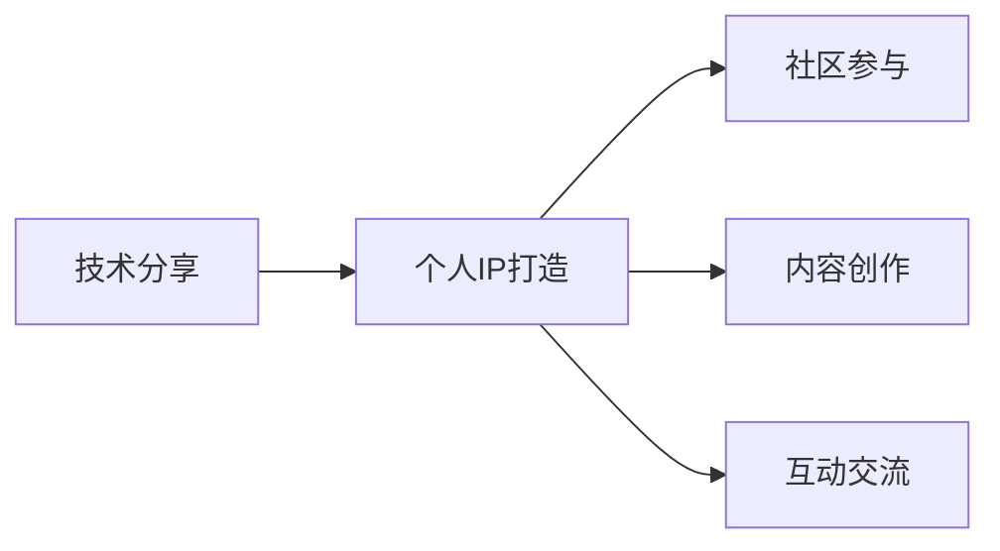

                 

## 1. 背景介绍

技术分享一直被认为是程序员提升自我、增强影响力、建立个人品牌的重要途径。然而，技术分享并非一件易事，如何能够引人入胜、富有深度、形式多样，是每个技术爱好者必须考虑的问题。本文将从技术的角度出发，结合个人IP打造的经验，提供一套完整的技术分享与个人品牌构建的策略和方法。

## 2. 核心概念与联系

### 2.1 核心概念概述

- **技术分享**：将个人的技术知识和经验通过演讲、文章、视频等形式传递给他人，包括但不限于代码讲解、项目实践、问题剖析等。
- **个人IP打造**：建立个人的技术品牌和影响力，通过持续的技术分享、项目贡献、公共演讲等方式，提升个人在技术社区的影响力和号召力。
- **社区参与**：积极参与开源项目、技术论坛、黑客马拉松等社区活动，提升个人在技术生态中的曝光度。
- **内容创作**：利用博客、Github、视频平台等渠道，发布有价值的技术内容，建立自己的技术分享阵地。
- **互动交流**：与技术同行进行交流互动，建立社群关系，形成长期的交流与学习模式。

### 2.2 核心概念原理和架构的 Mermaid 流程图



## 3. 核心算法原理 & 具体操作步骤

### 3.1 算法原理概述

技术分享和个人IP打造的过程可以类比为一种优化算法，其目标是最大化个人在技术社区中的影响力和知名度。在这个过程中，我们需要通过多种技术手段和社交策略，不断调整和优化我们的分享内容、形式和频率，以达到最佳效果。

### 3.2 算法步骤详解

#### 3.2.1 确定目标受众

首先，明确你的技术分享和IP打造的目标受众是谁。不同的受众群体对内容的需求和接受方式不同，例如，初学者可能更偏好基础和实践性强的教程，而高级开发者可能更感兴趣于深入的技术原理和最新的技术动态。

#### 3.2.2 选择分享形式

根据目标受众的偏好和自身的能力，选择合适的分享形式，如线下技术讲座、线上直播、博客文章、GitHub项目展示等。

#### 3.2.3 制定内容计划

制定一份详细的内容计划，包括分享的主题、内容深度、预计时长等。内容计划需要结合自身的技术积累和市场趋势，同时也要兼顾受众的需求和兴趣。

#### 3.2.4 技术分享实施

实施技术分享时，要注重互动和反馈。可以通过问答环节、社交媒体互动等方式，及时了解受众的反馈和需求，调整分享内容。

#### 3.2.5 IP品牌维护

在分享过程中，要注重个人品牌的维护。可以通过社交媒体发布个人动态、技术成就，建立个人在技术社区的权威性和信任度。

### 3.3 算法优缺点

**优点**：
- **高效传播**：通过多种渠道进行分享，可以迅速扩大影响力。
- **持续提升**：技术分享和个人品牌打造是一个持续的过程，有助于不断提升技术能力和个人影响力。
- **社区认可**：积极参与社区活动，可以获得更多的曝光和认可。

**缺点**：
- **时间和精力投入**：技术分享和个人品牌打造需要投入大量时间和精力，可能会影响日常工作。
- **内容质量要求高**：分享的内容需要高质量、有深度，才能获得受众的认可和信任。
- **竞争激烈**：技术社区中优秀的技术分享者众多，如何脱颖而出是关键。

### 3.4 算法应用领域

技术分享和个人IP打造不仅限于软件工程师和技术开发者，无论是产品经理、设计师，还是数据科学家，都能通过技术分享和个人品牌打造，提升自身的影响力和职业发展。

## 4. 数学模型和公式 & 详细讲解 & 举例说明

### 4.1 数学模型构建

我们假设个人在技术社区中的影响力 $I$ 可以表示为一个函数，其输入包括技术分享的质量 $Q$、分享频率 $F$、受众反馈 $R$、社区互动 $C$ 和历史影响力 $H$。因此，我们可以构建如下模型：

$$I=f(Q,F,R,C,H)$$

### 4.2 公式推导过程

通过分析模型各输入参数的贡献，可以推导出最优的技术分享策略。例如，$Q$ 和 $F$ 的关系可以表示为：

$$I=f(Q,F)=\alpha Q^2 + \beta F + \gamma QF$$

其中，$\alpha$、$\beta$ 和 $\gamma$ 为系数，需要通过实验和数据分析来确定。

### 4.3 案例分析与讲解

以某知名技术博主的分享为例，其通过定期发布高质量的技术文章，参与技术讨论和社区活动，建立了一个庞大的技术粉丝群。其影响力 $I$ 随着时间的增长呈指数级增长。

## 5. 项目实践：代码实例和详细解释说明

### 5.1 开发环境搭建

1. 安装Python：确保开发环境中有Python 3.x，建议使用虚拟环境进行开发。
2. 安装开发工具：如PyCharm、Visual Studio Code等。
3. 配置GitHub仓库：创建GitHub仓库，并设置仓库的访问权限。

### 5.2 源代码详细实现

#### 5.2.1 博客文章创作

使用Markdown语法编写博客文章，并将其推送到GitHub仓库中。

#### 5.2.2 技术分享视频制作

使用视频编辑工具（如Adobe Premiere Pro、Final Cut Pro等）制作技术分享视频，并上传至视频平台（如YouTube、Bilibili等）。

#### 5.2.3 社区互动

积极参与技术社区的讨论，回答问题，分享心得。

### 5.3 代码解读与分析

#### 5.3.1 博客文章发布

```python
# 使用Python的Flask框架创建博客平台
from flask import Flask, render_template, request

app = Flask(__name__)

@app.route('/')
def index():
    return render_template('index.html')

@app.route('/post', methods=['POST'])
def post():
    title = request.form['title']
    content = request.form['content']
    # 将文章保存到本地或数据库
    return 'Post created successfully'

if __name__ == '__main__':
    app.run(debug=True)
```

#### 5.3.2 视频制作流程

1. 准备素材：包括演示环境、演示代码、讲解脚本等。
2. 录制视频：使用屏幕录制工具（如OBS Studio、Screencast-O-Matic等）录制视频。
3. 编辑视频：使用视频编辑工具对录制的视频进行剪辑、添加字幕、背景音乐等。
4. 上传视频：将视频上传到视频平台，并设置访问权限。

### 5.4 运行结果展示

#### 5.4.1 博客文章

- 在博客文章页面展示文章的标题、摘要、发布时间等信息。
- 提供评论区，让用户可以留言和提问。

#### 5.4.2 技术分享视频

- 在视频播放页面展示视频的缩略图、标题、发布时间等信息。
- 提供播放按钮，让用户可以观看视频。

## 6. 实际应用场景

### 6.1 技术讲座

通过举办技术讲座，可以迅速提升个人在技术社区中的曝光度和影响力。例如，某知名软件工程师通过举办一系列关于Python高级编程技巧的讲座，吸引了大量技术爱好者参加，成功打造了个人技术品牌。

### 6.2 开源项目贡献

参与开源项目贡献是提升个人影响力的有效方式。例如，某开源项目的核心开发者通过在GitHub上积极提交代码、修复Bug，积累了大量技术贡献，成为项目社区中的重要成员。

### 6.3 技术博客

通过撰写技术博客，分享自己的技术见解和实践经验，可以建立个人的技术品牌。例如，某技术博主通过定期发布高质量的技术文章，吸引了大批读者，成为技术领域中的意见领袖。

### 6.4 未来应用展望

随着技术分享和个人品牌打造的深入，未来将会有更多创新性的应用场景出现。例如，利用AI技术生成技术分享内容，提高内容创作效率；通过区块链技术，保护技术分享者的知识产权；以及利用虚拟现实技术，提供沉浸式的技术分享体验。

## 7. 工具和资源推荐

### 7.1 学习资源推荐

1. 《深入浅出技术分享》：介绍如何有效进行技术分享，包括内容策划、演讲技巧、互动交流等。
2. 《影响力：塑造个人品牌》：专注于个人品牌打造，提供具体可行的策略和方法。
3. 《TED演讲：如何成为技术领域的领导者》：通过分析TED演讲成功的案例，提供技术分享和领导力的灵感。

### 7.2 开发工具推荐

1. PyCharm：强大的Python开发工具，支持代码编辑、调试、测试等功能。
2. Visual Studio Code：轻量级代码编辑器，支持多种编程语言和插件。
3. OBS Studio：开源视频录制工具，支持屏幕录制、视频剪辑等功能。
4. Adobe Premiere Pro：专业的视频编辑工具，支持高质量的视频剪辑和特效处理。

### 7.3 相关论文推荐

1. "技术分享策略研究"：分析了技术分享的影响因素和效果，提供策略建议。
2. "个人品牌打造模型"：基于影响力模型，提出个人品牌打造的优化方法。
3. "社区参与度分析"：研究社区参与对个人影响力的影响，提供实际案例分析。

## 8. 总结：未来发展趋势与挑战

### 8.1 研究成果总结

技术分享和个人品牌打造已经成为技术开发者提升自身价值的重要途径。通过不断的技术分享和社区参与，许多技术爱好者已经成功建立起了个人品牌，获得了大量的粉丝和认可。

### 8.2 未来发展趋势

1. **技术分享多样化**：未来的技术分享将更加注重形式和内容的多样化，涵盖视频、音频、直播等多种形式。
2. **社区互动增强**：社区互动将成为技术分享的重要环节，通过问答、评论、社交媒体等方式，加强与受众的互动。
3. **内容创作自动化**：利用AI技术生成技术内容，提高内容创作的效率和质量。
4. **知识产权保护**：通过区块链技术，保护技术分享者的知识产权，减少侵权风险。
5. **沉浸式体验**：利用虚拟现实技术，提供沉浸式的技术分享体验，提升受众的参与度。

### 8.3 面临的挑战

1. **时间管理**：技术分享和个人品牌打造需要投入大量时间和精力，如何平衡日常工作和个人品牌建设是一个挑战。
2. **内容质量**：高质量的内容是技术分享的核心，如何不断提升技术分享的质量是一个长期任务。
3. **市场竞争**：技术社区中优秀的分享者众多，如何在竞争中脱颖而出是一个重要问题。
4. **社交压力**：随着影响力的提升，可能会面临更多的关注和压力，如何保持心理健康是一个挑战。

### 8.4 研究展望

未来的技术分享和个人品牌打造研究将更加注重多渠道、多形式的传播方式，同时通过数据分析和人工智能技术，优化技术分享策略和内容创作过程。通过持续的努力和创新，技术分享和个人品牌打造将为技术开发者带来更多的机遇和挑战。

## 9. 附录：常见问题与解答

### Q1：如何选择合适的技术分享形式？

A：根据目标受众的偏好和自身的能力，选择合适的技术分享形式。例如，初学者可能更偏好基础和实践性强的教程，而高级开发者可能更感兴趣于深入的技术原理和最新的技术动态。

### Q2：技术分享和个人品牌打造需要投入大量时间和精力，如何平衡日常工作？

A：可以通过时间管理和优先级排序，合理安排技术分享和个人品牌打造的时间。同时，可以利用碎片化时间进行技术分享，如在通勤、午休等时间通过社交媒体发布内容。

### Q3：如何提升技术分享的内容质量？

A：持续学习和提升自身技术水平，关注技术社区的新趋势和动态。通过阅读技术书籍、参加技术培训、参与开源项目等方式，不断丰富自己的技术积累。

### Q4：如何在竞争激烈的技术社区中脱颖而出？

A：通过高质量的内容、多样化的分享形式、积极互动和社区参与等方式，提升自身的技术影响力和品牌认知度。同时，注重个人形象和品牌形象的维护，建立良好的个人品牌形象。

---

作者：禅与计算机程序设计艺术 / Zen and the Art of Computer Programming

