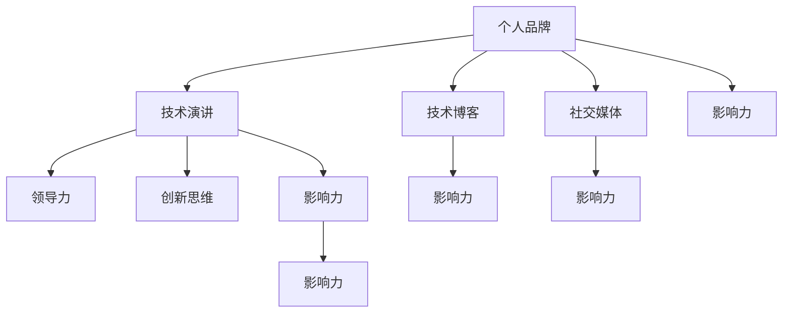

                 

# 技术演讲：提升个人品牌价值

> 关键词：个人品牌,技术演讲,领导力,创新思维,技术博客,社交媒体,影响力

## 1. 背景介绍

### 1.1 问题由来

在当今信息爆炸、竞争加剧的数字化时代，个人品牌建设已经成为了职场竞争的重要环节。特别是在高科技领域，技术专家的个人品牌不仅反映了其技术实力和行业地位，更是职业发展和商业合作的关键因素。然而，如何在技术日新月异的今天，持续提升自己的个人品牌价值，成为众多技术人员面临的难题。

### 1.2 问题核心关键点

在技术演讲中，提升个人品牌价值的关键点在于：

- 个人品牌定位：明确个人技术特长、行业兴趣和职业愿景。
- 内容创新：持续输出前沿技术、深刻洞见和有趣案例。
- 演讲技巧：采用生动语言、巧用多媒体、注重互动交流。
- 社交媒体：通过各大社交平台扩大影响力，构建专业社区。
- 持续学习：不断学习新技术、新理论，保持竞争力。

### 1.3 问题研究意义

个人品牌建设不仅能够提升个人在职场中的影响力，还能够促进个人职业发展、建立商业合作伙伴关系，甚至开启创业机会。通过技术演讲分享，可以推动技术知识的传播，加速技术应用的落地，为社会带来积极影响。

## 2. 核心概念与联系

### 2.1 核心概念概述

- 个人品牌(Personal Branding)：指通过展示个人专业技能、价值主张和个性特点，形成在特定领域内的独特识别度和影响力。

- 技术演讲(Tech Talk)：指在行业会议、公司内部、线上线下等多种场合，就某一技术话题进行讲解和讨论的交流形式。

- 领导力(Leadership)：指通过技术演讲展示专业知识、管理能力和领导魅力，获得听众的认同和追随。

- 创新思维(Innovation Mindset)：指在技术演讲中展现持续探索新技术、新方法、新理念的能力，激励听众不断进步。

- 技术博客(Blog)：指通过写作分享技术知识、观点和经验的媒介，持续提升个人知名度和影响力。

- 社交媒体(Social Media)：指通过Twitter、LinkedIn、GitHub等社交平台，展示个人技术成就、思想观点和互动交流的渠道。

- 影响力(Influence)：指通过技术演讲、博客和社交媒体的有机结合，建立并扩大个人品牌影响力。

这些概念之间的逻辑关系可以通过以下Mermaid流程图来展示：



这个流程图展示了个体品牌建设的各要素及其相互关系：

1. 个人品牌通过技术演讲、博客和社交媒体来展示。
2. 技术演讲不仅提升个人品牌，还锻炼领导力和创新思维。
3. 技术博客和社交媒体进一步放大影响力。
4. 所有环节相互促进，共同构建强大的个人品牌。

## 3. 核心算法原理 & 具体操作步骤
### 3.1 算法原理概述

提升个人品牌价值的过程，本质上是一个多维度、持续迭代的过程。其核心算法原理可以概括为以下几个步骤：

1. **定位明确**：明确个人技术特长、行业兴趣和职业愿景，形成品牌定位。
2. **内容创新**：持续输出前沿技术、深刻洞见和有趣案例，保持技术演讲和博客内容的创新性。
3. **演讲技巧**：采用生动语言、巧用多媒体、注重互动交流，提升演讲效果。
4. **社交媒体**：通过各大社交平台扩大影响力，构建专业社区，形成粉丝和追随者。
5. **持续学习**：不断学习新技术、新理论，保持竞争力，在技术演讲和博客中不断更新内容。

### 3.2 算法步骤详解

#### 3.2.1 确定个人品牌定位

1. **自我评估**：评估自身技术水平、专业领域和行业兴趣，确定主要技术专长和兴趣点。
2. **目标设定**：根据评估结果，设定明确的个人品牌目标，例如成为某一技术领域的知名专家或创新者。
3. **市场调研**：调研目标受众的需求、兴趣和反馈，了解其期望的技术演讲和博客内容。

#### 3.2.2 持续输出创新内容

1. **技术前沿**：紧跟技术发展趋势，阅读最新论文、参加行业会议、参与开源项目，获取前沿信息。
2. **洞见深度**：结合实践经验，深入分析技术问题，提出独特见解和解决方案。
3. **案例丰富**：积累实际应用案例，生动展示技术应用的效果和挑战。

#### 3.2.3 提升演讲技巧

1. **语言生动**：使用易于理解的生动语言，避免过多的技术术语，确保听众能跟上思路。
2. **多媒体辅助**：合理使用PPT、视频、动画等多媒体工具，直观展示复杂概念。
3. **互动交流**：通过提问、讨论、案例演示等方式，与听众建立互动关系。

#### 3.2.4 扩展社交媒体影响力

1. **平台选择**：根据受众特征，选择合适的社交媒体平台，如Twitter、LinkedIn、GitHub等。
2. **内容发布**：定期发布技术演讲、博客文章、项目进展等，保持活跃度。
3. **社区建设**：建立专业社区，通过社交媒体互动，形成稳定的粉丝和追随者。

#### 3.2.5 持续学习和迭代

1. **终身学习**：定期参加在线课程、阅读相关书籍、参加技术会议，不断更新知识库。
2. **反馈机制**：收集听众反馈，改进演讲和博客内容，提升互动效果。
3. **迭代改进**：根据反馈和市场变化，不断调整品牌定位和技术内容，保持动态更新。

### 3.3 算法优缺点

提升个人品牌价值的技术演讲方法具有以下优点：

1. **多维度展示**：通过技术演讲、博客和社交媒体多渠道展示，全面提升个人品牌影响力。
2. **内容创新**：持续输出前沿技术、深刻洞见和有趣案例，吸引并保持受众兴趣。
3. **互动交流**：通过演讲技巧提升互动效果，形成良好的品牌口碑。

但这种方法也存在一些缺点：

1. **时间和精力成本**：需要持续投入时间和精力进行内容创作和社交媒体维护。
2. **竞争激烈**：技术领域竞争激烈，需要在多个平台上持续输出优质内容，才能获得认可。
3. **自我品牌管理**：需要自我管理，避免过于商业化，保持个人品牌的专业性和独特性。

### 3.4 算法应用领域

基于技术演讲的提升个人品牌价值方法，在多个领域和场景中都有广泛应用：

- **技术分享**：在技术内部会议、行业研讨会、技术峰会上进行技术演讲，展示个人技术实力和行业地位。
- **培训教育**：在公司内部或外部培训课程中，传授技术知识，提升团队技术水平。
- **创业启动**：通过技术演讲和社交媒体推广，吸引投资和合作伙伴，推进创业项目。
- **开源贡献**：参与开源项目，发布技术博客，展示技术贡献和合作精神，提升行业影响力。
- **学术研究**：在学术会议、期刊上发表技术论文，展示研究成果和创新能力，拓展学术网络。

## 4. 数学模型和公式 & 详细讲解 & 举例说明
### 4.1 数学模型构建

提升个人品牌价值的模型可以抽象为一个多变量动态系统，其中每个变量代表一种影响因素，如技术水平、知名度、影响力等。设品牌影响力为 $I$，技术水平为 $T$，知名度为 $P$，互动次数为 $C$，则提升个人品牌价值的数学模型为：

$$
\frac{dI}{dt} = k(T + P + C) - aI
$$

其中：
- $k$ 为品牌增长系数，表示品牌提升的速率。
- $a$ 为品牌衰减系数，表示品牌衰退的速率。

### 4.2 公式推导过程

1. **初始条件**：设 $t=0$ 时，品牌影响力 $I=I_0$，技术水平 $T=T_0$，知名度 $P=P_0$，互动次数 $C=0$。
2. **求解微分方程**：对上述微分方程进行求解，得到品牌影响力的变化趋势。
3. **解释结果**：分析 $k$ 和 $a$ 对品牌提升和衰退的影响，确定优化策略。

### 4.3 案例分析与讲解

以一个开源项目维护者为例：

- **初始条件**：项目发布初期，影响力 $I_0=0$，技术水平 $T_0=100$，知名度 $P_0=0$，互动次数 $C=0$。
- **求解过程**：假设 $k=0.1$，$a=0.02$，通过计算得到品牌影响力的变化趋势。
- **结果分析**：随着技术水平、知名度和互动次数的提升，品牌影响力呈现指数级增长。

## 5. 项目实践：代码实例和详细解释说明
### 5.1 开发环境搭建

提升个人品牌价值的技术演讲和博客开发环境搭建如下：

1. **安装IDE**：选择PyCharm或Visual Studio Code作为开发环境。
2. **配置工具链**：安装Git、Markdown编辑器、GitHub API等必要工具。
3. **版本控制**：使用Git进行版本控制，保证代码的迭代更新和协作开发。

### 5.2 源代码详细实现

以下是一个技术演讲和博客开发的简要实现流程：

1. **技术演讲**：
   ```python
   import plotly.graph_objects as go
   
   def create_technology_slide(title, content, slide_type='normal'):
       fig = go.Figure(data=go.Slide(title=title, content=content))
       fig.update_layout(type=slide_type)
       return fig
   
   def create_technology_talk():
       talk = create_technology_slide('Technology Talk Title', 'Technology talk content goes here.')
       # 其他演讲内容创建方法
       return talk
   ```

2. **技术博客**：
   ```python
   import matplotlib.pyplot as plt
   
   def create_technology_blog():
       fig, ax = plt.subplots()
       ax.plot(['Technology Blog Title', 'Technology Blog Content'], color='blue')
       ax.set_xlabel('X Label')
       ax.set_ylabel('Y Label')
       ax.set_title('Technology Blog Title')
       plt.show()
       return fig
   ```

### 5.3 代码解读与分析

**技术演讲代码解读**：

- `create_technology_slide`函数：用于创建演讲幻灯片，包含标题和内容。
- `create_technology_talk`函数：用于创建整个技术演讲内容，包括多个幻灯片。
- 通过调用这两个函数，可以快速生成技术演讲的幻灯片和整个演讲内容。

**技术博客代码解读**：

- `create_technology_blog`函数：用于创建技术博客内容，展示技术趋势或结果。
- 通过调用这个函数，可以快速生成技术博客的图表和标题。

**运行结果展示**：

- 技术演讲可以展示为动态的幻灯片形式，通过PPT生成工具进行渲染和分享。
- 技术博客可以展示为静态的图表形式，通过Markdown编辑器发布到GitHub或博客平台。

## 6. 实际应用场景
### 6.1 技术培训和教育

技术演讲可以用于公司内部的技术培训和教育，提升团队的技术水平和协同能力。通过定期举办技术分享会，团队成员可以互相学习，共同进步，提升整体的技术实力和创新能力。

### 6.2 开源项目和学术研究

技术演讲和博客可以用于开源项目和学术研究，展示技术贡献和研究成果。通过技术博客分享最新进展和创新点，吸引更多的开发者和学者关注和合作。

### 6.3 创业和商业合作

技术演讲和社交媒体可以用于创业和商业合作，吸引投资和合作伙伴。通过技术演讲展示技术实力和商业前景，通过社交媒体扩大影响，形成稳定的合作关系和商业机会。

### 6.4 未来应用展望

随着技术演讲和博客的不断普及，未来的应用场景将更加多样化：

- **跨领域合作**：技术演讲和博客可以跨领域传播，形成跨行业、跨学科的技术合作网络。
- **企业培训**：大型企业可以定期举办技术演讲和博客分享，提升内部员工的技术水平和企业文化。
- **学术交流**：学术界可以通过技术演讲和博客分享研究成果，推动学术交流和知识传播。
- **政府项目**：政府部门可以通过技术演讲和博客，展示技术成就和政策效果，推动科技政策落地实施。

## 7. 工具和资源推荐
### 7.1 学习资源推荐

提升个人品牌价值的技术演讲和博客学习资源推荐：

1. **《TED Talks 演讲艺术》**：TED演讲作为全球知名的演讲平台，展示了众多优秀演讲者的成功经验，值得学习和借鉴。
2. **《TEDx Talks 组织和运营》**：TEDx演讲组织和运营的指南，提供了详细的演讲策划和管理建议。
3. **《Slides 制作技巧》**：介绍如何使用PowerPoint、Prezi等工具制作高质量的演讲幻灯片。
4. **《演讲写作技巧》**：提供从内容策划到演示技巧的全面指导，提升演讲效果。
5. **《博客写作技巧》**：介绍如何撰写技术博客，包括选题、结构和格式设计等。

### 7.2 开发工具推荐

提升个人品牌价值的技术演讲和博客开发工具推荐：

1. **Python**：作为最常用的编程语言，Python具有强大的数据处理和分析能力，适合技术演讲和博客内容的生成和处理。
2. **Git**：版本控制系统，便于团队协作和代码迭代更新。
3. **Markdown编辑器**：如Github Pages、GitLab Pages等，方便发布技术博客和静态内容。
4. **PPT生成工具**：如PowerPoint、Keynote等，支持动态图表和多媒体展示。
5. **在线工具**：如Slides.com、Canva等，便于快速创建和分享技术演讲幻灯片。

### 7.3 相关论文推荐

提升个人品牌价值的技术演讲和博客相关论文推荐：

1. **《技术演讲的心理学》**：探讨技术演讲的心理机制和技巧，提升演讲效果。
2. **《技术博客的SEO优化》**：介绍如何通过SEO优化提升技术博客的搜索引擎排名和阅读量。
3. **《社交媒体影响力和品牌建设》**：分析社交媒体对个人品牌建设的影响，提供实战策略。
4. **《内容营销的策略与方法》**：提供内容营销的全面指南，提升技术演讲和博客的传播效果。

## 8. 总结：未来发展趋势与挑战
### 8.1 总结

本文对提升个人品牌价值的技术演讲和博客进行了全面系统的介绍。通过深入分析核心概念和应用场景，给出了详细的操作步骤和代码实例，希望能为技术人员提供系统的指导。

### 8.2 未来发展趋势

提升个人品牌价值的技术演讲和博客未来发展趋势：

1. **多媒体和交互式演讲**：引入VR、AR、实时数据等多媒体技术，提升演讲的互动性和沉浸感。
2. **虚拟仿真和模拟实验**：通过虚拟仿真技术，展示技术应用的实际效果和挑战。
3. **社交媒体直播和互动**：通过社交媒体直播和实时互动，提升演讲的参与度和影响力。
4. **个性化推荐系统**：基于用户行为数据，推荐相关的技术演讲和博客内容，提升用户的阅读体验。
5. **人工智能辅助**：引入AI技术进行语音识别、内容生成等辅助，提升演讲和博客的生产效率。

### 8.3 面临的挑战

提升个人品牌价值的技术演讲和博客面临的挑战：

1. **技术更新快**：技术演讲和博客需要不断更新内容，跟上技术发展的步伐。
2. **内容质量要求高**：需要持续输出高质量的技术内容，保持受众的兴趣和信任。
3. **时间精力投入大**：需要投入大量时间和精力进行内容创作和社交媒体维护。
4. **品牌管理难度高**：需要精准定位个人品牌，避免过于商业化，保持专业性和独特性。

### 8.4 研究展望

提升个人品牌价值的技术演讲和博客未来研究展望：

1. **跨领域知识整合**：如何将跨领域的知识和技能有机融合，形成更全面、更深入的技术演讲和博客内容。
2. **互动式学习工具**：开发互动式学习工具，提升技术演讲和博客的学习效果和参与度。
3. **多模态内容呈现**：结合视频、音频、图像等多种模态，增强技术演讲和博客的表现力和感染力。
4. **情感计算和心理学研究**：引入情感计算和心理学研究成果，提升技术演讲和博客的情感共鸣和观众互动。

## 9. 附录：常见问题与解答

**Q1：如何提高技术演讲的互动效果？**

A: 提高技术演讲的互动效果可以通过以下几个方法：

1. **提问环节**：在演讲中设置互动问答环节，鼓励观众提出问题，并进行现场解答。
2. **现场演示**：通过现场演示或互动软件，展示技术应用的实时效果，增强听众的参与感。
3. **互动投票**：使用投票工具，让听众对演讲内容进行现场投票，了解听众的关注点和兴趣点。
4. **案例分析**：通过现场案例分析和讨论，让听众积极参与到问题解决过程中。

**Q2：技术博客如何吸引读者？**

A: 技术博客吸引读者的方法：

1. **高质量内容**：持续输出高质量的技术内容，展示技术深度和广度。
2. **有趣案例**：分享实际项目案例和有趣故事，增强读者的阅读兴趣。
3. **互动评论**：鼓励读者在评论区留言，形成良好的互动氛围。
4. **SEO优化**：通过SEO优化，提高博客在搜索引擎的排名，吸引更多读者。
5. **多媒体支持**：使用图表、视频、代码片段等多媒体内容，丰富博客表现形式。

**Q3：如何在社交媒体上扩大个人品牌影响力？**

A: 在社交媒体上扩大个人品牌影响力的方法：

1. **定期发布**：在各大社交平台定期发布技术演讲、博客和项目进展，保持活跃度。
2. **互动交流**：积极参与社交媒体的讨论和互动，回复读者留言，形成稳定的追随者。
3. **跨平台推广**：将社交媒体内容跨平台推广，扩大影响范围。
4. **建立社区**：建立专业社区，通过社交媒体互动，形成稳定的粉丝和追随者。

**Q4：如何平衡技术演讲和商业合作？**

A: 平衡技术演讲和商业合作的策略：

1. **明确品牌定位**：在技术演讲中明确品牌定位，避免过于商业化。
2. **选择合适平台**：选择适合商业合作的平台和渠道，进行适当的商业推广。
3. **合作共赢**：在商业合作中寻找共赢的合作点，提升演讲内容和影响力。
4. **持续跟进**：在商业合作后持续跟进效果，不断优化和调整合作策略。

**Q5：如何提高技术演讲的自信心？**

A: 提高技术演讲自信心的策略：

1. **充分准备**：在演讲前充分准备演讲内容和演示材料，熟悉演讲内容。
2. **反复练习**：通过反复练习演讲内容，增强自信心和流畅度。
3. **小范围试讲**：在熟悉观众的情况下，进行小范围试讲，获取反馈和建议。
4. **积极心态**：保持积极的心态，面对观众的提问和反馈，展示专业素养和应变能力。

---

作者：禅与计算机程序设计艺术 / Zen and the Art of Computer Programming

