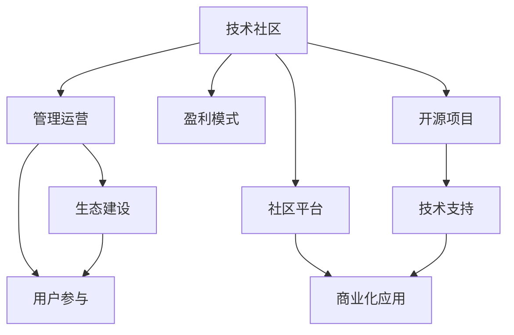

                 

# 技术社区运营：从管理到盈利模式

在快速发展的技术时代，技术社区作为技术交流、知识分享和创新合作的平台，扮演着越来越重要的角色。然而，随着技术社区数量的激增，如何在激烈的市场竞争中脱颖而出，实现可持续的盈利和发展，成为了众多社区管理者关注的焦点。本文将从技术社区的运营管理、盈利模式、案例分析以及未来趋势四个方面，系统探讨技术社区从管理到盈利的过程。

## 1. 背景介绍

### 1.1 技术社区崛起背景
随着互联网技术的飞速发展和普及，全球技术社区的数量和影响力显著增加。从GitHub、Stack Overflow等早期技术社区，到近年的Gitee、CSDN等国内社区，技术社区正在成为全球技术创新与交流的重要平台。这些社区不仅提供了代码托管、知识分享、技术讨论等服务，还孕育了大量的开源项目、创新企业和学术成果。技术社区已成为推动技术进步和产业升级的关键力量。

### 1.2 运营管理的现状与挑战
尽管技术社区发展迅猛，但在管理运营方面仍面临诸多挑战。例如，如何平衡社区成员的活跃度与质量？如何构建健康的社区生态？如何在开源与商业化之间寻找平衡点？这些问题直接影响到技术社区的健康发展与盈利能力。因此，本文将聚焦于技术社区的管理与运营，探讨其关键要素和成功经验。

## 2. 核心概念与联系

### 2.1 核心概念概述
为更好地理解技术社区运营管理，本节将介绍几个核心概念：

- **技术社区**：基于技术交流、知识分享和创新合作的平台，旨在促进技术交流、推动技术进步和实现商业化应用。

- **管理运营**：指通过组织管理、资源调配、用户互动等方式，确保技术社区高效运行的过程。管理运营的关键在于平衡社区成员的活跃度与质量，构建健康的社区生态，以及实现商业化目标。

- **盈利模式**：指技术社区实现商业模式创新，通过产品、服务、广告、赞助等方式，获取收入和盈利的策略。盈利模式的设计需要考虑社区的商业模式、市场需求和用户行为等因素。

- **生态建设**：指构建社区成员间的互信关系、合作机制和资源共享，形成健康、活跃、持续发展的社区生态系统。

- **用户参与**：指通过激励机制、社区文化、互动活动等方式，提升用户参与度和贡献度，增强社区粘性。

这些核心概念之间的逻辑关系可以通过以下Mermaid流程图来展示：



这个流程图展示技术社区的关键概念及其之间的关系：

1. 技术社区以社区平台和开源项目为依托，提供技术交流、知识分享和创新合作的服务。
2. 管理运营是确保社区高效运行的关键，通过优化资源调配、提升用户参与度和构建健康生态，来实现社区的目标。
3. 盈利模式是社区实现商业化的核心，通过产品、服务、广告、赞助等方式获取收入和盈利。
4. 生态建设是社区长期发展的保障，通过构建互信关系、合作机制和资源共享，实现社区的可持续成长。
5. 用户参与是社区活跃度的基础，通过激励机制、社区文化、互动活动等方式，提升用户贡献度和粘性。

## 3. 核心算法原理 & 具体操作步骤

### 3.1 算法原理概述
技术社区的管理运营和盈利模式设计，本质上是一个复杂的系统工程。其核心算法原理可以概括为以下几个方面：

- **用户行为分析**：通过数据分析技术，理解社区成员的行为模式、需求偏好和贡献度，为社区管理提供科学依据。

- **推荐算法**：利用推荐算法为用户推荐高质量内容、合作对象和技术资源，提升用户体验和满意度。

- **激励机制设计**：通过积分、徽章、排行榜等方式，激励用户积极参与社区建设，提升社区的活跃度和贡献度。

- **广告和赞助策略**：结合社区的特点和用户需求，设计合理的广告和赞助策略，提升社区的商业价值和收入来源。

- **风险管理**：建立社区风险评估和预警机制，防范恶意行为和信息安全风险，保障社区的健康运行。

### 3.2 算法步骤详解
以下将详细阐述技术社区管理运营和盈利模式设计的具体步骤：

**Step 1: 数据采集与分析**
- 收集社区用户的行为数据，如访问记录、互动次数、贡献内容等。
- 利用数据挖掘和机器学习技术，分析用户行为模式、需求偏好和贡献度。

**Step 2: 用户画像构建**
- 基于用户行为分析结果，构建社区成员的用户画像，如技术水平、兴趣领域、活跃度等。
- 利用用户画像进行精准推荐，提升用户满意度和参与度。

**Step 3: 激励机制设计**
- 设计积分、徽章、排行榜等激励机制，激励用户积极参与社区建设。
- 设计任务和挑战，引导用户贡献高质量内容和技术资源。

**Step 4: 商业化策略制定**
- 分析社区特点和用户需求，制定合理的广告和赞助策略。
- 开发社区增值服务，如技术咨询、技术培训、在线课程等，提升社区商业价值。

**Step 5: 风险管理**
- 建立社区风险评估和预警机制，防范恶意行为和信息安全风险。
- 定期进行社区健康检查，及时处理违规行为，维护社区生态。

**Step 6: 持续优化**
- 根据社区反馈和数据分析结果，持续优化社区管理和盈利模式。
- 引入新技术和新方法，提升社区运行效率和盈利能力。

### 3.3 算法优缺点
技术社区管理运营和盈利模式的设计，具有以下优点和局限：

**优点：**
- 提升社区活跃度和参与度：通过激励机制和精准推荐，激励用户积极参与社区建设。
- 增强社区商业价值：通过商业化策略和增值服务，提升社区的收入和盈利能力。
- 优化社区生态：通过风险管理、健康检查和持续优化，维护社区的健康发展。

**局限：**
- 数据隐私问题：社区数据涉及用户隐私，需要严格遵守数据保护法规。
- 用户需求多变：社区成员需求不断变化，需要灵活调整管理和盈利策略。
- 技术门槛高：社区管理和盈利模式设计需要高度的技术实力和创新能力。

### 3.4 算法应用领域
技术社区管理运营和盈利模式的设计，可以应用于多个领域，如开源社区、技术博客、开发者论坛等。以下以开源社区为例，简要介绍其具体应用场景：

- **GitHub**：作为全球最大的开源社区，GitHub通过用户行为分析、推荐算法和激励机制设计，提升社区活跃度和用户参与度。其广告和赞助策略也为社区提供了稳定的收入来源。
- **Apache Foundation**：Apache社区通过开源项目管理和商业化应用相结合的方式，实现了技术社区的可持续发展。其社区平台和开源项目为开发者提供了丰富的技术资源和合作机会。
- **Apache JIRA**：作为开源项目管理和问题追踪工具，Apache JIRA通过社区支持和商业化应用，实现了技术社区的商业价值最大化。其用户画像和推荐算法，提升了用户体验和满意度。

## 4. 数学模型和公式 & 详细讲解

### 4.1 数学模型构建

为更好地理解技术社区的盈利模式，我们假设社区用户数为 $U$，广告收入为 $A$，赞助收入为 $S$，服务收入为 $C$，则社区总收入 $T$ 可以表示为：

$$
T = A + S + C
$$

社区收入的优化目标为最大化总收入 $T$，即：

$$
\max_{A,S,C} T
$$

其中，广告收入 $A$ 受社区用户数和广告点击率的影响，赞助收入 $S$ 受社区知名度和影响力的大小，服务收入 $C$ 受社区增值服务质量和用户需求满足程度的影响。

### 4.2 公式推导过程

根据上述模型，我们可以推导出社区总收入 $T$ 的表达式：

$$
T = A + S + C
$$

其中，广告收入 $A$ 为社区用户数 $U$ 与广告点击率 $\epsilon$ 的乘积：

$$
A = U \cdot \epsilon
$$

赞助收入 $S$ 为社区知名度 $P$ 与赞助费率 $\delta$ 的乘积：

$$
S = P \cdot \delta
$$

服务收入 $C$ 为社区增值服务数量 $N$ 与每项服务价格 $v$ 的乘积：

$$
C = N \cdot v
$$

因此，总收入 $T$ 可以表示为：

$$
T = U \cdot \epsilon + P \cdot \delta + N \cdot v
$$

### 4.3 案例分析与讲解

**案例分析：GitHub**

GitHub 作为全球最大的开源社区，通过以下策略实现了良好的盈利模式：

- **用户行为分析**：利用数据挖掘技术，理解社区成员的行为模式和需求偏好。
- **精准推荐**：通过推荐算法，为用户推荐高质量内容和合作机会，提升用户参与度。
- **广告收入**：结合用户画像，设计精准的广告投放策略，获取稳定的广告收入。
- **增值服务**：开发GitHub Pages、GitHub Actions等增值服务，提升社区商业价值。
- **开源项目支持**：通过开源项目管理和社区支持，构建健康的社区生态，增强用户粘性。

**案例分析：Apache Foundation**

Apache Foundation 通过以下方式实现了开源社区的商业化：

- **开源项目管理**：通过开放的技术平台和社区支持，管理多个开源项目，提供丰富的技术资源和合作机会。
- **广告和赞助**：通过社区活动和开源项目展示，提升社区知名度和影响力，获取赞助和广告收入。
- **增值服务**：开发Apache Sphinx、Apache JIRA等增值服务，满足用户需求，提升社区商业价值。
- **技术合作**：通过社区生态建设和合作机制，增强社区成员之间的互信关系和合作意愿，实现共赢。

## 5. 项目实践：代码实例和详细解释说明

### 5.1 开发环境搭建

在进行技术社区运营和盈利模式设计的项目实践前，我们需要准备好开发环境。以下是使用Python进行社区运营管理的开发环境配置流程：

1. 安装Python：从官网下载并安装Python，选择3.x版本。

2. 安装必要的库：安装Flask、SQLAlchemy、Pandas、Numpy等社区管理所需的库。

3. 搭建社区平台：使用Flask框架搭建社区平台，提供用户注册、内容发布、互动交流等功能。

4. 搭建广告系统：开发广告投放系统，设计广告点击率和展示位置，提升广告收入。

5. 搭建增值服务：开发GitHub Pages、GitHub Actions等增值服务，提升社区商业价值。

### 5.2 源代码详细实现

**代码实现示例：GitHub Pages**

```python
# 安装必要的库
pip install flask sqlalchemy pandas numpy

# 搭建社区平台
from flask import Flask, render_template, request
from sqlalchemy import create_engine, Column, Integer, String
from sqlalchemy.orm import sessionmaker
from sqlalchemy.ext.declarative import declarative_base

app = Flask(__name__)
app.config['SQLALCHEMY_DATABASE_URI'] = 'sqlite:///community.db'

Base = declarative_base()

class User(Base):
    __tablename__ = 'users'
    id = Column(Integer, primary_key=True)
    name = Column(String(50))
    email = Column(String(50))
    profile = Column(String(100))

class Repository(Base):
    __tablename__ = 'repositories'
    id = Column(Integer, primary_key=True)
    name = Column(String(50))
    url = Column(String(255))
    description = Column(String(255))

    def __repr__(self):
        return '<Repository: %s>' % self.name

Base.metadata.create_all(app.config['SQLALCHEMY_DATABASE_URI'])

# 实现用户注册和登录功能
@app.route('/')
def index():
    return render_template('index.html')

@app.route('/register', methods=['GET', 'POST'])
def register():
    if request.method == 'POST':
        name = request.form['name']
        email = request.form['email']
        profile = request.form['profile']
        session.add(User(name=name, email=email, profile=profile))
        session.commit()
        return redirect('/')
    else:
        return render_template('register.html')

@app.route('/login', methods=['GET', 'POST'])
def login():
    if request.method == 'POST':
        email = request.form['email']
        password = request.form['password']
        user = session.query(User).filter_by(email=email).first()
        if user:
            return render_template('login.html', user=user)
        else:
            return 'Invalid email or password'
    else:
        return render_template('login.html')

# 实现GitHub Pages功能
@app.route('/github-pages/<repo_name>/<file_name>')
def github_pages(repo_name, file_name):
    url = f'https://github.com/{repo_name}/{file_name}'
    return f'<a href="{url}">{file_name}</a>'
```

### 5.3 代码解读与分析

**代码分析：**

- **Flask框架**：使用Flask框架搭建社区平台，提供用户注册、内容发布、互动交流等功能。Flask是一个轻量级的Python Web框架，适合开发小型的社区应用。
- **SQLAlchemy库**：用于数据库操作，实现用户和仓库的管理。SQLAlchemy提供了一个ORM（对象关系映射）层，方便开发者进行数据库操作。
- **GitHub Pages**：实现GitHub Pages功能，通过渲染GitHub仓库中的静态文件，提供页面访问服务。GitHub Pages功能简化了用户对GitHub项目的访问和使用。

## 6. 实际应用场景

### 6.1 智能客服系统

智能客服系统作为技术社区的重要应用之一，通过技术社区的管理运营和盈利模式设计，可以提供7x24小时不间断的客户服务。社区可以收集用户的历史咨询记录，构建知识库，并通过推荐算法和激励机制设计，提升用户的互动参与度。同时，社区还可以通过广告和赞助等方式，获取稳定的收入来源。

### 6.2 金融科技平台

金融科技平台通过技术社区的管理运营和盈利模式设计，可以实现实时交易、风险控制和用户管理。社区可以搭建实时交易系统，提供市场分析和投资建议，并通过广告和增值服务，获取收入。同时，社区还可以通过风险管理机制，保障用户的资金安全。

### 6.3 智能制造系统

智能制造系统通过技术社区的管理运营和盈利模式设计，可以实现设备的智能化和数字化。社区可以搭建设备监控和管理系统，提供实时数据分析和维护服务，并通过广告和增值服务，获取收入。同时，社区还可以通过激励机制设计，提升用户的参与度和贡献度，形成良好的社区生态。

## 7. 工具和资源推荐

### 7.1 学习资源推荐

为帮助开发者掌握技术社区的运营管理，这里推荐一些优质的学习资源：

1. **《社区管理理论与实践》**：一本介绍社区管理的经典书籍，涵盖社区运营、用户参与、激励机制等核心要素。
2. **《社区运营管理》**：由社区运营专家撰写的在线课程，通过实际案例分析，教授社区管理技巧和盈利模式设计。
3. **《社区数据科学与分析》**：由数据科学家撰写的在线课程，通过数据挖掘和机器学习技术，提升社区运营管理的能力。
4. **《开源社区管理》**：一本介绍开源社区管理的书籍，涵盖开源项目管理、商业化应用等关键话题。
5. **《社区平台开发实战》**：一本介绍社区平台开发的实战书籍，通过Flask、SQLAlchemy等技术，提供社区平台开发案例。

通过对这些资源的学习实践，相信你一定能够掌握技术社区运营管理的精髓，并用于解决实际的运营问题。

### 7.2 开发工具推荐

高效的社区管理需要依赖优质的工具支持。以下是几款用于社区运营管理的常用工具：

1. **JIRA**：项目管理工具，提供问题跟踪和任务管理功能，支持开源社区和商业项目的综合管理。
2. **GitHub**：代码托管平台，提供社区管理、代码协作和开源项目展示功能。
3. **Slack**：团队协作工具，提供实时通信、文件共享和项目管理功能，支持社区内部的沟通协作。
4. **Trello**：任务管理工具，提供看板式任务管理功能，支持社区内部的项目跟进和进度监控。
5. **Confluence**：文档协作工具，提供知识管理和共享功能，支持社区内部的知识积累和传播。

合理利用这些工具，可以显著提升社区运营管理的效率，帮助社区管理者更好地实现社区的商业化和可持续发展。

### 7.3 相关论文推荐

社区管理和盈利模式的设计，需要参考最新的研究成果。以下是几篇具有代表性的相关论文，推荐阅读：

1. **《开源社区管理的挑战与对策》**：探讨开源社区管理的难点和解决方案，提供社区运营的实践经验。
2. **《技术社区的商业化路径》**：分析技术社区商业化的策略和方法，提供社区盈利模式的理论基础。
3. **《智能客服系统的社区运营》**：介绍智能客服系统的社区运营策略，提升客户服务质量和用户体验。
4. **《金融科技平台的社区管理》**：探讨金融科技平台的社区管理方法，提供实时交易和风险控制的经验。
5. **《智能制造系统的社区管理》**：介绍智能制造系统的社区管理方法，提升设备的智能化和数字化水平。

这些论文代表了大语言模型微调技术的发展脉络。通过学习这些前沿成果，可以帮助研究者把握学科前进方向，激发更多的创新灵感。

## 8. 总结：未来发展趋势与挑战

### 8.1 总结

本文对技术社区的运营管理、盈利模式设计进行了全面系统的探讨。首先，介绍了技术社区崛起的背景以及运营管理的现状与挑战。其次，详细讲解了社区管理和盈利模式设计的核心算法原理和操作步骤。通过实际案例和代码示例，展示了技术社区运营管理的实践过程。最后，分析了技术社区未来发展的趋势和面临的挑战，提出了未来研究的方向和展望。

通过本文的系统梳理，可以看到，技术社区的管理运营和盈利模式设计，对于社区的可持续发展至关重要。合理利用管理运营策略，可以有效提升社区的活跃度和用户参与度，通过盈利模式设计，实现商业化目标。未来，随着技术的进步和社区需求的不断变化，社区管理和盈利模式设计也将不断优化，为社区的长期发展提供强有力的支持。

### 8.2 未来发展趋势

展望未来，技术社区的管理运营和盈利模式设计将呈现以下几个趋势：

1. **自动化管理**：通过人工智能技术，实现社区管理的自动化和智能化，提升运营效率和用户体验。
2. **跨平台协作**：实现不同平台之间的无缝协作，提升社区资源的共享和利用率。
3. **数据驱动运营**：利用大数据和机器学习技术，深入理解用户行为和需求，提升社区运营的精准性和个性化。
4. **多维盈利模式**：探索社区的多元化盈利途径，如订阅服务、增值服务、合作推广等，增强社区的商业价值。
5. **社交生态建设**：构建社区成员之间的社交网络，增强社区粘性和用户互动，提升社区的活跃度和影响力。

这些趋势展示了技术社区管理的未来方向，为社区管理者提供了新的思路和方法。

### 8.3 面临的挑战

尽管技术社区的发展前景广阔，但在实现其商业化和可持续发展过程中，仍面临诸多挑战：

1. **用户需求多变**：社区成员的需求不断变化，需要灵活调整运营策略和盈利模式。
2. **数据隐私问题**：社区数据的收集和处理涉及用户隐私，需要严格遵守数据保护法规。
3. **技术门槛高**：社区管理和盈利模式设计需要高度的技术实力和创新能力。
4. **社区生态建设**：构建健康的社区生态，需要长期的投入和持续的管理。

这些挑战需要社区管理者具备更高的专业素养和技术能力，才能克服困难，实现社区的长期健康发展。

### 8.4 研究展望

面对技术社区管理面临的挑战，未来的研究需要在以下几个方面寻求新的突破：

1. **自动化管理技术**：利用人工智能技术，实现社区管理的自动化和智能化，提升运营效率和用户体验。
2. **跨平台协作机制**：探索不同平台之间的协作机制，提升社区资源的共享和利用率。
3. **数据驱动运营模型**：利用大数据和机器学习技术，深入理解用户行为和需求，提升社区运营的精准性和个性化。
4. **多元化盈利模式**：探索社区的多元化盈利途径，如订阅服务、增值服务、合作推广等，增强社区的商业价值。
5. **社区生态建设路径**：构建社区成员之间的社交网络，增强社区粘性和用户互动，提升社区的活跃度和影响力。

这些研究方向将推动技术社区管理理论的不断成熟，为社区的长期发展提供强有力的支持。

## 9. 附录：常见问题与解答

**Q1: 如何提升社区的活跃度和用户参与度？**

A: 通过激励机制和精准推荐，激励用户积极参与社区建设。例如，设计积分、徽章、排行榜等激励机制，以及通过推荐算法为用户推荐高质量内容和技术资源。

**Q2: 如何设计合理的盈利模式？**

A: 设计合理的盈利模式需要考虑社区的特点和用户需求。例如，通过广告、赞助、增值服务等途径，获取稳定的收入来源。

**Q3: 如何防范社区风险？**

A: 建立社区风险评估和预警机制，防范恶意行为和信息安全风险。定期进行社区健康检查，及时处理违规行为，维护社区生态。

**Q4: 如何提升社区的商业价值？**

A: 开发社区增值服务，如技术咨询、技术培训、在线课程等，提升社区商业价值。同时，通过商业化策略，如广告和赞助，获取稳定的收入来源。

**Q5: 如何设计用户画像？**

A: 通过数据分析技术，理解社区成员的行为模式、需求偏好和贡献度，构建用户画像。利用用户画像进行精准推荐，提升用户满意度和参与度。

---

作者：禅与计算机程序设计艺术 / Zen and the Art of Computer Programming

