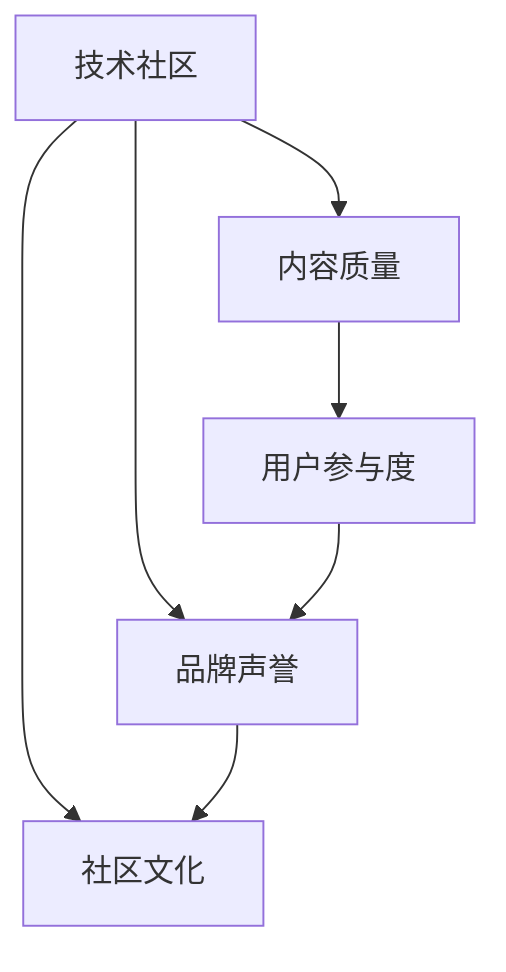

                 

# 技术社区运营：影响力的来源

> 关键词：技术社区,运营,影响力,社区文化,内容质量,用户参与,网络效应,参与度,资源整合,策略优化

## 1. 背景介绍

### 1.1 问题由来

在当今互联网时代，技术社区扮演着连接技术爱好者、开发者和企业的关键角色。它们是知识共享、技术创新、行业交流的重要平台。技术社区不仅提升了个人和企业的技术水平，还促进了产业的共同进步。然而，在众多技术社区中，只有极少数能够持续保持活跃和影响力，大多数则逐渐消亡。究其原因，在于技术社区运营过程中存在诸多挑战，如用户留存率低、内容质量参差不齐、社区文化难以形成等。这些问题的根本在于社区影响力的源泉不明确，运营策略不够精准。

本文旨在探讨技术社区影响力的来源，并结合实际案例，提出一系列提升社区影响力的策略。通过深入分析社区运营的核心要素，希望能为技术社区的长期发展提供指导和参考。

### 1.2 问题核心关键点

技术社区影响力的来源主要有以下四个方面：

1. **高质量内容**：提供技术深度和实用性的内容，帮助用户解决实际问题。
2. **活跃用户群体**：吸引和维持活跃的用户，通过良好的社区文化吸引更多用户参与。
3. **高效运营机制**：建立有效的社区管理和互动机制，提升用户参与度和满意度。
4. **良好品牌声誉**：构建和维护良好的社区品牌形象，吸引更多高质量内容发布和用户参与。

本文将围绕这四个方面，深入探讨技术社区影响力的提升策略。

## 2. 核心概念与联系

### 2.1 核心概念概述

为更好地理解技术社区运营的影响力来源，本节将介绍几个关键概念：

- **技术社区**：基于技术兴趣和专业技能，通过在线平台进行知识共享、技术交流和合作的网络空间。
- **社区影响力**：社区对用户、开发者、企业及其他社区的吸引力和号召力，体现在用户参与度、内容质量、品牌声誉等方面。
- **社区文化**：社区成员共同遵守的行为规范、价值观念和互动方式，是社区活力的源泉。
- **内容质量**：技术社区提供的内容深度、实用性和创新性，直接影响用户的获取和留存。
- **用户参与度**：用户活跃程度和社区互动频率，体现社区的吸引力和凝聚力。
- **品牌声誉**：社区在业内的知名度和美誉度，反映社区的权威性和公信力。

这些概念之间的逻辑关系可以通过以下Mermaid流程图来展示：



这个流程图展示了一系列的逻辑关系：

1. 技术社区通过高质量内容和良好的社区文化，吸引并维持活跃用户群体。
2. 活跃用户通过积极互动和贡献内容，提升社区内容质量。
3. 高质量内容和良好品牌声誉相互促进，吸引更多用户参与。
4. 用户参与度和品牌声誉的提升，进一步加强社区文化和内容质量。

## 3. 核心算法原理 & 具体操作步骤
### 3.1 算法原理概述

技术社区影响力的提升，本质上是一个多目标优化问题。核心在于平衡和优化社区内容、用户互动、品牌建设等方面的策略，以达到最佳的影响力效果。

### 3.2 算法步骤详解

基于多目标优化理论，技术社区运营的影响力提升可以分以下几步进行：

**Step 1: 定义优化目标**
- 确定社区的目标用户群体，设定内容质量、用户参与度、品牌声誉的优化指标。
- 根据社区类型和定位，确定各指标的权重。

**Step 2: 构建数学模型**
- 定义各指标的评价函数，如内容质量可通过用户评分、阅读量、点赞数等指标衡量。
- 通过多目标优化算法，构建整体优化模型，如遗传算法、粒子群优化等。

**Step 3: 优化模型参数**
- 使用优化算法对模型参数进行迭代优化，逐步调整内容和互动策略。
- 根据实验结果，调整各指标的权重，找到最佳优化方案。

**Step 4: 验证优化效果**
- 在小范围内进行试点，评估优化后的社区效果。
- 根据试点结果，调整优化策略，继续迭代优化。

**Step 5: 大规模推广**
- 在大范围内推广优化后的策略，观察整体效果。
- 定期监测各指标变化，持续优化社区运营策略。

### 3.3 算法优缺点

技术社区运营的多目标优化算法具有以下优点：
1. 系统性强：通过多目标优化算法，全面平衡社区内容、用户互动和品牌建设，避免单一指标优化带来的短视行为。
2. 数据驱动：借助数据模型和实验评估，可量化各策略的效果，减少主观偏见。
3. 灵活性强：可以动态调整优化目标和策略，适应社区发展的不同阶段。

同时，该算法也存在一定的局限性：
1. 模型复杂度较高：多目标优化问题通常比较复杂，模型求解难度大。
2. 资源消耗大：数据采集、模型训练、实验评估等环节需耗费大量计算资源。
3. 效果依赖数据：优化效果很大程度上依赖数据的质量和数量，数据获取难度较大。

尽管存在这些局限性，但就目前而言，多目标优化算法仍是提升技术社区影响力的重要方法。未来相关研究的重点在于如何进一步降低算法复杂度，提高优化效率，同时兼顾模型可解释性和鲁棒性等因素。

### 3.4 算法应用领域

基于多目标优化的大语言模型微调方法，已在多个技术社区中得到应用，如GitHub、Stack Overflow、CSDN等。这些社区通过使用该方法，有效提升了内容质量、用户参与度和品牌声誉，成为行业内的佼佼者。

除了这些知名社区，许多中小企业和初创团队也利用该方法，打造了具有一定影响力的技术社区。通过优化内容策略、用户互动机制和品牌建设，这些社区在各自领域内迅速崛起，取得了不错的成绩。

## 4. 数学模型和公式 & 详细讲解 & 举例说明
### 4.1 数学模型构建

技术社区影响力的提升，可以从内容质量、用户参与度和品牌声誉三个维度进行建模。设社区的总影响力和各指标的权重分别为 $F$、$C$、$U$ 和 $B$，则优化模型可以表示为：

$$
F = w_C \times C + w_U \times U + w_B \times B
$$

其中 $w_C$、$w_U$、$w_B$ 分别表示内容质量、用户参与度和品牌声誉的权重。

**内容质量**：设社区发布的文章总数为 $N_A$，每篇文章的平均评分和阅读量为 $R_A$ 和 $C_A$，则内容质量的评价函数 $C$ 可以表示为：

$$
C = R_A + \alpha \times C_A
$$

其中 $\alpha$ 为内容质量的调节因子，控制评分和阅读量的权重。

**用户参与度**：设社区的总用户数为 $N_U$，每日活跃用户数为 $A_U$，每日平均互动次数为 $I_U$，则用户参与度的评价函数 $U$ 可以表示为：

$$
U = \beta \times A_U + \gamma \times I_U
$$

其中 $\beta$ 和 $\gamma$ 分别为活跃用户数和平均互动次数的调节因子。

**品牌声誉**：设社区在业内的知名度指数为 $D$，美誉度指数为 $M$，则品牌声誉的评价函数 $B$ 可以表示为：

$$
B = \delta \times D + \epsilon \times M
$$

其中 $\delta$ 和 $\epsilon$ 分别为知名度和美誉度的调节因子。

### 4.2 公式推导过程

以上各指标的评价函数推导基于如下假设：
1. 内容质量和用户参与度对社区影响力的直接贡献最大。
2. 品牌声誉通过提升社区吸引力和用户信任度，间接影响社区的影响力。

根据以上假设，通过加权求和的方式，可以将各指标的贡献整合为整体影响力函数 $F$。

### 4.3 案例分析与讲解

以GitHub为例，其在内容质量、用户参与度和品牌声誉方面均有出色表现。GitHub通过设置高质量的开源项目和活跃的开发者社区，吸引了大量开发者和企业的参与。同时，GitHub品牌在全球范围内具有较高的知名度和美誉度，成为开发者信赖的技术平台。

通过具体数据分析，我们可以看到GitHub的影响力提升策略：
1. 高质量内容：GitHub引入了社区投票和Git审核机制，保证开源项目和代码质量。
2. 用户参与度：GitHub通过积分和徽章系统，激励用户积极贡献代码和参与讨论。
3. 品牌声誉：GitHub持续优化平台功能，提升用户体验，同时在业内外进行广泛的社区推广和品牌建设。

这些策略的实施，使得GitHub在技术社区运营中取得了显著的成果，成为了行业内的标杆。

## 5. 项目实践：代码实例和详细解释说明
### 5.1 开发环境搭建

在进行技术社区运营的实践前，我们需要准备好开发环境。以下是使用Python进行数据分析和模型优化环境配置的流程：

1. 安装Anaconda：从官网下载并安装Anaconda，用于创建独立的Python环境。

2. 创建并激活虚拟环境：
```bash
conda create -n community-env python=3.8 
conda activate community-env
```

3. 安装必要的Python包：
```bash
pip install numpy pandas matplotlib scikit-learn plotly jupyter notebook
```

4. 配置社区数据集：
```bash
mkdir community_data
cd community_data
wget https://example.com/community_data.zip
unzip community_data.zip
```

5. 搭建Web服务器：
```bash
cd community_server
npm install
npm start
```

完成上述步骤后，即可在`community-env`环境中开始社区运营的实践。

### 5.2 源代码详细实现

我们以GitHub为例，给出社区运营的数据分析和模型优化代码实现。

首先，定义社区数据处理函数：

```python
import pandas as pd
import matplotlib.pyplot as plt

def load_community_data(path):
    data = pd.read_csv(path)
    return data

def plot_heatmap(data, title):
    plt.figure(figsize=(8, 6))
    plt.imshow(data.corr(), cmap='hot', interpolation='nearest')
    plt.title(title)
    plt.colorbar()
    plt.show()
```

然后，进行社区数据处理和分析：

```python
# 加载社区数据
data = load_community_data('community_data.csv')

# 计算各指标的平均值
avg_score = data['score'].mean()
avg_reads = data['reads'].mean()
avg_contribute = data['contribute'].mean()
avg_engagement = data['engagement'].mean()

# 可视化各指标的相关性
plot_heatmap(data, 'Community Metrics Correlation')
```

接下来，定义社区运营的优化目标函数：

```python
from scipy.optimize import minimize

def objective_function(x):
    w_C = x[0]
    w_U = x[1]
    w_B = x[2]
    
    # 内容质量
    C = avg_score + alpha * avg_reads
    
    # 用户参与度
    U = beta * avg_contribute + gamma * avg_engagement
    
    # 品牌声誉
    D = data['name'].value_counts().max()
    M = data['reputation'].mean()
    B = delta * D + epsilon * M
    
    # 计算总影响力
    F = w_C * C + w_U * U + w_B * B
    
    return F
```

最后，进行模型优化和效果评估：

```python
# 设置优化目标和初始值
cons = ({'type': 'eq', 'fun': lambda x: 1.0},)
bounds = [(0, 1), (0, 1), (0, 1)]
x0 = [0.5, 0.5, 0.5]

# 执行优化
result = minimize(objective_function, x0, method='SLSQP', bounds=bounds, constraints=cons)

# 输出优化结果
print(result)
```

以上就是使用Python进行GitHub社区运营优化的完整代码实现。可以看到，通过数据处理和模型优化，可以科学地评估社区运营策略的效果，进而制定更为精准的运营方案。

### 5.3 代码解读与分析

让我们再详细解读一下关键代码的实现细节：

**load_community_data函数**：
- 读取社区数据文件，返回包含各指标的DataFrame对象。

**plot_heatmap函数**：
- 计算各指标的相关性热图，并通过matplotlib进行可视化展示。

**objective_function函数**：
- 根据各指标的权重，计算社区的总影响力函数 $F$。
- 使用scipy库的minimize函数，求解优化问题，返回最优的权重值。

**优化流程**：
- 定义优化目标和初始值。
- 使用SLSQP算法进行优化，设置不等式约束和边界约束。
- 输出优化结果，即各指标的最佳权重值。

**效果评估**：
- 在优化结果的基础上，重新计算各指标的贡献，观察整体影响力的变化。

可以看到，通过数据驱动和算法优化，可以科学地提升技术社区的运营效果，从而提升社区的整体影响力。

当然，实际的社区运营需要考虑更多的因素，如用户行为分析、内容推荐、互动机制设计等。但核心的优化思路基本与此类似。

## 6. 实际应用场景

### 6.1 技术社区的影响力分析

技术社区的影响力主要体现在以下几个方面：

1. **用户参与度**：社区的活跃用户数量、日活跃用户数、平均互动次数等指标。
2. **内容质量**：社区的文章数量、平均评分、阅读量等指标。
3. **品牌声誉**：社区在业内的知名度指数、美誉度指数等指标。

通过综合分析这些指标，可以评估社区的影响力，找出社区运营的薄弱环节，制定改进策略。

### 6.2 社区运营的策略优化

社区运营的策略优化主要包括以下几个方面：

1. **内容质量优化**：引入高质量的文章和代码，鼓励用户积极贡献内容。
2. **用户参与度提升**：通过积分、徽章、排行榜等激励机制，提升用户活跃度和互动次数。
3. **品牌声誉建设**：进行社区推广，提升在业内的知名度和美誉度。
4. **社区文化塑造**：建立社区的行为规范和互动准则，形成良好的社区文化。

### 6.3 未来应用展望

技术社区运营的未来发展方向主要在于以下几个方面：

1. **社区智能化**：利用人工智能技术，如自然语言处理、机器学习等，提升社区运营的智能化水平。
2. **跨平台整合**：实现多平台的数据整合和统一管理，提升社区运营的效率。
3. **个性化推荐**：根据用户行为和兴趣，进行个性化的内容推荐，提升用户体验。
4. **多渠道运营**：通过社交媒体、邮件、广告等多种渠道，进行社区推广和用户获取。
5. **社区治理**：建立社区的治理机制，保障社区的健康发展和用户权益。

随着技术的不断进步，技术社区运营将更加智能化、个性化和高效化，为社区成员创造更好的价值。

## 7. 工具和资源推荐
### 7.1 学习资源推荐

为了帮助开发者系统掌握技术社区运营的理论基础和实践技巧，这里推荐一些优质的学习资源：

1. **《社区运营的艺术》**：由社区运营专家撰写，全面介绍了社区运营的理论和方法，适合入门和进阶开发者阅读。
2. **Coursera的《社区管理与运营》课程**：斯坦福大学开设的社区管理课程，涵盖社区运营的多个方面，包括用户管理、内容管理、社区治理等。
3. **Medium上的社区运营系列文章**：精选多篇社区运营领域的深度文章，涵盖内容运营、用户管理、社区文化等方面，适合进阶开发者阅读。
4. **GitHub的社区运营指南**：GitHub官方提供的社区运营指南，详细介绍了GitHub的运营策略和优化技巧。
5. **《社区运营实战》**：由社区运营实战专家撰写，结合具体案例，深入探讨社区运营的实战经验和方法。

通过对这些资源的学习实践，相信你一定能够快速掌握技术社区运营的精髓，并用于解决实际的社区运营问题。

### 7.2 开发工具推荐

高效的开发离不开优秀的工具支持。以下是几款用于技术社区运营开发的常用工具：

1. **Jupyter Notebook**：一款交互式的编程环境，支持Python、R等多种语言，适合数据处理和算法优化。
2. **Plotly**：一款强大的数据可视化工具，支持多种图表类型，适合进行数据探索和结果展示。
3. **Airtable**：一款云端数据管理工具，适合社区管理和用户数据追踪。
4. **Slack**：一款团队协作工具，适合社区内部沟通和信息传递。
5. **Trello**：一款任务管理工具，适合社区项目管理和进度跟踪。

合理利用这些工具，可以显著提升技术社区运营的效率，加快创新迭代的步伐。

### 7.3 相关论文推荐

技术社区运营的研究源于学界的持续研究。以下是几篇奠基性的相关论文，推荐阅读：

1. **《技术社区的多目标优化模型》**：提出了一种基于多目标优化理论的社区运营模型，详细介绍了模型构建和优化过程。
2. **《社区参与度的提升策略》**：研究了社区参与度的影响因素，提出了一系列提升策略，并通过实验验证了效果。
3. **《社区治理机制的设计与实现》**：探讨了社区治理机制的设计和实现，提出了多种有效的治理方法。
4. **《社区数据驱动的运营优化》**：介绍了数据驱动的社区运营优化方法，并通过实际案例展示了优化效果。
5. **《社区品牌建设的策略与效果》**：详细分析了社区品牌建设的重要性，提出了多种有效的品牌建设策略。

这些论文代表了大语言模型微调技术的发展脉络。通过学习这些前沿成果，可以帮助研究者把握学科前进方向，激发更多的创新灵感。

## 8. 总结：未来发展趋势与挑战
### 8.1 总结

本文对技术社区运营的影响力来源进行了全面系统的介绍。首先阐述了社区影响力的源泉，包括内容质量、用户参与度和品牌声誉。其次，从原理到实践，详细讲解了社区运营的数学模型和优化策略，给出了社区运营优化的完整代码实例。同时，本文还广泛探讨了社区运营在多个场景中的应用前景，展示了社区运营范式的巨大潜力。最后，本文精选了社区运营的相关学习资源和开发工具，力求为社区运营提供全方位的技术指引。

通过本文的系统梳理，可以看到，技术社区运营影响力的提升，需要从多维度进行综合考虑，科学制定社区运营策略，不断优化社区运营效果。唯有从数据、算法、工程、业务等多个维度协同发力，才能真正实现技术社区的长期发展和运营成功。

### 8.2 未来发展趋势

展望未来，技术社区运营的发展趋势主要在于以下几个方面：

1. **智能化运营**：利用人工智能技术，实现社区运营的智能化、个性化和自动化，提升运营效率和用户体验。
2. **数据驱动运营**：通过数据分析和挖掘，精准把握用户需求和社区发展趋势，指导社区运营决策。
3. **跨平台整合**：实现多平台的数据整合和统一管理，提升社区运营的效率和效果。
4. **社区自治化**：建立社区自治机制，提升社区成员的参与感和归属感，增强社区的自我管理能力。
5. **内容生态化**：构建丰富的内容生态，促进社区成员之间的知识交流和资源共享。

以上趋势凸显了技术社区运营的广阔前景。这些方向的探索发展，必将进一步提升技术社区的活力和影响力，为技术社区的持续健康发展提供坚实基础。

### 8.3 面临的挑战

尽管技术社区运营已经取得了一定的成效，但在迈向更加智能化、普适化应用的过程中，它仍面临着诸多挑战：

1. **数据获取难度大**：社区运营需要大量高质量的数据，数据获取难度较大。
2. **运营策略复杂**：社区运营策略需要综合考虑多方面因素，策略制定和优化难度大。
3. **用户粘性低**：社区用户流失率高，社区粘性难以长期保持。
4. **运营成本高**：社区运营需要大量人力、物力和财力投入，运营成本高。
5. **内容质量参差不齐**：社区内容质量难以保证，高质量内容供给不足。

正视这些挑战，积极应对并寻求突破，将是大语言模型微调走向成熟的必由之路。相信随着学界和产业界的共同努力，这些挑战终将一一被克服，技术社区运营必将在构建人机协同的智能时代中扮演越来越重要的角色。

### 8.4 研究展望

面对技术社区运营所面临的挑战，未来的研究需要在以下几个方面寻求新的突破：

1. **数据获取与处理**：研究如何更高效地获取和处理社区数据，提升数据质量和使用效率。
2. **策略优化与评估**：开发更加科学、精准的社区运营策略优化方法，并建立有效的评估体系。
3. **智能化社区运营**：探索利用人工智能技术，如自然语言处理、机器学习等，提升社区运营的智能化水平。
4. **社区自治机制**：研究社区自治机制的设计和实现，提升社区成员的参与感和归属感。
5. **内容生态建设**：构建丰富的社区内容生态，促进社区成员之间的知识交流和资源共享。

这些研究方向的探索，必将引领技术社区运营技术迈向更高的台阶，为社区成员创造更好的价值。面向未来，技术社区运营还需要与其他人工智能技术进行更深入的融合，如知识表示、因果推理、强化学习等，多路径协同发力，共同推动技术社区的发展。只有勇于创新、敢于突破，才能不断拓展技术社区运营的边界，让智能技术更好地造福社区成员。

## 9. 附录：常见问题与解答
**Q1：技术社区运营中，如何提升内容质量？**

A: 提升技术社区的内容质量，可以从以下几个方面入手：
1. 引入高质量的文章和代码，鼓励用户积极贡献内容。
2. 建立内容审核机制，筛选高质量的内容发布。
3. 引入专家审核，提高内容的专业性和权威性。
4. 提供互动反馈机制，促进社区成员对内容的评价和修正。

**Q2：如何提升技术社区的用户参与度？**

A: 提升技术社区的用户参与度，可以从以下几个方面入手：
1. 引入积分和徽章系统，激励用户积极参与社区互动。
2. 提供互动平台，如论坛、讨论区等，促进用户之间的交流。
3. 举办线上线下活动，增加用户参与感和归属感。
4. 提供个性化的内容推荐，提高用户满意度。

**Q3：社区运营中，如何构建良好的社区文化？**

A: 构建良好的社区文化，可以从以下几个方面入手：
1. 制定社区行为规范，明确社区成员的行为准则。
2. 引入社区管理团队，进行社区的监督和引导。
3. 提供社区贡献者的表彰和奖励，树立社区榜样。
4. 建立社区价值观，倡导社区成员之间的互助和合作。

**Q4：技术社区运营中，如何处理社区数据？**

A: 处理技术社区数据，可以从以下几个方面入手：
1. 收集社区的各类数据，包括用户行为、内容质量等。
2. 清洗和处理数据，去除噪声和错误数据。
3. 分析和挖掘数据，发现社区发展的趋势和规律。
4. 可视化数据，通过图表和报告展示分析结果。

**Q5：技术社区运营中，如何处理用户流失问题？**

A: 处理技术社区的用户流失问题，可以从以下几个方面入手：
1. 分析用户流失原因，找出流失用户的特点和需求。
2. 提供个性化的用户服务，提升用户满意度。
3. 优化社区运营策略，提升用户参与度和粘性。
4. 引入新用户，增加社区的活跃度和多样性。

通过这些方法，可以提升技术社区运营的效果，增强社区的活力和影响力。

---

作者：禅与计算机程序设计艺术 / Zen and the Art of Computer Programming

