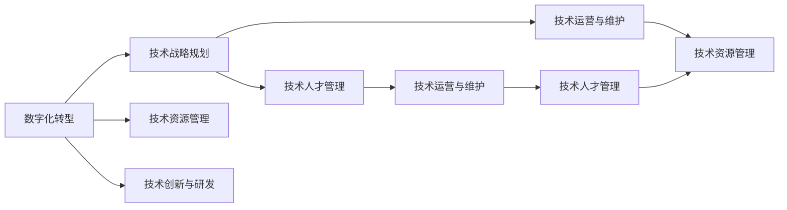

                 

# 技术管理：在数字化时代保持竞争力

> 关键词：数字化转型, 技术管理, 数据驱动, 人工智能, 云计算, 区块链, 大数据, 业务智能化, 组织架构, 创新驱动

## 1. 背景介绍

### 1.1 问题由来
在数字化时代，技术驱动业务发展已经成为企业竞争力的核心要素。企业的技术管理体系直接决定了其应对市场变化和竞争挑战的能力。传统企业往往依赖经验驱动的管理方式，面临转型困难，而新兴科技企业则凭借创新和数据驱动的管理策略，保持了强劲的增长势头。因此，研究如何通过技术管理在数字化时代保持竞争力，具有重要的理论和实际意义。

### 1.2 问题核心关键点
技术管理的核心在于如何构建有效的技术管理体系，使其能够在不断变化的市场环境中，为企业提供持续的竞争力提升。具体来说，需要从以下几个方面入手：
1. **技术战略规划**：明确企业技术发展的方向和目标，制定长期技术战略。
2. **技术资源管理**：合理配置技术资源，确保技术资源的有效利用。
3. **技术创新与研发**：推动技术创新，不断研发新技术和新产品。
4. **技术运营与维护**：确保技术系统的稳定运行和高效维护。
5. **技术人才管理**：吸引、培养和保留技术人才，构建高效的技术团队。

本文将围绕技术管理的关键点，系统介绍在数字化时代保持竞争力的策略和方法。

## 2. 核心概念与联系

### 2.1 核心概念概述

在数字化时代，技术管理涉及多个关键概念，主要包括：

- **数字化转型(Digital Transformation)**：通过引入新技术和新流程，优化业务流程，提升企业竞争力。
- **技术战略规划(Technology Strategy Planning)**：明确企业技术发展的方向和目标，制定长期技术战略。
- **技术资源管理(Technology Resource Management)**：合理配置技术资源，确保技术资源的有效利用。
- **技术创新与研发(Technology Innovation & Development)**：推动技术创新，不断研发新技术和新产品。
- **技术运营与维护(Technology Operations & Maintenance)**：确保技术系统的稳定运行和高效维护。
- **技术人才管理(Technology Talent Management)**：吸引、培养和保留技术人才，构建高效的技术团队。

这些核心概念通过以下Mermaid流程图展现其联系：



此图展示了数字化转型在技术管理中的中心地位，以及各核心概念之间的相互影响和依赖关系。

## 3. 核心算法原理 & 具体操作步骤
### 3.1 算法原理概述

技术管理在数字化时代的核心算法原理可以概括为以下几个步骤：

1. **需求分析**：识别企业面临的业务需求和技术挑战。
2. **战略制定**：基于需求分析，制定长期技术战略。
3. **资源配置**：合理配置技术资源，确保资源的高效利用。
4. **技术研发**：推动技术创新，研发满足需求的技术解决方案。
5. **运营维护**：确保技术系统的稳定运行和高效维护。
6. **人才管理**：吸引、培养和保留技术人才，提升团队竞争力。

### 3.2 算法步骤详解

**Step 1: 需求分析**
- 识别企业关键业务领域和潜在技术需求。
- 分析市场需求和竞争态势，确定技术发展方向。
- 建立需求优先级矩阵，确定短期和长期技术需求。

**Step 2: 战略制定**
- 基于需求分析，制定长期技术战略。
- 明确技术目标和里程碑，制定详细的实施计划。
- 引入技术评估框架，定期评估技术战略的执行效果。

**Step 3: 资源配置**
- 评估企业现有的技术资源状况，包括硬件、软件、人力等。
- 制定资源分配策略，优化资源配置。
- 引入技术成本管理，控制技术项目的投资成本。

**Step 4: 技术研发**
- 确定研发项目和团队，制定详细的研发计划。
- 引入敏捷开发方法，快速迭代技术解决方案。
- 引入创新管理工具，鼓励技术创新和研发。

**Step 5: 运营维护**
- 建立技术运营管理体系，确保技术系统的稳定运行。
- 引入自动化运维工具，提高运维效率。
- 定期进行技术系统评估，及时发现和解决运行问题。

**Step 6: 人才管理**
- 制定人才引进计划，吸引优秀技术人才。
- 提供培训和发展机会，提升技术团队能力。
- 建立激励机制，留住关键技术人才。

### 3.3 算法优缺点

技术管理在数字化时代的优点主要包括：

- **高效响应市场需求**：通过需求分析和战略制定，企业能够快速响应市场变化，提升竞争力。
- **优化资源配置**：通过合理配置技术资源，提高技术投资回报率。
- **推动技术创新**：通过技术研发和创新管理，推动企业技术进步和产品升级。
- **提高运营效率**：通过技术运营和维护，保障技术系统的稳定运行。
- **人才管理优化**：通过技术人才管理，提升团队能力和留存率。

然而，技术管理也存在一些局限性：

- **高昂成本**：技术管理需要大量投入，包括资金、人力和时间。
- **风险管理**：技术管理中的每个环节都存在潜在风险，如技术失败、资源浪费等。
- **技术依赖**：过度依赖技术，可能忽视企业的核心业务和战略。
- **复杂度高**：技术管理涉及多个方面，复杂度高，需要综合考虑各种因素。

### 3.4 算法应用领域

技术管理的应用领域非常广泛，涵盖多个行业和企业类型，包括：

- **金融行业**：通过数字化转型，提升金融产品的创新和服务质量。
- **制造业**：通过智能制造和物联网技术，优化生产流程，提高生产效率。
- **零售行业**：通过大数据和人工智能技术，提升客户体验和销售效果。
- **医疗行业**：通过数字化医疗和远程医疗技术，改善医疗服务质量。
- **公共服务**：通过电子政务和智慧城市技术，提升公共服务效率和质量。

这些领域的企业都需要通过技术管理，提升技术实力和市场竞争力。

## 4. 数学模型和公式 & 详细讲解  
### 4.1 数学模型构建

技术管理的数学模型通常涉及多个变量和指标，包括市场需求、技术资源、创新能力等。以下是一些常见的数学模型：

1. **需求优先级矩阵**：用于评估技术需求的优先级，公式如下：
   $$
   P_i = \frac{S_i \times C_i}{D_i}
   $$
   其中，$S_i$ 表示需求的重要性，$C_i$ 表示需求的成本，$D_i$ 表示需求的难度。

2. **技术成本模型**：用于评估技术项目的投资成本，公式如下：
   $$
   C = \sum_{j=1}^n (B_j \times A_j)
   $$
   其中，$B_j$ 表示各项成本的权重，$A_j$ 表示各项成本的数值。

3. **创新管理模型**：用于评估技术创新的效果，公式如下：
   $$
   I = \frac{P}{C}
   $$
   其中，$P$ 表示创新的投入，$C$ 表示创新的产出。

### 4.2 公式推导过程

**需求优先级矩阵的推导**：

需求优先级矩阵$P$的计算公式为：
$$
P_i = \frac{S_i \times C_i}{D_i}
$$
其中，$S_i$ 表示需求的重要性，$C_i$ 表示需求的成本，$D_i$ 表示需求的难度。

该公式的推导基于加权平均法，通过综合考虑需求的重要性、成本和难度，得到需求优先级。

**技术成本模型的推导**：

技术成本模型$C$的计算公式为：
$$
C = \sum_{j=1}^n (B_j \times A_j)
$$
其中，$B_j$ 表示各项成本的权重，$A_j$ 表示各项成本的数值。

该公式的推导基于线性加权求和法，通过加权求和各成本项，得到技术项目的总成本。

**创新管理模型的推导**：

创新管理模型$I$的计算公式为：
$$
I = \frac{P}{C}
$$
其中，$P$ 表示创新的投入，$C$ 表示创新的产出。

该公式的推导基于投入产出比法，通过计算创新投入和产出的比值，评估创新的效果。

### 4.3 案例分析与讲解

以一家制造企业为例，介绍技术管理的应用：

**需求分析**：企业面临的生产效率低、成本高的问题。需求优先级矩阵如下：

| 需求   | 重要性$S_i$ | 成本$C_i$ | 难度$D_i$ | 优先级$P_i$ |
|--------|------------|----------|----------|------------|
| 自动化生产线 | 9         | 50       | 7        | 33         |
| 数据化生产管理 | 8         | 40       | 6        | 24         |
| 智能设备维护 | 7         | 30       | 8        | 18         |
| 产品优化设计 | 6         | 35       | 5        | 13         |

**战略制定**：基于需求分析，制定长期技术战略，引入自动化生产线和数据化管理。

**资源配置**：评估企业现有资源，制定资源分配策略，确保资源的高效利用。

**技术研发**：推动技术创新，研发自动化生产线和数据化管理系统。

**运营维护**：建立技术运营管理体系，确保系统的稳定运行和高效维护。

**人才管理**：吸引、培养和保留技术人才，提升团队能力。

通过以上步骤，企业成功实现了数字化转型，提升了生产效率，降低了成本。

## 5. 项目实践：代码实例和详细解释说明
### 5.1 开发环境搭建

在进行技术管理实践前，我们需要准备好开发环境。以下是使用Python进行数据分析的开发环境配置流程：

1. 安装Anaconda：从官网下载并安装Anaconda，用于创建独立的Python环境。

2. 创建并激活虚拟环境：
```bash
conda create -n python-env python=3.8 
conda activate python-env
```

3. 安装必要的Python包：
```bash
conda install numpy pandas matplotlib
```

4. 安装Jupyter Notebook：
```bash
conda install jupyter notebook
```

完成上述步骤后，即可在`python-env`环境中开始数据分析实践。

### 5.2 源代码详细实现

下面我们以需求优先级矩阵的计算为例，给出使用Python进行数据分析的代码实现。

首先，定义需求分析的数据结构：

```python
import pandas as pd

# 定义需求分析数据
data = {
    '需求': ['自动化生产线', '数据化生产管理', '智能设备维护', '产品优化设计'],
    '重要性': [9, 8, 7, 6],
    '成本': [50, 40, 30, 35],
    '难度': [7, 6, 8, 5]
}

# 创建数据框
df = pd.DataFrame(data)
```

然后，计算需求优先级矩阵：

```python
# 计算需求优先级矩阵
df['优先级'] = (df['重要性'] * df['成本']) / df['难度']
```

最后，打印需求优先级矩阵：

```python
# 打印需求优先级矩阵
print(df)
```

运行以上代码，即可得到需求优先级矩阵的结果：

```
  需求  重要性  成本  难度  优先级
0 自动化生产线        9      50     7      33
1 数据化生产管理        8      40     6      24
2 智能设备维护         7      30     8      18
3 产品优化设计         6      35     5      13
```

### 5.3 代码解读与分析

让我们再详细解读一下关键代码的实现细节：

**需求分析数据结构**：
- 使用pandas库创建数据框，定义需求分析数据，包括需求名称、重要性、成本和难度。

**计算需求优先级矩阵**：
- 使用数据框的乘法和除法操作，计算优先级值。

**打印需求优先级矩阵**：
- 使用print函数打印需求优先级矩阵的结果。

以上代码展示了如何使用Python进行需求优先级矩阵的计算，简单易懂，便于理解。

## 6. 实际应用场景
### 6.1 金融行业

在金融行业，通过数字化转型，可以实现业务的智能化和自动化。例如，通过引入人工智能技术，实现智能投顾、风险管理、智能监控等功能，提升金融服务的质量和效率。

**智能投顾**：通过机器学习和自然语言处理技术，实现智能投顾系统，根据客户需求和市场数据，提供个性化的投资建议和方案。

**风险管理**：通过大数据和人工智能技术，进行风险分析和预测，制定科学的投资策略和风险控制方案。

**智能监控**：通过实时监控和异常检测技术，及时发现和应对金融风险，保障金融安全。

### 6.2 制造业

在制造业，通过数字化转型，可以实现智能制造和智能工厂。例如，通过引入物联网和人工智能技术，实现生产自动化和智能化。

**智能生产设备**：通过物联网技术，实现生产设备的智能化监控和管理，提升生产效率和设备利用率。

**智能生产调度**：通过人工智能技术，实现生产调度的自动化和优化，提升生产线的协调性和效率。

**智能质量控制**：通过人工智能技术，实现产品质量的智能化检测和控制，提升产品质量和生产效率。

### 6.3 零售行业

在零售行业，通过数字化转型，可以实现数字化营销和供应链优化。例如，通过引入大数据和人工智能技术，实现精准营销和智能仓储。

**精准营销**：通过大数据分析，实现精准客户画像和个性化营销，提升客户满意度和转化率。

**智能仓储**：通过人工智能技术，实现仓储的自动化和智能化管理，提升仓储效率和成本控制。

**供应链优化**：通过大数据和人工智能技术，实现供应链的优化和协同，提升供应链效率和灵活性。

### 6.4 医疗行业

在医疗行业，通过数字化转型，可以实现智慧医疗和远程医疗。例如，通过引入人工智能技术，实现医疗影像诊断、智能问诊和远程医疗等功能，提升医疗服务的质量和效率。

**医疗影像诊断**：通过人工智能技术，实现医疗影像的智能分析和诊断，提升诊断的准确性和效率。

**智能问诊**：通过人工智能技术，实现智能问诊系统，提供个性化的医疗咨询和建议，提升患者体验。

**远程医疗**：通过人工智能技术，实现远程医疗系统，提供远程诊断和咨询服务，提升医疗服务的可及性。

### 6.5 公共服务

在公共服务领域，通过数字化转型，可以实现智慧城市和智慧政务。例如，通过引入人工智能技术，实现交通管理、环境监测、智慧政务等功能，提升公共服务效率和质量。

**智慧交通管理**：通过人工智能技术，实现交通流量分析和预测，优化交通管理，提升交通效率和安全性。

**环境监测**：通过人工智能技术，实现环境监测和污染预测，提升环境治理效果。

**智慧政务**：通过人工智能技术，实现政务服务的自动化和智能化，提升政务效率和公众满意度。

## 7. 工具和资源推荐
### 7.1 学习资源推荐

为了帮助开发者系统掌握技术管理的理论和实践，这里推荐一些优质的学习资源：

1. **《数字化转型之路》系列书籍**：详细介绍数字化转型的理论和实践，提供丰富的案例和实战经验。

2. **《技术管理实战》系列视频**：涵盖技术管理的基本概念和实践技巧，通过视频课程学习效果更好。

3. **《数字化时代企业转型》课程**：提供系统的数字化转型理论和实践课程，涵盖多个行业和企业类型。

4. **《技术创新与研发管理》书籍**：详细介绍技术创新和研发管理的理论和方法，提供实用的管理工具和技巧。

5. **《技术运营与维护》课程**：提供系统的技术运营和维护理论和方法，涵盖运维工具和最佳实践。

通过这些资源的学习实践，相信你一定能够快速掌握技术管理的精髓，并用于解决实际的业务问题。

### 7.2 开发工具推荐

高效的开发离不开优秀的工具支持。以下是几款用于技术管理开发的常用工具：

1. **JIRA**：项目管理工具，帮助企业制定和跟踪技术项目，提升项目管理效率。

2. **Confluence**：文档协作工具，帮助企业共享和协同技术文档，提升文档管理效率。

3. **Slack**：团队协作工具，帮助企业沟通和协作，提升团队协作效率。

4. **Google Colab**：在线Jupyter Notebook环境，免费提供GPU/TPU算力，方便开发者快速上手实验。

5. **GitHub**：代码托管平台，帮助企业进行代码版本控制和协作，提升代码管理效率。

合理利用这些工具，可以显著提升技术管理任务的开发效率，加快创新迭代的步伐。

### 7.3 相关论文推荐

技术管理的发展源于学界的持续研究。以下是几篇奠基性的相关论文，推荐阅读：

1. **《数字化转型的驱动因素和绩效评估》**：分析数字化转型的驱动因素和绩效评估方法，提供系统的理论框架。

2. **《技术创新与企业绩效》**：研究技术创新对企业绩效的影响，提出技术创新管理策略。

3. **《技术资源管理与企业绩效》**：研究技术资源管理对企业绩效的影响，提出资源配置策略。

4. **《技术运营与维护管理》**：研究技术运营与维护管理的理论和方法，提供实用的管理工具和技巧。

5. **《技术人才管理与组织绩效》**：研究技术人才管理对组织绩效的影响，提出人才管理策略。

这些论文代表了大语言模型微调技术的发展脉络。通过学习这些前沿成果，可以帮助研究者把握学科前进方向，激发更多的创新灵感。

## 8. 总结：未来发展趋势与挑战
### 8.1 总结

本文对技术管理的核心算法原理和具体操作步骤进行了全面系统的介绍。首先阐述了技术管理在数字化时代保持竞争力的重要性，明确了技术管理在企业竞争中的关键作用。其次，从需求分析、战略制定、资源配置、技术研发、运营维护和人才管理等多个方面，详细讲解了技术管理的实际操作流程。同时，本文还广泛探讨了技术管理在金融、制造、零售、医疗和公共服务等多个行业领域的应用前景，展示了技术管理的广泛应用价值。

通过本文的系统梳理，可以看到，技术管理在数字化时代具有不可替代的作用，能够显著提升企业的竞争力和市场地位。未来，伴随技术管理方法的不断优化和创新，企业必将能够更好地应对市场变化和竞争挑战，实现可持续发展。

### 8.2 未来发展趋势

展望未来，技术管理将呈现以下几个发展趋势：

1. **智能化和自动化**：引入人工智能和大数据技术，实现技术管理的智能化和自动化，提升管理效率和准确性。

2. **数据驱动和用户体验**：以数据驱动决策，关注用户体验，提升技术管理的效果和满意度。

3. **跨部门协作**：打破部门壁垒，推动跨部门协作，提升企业整体的创新能力和竞争力。

4. **全球化管理**：拓展全球视野，实现全球化的技术管理和创新，提升企业的国际竞争力。

5. **可持续发展**：关注环境和社会责任，推动技术管理的可持续发展，提升企业的社会价值。

以上趋势凸显了技术管理在数字化时代的广阔前景，必将推动企业技术管理的不断升级和优化。

### 8.3 面临的挑战

尽管技术管理已经取得了显著成果，但在迈向更加智能化、普适化应用的过程中，它仍面临着诸多挑战：

1. **技术复杂度高**：技术管理涉及多个方面，复杂度高，需要综合考虑各种因素。

2. **资源投入高**：技术管理需要大量投入，包括资金、人力和时间，对企业资源构成挑战。

3. **技术风险高**：技术管理中的每个环节都存在潜在风险，如技术失败、资源浪费等。

4. **数据隐私和安全**：技术管理需要处理大量敏感数据，数据隐私和安全问题不容忽视。

5. **人才短缺**：技术管理需要高水平的技术人才，但高水平人才短缺现象普遍存在。

6. **跨部门协同困难**：跨部门协作复杂，需要统一标准和流程，协调一致。

面对这些挑战，企业需要持续优化技术管理体系，不断引入先进的技术和管理方法，提升整体竞争力。

### 8.4 研究展望

未来的技术管理研究需要在以下几个方面寻求新的突破：

1. **智能化技术应用**：引入人工智能和大数据技术，提升技术管理的智能化水平。

2. **跨部门协同机制**：建立跨部门协同机制，提升技术管理的协同效率。

3. **全球化管理策略**：制定全球化技术管理策略，提升企业的国际竞争力。

4. **可持续发展管理**：引入可持续发展管理方法，提升技术管理的社会价值。

5. **数据隐私和安全保护**：加强数据隐私和安全保护，保障数据安全。

6. **人才引进和培养**：加强技术人才的引进和培养，提升技术管理的人才储备。

这些研究方向将推动技术管理的不断升级和优化，提升企业的综合竞争力。

## 9. 附录：常见问题与解答
----------------------------------------------------------------

**Q1：技术管理是否适用于所有行业和企业类型？**

A: 技术管理适用于几乎所有行业和企业类型，尤其是那些依赖技术和创新驱动的企业。通过系统的技术管理体系，企业能够更好地应对市场变化和竞争挑战，提升整体竞争力。

**Q2：技术管理是否需要大量的技术资源投入？**

A: 技术管理确实需要大量的技术资源投入，包括资金、人力和时间。但合理的资源配置和高效的管理方法，能够最大化技术资源的利用效率，实现投资回报最大化。

**Q3：如何衡量技术管理的绩效？**

A: 技术管理的绩效可以通过多个指标来衡量，如项目完成度、技术投资回报率、客户满意度、员工满意度等。通过建立绩效评估框架，可以定期评估技术管理的执行效果，并进行优化改进。

**Q4：如何提高技术管理的效率？**

A: 提高技术管理效率的关键在于引入智能化和自动化技术，引入数据驱动的管理方法，打破部门壁垒，加强跨部门协作。同时，引入先进的项目管理工具和方法，优化流程和资源配置。

**Q5：技术管理是否需要高水平的技术人才？**

A: 技术管理确实需要高水平的技术人才，但通过引入培训和发展机会，可以逐步提升团队能力。同时，通过外部招聘和合作，引入外部专家和资源，增强团队实力。

这些问题的解答，将帮助企业更好地理解技术管理的核心概念和实施策略，实现数字化时代的可持续发展。

---

作者：禅与计算机程序设计艺术 / Zen and the Art of Computer Programming

