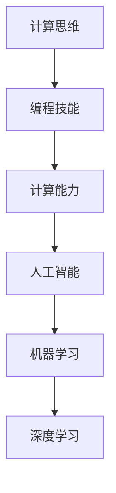

                 

# 技能提升：适应人类计算时代的需求

> 关键词：人工智能技能, 计算能力提升, 职业发展, 技术学习路径, 技能提升策略, 计算思维培养, 未来技术趋势

## 1. 背景介绍

### 1.1 问题由来
随着技术的迅猛发展和计算机技术的普及，计算已经从专业人士的专利变为普通人的日常工具。现代计算不再仅限于办公室或实验室，而是无处不在，无论是智能手机、智能家居、医疗设备，还是交通工具，几乎所有设备都内置了强大的计算能力。在这样的背景下，掌握必要的计算技能，不仅能够提升个人工作效率，还能在日常生活中带来更多便利。

### 1.2 问题核心关键点
本文旨在探讨如何通过技能提升，适应这一变革时代的需求。我们的目标不仅是提高计算技能，更重要的是掌握计算机科学的基础知识，理解计算思维，能够应用计算机解决问题，并从中获得启示。

### 1.3 问题研究意义
掌握必要的计算技能和计算思维，对于个人职业发展、提升工作效率、保持与时代同步具有重要意义。无论是IT专业人员，还是从事其他领域的工作者，计算技能都已成为不可或缺的核心竞争力。本研究旨在为不同背景的读者提供一份全面的技能提升指南，帮助他们在计算时代中游刃有余。

## 2. 核心概念与联系

### 2.1 核心概念概述

为更好地理解适应人类计算时代的需求，本节将介绍几个密切相关的核心概念：

- **计算思维(Computational Thinking)**：指用计算方法来理解、分析和解决问题的一种思维方式。它超越了具体的编程技能，强调问题的抽象、逻辑推理和算法设计。
- **编程技能(Programming Skills)**：指编写代码、调试程序、优化算法等编程活动的能力。编程是实现计算思维的重要手段。
- **计算能力(Computational Capability)**：指使用计算机解决问题的能力，包括数据分析、算法设计、系统设计等。
- **人工智能(AI)**：指让计算机系统模拟人类智能行为，包括学习、推理、规划、感知等能力。人工智能的核心在于通过算法和数据训练模型，从而实现高效、准确的决策。
- **机器学习(Machine Learning)**：指让计算机通过数据学习规律，自动改进算法和模型，以提高性能和准确性。它是人工智能的重要分支之一。
- **深度学习(Deep Learning)**：指通过构建深层神经网络，自动从数据中提取复杂特征，从而实现高效、准确的数据处理和预测。它是机器学习的重要分支，在图像识别、语音识别、自然语言处理等领域应用广泛。

这些核心概念之间的逻辑关系可以通过以下Mermaid流程图来展示：



这个流程图展示了一些关键概念之间的联系：

1. 计算思维是理解和设计算法的基础。
2. 编程技能是实现计算思维的具体手段。
3. 计算能力是在编程技能基础上，通过算法和数据应用计算机解决问题的能力。
4. 人工智能是通过计算能力和机器学习实现的高级智能。
5. 深度学习是机器学习的一种重要形式，用于处理复杂的数据和模式。

## 3. 核心算法原理 & 具体操作步骤
### 3.1 算法原理概述

适应人类计算时代的需求，核心在于掌握计算思维和计算能力，能够利用计算机解决实际问题。这涉及到算法设计、数据处理、模型训练等多个方面。

算法设计是计算思维的重要组成部分，指通过设计合理的算法来解决问题。算法设计通常包括问题建模、算法选择、算法优化等步骤。

数据处理是计算能力的重要体现，指通过数据清洗、数据转换、数据分析等步骤，从原始数据中提取有用的信息。数据处理是人工智能和机器学习的核心任务之一。

模型训练是利用数据和算法构建预测模型，通常通过反向传播等方法优化模型参数，使得模型在特定任务上表现最优。

### 3.2 算法步骤详解

适应人类计算时代的需求，主要包括以下几个关键步骤：

**Step 1: 了解计算思维**
- 理解计算思维的基本概念和核心思想。
- 学习经典的计算思维案例，如分治、递归、动态规划等。
- 掌握计算思维在不同领域的实际应用，如生物信息学、游戏设计、金融分析等。

**Step 2: 掌握编程技能**
- 选择合适的编程语言和开发工具，如Python、Java、C++等。
- 学习基本编程概念，如变量、函数、类、继承等。
- 实践编程项目，如网站开发、数据分析、自动化测试等，提升编程技能。

**Step 3: 理解计算能力**
- 学习数据处理和分析的基本方法，如数据清洗、数据可视化、统计分析等。
- 掌握算法设计和优化的技巧，如时间复杂度分析、空间复杂度分析、数据结构设计等。
- 理解人工智能和机器学习的基本原理，如监督学习、无监督学习、强化学习等。

**Step 4: 应用计算思维和计算能力**
- 结合实际问题，应用计算思维和计算能力进行问题建模和算法设计。
- 通过编程实践，构建和优化模型，提升问题解决的效率和准确性。
- 不断学习新知识，掌握最新技术和工具，保持与时代同步。

### 3.3 算法优缺点

适应人类计算时代的需求，具有以下优点：
1. 提升问题解决能力。通过计算思维和计算能力，能够高效解决各种实际问题，提升工作效率。
2. 拓宽职业发展路径。掌握计算技能和思维，不仅限于IT领域，还可以应用于金融、医疗、教育等众多领域。
3. 增强创新能力。计算思维和计算能力强调问题抽象和算法设计，能够激发更多的创新想法和解决方案。

同时，该方法也存在一定的局限性：
1. 学习曲线陡峭。需要花费大量时间和精力学习计算思维和计算能力，可能短期内难以见效。
2. 应用范围有限。计算思维和计算能力主要适用于结构化问题和数据分析，对非结构化问题的处理可能效果不佳。
3. 技术更新快。随着技术的不断发展，新的工具和技术层出不穷，需要不断学习才能保持领先。

尽管存在这些局限性，但就目前而言，掌握计算思维和计算能力是适应人类计算时代需求的重要途径。未来相关研究的重点在于如何进一步降低学习门槛，提高应用效率，同时兼顾可解释性和伦理安全性等因素。

### 3.4 算法应用领域

计算思维和计算能力的应用领域非常广泛，以下列举几个典型应用：

- **软件开发**：软件开发需要良好的计算思维，能够设计和实现高效的算法和数据结构。
- **数据分析**：数据分析需要理解和应用统计学和机器学习知识，提取有价值的信息，支持决策和优化。
- **人工智能**：人工智能需要设计复杂的算法和模型，进行数据训练和优化，实现高效智能决策。
- **生物信息学**：生物信息学需要应用计算思维和计算能力，处理和分析生物数据，支持生物研究和技术开发。
- **金融分析**：金融分析需要理解金融市场的规律和特征，应用机器学习模型进行风险评估和投资决策。
- **医疗健康**：医疗健康需要应用计算思维和计算能力，处理和分析医疗数据，支持诊断和治疗决策。

## 4. 数学模型和公式 & 详细讲解 & 举例说明

### 4.1 数学模型构建

计算思维和计算能力的核心在于算法设计和模型训练，这涉及到大量的数学模型和公式。以下以简单的线性回归模型为例，进行详细讲解。

假设有一个数据集 $(x_i, y_i)$，其中 $x_i \in \mathbb{R}^n$ 为输入特征，$y_i \in \mathbb{R}$ 为输出标签。我们的目标是找到一个线性模型 $y=f(x;w)=\sum_{i=1}^n w_ix_i$，使得预测值与真实值尽可能接近。

### 4.2 公式推导过程

线性回归模型的最小二乘法公式为：

$$
\hat{w} = \arg\min_{w} \sum_{i=1}^n (y_i - f(x_i;w))^2
$$

根据梯度下降算法，可以将上述优化问题转化为求解最小化目标函数：

$$
L(w) = \frac{1}{2}\sum_{i=1}^n (y_i - \sum_{j=1}^n w_jx_{ij})^2
$$

其中 $w=(w_1, w_2, \dots, w_n)$ 为模型参数。求导得到梯度：

$$
\nabla_{w}L(w) = \sum_{i=1}^n (y_i - \sum_{j=1}^n w_jx_{ij})x_{ij}
$$

通过反向传播算法，更新模型参数 $w$：

$$
w \leftarrow w - \eta \nabla_{w}L(w)
$$

其中 $\eta$ 为学习率。

### 4.3 案例分析与讲解

以房价预测为例，应用线性回归模型进行训练。假设有一个包含房价和面积的数据集，使用最小二乘法进行训练。

**Step 1: 数据准备**
- 收集房价和面积的数据集，分为训练集和测试集。
- 对数据进行标准化处理，使得不同特征具有相似的规模。

**Step 2: 模型训练**
- 初始化模型参数 $w=(0, 0)$。
- 迭代训练，更新参数 $w$。
- 在测试集上评估模型效果，计算均方误差等指标。

**Step 3: 模型应用**
- 将新的房价和面积数据输入模型，得到预测房价。
- 对比预测值和真实值，评估模型效果。

通过这个案例，我们可以看到，掌握计算思维和计算能力，能够利用数学模型解决实际问题。掌握这种能力，可以应用于各种领域，如金融预测、市场营销、供应链管理等。

## 5. 项目实践：代码实例和详细解释说明
### 5.1 开发环境搭建

在进行项目实践前，我们需要准备好开发环境。以下是使用Python进行项目开发的常见环境配置流程：

1. 安装Anaconda：从官网下载并安装Anaconda，用于创建独立的Python环境。

2. 创建并激活虚拟环境：
```bash
conda create -n my_env python=3.8 
conda activate my_env
```

3. 安装PyTorch：根据CUDA版本，从官网获取对应的安装命令。例如：
```bash
conda install pytorch torchvision torchaudio cudatoolkit=11.1 -c pytorch -c conda-forge
```

4. 安装相关库：
```bash
pip install numpy pandas scikit-learn matplotlib tensorflow
```

完成上述步骤后，即可在`my_env`环境中开始项目实践。

### 5.2 源代码详细实现

下面以房价预测项目为例，给出使用PyTorch进行线性回归的PyTorch代码实现。

首先，准备数据集：

```python
import pandas as pd
import numpy as np

data = pd.read_csv('house_price.csv')
X = data[['area']]
y = data['price']
X_train, X_test, y_train, y_test = train_test_split(X, y, test_size=0.2, random_state=42)
```

然后，定义模型和损失函数：

```python
import torch
from torch import nn, optim

class LinearRegression(nn.Module):
    def __init__(self, n_features):
        super().__init__()
        self.linear = nn.Linear(n_features, 1)
        
    def forward(self, x):
        return self.linear(x)

model = LinearRegression(n_features=X_train.shape[1])

criterion = nn.MSELoss()
```

接着，定义训练和评估函数：

```python
def train(model, data_loader, optimizer, criterion, n_epochs=1000, learning_rate=0.01):
    model.train()
    for epoch in range(n_epochs):
        for batch in data_loader:
            inputs, labels = batch
            optimizer.zero_grad()
            outputs = model(inputs)
            loss = criterion(outputs, labels)
            loss.backward()
            optimizer.step()
            
    return model

def evaluate(model, data_loader):
    model.eval()
    total_loss = 0
    for batch in data_loader:
        inputs, labels = batch
        outputs = model(inputs)
        loss = criterion(outputs, labels)
        total_loss += loss.item() * inputs.shape[0]
    return total_loss / len(data_loader.dataset)
```

最后，启动训练流程并在测试集上评估：

```python
n_features = X_train.shape[1]
n_epochs = 1000
learning_rate = 0.01

train_loader = torch.utils.data.DataLoader(X_train.values, y_train.values)
test_loader = torch.utils.data.DataLoader(X_test.values, y_test.values)

optimizer = optim.SGD(model.parameters(), lr=learning_rate, momentum=0.9)

trained_model = train(model, train_loader, optimizer, criterion, n_epochs, learning_rate)

test_loss = evaluate(trained_model, test_loader)
print(f'Test loss: {test_loss:.3f}')
```

以上就是使用PyTorch进行房价预测项目开发的完整代码实现。可以看到，通过简单的数学模型和PyTorch库，我们能够快速实现线性回归模型，并应用到实际项目中。

### 5.3 代码解读与分析

让我们再详细解读一下关键代码的实现细节：

**数据准备**：
- 使用pandas库读取CSV文件，进行数据预处理。
- 使用train_test_split函数将数据集分为训练集和测试集。

**模型定义**：
- 定义一个线性回归模型，包含一个线性层，将输入特征映射到输出标签。
- 使用nn.Module类定义模型，通过forward方法实现前向传播。

**损失函数**：
- 定义均方误差损失函数，用于计算预测值与真实值之间的差异。

**训练和评估函数**：
- 在训练函数中，通过梯度下降算法更新模型参数，最小化损失函数。
- 在评估函数中，计算模型在测试集上的平均损失。

**训练流程**：
- 定义模型的输入特征和输出标签，创建数据加载器。
- 定义优化器，使用随机梯度下降算法进行参数更新。
- 调用训练函数，进行多次迭代训练。
- 调用评估函数，计算测试集上的平均损失。

通过这个项目，我们不仅掌握了PyTorch的基本使用方法，还理解了数据准备、模型定义、损失函数、训练评估等关键步骤，能够利用计算能力解决实际问题。

## 6. 实际应用场景
### 6.1 软件开发

软件开发需要良好的计算思维，能够设计和实现高效的算法和数据结构。掌握计算思维和计算能力，可以提升软件开发效率，降低开发成本。

**案例1: 数据结构设计**
- 设计高效的数据结构，如哈希表、树、图等，优化算法效率。
- 使用算法分析工具，如时间复杂度分析，优化算法性能。

**案例2: 编译器开发**
- 设计和实现编译器，将高级语言翻译成机器语言。
- 应用计算思维，优化编译器性能和安全性。

**案例3: 自动化测试**
- 设计自动化测试框架，提升软件测试效率。
- 应用计算思维，优化测试用例设计。

### 6.2 数据分析

数据分析需要理解和应用统计学和机器学习知识，提取有价值的信息，支持决策和优化。掌握计算思维和计算能力，可以提升数据分析效率，提高数据驱动的决策质量。

**案例1: 数据清洗**
- 处理缺失数据、重复数据、异常数据等，保证数据质量。
- 应用计算思维，设计高效的数据清洗算法。

**案例2: 数据可视化**
- 使用可视化工具，如Matplotlib、Seaborn等，展示数据分析结果。
- 应用计算思维，优化数据可视化算法，提升用户体验。

**案例3: 预测建模**
- 应用机器学习算法，如线性回归、决策树、随机森林等，构建预测模型。
- 应用计算思维，优化模型性能，提升预测准确性。

### 6.3 人工智能

人工智能需要设计复杂的算法和模型，进行数据训练和优化，实现高效智能决策。掌握计算思维和计算能力，可以提升人工智能应用效率，推动技术发展。

**案例1: 图像识别**
- 设计和实现卷积神经网络，进行图像分类、目标检测等任务。
- 应用计算思维，优化模型结构，提升识别准确性。

**案例2: 语音识别**
- 设计和实现循环神经网络，进行语音识别、语音合成等任务。
- 应用计算思维，优化模型性能，提升识别和合成效果。

**案例3: 自然语言处理**
- 设计和实现Transformer模型，进行文本分类、情感分析、机器翻译等任务。
- 应用计算思维，优化模型性能，提升处理效率和效果。

### 6.4 未来应用展望

随着计算技术的发展和应用领域的拓展，计算思维和计算能力的需求将更加广泛。未来，计算思维和计算能力的应用将进一步渗透到更多领域，为各行各业带来新的突破。

在智慧医疗领域，计算思维和计算能力可以用于疾病预测、基因分析、影像诊断等，提升医疗服务的智能化水平。

在智能交通领域，计算思维和计算能力可以用于交通流量预测、自动驾驶、智能调度等，提升交通系统的自动化和智能化水平。

在智能制造领域，计算思维和计算能力可以用于生产优化、质量控制、供应链管理等，提升生产效率和质量。

在智能城市领域，计算思维和计算能力可以用于城市管理、环境监测、公共安全等，提升城市管理的智能化水平。

未来，随着计算技术的不断进步，计算思维和计算能力的应用将更加广泛，为各行各业带来新的变革。

## 7. 工具和资源推荐
### 7.1 学习资源推荐

为了帮助开发者系统掌握计算思维和计算能力，这里推荐一些优质的学习资源：

1. 《计算机程序设计艺术》系列书籍：由计算机科学大师Donald E. Knuth所著，深入浅出地讲解了计算思维和算法设计的基本概念和方法。

2. Coursera《计算机科学导论》课程：由普林斯顿大学开设的计算机科学入门课程，涵盖计算机科学的各个分支，包括算法、数据结构、操作系统等。

3. edX《人工智能基础》课程：由麻省理工学院和哈佛大学联合开设的人工智能入门课程，涵盖机器学习、深度学习、自然语言处理等核心技术。

4. Udacity《深度学习纳米学位》课程：涵盖深度学习的基本概念、算法和应用，适合有一定编程基础的初学者。

5. Kaggle数据科学竞赛：参与实际数据科学竞赛，提升数据处理、模型训练和优化能力。

通过这些资源的学习实践，相信你一定能够快速掌握计算思维和计算能力的精髓，并用于解决实际的计算问题。

### 7.2 开发工具推荐

高效的开发离不开优秀的工具支持。以下是几款用于计算思维和计算能力开发的常用工具：

1. Python：一种广泛使用的编程语言，具有丰富的科学计算和数据分析库，如NumPy、Pandas、SciPy等。

2. R：一种数据科学和统计分析语言，具有强大的数据处理和可视化能力，如ggplot2、dplyr等。

3. MATLAB：一种广泛应用于工程、科学、金融等领域的软件，具有强大的数值计算和可视化功能。

4. Jupyter Notebook：一种交互式编程环境，支持多种编程语言和数据处理库，适合做数据分析和模型训练。

5. Visual Studio Code：一种轻量级、跨平台的代码编辑器，支持丰富的扩展和插件，适合多种编程语言和工具链的开发。

6. Git和GitHub：版本控制工具和代码托管平台，支持多人协作开发和代码管理。

合理利用这些工具，可以显著提升计算思维和计算能力开发的效率，加快创新迭代的步伐。

### 7.3 相关论文推荐

计算思维和计算能力的发展源于学界的持续研究。以下是几篇奠基性的相关论文，推荐阅读：

1. "Computational Thinking: What and Why"（计算机思维是什么和为什么）：由Jeannette M. Wing教授所写，详细介绍了计算机思维的核心思想和应用。

2. "What Every Computer Scientist Should Know About Machine Learning"（每个计算机科学家都应该知道机器学习的什么）：由Tom Mitchell教授所写，介绍了机器学习的基本概念和方法。

3. "Deep Learning"（深度学习）：由Ian Goodfellow等学者所写，详细介绍了深度学习的基本概念、算法和应用。

4. "Artificial Intelligence: A Modern Approach"（人工智能：现代方法）：由Stuart Russell和Peter Norvig所写，涵盖人工智能的基本概念和算法。

这些论文代表了大计算思维和计算能力的发展脉络。通过学习这些前沿成果，可以帮助研究者把握学科前进方向，激发更多的创新灵感。

## 8. 总结：未来发展趋势与挑战
### 8.1 总结

本文对如何通过技能提升，适应人类计算时代的需求进行了全面系统的介绍。首先阐述了计算思维和计算能力的研究背景和意义，明确了计算思维和计算能力在适应计算时代需求中的重要地位。其次，从原理到实践，详细讲解了计算思维和计算能力的核心步骤，给出了项目开发的完整代码实例。同时，本文还广泛探讨了计算思维和计算能力在软件开发、数据分析、人工智能等多个领域的应用前景，展示了其巨大的潜力。此外，本文精选了计算思维和计算能力的各类学习资源，力求为读者提供全方位的技术指引。

通过本文的系统梳理，可以看到，掌握计算思维和计算能力是适应人类计算时代需求的重要途径。这些技能不仅能够提升工作效率，还能在日常生活中带来更多便利。未来，随着计算技术的发展和应用领域的拓展，计算思维和计算能力的需求将更加广泛，为各行各业带来新的突破。

### 8.2 未来发展趋势

适应人类计算时代的需求，核心在于掌握计算思维和计算能力，能够利用计算机解决实际问题。这涉及到算法设计、数据处理、模型训练等多个方面。

计算思维和计算能力的发展趋势包括以下几个方面：

1. 技术不断进步。随着算力、数据、模型的不断进步，计算思维和计算能力的工具和应用将更加强大。

2. 应用领域拓展。计算思维和计算能力的应用将渗透到更多领域，如智慧医疗、智能交通、智能制造等。

3. 数据驱动决策。计算思维和计算能力的核心在于数据处理和分析，未来将更多地依赖数据驱动决策。

4. 跨学科融合。计算思维和计算能力将与更多学科进行融合，提升跨学科研究和应用能力。

5. 人机协同。计算思维和计算能力将更多地与人类智慧结合，实现人机协同决策。

6. 计算普适化。计算思维和计算能力将普及到更广泛的人群，提升全民计算能力。

7. 社会责任。计算思维和计算能力的普及将带来更多的社会责任和伦理挑战，需不断优化相关技术和应用。

这些趋势凸显了计算思维和计算能力的广阔前景。这些方向的探索发展，必将进一步提升计算技术的普适性和智能化水平，为人类社会带来新的变革。

### 8.3 面临的挑战

尽管计算思维和计算能力的应用前景广阔，但在迈向更加智能化、普适化应用的过程中，它仍面临着诸多挑战：

1. 学习曲线陡峭。计算思维和计算能力需要一定的数学和编程基础，学习门槛较高。

2. 数据处理复杂。大量数据处理的复杂性和多样性，增加了计算思维和计算能力的实施难度。

3. 技术更新快。计算思维和计算能力的工具和技术更新速度较快，需要不断学习和适应。

4. 伦理和安全问题。计算思维和计算能力的应用可能带来数据隐私、算法偏见等问题，需不断优化相关技术。

5. 应用场景多变。计算思维和计算能力的应用场景复杂多样，需不断调整和优化。

6. 计算资源有限。计算思维和计算能力的应用需要强大的计算资源支持，这在资源有限的场景下可能受到限制。

正视计算思维和计算能力面临的这些挑战，积极应对并寻求突破，将使其在计算时代中发挥更大作用。相信随着学界和产业界的共同努力，这些挑战终将一一被克服，计算思维和计算能力必将在构建智能社会中扮演越来越重要的角色。

### 8.4 研究展望

面对计算思维和计算能力所面临的挑战，未来的研究需要在以下几个方面寻求新的突破：

1. 降低学习门槛。通过简化计算思维和计算能力的概念和工具，降低学习门槛，普及计算技能。

2. 优化数据处理。设计高效的数据处理算法和工具，提升数据处理效率和效果。

3. 提高计算效率。应用计算思维和计算能力，优化算法和模型，提升计算效率和效果。

4. 增强数据驱动决策。利用计算思维和计算能力，提升数据驱动决策的质量和效果。

5. 提升人机协同。通过计算思维和计算能力，优化人机协同决策，提升决策效率和效果。

6. 强化伦理和责任。在计算思维和计算能力的普及过程中，强化伦理和责任意识，确保技术应用符合人类价值观和伦理道德。

这些研究方向的探索，必将引领计算思维和计算能力迈向更高的台阶，为构建智能社会提供更强大的技术支撑。面向未来，计算思维和计算能力还需要与其他人工智能技术进行更深入的融合，如知识表示、因果推理、强化学习等，多路径协同发力，共同推动计算技术的进步。只有勇于创新、敢于突破，才能不断拓展计算技术的边界，让计算技术更好地造福人类社会。

## 9. 附录：常见问题与解答

**Q1：计算思维和计算能力是否适用于所有领域？**

A: 计算思维和计算能力适用范围广泛，但不同领域的应用方法和侧重点有所不同。例如，软件开发更侧重算法设计，数据分析更侧重数据处理和模型训练，人工智能更侧重模型优化和应用部署。

**Q2：如何提升计算思维和计算能力？**

A: 提升计算思维和计算能力需要不断学习和实践，可以通过以下途径：

1. 学习数学和编程基础。掌握数学和编程基本概念，为计算思维和计算能力打下基础。

2. 实践编程项目。通过实际项目实践，掌握编程技巧和计算思维。

3. 学习相关课程。参加计算机科学和数据科学相关课程，提升理论知识和实践能力。

4. 参与开源项目。参与开源项目，学习和贡献计算思维和计算能力相关的工具和应用。

5. 阅读相关书籍和论文。阅读经典计算思维和计算能力的书籍和论文，理解前沿思想和应用。

**Q3：计算思维和计算能力在实际应用中面临哪些挑战？**

A: 计算思维和计算能力在实际应用中面临以下挑战：

1. 数据质量问题。数据质量差、数据量少、数据标注困难等问题，可能影响计算思维和计算能力的效果。

2. 计算资源限制。大规模计算资源的需求可能限制计算思维和计算能力的应用范围。

3. 技术复杂性。计算思维和计算能力的实现需要复杂的技术和算法，可能需要较长时间学习和实践。

4. 伦理和安全问题。计算思维和计算能力的应用可能带来数据隐私、算法偏见等问题，需不断优化相关技术。

5. 多学科融合。计算思维和计算能力需要与更多学科进行融合，提升跨学科研究和应用能力。

通过正视这些挑战，积极应对并寻求突破，计算思维和计算能力必将在计算时代中发挥更大作用。

**Q4：如何利用计算思维和计算能力提升工作效率？**

A: 利用计算思维和计算能力提升工作效率，可以通过以下途径：

1. 应用自动化工具。使用自动化工具，如脚本、工具链、框架等，提升工作效率。

2. 优化工作流程。通过计算思维和计算能力，优化工作流程，提升工作质量。

3. 应用数据分析。利用数据分析，优化决策和资源分配，提升工作效率。

4. 应用模型优化。通过模型优化，提升数据处理和预测效果，提升工作效率。

5. 应用算法优化。通过算法优化，提升计算效率和效果，提升工作效率。

通过这些方法，可以充分利用计算思维和计算能力，提升工作效率和质量。

---

作者：禅与计算机程序设计艺术 / Zen and the Art of Computer Programming

