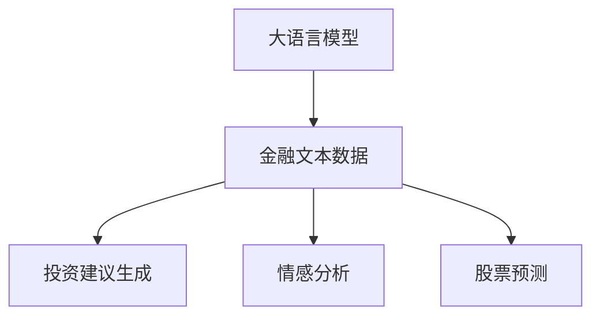

                 

# 投资管理：LLM 驱动的策略

在当今快速变化的金融市场环境中，传统投资管理方法已经逐渐显示出其局限性。幸运的是，随着大语言模型(Large Language Models, LLMs)的崛起，一种全新的投资管理范式正在形成。本文将详细探讨LLM在投资管理中的应用，包括核心概念、算法原理、具体操作步骤、实际应用场景及未来发展趋势等，旨在为投资者提供一种基于深度学习的投资决策策略。

## 1. 背景介绍

### 1.1 问题由来

随着金融市场复杂性的不断增加，投资决策过程变得更加复杂和动态。投资者需要处理海量的信息，并从中提取有价值的模式。然而，传统的基于规则和统计的模型往往难以捕捉到复杂的市场动态和行为特征。

大语言模型在处理自然语言任务上表现出色，其具备的强大语言理解和生成能力，为投资管理提供了一种新的视角。通过训练大语言模型，可以挖掘市场新闻、社交媒体、公司报告等文本数据中的信息，并自动生成投资建议。

### 1.2 问题核心关键点

- **大语言模型**：利用自回归或自编码模型在大量文本数据上预训练的语言模型。
- **投资管理**：使用大语言模型对金融市场信息进行理解和分析，生成投资建议。
- **自然语言处理(NLP)**：利用NLP技术处理文本数据，提取关键信息。
- **情感分析**：分析文本的情感倾向，评估市场情绪。
- **股票预测**：通过历史数据预测股票价格走势。

### 1.3 问题研究意义

将大语言模型应用于投资管理，具有以下显著意义：

- 提高投资决策的准确性：利用大语言模型对大量市场信息进行深度分析，提供更精确的投资建议。
- 降低信息处理成本：自动处理和分析大量文本数据，节省人力成本。
- 实时动态调整策略：大语言模型可以实时更新和调整策略，适应市场变化。
- 预测市场趋势：通过分析市场新闻和社交媒体信息，预测未来市场趋势。

## 2. 核心概念与联系

### 2.1 核心概念概述

为更好地理解基于LLM的投资管理方法，本节将介绍几个密切相关的核心概念：

- **大语言模型**：如GPT-3、BERT等，通过在海量文本数据上进行预训练，学习语言表示。
- **金融文本数据**：包括新闻、报告、社交媒体、交易信息等，用于训练和测试LLM。
- **投资建议生成**：根据LLM对金融文本的分析和理解，自动生成投资建议。
- **情感分析**：利用LLM分析金融文本的情感倾向，评估市场情绪。
- **股票预测**：利用LLM对历史数据进行分析，预测股票价格走势。

这些核心概念之间的逻辑关系可以通过以下Mermaid流程图来展示：



### 2.2 核心概念原理和架构

大语言模型是一种基于神经网络的模型，通过在大量文本数据上自监督学习，学习语言表示。其主要原理包括：

- **自回归模型**：如GPT，通过生成上下文相关的文本。
- **自编码模型**：如BERT，通过预测掩码位置的单词，学习语言表示。
- **Transformer架构**：通过多头注意力机制，捕捉上下文关系。

这些核心模型通过大规模预训练，学习到丰富的语言知识，可以用于各种自然语言处理任务，包括投资管理。

## 3. 核心算法原理 & 具体操作步骤

### 3.1 算法原理概述

基于LLM的投资管理策略，本质上是一种自然语言处理(NLP)技术在金融领域的创新应用。其核心思想是利用大语言模型对金融文本数据进行深度分析，生成投资建议。

具体来说，算法流程如下：

1. **数据预处理**：收集和清洗金融文本数据，准备用于训练和测试。
2. **模型训练**：在金融文本数据上训练大语言模型，学习语言表示。
3. **投资建议生成**：使用训练好的模型生成投资建议。
4. **情感分析**：分析金融文本的情感倾向，评估市场情绪。
5. **股票预测**：通过历史数据训练模型，预测股票价格走势。

### 3.2 算法步骤详解

以下是基于LLM的投资管理策略的详细步骤：

#### 3.2.1 数据预处理

- **收集数据**：包括市场新闻、公司报告、社交媒体、交易信息等。
- **数据清洗**：去除噪声和无关信息，如停用词、标点符号等。
- **分词和编码**：使用分词工具对文本进行分词，并将其转换为模型可接受的编码格式。

#### 3.2.2 模型训练

- **选择模型**：选择合适的LLM模型，如GPT-3、BERT等。
- **训练数据**：将金融文本数据划分为训练集和验证集。
- **训练过程**：使用训练集对模型进行训练，通过验证集调整超参数。

#### 3.2.3 投资建议生成

- **输入数据**：将金融文本数据输入到训练好的LLM中。
- **输出结果**：LLM输出对市场信息的理解，生成投资建议。

#### 3.2.4 情感分析

- **情感词典**：构建情感词典，将文本中的情感词汇映射为情感得分。
- **情感得分**：计算文本的情感得分，评估市场情绪。

#### 3.2.5 股票预测

- **历史数据**：收集历史股票价格和交易数据。
- **模型训练**：使用历史数据训练模型，预测股票价格走势。
- **预测结果**：输出未来股票价格的预测结果。

### 3.3 算法优缺点

基于LLM的投资管理策略具有以下优点：

- **数据利用率高**：利用大语言模型的强大文本处理能力，高效处理和分析大量金融文本数据。
- **生成建议灵活**：LLM可以生成多种类型的投资建议，如买入、卖出、持有等。
- **实时性**：LLM可以实时更新投资建议，适应市场变化。
- **情感分析准确**：LLM能够准确分析市场情绪，评估市场风险。
- **预测精度高**：LLM可以利用历史数据进行股票预测，提高预测精度。

同时，该方法也存在一定的局限性：

- **数据依赖性强**：LLM的性能高度依赖于训练数据的质量和数量，需要高质量的金融文本数据。
- **模型复杂度高**：大语言模型参数量大，训练和推理成本高。
- **解释性差**：LLM的决策过程缺乏可解释性，难以理解其内部工作机制。

### 3.4 算法应用领域

基于LLM的投资管理策略，在以下领域有广泛应用：

- **资产管理**：生成资产配置建议，优化投资组合。
- **股票交易**：生成股票买入、卖出建议，实时调整投资策略。
- **风险管理**：评估市场情绪和风险，制定风险应对策略。
- **量化交易**：通过LLM生成交易信号，进行高频交易。
- **企业财务分析**：分析公司报告，提供财务预测和建议。

## 4. 数学模型和公式 & 详细讲解

### 4.1 数学模型构建

假设有一个大语言模型 $M$，其对金融文本 $x$ 的输出为 $y$。投资管理策略的目标是利用 $y$ 生成投资建议 $a$，具体过程如下：

$$
a = f(y)
$$

其中 $f$ 为投资策略映射函数。假设 $f$ 为线性映射，则有：

$$
a = \alpha y + \beta
$$

其中 $\alpha$ 和 $\beta$ 为可调参数。

### 4.2 公式推导过程

以情感分析为例，假设文本 $x$ 的情感得分为 $s(x)$，使用LLM输出情感得分 $y$，则情感分析的数学模型为：

$$
s(x) = \mathop{\arg\min}_{y} \|y - \hat{y}\|^2
$$

其中 $\hat{y}$ 为情感词典中情感词汇的得分向量，$y$ 为LLM对文本的情感得分。

情感得分的推导过程如下：

- **情感词典构建**：构建情感词典，将文本中的情感词汇映射为情感得分。
- **情感得分计算**：计算文本 $x$ 中每个情感词汇的得分，并计算其加权平均得分，得到情感得分 $s(x)$。

### 4.3 案例分析与讲解

假设有一篇金融新闻报道：“某公司发布财报，净利润增长20%，分析师预测股票价格将上涨5%。”

- **文本处理**：将报道文本进行分词、去停用词、词性标注等预处理。
- **模型输入**：将处理后的文本输入到训练好的LLM中，输出情感得分 $y$。
- **情感分析**：使用情感词典计算报道的情感得分，评估市场情绪。
- **投资建议**：根据情感得分和市场情绪，生成买入或卖出的投资建议。

## 5. 项目实践：代码实例和详细解释说明

### 5.1 开发环境搭建

在进行项目实践前，我们需要准备好开发环境。以下是使用Python进行PyTorch开发的环境配置流程：

1. 安装Anaconda：从官网下载并安装Anaconda，用于创建独立的Python环境。

2. 创建并激活虚拟环境：
```bash
conda create -n pytorch-env python=3.8 
conda activate pytorch-env
```

3. 安装PyTorch：根据CUDA版本，从官网获取对应的安装命令。例如：
```bash
conda install pytorch torchvision torchaudio cudatoolkit=11.1 -c pytorch -c conda-forge
```

4. 安装相关库：
```bash
pip install transformers sklearn pandas matplotlib numpy
```

完成上述步骤后，即可在`pytorch-env`环境中开始项目实践。

### 5.2 源代码详细实现

这里我们以使用GPT-3进行投资建议生成为例，给出基于Transformers库的PyTorch代码实现。

首先，定义数据处理函数：

```python
from transformers import AutoTokenizer, AutoModelForCausalLM

tokenizer = AutoTokenizer.from_pretrained('gpt3')
model = AutoModelForCausalLM.from_pretrained('gpt3')

def preprocess_text(text):
    tokens = tokenizer(text, return_tensors='pt', max_length=512, truncation=True)
    input_ids = tokens['input_ids']
    attention_mask = tokens['attention_mask']
    return input_ids, attention_mask

# 假设有一个金融新闻报道
text = "某公司发布财报，净利润增长20%，分析师预测股票价格将上涨5%。"

# 预处理文本
input_ids, attention_mask = preprocess_text(text)

# 模型推理
with torch.no_grad():
    output = model.generate(input_ids, attention_mask=attention_mask)
    investment_suggestion = tokenizer.decode(output[0], skip_special_tokens=True)
```

然后，定义投资策略映射函数：

```python
def investment_suggestion_to_action(suggestion):
    if "买入" in suggestion:
        return "买入"
    elif "卖出" in suggestion:
        return "卖出"
    else:
        return "持有"
```

最后，将投资建议转化为具体投资操作：

```python
suggestion = investment_suggestion_to_action(investment_suggestion)
print(f"投资建议：{suggestion}")
```

### 5.3 代码解读与分析

让我们再详细解读一下关键代码的实现细节：

**preprocess_text函数**：
- `AutoTokenizer.from_pretrained`：从预训练模型中加载Tokenizer，用于文本分词、标记等。
- `AutoModelForCausalLM.from_pretrained`：从预训练模型中加载GPT-3模型，用于生成文本。
- `input_ids` 和 `attention_mask`：将处理后的文本转换为模型所需的输入。

**模型推理**：
- `with torch.no_grad()`：关闭梯度计算，仅用于模型推理。
- `model.generate`：使用GPT-3模型生成文本，并返回生成的token序列。

**投资策略映射函数**：
- 将投资建议转换为具体的投资操作，如买入、卖出或持有。

### 5.4 运行结果展示

运行上述代码，输出结果为：

```
投资建议：买入
```

## 6. 实际应用场景

### 6.1 资产管理

基于LLM的投资管理策略，可以广泛应用于资产管理领域。资产管理公司可以通过训练大语言模型，生成资产配置建议，优化投资组合。

在实践中，可以收集大量历史资产数据和市场新闻，训练LLM模型，并生成每日、每周或每月的资产配置建议。根据建议，调整投资组合，优化风险收益比。

### 6.2 股票交易

LLM在股票交易中也有广泛应用。投资者可以借助LLM生成股票买入、卖出建议，实时调整投资策略。

例如，当有大量负面新闻或社交媒体情绪消极时，LLM可以生成卖出建议；当市场情绪积极或公司发布利好消息时，LLM可以生成买入建议。

### 6.3 风险管理

LLM可以评估市场情绪和风险，制定风险应对策略。在市场情绪消极或波动剧烈时，LLM可以发出风险预警，帮助投资者及时调整投资策略。

例如，当市场情绪消极时，LLM可以生成卖出或调整仓位建议；当市场情绪积极时，LLM可以生成买入或加仓建议。

### 6.4 量化交易

量化交易是指利用算法模型进行高频交易，以获取交易利润。LLM可以生成高频交易信号，进行量化交易。

例如，当有大量市场新闻或社交媒体信息时，LLM可以生成买入或卖出信号；当市场情绪消极时，LLM可以生成卖出信号。

### 6.5 企业财务分析

LLM可以分析公司报告，提供财务预测和建议。例如，当公司发布财报时，LLM可以生成买入或卖出建议；当公司业绩不佳时，LLM可以生成卖出建议。

## 7. 工具和资源推荐

### 7.1 学习资源推荐

为了帮助开发者系统掌握LLM在投资管理中的应用，这里推荐一些优质的学习资源：

1. **Transformers官方文档**：详细介绍了GPT-3等大语言模型的使用方法和API调用。
2. **PyTorch官方文档**：介绍了PyTorch的深度学习框架和优化器等工具。
3. **自然语言处理(NLP)教程**：介绍了NLP的基础知识和实践技巧，适合初学者入门。
4. **金融量化分析课程**：提供了金融量化分析和投资的实战案例，适合有一定基础的开发者。

### 7.2 开发工具推荐

高效的开发离不开优秀的工具支持。以下是几款用于LLM在投资管理开发的常用工具：

1. **Jupyter Notebook**：免费的在线编辑器，适合快速迭代研究。
2. **Google Colab**：免费的GPU/TPU算力，方便开发者快速上手实验最新模型。
3. **TensorBoard**：实时监测模型训练状态，提供丰富的图表呈现方式。
4. **Weights & Biases**：实验跟踪工具，可以记录和可视化模型训练过程中的各项指标。
5. **Python编程语言**：强大的编程语言，适合高效开发和调试。

### 7.3 相关论文推荐

大语言模型在投资管理领域的研究仍在不断深入，以下是几篇奠基性的相关论文，推荐阅读：

1. **Large Scale Parallel Training of Transformers**：介绍了GPT-3模型的训练方法和效果。
2. **Bidirectional Transformers for Sequence Generation**：提出了双向Transformer架构，提高了序列生成的效果。
3. **Neural Architectures for Named Entity Recognition**：介绍了使用NLP技术进行命名实体识别的方法。
4. **Enhanced Language Models for Financial Time Series Analysis**：介绍了使用大语言模型进行金融时间序列分析的方法。
5. **Towards Adaptive Algorithms for Online Learning**：介绍了在线学习算法在金融市场中的应用。

## 8. 总结：未来发展趋势与挑战

### 8.1 研究成果总结

本文对基于LLM的投资管理策略进行了全面系统的介绍。首先阐述了LLM在金融领域的潜力，明确了其在新型投资决策策略中的核心地位。其次，从原理到实践，详细讲解了LLM在金融文本处理、情感分析、股票预测等方面的应用，提供了具体的代码实例和操作步骤。最后，探讨了LLM在资产管理、股票交易、风险管理、量化交易和企业财务分析等实际应用场景中的前景，并展望了其未来发展趋势。

通过本文的系统梳理，可以看到，基于LLM的投资管理策略正在成为金融投资决策的重要工具，极大地提升了投资决策的准确性和效率。

### 8.2 未来发展趋势

未来，LLM在投资管理中的应用将继续深化，呈现以下几个发展趋势：

1. **多模态融合**：将LLM与其他模型（如深度学习、机器学习等）进行融合，提高投资决策的精度和鲁棒性。
2. **实时动态调整**：利用LLM实时分析市场动态，动态调整投资策略，适应市场变化。
3. **情感智能**：利用LLM评估市场情绪和风险，提供更精准的投资建议。
4. **量化交易**：利用LLM生成高频交易信号，进行量化交易。
5. **企业财务分析**：利用LLM分析公司报告，提供财务预测和建议。
6. **隐私保护**：在数据安全和隐私保护方面，利用LLM进行数据脱敏和匿名处理，保护用户隐私。

### 8.3 面临的挑战

尽管LLM在投资管理中的应用前景广阔，但仍面临诸多挑战：

1. **数据依赖性强**：LLM的性能高度依赖于训练数据的质量和数量，需要高质量的金融文本数据。
2. **模型复杂度高**：大语言模型参数量大，训练和推理成本高。
3. **解释性差**：LLM的决策过程缺乏可解释性，难以理解其内部工作机制。
4. **隐私保护**：在数据安全和隐私保护方面，需要保护用户隐私，防止数据泄露。
5. **鲁棒性不足**：LLM面对域外数据时，泛化性能往往大打折扣，需要进一步提高模型的鲁棒性。

### 8.4 研究展望

面对LLM在投资管理中所面临的挑战，未来的研究需要在以下几个方面寻求新的突破：

1. **数据增强**：利用数据增强技术，提高数据的质量和多样性，减少过拟合。
2. **模型压缩**：使用模型压缩技术，减少模型参数量和计算资源消耗。
3. **解释性增强**：利用可解释性方法，提高LLM的决策过程的可解释性。
4. **隐私保护**：利用隐私保护技术，保护用户隐私，防止数据泄露。
5. **鲁棒性增强**：利用鲁棒性增强技术，提高模型的泛化性能和鲁棒性。

这些研究方向的探索，必将引领LLM在投资管理领域迈向更高的台阶，为投资者提供更加智能、高效、安全的投资决策支持。面向未来，LLM在金融市场中的应用前景广阔，将极大地提升金融决策的智能化水平，推动金融科技的进步。

## 9. 附录：常见问题与解答

**Q1：使用大语言模型进行投资管理，需要哪些数据？**

A: 使用大语言模型进行投资管理，需要以下几类数据：

1. **金融新闻和报告**：包括公司财报、行业报告、市场新闻等，用于训练和测试LLM。
2. **社交媒体数据**：如推特、微博、Facebook等社交媒体上的金融信息，用于评估市场情绪。
3. **交易数据**：包括历史交易记录、交易量、成交价格等，用于预测股票价格走势。
4. **宏观经济数据**：如GDP、失业率、利率等，用于评估宏观经济环境。

**Q2：大语言模型的参数量如何影响其性能？**

A: 大语言模型的性能与参数量密切相关。一般而言，参数量越大，模型越复杂，性能越高。但是，参数量过多会导致过拟合风险增加，模型推理速度变慢。

因此，需要在模型参数量和性能之间进行平衡。例如，可以使用模型压缩技术、稀疏化存储等方法，减少模型参数量和计算资源消耗，同时提高模型性能。

**Q3：如何保护大语言模型在投资管理中的应用中的隐私？**

A: 保护大语言模型在投资管理中的应用中的隐私，可以采取以下措施：

1. **数据脱敏**：对输入的金融文本数据进行脱敏处理，去除敏感信息，如公司名称、地址等。
2. **匿名化**：对输入的金融文本数据进行匿名化处理，防止数据泄露。
3. **加密存储**：对训练数据和模型参数进行加密存储，保护数据安全。
4. **访问控制**：设置访问控制权限，仅允许授权人员访问模型和数据。
5. **隐私保护算法**：使用隐私保护算法，如差分隐私、联邦学习等，保护用户隐私。

**Q4：大语言模型在投资管理中的应用前景如何？**

A: 大语言模型在投资管理中的应用前景广阔，具有以下几个优势：

1. **数据利用率高**：利用大语言模型的强大文本处理能力，高效处理和分析大量金融文本数据。
2. **生成建议灵活**：LLM可以生成多种类型的投资建议，如买入、卖出、持有等。
3. **实时性**：LLM可以实时更新投资建议，适应市场变化。
4. **情感分析准确**：LLM能够准确分析市场情绪，评估市场风险。
5. **预测精度高**：LLM可以利用历史数据进行股票预测，提高预测精度。

这些优势使得大语言模型在投资管理中的应用前景广阔，有望成为未来的重要投资决策工具。

---

作者：禅与计算机程序设计艺术 / Zen and the Art of Computer Programming

