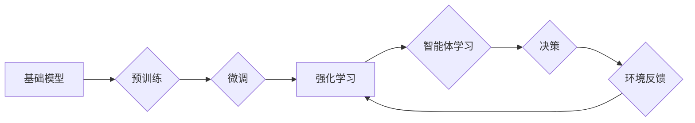

> 强化学习，基础模型，应用场景，算法原理，代码实例，未来趋势

## 1. 背景介绍

强化学习 (Reinforcement Learning, RL) 作为机器学习领域的重要分支，近年来取得了显著进展，并在许多领域展现出强大的应用潜力。其核心思想是通过智能体与环境的交互，学习最优策略以最大化累积奖励。基础模型 (Foundation Models) 作为近年来深度学习领域的新兴概念，是指在海量数据上预训练的通用模型，能够在各种下游任务中表现出强大的泛化能力。

结合基础模型和强化学习，可以构建更强大的智能体，使其能够在更复杂的环境中学习和决策。基础模型可以提供丰富的先验知识和表示能力，帮助强化学习算法更快地收敛到最优策略。同时，强化学习可以进一步优化基础模型的性能，使其在特定任务中表现更优。

## 2. 核心概念与联系

**2.1 强化学习核心概念**

* **智能体 (Agent):** 与环境交互并采取行动的实体。
* **环境 (Environment):** 智能体所处的外部世界，会根据智能体的行动产生相应的反馈。
* **状态 (State):** 环境在特定时刻的描述。
* **动作 (Action):** 智能体在特定状态下可以采取的行动。
* **奖励 (Reward):** 环境对智能体采取的行动的反馈，可以是正向或负向。
* **策略 (Policy):** 智能体在不同状态下选择动作的规则。

**2.2 基础模型核心概念**

* **预训练 (Pre-training):** 在海量数据上训练模型，学习通用特征和表示能力。
* **微调 (Fine-tuning):** 将预训练模型应用于特定任务，通过少量数据进行调整。
* **泛化能力 (Generalization Ability):** 模型在未见过的数据上也能表现出良好的性能。

**2.3 强化学习与基础模型的联系**

基础模型可以为强化学习提供强大的先验知识和表示能力，从而加速强化学习算法的收敛速度，提高其在复杂环境中的表现。

**2.4  Mermaid 流程图**



## 3. 核心算法原理 & 具体操作步骤

**3.1 算法原理概述**

强化学习的核心算法是基于价值函数的策略梯度算法。价值函数估计智能体在特定状态下采取特定动作的长期奖励。策略梯度算法通过更新策略参数，使得价值函数不断增加，从而学习到最优策略。

**3.2 算法步骤详解**

1. **初始化:** 初始化智能体策略参数和价值函数。
2. **环境交互:** 智能体与环境交互，观察环境状态并采取动作。
3. **奖励获取:** 环境根据智能体采取的动作提供奖励。
4. **价值函数更新:** 根据奖励和环境状态，更新价值函数。
5. **策略参数更新:** 根据价值函数梯度，更新策略参数。
6. **重复步骤2-5:** 重复以上步骤，直到智能体学习到最优策略。

**3.3 算法优缺点**

* **优点:** 能够学习到最优策略，适用于复杂环境。
* **缺点:** 训练过程可能比较耗时，需要大量的样本数据。

**3.4 算法应用领域**

* **游戏:** 训练智能体玩游戏，例如围棋、Go、AlphaGo。
* **机器人:** 训练机器人执行复杂任务，例如导航、抓取、操作。
* **推荐系统:** 训练推荐系统，根据用户历史行为推荐物品。
* **自动驾驶:** 训练自动驾驶系统，使车辆能够安全地行驶。

## 4. 数学模型和公式 & 详细讲解 & 举例说明

**4.1 数学模型构建**

强化学习的数学模型主要包括以下几个方面:

* **状态空间:**  表示环境所有可能的狀態，用 S 表示。
* **动作空间:** 表示智能体在每个状态下可以采取的所有动作，用 A 表示。
* **奖励函数:**  描述环境对智能体采取动作的反馈，用 R(s, a) 表示，其中 s 是当前状态，a 是采取的动作。
* **价值函数:**  估计智能体在特定状态下采取特定动作的长期奖励，用 V(s) 或 Q(s, a) 表示。

**4.2 公式推导过程**

* **价值函数的 Bellman 方程:**

$$
V(s) = \max_a \left[ R(s, a) + \gamma \sum_{s'} P(s' | s, a) V(s') \right]
$$

其中，γ 是折扣因子，控制未来奖励的权重。

* **策略梯度算法:**

$$
\theta' = \theta + \alpha \nabla_{\theta} J(\theta)
$$

其中，θ 是策略参数，α 是学习率，J(θ) 是策略的效用函数。

**4.3 案例分析与讲解**

例如，在玩游戏时，智能体可以根据当前游戏状态和可采取的动作，选择最优动作以获得最大奖励。价值函数可以用来评估不同状态下采取不同动作的长期价值，从而帮助智能体做出最优决策。

## 5. 项目实践：代码实例和详细解释说明

**5.1 开发环境搭建**

* Python 3.x
* TensorFlow 或 PyTorch
* OpenAI Gym

**5.2 源代码详细实现**

```python
import gym
import tensorflow as tf

# 定义强化学习模型
class QNetwork(tf.keras.Model):
    def __init__(self):
        super(QNetwork, self).__init__()
        self.dense1 = tf.keras.layers.Dense(64, activation='relu')
        self.dense2 = tf.keras.layers.Dense(64, activation='relu')
        self.output = tf.keras.layers.Dense(num_actions)

    def call(self, state):
        x = self.dense1(state)
        x = self.dense2(x)
        return self.output(x)

# 定义强化学习算法
class QLearningAgent:
    def __init__(self, env, learning_rate=0.01, discount_factor=0.99, epsilon=0.1):
        self.env = env
        self.learning_rate = learning_rate
        self.discount_factor = discount_factor
        self.epsilon = epsilon
        self.q_network = QNetwork()
        self.optimizer = tf.keras.optimizers.Adam(learning_rate=self.learning_rate)

    def choose_action(self, state):
        if tf.random.uniform(()) < self.epsilon:
            return self.env.action_space.sample()
        else:
            q_values = self.q_network(state)
            return tf.argmax(q_values).numpy()

    def update_q_value(self, state, action, reward, next_state):
        target_q_value = reward + self.discount_factor * tf.reduce_max(self.q_network(next_state))
        with tf.GradientTape() as tape:
            q_value = self.q_network(state)
            loss = tf.keras.losses.MSE(target_q_value, q_value[0, action])
        gradients = tape.gradient(loss, self.q_network.trainable_variables)
        self.optimizer.apply_gradients(zip(gradients, self.q_network.trainable_variables))

# 训练强化学习模型
env = gym.make('CartPole-v1')
agent = QLearningAgent(env)
for episode in range(1000):
    state = env.reset()
    done = False
    while not done:
        action = agent.choose_action(state)
        next_state, reward, done, _ = env.step(action)
        agent.update_q_value(state, action, reward, next_state)
        state = next_state
    print(f'Episode {episode+1} completed')

# 测试强化学习模型
state = env.reset()
while True:
    action = agent.choose_action(state)
    next_state, reward, done, _ = env.step(action)
    env.render()
    state = next_state
    if done:
        break
env.close()
```

**5.3 代码解读与分析**

* 代码首先定义了强化学习模型 QNetwork，它是一个简单的多层感知机，用于估计不同状态下采取不同动作的价值。
* 然后定义了强化学习算法 QLearningAgent，它包含了选择动作、更新价值函数等核心步骤。
* 训练过程是通过与环境交互，不断更新价值函数，最终学习到最优策略。
* 测试过程是使用训练好的模型，在环境中进行模拟，观察智能体的行为。

**5.4 运行结果展示**

运行代码后，可以观察到智能体在 CartPole 环境中逐渐学会平衡杆，并保持平衡的时间越来越长。

## 6. 实际应用场景

**6.1 游戏领域**

* **AlphaGo:** 利用强化学习算法，DeepMind 的 AlphaGo 击败了世界围棋冠军，展现了强化学习在复杂策略决策领域的强大能力。
* **Dota 2:** OpenAI 的 Five 团队利用强化学习算法训练的 Dota 2 智能体，在专业比赛中取得了令人瞩目的成绩。

**6.2 机器人领域**

* **机器人导航:** 强化学习可以训练机器人自主导航，避开障碍物，到达目标位置。
* **机器人抓取:** 强化学习可以训练机器人学习抓取不同形状和大小的物体。

**6.3 其他领域**

* **推荐系统:** 强化学习可以训练推荐系统，根据用户的历史行为推荐更符合用户偏好的物品。
* **自动驾驶:** 强化学习可以训练自动驾驶系统，使车辆能够安全地行驶。

**6.4 未来应用展望**

随着基础模型和强化学习算法的不断发展，其应用场景将会更加广泛，例如：

* **医疗领域:** 利用强化学习辅助医生诊断疾病、制定治疗方案。
* **金融领域:** 利用强化学习进行风险管理、投资决策。
* **教育领域:** 利用强化学习个性化教学，提高学习效率。

## 7. 工具和资源推荐

**7.1 学习资源推荐**

* **书籍:**
    * Reinforcement Learning: An Introduction by Richard S. Sutton and Andrew G. Barto
    * Deep Reinforcement Learning Hands-On by Maxim Lapan
* **课程:**
    * Stanford CS234: Reinforcement Learning
    * DeepMind's Reinforcement Learning Specialization

**7.2 开发工具推荐**

* **TensorFlow:** 开源深度学习框架，支持强化学习算法的开发。
* **PyTorch:** 开源深度学习框架，也支持强化学习算法的开发。
* **OpenAI Gym:** 强化学习环境库，提供各种标准的强化学习任务。

**7.3 相关论文推荐**

* Deep Reinforcement Learning with Double Q-learning
* Proximal Policy Optimization Algorithms
* Asynchronous Methods for Deep Reinforcement Learning

## 8. 总结：未来发展趋势与挑战

**8.1 研究成果总结**

近年来，强化学习取得了显著进展，在许多领域取得了突破性成果。基础模型的出现为强化学习提供了更强大的工具，使得其能够解决更复杂的任务。

**8.2 未来发展趋势**

* **模型规模和能力的提升:** 未来，基础模型将会更加强大，能够学习更复杂的知识和表示能力，从而推动强化学习算法的进一步发展。
* **算法效率的提升:** 现有的强化学习算法训练过程比较耗时，未来将会研究更有效的算法，降低训练成本。
* **安全性和可解释性的提升:** 强化学习算法的安全性与可解释性仍然是一个挑战，未来将会研究更安全的算法，并提高算法的可解释性。

**8.3 面临的