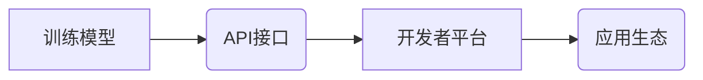

> OpenAI API, GPT-3, 自然语言处理, 机器学习, 深度学习, 应用程序开发, 创新应用

## 1. 背景介绍

近年来，人工智能（AI）技术取得了飞速发展，特别是深度学习的突破，使得机器具备了更强大的学习和推理能力。OpenAI作为一家领先的AI研究机构，致力于推动通用人工智能的开发，并将其应用于各个领域。OpenAI API是其推出的一个重要平台，为开发者提供了访问其先进AI模型的接口，从而简化了AI应用的开发过程，并激发了无数创新应用的诞生。

## 2. 核心概念与联系

OpenAI API的核心概念是将强大的AI模型开放给开发者，通过API接口，开发者可以调用这些模型进行各种任务，例如文本生成、翻译、问答、代码生成等。

OpenAI API的架构可以概括为以下几个部分：

* **训练模型:** OpenAI拥有强大的计算资源和数据资源，用于训练各种深度学习模型，例如GPT-3、DALL-E等。
* **API接口:** OpenAI提供RESTful API接口，允许开发者以标准化的方式调用模型进行各种任务。
* **开发者平台:** OpenAI提供开发者平台，提供文档、示例代码、工具等资源，帮助开发者快速上手和使用API。
* **应用生态:** OpenAI鼓励开发者使用API开发各种应用，并构建一个丰富的应用生态系统。



## 3. 核心算法原理 & 具体操作步骤

### 3.1  算法原理概述

OpenAI API所使用的核心算法是基于Transformer架构的深度学习模型，例如GPT-3。Transformer模型通过自注意力机制，能够捕捉文本序列中的长距离依赖关系，从而实现更准确的文本理解和生成。

### 3.2  算法步骤详解

1. **输入处理:** 将输入文本序列转换为数字向量，以便模型进行处理。
2. **编码阶段:** 使用Transformer编码器将输入文本序列编码成上下文表示，捕捉文本序列中的语义信息。
3. **解码阶段:** 使用Transformer解码器根据上下文表示生成目标文本序列。
4. **输出处理:** 将生成的数字向量转换为文本序列，输出最终结果。

### 3.3  算法优缺点

**优点:**

* 能够捕捉长距离依赖关系，实现更准确的文本理解和生成。
* 训练效率高，能够处理海量文本数据。
* 可迁移性强，可以应用于多种自然语言处理任务。

**缺点:**

* 计算资源需求高，训练和推理都需要强大的计算能力。
* 模型参数量大，需要大量的存储空间。
* 容易受到训练数据偏差的影响。

### 3.4  算法应用领域

Transformer模型和OpenAI API在以下领域具有广泛的应用：

* **文本生成:** 写作、诗歌创作、代码生成等。
* **机器翻译:** 将文本从一种语言翻译成另一种语言。
* **问答系统:** 回答用户提出的问题。
* **聊天机器人:** 与用户进行自然语言对话。
* **文本摘要:** 生成文本的简短摘要。

## 4. 数学模型和公式 & 详细讲解 & 举例说明

### 4.1  数学模型构建

Transformer模型的核心是自注意力机制，其数学模型可以表示为：

$$
Attention(Q, K, V) = \frac{exp(Q \cdot K^T / \sqrt{d_k})}{exp(Q \cdot K^T / \sqrt{d_k})} \cdot V
$$

其中：

* $Q$：查询矩阵
* $K$：键矩阵
* $V$：值矩阵
* $d_k$：键向量的维度

### 4.2  公式推导过程

自注意力机制通过计算查询向量与键向量的点积，并使用softmax函数进行归一化，从而得到每个键向量对查询向量的注意力权重。然后，将注意力权重与值向量进行加权求和，得到最终的输出。

### 4.3  案例分析与讲解

例如，在机器翻译任务中，查询向量可以表示源语言的词语，键向量可以表示目标语言的词语，值向量可以表示目标语言的词语嵌入。通过自注意力机制，模型可以学习到源语言词语与目标语言词语之间的关系，从而实现更准确的翻译。

## 5. 项目实践：代码实例和详细解释说明

### 5.1  开发环境搭建

使用Python语言开发OpenAI API应用，需要安装以下依赖库：

* `openai`: OpenAI API的官方Python库

```bash
pip install openai
```

### 5.2  源代码详细实现

```python
import openai

# 设置OpenAI API密钥
openai.api_key = "YOUR_API_KEY"

# 使用GPT-3模型生成文本
response = openai.Completion.create(
    engine="text-davinci-003",
    prompt="写一首关于春天的诗歌",
    max_tokens=100,
    temperature=0.7
)

# 打印生成的文本
print(response.choices[0].text)
```

### 5.3  代码解读与分析

* `openai.api_key`: 设置OpenAI API密钥，用于身份验证。
* `openai.Completion.create()`: 调用OpenAI API的文本生成接口。
* `engine`: 指定使用的模型，例如"text-davinci-003"。
* `prompt`: 提供给模型的文本提示。
* `max_tokens`: 生成文本的最大长度，单位为token。
* `temperature`: 控制文本生成的随机性，值越大，生成的文本越随机。

### 5.4  运行结果展示

```
春风拂面暖如春，
花开满园香飘远。
小鸟歌唱枝头俏，
万物复苏生机新。
```

## 6. 实际应用场景

OpenAI API在各个领域都有着广泛的应用场景：

### 6.1  教育领域

* 自动生成学习材料和练习题。
* 提供个性化的学习辅导和答疑服务。
* 评估学生的学习成果和理解程度。

### 6.2  医疗领域

* 辅助医生诊断疾病和制定治疗方案。
* 分析医学文献，提取关键信息。
* 生成患者教育材料和健康建议。

### 6.3  商业领域

* 自动生成营销文案和广告内容。
* 提供客户服务聊天机器人。
* 分析市场数据，预测趋势。

### 6.4  未来应用展望

随着OpenAI API的不断发展，其应用场景将更加广泛，例如：

* 更智能的虚拟助手和聊天机器人。
* 更精准的个性化推荐系统。
* 更强大的代码生成和软件开发工具。

## 7. 工具和资源推荐

### 7.1  学习资源推荐

* OpenAI官方文档：https://platform.openai.com/docs/
* Hugging Face Transformers库文档：https://huggingface.co/docs/transformers/index

### 7.2  开发工具推荐

* Python编程语言：https://www.python.org/
* Jupyter Notebook：https://jupyter.org/

### 7.3  相关论文推荐

* Attention Is All You Need: https://arxiv.org/abs/1706.03762

## 8. 总结：未来发展趋势与挑战

### 8.1  研究成果总结

OpenAI API的推出，为开发者提供了强大的AI工具，推动了AI应用的快速发展。Transformer模型的突破，使得机器具备了更强大的文本理解和生成能力，为各种自然语言处理任务提供了新的解决方案。

### 8.2  未来发展趋势

未来，OpenAI API将继续朝着以下方向发展：

* 模型能力提升：开发更强大、更精准的AI模型。
* 应用场景拓展：探索更多新的应用场景。
* 算法效率优化：提高模型训练和推理效率。
* 安全性和可解释性增强：解决AI模型的安全性问题，提高模型的可解释性。

### 8.3  面临的挑战

OpenAI API的发展也面临着一些挑战：

* 数据安全和隐私保护：确保用户数据安全和隐私。
* 模型偏见和歧视：解决模型训练数据带来的偏见和歧视问题。
* 伦理和社会影响：关注AI技术的伦理和社会影响，确保其良性发展。

### 8.4  研究展望

未来，我们需要继续加强对AI技术的研究，探索其更深层次的潜力，并积极应对其带来的挑战，推动AI技术朝着更加安全、可持续、普惠的方向发展。

## 9. 附录：常见问题与解答

### 9.1  如何获取OpenAI API密钥？

访问OpenAI官网，注册账号并申请API密钥。

### 9.2  OpenAI API有哪些收费模式？

OpenAI API采用计费模式，根据使用量收费。

### 9.3  OpenAI API支持哪些编程语言？

OpenAI API支持Python、JavaScript、Go等多种编程语言。


作者：禅与计算机程序设计艺术 / Zen and the Art of Computer Programming 
<end_of_turn>