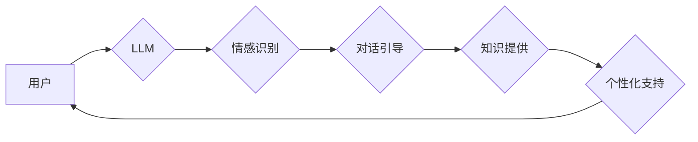

> 
> 语言模型，LLM，陪伴式治疗，心理健康，自然语言处理，深度学习，情感识别，对话系统

## 1. 背景介绍

在当今社会，心理健康问题日益突出，人们对心理支持的需求不断增长。传统的心理治疗方式往往面临着时间、成本和地域等方面的限制。而随着人工智能技术的快速发展，特别是大型语言模型（LLM）的出现，为心理健康支持提供了新的可能性。

LLM 是一种强大的深度学习模型，能够理解和生成人类语言。其强大的文本处理能力和知识储备使其能够与用户进行自然流畅的对话，并提供个性化的支持和建议。

## 2. 核心概念与联系

**2.1 陪伴式治疗**

陪伴式治疗是一种以倾听、理解和陪伴为核心的心理治疗方式。它强调建立安全、信任和支持性的治疗关系，帮助患者探索内心世界，缓解心理压力，并找到解决问题的方法。

**2.2 LLM 在陪伴式治疗中的应用**

LLM 可以作为陪伴式治疗的辅助工具，为患者提供以下方面的支持：

* **情感识别和理解:** LLM 可以通过分析用户的语言表达，识别用户的的情绪状态，并提供相应的理解和回应。
* **对话引导和支持:** LLM 可以引导用户进行深度思考，帮助他们探索自己的想法和感受，并提供支持和鼓励。
* **知识提供和信息检索:** LLM 可以提供有关心理健康相关的信息和资源，帮助用户了解心理问题和应对策略。
* **个性化支持:** LLM 可以根据用户的个人情况和需求，提供个性化的支持和建议。

**2.3 架构图**



## 3. 核心算法原理 & 具体操作步骤

**3.1 算法原理概述**

LLM 的核心算法是基于 Transformer 架构的深度神经网络。Transformer 模型能够有效地捕捉文本中的长距离依赖关系，从而实现更准确的文本理解和生成。

**3.2 算法步骤详解**

1. **文本预处理:** 将用户输入的文本进行清洗、分词、词嵌入等预处理操作，以便模型能够理解文本内容。
2. **编码器:** 将预处理后的文本输入到编码器中，编码器会将文本转换为一个固定长度的向量表示，该向量包含了文本的语义信息。
3. **解码器:** 将编码器的输出作为输入，解码器会根据输入的向量生成相应的文本输出。
4. **损失函数:** 使用交叉熵损失函数来衡量模型的预测结果与真实结果之间的差异。
5. **反向传播:** 使用梯度下降算法来更新模型的参数，使得模型的预测结果与真实结果之间的差异最小化。

**3.3 算法优缺点**

**优点:**

* 能够理解和生成自然流畅的语言。
* 能够捕捉文本中的长距离依赖关系。
* 能够进行个性化的文本生成。

**缺点:**

* 训练成本高，需要大量的计算资源和数据。
* 容易受到训练数据的影响，可能存在偏差和错误。
* 缺乏对真实世界的理解和常识。

**3.4 算法应用领域**

LLM 的应用领域非常广泛，包括：

* 自然语言处理
* 机器翻译
* 文本摘要
* 情感分析
* 聊天机器人
* 自动写作

## 4. 数学模型和公式 & 详细讲解 & 举例说明

**4.1 数学模型构建**

LLM 的数学模型主要基于 Transformer 架构，其核心是注意力机制和多头注意力机制。

**注意力机制:**

注意力机制允许模型关注输入序列中与当前任务相关的部分，从而提高模型的理解能力。

公式:

$$
Attention(Q, K, V) = softmax(\frac{QK^T}{\sqrt{d_k}})V
$$

其中:

* Q: 查询向量
* K: 键向量
* V: 值向量
* $d_k$: 键向量的维度

**多头注意力机制:**

多头注意力机制通过使用多个注意力头，可以捕捉到不同层次的语义信息。

公式:

$$
MultiHeadAttention(Q, K, V) = Concat(head_1, head_2, ..., head_h)W^O
$$

其中:

* head_1, head_2, ..., head_h: 多个注意力头的输出
* $W^O$: 输出权重矩阵

**4.2 公式推导过程**

注意力机制的公式推导过程可以参考 Transformer 原文论文。

**4.3 案例分析与讲解**

例如，在翻译任务中，注意力机制可以帮助模型关注源语言中与目标语言单词相关的部分，从而提高翻译的准确性。

## 5. 项目实践：代码实例和详细解释说明

**5.1 开发环境搭建**

* Python 3.7+
* PyTorch 1.7+
* CUDA 10.2+

**5.2 源代码详细实现**

```python
import torch
import torch.nn as nn

class Attention(nn.Module):
    def __init__(self, d_model, num_heads):
        super(Attention, self).__init__()
        self.d_model = d_model
        self.num_heads = num_heads
        self.head_dim = d_model // num_heads

        self.query = nn.Linear(d_model, d_model)
        self.key = nn.Linear(d_model, d_model)
        self.value = nn.Linear(d_model, d_model)
        self.fc_out = nn.Linear(d_model, d_model)

    def forward(self, query, key, value, mask=None):
        batch_size = query.size(0)

        # Linear projections
        Q = self.query(query).view(batch_size, -1, self.num_heads, self.head_dim).transpose(1, 2)
        K = self.key(key).view(batch_size, -1, self.num_heads, self.head_dim).transpose(1, 2)
        V = self.value(value).view(batch_size, -1, self.num_heads, self.head_dim).transpose(1, 2)

        # Scaled dot-product attention
        scores = torch.matmul(Q, K.transpose(-2, -1)) / torch.sqrt(torch.tensor(self.head_dim, dtype=torch.float))

        if mask is not None:
            scores = scores.masked_fill(mask == 0, -1e9)

        attention_weights = torch.softmax(scores, dim=-1)

        # Weighted sum of values
        context = torch.matmul(attention_weights, V)

        # Concatenate heads and project
        context = context.transpose(1, 2).contiguous().view(batch_size, -1, self.d_model)
        output = self.fc_out(context)

        return output, attention_weights
```

**5.3 代码解读与分析**

这段代码实现了多头注意力机制。

* `Attention` 类定义了注意力机制的结构。
* `forward` 方法实现了注意力机制的计算过程。
* `query`, `key`, `value` 分别表示查询向量、键向量和值向量。
* `mask` 用于屏蔽不需要关注的部分。
* `scores` 表示注意力权重。
* `context` 表示注意力后的输出。

**5.4 运行结果展示**

运行该代码可以得到注意力权重和注意力后的输出。

## 6. 实际应用场景

**6.1 聊天机器人**

LLM 可以用于构建更智能、更自然的聊天机器人，能够理解用户的意图，并提供更精准的回复。

**6.2 情绪分析**

LLM 可以分析用户的文本表达，识别用户的的情绪状态，并提供相应的支持和建议。

**6.3 心理健康问答系统**

LLM 可以构建一个心理健康问答系统，提供有关心理健康相关的信息和资源，帮助用户了解心理问题和应对策略。

**6.4 个性化心理支持**

LLM 可以根据用户的个人情况和需求，提供个性化的心理支持和建议。

**6.5 未来应用展望**

LLM 在心理健康支持领域的应用前景广阔，未来可能发展出更智能、更个性化的支持系统，为更多的人提供心理健康支持。

## 7. 工具和资源推荐

**7.1 学习资源推荐**

* **Transformer 原文论文:** https://arxiv.org/abs/1706.03762
* **Hugging Face Transformers 库:** https://huggingface.co/transformers/

**7.2 开发工具推荐**

* **PyTorch:** https://pytorch.org/
* **TensorFlow:** https://www.tensorflow.org/

**7.3 相关论文推荐**

* **GPT-3:** https://openai.com/blog/gpt-3/
* **BERT:** https://arxiv.org/abs/1810.04805

## 8. 总结：未来发展趋势与挑战

**8.1 研究成果总结**

LLM 在心理健康支持领域的应用取得了显著的进展，能够提供更智能、更个性化的支持。

**8.2 未来发展趋势**

* **模型规模和能力的提升:** 未来LLM模型规模将进一步扩大，能力将更加强大，能够更好地理解和应对复杂的心理问题。
* **多模态交互:** LLM 将与其他模态，如语音、图像、视频等进行融合，实现更丰富的交互体验。
* **伦理和安全问题:** 随着LLM应用的普及，伦理和安全问题将更加突出，需要加强相关研究和监管。

**8.3 面临的挑战**

* **数据获取和标注:** LLM 的训练需要大量的标注数据，获取和标注高质量数据是一个挑战。
* **模型解释性和可信度:** LLM 的决策过程往往难以解释，如何提高模型的解释性和可信度是一个重要问题。
* **公平性和偏见:** LLM 可能存在公平性和偏见问题，需要采取措施确保模型的公平性和公正性。

**8.4 研究展望**

未来，LLM 在心理健康支持领域的应用将更加广泛和深入，为人们提供更智能、更便捷、更有效的支持。


## 9. 附录：常见问题与解答

**9.1  LLM 是否可以替代传统的心理治疗？**

LLM 可以作为心理健康支持的辅助工具，但不能完全替代传统的心理治疗。传统的心理治疗需要专业的医师进行诊断和治疗，而LLM 只能提供有限的建议和支持。

**9.2  LLM 会泄露用户的隐私信息吗？**

在设计和使用 LLM 时，需要采取措施保护用户的隐私信息。例如，可以使用加密技术保护用户的敏感信息，并制定明确的隐私政策。

**9.3  LLM 的决策是否可靠？**

LLM 的决策基于其训练数据和算法，但其决策并非绝对可靠。用户应该谨慎对待 LLM 的建议，并根据自身情况进行判断。


作者：禅与计算机程序设计艺术 / Zen and the Art of Computer Programming 
<end_of_turn>