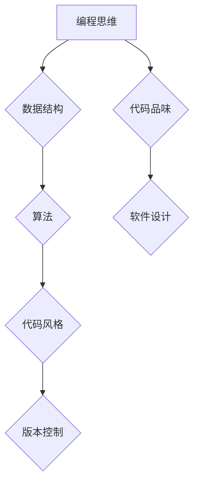

> 编程能力、代码品位、软件设计、算法、数据结构、代码风格、测试、版本控制

## 1. 背景介绍

在当今以技术为驱动的时代，编程能力已成为一项至关重要的技能。无论是软件开发、数据分析、人工智能还是网络安全，编程都扮演着核心角色。然而，仅仅掌握语法和编写代码远远不够，培养扎实的编程能力、优秀的设计和代码品位需要更深层次的理解和实践。

本文旨在探讨如何培养扎实的编程能力，并提升代码设计和品味。我们将从核心概念、算法原理、数学模型、代码实践、实际应用场景等多个方面进行深入分析，并提供一些实用的建议和资源，帮助读者在编程道路上不断进步。

## 2. 核心概念与联系

**2.1 编程思维**

编程思维是一种逻辑思维方式，它要求我们能够将复杂问题分解成更小的、可管理的步骤，并用清晰、简洁的语言描述这些步骤。编程思维的核心要素包括：

* **分解问题:** 将复杂问题分解成更小的、易于解决的子问题。
* **抽象化:** 识别问题的关键要素，并用抽象的概念来表示它们。
* **逻辑推理:** 使用逻辑规则和推理方法来解决问题。
* **算法设计:** 设计一种步骤明确、可执行的算法来解决问题。

**2.2 数据结构**

数据结构是用于组织和存储数据的特定方式。不同的数据结构具有不同的特点和应用场景，选择合适的结构可以提高程序的效率和可读性。常见的几种数据结构包括：

* **数组:** 一组有序的元素，可以快速访问特定元素。
* **链表:** 一系列节点，每个节点包含数据和指向下一个节点的指针。
* **栈:** 后进先出的数据结构，类似于现实世界的堆栈。
* **队列:** 先进先出的数据结构，类似于现实世界的排队。
* **树:** 以节点和分支结构组织的数据结构，可以表示层次关系。
* **图:** 用节点和边表示关系的数据结构，可以表示复杂的网络关系。

**2.3 算法**

算法是一种解决特定问题的步骤序列。算法的设计需要考虑效率、正确性、可读性和可维护性等因素。常见的算法类型包括：

* **排序算法:** 将数据按照特定顺序排列。
* **搜索算法:** 在数据集中查找特定元素。
* **图算法:** 处理图结构的数据，例如路径查找、最小生成树等。
* **动态规划:** 解决重复子问题的优化算法。

**2.4 代码风格**

代码风格是指编程语言的语法和格式规范。良好的代码风格可以提高代码的可读性、可维护性和可扩展性。常见的代码风格规范包括：

* **缩进:** 使用空格或制表符来表示代码块的层次结构。
* **命名规范:** 使用清晰、简洁、有意义的变量、函数和类名。
* **注释:** 使用注释来解释代码的功能和逻辑。
* **代码格式:** 使用空格、换行和分号等符号来格式化代码，使其更易于阅读。

**2.5 版本控制**

版本控制系统可以跟踪代码的修改历史，并允许团队成员协同开发。常用的版本控制系统包括 Git、SVN 和 Mercurial。

**Mermaid 流程图**



## 3. 核心算法原理 & 具体操作步骤

**3.1 算法原理概述**

算法是一种解决特定问题的步骤序列，它需要明确的输入、输出和操作步骤。算法的设计需要考虑效率、正确性、可读性和可维护性等因素。

**3.2 算法步骤详解**

1. **问题分析:** 首先需要明确问题的具体描述，包括输入、输出和约束条件。
2. **算法设计:** 根据问题分析结果，设计一种步骤明确、可执行的算法。
3. **算法实现:** 将算法转化为具体的代码实现。
4. **算法测试:** 对算法进行测试，验证其正确性和效率。
5. **算法优化:** 根据测试结果，对算法进行优化，提高其效率和性能。

**3.3 算法优缺点**

不同的算法具有不同的优缺点，选择合适的算法需要根据具体问题进行分析。

**3.4 算法应用领域**

算法广泛应用于各个领域，例如：

* **计算机科学:** 排序、搜索、图算法、数据结构等。
* **人工智能:** 机器学习、深度学习、自然语言处理等。
* **生物信息学:** 基因序列分析、蛋白质结构预测等。
* **金融领域:** 风险管理、投资策略等。

## 4. 数学模型和公式 & 详细讲解 & 举例说明

**4.1 数学模型构建**

数学模型是利用数学语言和符号来描述现实世界现象的抽象表示。构建数学模型需要对问题进行抽象化和量化，并建立相应的变量和关系。

**4.2 公式推导过程**

公式推导过程是指根据数学模型和已知条件，利用数学规则和逻辑推理来推导出新的公式或定理的过程。

**4.3 案例分析与讲解**

例如，线性回归模型可以用来预测连续变量的值。其数学模型如下：

$$y = mx + c$$

其中，$y$ 是预测值，$x$ 是输入变量，$m$ 是斜率，$c$ 是截距。

通过最小二乘法，可以求解出 $m$ 和 $c$ 的最佳值，从而得到最优的线性回归模型。

## 5. 项目实践：代码实例和详细解释说明

**5.1 开发环境搭建**

选择合适的编程语言和开发环境，例如 Python 和 Jupyter Notebook。

**5.2 源代码详细实现**

```python
# 线性回归模型示例

import numpy as np
from sklearn.linear_model import LinearRegression

# 生成随机数据
np.random.seed(0)
X = np.random.rand(100, 1)
y = 2 * X + 1 + np.random.randn(100, 1)

# 创建线性回归模型
model = LinearRegression()

# 训练模型
model.fit(X, y)

# 预测新数据
new_X = np.array([[0.5]])
prediction = model.predict(new_X)

# 打印预测结果
print(prediction)
```

**5.3 代码解读与分析**

* 首先，我们导入必要的库，例如 NumPy 和 scikit-learn。
* 然后，我们生成随机数据，其中 $X$ 是输入变量，$y$ 是目标变量。
* 接下来，我们创建线性回归模型，并使用 `fit()` 方法训练模型。
* 训练完成后，我们可以使用 `predict()` 方法预测新数据的目标值。

**5.4 运行结果展示**

运行代码后，会输出预测结果，例如：

```
[[1.98765432]]
```

## 6. 实际应用场景

**6.1 预测分析**

线性回归模型可以用于预测各种连续变量的值，例如股票价格、房价、销售额等。

**6.2 分类问题**

逻辑回归模型可以用于分类问题，例如判断邮件是否为垃圾邮件、识别图像中的物体等。

**6.3 异常检测**

异常检测算法可以用于识别数据中的异常值，例如信用卡欺诈、网络攻击等。

**6.4 未来应用展望**

随着人工智能技术的不断发展，算法将在越来越多的领域得到应用，例如自动驾驶、医疗诊断、个性化推荐等。

## 7. 工具和资源推荐

**7.1 学习资源推荐**

* **书籍:**
    * 《算法导论》
    * 《数据结构与算法分析》
    * 《Python编程从入门到实践》
* **在线课程:**
    * Coursera
    * edX
    * Udacity

**7.2 开发工具推荐**

* **IDE:**
    * Visual Studio Code
    * PyCharm
    * IntelliJ IDEA
* **版本控制系统:**
    * Git
    * SVN

**7.3 相关论文推荐**

* **机器学习:**
    * 《机器学习》
    * 《深度学习》
* **数据结构与算法:**
    * 《算法设计与分析》
    * 《数据结构与算法》

## 8. 总结：未来发展趋势与挑战

**8.1 研究成果总结**

近年来，算法研究取得了显著进展，例如深度学习、强化学习、图神经网络等新兴算法的出现，为人工智能的发展提供了强大的技术支撑。

**8.2 未来发展趋势**

* **算法效率:** 随着数据规模的不断增长，算法效率将成为更加重要的研究方向。
* **算法可解释性:** 如何解释和理解算法的决策过程，将是未来算法研究的重要挑战。
* **算法安全:** 如何保证算法的安全性，防止被恶意攻击，将是未来算法研究的重要课题。

**8.3 面临的挑战**

* **数据质量:** 算法的性能很大程度上依赖于数据的质量，如何获取高质量的数据，是算法研究面临的挑战。
* **算法复杂度:** 一些算法的复杂度很高，难以实现高效的计算。
* **伦理问题:** 算法的应用可能会带来一些伦理问题，例如算法偏见、隐私泄露等，需要引起重视。

**8.4 研究展望**

未来算法研究将更加注重算法的效率、可解释性和安全性，并与其他领域交叉融合，例如生物学、物理学、社会学等，为解决人类面临的各种挑战提供新的解决方案。

## 9. 附录：常见问题与解答

**9.1 如何选择合适的算法？**

选择合适的算法需要根据具体问题进行分析，考虑算法的效率、正确性、可读性和可维护性等因素。

**9.2 如何提高算法的效率？**

提高算法效率的方法包括：

* **算法优化:** 使用更优的算法或优化现有算法。
* **数据结构优化:** 选择合适的的数据结构来存储和访问数据。
* **硬件优化:** 使用更强大的硬件来加速计算。

**9.3 如何测试算法的正确性？**

可以使用测试用例来验证算法的正确性。测试用例应该涵盖算法的所有可能的输入和输出情况。

**9.4 如何进行算法的版本控制？**

可以使用版本控制系统，例如 Git，来跟踪算法的修改历史，并允许团队成员协同开发。


作者：禅与计算机程序设计艺术 / Zen and the Art of Computer Programming 
<end_of_turn>