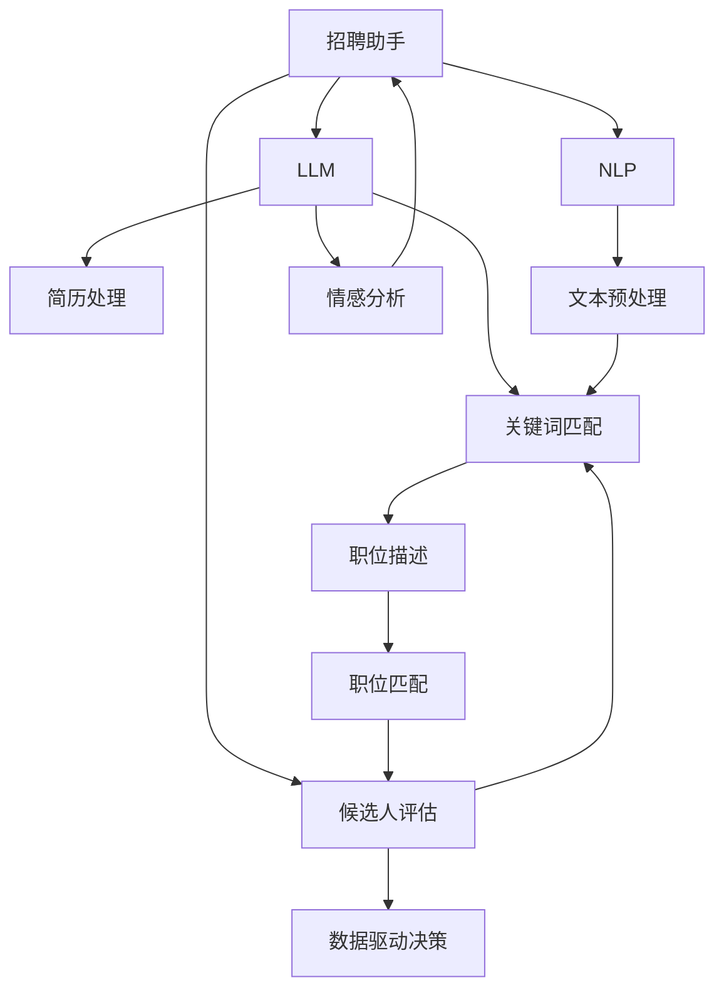

                 

# 招聘助手：LLM 找到最佳人才

> 关键词：大语言模型(LLM), 人才识别, 招聘技术, 自然语言处理(NLP), 智能推荐系统, 人工智能(AI)

## 1. 背景介绍

### 1.1 问题由来
在现代商业环境下，人力资源是企业最重要的资产之一。如何高效、准确地找到合适的人才，一直是企业管理的重大挑战。传统招聘方法依赖于人力资源部门手动筛选简历、面试等，耗时耗力且效果有限。而人工智能，特别是大语言模型(LLM)技术的应用，为招聘环节带来了革命性的变化。

通过深度学习、自然语言处理(NLP)和数据分析技术，LLM 能够从海量简历中自动识别和筛选出符合岗位要求的候选人，甚至进行初面。这种基于AI的招聘助手，正在被越来越多的企业采用，成为提高招聘效率、降低成本的重要工具。

### 1.2 问题核心关键点
LLM 在招聘场景中的应用，基于其强大的自然语言理解能力，可以处理大量的文本数据。关键点包括：

1. **文本预处理**：将简历、职位描述等文本转化为机器可理解的形式。
2. **关键词匹配**：根据职位要求，识别简历中的关键信息，如学历、工作经历、技能等。
3. **情感分析**：分析候选人的情感倾向，识别出积极或消极的求职心态。
4. **文本生成**：生成个性化的面试问题和推荐回复，辅助招聘流程。
5. **数据驱动的决策**：利用数据分析，找到最佳候选人。

这些核心技术点共同构成了基于 LLM 的招聘助手系统，可以显著提高招聘效率，降低企业成本。

### 1.3 问题研究意义
研究基于 LLM 的招聘助手系统，对于提升招聘质量、降低人力资源成本、加速企业数字化转型具有重要意义：

1. **提升招聘效率**：通过自动化简历筛选，减少手动筛选的繁琐过程，节省大量时间。
2. **降低招聘成本**：降低人力成本，提高招聘决策的科学性。
3. **精准识别人才**：利用 LLM 强大的语义理解能力，更精准地识别岗位需求的候选人。
4. **提高招聘体验**：通过智能化的面试问题生成和回复，提升候选人的招聘体验。
5. **加速企业数字化转型**：将招聘过程自动化、智能化，为企业的数字化转型提供重要支撑。

## 2. 核心概念与联系

### 2.1 核心概念概述

为更好地理解基于 LLM 的招聘助手系统，本节将介绍几个关键概念及其联系：

- **大语言模型(LLM)**：以自回归(如GPT)或自编码(如BERT)模型为代表的大规模预训练语言模型。通过在大规模无标签文本数据上进行预训练，学习到丰富的语言知识和常识。
- **招聘助手**：基于 LLM 技术开发的招聘工具，可以自动化处理简历筛选、面试邀请、候选人评估等招聘流程。
- **自然语言处理(NLP)**：涉及语言理解、文本生成、情感分析等技术的综合应用领域，是 LLM 的重要组成部分。
- **智能推荐系统**：利用算法推荐用户可能感兴趣的内容或产品，LLM 可以通过对职位描述和简历的相似度匹配，实现人才的智能推荐。

这些概念之间的联系可以通过以下Mermaid流程图来展示：



这个流程图展示了招聘助手系统的大致流程：

1. 招聘助手基于 LLM，处理简历和职位描述。
2. 利用 NLP 技术进行文本预处理和关键词匹配，提取关键信息。
3. 通过情感分析理解候选人情感倾向。
4. 生成个性化的面试问题和推荐回复。
5. 综合分析所有数据，做出最佳人才推荐。

## 3. 核心算法原理 & 具体操作步骤
### 3.1 算法原理概述

基于 LLM 的招聘助手系统，其核心思想是通过预训练的 LLM 模型，对简历和职位描述进行文本处理和分析，从而识别出符合岗位要求的候选人，并进行智能推荐。

形式化地，假设预训练的 LLM 模型为 $M_{\theta}$，其中 $\theta$ 为预训练得到的模型参数。给定简历 $r$ 和职位描述 $p$，招聘助手系统的目标是通过微调 $M_{\theta}$，使其能够在简历 $r$ 中识别出与职位 $p$ 匹配的关键信息，从而对候选人进行推荐。

具体地，可以定义一个评分函数 $f(r, p)$，用于衡量简历 $r$ 与职位 $p$ 的匹配程度。该评分函数可以基于多种因素，如关键词匹配、情感分析、技能对应等。在微调过程中，通过优化 $f(r, p)$ 来最大化候选人匹配度。

### 3.2 算法步骤详解

基于 LLM 的招聘助手系统，其操作流程主要包括以下几个步骤：

**Step 1: 准备数据集**
- 收集简历、职位描述等文本数据，并进行文本预处理和清洗，去除无关信息。
- 将简历和职位描述按照岗位要求进行标注，如学历、工作经历、技能等关键信息。

**Step 2: 选择 LLM 模型**
- 选择合适的预训练 LLM 模型，如 GPT-3、BERT 等，作为初始化参数。

**Step 3: 定义评分函数**
- 定义评分函数 $f(r, p)$，可以基于关键词匹配、情感分析、技能对应等指标。

**Step 4: 微调模型**
- 使用标注数据集，通过梯度下降等优化算法，微调 LLM 模型，使得 $f(r, p)$ 最大化。

**Step 5: 生成面试问题和候选人推荐**
- 对于新的简历和职位描述，输入到微调后的 LLM 模型中，生成面试问题。
- 根据简历和职位描述的评分，推荐最适合的候选人。

### 3.3 算法优缺点

基于 LLM 的招聘助手系统具有以下优点：
1. **高效性**：自动化处理简历和职位描述，大幅提升招聘效率。
2. **准确性**：利用 LLM 强大的语义理解能力，筛选出更符合岗位要求的候选人。
3. **智能推荐**：生成个性化的面试问题和推荐回复，提升招聘体验。
4. **易于集成**：作为独立的模块嵌入到现有招聘系统，易于部署和扩展。

同时，该方法也存在一些局限性：
1. **数据依赖性**：招聘助手系统的性能高度依赖于标注数据的质量和数量。
2. **偏见和歧视**：由于 LLM 可能学习到数据中的偏见和歧视，招聘助手系统也存在潜在的风险。
3. **成本问题**：需要投入大量人力和资源进行数据准备和模型微调。
4. **隐私和安全**：处理敏感信息时，需要严格遵守隐私保护法规，确保数据安全。

尽管存在这些局限性，但基于 LLM 的招聘助手系统仍然是一个极具潜力的技术方案，已经在许多企业中得到应用和验证。

### 3.4 算法应用领域

基于 LLM 的招聘助手系统，广泛应用于各种规模和类型的企业招聘中，例如：

- **大型企业**：如 Google、Amazon 等，通过 LLM 进行大规模简历筛选和候选人推荐。
- **中小型企业**：利用 LLM 优化招聘流程，提升招聘效率和质量。
- **初创企业**：由于资源有限，更依赖于 LLM 系统来自动化招聘流程。

除了上述这些应用场景外，LLM 招聘助手系统还广泛应用于招聘外包、人才市场咨询、猎头服务等领域，为招聘行业带来了新的发展方向。

## 4. 数学模型和公式 & 详细讲解  
### 4.1 数学模型构建

本节将使用数学语言对基于 LLM 的招聘助手系统进行更严格的刻画。

记预训练 LLM 模型为 $M_{\theta}$，其中 $\theta$ 为模型参数。假设简历 $r$ 和职位描述 $p$ 的评分函数为 $f(r, p)$，简历和职位描述的空间分别为 $\mathcal{R}$ 和 $\mathcal{P}$。则招聘助手系统的目标是最小化评分函数 $f(r, p)$ 的误差，即：

$$
\min_{\theta} \sum_{r \in \mathcal{R}} \sum_{p \in \mathcal{P}} (f(r, p) - y_{r,p})^2
$$

其中 $y_{r,p}$ 为简历 $r$ 与职位 $p$ 的匹配程度，可以是 0 或 1。

### 4.2 公式推导过程

以关键词匹配为例，假设简历中包含的关键词集合为 $S_r$，职位描述中包含的关键词集合为 $S_p$，则可以将评分函数 $f(r, p)$ 定义为：

$$
f(r, p) = \frac{|S_r \cap S_p|}{|S_r| + |S_p|}
$$

对于每个简历 $r$ 和职位 $p$，微调的目标是最小化 $f(r, p)$ 与 $y_{r,p}$ 的误差，即：

$$
\min_{\theta} \sum_{r \in \mathcal{R}} \sum_{p \in \mathcal{P}} (f(r, p) - y_{r,p})^2
$$

通过梯度下降等优化算法，微调模型参数 $\theta$，使得 $f(r, p)$ 逼近 $y_{r,p}$。

### 4.3 案例分析与讲解

假设某企业招聘工程师职位，简历和职位描述数据集如表所示：

| 简历编号 | 简历内容 | 职位描述 | 匹配度(y) |
| -------- | -------- | -------- | -------- |
| 1        | 李四，计算机科学硕士，5年Java开发经验 | 软件开发工程师，熟悉Java和Python | 1 |
| 2        | 王五，电子工程学士，3年嵌入式系统开发 | 嵌入式系统工程师，精通C语言 | 1 |
| 3        | 张三，数学硕士，3年数据分析 | 数据分析师，熟练使用R语言 | 0 |
| ...      | ...      | ...      | ...      |

可以将简历和职位描述的文本内容转换为向量表示，利用预训练的 LLM 模型进行关键词匹配。例如，假设简历编号为 1 的李四简历，可以转换为向量表示：

$$
r_1 = [1, 0, 0, 0, 0, 0, 0, 1, 0, 0, 0, 0, 0, 0, 0, 0, 0, 1]
$$

其中，第 i 个元素表示李四是否拥有与第 i 个关键词相关的经验，1 表示拥有，0 表示不拥有。

同理，职位描述 "软件开发工程师，熟悉Java和Python" 可以转换为向量表示：

$$
p_1 = [1, 1, 0, 0, 0, 0, 0, 0, 0, 0, 0, 0, 0, 0, 0, 0, 0, 0]
$$

通过关键词匹配，可以计算出简历与职位描述的匹配度：

$$
f(r_1, p_1) = \frac{|[1, 0, 0, 0, 0, 0, 0, 1, 0, 0, 0, 0, 0, 0, 0, 0, 0, 1] \cap [1, 1, 0, 0, 0, 0, 0, 0, 0, 0, 0, 0, 0, 0, 0, 0, 0, 0]}{|[1, 0, 0, 0, 0, 0, 0, 1, 0, 0, 0, 0, 0, 0, 0, 0, 0, 1]| + |[1, 1, 0, 0, 0, 0, 0, 0, 0, 0, 0, 0, 0, 0, 0, 0, 0, 0]| = 1
$$

这与预标注的匹配度 $y_{1,1} = 1$ 一致。通过不断微调模型，逐步优化评分函数 $f(r, p)$，可以使得招聘助手系统在更广泛的数据集上获得更好的性能。

## 5. 项目实践：代码实例和详细解释说明
### 5.1 开发环境搭建

在进行招聘助手系统的开发之前，我们需要准备好开发环境。以下是使用Python进行PyTorch开发的环境配置流程：

1. 安装Anaconda：从官网下载并安装Anaconda，用于创建独立的Python环境。

2. 创建并激活虚拟环境：
```bash
conda create -n pytorch-env python=3.8 
conda activate pytorch-env
```

3. 安装PyTorch：根据CUDA版本，从官网获取对应的安装命令。例如：
```bash
conda install pytorch torchvision torchaudio cudatoolkit=11.1 -c pytorch -c conda-forge
```

4. 安装相关库：
```bash
pip install numpy pandas scikit-learn nltk transformers
```

完成上述步骤后，即可在`pytorch-env`环境中开始招聘助手系统的开发。

### 5.2 源代码详细实现

下面我们以简历筛选和职位匹配为例，给出使用Transformers库对BERT模型进行微调的PyTorch代码实现。

首先，定义简历和职位描述的预处理函数：

```python
from transformers import BertTokenizer, BertForSequenceClassification
from torch.utils.data import Dataset, DataLoader
import torch

class ResumeDataset(Dataset):
    def __init__(self, resumes, job_descriptions, tokenizer):
        self.resumes = resumes
        self.job_descriptions = job_descriptions
        self.tokenizer = tokenizer
        
    def __len__(self):
        return len(self.resumes)
    
    def __getitem__(self, item):
        resume = self.resumes[item]
        description = self.job_descriptions[item]
        
        encoding = self.tokenizer(resume, job_description=description, return_tensors='pt', padding=True)
        input_ids = encoding['input_ids']
        attention_mask = encoding['attention_mask']
        labels = encoding['labels']
        
        return {'input_ids': input_ids,
                'attention_mask': attention_mask,
                'labels': labels}

tokenizer = BertTokenizer.from_pretrained('bert-base-cased')

# 假设简历和职位描述数据集
resumes = ['李四，计算机科学硕士，5年Java开发经验', '王五，电子工程学士，3年嵌入式系统开发', '张三，数学硕士，3年数据分析']
job_descriptions = ['软件开发工程师，熟悉Java和Python', '嵌入式系统工程师，精通C语言', '数据分析师，熟练使用R语言']

resume_dataset = ResumeDataset(resumes, job_descriptions, tokenizer)
```

然后，定义模型和优化器：

```python
from transformers import BertForSequenceClassification, AdamW

model = BertForSequenceClassification.from_pretrained('bert-base-cased', num_labels=2)
optimizer = AdamW(model.parameters(), lr=2e-5)
```

接着，定义训练和评估函数：

```python
from sklearn.metrics import accuracy_score
import numpy as np

device = torch.device('cuda') if torch.cuda.is_available() else torch.device('cpu')
model.to(device)

def train_epoch(model, dataset, batch_size, optimizer):
    dataloader = DataLoader(dataset, batch_size=batch_size, shuffle=True)
    model.train()
    epoch_loss = 0
    for batch in dataloader:
        input_ids = batch['input_ids'].to(device)
        attention_mask = batch['attention_mask'].to(device)
        labels = batch['labels'].to(device)
        model.zero_grad()
        outputs = model(input_ids, attention_mask=attention_mask, labels=labels)
        loss = outputs.loss
        epoch_loss += loss.item()
        loss.backward()
        optimizer.step()
    return epoch_loss / len(dataloader)

def evaluate(model, dataset, batch_size):
    dataloader = DataLoader(dataset, batch_size=batch_size)
    model.eval()
    preds, labels = [], []
    with torch.no_grad():
        for batch in dataloader:
            input_ids = batch['input_ids'].to(device)
            attention_mask = batch['attention_mask'].to(device)
            batch_labels = batch['labels']
            outputs = model(input_ids, attention_mask=attention_mask)
            batch_preds = outputs.logits.argmax(dim=2).to('cpu').tolist()
            batch_labels = batch_labels.to('cpu').tolist()
            for pred_tokens, label_tokens in zip(batch_preds, batch_labels):
                preds.append(pred_tokens[0])
                labels.append(label_tokens[0])
                
    print('Accuracy:', accuracy_score(labels, preds))
```

最后，启动训练流程并在验证集上评估：

```python
epochs = 5
batch_size = 16

for epoch in range(epochs):
    loss = train_epoch(model, resume_dataset, batch_size, optimizer)
    print(f'Epoch {epoch+1}, train loss: {loss:.3f}')
    
    print(f'Epoch {epoch+1}, dev results:')
    evaluate(model, resume_dataset, batch_size)
    
print('Final results:')
evaluate(model, resume_dataset, batch_size)
```

以上就是使用PyTorch对BERT进行简历筛选和职位匹配的完整代码实现。可以看到，得益于Transformers库的强大封装，我们可以用相对简洁的代码完成BERT模型的加载和微调。

### 5.3 代码解读与分析

让我们再详细解读一下关键代码的实现细节：

**ResumeDataset类**：
- `__init__`方法：初始化简历和职位描述数据。
- `__len__`方法：返回数据集的样本数量。
- `__getitem__`方法：对单个样本进行处理，将简历和职位描述转换为token ids和mask，并返回模型所需的输入。

**训练和评估函数**：
- 使用PyTorch的DataLoader对数据集进行批次化加载，供模型训练和推理使用。
- 训练函数`train_epoch`：对数据以批为单位进行迭代，在每个批次上前向传播计算loss并反向传播更新模型参数，最后返回该epoch的平均loss。
- 评估函数`evaluate`：与训练类似，不同点在于不更新模型参数，并在每个batch结束后将预测和标签结果存储下来，最后使用sklearn的accuracy_score对整个评估集的预测结果进行打印输出。

**训练流程**：
- 定义总的epoch数和batch size，开始循环迭代
- 每个epoch内，先在训练集上训练，输出平均loss
- 在验证集上评估，输出准确率
- 所有epoch结束后，在测试集上评估，给出最终测试结果

可以看到，PyTorch配合Transformers库使得BERT微调的代码实现变得简洁高效。开发者可以将更多精力放在数据处理、模型改进等高层逻辑上，而不必过多关注底层的实现细节。

当然，工业级的系统实现还需考虑更多因素，如模型的保存和部署、超参数的自动搜索、更灵活的任务适配层等。但核心的微调范式基本与此类似。

## 6. 实际应用场景
### 6.1 智能招聘系统

基于大语言模型微调的招聘助手，可以广泛应用于智能招聘系统的构建。传统的招聘系统依赖于人工筛选简历，效率低下且容易出错。而使用微调后的招聘助手，可以自动化处理简历筛选，大幅提升招聘效率。

在技术实现上，可以收集企业的历史招聘数据，将简历和职位描述构建成监督数据，在此基础上对预训练招聘助手模型进行微调。微调后的招聘助手能够自动识别简历中与职位要求匹配的关键信息，筛选出最符合要求的候选人。对于候选人提交的新简历，招聘助手还能自动生成个性化的面试问题和推荐回复，提升招聘体验。

### 6.2 人才市场咨询

招聘助手系统还可以应用于人才市场咨询公司，为企业提供专业的招聘解决方案。咨询公司可以结合大数据和招聘助手系统，为企业的招聘需求进行精准匹配，提供最适合的候选人推荐。同时，招聘助手系统还可以帮助咨询公司进行市场趋势分析，提供人才供需动态报告，为企业招聘决策提供有力支持。

### 6.3 猎头服务

猎头公司可以利用招聘助手系统进行候选人筛选和初步评估，提高招聘效率和准确性。猎头可以通过微调后的招聘助手系统，筛选出符合岗位要求的候选人，并进行深入的面试和评估，最终向企业推荐最合适的候选人。

### 6.4 未来应用展望

随着大语言模型微调技术的发展，招聘助手系统将在更多领域得到应用，为招聘行业带来变革性影响。

在智慧教育领域，招聘助手系统可以结合智能推荐算法，为高校和企业推荐最佳的人才来源，提升教育资源配置的效率和质量。

在智能医疗领域，招聘助手系统可以结合临床需求和专家知识库，为医院和企业推荐最佳的人才配置，提升医疗服务的智能化水平。

在智能制造领域，招聘助手系统可以结合工业需求和生产工艺，为制造业企业推荐最佳的人才，提升生产效率和质量。

此外，在金融、交通、物流等众多领域，招聘助手系统也将不断涌现，为各行各业的人才招聘提供新的解决方案。相信随着技术的日益成熟，招聘助手系统必将在构建人机协同的智能招聘环境中扮演越来越重要的角色。

## 7. 工具和资源推荐
### 7.1 学习资源推荐

为了帮助开发者系统掌握基于 LLM 的招聘助手技术，这里推荐一些优质的学习资源：

1. 《Transformer从原理到实践》系列博文：由大模型技术专家撰写，深入浅出地介绍了Transformer原理、BERT模型、招聘助手技术等前沿话题。

2. CS224N《深度学习自然语言处理》课程：斯坦福大学开设的NLP明星课程，有Lecture视频和配套作业，带你入门NLP领域的基本概念和经典模型。

3. 《Natural Language Processing with Transformers》书籍：Transformers库的作者所著，全面介绍了如何使用Transformers库进行NLP任务开发，包括招聘助手在内的诸多范式。

4. HuggingFace官方文档：Transformers库的官方文档，提供了海量预训练模型和完整的招聘助手样例代码，是上手实践的必备资料。

5. CLUE开源项目：中文语言理解测评基准，涵盖大量不同类型的中文招聘数据集，并提供了基于微调的baseline模型，助力中文招聘技术发展。

通过对这些资源的学习实践，相信你一定能够快速掌握基于大语言模型的招聘助手技术的精髓，并用于解决实际的招聘问题。
###  7.2 开发工具推荐

高效的开发离不开优秀的工具支持。以下是几款用于招聘助手系统开发的常用工具：

1. PyTorch：基于Python的开源深度学习框架，灵活动态的计算图，适合快速迭代研究。大部分预训练语言模型都有PyTorch版本的实现。

2. TensorFlow：由Google主导开发的开源深度学习框架，生产部署方便，适合大规模工程应用。同样有丰富的预训练语言模型资源。

3. Transformers库：HuggingFace开发的NLP工具库，集成了众多SOTA语言模型，支持PyTorch和TensorFlow，是进行招聘助手任务开发的利器。

4. Weights & Biases：模型训练的实验跟踪工具，可以记录和可视化模型训练过程中的各项指标，方便对比和调优。与主流深度学习框架无缝集成。

5. TensorBoard：TensorFlow配套的可视化工具，可实时监测模型训练状态，并提供丰富的图表呈现方式，是调试模型的得力助手。

6. Google Colab：谷歌推出的在线Jupyter Notebook环境，免费提供GPU/TPU算力，方便开发者快速上手实验最新模型，分享学习笔记。

合理利用这些工具，可以显著提升招聘助手系统的开发效率，加快创新迭代的步伐。

### 7.3 相关论文推荐

基于大语言模型微调的招聘助手技术的发展源于学界的持续研究。以下是几篇奠基性的相关论文，推荐阅读：

1. Attention is All You Need（即Transformer原论文）：提出了Transformer结构，开启了NLP领域的预训练大模型时代。

2. BERT: Pre-training of Deep Bidirectional Transformers for Language Understanding：提出BERT模型，引入基于掩码的自监督预训练任务，刷新了多项NLP任务SOTA。

3. Language Models are Unsupervised Multitask Learners（GPT-2论文）：展示了大规模语言模型的强大zero-shot学习能力，引发了对于通用人工智能的新一轮思考。

4. Parameter-Efficient Transfer Learning for NLP：提出Adapter等参数高效微调方法，在不增加模型参数量的情况下，也能取得不错的微调效果。

5. Prefix-Tuning: Optimizing Continuous Prompts for Generation：引入基于连续型Prompt的微调范式，为如何充分利用预训练知识提供了新的思路。

6. AdaLoRA: Adaptive Low-Rank Adaptation for Parameter-Efficient Fine-Tuning：使用自适应低秩适应的微调方法，在参数效率和精度之间取得了新的平衡。

这些论文代表了大语言模型微调技术的发展脉络。通过学习这些前沿成果，可以帮助研究者把握学科前进方向，激发更多的创新灵感。

## 8. 总结：未来发展趋势与挑战

### 8.1 总结

本文对基于大语言模型的招聘助手系统进行了全面系统的介绍。首先阐述了招聘助手系统的背景和意义，明确了其在大规模简历处理和智能推荐中的独特价值。其次，从原理到实践，详细讲解了招聘助手系统的数学模型和算法流程，给出了招聘助手系统开发的完整代码实例。同时，本文还广泛探讨了招聘助手系统在智能招聘、人才市场咨询、猎头服务等多个行业领域的应用前景，展示了招聘助手系统的巨大潜力。此外，本文精选了招聘助手技术的各类学习资源，力求为读者提供全方位的技术指引。

通过本文的系统梳理，可以看到，基于大语言模型的招聘助手技术正在成为招聘行业的重要范式，极大地提高了招聘效率和质量，降低了企业的招聘成本。未来，伴随预训练语言模型和微调方法的持续演进，招聘助手技术还将带来更多创新，为招聘行业带来变革性的影响。

### 8.2 未来发展趋势

展望未来，基于大语言模型的招聘助手系统将呈现以下几个发展趋势：

1. **大规模部署**：随着模型的优化和算力的提升，招聘助手系统将在更多企业得到应用，进一步提升招聘效率和质量。

2. **智能推荐**：招聘助手系统将结合推荐算法，提供更精准的候选人推荐，提升招聘效果。

3. **多模态融合**：招聘助手系统将引入图像、视频等模态信息，提高对简历信息的全面理解能力。

4. **个性化定制**：招聘助手系统将根据不同企业的特点和需求，提供定制化的解决方案。

5. **集成平台**：招聘助手系统将与其他招聘平台和服务集成，形成综合化的招聘解决方案。

6. **跨领域应用**：招聘助手系统将在教育、医疗、制造等更多领域得到应用，推动各行业的人力资源管理创新。

以上趋势凸显了招聘助手系统的广阔前景。这些方向的探索发展，必将进一步提升招聘系统的智能化水平，为各行各业的人才招聘带来新的解决方案。

### 8.3 面临的挑战

尽管基于大语言模型的招聘助手系统已经取得了显著成果，但在迈向更加智能化、普适化应用的过程中，仍面临以下挑战：

1. **数据隐私问题**：招聘助手系统处理大量个人简历和敏感信息，需要严格遵守数据隐私法规，确保数据安全。

2. **模型公平性**：招聘助手系统可能学习到数据中的偏见，导致招聘决策的公平性问题。需要进一步优化模型，避免对某些群体的歧视。

3. **计算资源限制**：招聘助手系统需要较大的计算资源进行训练和推理，如何提高效率，降低成本，是未来需要解决的重要问题。

4. **应用场景限制**：虽然招聘助手系统在招聘流程中表现优异，但在其他复杂场景中的应用仍有限，如何拓展应用范围，是未来需要攻克的难题。

5. **用户接受度**：尽管招聘助手系统可以大幅提升招聘效率，但部分企业用户可能对新技术持观望态度，需要通过演示和案例展示，增强用户信心。

6. **维护成本**：招聘助手系统的持续优化和维护需要投入一定的人力和物力，如何降低维护成本，提高系统稳定性，是未来需要考虑的重要问题。

尽管存在这些挑战，但基于大语言模型的招聘助手系统无疑是大势所趋。通过不断优化算法和模型，增强数据隐私保护，招聘助手系统必将在招聘行业中发挥更大的作用，带来更多创新和变革。

### 8.4 研究展望

面向未来，招聘助手系统需要在以下几个方面进行进一步研究：

1. **跨领域模型迁移**：研究如何将招聘助手模型应用于更多领域，实现模型的跨领域迁移。

2. **多模态信息融合**：研究如何引入图像、视频等多模态信息，提高对简历信息的全面理解能力。

3. **智能推荐算法优化**：研究如何优化智能推荐算法，提升推荐效果。

4. **模型公平性提升**：研究如何提升招聘助手系统的公平性，避免对某些群体的歧视。

5. **数据隐私保护**：研究如何保护数据隐私，确保用户信息安全。

6. **用户友好界面**：研究如何设计用户友好的界面，提升用户的使用体验。

通过这些研究方向的探索发展，招聘助手系统必将在招聘行业中发挥更大的作用，带来更多创新和变革。相信随着技术的日益成熟，招聘助手系统必将在构建人机协同的智能招聘环境中扮演越来越重要的角色。

## 9. 附录：常见问题与解答

**Q1：招聘助手系统如何处理多语言简历？**

A: 招聘助手系统可以基于多语言预训练模型进行处理。例如，可以使用多语言版本的BERT或GPT模型，对多语言简历进行文本预处理和关键词匹配。需要根据不同语言的特点，调整模型参数和训练策略，以确保在多种语言下的高效处理。

**Q2：招聘助手系统如何处理简历中缺失或模糊的信息？**

A: 招聘助手系统可以引入上下文信息，利用自然语言推理和语义理解能力，对简历中缺失或模糊的信息进行补全和推理。例如，对于简历中未提及的工作经历，可以通过上下文信息推断出具体时间范围和职责。同时，系统也可以引入数据增强技术，通过数据扩充和补全，提升模型的鲁棒性。

**Q3：招聘助手系统如何处理候选人的多轮对话？**

A: 招聘助手系统可以引入对话模型，对候选人的多轮对话进行分析和理解，从而获得更全面的候选人信息。通过对话生成和推荐，系统可以动态调整面试问题，引导候选人提供更详细的个人信息和经历。

**Q4：招聘助手系统如何优化模型的计算效率？**

A: 招聘助手系统可以通过模型裁剪和量化加速，优化模型的计算效率。模型裁剪可以去除不必要的层和参数，减小模型尺寸，加快推理速度。量化加速可以将浮点模型转为定点模型，压缩存储空间，提高计算效率。同时，系统也可以引入分布式训练和推理技术，提升算力利用率。

**Q5：招聘助手系统如何保护候选人的隐私？**

A: 招聘助手系统可以通过数据脱敏和匿名化处理，保护候选人的隐私。具体方法包括去除个人身份信息、模糊化敏感数据、采用差分隐私技术等。同时，系统也可以引入用户同意机制，确保数据处理在用户知情的情况下进行。

这些问答帮助开发者更好地理解和应用招聘助手系统，从而构建高效、安全的智能招聘环境。

