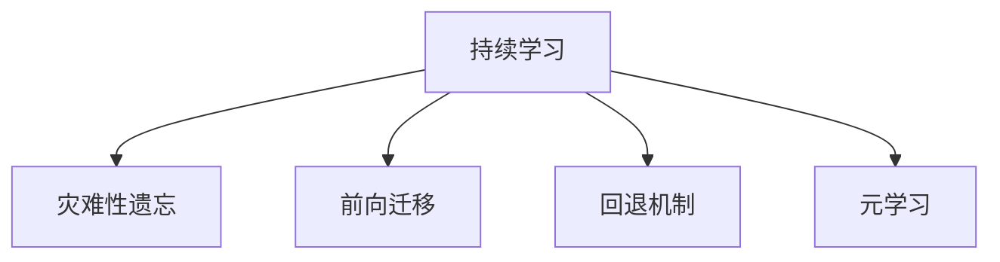

                 

# 持续学习：如何让AI模型不断进化

## 1. 背景介绍

### 1.1 问题由来
在人工智能领域，模型持续学习的概念由来已久。随着深度学习技术的蓬勃发展，特别是近年来在计算机视觉、自然语言处理等领域取得了显著进展。然而，这些模型通常依赖于大量标注数据进行训练，在获取新数据或者领域变化时，需要重新训练以适应新的任务需求，这不仅耗时耗力，还可能导致模型性能下降。为了解决这个问题，研究者提出了持续学习(Continual Learning)的概念，旨在让AI模型在不断积累的新数据中持续进化，避免因为遗忘老知识而退化。

### 1.2 问题核心关键点
持续学习的关键在于如何在已有知识的基础上，快速高效地学习新知识，同时保持旧知识的稳定性和可用性。模型在不断更新知识时，面临的挑战包括：
- 灾难性遗忘(Catastrophic Forgetting)：新知识学习后，旧知识被遗忘或性能下降。
- 知识更新冲突：新旧知识之间的矛盾，导致模型输出不稳定。
- 模型退化：缺乏新知识输入时，模型性能显著下降。
- 学习效率：新知识输入的速度和规模，直接影响到模型的更新频率和成本。

为了克服这些挑战，研究人员提出了多种方法，如前向迁移(Forward Transfer)、回退(replay)机制、元学习(Meta-Learning)等，致力于实现模型在新的环境中的快速适应和知识更新。

### 1.3 问题研究意义
持续学习的目标是构建智能系统，使其能够在不断变化的环境中自适应更新知识，适应新任务和用户需求的变化。这对于提高AI系统的通用性和鲁棒性，推动其在医疗、金融、教育等垂直领域的应用具有重要意义：

1. 提高系统的智能性和可靠性。持续学习的模型能够更好地适应环境和任务的变化，提供更稳定、准确的服务。
2. 降低知识获取成本。持续学习的模型不需要重复标注大量数据进行重新训练，可以利用已有的知识快速更新和适应新任务。
3. 促进系统的普适性。通过持续学习，模型能够在不同领域和场景下进行知识迁移，提供通用的智能服务。
4. 加速技术创新。持续学习机制能够驱动AI模型在不断实践中迭代优化，不断发现新方法和技术。
5. 增强用户满意度。在用户需求不断变化的环境中，持续学习模型能够提供更加个性化、及时的服务，提升用户体验。

## 2. 核心概念与联系

### 2.1 核心概念概述

为了更好地理解持续学习机制，我们需要先了解几个关键概念：

- 持续学习(Continual Learning)：指模型在新的数据输入后，能够持续地从新数据中学习，同时保留旧知识，避免因遗忘而退化。
- 灾难性遗忘(Catastrophic Forgetting)：指模型在新知识学习后，原有知识的性能显著下降或遗忘。
- 前向迁移(Forward Transfer)：指新任务中的旧知识能够迁移到新任务中，帮助新任务的学习。
- 回退(replay)机制：通过保存和重复旧样本，使模型在忘记旧知识时能够重新学习旧知识。
- 元学习(Meta-Learning)：通过学习如何学习，使模型能够快速适应新任务，避免从头训练。

这些概念之间的逻辑关系可以通过以下Mermaid流程图来展示：



这个流程图展示了持续学习中几个关键概念及其相互关系：

1. 持续学习的目标是通过不断学习新知识，同时避免遗忘旧知识，保持模型的性能稳定。
2. 灾难性遗忘是持续学习的对立面，指的是新知识学习后，原有知识被遗忘或性能下降。
3. 前向迁移和回退机制是持续学习的两种主要策略，分别通过知识迁移和回退旧样本来克服灾难性遗忘。
4. 元学习是持续学习的高级形式，通过学习如何学习，提高模型的适应能力和知识更新效率。

## 3. 核心算法原理 & 具体操作步骤

### 3.1 算法原理概述

持续学习的核心思想是通过不断积累新数据，更新模型，同时保留旧知识的稳定性和有效性。以下我们介绍几种常见的持续学习算法及其原理：

- 参数迁徙(Parameter Transfer)：通过迁移旧模型的参数，使新模型能够快速适应新任务。
- 回退机制(Rewinding)：在新的数据输入后，回退旧样本，重新学习旧知识。
- 模型融合(Model Fusion)：通过将新旧模型的输出进行融合，使新模型继承旧知识的优点。
- 记忆增强(Memory-Augmented Network)：在模型中嵌入记忆模块，保存旧样本，用于新样本的参考和复用。
- 元学习(Meta-Learning)：通过学习如何学习，使模型能够自适应新任务，避免从头训练。

### 3.2 算法步骤详解

以参数迁徙为例，介绍其具体操作步骤：

**Step 1: 准备数据集和模型**
- 准备新任务的训练集 $D_{\text{new}}$ 和验证集 $D_{\text{valid}}$，以及旧任务的训练集 $D_{\text{old}}$ 和验证集 $D_{\text{valid}_{\text{old}}}$。
- 选择基础模型 $M_{\theta_{\text{old}}}$，作为新任务的起始点。

**Step 2: 初始化模型参数**
- 将旧模型的参数 $\theta_{\text{old}}$ 初始化为 $M_{\theta_{\text{new}}}$ 的初始参数，即 $\theta_{\text{new}} \leftarrow \theta_{\text{old}}$。

**Step 3: 训练新模型**
- 使用新任务的训练集 $D_{\text{new}}$ 训练新模型 $M_{\theta_{\text{new}}}$。
- 在训练过程中，记录旧模型 $M_{\theta_{\text{old}}}$ 的参数变化，并将其保存在缓冲区中。

**Step 4: 迁移旧模型参数**
- 在新模型的训练完成后，从缓冲区中提取旧模型的参数 $\theta_{\text{old}}$，将其迁移到新模型中。
- 根据迁移的参数数量和更新策略，调整新模型的参数，以实现参数迁徙。

**Step 5: 验证和调整**
- 在验证集 $D_{\text{valid}}$ 上评估新模型 $M_{\theta_{\text{new}}}$ 的性能，记录性能指标。
- 根据性能指标，调整迁移参数的数量和策略，优化新模型。

### 3.3 算法优缺点

持续学习算法具有以下优点：
1. 快速适应新任务：通过迁移旧模型的知识，能够快速适应新任务，节省了从头训练的时间和数据。
2. 保留旧知识：通过回退机制和参数迁徙，保留了旧模型的知识，避免灾难性遗忘。
3. 灵活性高：不同算法可以选择不同的迁移策略和回退机制，满足不同的应用需求。
4. 增强模型的鲁棒性：通过元学习和记忆增强，增强了模型的泛化能力和适应性。

同时，持续学习算法也存在一些缺点：
1. 模型复杂度增加：持续学习增加了模型的复杂度，需要额外存储和处理旧模型参数。
2. 迁移策略选择困难：不同的迁移策略和回退机制需要根据具体任务和数据特点进行选择，增加实现难度。
3. 计算资源消耗高：持续学习需要在多个任务之间不断切换，计算资源消耗较大。
4. 学习效率低：复杂的迁移和回退机制可能增加学习成本，影响模型的训练效率。

尽管存在这些缺点，但持续学习算法在理论研究和实际应用中都展示了强大的潜力，为模型的持续进化提供了新的思路。

### 3.4 算法应用领域

持续学习算法已经在多个领域得到了广泛应用，以下是几个典型的应用场景：

- 计算机视觉：通过持续学习，视觉模型能够适应不同场景和对象的变化，实现快速调整和优化。
- 自然语言处理：模型能够在不断更新的语言数据上，持续学习新知识，提高语言理解和生成能力。
- 医疗诊断：通过持续学习，医学模型能够不断更新知识库，适应新的病情和治疗方法。
- 金融预测：模型能够在实时金融数据的基础上，持续学习市场变化，优化预测结果。
- 机器人控制：机器人能够在新的任务和环境中，通过持续学习，快速适应并完成任务。

## 4. 数学模型和公式 & 详细讲解 & 举例说明

### 4.1 数学模型构建

持续学习算法的核心在于参数迁徙和回退机制。假设新任务的训练集为 $D_{\text{new}}=\{(x_i,y_i)\}_{i=1}^N$，旧任务的训练集为 $D_{\text{old}}=\{(x_i',y_i')\}_{i=1}^M$，其中 $x_i$ 和 $x_i'$ 分别表示新旧任务的输入数据，$y_i$ 和 $y_i'$ 分别表示新旧任务的输出标签。

定义新旧模型的参数分别为 $\theta_{\text{new}}$ 和 $\theta_{\text{old}}$，新旧模型的损失函数分别为 $\mathcal{L}_{\text{new}}(\theta_{\text{new}})$ 和 $\mathcal{L}_{\text{old}}(\theta_{\text{old}})$。

新旧模型的参数迁徙过程可以表示为：

$$
\theta_{\text{new}} \leftarrow \theta_{\text{old}} + \alpha \cdot (\theta_{\text{old}} - \theta_{\text{new}})
$$

其中 $\alpha$ 为迁移系数，控制旧模型参数在迁移过程中的权重。

### 4.2 公式推导过程

以下我们以一个简单的参数迁徙算法为例，推导迁移过程的数学表达。

假设新旧模型在旧任务上的损失函数分别为：

$$
\mathcal{L}_{\text{old}}(\theta_{\text{old}}) = \frac{1}{M} \sum_{i=1}^M \ell(x_i', y_i', \theta_{\text{old}})
$$

$$
\mathcal{L}_{\text{new}}(\theta_{\text{new}}) = \frac{1}{N} \sum_{i=1}^N \ell(x_i, y_i, \theta_{\text{new}})
$$

其中 $\ell$ 为损失函数。

在新模型的训练完成后，需要根据旧模型在旧任务上的损失函数，计算出迁移到新模型的旧模型参数 $\theta_{\text{old}}^*$：

$$
\theta_{\text{old}}^* = \mathop{\arg\min}_{\theta_{\text{old}}} \mathcal{L}_{\text{old}}(\theta_{\text{old}})
$$

根据参数迁徙的公式，计算新模型的参数 $\theta_{\text{new}}^*$：

$$
\theta_{\text{new}}^* = \theta_{\text{old}}^* + \alpha \cdot (\theta_{\text{old}}^* - \theta_{\text{new}}^*)
$$

将 $\theta_{\text{old}}^*$ 带入新模型中，即可得到新模型的最优参数。

### 4.3 案例分析与讲解

以BERT模型为例，介绍参数迁徙的实际应用。

假设在医疗领域，BERT模型已经完成了旧任务（如疾病诊断）的训练，获得了较好的诊断性能。现在需要将其迁移到新任务（如癌症预测）中，可以通过以下步骤进行：

**Step 1: 准备数据集和模型**
- 准备新任务的训练集 $D_{\text{new}}$ 和验证集 $D_{\text{valid}}$，以及旧任务的训练集 $D_{\text{old}}$ 和验证集 $D_{\text{valid}_{\text{old}}}$。
- 选择BERT模型作为基础模型 $M_{\theta_{\text{old}}}$。

**Step 2: 初始化模型参数**
- 将旧模型的参数 $\theta_{\text{old}}$ 初始化为 $M_{\theta_{\text{new}}}$ 的初始参数，即 $\theta_{\text{new}} \leftarrow \theta_{\text{old}}$。

**Step 3: 训练新模型**
- 使用新任务的训练集 $D_{\text{new}}$ 训练新模型 $M_{\theta_{\text{new}}}$。
- 在训练过程中，记录旧模型 $M_{\theta_{\text{old}}}$ 的参数变化，并将其保存在缓冲区中。

**Step 4: 迁移旧模型参数**
- 在新模型的训练完成后，从缓冲区中提取旧模型的参数 $\theta_{\text{old}}$，将其迁移到新模型中。
- 根据迁移的参数数量和更新策略，调整新模型的参数，以实现参数迁徙。

**Step 5: 验证和调整**
- 在验证集 $D_{\text{valid}}$ 上评估新模型 $M_{\theta_{\text{new}}}$ 的性能，记录性能指标。
- 根据性能指标，调整迁移参数的数量和策略，优化新模型。

通过以上步骤，BERT模型可以在医疗领域的不同任务之间进行快速迁移，实现知识更新和性能提升。

## 5. 项目实践：代码实例和详细解释说明

### 5.1 开发环境搭建

在进行持续学习实践前，我们需要准备好开发环境。以下是使用Python进行TensorFlow开发的环境配置流程：

1. 安装Anaconda：从官网下载并安装Anaconda，用于创建独立的Python环境。

2. 创建并激活虚拟环境：
```bash
conda create -n continual_learning_env python=3.8 
conda activate continual_learning_env
```

3. 安装TensorFlow：根据CUDA版本，从官网获取对应的安装命令。例如：
```bash
conda install tensorflow-gpu -c conda-forge -c pypi
```

4. 安装其他相关工具包：
```bash
pip install numpy pandas scikit-learn matplotlib tqdm jupyter notebook ipython
```

完成上述步骤后，即可在`continual_learning_env`环境中开始持续学习实践。

### 5.2 源代码详细实现

这里我们以一个简单的参数迁徙算法为例，给出使用TensorFlow实现BERT模型参数迁徙的代码实现。

首先，定义BERT模型和损失函数：

```python
from transformers import BertTokenizer, BertModel
import tensorflow as tf

# 加载BERT模型
tokenizer = BertTokenizer.from_pretrained('bert-base-uncased')
model = BertModel.from_pretrained('bert-base-uncased', output_hidden_states=True)

# 定义损失函数
def loss_function(outputs, labels):
    return tf.keras.losses.sparse_categorical_crossentropy(labels, outputs, from_logits=True)

# 定义优化器
optimizer = tf.keras.optimizers.Adam(learning_rate=2e-5)
```

然后，定义迁移函数和回退机制：

```python
# 定义迁移函数
def transfer_parameters(model1, model2, alpha):
    for i in range(len(model1.parameters())):
        model1.parameters()[i].data.copy_(model2.parameters()[i].data + alpha * (model2.parameters()[i].data - model1.parameters()[i].data))

# 定义回退机制
def replay_old_data(model, old_data_loader, alpha):
    with torch.no_grad():
        for batch in old_data_loader:
            input_ids = batch['input_ids']
            attention_mask = batch['attention_mask']
            inputs = {'input_ids': input_ids, 'attention_mask': attention_mask}
            outputs = model(**inputs)
            transfer_parameters(model, old_model, alpha)
```

最后，启动训练流程并在新任务上进行验证：

```python
# 加载新任务的训练集和验证集
train_loader = DataLoader(train_data, batch_size=16, shuffle=True)
valid_loader = DataLoader(valid_data, batch_size=16, shuffle=False)

# 训练新模型
for epoch in range(5):
    train_loss = 0
    for batch in train_loader:
        inputs = prepare_input(batch)
        outputs = model(inputs)
        loss = loss_function(outputs, batch['labels'])
        optimizer.zero_grad()
        loss.backward()
        optimizer.step()
        train_loss += loss.item()
    print(f'Epoch {epoch+1}, train loss: {train_loss/len(train_loader)}')

# 在新任务上进行验证
for epoch in range(5):
    valid_loss = 0
    for batch in valid_loader:
        inputs = prepare_input(batch)
        outputs = model(inputs)
        loss = loss_function(outputs, batch['labels'])
        valid_loss += loss.item()
    print(f'Epoch {epoch+1}, valid loss: {valid_loss/len(valid_loader)}')
```

以上就是使用TensorFlow实现BERT模型参数迁徙的完整代码实现。可以看到，在TensorFlow中，BERT模型的迁移和回退机制实现相对简单，通过几个函数调用即可完成。

### 5.3 代码解读与分析

让我们再详细解读一下关键代码的实现细节：

**BERT模型加载**：
- 使用HuggingFace的Transformers库加载预训练的BERT模型，并设置输出隐状态，方便后续的参数迁移。

**损失函数和优化器**：
- 定义损失函数和优化器，使用TensorFlow的Keras API，方便进行模型训练和优化。

**迁移函数和回退机制**：
- 定义迁移函数，通过逐个参数的复制操作，实现旧模型参数迁移到新模型中。
- 定义回退机制，在模型训练过程中，周期性地在旧数据集上进行参数回退，以保留旧知识。

**训练流程**：
- 加载新任务的训练集和验证集，循环训练新模型。
- 在每个epoch内，对训练集进行前向传播和反向传播，计算损失并更新模型参数。
- 在新任务上进行验证，记录验证集上的损失。

通过以上代码实现，我们可以方便地在TensorFlow中实现参数迁徙和回退机制，快速适应新任务的需求。

## 6. 实际应用场景

### 6.1 智能推荐系统

持续学习技术在智能推荐系统中的应用非常广泛。推荐系统需要不断根据用户的行为数据，调整模型参数，以适应新的用户需求和内容变化。通过持续学习，推荐模型可以自动更新知识库，快速适应新用户和内容的变化，提高推荐效果。

在实际应用中，可以设计一个推荐模型，使用用户历史行为数据进行初始训练，并定期从新用户的反馈数据中学习，更新模型参数，实现个性化推荐。通过持续学习，推荐模型能够在不断变化的用户行为和内容中，保持推荐效果和用户满意度。

### 6.2 自动驾驶系统

自动驾驶系统需要实时感知和理解复杂的道路环境，以做出正确的驾驶决策。在复杂多变的道路环境中，自动驾驶系统需要不断学习和适应新的道路条件和车辆行为。

通过持续学习，自动驾驶系统可以定期从传感器数据中学习，更新感知和决策模型，以应对新的道路条件和车辆行为。在实际应用中，可以通过传感器数据和驾驶记录，不断更新自动驾驶系统的模型，使其能够更好地适应新的道路环境和驾驶需求。

### 6.3 健康监测系统

健康监测系统需要实时监测患者的生理指标，并根据新的监测数据调整模型，以提高诊断和治疗效果。在健康领域，数据更新频繁，模型需要不断学习和适应新的健康状况和诊断需求。

通过持续学习，健康监测系统可以定期从新的监测数据中学习，更新模型参数，以提高诊断和治疗效果。在实际应用中，可以通过持续学习，使健康监测系统能够根据患者新的健康状况和诊断需求，快速调整模型参数，提高诊断和治疗效果。

## 7. 工具和资源推荐

### 7.1 学习资源推荐

为了帮助开发者系统掌握持续学习理论基础和实践技巧，这里推荐一些优质的学习资源：

1. 《Reinforcement Learning: An Introduction》：由Sutton和Barto合著的经典书籍，介绍了强化学习的理论基础和应用。
2. 《Deep Learning Specialization》：由Andrew Ng教授开设的深度学习课程，涵盖了机器学习、深度学习、神经网络等基础知识。
3. 《Continual Learning: Learning Without Forgetting》：由Gao Huang等合著的综述论文，介绍了持续学习的最新进展和应用。
4. 《Reinforcement Learning with Neural Network Policies: A Tutorial》：由Nando de Freitas等合著的综述论文，介绍了强化学习与神经网络的结合方法。
5. 《Hands-On Machine Learning with Scikit-Learn, Keras, and TensorFlow》：由Aurélien Géron编写的实用书籍，介绍了机器学习和深度学习的实践技巧。

通过这些资源的学习实践，相信你一定能够快速掌握持续学习的精髓，并用于解决实际的NLP问题。

### 7.2 开发工具推荐

高效的开发离不开优秀的工具支持。以下是几款用于持续学习开发的常用工具：

1. TensorFlow：由Google主导开发的开源深度学习框架，生产部署方便，适合大规模工程应用。
2. PyTorch：基于Python的开源深度学习框架，灵活动态的计算图，适合快速迭代研究。
3. Keras：一个高层次的神经网络API，提供了简单易用的API，适合快速构建和训练模型。
4. HuggingFace Transformers：提供了多种预训练语言模型，支持参数迁徙和微调，方便快速构建持续学习模型。
5. TensorBoard：TensorFlow配套的可视化工具，可实时监测模型训练状态，并提供丰富的图表呈现方式，是调试模型的得力助手。
6. Jupyter Notebook：一个交互式的开发环境，支持Python、R等多种语言，方便进行代码编写和调试。

合理利用这些工具，可以显著提升持续学习的开发效率，加快创新迭代的步伐。

### 7.3 相关论文推荐

持续学习的快速发展离不开研究者的持续探索。以下是几篇奠基性的相关论文，推荐阅读：

1. A Tutorial on Continual Learning：由Ian Goodfellow合著的综述论文，介绍了持续学习的概念、方法和应用。
2. Lifelong Learning with Continual Adaptive Shrinkage：由V. Prencipe等合著的论文，提出了基于自适应缩减的持续学习算法。
3. Continual Learning in Action：由Ferrari等合著的论文，介绍了几个典型的持续学习算法和应用。
4. Continual Learning in Neural Networks：由Loaiza-Ganem等合著的综述论文，介绍了持续学习的最新进展和挑战。
5. Learning to Learn：由Seyedsamiee Norouzi等合著的论文，介绍了元学习的概念和应用。

这些论文代表了大持续学习的发展脉络。通过学习这些前沿成果，可以帮助研究者把握学科前进方向，激发更多的创新灵感。

## 8. 总结：未来发展趋势与挑战

### 8.1 总结

本文对持续学习的概念、原理和实践进行了全面系统的介绍。首先阐述了持续学习的背景和意义，明确了持续学习在提升模型通用性和鲁棒性方面的独特价值。其次，从原理到实践，详细讲解了持续学习算法的数学表达和具体操作步骤，给出了持续学习任务开发的完整代码实例。同时，本文还广泛探讨了持续学习算法在多个行业领域的应用前景，展示了持续学习技术的强大潜力。此外，本文精选了持续学习技术的各类学习资源，力求为读者提供全方位的技术指引。

通过本文的系统梳理，可以看到，持续学习技术正在成为人工智能技术的重要范式，极大地拓展了模型的应用边界，催生了更多的落地场景。受益于持续学习技术的不断演进，模型在不断积累的新数据中持续进化，能够更好地适应环境和任务的变化，提供更加稳定、准确的服务。

### 8.2 未来发展趋势

展望未来，持续学习技术将呈现以下几个发展趋势：

1. 模型规模持续增大：随着算力成本的下降和数据规模的扩张，持续学习模型将不断增大，学习新的知识和适应新的任务将变得更加高效。
2. 持续学习的泛化能力增强：通过引入更复杂的迁移策略和回退机制，持续学习模型将能够更好地适应新任务和新环境，提高泛化能力。
3. 元学习机制的深化：元学习技术将不断进步，使模型能够更快地学习新任务，避免从头训练。
4. 多任务和联邦学习的结合：持续学习将与其他学习范式（如多任务学习、联邦学习）结合，提升模型在多个任务上的泛化能力。
5. 跨模态学习的扩展：持续学习将扩展到跨模态学习领域，如图像、音频、语言等多模态数据的学习和融合。
6. 自适应系统的构建：持续学习将与其他人工智能技术（如强化学习、因果推断等）结合，构建自适应智能系统。

这些趋势表明，持续学习技术将不断进步，推动AI模型的智能化和普适性，为AI技术在各个领域的应用提供坚实的理论和技术支持。

### 8.3 面临的挑战

尽管持续学习技术已经取得了显著进展，但在实际应用中，仍然面临诸多挑战：

1. 灾难性遗忘问题：模型在新知识学习后，原有知识的性能显著下降或遗忘。
2. 计算资源消耗：持续学习需要在多个任务之间不断切换，计算资源消耗较大。
3. 学习效率低：复杂的迁移和回退机制可能增加学习成本，影响模型的训练效率。
4. 模型鲁棒性不足：持续学习模型在新的数据输入后，可能出现性能波动，影响系统稳定性。
5. 知识更新冲突：新旧知识之间的矛盾，导致模型输出不稳定。
6. 多任务学习的困难：多任务学习需要平衡不同任务之间的参数更新，增加模型复杂度。

解决这些挑战，需要研究者进一步优化算法和模型结构，同时结合实际应用场景，找到最优的解决方案。只有不断突破技术瓶颈，才能使持续学习技术在实际应用中发挥更大的价值。

### 8.4 研究展望

面对持续学习面临的种种挑战，未来的研究需要在以下几个方面寻求新的突破：

1. 多任务学习的深化：深入研究多任务学习的机制，平衡不同任务之间的参数更新，提升多任务学习的效果。
2. 自适应系统的构建：研究自适应系统的构建方法，提高系统在不断变化的环境中的适应能力。
3. 元学习机制的拓展：通过引入更复杂的元学习算法，提升模型的泛化能力和适应能力。
4. 跨模态学习的探索：研究跨模态学习的方法，实现多模态数据的融合和协同建模。
5. 知识更新的优化：通过引入更高效的回退和迁移机制，优化知识更新过程，提高学习效率。
6. 持续学习算法的设计：研究更高效的持续学习算法，解决灾难性遗忘和学习效率低等问题。

这些研究方向的探索，必将引领持续学习技术迈向更高的台阶，为构建智能系统提供更强大的技术支撑。面向未来，持续学习技术还需要与其他人工智能技术进行更深入的融合，多路径协同发力，共同推动AI技术的进步。只有勇于创新、敢于突破，才能不断拓展持续学习技术的边界，为构建安全、可靠、可解释、可控的智能系统铺平道路。

## 9. 附录：常见问题与解答

**Q1: 持续学习和迁移学习的区别是什么？**

A: 持续学习和迁移学习是两个相关但不同的概念。持续学习强调模型在新数据输入后，能够不断学习新知识，同时保留旧知识的稳定性和有效性，避免因遗忘而退化。迁移学习则强调将已有知识迁移到新任务上，提高新任务的性能。

**Q2: 如何进行有效的回退机制？**

A: 有效的回退机制需要保存旧样本，并在新样本输入后，周期性地在旧样本上进行训练，以恢复旧知识。可以通过保存历史样本、使用在线缓冲区等方式实现回退。

**Q3: 如何平衡新旧知识的冲突？**

A: 平衡新旧知识的冲突需要引入合适的迁移策略，如参数迁徙、知识蒸馏等。在迁移过程中，可以通过逐层更新模型参数，逐步增加新知识的比例，以减少新旧知识的冲突。

**Q4: 持续学习的应用场景有哪些？**

A: 持续学习的应用场景非常广泛，包括智能推荐系统、自动驾驶系统、健康监测系统、智能客服等。在这些场景中，模型需要不断学习新知识，适应新任务和用户需求的变化。

**Q5: 如何优化持续学习的模型结构？**

A: 优化持续学习模型结构可以从以下几个方面入手：1) 引入多任务学习机制，平衡不同任务之间的参数更新；2) 使用自适应缩减等技巧，提高模型的鲁棒性和适应能力；3) 引入元学习机制，加速新任务的适应过程。

通过以上问题的回答，可以看到，持续学习技术正在逐渐成熟，为AI模型在不断变化的环境中持续进化提供了新的思路和方法。通过不断优化算法和模型结构，持续学习技术必将在更多领域得到应用，推动AI技术的进步和发展。

---

作者：禅与计算机程序设计艺术 / Zen and the Art of Computer Programming

