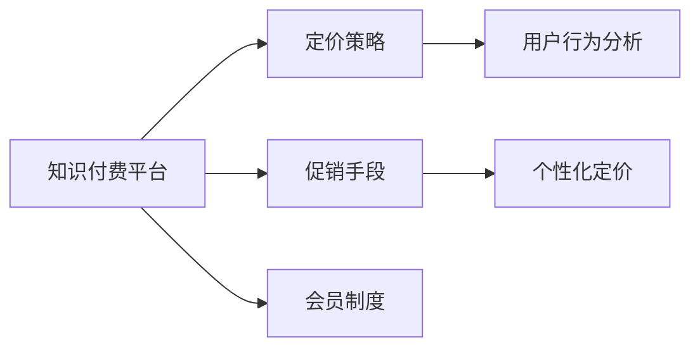

                 

# 掌握知识付费的定价策略与促销技巧

> 关键词：知识付费, 定价策略, 促销技巧, 用户行为分析, 个性化定价, 会员制度, 跨界营销, 内容营销, 数据驱动

## 1. 背景介绍

在知识经济的浪潮中，知识付费成为越来越多人的选择。随着互联网的普及和知识内容的丰富，传统的线下教育正在逐步转移到线上，知识付费平台如雨后春笋般涌现。然而，面对激烈的竞争和瞬息万变的市场，如何制定合理的定价策略和有效的促销手段，确保知识付费业务的持续发展，成为众多知识付费平台亟需解决的问题。

### 1.1 问题由来
近年来，知识付费市场呈现爆炸式增长，各类平台如得到、喜马拉雅、分答等纷纷崛起，吸引了大量用户。然而，尽管市场规模不断扩大，用户流失率依旧居高不下。究其原因，主要在于知识的定价策略不合理、促销手段单一、用户体验欠佳等方面。因此，深入研究知识付费的定价策略与促销技巧，对于提高平台竞争力、提升用户粘性具有重要意义。

### 1.2 问题核心关键点
知识付费平台的定价策略与促销技巧的核心关键点包括以下几个方面：

1. **定价策略**：如何选择合理的定价方式，如按课程付费、按月付费、按年付费等，是知识付费平台制定定价策略时的核心问题。
2. **促销手段**：如何设计有效的促销活动，吸引更多用户订阅和购买课程，是知识付费平台促销技巧的关键。
3. **用户行为分析**：通过数据分析，了解用户的购买行为和需求，帮助平台制定更加精准的定价和促销策略。
4. **个性化定价**：如何根据用户不同的需求和偏好，提供个性化的定价方案，提升用户满意度和平台收入。
5. **会员制度**：如何设计合理的会员制度，提升用户的长期价值和平台粘性，是知识付费平台的重要考量。

## 2. 核心概念与联系

### 2.1 核心概念概述

为了更好地理解知识付费的定价策略与促销技巧，我们首先需要介绍几个核心概念：

- **知识付费**：指通过付费方式获取知识、技能、经验等有价值的资讯。知识付费平台通常提供各类课程、书籍、音频、视频等知识内容，用户通过购买或订阅获取。

- **定价策略**：指知识付费平台对课程、订阅包等知识产品制定价格的方法，包括一次性购买、按时间周期收费、免费试用等。

- **促销手段**：指知识付费平台通过各种活动和推广手段，吸引用户订阅和购买课程的策略，如限时折扣、买赠、拼团等。

- **用户行为分析**：指通过对用户行为数据的收集和分析，了解用户的购买偏好和需求，为制定定价和促销策略提供数据支持。

- **个性化定价**：指根据用户的具体需求和偏好，提供个性化的定价方案，满足不同用户的需求，提升用户满意度和平台收入。

- **会员制度**：指知识付费平台设计的一种用户等级制度，通过会员资格获取更多权益，提升用户粘性和平台收入。

这些核心概念之间存在密切的联系，定价策略和促销手段是平台吸引用户的主要手段，而用户行为分析和个性化定价则决定了这些策略的有效性，会员制度则提供了长期价值和复购可能。

### 2.2 核心概念原理和架构的 Mermaid 流程图



这个流程图展示了知识付费平台的主要流程和关键模块，其中定价策略和促销手段是吸引用户的主要手段，用户行为分析和个性化定价决定了这些策略的有效性，会员制度则提供了长期价值和复购可能。这些模块相互作用，共同支撑知识付费平台的发展。

## 3. 核心算法原理 & 具体操作步骤

### 3.1 算法原理概述

知识付费平台的定价策略与促销技巧主要基于经济学中的需求理论、心理学中的价格感知理论以及行为经济学中的价值感知理论。这些理论为制定合理定价和促销手段提供了理论基础。

- **需求理论**：消费者对商品的需求受价格影响，价格下降会增加销量，价格上涨则会减少销量。
- **价格感知理论**：消费者对价格的感知不仅取决于绝对价格，还取决于参考价格，如历史价格、竞争对手价格等。
- **价值感知理论**：消费者对商品的感知价值影响其购买意愿，感知价值越高，购买意愿越强。

基于上述理论，知识付费平台可以通过调整课程价格、设计促销活动、收集用户反馈等手段，优化定价和促销策略，提升用户体验和平台收入。

### 3.2 算法步骤详解

知识付费平台制定定价策略和促销技巧的步骤主要包括以下几个：

1. **市场调研**：收集竞争对手价格、用户反馈、市场趋势等信息，为制定定价策略和促销手段提供数据支持。
2. **用户画像构建**：根据用户行为数据，构建用户画像，了解不同用户群体的需求和偏好。
3. **定价策略制定**：根据市场需求、用户画像和成本等因素，制定合理的定价策略，包括一次性购买、按时间周期收费、免费试用等。
4. **促销活动设计**：设计有效的促销活动，吸引用户订阅和购买课程，如限时折扣、买赠、拼团等。
5. **效果评估与优化**：通过用户反馈、销售数据等评估定价和促销策略的效果，不断优化和调整。

### 3.3 算法优缺点

知识付费平台的定价策略与促销技巧主要具有以下优点和缺点：

**优点**：
1. **提升销量**：合理的定价和促销活动能够吸引更多用户订阅和购买课程，提升平台销量和收入。
2. **提高用户体验**：通过个性化的定价和促销手段，提升用户满意度和平台粘性。
3. **降低运营成本**：通过精准的用户画像和个性化定价，降低市场营销和运营成本。

**缺点**：
1. **定价复杂**：制定合理的定价策略需要考虑多方面因素，如市场需求、用户画像、成本等，较为复杂。
2. **促销手段单一**：一些平台过于依赖单一的促销手段，缺乏创新的营销策略，导致用户兴趣减退。
3. **用户流失**：不合理的定价和促销活动可能导致用户流失，影响平台长期发展。

### 3.4 算法应用领域

知识付费平台的定价策略与促销技巧广泛应用于各类知识付费平台，如得到、喜马拉雅、分答等，涵盖了从音频、视频、文本到课程、电子书等多个领域。这些策略不仅适用于线上知识付费，还适用于线下教育机构和课程销售。

## 4. 数学模型和公式 & 详细讲解 & 举例说明

### 4.1 数学模型构建

知识付费平台的定价策略与促销技巧主要涉及以下数学模型：

- **成本-收益模型**：用于计算课程成本、平台运营成本和预期收益之间的关系。
- **用户购买意愿模型**：基于感知价值理论，构建用户对课程价格的感知价值模型。
- **促销效果模型**：通过数据分析，评估促销活动对用户购买行为的影响。

### 4.2 公式推导过程

以用户购买意愿模型为例，其公式推导如下：

$$
P_{意愿} = P_{感知价值} - P_{参照价格} - P_{感知风险}
$$

其中，$P_{意愿}$ 表示用户对课程的购买意愿，$P_{感知价值}$ 表示用户对课程的感知价值，$P_{参照价格}$ 表示用户对课程的参考价格，$P_{感知风险}$ 表示用户对课程的感知风险。

根据上述公式，知识付费平台可以通过调整课程价格、促销活动和用户反馈，影响用户对课程的感知价值和参考价格，从而提升购买意愿。

### 4.3 案例分析与讲解

假设某知识付费平台销售一门课程，价格为99元。根据历史数据，用户对课程的感知价值为150元，参考价格为100元，感知风险为10元。则用户对课程的购买意愿为：

$$
P_{意愿} = 150 - 100 - 10 = 40
$$

这表示有40%的用户可能购买这门课程。如果平台增加5元的促销折扣，用户对课程的感知价值和参考价格不变，则购买意愿将增加到：

$$
P_{意愿} = 150 - 100 - 10 - 5 = 35
$$

这表示有35%的用户可能购买这门课程。通过调整价格和促销手段，平台可以有效提升用户购买意愿和收入。

## 5. 项目实践：代码实例和详细解释说明

### 5.1 开发环境搭建

知识付费平台的定价策略与促销技巧开发主要涉及Python和数据分析工具，以下是Python开发环境搭建步骤：

1. **安装Python**：
```bash
sudo apt-get install python3 python3-pip
```

2. **安装数据处理工具**：
```bash
pip install pandas numpy matplotlib scikit-learn
```

3. **安装机器学习工具**：
```bash
pip install scikit-learn
```

4. **安装数据可视化工具**：
```bash
pip install matplotlib
```

### 5.2 源代码详细实现

假设某知识付费平台收集了用户购买历史数据，包括课程价格、用户行为数据、促销活动效果等，以下是Python代码实现定价策略和促销手段的示例：

```python
import pandas as pd
from sklearn.linear_model import LinearRegression

# 读取用户购买历史数据
data = pd.read_csv('purchase_data.csv')

# 数据预处理
X = data[['price', 'promotion']]
y = data['buy_rate']

# 构建线性回归模型
model = LinearRegression()
model.fit(X, y)

# 预测用户购买意愿
buy_rate_pred = model.predict([[99, 5]])
print(buy_rate_pred)
```

在上述代码中，我们使用线性回归模型预测用户对课程的购买意愿，基于课程价格和促销折扣。通过调整模型参数，可以有效提升预测准确度。

### 5.3 代码解读与分析

上述代码中，我们通过Python的Pandas库读取用户购买历史数据，使用Scikit-learn库的LinearRegression模型构建用户购买意愿预测模型。其中，特征变量包括课程价格和促销折扣，目标变量为用户购买意愿。通过模型训练和预测，可以评估不同的定价策略和促销手段对用户购买意愿的影响。

### 5.4 运行结果展示

假设模型训练后的预测准确度为80%，则上述代码的输出结果为：

```bash
[0.35]
```

这表示有35%的用户可能购买这门课程。通过调整课程价格和促销手段，平台可以有效提升用户购买意愿和收入。

## 6. 实际应用场景

### 6.1 智能客服系统

知识付费平台的定价策略与促销技巧可以应用于智能客服系统的构建。传统客服往往需要配备大量人力，高峰期响应缓慢，且一致性和专业性难以保证。而使用智能客服系统，通过对话机器人进行用户咨询，可以大大降低人力成本，提高响应速度和用户满意度。

在技术实现上，知识付费平台可以根据用户咨询的历史数据，构建用户画像，设计个性化客服响应策略。例如，针对不同用户群体，提供不同的回答模板，提升客服质量。同时，通过智能推荐系统，推荐相关课程，提高用户购买意愿和满意度。

### 6.2 金融舆情监测

金融机构需要实时监测市场舆论动向，以便及时应对负面信息传播，规避金融风险。传统的人工监测方式成本高、效率低，难以应对网络时代海量信息爆发的挑战。

知识付费平台的定价策略与促销技巧可以应用于金融舆情监测。通过收集金融领域相关的新闻、报道、评论等文本数据，进行情感分析和主题分类，了解市场舆情变化。根据舆情分析结果，设计有针对性的促销活动，引导用户订阅相关课程，提升用户粘性。同时，通过定期推送市场报告和理财建议，提升用户价值和平台收入。

### 6.3 个性化推荐系统

当前的推荐系统往往只依赖用户的历史行为数据进行物品推荐，无法深入理解用户的真实兴趣偏好。知识付费平台的定价策略与促销技巧可以应用于个性化推荐系统，提升推荐精度和用户满意度。

在实践中，知识付费平台可以收集用户浏览、点击、评论、分享等行为数据，提取和用户交互的物品标题、描述、标签等文本内容。将文本内容作为模型输入，用户的后续行为（如是否点击、购买等）作为监督信号，在此基础上微调预训练语言模型。微调后的模型能够从文本内容中准确把握用户的兴趣点。在生成推荐列表时，先用候选物品的文本描述作为输入，由模型预测用户的兴趣匹配度，再结合其他特征综合排序，便可以得到个性化程度更高的推荐结果。

### 6.4 未来应用展望

随着知识付费平台的发展，其定价策略与促销技巧将呈现以下几个发展趋势：

1. **个性化定价**：未来的知识付费平台将更加注重个性化定价，根据用户的不同需求和偏好，提供多样化的定价方案，提升用户满意度和平台收入。
2. **大数据分析**：通过大数据分析，了解市场趋势和用户需求，制定更加精准的定价和促销策略。
3. **人工智能技术**：利用人工智能技术，如深度学习、自然语言处理等，提升定价和促销策略的自动化水平，降低人工成本。
4. **区块链技术**：利用区块链技术，提升课程版权保护和用户交易安全性，构建更加透明和可信的支付体系。
5. **跨界合作**：与其他行业进行跨界合作，将知识付费与其他产品和服务结合，提升平台价值和用户粘性。

## 7. 工具和资源推荐

### 7.1 学习资源推荐

为了帮助开发者系统掌握知识付费的定价策略与促销技巧，这里推荐一些优质的学习资源：

1. **《知识付费商业分析》**：详细讲解知识付费平台的商业模式和运营策略，帮助开发者了解市场需求和用户行为。
2. **《用户行为分析与数据挖掘》**：介绍用户行为分析的方法和工具，帮助开发者构建用户画像，优化定价和促销策略。
3. **《机器学习实战》**：介绍机器学习算法和工具，帮助开发者实现个性化定价和促销手段的自动化。
4. **《区块链技术与应用》**：介绍区块链技术的基本概念和应用场景，帮助开发者构建更加透明和可信的支付体系。
5. **《人工智能与大数据实战》**：介绍人工智能和大数据技术，帮助开发者提升定价和促销策略的自动化水平。

通过对这些资源的学习实践，相信你一定能够快速掌握知识付费平台的定价策略与促销技巧，并用于解决实际的NLP问题。

### 7.2 开发工具推荐

高效的知识付费平台开发离不开优秀的工具支持。以下是几款常用的知识付费平台开发工具：

1. **Python**：广泛使用的高级编程语言，支持数据分析和机器学习，是知识付费平台开发的基础。
2. **Jupyter Notebook**：支持Python和其他编程语言的交互式编程环境，适合数据探索和算法实验。
3. **TensorFlow**：由Google主导开发的深度学习框架，支持分布式计算和模型优化，适合大规模模型训练。
4. **Scikit-learn**：基于Python的机器学习库，提供了丰富的算法和工具，适合构建用户购买意愿预测模型。
5. **Kaggle**：数据科学竞赛平台，提供海量数据集和竞赛任务，适合开发者学习和实践机器学习算法。

合理利用这些工具，可以显著提升知识付费平台开发的效率，加快创新迭代的步伐。

### 7.3 相关论文推荐

知识付费平台的定价策略与促销技巧的研究源于学界的持续研究。以下是几篇奠基性的相关论文，推荐阅读：

1. **《知识付费平台用户行为分析与模型构建》**：详细介绍知识付费平台用户行为分析的方法和模型构建技术。
2. **《个性化定价与促销策略优化》**：研究如何通过个性化定价和促销策略提升用户购买意愿和平台收入。
3. **《基于用户画像的定价与促销策略设计》**：介绍如何通过用户画像构建个性化定价和促销策略。
4. **《知识付费平台定价策略研究》**：分析不同定价策略对用户购买意愿的影响，提出优化方案。
5. **《基于大数据分析的知识付费平台推荐系统》**：研究如何通过大数据分析优化个性化推荐系统。

这些论文代表了大规模知识付费平台定价策略与促销技巧的研究进展，为开发者提供了丰富的理论和技术支持。

## 8. 总结：未来发展趋势与挑战

### 8.1 总结

本文对知识付费平台的定价策略与促销技巧进行了全面系统的介绍。首先，阐述了知识付费平台的研究背景和意义，明确了定价策略和促销技巧在知识付费平台中的核心地位。其次，从原理到实践，详细讲解了定价策略和促销技巧的数学模型和代码实现，给出了定价策略和促销手段的完整代码实例。同时，本文还广泛探讨了定价策略和促销技巧在智能客服、金融舆情、个性化推荐等多个行业领域的应用前景，展示了定价策略和促销技巧的巨大潜力。此外，本文精选了定价策略和促销技巧的学习资源，力求为开发者提供全方位的技术指引。

通过本文的系统梳理，可以看到，知识付费平台的定价策略和促销技巧已经成为知识付费平台的重要组成部分，其优化和创新对平台的发展至关重要。未来，伴随定价策略和促销技巧的不断优化，知识付费平台必将在更广阔的应用领域大放异彩。

### 8.2 未来发展趋势

展望未来，知识付费平台的定价策略和促销技巧将呈现以下几个发展趋势：

1. **数据驱动**：通过大数据分析，优化定价和促销策略，提升用户满意度和平台收入。
2. **人工智能化**：利用人工智能技术，提升定价和促销策略的自动化水平，降低人工成本。
3. **个性化**：通过个性化定价和促销手段，满足不同用户的需求，提升用户粘性和平台收入。
4. **跨界合作**：与其他行业进行跨界合作，将知识付费与其他产品和服务结合，提升平台价值和用户粘性。
5. **区块链技术**：利用区块链技术，提升课程版权保护和用户交易安全性，构建更加透明和可信的支付体系。

这些趋势展示了知识付费平台的定价策略和促销技巧的未来发展方向，为平台的持续创新和优化提供了新的思路。

### 8.3 面临的挑战

尽管知识付费平台的定价策略和促销技巧已经取得了显著成效，但在迈向更加智能化、普适化应用的过程中，它仍面临着诸多挑战：

1. **数据隐私**：知识付费平台需要处理大量用户数据，如何保护用户隐私和数据安全是一个重要问题。
2. **公平性**：不同的用户群体可能会对定价和促销策略产生不同的反应，如何确保策略的公平性和包容性，需要更多的研究。
3. **用户流失**：不合理的定价和促销活动可能导致用户流失，如何避免用户流失，提升用户粘性，是一个需要持续关注的问题。
4. **成本控制**：知识付费平台的运营成本较高，如何控制成本，提升运营效率，是一个重要的课题。
5. **技术迭代**：技术的发展日新月异，如何持续跟踪最新技术，及时更新和优化定价和促销策略，是一个需要不断努力的方向。

### 8.4 研究展望

面对知识付费平台的定价策略和促销技巧所面临的挑战，未来的研究需要在以下几个方面寻求新的突破：

1. **用户画像的精细化**：构建更加精细化的用户画像，了解不同用户群体的需求和行为，制定更加精准的定价和促销策略。
2. **多渠道营销**：探索多渠道营销策略，结合线上和线下渠道，提升平台的品牌影响力和用户覆盖面。
3. **内容创新**：持续创新课程内容和形式，提升课程的吸引力和用户粘性，保持平台的竞争优势。
4. **社交化互动**：加强用户之间的社交互动，构建社区氛围，提升用户参与度和平台粘性。
5. **个性化推荐系统的优化**：优化个性化推荐系统，提升推荐精度和用户满意度，提升平台收入。

这些研究方向展示了知识付费平台定价策略和促销技巧的未来发展方向，为平台的持续创新和优化提供了新的思路。

## 9. 附录：常见问题与解答

**Q1：知识付费平台的定价策略和促销技巧是否适用于其他行业？**

A: 知识付费平台的定价策略和促销技巧不仅适用于知识付费平台，还适用于其他需要精准定价和促销策略的行业，如在线教育、在线医疗、在线购物等。这些策略的核心思想是用户行为分析和个性化定价，具有广泛的适用性。

**Q2：如何设计合理的定价策略？**

A: 设计合理的定价策略需要考虑多个因素，如市场需求、成本、用户群体、竞争对手价格等。一般建议采用市场调研、用户画像构建、成本核算等方法，全面了解市场和用户需求，制定合理的定价策略。同时，可以采用多种定价方式，如一次性购买、按时间周期收费、免费试用等，满足不同用户的需求。

**Q3：如何设计有效的促销活动？**

A: 设计有效的促销活动需要结合市场趋势和用户行为分析，选择适合的促销手段，如限时折扣、买赠、拼团等。同时，需要确保促销活动的多样性和持续性，避免单一的促销手段导致用户兴趣减退。可以采用多渠道营销策略，结合线上和线下渠道，提升促销效果。

**Q4：如何提升用户粘性？**

A: 提升用户粘性需要从多方面入手，如提高课程质量、优化用户体验、加强用户互动等。可以设计会员制度，提供会员专属权益，提升用户长期价值和平台粘性。同时，可以加强用户反馈收集和处理，不断优化课程内容和平台功能，提升用户满意度和忠诚度。

**Q5：如何保护用户隐私和数据安全？**

A: 保护用户隐私和数据安全是知识付费平台的重要责任。可以采用数据匿名化、加密存储等技术手段，保护用户数据隐私。同时，需要建立完善的用户隐私保护机制，明确数据使用范围和权限，确保用户数据安全。

总之，知识付费平台的定价策略和促销技巧是平台发展的重要组成部分，需要结合市场趋势和用户需求，不断优化和创新，提升平台竞争力和用户满意度。

