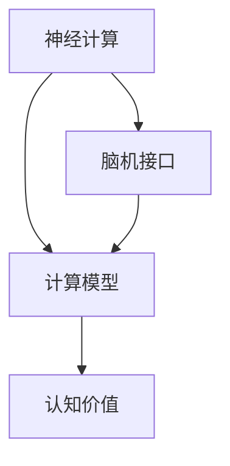

                 

# 探索人类思维的奥秘：人类计算的认知价值

> 关键词：认知价值,人类计算,神经计算,脑机接口,计算模型

## 1. 背景介绍

### 1.1 问题由来
人类思维是一个极其复杂且奥秘重重的领域。如何准确理解和模拟人类思维，始终是科学家和工程师面临的一项重大挑战。近年来，随着神经科学、计算科学和生物工程等交叉学科的迅速发展，研究人员开始尝试利用计算模型来理解和模拟人类思维，并提出了诸如神经计算、脑机接口等概念。这一方向不仅有助于深入揭示人类思维的奥秘，也为人工智能和智能计算技术提供了全新的灵感和应用场景。

### 1.2 问题核心关键点
本文将聚焦于探讨人类计算的认知价值，旨在揭示计算模型在模拟人类思维方面的潜力，以及如何将这些模型应用于现实世界的问题解决中。我们将详细探讨神经计算和脑机接口等核心概念，分析这些模型的理论基础，并介绍一些实际应用案例，以期为读者提供一个全面的视角来理解人类计算的认知价值。

### 1.3 问题研究意义
研究人类计算的认知价值对于理解人类思维机制，开发更加智能的计算模型，以及推动智能技术在医疗、教育、娱乐等领域的应用具有重要意义。通过探索人类计算，我们不仅能够获得更深入的认知洞察，还能够开发出更加人性化的智能系统，从而更好地服务人类社会。

## 2. 核心概念与联系

### 2.1 核心概念概述

为了更好地理解人类计算的认知价值，我们首先介绍几个核心概念：

- **神经计算（Neuromorphic Computing）**：基于人脑神经网络结构和功能的计算模型，旨在通过模拟神经元和突触的物理特性来实现高效、低功耗的计算。

- **脑机接口（Brain-Computer Interface, BCI）**：一种使人类大脑与计算机系统直接交互的技术，通过提取大脑信号来控制计算机或其他外部设备。

- **计算模型（Computational Model）**：用于描述和模拟物理世界和思维过程的数学或算法模型，广泛应用于神经科学、认知科学和人工智能等领域。

- **认知价值（Cognitive Value）**：指计算模型在揭示人类思维机制、提升认知能力、以及解决实际问题中的重要性和贡献。

这些核心概念之间的逻辑关系可以通过以下Mermaid流程图来展示：



这个流程图展示了神经计算、脑机接口和计算模型之间的关系，以及它们如何共同作用，提升认知价值。

## 3. 核心算法原理 & 具体操作步骤

### 3.1 算法原理概述

人类计算的核心在于如何构建能够有效模拟人类思维的计算模型。这些模型通常基于神经网络结构和功能，通过模拟神经元的活动和突触的连接来实现计算。在神经计算中，模型的构建和训练涉及以下几个关键步骤：

1. **神经网络结构设计**：选择合适的神经网络结构，如卷积神经网络（CNN）、循环神经网络（RNN）或神经元网络（NN）。
2. **神经元激活函数选择**：确定神经元的激活函数，如ReLU、Sigmoid或Tanh，以实现非线性映射。
3. **突触连接权重学习**：通过反向传播算法（Backpropagation）优化突触连接权重，使模型能够学习和适应新的输入。
4. **训练集和验证集划分**：将数据集划分为训练集和验证集，用于模型的训练和验证。
5. **损失函数和优化器选择**：选择合适的损失函数（如交叉熵损失）和优化器（如Adam、SGD），以最小化模型的预测误差。

### 3.2 算法步骤详解

下面是构建神经计算模型的一般步骤：

**Step 1: 神经网络结构设计**
- 选择合适的神经网络结构，如卷积神经网络（CNN）、循环神经网络（RNN）或神经元网络（NN）。
- 定义神经元的数量、层数以及各层之间的连接方式。

**Step 2: 神经元激活函数选择**
- 确定神经元的激活函数，如ReLU、Sigmoid或Tanh。
- 定义激活函数的作用域和输出范围。

**Step 3: 突触连接权重学习**
- 使用反向传播算法（Backpropagation）优化突触连接权重。
- 定义损失函数和优化器，设置初始学习率。
- 通过迭代训练过程，更新权重参数，以最小化预测误差。

**Step 4: 训练集和验证集划分**
- 将数据集划分为训练集和验证集。
- 使用训练集进行模型训练，使用验证集进行模型验证和参数调整。

**Step 5: 损失函数和优化器选择**
- 选择适当的损失函数，如交叉熵损失。
- 选择优化器，如Adam或SGD，设置学习率和迭代次数。

### 3.3 算法优缺点

神经计算模型在模拟人类思维方面具有以下优点：
- 能够处理非线性复杂度高的输入数据。
- 可以适应大规模数据集，通过并行计算提升处理速度。
- 能够实现高效、低功耗的计算，适用于各种应用场景。

同时，神经计算模型也存在一些缺点：
- 需要大量标注数据进行训练，数据获取成本较高。
- 模型复杂度高，训练和推理耗时长，硬件需求高。
- 模型黑箱性强，难以解释其内部工作机制。

### 3.4 算法应用领域

神经计算和脑机接口技术已经被广泛应用于多个领域，具体包括：

- **医疗**：用于神经疾病的诊断和治疗，如癫痫、帕金森病等。
- **教育**：通过脑机接口技术开发个性化学习系统，提升学习效率和质量。
- **娱乐**：开发虚拟现实游戏和互动娱乐应用，增强用户体验。
- **军事**：用于无人驾驶、自动化控制等领域，提高系统响应速度和决策能力。

## 4. 数学模型和公式 & 详细讲解 & 举例说明

### 4.1 数学模型构建

神经计算模型的数学模型可以表示为：

$$
y = f(Wx + b)
$$

其中 $y$ 表示输出，$x$ 表示输入，$W$ 表示突触连接权重矩阵，$b$ 表示偏置向量，$f$ 表示激活函数。

### 4.2 公式推导过程

以简单的前馈神经网络为例，我们推导其反向传播算法的梯度更新公式：

设输入数据为 $x_i$，目标输出为 $t_i$，神经网络的预测输出为 $y_i$，激活函数为 $f$。则前向传播计算过程如下：

1. 计算输入层到隐层权重 $W_{hi}$ 和偏置 $b_h$，得到隐层输出 $h_i = f(W_{hi}x_i + b_h)$。
2. 计算隐层到输出层权重 $W_{ou}$ 和偏置 $b_o$，得到输出层输出 $y_i = f(W_{ou}h_i + b_o)$。

根据均方误差损失函数 $L = \frac{1}{2}\sum_i(y_i - t_i)^2$，计算梯度：

1. 计算输出层误差梯度 $\delta_{ou}$：

$$
\delta_{ou} = (y_i - t_i) \frac{\partial L}{\partial y_i}
$$

2. 计算隐层误差梯度 $\delta_{h}$：

$$
\delta_h = W_{ou}^T\delta_{ou} \frac{\partial f(y_i)}{\partial h_i}
$$

3. 计算权重和偏置的梯度：

$$
\frac{\partial L}{\partial W_{ou}} = \delta_{ou}h_i^T, \quad \frac{\partial L}{\partial b_o} = \delta_{ou}, \quad \frac{\partial L}{\partial W_{hi}} = h_i\delta_{ou}^T, \quad \frac{\partial L}{\partial b_h} = \delta_{ou}^T
$$

### 4.3 案例分析与讲解

以手写数字识别为例，我们使用MNIST数据集进行模型训练。首先，将数据集分为训练集和测试集，然后进行模型训练和验证：

1. 将训练集数据进行归一化处理，输入到神经网络中进行前向传播计算。
2. 计算输出与目标标签的误差，反向传播计算梯度。
3. 使用Adam优化器更新模型参数，不断迭代直至收敛。
4. 在测试集上进行模型测试，评估模型性能。

## 5. 项目实践：代码实例和详细解释说明

### 5.1 开发环境搭建

在进行神经计算项目实践前，我们需要准备好开发环境。以下是使用Python进行TensorFlow开发的环境配置流程：

1. 安装Anaconda：从官网下载并安装Anaconda，用于创建独立的Python环境。

2. 创建并激活虚拟环境：
```bash
conda create -n tensorflow-env python=3.8 
conda activate tensorflow-env
```

3. 安装TensorFlow：根据CUDA版本，从官网获取对应的安装命令。例如：
```bash
conda install tensorflow tensorflow-gpu=cuda11.3 -c conda-forge -c nvidia
```

4. 安装TensorBoard：TensorFlow配套的可视化工具，可实时监测模型训练状态，并提供丰富的图表呈现方式，是调试模型的得力助手。
```bash
pip install tensorboard
```

5. 安装相关库：
```bash
pip install numpy matplotlib pandas sklearn
```

完成上述步骤后，即可在`tensorflow-env`环境中开始神经计算实践。

### 5.2 源代码详细实现

我们使用TensorFlow实现手写数字识别任务。具体代码如下：

```python
import tensorflow as tf
from tensorflow.keras.datasets import mnist
from tensorflow.keras.models import Sequential
from tensorflow.keras.layers import Dense, Flatten

# 加载MNIST数据集
(x_train, y_train), (x_test, y_test) = mnist.load_data()

# 数据预处理
x_train = x_train.reshape(-1, 784) / 255.0
x_test = x_test.reshape(-1, 784) / 255.0

# 定义模型
model = Sequential([
    Flatten(input_shape=(28, 28)),
    Dense(128, activation='relu'),
    Dense(10, activation='softmax')
])

# 编译模型
model.compile(optimizer='adam', loss='sparse_categorical_crossentropy', metrics=['accuracy'])

# 训练模型
model.fit(x_train, y_train, epochs=10, batch_size=32, validation_data=(x_test, y_test))

# 评估模型
test_loss, test_acc = model.evaluate(x_test, y_test)
print('Test accuracy:', test_acc)
```

### 5.3 代码解读与分析

让我们再详细解读一下关键代码的实现细节：

**模型定义**：
- `Sequential`：定义一个顺序层模型，包含多个连续层。
- `Flatten`：将二维的输入数据展平为一维。
- `Dense`：定义全连接层，使用ReLU激活函数。
- `softmax`：输出层使用softmax激活函数，实现多分类任务。

**数据预处理**：
- 将28x28的图像数据展平为一维向量，并进行归一化处理，使其值在0到1之间。

**模型编译**：
- 使用Adam优化器和交叉熵损失函数，同时设置准确率作为评估指标。

**模型训练**：
- 使用`fit`方法进行模型训练，设定训练轮数为10，批次大小为32。
- 在每个epoch结束后，使用测试集数据进行模型评估。

**模型评估**：
- 使用`evaluate`方法评估模型在测试集上的准确率。

可以看到，TensorFlow使得神经计算模型的构建和训练变得简洁高效。开发者可以更多地关注算法设计和数据处理，而不必过多关注底层的实现细节。

## 6. 实际应用场景

### 6.1 智能医疗

神经计算在医疗领域的应用前景广阔，特别是在神经疾病的诊断和治疗方面。通过脑机接口技术，可以实时监测患者的大脑活动，提取相关的神经信号特征，用于诊断癫痫、帕金森病等神经系统疾病。此外，还可以利用神经计算模型对药物反应进行预测，优化药物设计和剂量，提升治疗效果。

### 6.2 智能教育

教育领域是神经计算应用的另一个重要方向。通过脑机接口技术，可以开发个性化的学习系统，实时监测学生的学习状态和理解程度，提供个性化的学习内容和反馈。同时，神经计算模型还可以用于智能化的作业批改和考试监考，提高教学效率和质量。

### 6.3 智能交通

在交通领域，神经计算和脑机接口技术可以用于无人驾驶、智能交通控制等方面。通过实时监测驾驶员的大脑活动，可以预测其驾驶行为，提升车辆安全性和驾驶舒适度。此外，神经计算模型还可以用于交通流量预测和优化，提高交通系统的效率和稳定性。

## 7. 工具和资源推荐

### 7.1 学习资源推荐

为了帮助开发者系统掌握神经计算的理论基础和实践技巧，这里推荐一些优质的学习资源：

1. **《深度学习》（Ian Goodfellow等著）**：深入讲解深度学习和神经计算的基本概念和算法，适合初学者和进阶学习者。
2. **Coursera《深度学习专项课程》**：由斯坦福大学Andrew Ng教授主讲，涵盖深度学习的基本原理和应用场景，适合系统学习。
3. **NeurIPS论文库**：最新的人工智能和神经计算领域的学术论文库，涵盖前沿理论和应用技术，适合深入研究。

### 7.2 开发工具推荐

高效的开发离不开优秀的工具支持。以下是几款用于神经计算开发的常用工具：

1. **TensorFlow**：由Google主导开发的深度学习框架，支持多种硬件和软件环境，提供强大的计算图和分布式训练能力。
2. **PyTorch**：Facebook开发的深度学习框架，支持动态图和静态图两种计算模型，适合研究和原型开发。
3. **JAX**：谷歌开发的高级深度学习库，支持动态图和自动微分，性能高效，易于扩展。
4. **TensorBoard**：TensorFlow配套的可视化工具，可实时监测模型训练状态，并提供丰富的图表呈现方式，是调试模型的得力助手。

### 7.3 相关论文推荐

神经计算和脑机接口技术的发展源于学界的持续研究。以下是几篇奠基性的相关论文，推荐阅读：

1. **《神经网络与深度学习》（Michael Nielsen著）**：深入讲解神经网络的基本概念和算法，适合初学者和进阶学习者。
2. **《深度学习》（Goodfellow等著）**：详细讲解深度学习的理论基础和应用实践，涵盖神经计算的核心算法和前沿技术。
3. **《脑机接口》（Daniel J. Hillis等著）**：详细探讨脑机接口技术的基本原理和应用场景，适合系统学习和研究。

通过对这些资源的学习实践，相信你一定能够快速掌握神经计算的精髓，并用于解决实际的智能问题。

## 8. 总结：未来发展趋势与挑战

### 8.1 总结

本文对神经计算的认知价值进行了全面系统的介绍。首先阐述了神经计算和脑机接口技术的研究背景和意义，明确了神经计算在模拟人类思维方面的独特价值。其次，从原理到实践，详细讲解了神经计算模型的构建和训练过程，给出了神经计算项目开发的完整代码实例。同时，本文还广泛探讨了神经计算在医疗、教育、交通等多个领域的应用前景，展示了神经计算技术的广泛应用潜力。

通过本文的系统梳理，可以看到，神经计算和脑机接口技术正在成为人工智能领域的重要方向，不仅为人类认知智能的进化提供了新的视角，也为智能技术在各行各业的应用带来了新的突破。未来，伴随神经计算模型的不断进步，以及脑机接口技术的深入探索，这些技术必将在更广阔的应用领域大放异彩，深刻影响人类的生产生活方式。

### 8.2 未来发展趋势

展望未来，神经计算和脑机接口技术将呈现以下几个发展趋势：

1. **神经网络结构优化**：未来的神经计算模型将进一步优化其网络结构，引入更多并行和分布式计算技术，提升模型的计算效率和推理速度。
2. **深度学习与生物科学的融合**：随着对神经科学研究的深入，神经计算模型将与生物科学、医学等领域进行更紧密的融合，提升模型的真实性和可靠性。
3. **计算模型与脑机接口技术的结合**：未来的脑机接口技术将更深入地结合计算模型，实现对大脑信号的精确分析和控制，提升用户体验和应用效果。
4. **实时性计算**：随着硬件性能的提升和算法优化的进步，神经计算模型将更注重实时性计算，适用于各种时间敏感的应用场景。
5. **跨学科应用**：神经计算和脑机接口技术将与其他人工智能技术进行更深入的融合，应用于更多领域，如智能交通、智能城市等。

以上趋势凸显了神经计算和脑机接口技术的广阔前景。这些方向的探索发展，必将进一步提升神经计算模型的性能和应用范围，为人类认知智能的进化带来新的可能性。

### 8.3 面临的挑战

尽管神经计算和脑机接口技术已经取得了瞩目成就，但在迈向更加智能化、普适化应用的过程中，它仍面临诸多挑战：

1. **数据获取瓶颈**：高质量的数据获取成本较高，特别是在医疗和脑机接口领域，数据获取和标注难度大。
2. **模型复杂度问题**：神经计算模型的复杂度高，训练和推理耗时长，硬件需求高。
3. **模型解释性不足**：神经计算模型往往黑箱性强，难以解释其内部工作机制。
4. **伦理和安全问题**：神经计算和脑机接口技术在应用过程中可能涉及隐私和伦理问题，需要加强监管和保护措施。
5. **计算资源限制**：大规模神经计算模型的训练和推理需要高性能的计算资源，目前仍存在计算资源限制。

### 8.4 未来突破

面对神经计算和脑机接口技术所面临的种种挑战，未来的研究需要在以下几个方面寻求新的突破：

1. **数据增强和迁移学习**：通过数据增强和迁移学习技术，降低对高质量标注数据的依赖，提高模型的泛化能力。
2. **模型压缩和优化**：通过模型压缩和优化技术，减小模型参数量，提升计算效率，降低硬件需求。
3. **可解释性和可视化**：开发更可解释和可视化的神经计算模型，增强模型的透明度和可解释性。
4. **伦理和安全保障**：加强对神经计算和脑机接口技术的伦理和安全研究，制定相关法规和标准，保护用户隐私和数据安全。
5. **跨领域应用**：将神经计算和脑机接口技术应用于更多领域，如智能交通、智能城市等，拓展其应用场景。

这些研究方向的探索，必将引领神经计算和脑机接口技术迈向更高的台阶，为构建安全、可靠、可解释、可控的智能系统铺平道路。面向未来，神经计算和脑机接口技术还需要与其他人工智能技术进行更深入的融合，如知识表示、因果推理、强化学习等，多路径协同发力，共同推动自然语言理解和智能交互系统的进步。只有勇于创新、敢于突破，才能不断拓展神经计算和脑机接口技术的边界，让智能技术更好地造福人类社会。

## 9. 附录：常见问题与解答

**Q1：神经计算和脑机接口技术是否适用于所有NLP任务？**

A: 神经计算和脑机接口技术主要适用于模拟人类思维和认知过程，虽然在一些特殊领域的应用中表现出一定潜力，但并不适用于所有NLP任务。特别是在需要精确逻辑推理和规则计算的领域，如法律、会计等，神经计算和脑机接口技术可能需要与其他技术相结合，才能取得最佳效果。

**Q2：神经计算模型在实际应用中面临哪些资源瓶颈？**

A: 神经计算模型在实际应用中面临以下几个资源瓶颈：
1. 数据获取瓶颈：高质量的数据获取成本较高，特别是在医疗和脑机接口领域，数据获取和标注难度大。
2. 模型复杂度问题：神经计算模型的复杂度高，训练和推理耗时长，硬件需求高。
3. 模型解释性不足：神经计算模型往往黑箱性强，难以解释其内部工作机制。
4. 伦理和安全问题：神经计算和脑机接口技术在应用过程中可能涉及隐私和伦理问题，需要加强监管和保护措施。
5. 计算资源限制：大规模神经计算模型的训练和推理需要高性能的计算资源，目前仍存在计算资源限制。

**Q3：如何缓解神经计算模型在实际应用中的过拟合问题？**

A: 缓解神经计算模型在实际应用中的过拟合问题，可以通过以下几种方法：
1. 数据增强：通过数据增强技术，增加训练集的多样性，减少过拟合风险。
2. 正则化：使用L2正则化、Dropout等技术，抑制模型过拟合。
3. 迁移学习：通过迁移学习技术，利用预训练模型的知识，提升模型的泛化能力。
4. 模型压缩：通过模型压缩技术，减小模型参数量，提升模型的泛化能力。
5. 模型集成：通过模型集成技术，结合多个模型的预测结果，提高模型的泛化能力。

**Q4：神经计算模型在实际应用中需要注意哪些问题？**

A: 神经计算模型在实际应用中需要注意以下几个问题：
1. 模型裁剪：去除不必要的层和参数，减小模型尺寸，加快推理速度。
2. 量化加速：将浮点模型转为定点模型，压缩存储空间，提高计算效率。
3. 服务化封装：将模型封装为标准化服务接口，便于集成调用。
4. 弹性伸缩：根据请求流量动态调整资源配置，平衡服务质量和成本。
5. 监控告警：实时采集系统指标，设置异常告警阈值，确保服务稳定性。
6. 安全防护：采用访问鉴权、数据脱敏等措施，保障数据和模型安全。

**Q5：神经计算和脑机接口技术在未来有哪些应用前景？**

A: 神经计算和脑机接口技术在未来有以下几个应用前景：
1. 医疗领域：用于神经疾病的诊断和治疗，如癫痫、帕金森病等。
2. 教育领域：通过脑机接口技术开发个性化学习系统，提升学习效率和质量。
3. 娱乐领域：开发虚拟现实游戏和互动娱乐应用，增强用户体验。
4. 交通领域：用于无人驾驶、智能交通控制等方面，提高系统响应速度和决策能力。
5. 智能交通：通过实时监测驾驶员的大脑活动，预测其驾驶行为，提升车辆安全性和驾驶舒适度。

---
作者：禅与计算机程序设计艺术 / Zen and the Art of Computer Programming

