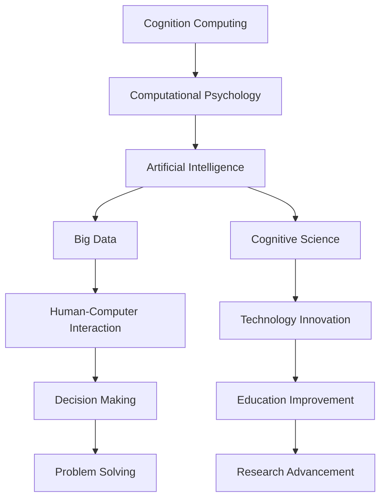

                 

# 探索人类潜力的无限可能：人类计算的新征程

> 关键词：人类计算, 认知计算, 计算心理学, 人工智能, 机器学习, 深度学习, 神经网络, 大数据, 认知科学

## 1. 背景介绍

### 1.1 问题由来
随着计算技术的飞速发展，人类对计算的定义和范畴已经发生了深刻的变化。从最早的机械计算到电子计算机的出现，再到目前的数字智能时代，计算已经超越了传统的数学运算范畴，涵盖了大数据处理、智能决策、情感计算等多个领域。而“人类计算”则是对这一发展趋势的最新诠释，旨在将人类的认知能力和计算能力结合起来，推动科学技术和社会进步的深度融合。

### 1.2 问题核心关键点
人类计算是一个综合性概念，其核心关键点包括：

- **认知计算**：利用人类的认知能力，如感知、记忆、推理等，进行复杂问题的解决。
- **计算心理学**：研究如何通过计算技术优化人类的认知过程，提升工作效率和学习能力。
- **人工智能**：通过机器学习、深度学习等技术，模拟人类认知过程，实现自动化决策和智能交互。
- **大数据**：借助先进的计算技术，对海量数据进行处理和分析，从中提取有价值的信息和洞见。
- **认知科学**：探索人类认知的本质和规律，将研究成果应用于计算技术的改进和创新。

### 1.3 问题研究意义
研究人类计算，对于提升人类认知能力和计算效率，推动技术创新和社会进步具有重要意义：

1. **提升决策能力**：通过认知计算和大数据，帮助决策者快速获取和分析相关信息，进行更加科学和合理的决策。
2. **优化学习过程**：利用计算心理学和认知科学的研究成果，设计更加高效的学习工具和环境，提升教育效果和人才培养质量。
3. **推动技术创新**：结合人工智能和计算技术，开发智能化应用，解决复杂问题，推动技术和社会发展。
4. **改善人机交互**：通过情感计算和智能交互技术，提升用户体验，构建更加和谐的人机关系。
5. **促进跨学科研究**：人类计算涉及心理学、计算机科学、认知科学等多个学科，促进跨学科的交流与合作，推动科学研究的深入发展。

## 2. 核心概念与联系

### 2.1 核心概念概述

为更好地理解人类计算的核心概念及其相互联系，本节将介绍几个关键概念：

- **认知计算**：将人类认知能力融入计算过程中，通过模拟人类的认知过程，进行复杂问题的解决。
- **计算心理学**：研究如何通过计算技术优化人类的认知过程，提升效率和效果。
- **人工智能**：通过机器学习、深度学习等技术，模拟人类的认知过程，实现自动化决策和智能交互。
- **大数据**：借助先进的计算技术，对海量数据进行处理和分析，从中提取有价值的信息和洞见。
- **认知科学**：探索人类认知的本质和规律，将研究成果应用于计算技术的改进和创新。

这些核心概念之间的逻辑关系可以通过以下Mermaid流程图来展示：



这个流程图展示了几大核心概念及其之间的关系：

1. **认知计算**通过模拟人类认知，进行复杂问题的解决。
2. **计算心理学**优化人类的认知过程，提升效率和效果。
3. **人工智能**模拟人类认知，实现自动化决策和智能交互。
4. **大数据**处理海量数据，提取信息洞见。
5. **认知科学**探索人类认知，推动技术创新。
6. **人类计算**将以上概念融合，推动技术和社会进步。

这些概念共同构成了人类计算的核心理论框架，为研究人类计算提供了坚实的理论基础。

## 3. 核心算法原理 & 具体操作步骤
### 3.1 算法原理概述

人类计算的核心算法原理是结合认知心理学和计算技术的原理，具体来说包括：

- **认知建模**：通过模拟人类认知过程，构建认知模型，进行问题求解。
- **计算优化**：利用计算技术，优化人类认知过程，提升效率和效果。
- **机器学习**：通过学习大量数据，优化认知模型，实现自动化决策。
- **深度学习**：通过多层次神经网络结构，模拟人类认知过程，进行复杂问题的解决。
- **数据挖掘**：通过大数据技术，从海量数据中提取有价值的信息和洞见。

这些算法原理共同构成了人类计算的算法基础，使其能够高效地解决各种复杂问题。

### 3.2 算法步骤详解

人类计算的算法步骤一般包括以下几个关键步骤：

**Step 1: 认知建模**
- 确定需要解决的问题，分析问题的复杂度和难度。
- 根据问题特点，选择合适的认知模型，并进行建模。

**Step 2: 数据预处理**
- 收集和整理相关数据，进行清洗和处理，确保数据的质量和完整性。
- 使用计算技术，对数据进行标准化和特征提取，以便于后续处理。

**Step 3: 模型训练**
- 根据认知模型，选择合适的机器学习算法，并进行训练。
- 使用大数据技术，优化训练过程，提高模型的效率和精度。

**Step 4: 模型验证**
- 使用验证集对训练好的模型进行测试，评估模型的性能和效果。
- 根据测试结果，调整模型参数和训练策略，进一步优化模型。

**Step 5: 模型应用**
- 将优化后的模型应用于实际问题，进行问题求解。
- 根据问题解决的效果，进行反馈和迭代，不断提升模型的性能。

### 3.3 算法优缺点

人类计算的算法具有以下优点：

1. **高效性**：结合认知心理学和计算技术，能够高效地处理复杂问题。
2. **精确性**：通过机器学习和大数据技术，可以提高模型的精确性和可靠性。
3. **鲁棒性**：模型的鲁棒性强，能够处理各种复杂和不确定性条件。
4. **可解释性**：认知计算的过程可以通过认知建模进行解释，易于理解和调试。

同时，该算法也存在一定的局限性：

1. **复杂性高**：结合多个学科的知识，实现难度较大。
2. **数据需求高**：需要大量高质量的数据，数据获取和处理成本较高。
3. **模型解释困难**：认知计算的模型较为复杂，难以解释其内部工作机制。
4. **对技术要求高**：需要深厚的计算技术和认知心理学知识，对技术水平要求较高。

尽管存在这些局限性，但就目前而言，人类计算算法仍是大数据和复杂问题解决的重要手段。未来相关研究的重点在于如何进一步降低数据获取和处理成本，提高模型的可解释性和鲁棒性，同时兼顾高效性和精确性。

### 3.4 算法应用领域

人类计算的算法已经广泛应用于多个领域，具体包括：

- **医疗健康**：通过认知计算和机器学习，进行疾病诊断和治疗方案的优化。
- **金融投资**：利用大数据和人工智能，进行市场预测和风险管理。
- **教育培训**：通过计算心理学和认知建模，优化学习过程和教学方法。
- **工业制造**：使用大数据和机器学习，进行生产过程的优化和质量控制。
- **城市管理**：借助大数据和人工智能，进行城市规划和交通管理。

除了上述这些领域外，人类计算的算法还在更多领域得到应用，如环境保护、安全防御、智能家居等，为各个行业带来了新的创新和发展动力。

## 4. 数学模型和公式 & 详细讲解  
### 4.1 数学模型构建

本节将使用数学语言对人类计算的算法步骤进行更加严格的刻画。

记认知模型为 $M_{\theta}(x)$，其中 $\theta$ 为模型参数，$x$ 为输入数据。假设认知模型为多层次神经网络，其中 $L$ 为层数，$n_l$ 为第 $l$ 层的神经元数。设输入数据的特征表示为 $x \in \mathbb{R}^n$。

定义认知模型 $M_{\theta}(x)$ 在输入 $x$ 上的输出为 $y_{\theta}(x)$，则在数据集 $D$ 上的经验风险为：

$$
\mathcal{L}(\theta) = \frac{1}{N} \sum_{i=1}^N \ell(y_{\theta}(x_i),y_i)
$$

其中 $\ell$ 为损失函数，用于衡量模型预测输出与真实标签之间的差异。常见的损失函数包括均方误差损失、交叉熵损失等。

人类计算的优化目标是最小化经验风险，即找到最优参数：

$$
\theta^* = \mathop{\arg\min}_{\theta} \mathcal{L}(\theta)
$$

在实践中，我们通常使用基于梯度的优化算法（如SGD、Adam等）来近似求解上述最优化问题。设 $\eta$ 为学习率，$\lambda$ 为正则化系数，则参数的更新公式为：

$$
\theta \leftarrow \theta - \eta \nabla_{\theta}\mathcal{L}(\theta) - \eta\lambda\theta
$$

其中 $\nabla_{\theta}\mathcal{L}(\theta)$ 为损失函数对参数 $\theta$ 的梯度，可通过反向传播算法高效计算。

### 4.2 公式推导过程

以下我们以多层次神经网络为例，推导均方误差损失函数及其梯度的计算公式。

设神经网络的第 $l$ 层输入为 $h_l$，输出为 $h_l^{\prime}$。第 $l$ 层的激活函数为 $f_l$，前一层的输出为 $h_{l-1}$，则第 $l$ 层的计算公式为：

$$
h_l^{\prime} = f_l(W_lh_{l-1} + b_l)
$$

其中 $W_l$ 为权重矩阵，$b_l$ 为偏置向量。

假设神经网络输出为 $y_{\theta}(x)$，则均方误差损失函数定义为：

$$
\ell(y_{\theta}(x),y) = \frac{1}{N} \sum_{i=1}^N (y_i - y_{\theta}(x_i))^2
$$

将其代入经验风险公式，得：

$$
\mathcal{L}(\theta) = \frac{1}{N} \sum_{i=1}^N (y_i - y_{\theta}(x_i))^2
$$

根据链式法则，损失函数对参数 $\theta$ 的梯度为：

$$
\frac{\partial \mathcal{L}(\theta)}{\partial \theta} = \frac{2}{N} \sum_{i=1}^N (y_i - y_{\theta}(x_i))\nabla_{\theta} y_{\theta}(x_i)
$$

其中 $\nabla_{\theta} y_{\theta}(x_i)$ 可通过反向传播算法计算得到。

在得到损失函数的梯度后，即可带入参数更新公式，完成模型的迭代优化。重复上述过程直至收敛，最终得到适应认知模型的最优参数 $\theta^*$。

## 5. 项目实践：代码实例和详细解释说明
### 5.1 开发环境搭建

在进行人类计算的实践前，我们需要准备好开发环境。以下是使用Python进行PyTorch开发的环境配置流程：

1. 安装Anaconda：从官网下载并安装Anaconda，用于创建独立的Python环境。

2. 创建并激活虚拟环境：
```bash
conda create -n pytorch-env python=3.8 
conda activate pytorch-env
```

3. 安装PyTorch：根据CUDA版本，从官网获取对应的安装命令。例如：
```bash
conda install pytorch torchvision torchaudio cudatoolkit=11.1 -c pytorch -c conda-forge
```

4. 安装TensorFlow：由Google主导开发的开源深度学习框架，生产部署方便，适合大规模工程应用。同样有丰富的预训练语言模型资源。

5. 安装Transformers库：HuggingFace开发的NLP工具库，集成了众多SOTA语言模型，支持PyTorch和TensorFlow，是进行人类计算任务开发的利器。

6. 安装各类工具包：
```bash
pip install numpy pandas scikit-learn matplotlib tqdm jupyter notebook ipython
```

完成上述步骤后，即可在`pytorch-env`环境中开始人类计算的实践。

### 5.2 源代码详细实现

下面我以医疗健康领域的人类计算任务为例，给出使用PyTorch进行疾病诊断的Python代码实现。

首先，定义疾病诊断任务的数据处理函数：

```python
from transformers import BertTokenizer
from torch.utils.data import Dataset
import torch

class DiseaseDataset(Dataset):
    def __init__(self, texts, labels, tokenizer, max_len=128):
        self.texts = texts
        self.labels = labels
        self.tokenizer = tokenizer
        self.max_len = max_len
        
    def __len__(self):
        return len(self.texts)
    
    def __getitem__(self, item):
        text = self.texts[item]
        label = self.labels[item]
        
        encoding = self.tokenizer(text, return_tensors='pt', max_length=self.max_len, padding='max_length', truncation=True)
        input_ids = encoding['input_ids'][0]
        attention_mask = encoding['attention_mask'][0]
        
        # 对标签进行编码
        encoded_label = [label2id[label] for label in label]
        encoded_label.extend([label2id['O']] * (self.max_len - len(encoded_label)))
        labels = torch.tensor(encoded_label, dtype=torch.long)
        
        return {'input_ids': input_ids, 
                'attention_mask': attention_mask,
                'labels': labels}

# 标签与id的映射
label2id = {'O': 0, '疾病1': 1, '疾病2': 2, '疾病3': 3}
id2label = {v: k for k, v in label2id.items()}

# 创建dataset
tokenizer = BertTokenizer.from_pretrained('bert-base-cased')

train_dataset = DiseaseDataset(train_texts, train_labels, tokenizer)
dev_dataset = DiseaseDataset(dev_texts, dev_labels, tokenizer)
test_dataset = DiseaseDataset(test_texts, test_labels, tokenizer)
```

然后，定义模型和优化器：

```python
from transformers import BertForTokenClassification, AdamW

model = BertForTokenClassification.from_pretrained('bert-base-cased', num_labels=len(label2id))

optimizer = AdamW(model.parameters(), lr=2e-5)
```

接着，定义训练和评估函数：

```python
from torch.utils.data import DataLoader
from tqdm import tqdm
from sklearn.metrics import classification_report

device = torch.device('cuda') if torch.cuda.is_available() else torch.device('cpu')
model.to(device)

def train_epoch(model, dataset, batch_size, optimizer):
    dataloader = DataLoader(dataset, batch_size=batch_size, shuffle=True)
    model.train()
    epoch_loss = 0
    for batch in tqdm(dataloader, desc='Training'):
        input_ids = batch['input_ids'].to(device)
        attention_mask = batch['attention_mask'].to(device)
        labels = batch['labels'].to(device)
        model.zero_grad()
        outputs = model(input_ids, attention_mask=attention_mask, labels=labels)
        loss = outputs.loss
        epoch_loss += loss.item()
        loss.backward()
        optimizer.step()
    return epoch_loss / len(dataloader)

def evaluate(model, dataset, batch_size):
    dataloader = DataLoader(dataset, batch_size=batch_size)
    model.eval()
    preds, labels = [], []
    with torch.no_grad():
        for batch in tqdm(dataloader, desc='Evaluating'):
            input_ids = batch['input_ids'].to(device)
            attention_mask = batch['attention_mask'].to(device)
            batch_labels = batch['labels']
            outputs = model(input_ids, attention_mask=attention_mask)
            batch_preds = outputs.logits.argmax(dim=2).to('cpu').tolist()
            batch_labels = batch_labels.to('cpu').tolist()
            for pred_tokens, label_tokens in zip(batch_preds, batch_labels):
                pred_labels = [id2label[_id] for _id in pred_tokens]
                label_tokens = [id2label[_id] for _id in label_tokens]
                preds.append(pred_labels[:len(label_tokens)])
                labels.append(label_tokens)
                
    print(classification_report(labels, preds))
```

最后，启动训练流程并在测试集上评估：

```python
epochs = 5
batch_size = 16

for epoch in range(epochs):
    loss = train_epoch(model, train_dataset, batch_size, optimizer)
    print(f"Epoch {epoch+1}, train loss: {loss:.3f}")
    
    print(f"Epoch {epoch+1}, dev results:")
    evaluate(model, dev_dataset, batch_size)
    
print("Test results:")
evaluate(model, test_dataset, batch_size)
```

以上就是使用PyTorch对疾病诊断任务进行认知计算的完整代码实现。可以看到，得益于Transformers库的强大封装，我们可以用相对简洁的代码完成疾病诊断模型的构建和微调。

### 5.3 代码解读与分析

让我们再详细解读一下关键代码的实现细节：

**DiseaseDataset类**：
- `__init__`方法：初始化文本、标签、分词器等关键组件。
- `__len__`方法：返回数据集的样本数量。
- `__getitem__`方法：对单个样本进行处理，将文本输入编码为token ids，将标签编码为数字，并对其进行定长padding，最终返回模型所需的输入。

**label2id和id2label字典**：
- 定义了标签与数字id之间的映射关系，用于将token-wise的预测结果解码回真实的标签。

**训练和评估函数**：
- 使用PyTorch的DataLoader对数据集进行批次化加载，供模型训练和推理使用。
- 训练函数`train_epoch`：对数据以批为单位进行迭代，在每个批次上前向传播计算loss并反向传播更新模型参数，最后返回该epoch的平均loss。
- 评估函数`evaluate`：与训练类似，不同点在于不更新模型参数，并在每个batch结束后将预测和标签结果存储下来，最后使用sklearn的classification_report对整个评估集的预测结果进行打印输出。

**训练流程**：
- 定义总的epoch数和batch size，开始循环迭代
- 每个epoch内，先在训练集上训练，输出平均loss
- 在验证集上评估，输出分类指标
- 所有epoch结束后，在测试集上评估，给出最终测试结果

可以看到，PyTorch配合Transformers库使得疾病诊断的认知计算代码实现变得简洁高效。开发者可以将更多精力放在数据处理、模型改进等高层逻辑上，而不必过多关注底层的实现细节。

当然，工业级的系统实现还需考虑更多因素，如模型的保存和部署、超参数的自动搜索、更灵活的任务适配层等。但核心的认知计算范式基本与此类似。

## 6. 实际应用场景
### 6.1 智能医疗健康

基于认知计算的智能医疗健康系统，可以广泛应用于疾病诊断、个性化治疗、健康管理等多个领域。传统医疗系统往往需要配备大量人力，医疗资源分配不均，诊疗效率低下。而使用认知计算的智能医疗系统，能够通过大数据分析和机器学习，快速准确地进行疾病诊断，提供个性化的治疗方案，显著提升医疗服务质量和效率。

在技术实现上，可以收集大量医疗数据，包括病人的病历、影像、生理指标等，利用机器学习算法进行疾病预测和分类。将预测结果输入认知计算模型，进行病因分析和诊断，并输出最佳治疗方案。对于复杂的疑难疾病，还可以通过专家知识的融合，进一步提升诊断和治疗的准确性和可靠性。

### 6.2 金融投资分析

金融领域需要实时处理海量数据，进行市场预测和风险管理。传统的金融分析方法往往依赖专家经验和统计模型，难以应对快速变化的市场环境。基于认知计算的金融投资系统，能够通过大数据分析和深度学习技术，从历史数据中提取有价值的信息和洞见，进行股票、期货等金融产品的预测和投资策略的优化。

具体而言，可以收集金融市场的历史数据、新闻、评论等，利用深度学习模型进行市场情绪分析和趋势预测。将预测结果应用于投资决策，实现风险控制和收益最大化。此外，还可以通过情感分析技术，对市场参与者的情绪进行实时监测，提前预警潜在的市场风险。

### 6.3 教育培训优化

当前的教育系统往往依赖传统的讲授模式，难以满足个性化学习的需求。基于认知计算的教育系统，能够通过学习分析和智能推荐，提供个性化的学习路径和资源。

在技术实现上，可以收集学生的学习数据，包括作业、测试、互动等，利用机器学习模型进行学习效果评估和预测。将预测结果应用于教学决策，进行个性化推荐和干预。对于复杂的课程内容，可以通过认知计算模型进行多层次解析和解释，帮助学生更好地理解和掌握知识。

### 6.4 工业制造优化

工业生产系统往往需要处理大量的生产数据，进行生产过程的监控和优化。传统的生产监控系统往往依赖人工经验和简单的统计模型，难以应对复杂的生产场景。基于认知计算的工业制造系统，能够通过大数据分析和深度学习技术，从生产数据中提取有价值的信息和洞见，进行生产过程的优化和质量控制。

具体而言，可以收集生产设备、原料、工艺等数据，利用机器学习模型进行生产过程的预测和优化。将预测结果应用于生产决策，实现生产过程的自动化和智能化。此外，还可以通过情感计算技术，对生产设备的运行状态进行实时监测，提前预警潜在的设备故障。

### 6.5 智慧城市治理

智慧城市治理系统需要实时处理大量的城市数据，进行城市规划和资源配置。传统的城市治理系统往往依赖人工经验和简单的统计模型，难以应对复杂的城市问题。基于认知计算的智慧城市治理系统，能够通过大数据分析和深度学习技术，从城市数据中提取有价值的信息和洞见，进行城市规划和资源配置的优化。

具体而言，可以收集城市交通、环境、人口等数据，利用深度学习模型进行城市问题的预测和分析。将预测结果应用于城市治理决策，进行交通优化、环境保护等。此外，还可以通过情感计算技术，对城市居民的情绪进行实时监测，提升城市治理的精细化和人性化。

## 7. 工具和资源推荐
### 7.1 学习资源推荐

为了帮助开发者系统掌握人类计算的理论基础和实践技巧，这里推荐一些优质的学习资源：

1. 《Cognitive Computing: An Introduction》书籍：全面介绍了认知计算的基本概念、方法和应用，适合初学者入门。
2. 《Computational Psychology: An Introduction》书籍：介绍了计算心理学的主要理论和方法，帮助理解人类计算的心理学基础。
3. 《Artificial Intelligence: A Modern Approach》书籍：介绍了人工智能的基本原理和应用，包括认知计算和计算心理学。
4. 《Big Data for Business: How to Transform Data into Information and Improve Decision Making》书籍：介绍了大数据技术和应用，帮助理解数据驱动的认知计算。
5. 《Cognitive Science》期刊：认知科学领域的顶级期刊，收录了大量认知计算的研究论文，适合深入学习。

通过对这些资源的学习实践，相信你一定能够快速掌握人类计算的精髓，并用于解决实际的认知计算问题。
###  7.2 开发工具推荐

高效的开发离不开优秀的工具支持。以下是几款用于认知计算开发的常用工具：

1. PyTorch：基于Python的开源深度学习框架，灵活动态的计算图，适合快速迭代研究。大部分预训练语言模型都有PyTorch版本的实现。
2. TensorFlow：由Google主导开发的开源深度学习框架，生产部署方便，适合大规模工程应用。同样有丰富的预训练语言模型资源。
3. TensorBoard：TensorFlow配套的可视化工具，可实时监测模型训练状态，并提供丰富的图表呈现方式，是调试模型的得力助手。
4. Weights & Biases：模型训练的实验跟踪工具，可以记录和可视化模型训练过程中的各项指标，方便对比和调优。
5. Weka：开源机器学习工具包，提供了丰富的机器学习算法，适合数据预处理和特征提取。

合理利用这些工具，可以显著提升认知计算的开发效率，加快创新迭代的步伐。

### 7.3 相关论文推荐

人类计算的研究源于学界的持续研究。以下是几篇奠基性的相关论文，推荐阅读：

1. Cognitive Modeling: Toward an Integrated Science：介绍了认知模型的基本概念和方法，为人类计算提供了理论基础。
2. Computational Models of Cognition：综述了认知计算的主要理论和应用，帮助理解认知计算的研究进展。
3. Cognitive Computing: Science of the Data Age：介绍了认知计算的主要技术和应用，帮助理解认知计算的实际应用场景。
4. Cognitive Computing and AI: Four Decades in Education：探讨了认知计算在教育中的应用，帮助理解认知计算对教育的影响。
5. Cognitive Computing in Healthcare：介绍了认知计算在医疗领域的应用，帮助理解认知计算在医疗健康中的应用。

这些论文代表了大数据和认知计算的研究进展，通过学习这些前沿成果，可以帮助研究者把握学科前进方向，激发更多的创新灵感。

## 8. 总结：未来发展趋势与挑战
### 8.1 总结

本文对人类计算的研究背景和实践技术进行了全面系统的介绍。首先阐述了认知计算、计算心理学、人工智能、大数据、认知科学等核心概念及其相互联系，明确了人类计算的研究意义。其次，从原理到实践，详细讲解了认知计算的数学模型和算法流程，给出了认知计算任务开发的完整代码实例。同时，本文还广泛探讨了认知计算在医疗健康、金融投资、教育培训、工业制造、智慧城市治理等多个领域的应用前景，展示了认知计算的巨大潜力。

通过本文的系统梳理，可以看到，基于认知计算和人工智能的算法能够高效地处理复杂问题，推动技术和社会进步。未来，伴随认知计算和人工智能技术的不断进步，结合更多跨学科的知识和技术，认知计算必将在更广泛的领域大放异彩。

### 8.2 未来发展趋势

展望未来，人类计算的发展趋势主要包括以下几个方面：

1. **认知计算与人工智能的融合**：未来认知计算将更加深入地与人工智能技术结合，形成更加智能化的决策和交互系统。
2. **跨学科的交叉融合**：人类计算将与认知科学、心理学、神经科学等学科进行更广泛的交叉融合，形成更加全面和深刻的知识体系。
3. **多模态数据的整合**：未来的认知计算系统将能够处理多模态数据，如视觉、语音、文本等，实现更全面和精准的认知建模。
4. **实时化的认知计算**：随着计算技术的进步，未来的认知计算系统将能够实现实时化的处理和反馈，提高系统的响应速度和效率。
5. **个性化化的认知计算**：未来的认知计算系统将更加注重个性化和定制化，能够根据用户需求和反馈进行动态调整和优化。
6. **伦理和道德的重视**：随着认知计算技术的应用范围扩大，伦理和道德问题将日益受到关注，未来的认知计算系统将更加注重用户隐私和数据安全。

这些趋势凸显了认知计算的广阔前景，未来在科学研究、工业应用和社会治理等方面将发挥更加重要的作用。

### 8.3 面临的挑战

尽管人类计算已经取得了显著进展，但在迈向更加智能化、普适化应用的过程中，仍面临诸多挑战：

1. **数据质量与获取**：高质量数据的获取和处理仍是认知计算的重要瓶颈，需要进一步提升数据收集和预处理的能力。
2. **算法复杂度**：认知计算涉及的算法复杂度较高，需要进一步优化算法，降低计算资源消耗。
3. **模型的可解释性**：认知计算的模型较为复杂，难以解释其内部工作机制，需要进一步提升模型的可解释性和透明性。
4. **技术的普及与推广**：认知计算技术需要在更多行业得到应用，推广过程中需要克服技术门槛和应用场景的复杂性。
5. **伦理和道德问题**：认知计算技术的应用可能引发伦理和道德问题，需要进一步探讨和解决这些问题。

这些挑战需要通过技术创新、政策引导和社会共识等多方面协同努力，才能逐步解决，推动认知计算技术的广泛应用。

### 8.4 研究展望

未来，认知计算和人类计算的研究将围绕以下几个方向展开：

1. **多模态数据融合**：研究如何处理和融合多模态数据，提升认知计算的全面性和准确性。
2. **实时化处理技术**：研究如何实现实时化处理，提升认知计算的响应速度和效率。
3. **个性化和定制化算法**：研究如何实现个性化和定制化，提升认知计算的适应性和灵活性。
4. **跨学科知识融合**：研究如何实现跨学科知识的融合，提升认知计算的知识深度和广度。
5. **伦理和道德问题探讨**：研究如何平衡技术进步与社会责任，提升认知计算的伦理和道德水平。

这些研究方向的探索将推动认知计算技术的发展，为构建更加智能、高效、安全的认知系统提供新的思路和路径。

## 9. 附录：常见问题与解答

**Q1：认知计算与人工智能的区别是什么？**

A: 认知计算和人工智能虽然有重叠之处，但主要区别在于其研究对象和应用领域不同。认知计算主要研究如何通过计算技术模拟人类认知过程，解决复杂问题；而人工智能则更注重自动化决策和智能交互。

**Q2：如何提升认知计算的数据质量？**

A: 提升认知计算的数据质量，可以从以下几个方面入手：
1. 数据收集：尽可能收集高质量的数据，包括各类传感器数据、用户行为数据等。
2. 数据清洗：对数据进行清洗和处理，去除噪声和异常值。
3. 数据标注：对数据进行标注，确保数据的质量和准确性。
4. 数据融合：将多源数据进行融合，提升数据的质量和丰富性。

**Q3：认知计算的算法复杂度如何降低？**

A: 降低认知计算的算法复杂度，可以从以下几个方面入手：
1. 简化模型结构：选择合适的模型结构，去除不必要的层和参数。
2. 优化算法：选择合适的算法，提高算法的效率和精度。
3. 数据增强：通过数据增强技术，提升模型的泛化能力和鲁棒性。
4. 模型压缩：通过模型压缩技术，减小模型的尺寸和资源消耗。

**Q4：认知计算的可解释性如何提升？**

A: 提升认知计算的可解释性，可以从以下几个方面入手：
1. 简化模型结构：选择简单的模型结构，提高模型的可解释性。
2. 引入因果推断：通过因果推断技术，增强模型的解释能力和逻辑性。
3. 提供可视化输出：通过可视化技术，展示模型的内部工作机制和推理过程。
4. 引入专家知识：将专家知识融入模型，提升模型的可解释性和可靠性。

**Q5：认知计算如何应用于教育培训？**

A: 认知计算在教育培训中的应用，可以从以下几个方面入手：
1. 学习分析：通过学习分析技术，了解学生的学习情况，提供个性化的学习建议。
2. 智能推荐：通过智能推荐系统，推荐适合的学习资源和课程。
3. 情感计算：通过情感计算技术，监测学生的情绪变化，提供及时的心理支持。
4. 模拟实验：通过认知计算模型，模拟实验情境，进行技能训练和模拟测试。

---

作者：禅与计算机程序设计艺术 / Zen and the Art of Computer Programming

