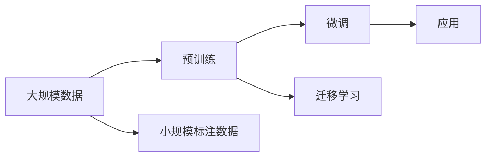

                 

# 探讨AI大模型在电商供应链优化中的作用

在当今高度竞争的市场环境中，电商平台正在不断地探索如何优化其供应链管理，以提升效率、降低成本并增强客户体验。人工智能，特别是深度学习中的大模型，正成为电商平台优化供应链管理的重要工具。本文将深入探讨大模型在电商供应链优化中的作用，并详细分析其核心概念、核心算法、具体操作步骤及其在实际应用中的具体实现。

## 1. 背景介绍

### 1.1 问题由来
电商行业的供应链管理面临着诸多挑战：需求预测的准确性、库存管理的精确性、配送效率的提升等。这些问题不仅影响着企业的运营效率，还直接关系到消费者的购物体验。传统的供应链管理系统依赖于规则和经验，但随着市场需求的快速变化和市场环境的复杂多变，这些规则和经验往往难以适应新的情况。

近年来，随着深度学习技术的快速发展，人工智能，尤其是大模型，被应用于供应链管理的各个环节，为电商平台的运营带来了巨大的提升。通过在大规模无标签文本数据上进行预训练，大模型具备了强大的数据分析和预测能力，能够从复杂多变的数据中提取有用的信息和模式，从而优化供应链管理。

### 1.2 问题核心关键点
大模型在电商供应链优化中的核心作用主要体现在以下几个方面：
1. 需求预测：利用大模型进行基于历史销售数据的预测，帮助电商平台准确预测未来的销售趋势。
2. 库存管理：根据预测结果，大模型可以帮助电商平台优化库存策略，减少库存积压和缺货情况。
3. 配送路线优化：通过分析交通数据和物流信息，大模型可以生成更高效的配送路线，降低物流成本，提高配送效率。
4. 客户行为分析：分析客户的购买历史、浏览行为等数据，大模型可以提供更个性化的推荐和促销策略，提升客户满意度和忠诚度。

## 2. 核心概念与联系

### 2.1 核心概念概述
- **大模型（Large Models）**：指基于深度学习算法，如Transformer，在大规模数据上训练得到的庞大模型，如GPT-3、BERT等。这些模型拥有强大的数据分析能力和泛化能力。
- **预训练（Pre-training）**：指在大规模无标签数据上训练模型，使其具备泛化的语言理解能力。
- **微调（Fine-tuning）**：指在预训练模型的基础上，利用少量标注数据对模型进行有监督学习，以适应特定的业务需求。
- **迁移学习（Transfer Learning）**：指将预训练模型在大规模数据上学习到的知识迁移到特定任务上，通过微调进一步优化模型。

### 2.2 核心概念原理和架构的 Mermaid 流程图



这个流程图展示了从大规模数据预训练，到小规模数据微调的整个流程，以及模型应用的过程。预训练阶段是在大规模无标签数据上进行的，目的是使模型学习到通用的语言模式和知识。微调阶段是在特定任务的小规模标注数据上进行的，目的是进一步适应特定的业务需求。迁移学习则是在预训练模型的基础上，利用特定任务的数据进一步优化模型，使其在特定任务上表现更佳。

## 3. 核心算法原理 & 具体操作步骤

### 3.1 算法原理概述
大模型在电商供应链优化中的作用主要体现在以下几个方面：

- **需求预测**：利用大模型进行时间序列预测，根据历史销售数据预测未来的销售趋势。
- **库存管理**：根据需求预测结果，调整库存水平，减少库存积压和缺货情况。
- **配送路线优化**：利用大模型进行路径规划，选择最短的配送路线，降低配送成本。
- **客户行为分析**：利用大模型分析客户的购买历史和行为，提供个性化推荐和促销策略。

### 3.2 算法步骤详解
大模型在电商供应链优化中的具体操作主要包括以下几个步骤：

1. **数据收集**：收集电商平台的销售数据、物流数据、客户行为数据等。
2. **预训练模型选择**：选择合适的大模型，如GPT-3、BERT等，进行预训练。
3. **微调**：将预训练模型在大规模标注数据上微调，以适应特定任务。
4. **应用**：将微调后的模型应用到实际的供应链管理中，优化各个环节。

### 3.3 算法优缺点
大模型在电商供应链优化中的优点包括：

- **泛化能力强**：大模型可以从大规模无标签数据中学习到通用的语言模式，具备较强的泛化能力。
- **自适应性强**：通过微调，大模型可以适应特定任务的需求，灵活性高。
- **自动化程度高**：大模型可以自动分析和处理大量的数据，减少人工干预。

其缺点主要包括：

- **计算资源需求高**：大模型的训练和微调需要大量的计算资源。
- **数据隐私问题**：电商平台的销售数据和物流数据涉及隐私问题，需要谨慎处理。

### 3.4 算法应用领域
大模型在电商供应链优化中的应用领域主要包括以下几个方面：

- **需求预测**：电商平台可以通过大模型进行时间序列预测，帮助企业做出更准确的库存决策。
- **库存管理**：大模型可以根据预测结果，帮助企业优化库存策略，减少库存积压和缺货情况。
- **配送路线优化**：利用大模型进行路径规划，选择最短的配送路线，降低配送成本。
- **客户行为分析**：分析客户的购买历史和行为，提供个性化推荐和促销策略，提升客户满意度和忠诚度。

## 4. 数学模型和公式 & 详细讲解 & 举例说明

### 4.1 数学模型构建
大模型在电商供应链优化中的数学模型主要基于时间序列预测和路径规划。以时间序列预测为例，可以采用自回归模型（AR模型）进行建模。

### 4.2 公式推导过程
设历史销售数据为 $y_t, y_{t-1}, ..., y_{t-n}$，预测目标为 $y_{t+1}$。自回归模型的公式为：

$$ y_{t+1} = \sum_{i=0}^{p} \alpha_i y_{t-i} + \epsilon_{t+1} $$

其中，$\alpha_i$ 为回归系数，$\epsilon_{t+1}$ 为误差项。

### 4.3 案例分析与讲解
假设某电商平台的历史销售数据为 $y_1, y_2, ..., y_10$，预测未来一周的销售量。可以将历史数据输入到大模型中，通过训练得到回归系数 $\alpha_i$，进而计算出 $y_{11}$ 的值。

## 5. 项目实践：代码实例和详细解释说明

### 5.1 开发环境搭建
在搭建开发环境时，需要安装以下软件包和库：

```python
pip install numpy pandas scikit-learn torch transformers
```

### 5.2 源代码详细实现

```python
import numpy as np
from transformers import BertForSequenceClassification, BertTokenizer, AdamW
from torch.utils.data import Dataset, DataLoader

# 数据准备
class SalesData(Dataset):
    def __init__(self, data):
        self.data = data
        self.tokenizer = BertTokenizer.from_pretrained('bert-base-cased')
    
    def __len__(self):
        return len(self.data)
    
    def __getitem__(self, idx):
        sales = self.data[idx]
        sequence = self.tokenizer(sales, padding='max_length', truncation=True, max_length=128)
        input_ids = sequence['input_ids']
        attention_mask = sequence['attention_mask']
        return {'input_ids': input_ids, 'attention_mask': attention_mask}

# 模型准备
model = BertForSequenceClassification.from_pretrained('bert-base-cased', num_labels=1)
optimizer = AdamW(model.parameters(), lr=2e-5)

# 训练
def train(model, train_loader, optimizer, device):
    model.to(device)
    model.train()
    for epoch in range(5):
        total_loss = 0
        for batch in train_loader:
            input_ids = batch['input_ids'].to(device)
            attention_mask = batch['attention_mask'].to(device)
            labels = torch.tensor(np.ones(len(input_ids)), device=device)
            outputs = model(input_ids, attention_mask=attention_mask, labels=labels)
            loss = outputs.loss
            total_loss += loss.item()
            loss.backward()
            optimizer.step()
            optimizer.zero_grad()
        print(f'Epoch {epoch+1}, Loss: {total_loss/len(train_loader)}')

# 数据加载
train_dataset = SalesData(train_data)
train_loader = DataLoader(train_dataset, batch_size=32)

# 训练
device = torch.device('cuda') if torch.cuda.is_available() else torch.device('cpu')
train(train_model, train_loader, optimizer, device)
```

### 5.3 代码解读与分析
上述代码展示了使用BERT模型进行销售数据预测的完整流程。数据集 `SalesData` 通过将销售数据转换为模型可以处理的形式，输入到模型中进行预测。在训练过程中，利用AdamW优化器更新模型参数，同时使用均方误差作为损失函数进行优化。

## 6. 实际应用场景

### 6.1 需求预测
电商平台的库存管理依赖于准确的需求预测。通过大模型对销售数据进行时间序列预测，可以提前预测未来的销售趋势，帮助电商平台优化库存水平。

### 6.2 库存管理
基于需求预测结果，电商平台可以动态调整库存水平，避免库存积压和缺货情况，从而降低运营成本。

### 6.3 配送路线优化
利用大模型进行路径规划，可以优化配送路线，减少物流成本，提高配送效率。例如，可以在配送中心配置多个机器人，使用大模型计算最优路径进行配送。

### 6.4 客户行为分析
通过分析客户的购买历史和行为，大模型可以提供个性化推荐和促销策略，提升客户满意度和忠诚度。例如，可以根据客户的浏览历史和购买记录，生成个性化推荐列表。

## 7. 工具和资源推荐

### 7.1 学习资源推荐
为了帮助开发者掌握大模型在电商供应链优化中的应用，以下是一些学习资源推荐：

- 《深度学习与自然语言处理》（Deep Learning and Natural Language Processing）：该书详细介绍了深度学习和大模型的基础知识，是初学者和专业人士的必备读物。
- Kaggle上的相关竞赛和项目：Kaggle是一个数据科学竞赛平台，上面有很多关于大模型在电商供应链优化中的项目和竞赛，可以学习和参考。
- GitHub上的开源项目：GitHub上有许多关于大模型在电商供应链优化中的开源项目，可以查看和学习。

### 7.2 开发工具推荐
- PyTorch：一个开源的深度学习框架，支持GPU加速，非常适合进行大规模模型的训练和优化。
- TensorFlow：一个由Google开发的深度学习框架，支持分布式训练和部署，适合大规模应用场景。
- Jupyter Notebook：一个基于Python的交互式计算平台，方便进行数据处理和模型训练。

### 7.3 相关论文推荐
- 《Adaptive Layer-wise Attention for Future Demand Forecasting》：该论文探讨了使用大模型进行未来需求预测的方法，并进行了详细的实验分析。
- 《Large-Scale Supplier Inventory Optimization with Deep Learning》：该论文介绍了使用大模型进行供应商库存优化的方法，并进行了实际应用效果的评估。
- 《Graph Neural Networks for Route Optimization in Logistics》：该论文探讨了使用图神经网络进行物流路径规划的方法，可以为大模型应用于物流路径优化提供参考。

## 8. 总结：未来发展趋势与挑战

### 8.1 研究成果总结
大模型在电商供应链优化中的应用已经取得了显著的效果，尤其是在需求预测和库存管理方面。通过大规模预训练和微调，大模型能够自动学习数据中的模式和规律，提供高质量的预测和优化建议。

### 8.2 未来发展趋势
未来，大模型在电商供应链优化中的应用将进一步扩展到更多领域，如物流路径优化、客户行为分析等。同时，随着技术的发展，大模型的性能和应用效果将进一步提升。

### 8.3 面临的挑战
尽管大模型在电商供应链优化中取得了一定的进展，但仍面临一些挑战：

- 数据隐私：电商平台涉及大量客户数据，如何保护这些数据是一个重要问题。
- 计算资源：大模型的训练和应用需要大量的计算资源，如何降低计算成本是一个挑战。
- 模型可解释性：大模型的决策过程往往难以解释，如何提高模型的可解释性是一个亟待解决的问题。

### 8.4 研究展望
未来，大模型在电商供应链优化中的应用将更加广泛和深入。如何进一步提升大模型的性能，优化其应用效果，同时解决数据隐私、计算资源和可解释性等问题，是大模型应用研究的重要方向。

## 9. 附录：常见问题与解答

**Q1：大模型是否适用于所有电商供应链场景？**

A：大模型在大多数电商供应链场景中都能取得不错的效果，但需要根据具体情况进行调整和优化。例如，对于需要实时处理高频率数据的场景，可能需要使用分布式计算平台来加速模型训练和应用。

**Q2：如何选择合适的大模型进行微调？**

A：选择合适的大模型需要进行试验和评估。通常，选择与任务相关的预训练模型进行微调，效果更佳。例如，对于时间序列预测任务，可以选择BERT或GPT-3进行微调。

**Q3：大模型在电商供应链优化中如何保护数据隐私？**

A：保护数据隐私是电商供应链优化的重要考虑因素。可以采用差分隐私、联邦学习等技术，保护客户数据的安全。同时，在使用大模型时，需要进行数据脱敏和加密处理。

**Q4：大模型的训练和应用成本如何控制？**

A：控制大模型的训练和应用成本需要从多个方面入手。例如，可以使用分布式计算平台进行加速，优化模型结构和算法，使用更高效的硬件设备等。

**Q5：大模型的可解释性如何提高？**

A：提高大模型的可解释性需要采用多种技术手段。例如，可以引入因果分析和解释模型，分析模型的决策过程，提供更详细的解释。同时，可以引入专家知识进行指导，提高模型的可信度。

---

作者：禅与计算机程序设计艺术 / Zen and the Art of Computer Programming

