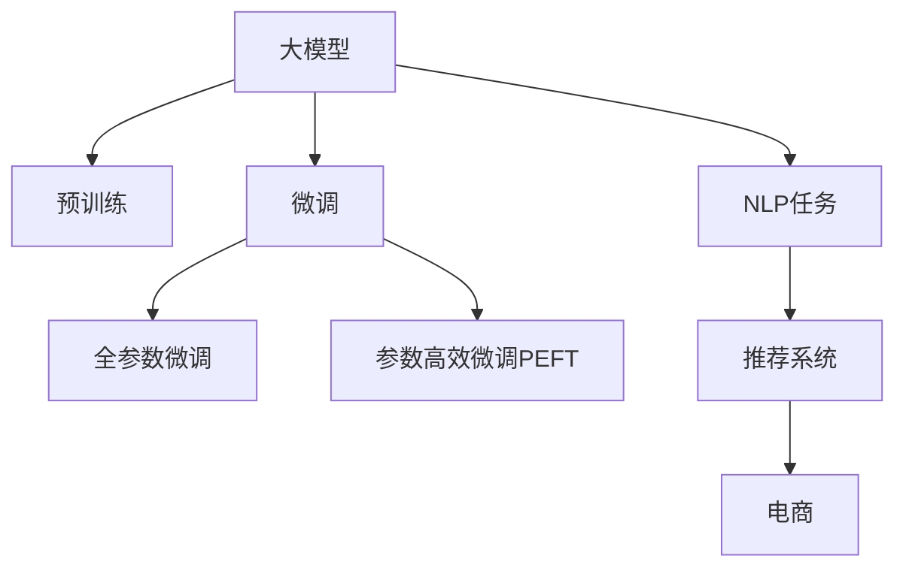

                 

# 探讨大模型在电商个性化推荐中的优势

> 关键词：大模型,电商,个性化推荐,深度学习,强化学习,自然语言处理,NLP

## 1. 背景介绍

### 1.1 问题由来

随着电子商务平台的迅速发展，个性化推荐系统成为了提升用户体验、提高销售额的关键技术。传统的推荐系统依赖于用户的历史行为数据和评分数据，但这些数据往往存在稀疏性和噪声问题，难以覆盖所有用户的所有行为。而利用大模型进行个性化推荐，可以克服这些困难，实现对每个用户全方位的个性化服务。

大模型通常基于大规模数据进行预训练，学习到了丰富的语言知识和常识，具备强大的语义理解和生成能力。通过微调方法，大模型可以适应电商领域的具体需求，为每个用户提供更加精准的推荐服务。近年来，大模型在电商个性化推荐中的应用已经成为了学术界和工业界的热点研究方向。

### 1.2 问题核心关键点

大模型在电商个性化推荐中的核心优势在于其具备的海量数据学习能力和强大的语义理解能力。具体而言，大模型能够在以下方面带来显著的性能提升：

- **丰富的语义理解能力**：大模型通过预训练学习到了通用的语言表示，能够自动理解用户查询的语义，提取重要信息，从而匹配最相关的商品。

- **广泛的领域知识**：电商领域涉及多维度的信息，包括商品属性、用户历史行为、市场趋势等。大模型可以通过多模态融合技术，整合这些信息，提供全面、综合的推荐结果。

- **高效的计算能力**：大模型的参数量通常较大，但随着硬件设备的升级和优化算法的发展，计算能力已不再是大模型的瓶颈。大规模并行计算和大模型的高效推理能力，使其能够快速处理大量的推荐请求。

- **灵活的微调策略**：大模型可以通过微调方法，针对不同用户、不同场景进行个性化优化，增强推荐系统的适应性。

- **持续学习能力**：电商领域数据变化快，大模型可以通过持续学习机制，及时更新知识库，适应新场景和新用户。

### 1.3 问题研究意义

研究大模型在电商个性化推荐中的应用，对于提升电商平台的用户体验、优化推荐系统性能、推动电商平台的智能化转型具有重要意义：

1. **提升用户体验**：通过大模型个性化推荐，电商平台能够更精准地满足用户需求，提供符合其兴趣和习惯的商品推荐，提升用户的购物体验和满意度。

2. **优化推荐系统性能**：大模型可以自动学习和提取用户的多维信息，提高推荐系统的召回率和准确率，从而优化推荐质量。

3. **推动电商平台的智能化转型**：借助大模型技术，电商平台可以更好地理解和分析用户行为，为业务决策提供数据支持，推动平台的数字化转型和智能化升级。

4. **促进用户粘性和复购**：个性化推荐可以显著提升用户的购物意愿和复购率，促进电商平台的长期发展。

5. **拓展电商平台的业务边界**：大模型技术不仅限于推荐系统，还可以应用于搜索、客服、内容推荐等多个电商场景，为平台带来更广泛的商业机会。

## 2. 核心概念与联系

### 2.1 核心概念概述

为更好地理解大模型在电商个性化推荐中的应用，本节将介绍几个关键概念：

- **大模型**：以自回归(如GPT)或自编码(如BERT)模型为代表的大规模预训练语言模型。通过在大规模无标签文本数据上进行预训练，学习到通用的语言表示，具备强大的语义理解和生成能力。

- **预训练**：指在大规模无标签文本数据上，通过自监督学习任务训练通用语言模型的过程。常见的预训练任务包括言语建模、遮挡语言模型等。

- **微调**：指在预训练模型的基础上，使用下游任务的少量标注数据，通过有监督学习优化模型在该任务上的性能。通常只需要调整顶层分类器或解码器，并以较小的学习率更新全部或部分的模型参数。

- **参数高效微调(PEFT)**：指在微调过程中，只更新少量的模型参数，而固定大部分预训练权重不变，以提高微调效率，避免过拟合的方法。

- **自然语言处理(NLP)**：涉及计算机如何理解和处理自然语言的技术领域，包括文本分类、情感分析、语言模型等任务。

- **推荐系统**：基于用户行为和商品信息，自动生成推荐结果的系统。电商推荐系统通过分析用户行为数据和商品信息，为用户提供个性化的商品推荐。

这些核心概念之间的逻辑关系可以通过以下Mermaid流程图来展示：



这个流程图展示了从大模型预训练到微调，再到推荐系统应用的完整流程。大模型通过预训练获得通用语言表示，通过微调适配电商领域，最终应用于推荐系统，为用户提供个性化推荐。

## 3. 核心算法原理 & 具体操作步骤
### 3.1 算法原理概述

大模型在电商个性化推荐中的应用，基于监督学习的微调方法。其核心思想是：将大模型视作一个强大的"特征提取器"，通过电商领域的标注数据进行有监督学习，优化模型在该领域的推荐性能。

形式化地，假设大模型为 $M_{\theta}$，其中 $\theta$ 为预训练得到的模型参数。给定电商推荐任务 $T$ 的标注数据集 $D=\{(x_i, y_i)\}_{i=1}^N$，其中 $x_i$ 表示用户的历史行为和商品信息，$y_i$ 表示推荐结果（商品ID）。微调的目标是找到新的模型参数 $\hat{\theta}$，使得模型在新的数据集上能产生最优的推荐结果：

$$
\hat{\theta}=\mathop{\arg\min}_{\theta} \mathcal{L}(M_{\theta},D)
$$

其中 $\mathcal{L}$ 为针对任务 $T$ 设计的损失函数，用于衡量推荐结果与真实标签之间的差异。常见的损失函数包括交叉熵损失、均方误差损失等。

通过梯度下降等优化算法，微调过程不断更新模型参数 $\theta$，最小化损失函数 $\mathcal{L}$，使得模型输出逼近真实标签。由于 $\theta$ 已经通过预训练获得了较好的初始化，因此即便在电商领域的少量标注数据上进行微调，也能较快收敛到理想的模型参数 $\hat{\theta}$。

### 3.2 算法步骤详解

基于监督学习的大模型电商个性化推荐微调一般包括以下几个关键步骤：

**Step 1: 准备预训练模型和数据集**
- 选择合适的预训练语言模型 $M_{\theta}$ 作为初始化参数，如 BERT、GPT 等。
- 准备电商推荐任务 $T$ 的标注数据集 $D$，划分为训练集、验证集和测试集。一般要求标注数据与预训练数据的分布不要差异过大。

**Step 2: 添加任务适配层**
- 根据任务类型，在预训练模型顶层设计合适的输出层和损失函数。
- 对于推荐任务，通常在顶层添加交叉熵损失函数。

**Step 3: 设置微调超参数**
- 选择合适的优化算法及其参数，如 AdamW、SGD 等，设置学习率、批大小、迭代轮数等。
- 设置正则化技术及强度，包括权重衰减、Dropout、Early Stopping 等。
- 确定冻结预训练参数的策略，如仅微调顶层，或全部参数都参与微调。

**Step 4: 执行梯度训练**
- 将训练集数据分批次输入模型，前向传播计算损失函数。
- 反向传播计算参数梯度，根据设定的优化算法和学习率更新模型参数。
- 周期性在验证集上评估模型性能，根据性能指标决定是否触发 Early Stopping。
- 重复上述步骤直到满足预设的迭代轮数或 Early Stopping 条件。

**Step 5: 测试和部署**
- 在测试集上评估微调后模型 $M_{\hat{\theta}}$ 的性能，对比微调前后的精度提升。
- 使用微调后的模型对新样本进行推理预测，集成到实际的应用系统中。
- 持续收集新的数据，定期重新微调模型，以适应数据分布的变化。

以上是基于监督学习微调大模型进行电商推荐的一般流程。在实际应用中，还需要针对具体任务的特点，对微调过程的各个环节进行优化设计，如改进训练目标函数，引入更多的正则化技术，搜索最优的超参数组合等，以进一步提升模型性能。

### 3.3 算法优缺点

基于监督学习的大模型电商个性化推荐微调方法具有以下优点：

- **高效性**：大模型预训练模型已经包含了大量的通用知识，微调过程仅需较少的标注数据，且通过微调调整参数量较小，因此具有较快的训练和推理速度。

- **泛化能力**：大模型在电商领域的应用可以避免小样本学习的局限性，利用其广泛的领域知识，适应新用户的推荐需求。

- **多模态融合**：电商推荐涉及文本、图像、视频等多模态数据，大模型可以通过多模态融合技术，整合这些信息，提供全面、综合的推荐结果。

- **持续学习**：电商领域的市场趋势和用户行为数据变化较快，大模型可以通过持续学习机制，及时更新知识库，适应新场景和新用户。

- **灵活性**：电商推荐系统需要应对不同用户、不同场景的个性化需求，大模型可以通过微调方法，灵活适应不同的任务需求。

同时，该方法也存在一定的局限性：

- **对标注数据依赖**：电商推荐任务的标注数据集可能规模较小，难以涵盖所有用户的所有行为，影响微调效果。

- **模型复杂度较高**：大模型参数量较大，对硬件设备的要求较高，成本和资源投入较大。

- **可解释性不足**：大模型的决策过程缺乏可解释性，难以对其推理逻辑进行分析和调试。

- **数据隐私问题**：电商推荐系统需要收集用户行为数据，可能存在用户隐私泄露的风险。

尽管存在这些局限性，但就目前而言，基于监督学习的微调方法仍是大模型在电商推荐领域的主流范式。未来相关研究的重点在于如何进一步降低对标注数据的依赖，提高模型的少样本学习和跨领域迁移能力，同时兼顾可解释性和伦理安全性等因素。

### 3.4 算法应用领域

基于大模型微调的监督学习方法，在电商推荐领域已经得到了广泛的应用，涵盖了几乎所有常见任务，例如：

- **商品推荐**：根据用户的历史行为数据和商品信息，推荐用户可能感兴趣的商品。
- **个性化搜索**：根据用户输入的搜索词，推荐最相关的商品。
- **客服机器人**：通过对话系统回答用户咨询，提供个性化的商品推荐和购买建议。
- **广告推荐**：根据用户行为数据和广告内容，推荐广告位和广告内容。
- **内容推荐**：推荐用户可能感兴趣的文章、视频等。

除了上述这些经典任务外，大模型微调也被创新性地应用到更多场景中，如基于用户画像的推荐、基于商品属性的推荐、基于市场趋势的推荐等，为电商推荐系统带来了全新的突破。随着预训练模型和微调方法的不断进步，相信电商推荐系统将在更多领域大放异彩。

## 4. 数学模型和公式 & 详细讲解  
### 4.1 数学模型构建

本节将使用数学语言对基于监督学习的大模型电商推荐微调过程进行更加严格的刻画。

记大模型为 $M_{\theta}$，其中 $\theta$ 为预训练得到的模型参数。假设电商推荐任务 $T$ 的训练集为 $D=\{(x_i, y_i)\}_{i=1}^N, x_i \in \mathcal{X}, y_i \in \mathcal{Y}$。

定义模型 $M_{\theta}$ 在数据样本 $(x,y)$ 上的损失函数为 $\ell(M_{\theta}(x),y)$，则在数据集 $D$ 上的经验风险为：

$$
\mathcal{L}(\theta) = \frac{1}{N} \sum_{i=1}^N \ell(M_{\theta}(x_i),y_i)
$$

微调的优化目标是最小化经验风险，即找到最优参数：

$$
\theta^* = \mathop{\arg\min}_{\theta} \mathcal{L}(\theta)
$$

在实践中，我们通常使用基于梯度的优化算法（如SGD、Adam等）来近似求解上述最优化问题。设 $\eta$ 为学习率，$\lambda$ 为正则化系数，则参数的更新公式为：

$$
\theta \leftarrow \theta - \eta \nabla_{\theta}\mathcal{L}(\theta) - \eta\lambda\theta
$$

其中 $\nabla_{\theta}\mathcal{L}(\theta)$ 为损失函数对参数 $\theta$ 的梯度，可通过反向传播算法高效计算。

### 4.2 公式推导过程

以下我们以电商推荐中的二分类任务为例，推导交叉熵损失函数及其梯度的计算公式。

假设模型 $M_{\theta}$ 在输入 $x$ 上的输出为 $\hat{y}=M_{\theta}(x) \in [0,1]$，表示用户点击商品的概率。真实标签 $y \in \{0,1\}$。则二分类交叉熵损失函数定义为：

$$
\ell(M_{\theta}(x),y) = -[y\log \hat{y} + (1-y)\log (1-\hat{y})]
$$

将其代入经验风险公式，得：

$$
\mathcal{L}(\theta) = -\frac{1}{N}\sum_{i=1}^N [y_i\log M_{\theta}(x_i)+(1-y_i)\log(1-M_{\theta}(x_i))]
$$

根据链式法则，损失函数对参数 $\theta_k$ 的梯度为：

$$
\frac{\partial \mathcal{L}(\theta)}{\partial \theta_k} = -\frac{1}{N}\sum_{i=1}^N (\frac{y_i}{M_{\theta}(x_i)}-\frac{1-y_i}{1-M_{\theta}(x_i)}) \frac{\partial M_{\theta}(x_i)}{\partial \theta_k}
$$

其中 $\frac{\partial M_{\theta}(x_i)}{\partial \theta_k}$ 可进一步递归展开，利用自动微分技术完成计算。

在得到损失函数的梯度后，即可带入参数更新公式，完成模型的迭代优化。重复上述过程直至收敛，最终得到适应电商推荐任务的最优模型参数 $\theta^*$。

## 5. 项目实践：代码实例和详细解释说明
### 5.1 开发环境搭建

在进行电商推荐微调实践前，我们需要准备好开发环境。以下是使用Python进行PyTorch开发的环境配置流程：

1. 安装Anaconda：从官网下载并安装Anaconda，用于创建独立的Python环境。

2. 创建并激活虚拟环境：
```bash
conda create -n pytorch-env python=3.8 
conda activate pytorch-env
```

3. 安装PyTorch：根据CUDA版本，从官网获取对应的安装命令。例如：
```bash
conda install pytorch torchvision torchaudio cudatoolkit=11.1 -c pytorch -c conda-forge
```

4. 安装Transformers库：
```bash
pip install transformers
```

5. 安装各类工具包：
```bash
pip install numpy pandas scikit-learn matplotlib tqdm jupyter notebook ipython
```

完成上述步骤后，即可在`pytorch-env`环境中开始微调实践。

### 5.2 源代码详细实现

下面我们以电商推荐中的二分类任务为例，给出使用Transformers库对BERT模型进行微调的PyTorch代码实现。

首先，定义电商推荐任务的数据处理函数：

```python
from transformers import BertTokenizer
from torch.utils.data import Dataset
import torch

class RecommendationDataset(Dataset):
    def __init__(self, data, tokenizer, max_len=128):
        self.data = data
        self.tokenizer = tokenizer
        self.max_len = max_len
        
    def __len__(self):
        return len(self.data)
    
    def __getitem__(self, item):
        product_id, user_id = self.data[item]
        
        product_title = 'product title: ' + self.data[item][0]
        product_description = 'product description: ' + self.data[item][1]
        product_category = 'product category: ' + self.data[item][2]
        
        data = [product_title, product_description, product_category, user_id]
        encoding = self.tokenizer(data, return_tensors='pt', max_length=self.max_len, padding='max_length', truncation=True)
        input_ids = encoding['input_ids'][0]
        attention_mask = encoding['attention_mask'][0]
        
        # 将产品ID和用户ID转换为标签
        label = torch.tensor([self.data[item][3]], dtype=torch.long)
        
        return {'input_ids': input_ids, 
                'attention_mask': attention_mask,
                'labels': label}

# 创建dataset
tokenizer = BertTokenizer.from_pretrained('bert-base-cased')

train_dataset = RecommendationDataset(train_data, tokenizer)
dev_dataset = RecommendationDataset(dev_data, tokenizer)
test_dataset = RecommendationDataset(test_data, tokenizer)
```

然后，定义模型和优化器：

```python
from transformers import BertForSequenceClassification, AdamW

model = BertForSequenceClassification.from_pretrained('bert-base-cased', num_labels=2)

optimizer = AdamW(model.parameters(), lr=2e-5)
```

接着，定义训练和评估函数：

```python
from torch.utils.data import DataLoader
from tqdm import tqdm
from sklearn.metrics import accuracy_score

device = torch.device('cuda') if torch.cuda.is_available() else torch.device('cpu')
model.to(device)

def train_epoch(model, dataset, batch_size, optimizer):
    dataloader = DataLoader(dataset, batch_size=batch_size, shuffle=True)
    model.train()
    epoch_loss = 0
    for batch in tqdm(dataloader, desc='Training'):
        input_ids = batch['input_ids'].to(device)
        attention_mask = batch['attention_mask'].to(device)
        labels = batch['labels'].to(device)
        model.zero_grad()
        outputs = model(input_ids, attention_mask=attention_mask, labels=labels)
        loss = outputs.loss
        epoch_loss += loss.item()
        loss.backward()
        optimizer.step()
    return epoch_loss / len(dataloader)

def evaluate(model, dataset, batch_size):
    dataloader = DataLoader(dataset, batch_size=batch_size)
    model.eval()
    preds, labels = [], []
    with torch.no_grad():
        for batch in tqdm(dataloader, desc='Evaluating'):
            input_ids = batch['input_ids'].to(device)
            attention_mask = batch['attention_mask'].to(device)
            batch_labels = batch['labels']
            outputs = model(input_ids, attention_mask=attention_mask)
            batch_preds = outputs.logits.argmax(dim=2).to('cpu').tolist()
            batch_labels = batch_labels.to('cpu').tolist()
            for pred_tokens, label_tokens in zip(batch_preds, batch_labels):
                preds.append(pred_tokens[:len(label_tokens)])
                labels.append(label_tokens)
                
    print('Accuracy: ', accuracy_score(labels, preds))
```

最后，启动训练流程并在测试集上评估：

```python
epochs = 5
batch_size = 16

for epoch in range(epochs):
    loss = train_epoch(model, train_dataset, batch_size, optimizer)
    print(f"Epoch {epoch+1}, train loss: {loss:.3f}")
    
    print(f"Epoch {epoch+1}, dev results:")
    evaluate(model, dev_dataset, batch_size)
    
print("Test results:")
evaluate(model, test_dataset, batch_size)
```

以上就是使用PyTorch对BERT进行电商推荐任务微调的完整代码实现。可以看到，得益于Transformers库的强大封装，我们可以用相对简洁的代码完成BERT模型的加载和微调。

### 5.3 代码解读与分析

让我们再详细解读一下关键代码的实现细节：

**RecommendationDataset类**：
- `__init__`方法：初始化数据集、分词器等关键组件。
- `__len__`方法：返回数据集的样本数量。
- `__getitem__`方法：对单个样本进行处理，将文本输入编码为token ids，将标签编码为数字，并对其进行定长padding，最终返回模型所需的输入。

**训练和评估函数**：
- 使用PyTorch的DataLoader对数据集进行批次化加载，供模型训练和推理使用。
- 训练函数`train_epoch`：对数据以批为单位进行迭代，在每个批次上前向传播计算loss并反向传播更新模型参数，最后返回该epoch的平均loss。
- 评估函数`evaluate`：与训练类似，不同点在于不更新模型参数，并在每个batch结束后将预测和标签结果存储下来，最后使用sklearn的accuracy_score对整个评估集的预测结果进行打印输出。

**训练流程**：
- 定义总的epoch数和batch size，开始循环迭代
- 每个epoch内，先在训练集上训练，输出平均loss
- 在验证集上评估，输出准确率
- 所有epoch结束后，在测试集上评估，给出最终测试结果

可以看到，PyTorch配合Transformers库使得BERT微调的代码实现变得简洁高效。开发者可以将更多精力放在数据处理、模型改进等高层逻辑上，而不必过多关注底层的实现细节。

当然，工业级的系统实现还需考虑更多因素，如模型的保存和部署、超参数的自动搜索、更灵活的任务适配层等。但核心的微调范式基本与此类似。

## 6. 实际应用场景
### 6.1 电商推荐系统

大模型在电商推荐系统中的应用，能够显著提升推荐的个性化程度和精度，满足不同用户的多样化需求。传统的推荐系统依赖于用户的历史行为数据和评分数据，难以覆盖所有用户的所有行为。而大模型能够自动理解用户的语义信息，提取重要特征，从而提供更加精准的推荐服务。

在技术实现上，可以收集用户的历史行为数据、商品信息、评价数据等，构建电商推荐任务的标注数据集，对大模型进行微调。微调后的模型能够自动理解用户查询的语义，提取商品信息中的关键特征，从而匹配最相关的商品进行推荐。对于用户的新查询，模型还可以根据上下文信息，自动调整推荐策略，提高推荐的相关性和多样性。

### 6.2 个性化广告投放

大模型可以用于个性化广告投放，通过分析用户的历史行为数据和广告数据，自动推荐用户可能感兴趣的广告位和广告内容。传统的广告投放依赖于人工调参和简单的规则引擎，难以覆盖用户的个性化需求。而大模型能够自动学习用户的行为模式和兴趣偏好，提供更加个性化的广告推荐。

在技术实现上，可以收集用户的历史行为数据、广告点击率、广告效果等，构建广告推荐的标注数据集，对大模型进行微调。微调后的模型能够自动理解用户的行为模式，预测其对不同广告的反应，从而优化广告投放策略，提高广告的转化率和效果。

### 6.3 智能客服系统

大模型可以用于智能客服系统，通过对话系统回答用户咨询，提供个性化的商品推荐和购买建议。传统的客服系统依赖于规则引擎和人工客服，难以应对复杂多变的用户需求。而大模型能够自动理解用户的问题和需求，提供个性化的推荐和解决方案。

在技术实现上，可以收集用户的历史咨询数据、商品信息等，构建客服对话任务的标注数据集，对大模型进行微调。微调后的模型能够自动理解用户的查询和需求，匹配最相关的商品和解决方案，从而提供个性化的客服服务。对于用户的复杂问题，模型还可以自动调用相关资源，提供精准的解决方案。

### 6.4 未来应用展望

随着大模型和微调方法的不断发展，基于大模型推荐的技术将在更多领域得到应用，为传统行业带来变革性影响。

在智慧医疗领域，基于大模型的推荐技术可以用于推荐合适的诊疗方案、药品、医生等，提升医疗服务的智能化水平。

在智能教育领域，大模型可以用于推荐个性化的学习资源、课程等，促进教育的公平和个性化发展。

在智慧城市治理中，大模型可以用于推荐公共服务资源、应急物资等，提高城市管理的自动化和智能化水平，构建更安全、高效的未来城市。

此外，在企业生产、社会治理、文娱传媒等众多领域，基于大模型的推荐技术也将不断涌现，为经济社会发展注入新的动力。相信随着技术的日益成熟，大模型推荐技术必将在构建人机协同的智能时代中扮演越来越重要的角色。

## 7. 工具和资源推荐
### 7.1 学习资源推荐

为了帮助开发者系统掌握大模型在电商推荐中的应用，这里推荐一些优质的学习资源：

1. 《Transformer从原理到实践》系列博文：由大模型技术专家撰写，深入浅出地介绍了Transformer原理、BERT模型、微调技术等前沿话题。

2. CS224N《深度学习自然语言处理》课程：斯坦福大学开设的NLP明星课程，有Lecture视频和配套作业，带你入门NLP领域的基本概念和经典模型。

3. 《Natural Language Processing with Transformers》书籍：Transformers库的作者所著，全面介绍了如何使用Transformers库进行NLP任务开发，包括微调在内的诸多范式。

4. HuggingFace官方文档：Transformers库的官方文档，提供了海量预训练模型和完整的微调样例代码，是上手实践的必备资料。

5. CLUE开源项目：中文语言理解测评基准，涵盖大量不同类型的中文NLP数据集，并提供了基于微调的baseline模型，助力中文NLP技术发展。

通过对这些资源的学习实践，相信你一定能够快速掌握大模型在电商推荐中的应用精髓，并用于解决实际的NLP问题。
###  7.2 开发工具推荐

高效的开发离不开优秀的工具支持。以下是几款用于大模型电商推荐开发的常用工具：

1. PyTorch：基于Python的开源深度学习框架，灵活动态的计算图，适合快速迭代研究。大部分预训练语言模型都有PyTorch版本的实现。

2. TensorFlow：由Google主导开发的开源深度学习框架，生产部署方便，适合大规模工程应用。同样有丰富的预训练语言模型资源。

3. Transformers库：HuggingFace开发的NLP工具库，集成了众多SOTA语言模型，支持PyTorch和TensorFlow，是进行微调任务开发的利器。

4. Weights & Biases：模型训练的实验跟踪工具，可以记录和可视化模型训练过程中的各项指标，方便对比和调优。与主流深度学习框架无缝集成。

5. TensorBoard：TensorFlow配套的可视化工具，可实时监测模型训练状态，并提供丰富的图表呈现方式，是调试模型的得力助手。

6. Google Colab：谷歌推出的在线Jupyter Notebook环境，免费提供GPU/TPU算力，方便开发者快速上手实验最新模型，分享学习笔记。

合理利用这些工具，可以显著提升大模型电商推荐的开发效率，加快创新迭代的步伐。

### 7.3 相关论文推荐

大模型和电商推荐技术的发展源于学界的持续研究。以下是几篇奠基性的相关论文，推荐阅读：

1. Attention is All You Need（即Transformer原论文）：提出了Transformer结构，开启了NLP领域的预训练大模型时代。

2. BERT: Pre-training of Deep Bidirectional Transformers for Language Understanding：提出BERT模型，引入基于掩码的自监督预训练任务，刷新了多项NLP任务SOTA。

3. Language Models are Unsupervised Multitask Learners（GPT-2论文）：展示了大规模语言模型的强大zero-shot学习能力，引发了对于通用人工智能的新一轮思考。

4. Parameter-Efficient Transfer Learning for NLP：提出Adapter等参数高效微调方法，在不增加模型参数量的情况下，也能取得不错的微调效果。

5. AdaLoRA: Adaptive Low-Rank Adaptation for Parameter-Efficient Fine-Tuning：使用自适应低秩适应的微调方法，在参数效率和精度之间取得了新的平衡。

这些论文代表了大模型在电商推荐中的应用发展脉络。通过学习这些前沿成果，可以帮助研究者把握学科前进方向，激发更多的创新灵感。

## 8. 总结：未来发展趋势与挑战

### 8.1 总结

本文对基于监督学习的大模型电商推荐方法进行了全面系统的介绍。首先阐述了大模型在电商个性化推荐中的应用背景和意义，明确了大模型在处理多维信息、提取特征、适应个性化需求等方面的优势。其次，从原理到实践，详细讲解了监督微调的数学原理和关键步骤，给出了电商推荐任务开发的完整代码实例。同时，本文还广泛探讨了大模型在电商推荐系统、个性化广告投放、智能客服系统等多个电商领域的应用前景，展示了大模型技术的广阔前景。此外，本文精选了微调技术的各类学习资源，力求为读者提供全方位的技术指引。

通过本文的系统梳理，可以看到，基于大模型的电商推荐方法正在成为电商领域的重要范式，极大地拓展了电商推荐系统的应用边界，催生了更多的落地场景。得益于大模型在海量数据上预训练的丰富语言知识和常识，电商推荐系统可以自动理解和提取用户的语义信息，提供更加精准和个性化的推荐服务。未来，伴随预训练语言模型和微调方法的不断进步，相信电商推荐系统将在更多领域大放异彩，深刻影响电商平台的商业模型和用户行为。

### 8.2 未来发展趋势

展望未来，大模型电商推荐技术将呈现以下几个发展趋势：

1. **多模态融合**：电商推荐涉及文本、图像、视频等多模态数据，未来大模型将融合多模态信息，提供全面、综合的推荐结果。

2. **持续学习**：电商领域的市场趋势和用户行为数据变化较快，大模型可以通过持续学习机制，及时更新知识库，适应新场景和新用户。

3. **参数高效微调**：开发更加参数高效的微调方法，如Adapter、Prefix等，在固定大部分预训练参数的情况下，只更新极少量的任务相关参数，进一步提高微调效率。

4. **推荐系统优化**：结合强化学习、因果推理等前沿技术，优化推荐算法，提升推荐效果。

5. **用户隐私保护**：在推荐系统中，用户的隐私保护成为一个重要问题。大模型可以通过差分隐私、联邦学习等技术，保护用户数据安全，减少隐私泄露风险。

6. **模型压缩与加速**：随着大模型参数量的增加，模型的推理效率和存储需求也随之增加。未来的研究方向将包括模型压缩、加速推理等技术，以应对大规模模型的计算需求。

这些趋势凸显了大模型电商推荐技术的广阔前景。这些方向的探索发展，必将进一步提升电商推荐系统的性能和应用范围，为电商平台的智能化转型提供新的技术路径。

### 8.3 面临的挑战

尽管大模型电商推荐技术已经取得了瞩目成就，但在迈向更加智能化、普适化应用的过程中，它仍面临着诸多挑战：

1. **数据隐私问题**：电商推荐系统需要收集用户行为数据，可能存在用户隐私泄露的风险。如何保护用户隐私，是一个重要问题。

2. **模型复杂度**：大模型参数量较大，对硬件设备的要求较高，成本和资源投入较大。

3. **可解释性不足**：大模型的决策过程缺乏可解释性，难以对其推理逻辑进行分析和调试。

4. **推荐系统的多样性**：电商平台中推荐的商品种类繁多，大模型需要具备很强的多样性处理能力，才能覆盖所有商品。

5. **冷启动问题**：对于新用户，没有足够的历史行为数据，难以准确推荐。

尽管存在这些挑战，但就目前而言，基于监督学习的微调方法仍是大模型在电商推荐领域的主流范式。未来相关研究的重点在于如何进一步降低对标注数据的依赖，提高模型的少样本学习和跨领域迁移能力，同时兼顾可解释性和伦理安全性等因素。

### 8.4 研究展望

面对大模型电商推荐所面临的种种挑战，未来的研究需要在以下几个方面寻求新的突破：

1. **无监督和半监督学习**：探索无监督和半监督学习范式，减少对大规模标注数据的依赖，最大化利用非结构化数据。

2. **多模态融合**：将符号化的先验知识与神经网络模型进行融合，提高大模型对多模态信息的整合能力。

3. **推荐系统的多样性处理**：开发更加多样性处理的推荐算法，适应电商推荐场景中商品种类的多样性。

4. **冷启动问题**：研究冷启动用户推荐算法，提高对新用户的推荐效果。

5. **用户隐私保护**：研究差分隐私、联邦学习等技术，保护用户隐私，增强推荐系统的可信度。

6. **推荐系统的公平性**：研究公平推荐算法，减少推荐系统中的偏见和歧视，提升系统的公平性。

这些研究方向的探索，必将引领大模型电商推荐技术迈向更高的台阶，为构建安全、可靠、可解释、可控的智能推荐系统铺平道路。面向未来，大模型电商推荐技术还需要与其他人工智能技术进行更深入的融合，如知识表示、因果推理、强化学习等，多路径协同发力，共同推动自然语言理解和智能交互系统的进步。只有勇于创新、敢于突破，才能不断拓展大模型的边界，让智能技术更好地造福电商平台的商业发展。

## 9. 附录：常见问题与解答

**Q1：大模型在电商推荐中是否一定要进行微调？**

A: 大模型在进行电商推荐时，可以通过微调来进一步优化推荐效果。微调可以调整模型的参数，使得模型更好地适应电商领域的特定需求。但并不是所有情况下都需要微调，大模型在没有微调的情况下也可以提供较好的推荐服务，特别是在标注数据充足的情况下。

**Q2：微调大模型在电商推荐中需要注意哪些问题？**

A: 微调大模型在电商推荐中需要注意以下几个问题：
1. 数据隐私：电商推荐系统需要收集用户行为数据，可能存在用户隐私泄露的风险。因此需要采取差分隐私、联邦学习等技术，保护用户数据安全。
2. 模型复杂度：大模型的参数量较大，对硬件设备的要求较高。需要通过模型压缩、加速推理等技术，提高大模型的效率。
3. 可解释性：大模型的决策过程缺乏可解释性，难以对其推理逻辑进行分析和调试。可以通过可视化工具、特征重要性分析等方法，增强模型的可解释性。
4. 推荐系统的多样性：电商平台中推荐的商品种类繁多，大模型需要具备很强的多样性处理能力，才能覆盖所有商品。
5. 冷启动问题：对于新用户，没有足够的历史行为数据，难以准确推荐。可以通过基于用户画像的推荐、基于商品属性的推荐等方法，解决冷启动问题。

**Q3：如何评估电商推荐系统的推荐效果？**

A: 电商推荐系统的推荐效果可以通过多种指标进行评估，包括但不限于：
1. 准确率：衡量推荐的商品是否与用户的真实购买行为一致。
2. 召回率：衡量推荐的商品是否能够覆盖用户的兴趣范围。
3. 相关性：衡量推荐的商品与用户的查询意图是否一致。
4. 多样性：衡量推荐结果的多样性，避免推荐的同质化问题。
5. 新颖性：衡量推荐结果的新颖性，避免推荐的老旧商品。

通过这些指标，可以全面评估电商推荐系统的性能，并进行优化改进。

---

作者：禅与计算机程序设计艺术 / Zen and the Art of Computer Programming

