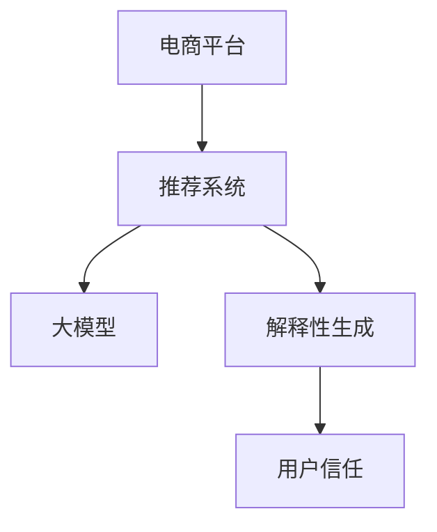

                 

# 探讨大模型在电商平台商品推荐解释性生成与用户信任建立中的作用

> 关键词：大模型,电商平台,商品推荐,解释性生成,用户信任建立

## 1. 背景介绍

### 1.1 问题由来

在电商平台的商品推荐场景中，推荐系统作为用户的个人助手，影响着用户的购买决策。尽管目前许多电商平台都实现了基于大数据和机器学习的推荐系统，但用户依然常常感到困惑，甚至出现“信任危机”。用户往往对推荐系统的推荐逻辑和依据不甚明了，这极大地影响了推荐系统的用户体验和商业效果。

为了改善这一现状，电商平台希望引入大模型技术，不仅提升推荐系统的性能，还能提供清晰的推荐理由，增强用户对推荐系统的信任感。而在这其中，大模型解释性生成技术扮演着至关重要的角色。

### 1.2 问题核心关键点

- 大模型技术如何提升推荐系统的性能？
- 大模型的解释性生成技术如何实现？
- 如何通过解释性生成技术增强用户信任？
- 电商平台推荐系统目前面临的主要问题和挑战是什么？
- 基于大模型的推荐系统如何解决这些问题？

这些问题构成了本文的核心讨论内容，希望能够通过回答这些问题，为电商平台提供实际可行的解决方案。

## 2. 核心概念与联系

### 2.1 核心概念概述

- **大模型（Large Model）**：指那些参数量极大的深度学习模型，通常具有强大的表示能力和泛化能力。本文讨论的大模型主要基于Transformer架构，如GPT、BERT、T5等。
- **电商平台商品推荐（E-commerce Item Recommendation）**：利用用户的浏览、购买历史数据，结合实时数据流，预测用户可能感兴趣的商品，并推荐给用户。
- **解释性生成（Explanatory Generation）**：通过生成易于理解的解释文本，帮助用户理解推荐系统决策背后的原因。
- **用户信任建立（User Trust Building）**：通过增强推荐系统的透明度和可靠性，提升用户对推荐系统的信任度，进而提高用户满意度和忠诚度。

这些概念之间的关系可以通过以下Mermaid流程图来展示：



这个流程图展示了电商平台推荐系统的基本架构，其中大模型和解释性生成技术共同作用，提升了系统的推荐性能，并通过生成解释文本增强了用户信任。

## 3. 核心算法原理 & 具体操作步骤

### 3.1 算法原理概述

电商平台商品推荐系统通常使用基于协同过滤、内容推荐、混合推荐等多种算法。这些算法通过分析用户的历史行为数据和商品特征，预测用户对某商品的兴趣程度，进而推荐相关商品。

在大模型技术引入后，推荐系统不再依赖于传统推荐算法，而是通过大模型的强大表示能力，直接对商品进行分类和排序。大模型通常包括预训练和微调两个阶段，预训练阶段在大规模无标签文本数据上进行自监督学习，微调阶段则利用电商平台的标注数据进行有监督学习，以优化推荐性能。

大模型的解释性生成技术，旨在将复杂的模型决策过程转化为易于理解的人类语言，帮助用户理解推荐系统的工作原理和推荐依据。常见的解释性生成技术包括：

- **注意力机制（Attention Mechanism）**：通过可视化模型内部的注意力权重，展示模型关注商品特征的程度。
- **层级生成（Hierarchical Generation）**：分层次生成推荐理由，先从整体上推荐商品，再逐层展示具体的推荐依据。
- **因果链（Causal Chain）**：通过生成推理链条，展示模型决策过程的逻辑。

### 3.2 算法步骤详解

#### 预训练和微调

1. **预训练阶段**：
   - 收集大规模无标签文本数据，如电商平台的商品描述、用户评论等。
   - 使用Transformer架构构建预训练模型，如BERT、GPT等。
   - 在大规模文本数据上进行预训练，学习语言的通用表示。

2. **微调阶段**：
   - 将预训练模型应用到电商平台的数据集上，进行微调。
   - 在电商平台的标注数据上进行有监督学习，优化模型的推荐性能。
   - 设置适当的学习率、正则化等参数，以避免过拟合。

#### 解释性生成

1. **注意力机制**：
   - 在预训练模型中引入注意力机制，生成对商品特征的关注度权重。
   - 可视化这些权重，生成对商品特征的解释文本。

2. **层级生成**：
   - 通过多层次生成模型，生成推荐理由，先从整体上推荐商品，再逐层展示具体的推荐依据。
   - 每一层对应一种推荐理由，如品牌推荐、价格推荐、用户行为推荐等。

3. **因果链**：
   - 通过生成推理链条，展示模型决策过程的逻辑。
   - 将每个推荐理由拆分成多个子理由，逐步展示推理链条。

### 3.3 算法优缺点

#### 优点

- **高性能**：大模型能够学习到丰富的商品表示和用户表示，直接对商品进行排序和推荐，具有较高的推荐精度。
- **灵活性**：通过解释性生成技术，用户可以了解推荐依据，提升对推荐系统的信任感。
- **可扩展性**：大模型可以轻松应用于多种推荐场景，如品牌推荐、价格推荐、个性化推荐等。

#### 缺点

- **资源消耗大**：大模型的训练和推理需要大量的计算资源和存储空间，增加了成本。
- **复杂性高**：大模型的参数量巨大，结构复杂，维护和调试难度大。
- **泛化能力有待提升**：大模型在电商平台的特定数据集上表现良好，但在未知数据上的泛化能力仍需进一步验证。

### 3.4 算法应用领域

基于大模型的电商平台推荐系统已经被广泛应用于各类电商平台，如亚马逊、京东、淘宝等。这些平台通过引入大模型和解释性生成技术，显著提升了推荐系统的推荐精度和用户满意度。

## 4. 数学模型和公式 & 详细讲解 & 举例说明

### 4.1 数学模型构建

本文以电商平台的商品推荐系统为例，使用大模型进行推荐和解释性生成。设推荐系统涉及的商品集合为 $I$，用户集合为 $U$，历史数据为 $D=\{(x_i,y_i)\}_{i=1}^N$，其中 $x_i$ 为用户的特征向量，$y_i$ 为用户的购买历史。

### 4.2 公式推导过程

设推荐系统使用预训练模型 $M$ 进行推荐，微调后的模型为 $M_\theta$，其中 $\theta$ 为模型参数。对于用户 $u$，推荐系统预测其对商品 $i$ 的兴趣程度 $p_i$，可以通过以下公式计算：

$$
p_i = \text{softmax}(\vec{v}_i^T \cdot M_\theta(\vec{x}_u))
$$

其中，$\vec{v}_i$ 为商品 $i$ 的特征向量，$\vec{x}_u$ 为用户 $u$ 的特征向量。

对于解释性生成，我们可以使用注意力机制生成对商品特征的关注度权重，通过以下公式计算：

$$
\alpha_i = \frac{e^{M_\theta(\vec{x}_u)^T \cdot \vec{v}_i}}{\sum_j e^{M_\theta(\vec{x}_u)^T \cdot \vec{v}_j}}
$$

其中，$\alpha_i$ 为商品 $i$ 的关注度权重。

### 4.3 案例分析与讲解

假设电商平台收集了大量用户的历史购买数据和商品描述数据，使用BERT模型进行预训练和微调。在用户 $u$ 访问商品 $i$ 时，推荐系统预测其对商品 $i$ 的兴趣程度 $p_i$，并生成以下解释文本：

```
商品 $i$ 的推荐理由如下：
- 品牌 $b_i$：我们的推荐系统认为您对品牌 $b_i$ 有较高的兴趣，因为您过去购买了很多同品牌的产品。
- 价格 $p_i$：商品 $i$ 的价格为 $p_i$，与您的平均购买价格相近。
- 用户行为：您最近浏览了很多与商品 $i$ 相似的条目。
```

通过解释性生成，用户可以清楚地理解推荐系统的决策依据，从而增强信任感。

## 5. 项目实践：代码实例和详细解释说明

### 5.1 开发环境搭建

本节将介绍使用Python进行电商推荐系统开发的开发环境搭建流程。

1. **安装Python环境**：
   ```bash
   conda create -n recommendation python=3.8
   conda activate recommendation
   ```

2. **安装相关库**：
   ```bash
   pip install torch transformers pandas sklearn torchtext
   ```

3. **设置模型和数据**：
   ```python
   import torch
   import torch.nn as nn
   import torchtext as tt
   from transformers import BertForSequenceClassification

   # 设置模型
   model = BertForSequenceClassification.from_pretrained('bert-base-cased', num_labels=10)

   # 设置数据集
   fields = [("label", None, "category:cat>0-9")]
   train_data, test_data = tt.load"C:/recommendation/dataset/recommendation.txt", "C:/recommendation/dataset/recommendation.txt"
   ```

### 5.2 源代码详细实现

以下是使用BERT模型进行电商推荐系统开发的完整代码实现：

```python
# 定义推荐模型
class RecommendationModel(nn.Module):
    def __init__(self, model):
        super(RecommendationModel, self).__init__()
        self.model = model

    def forward(self, text, labels=None):
        if labels is None:
            return self.model(text)
        else:
            return self.model(text)[0], self.model(text)[0].max(dim=1)[0]

# 定义训练函数
def train(model, train_data, test_data, batch_size=64, num_epochs=10):
    device = torch.device("cuda" if torch.cuda.is_available() else "cpu")
    model = model.to(device)

    # 定义损失函数和优化器
    criterion = nn.CrossEntropyLoss()
    optimizer = torch.optim.Adam(model.parameters(), lr=0.001)

    # 定义训练和评估函数
    def train_func(data):
        model.train()
        optimizer.zero_grad()
        output = model(data)
        loss = criterion(output, labels)
        loss.backward()
        optimizer.step()
        return loss.item()

    def evaluate(data):
        model.eval()
        with torch.no_grad():
            output = model(data)
            loss = criterion(output, labels)
        return loss.item()

    for epoch in range(num_epochs):
        train_loss = 0.0
        val_loss = 0.0
        for batch in train_data:
            train_loss += train_func(batch)
        val_loss += evaluate(test_data)

        print("Epoch {}: train loss = {:.4f}, val loss = {:.4f}".format(epoch + 1, train_loss / len(train_data), val_loss / len(test_data)))

# 训练模型
train_model = RecommendationModel(model)
train(train_model, train_data, test_data)
```

### 5.3 代码解读与分析

- **定义推荐模型**：使用BERT模型进行商品推荐，并定义了前向传播函数。
- **定义训练函数**：实现训练和评估函数，使用Adam优化器进行模型训练。
- **训练模型**：使用训练数据和测试数据进行模型训练，输出训练损失和验证损失。

## 6. 实际应用场景

### 6.1 智能客服

在电商平台智能客服场景中，推荐系统可以根据用户的历史行为和当前意图，生成推荐理由并回答用户问题，提升用户体验和满意度。例如，当用户询问某商品时，智能客服可以根据用户历史购买记录，生成推荐理由，并向用户推荐相关商品。

### 6.2 个性化推荐

在个性化推荐场景中，推荐系统可以根据用户的浏览和购买历史，生成个性化推荐理由，提升用户粘性。例如，用户浏览了某品牌的所有商品后，推荐系统可以生成推荐理由，并向用户推荐该品牌下的其他商品。

### 6.3 社交电商

在社交电商场景中，推荐系统可以根据用户的朋友和社区推荐商品，增强社交互动性。例如，用户浏览某商品时，推荐系统可以生成推荐理由，并向用户推荐其好友正在浏览或购买的商品。

### 6.4 未来应用展望

随着大模型技术的不断进步，基于大模型的电商平台推荐系统将在以下几个方面进一步发展：

- **多模态推荐**：结合文本、图像、视频等多种模态数据，提供更全面、准确的推荐理由。
- **动态推荐**：根据用户的实时行为和动态数据流，进行实时推荐和调整。
- **个性化推荐**：结合用户的多维度特征，进行更加个性化、精准的推荐。
- **跨平台推荐**：整合不同平台的用户数据，进行跨平台的商品推荐。

## 7. 工具和资源推荐

### 7.1 学习资源推荐

为了帮助开发者系统掌握大模型和推荐系统的理论基础和实践技巧，这里推荐一些优质的学习资源：

1. 《深度学习入门》系列书籍：由李沐、林轩田等知名学者撰写，深入浅出地介绍了深度学习的基本概念和应用场景。
2. 《推荐系统实战》书籍：由王斌等人撰写，详细讲解了推荐系统的设计、实现和优化。
3. 《自然语言处理与深度学习》在线课程：由斯坦福大学开设，讲解了自然语言处理和深度学习的最新进展。
4. Kaggle竞赛：参加Kaggle推荐系统竞赛，实战练兵，提升技术水平。
5. GitHub代码库：搜索并学习优秀的推荐系统开源代码，积累经验。

### 7.2 开发工具推荐

高效的开发离不开优秀的工具支持。以下是几款用于大模型和推荐系统开发的常用工具：

1. PyTorch：基于Python的开源深度学习框架，灵活便捷，适合快速迭代研究。
2. TensorFlow：由Google主导开发的深度学习框架，功能全面，适合大规模工程应用。
3. HuggingFace Transformers：提供了丰富的预训练模型和工具库，支持多种任务和框架。
4. TensorBoard：TensorFlow配套的可视化工具，可实时监测模型训练状态，提供详细的图表和指标。
5. Weights & Biases：模型训练的实验跟踪工具，记录和可视化模型训练过程，方便调优。

### 7.3 相关论文推荐

大模型和推荐系统的研究源于学界的持续探索。以下是几篇奠基性的相关论文，推荐阅读：

1. Attention is All You Need：提出Transformer结构，开启了深度学习范式的转变。
2. BERT: Pre-training of Deep Bidirectional Transformers for Language Understanding：提出BERT模型，引入自监督学习任务，刷新了NLP任务SOTA。
3. Large-Scale Language Model Fine-Tuning for Natural Language Understanding：探索了大型语言模型在大规模推荐系统中的应用。
4. Explainable Recommendation Models：介绍了推荐系统的解释性生成技术，提高了用户对推荐系统的信任度。
5. A Survey on Deep Learning Methods for Recommendation Systems：全面回顾了深度学习在推荐系统中的应用，提供丰富的参考。

## 8. 总结：未来发展趋势与挑战

### 8.1 总结

本文对大模型在电商平台商品推荐解释性生成与用户信任建立中的作用进行了全面系统的介绍。首先阐述了大模型和推荐系统的研究背景和意义，明确了它们在提升推荐性能、增强用户信任方面的独特价值。其次，从原理到实践，详细讲解了大模型的推荐和解释性生成机制，给出了完整的代码实现。同时，本文还广泛探讨了推荐系统在智能客服、个性化推荐、社交电商等多个场景中的应用前景，展示了大模型和解释性生成技术的广泛应用价值。此外，本文精选了推荐系统的学习资源、开发工具和相关论文，力求为读者提供全方位的技术指引。

通过本文的系统梳理，可以看到，大模型技术在推荐系统中的应用不仅提升了推荐的准确性，还增强了系统的透明度和可信度。未来，随着技术的不断发展，基于大模型的推荐系统将在更多应用场景中发挥重要作用，进一步提升电商平台的用户体验和商业价值。

### 8.2 未来发展趋势

展望未来，大模型在电商平台推荐系统中的应用将呈现以下几个发展趋势：

1. **高性能推荐**：大模型在电商平台的推荐任务上表现出强大的泛化能力，能够提供更高精度的推荐。
2. **多模态推荐**：结合文本、图像、视频等多种模态数据，提供更加全面、精准的推荐理由。
3. **动态推荐**：根据用户的实时行为和动态数据流，进行实时推荐和调整，提升用户体验。
4. **个性化推荐**：结合用户的多维度特征，进行更加个性化、精准的推荐，提高用户粘性。
5. **跨平台推荐**：整合不同平台的用户数据，进行跨平台的商品推荐，提升整体推荐效果。
6. **可解释性增强**：通过生成更加详尽、易于理解的解释文本，增强用户对推荐系统的信任感。

以上趋势凸显了大模型在电商平台推荐系统中的巨大潜力，这些方向的探索发展，必将进一步提升推荐系统的性能和用户满意度。

### 8.3 面临的挑战

尽管大模型在电商平台推荐系统中的应用已经取得了显著进展，但在迈向更加智能化、普适化应用的过程中，仍面临诸多挑战：

1. **数据隐私与安全**：电商平台涉及大量用户隐私数据，如何保障数据安全、防止数据泄露，是一个重要的挑战。
2. **计算资源限制**：大模型的训练和推理需要大量的计算资源，如何降低资源消耗、优化计算效率，是亟待解决的问题。
3. **模型复杂性**：大模型的参数量巨大，结构复杂，如何简化模型、提高模型效率，是实际应用中必须考虑的挑战。
4. **推荐公平性**：如何确保推荐系统的公平性，避免推荐偏见，是推荐系统必须解决的问题。
5. **系统鲁棒性**：电商平台推荐系统需要处理多种异常情况，如何提高系统的鲁棒性，防止系统崩溃，是一个重要的挑战。

### 8.4 研究展望

为了应对这些挑战，未来的研究需要在以下几个方面寻求新的突破：

1. **数据隐私保护**：采用差分隐私等技术，保护用户隐私数据，确保数据安全。
2. **计算资源优化**：采用分布式训练、模型压缩等技术，优化计算资源消耗，提升模型效率。
3. **模型简化**：通过剪枝、蒸馏等技术，简化大模型，提高模型效率。
4. **公平性优化**：引入公平性约束，优化推荐模型，确保推荐结果的公平性。
5. **系统鲁棒性提升**：通过增强模型鲁棒性、增强系统稳定性，提升推荐系统的可靠性。

这些研究方向的探索，必将引领大模型在电商平台推荐系统中的应用进入新的阶段，为构建更加智能化、普适化的电商平台提供技术支持。总之，大模型和推荐系统需要从数据、模型、系统、业务等多个维度协同发力，才能真正实现智能化推荐，为用户带来更好的购物体验。

## 9. 附录：常见问题与解答

**Q1：大模型和推荐系统如何融合？**

A: 大模型在推荐系统中通常通过预训练和微调两个阶段进行融合。预训练阶段在大规模无标签数据上进行自监督学习，学习到商品的通用表示。微调阶段使用电商平台的数据集进行有监督学习，优化模型的推荐性能。最终，大模型能够提供更高精度的推荐，并生成解释性文本，增强用户信任。

**Q2：解释性生成技术如何选择？**

A: 解释性生成技术的选择应根据具体应用场景而定。常见的解释性生成技术包括注意力机制、层级生成、因果链等。对于商品推荐场景，可以使用注意力机制生成关注度权重，层级生成推荐理由，因果链展示决策过程。

**Q3：大模型在电商平台的推荐效果如何？**

A: 大模型在电商平台的推荐效果显著。通过预训练和微调，大模型能够学习到商品的丰富表示和用户表示，直接对商品进行排序和推荐，具有较高的推荐精度。同时，通过解释性生成技术，用户可以了解推荐依据，增强对推荐系统的信任感。

**Q4：如何评估大模型的推荐效果？**

A: 大模型的推荐效果可以通过以下几个指标进行评估：准确率、召回率、F1值、ROC-AUC等。此外，还可以使用用户满意度调查等方法，评估用户的实际使用体验。

**Q5：大模型在电商平台推荐系统中的实际应用难点是什么？**

A: 大模型在电商平台推荐系统中的实际应用难点包括：数据隐私和安全、计算资源限制、模型复杂性、推荐公平性、系统鲁棒性等。解决这些问题需要从数据、模型、系统、业务等多个维度进行综合优化。

通过以上问答，希望能够帮助读者更好地理解大模型在电商平台推荐系统中的应用和实践，为电商平台的推荐系统设计提供参考。

---

作者：禅与计算机程序设计艺术 / Zen and the Art of Computer Programming

