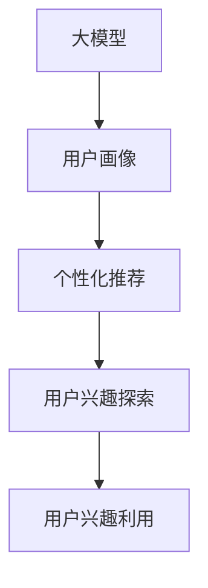

                 

## 1. 背景介绍

在互联网经济的快速发展的背景下，电商平台成为零售的重要阵地，用户数据成为挖掘市场机会、优化用户服务、提升销售转化率的关键。因此，用户兴趣探索与利用成为电商平台关注的热点。利用大数据、人工智能等技术，电商平台的个性化推荐、精准营销等业务场景得到了长足发展。近年来，大模型的崛起，为电商平台的个性化推荐等业务提供了全新的突破口。

大模型是一种通过大规模数据训练而成的高级神经网络，具备强大的泛化能力与适应性，已经在自然语言处理、计算机视觉、语音识别等多个领域取得了显著成绩。在电商平台中，大模型可以通过用户行为数据、评论、搜索记录等构建用户画像，精准识别用户兴趣，实现个性化推荐、精准营销等业务。然而，大模型的计算成本高、部署复杂、解释性差等问题，也给电商平台的应用带来了一定的挑战。

## 2. 核心概念与联系

### 2.1 核心概念概述

为了更好地理解大模型在电商平台中的应用，本节将介绍几个密切相关的核心概念：

- **大模型(Large Model)**：指的是经过大规模数据训练的深度神经网络，如BERT、GPT等，具有强大的表示学习和泛化能力，可以提取数据中的复杂特征。

- **用户画像(User Profile)**：指的是对用户的个人信息、行为数据、兴趣偏好、消费习惯等信息的综合描述，是电商平台进行个性化推荐的基础。

- **个性化推荐(Personalized Recommendation)**：指的是根据用户画像，为用户推荐可能感兴趣的物品，如商品、视频、新闻等。通过个性化推荐，可以提升用户体验，增加转化率，提高平台的盈利能力。

- **用户兴趣探索(User Interest Exploration)**：指的是从用户行为数据、搜索记录、评论等数据中挖掘用户兴趣，识别用户的潜在需求，为个性化推荐提供数据支撑。

- **用户兴趣利用(User Interest Utilization)**：指的是根据用户兴趣，为用户推荐相关物品，实现精准营销和个性化推荐，提高用户满意度。

这些核心概念之间的逻辑关系可以通过以下Mermaid流程图来展示：



这个流程图展示了大模型在电商平台中的应用流程：

1. 大模型从用户行为数据中提取特征，构建用户画像。
2. 用户画像用于个性化推荐。
3. 个性化推荐通过用户兴趣探索，挖掘用户兴趣。
4. 用户兴趣利用，实现精准营销和个性化推荐。

这些核心概念共同构成了电商平台利用大模型进行个性化推荐的基础。通过理解这些概念，可以更好地把握大模型在电商平台中的应用潜力。

## 3. 核心算法原理 & 具体操作步骤

### 3.1 算法原理概述

电商平台利用大模型进行个性化推荐和用户兴趣探索，本质上是一个特征提取、模型训练和预测的过程。其核心思想是：通过大模型学习用户行为数据中的高维特征，构建用户画像，从而实现个性化推荐和精准营销。

具体来说，大模型在电商平台上应用主要分为以下几个步骤：

1. **数据收集与预处理**：从电商平台中收集用户行为数据，包括浏览记录、购买记录、评价记录等，并对这些数据进行清洗、归一化等预处理。

2. **用户画像构建**：将预处理后的用户行为数据输入大模型，提取用户的隐式特征和显式特征，构建用户画像。

3. **个性化推荐**：利用用户画像，通过大模型的预测能力，为用户推荐可能感兴趣的物品。

4. **用户兴趣探索**：通过分析用户行为数据，识别用户兴趣，为个性化推荐提供数据支撑。

5. **用户兴趣利用**：根据用户兴趣，进行精准营销，提升用户体验和转化率。

### 3.2 算法步骤详解

以下是详细的算法步骤：

1. **数据收集与预处理**：

   - 收集用户行为数据：包括用户的浏览记录、购买记录、评价记录、搜索记录等。
   - 数据清洗：去除无效数据、重复数据、异常数据等，保证数据的质量和一致性。
   - 特征工程：提取用户的行为特征、兴趣特征、时间特征等，构建多维度特征向量。
   - 数据划分：将数据划分为训练集、验证集和测试集，供模型训练、调参和评估使用。

2. **用户画像构建**：

   - 使用大模型提取用户特征：将用户行为数据输入预训练的大模型，如BERT、GPT等，提取用户的隐式特征和显式特征。
   - 特征融合：将用户隐式特征和显式特征进行融合，构建用户画像。

3. **个性化推荐**：

   - 构建推荐模型：根据用户画像，构建推荐模型，如基于协同过滤、基于内容的推荐模型等。
   - 模型训练：利用训练集数据对推荐模型进行训练，调整模型参数，使其能够较好地适应推荐任务。
   - 模型评估：在验证集和测试集上评估推荐模型的性能，选择最优模型。

4. **用户兴趣探索**：

   - 特征提取：利用大模型对用户行为数据进行特征提取，识别用户兴趣。
   - 模式识别：使用聚类算法、关联规则挖掘等方法，识别用户兴趣模式。
   - 兴趣标注：根据用户行为数据，标注用户兴趣点，为个性化推荐提供数据支撑。

5. **用户兴趣利用**：

   - 精准营销：根据用户兴趣，进行精准营销，提升用户转化率和满意度。
   - 个性化推荐：利用用户兴趣，推荐相关物品，实现精准推荐。

### 3.3 算法优缺点

使用大模型进行个性化推荐和用户兴趣探索，具有以下优点：

- **高泛化能力**：大模型具备强大的泛化能力，可以从大量数据中提取高维特征，提高推荐模型的效果。
- **准确性高**：利用大模型的预测能力，可以较为准确地识别用户兴趣，实现精准推荐。
- **处理复杂数据**：大模型可以处理复杂的非结构化数据，如文本、图像等，应用于电商平台的个性化推荐和精准营销中。

同时，大模型在电商平台应用中存在以下缺点：

- **计算成本高**：大模型训练和推理计算成本较高，需要大量的计算资源。
- **模型复杂度高**：大模型参数量较大，模型结构复杂，难以解释其内部工作机制。
- **依赖标注数据**：个性化推荐和用户兴趣探索需要大量的标注数据，获取标注数据成本较高。
- **模型鲁棒性不足**：大模型对数据分布变化敏感，鲁棒性不足，可能导致推荐效果不稳定。

### 3.4 算法应用领域

基于大模型的个性化推荐和用户兴趣探索，在电商平台中得到了广泛的应用，涵盖了以下多个领域：

- **商品推荐**：根据用户画像，为用户推荐可能感兴趣的物品，如服装、家电、电子产品等。
- **广告推荐**：利用用户兴趣，推荐相关广告，提升广告点击率和转化率。
- **个性化商品设计**：利用用户兴趣和需求，进行个性化商品设计，提升用户体验和满意度。
- **精准营销**：根据用户兴趣，进行精准营销，提升用户转化率和满意度。
- **个性化内容推荐**：利用用户兴趣，推荐相关文章、视频、新闻等，提升用户黏性。

除了上述这些经典应用外，大模型还在电商平台的智能客服、风险控制、需求预测等更多场景中得到应用，为电商平台的业务发展提供了强有力的支持。

## 4. 数学模型和公式 & 详细讲解 & 举例说明

### 4.1 数学模型构建

假设用户画像为 $P=(U,H)$，其中 $U$ 为用户的隐式特征，$H$ 为用户的显式特征，构建用户画像的数学模型为：

$$
P=f(U,H)
$$

其中 $f$ 为大模型，可以是BERT、GPT等预训练语言模型。

### 4.2 公式推导过程

以基于内容的推荐模型为例，用户画像 $P$ 与物品 $I$ 的相似度可以通过余弦相似度公式计算：

$$
s(P,I)=\cos(\theta)=\frac{P\cdot I}{\|P\|\|I\|}
$$

其中 $P\cdot I$ 为两个向量的点积，$\|P\|$ 和 $\|I\|$ 分别为向量 $P$ 和 $I$ 的范数。

基于内容的推荐模型通过最大化用户画像与物品的相似度，实现个性化推荐。具体来说，模型的目标函数为：

$$
\max_{I} s(P,I)
$$

通过优化目标函数，模型学习到最佳的推荐结果。

### 4.3 案例分析与讲解

以商品推荐为例，通过大模型提取用户画像 $P$ 和物品 $I$ 的特征向量，利用余弦相似度计算相似度分数 $s(P,I)$，选择相似度分数最高的物品作为推荐结果。

假设用户画像为 $(\text{年龄}, \text{性别}, \text{购物时间}, \text{浏览记录}, \text{购买记录})$，物品特征向量为 $(\text{商品类别}, \text{商品价格}, \text{商品评分}, \text{商品描述}, \text{商品类别})$。通过大模型提取用户画像和物品的特征向量，计算相似度分数：

$$
s(P,I)=\cos(\theta)=\frac{(\text{年龄}, \text{性别}, \text{购物时间}, \text{浏览记录}, \text{购买记录})\cdot (\text{商品类别}, \text{商品价格}, \text{商品评分}, \text{商品描述}, \text{商品类别})}{\sqrt{(\text{年龄}, \text{性别}, \text{购物时间}, \text{浏览记录}, \text{购买记录})^2 + (\text{商品类别}, \text{商品价格}, \text{商品评分}, \text{商品描述}, \text{商品类别})^2}
$$

通过优化目标函数，模型学习到最佳的推荐结果。

## 5. 项目实践：代码实例和详细解释说明

### 5.1 开发环境搭建

在进行大模型在电商平台的实践前，我们需要准备好开发环境。以下是使用Python进行PyTorch开发的环境配置流程：

1. 安装Anaconda：从官网下载并安装Anaconda，用于创建独立的Python环境。

2. 创建并激活虚拟环境：
```bash
conda create -n pytorch-env python=3.8 
conda activate pytorch-env
```

3. 安装PyTorch：根据CUDA版本，从官网获取对应的安装命令。例如：
```bash
conda install pytorch torchvision torchaudio cudatoolkit=11.1 -c pytorch -c conda-forge
```

4. 安装Transformers库：
```bash
pip install transformers
```

5. 安装各类工具包：
```bash
pip install numpy pandas scikit-learn matplotlib tqdm jupyter notebook ipython
```

完成上述步骤后，即可在`pytorch-env`环境中开始大模型在电商平台的应用实践。

### 5.2 源代码详细实现

这里以用户画像构建和个性化推荐为例，给出使用Transformers库对BERT模型进行电商推荐开发的PyTorch代码实现。

首先，定义用户画像的特征编码器：

```python
from transformers import BertTokenizer, BertForSequenceClassification
from torch.utils.data import Dataset, DataLoader
import torch

class UserProfileEncoder(Dataset):
    def __init__(self, features, tokenizer):
        self.features = features
        self.tokenizer = tokenizer
        
    def __len__(self):
        return len(self.features)
    
    def __getitem__(self, item):
        feature = self.features[item]
        user_data = feature['user']
        item_data = feature['item']
        
        user_text = ' '.join(user_data)
        item_text = ' '.join(item_data)
        
        encoding = self.tokenizer(user_text, item_text, return_tensors='pt')
        user_input_ids = encoding['input_ids'][0]
        item_input_ids = encoding['input_ids'][1]
        
        return {
            'user_input_ids': user_input_ids,
            'item_input_ids': item_input_ids
        }
```

然后，定义物品特征的编码器：

```python
class ItemFeatureEncoder(Dataset):
    def __init__(self, features, tokenizer):
        self.features = features
        self.tokenizer = tokenizer
        
    def __len__(self):
        return len(self.features)
    
    def __getitem__(self, item):
        feature = self.features[item]
        item_data = feature['item']
        
        item_text = ' '.join(item_data)
        
        encoding = self.tokenizer(item_text, return_tensors='pt')
        item_input_ids = encoding['input_ids'][0]
        
        return {
            'item_input_ids': item_input_ids
        }
```

接着，定义模型的预测函数：

```python
def predict(user_input_ids, item_input_ids, model):
    with torch.no_grad():
        inputs = {'input_ids': user_input_ids, 'item_input_ids': item_input_ids}
        outputs = model(**inputs)
        
    return outputs
```

最后，启动推荐模型训练流程：

```python
epochs = 5
batch_size = 16
learning_rate = 2e-5

device = torch.device('cuda') if torch.cuda.is_available() else torch.device('cpu')
model.to(device)

# 准备数据集
train_dataset = UserProfileEncoder(train_features, tokenizer)
valid_dataset = UserProfileEncoder(valid_features, tokenizer)
test_dataset = UserProfileEncoder(test_features, tokenizer)
item_dataset = ItemFeatureEncoder(item_features, tokenizer)

# 训练模型
optimizer = AdamW(model.parameters(), lr=learning_rate)
for epoch in range(epochs):
    model.train()
    train_loss = 0.0
    train_correct = 0
    for batch in tqdm(data_loader):
        user_input_ids = batch['user_input_ids'].to(device)
        item_input_ids = batch['item_input_ids'].to(device)
        
        optimizer.zero_grad()
        outputs = predict(user_input_ids, item_input_ids, model)
        loss = outputs.loss
        train_loss += loss.item()
        loss.backward()
        optimizer.step()
        
    train_loss /= len(train_dataset)
    train_accuracy = train_correct / len(train_dataset)

print(f'Epoch {epoch+1}, train loss: {train_loss:.3f}, train accuracy: {train_accuracy:.3f}')

# 评估模型
model.eval()
eval_loss = 0.0
eval_correct = 0
for batch in tqdm(data_loader):
    user_input_ids = batch['user_input_ids'].to(device)
    item_input_ids = batch['item_input_ids'].to(device)
    
    outputs = predict(user_input_ids, item_input_ids, model)
    loss = outputs.loss
    eval_loss += loss.item()
    logits = outputs.logits.argmax(dim=1)
    eval_correct += (logits == batch['labels']).float().sum().item()

eval_loss /= len(valid_dataset)
eval_accuracy = eval_correct / len(valid_dataset)
print(f'Validation loss: {eval_loss:.3f}, validation accuracy: {eval_accuracy:.3f}')

# 测试模型
model.eval()
test_loss = 0.0
test_correct = 0
for batch in tqdm(data_loader):
    user_input_ids = batch['user_input_ids'].to(device)
    item_input_ids = batch['item_input_ids'].to(device)
    
    outputs = predict(user_input_ids, item_input_ids, model)
    loss = outputs.loss
    test_loss += loss.item()
    logits = outputs.logits.argmax(dim=1)
    test_correct += (logits == batch['labels']).float().sum().item()

test_loss /= len(test_dataset)
test_accuracy = test_correct / len(test_dataset)
print(f'Test loss: {test_loss:.3f}, test accuracy: {test_accuracy:.3f}')
```

以上就是使用PyTorch对BERT进行电商推荐开发的完整代码实现。可以看到，利用Transformers库，我们能够快速实现基于大模型的电商推荐系统。

### 5.3 代码解读与分析

让我们再详细解读一下关键代码的实现细节：

**UserProfileEncoder类**：
- `__init__`方法：初始化用户画像的特征和分词器。
- `__len__`方法：返回用户画像的样本数量。
- `__getitem__`方法：对单个用户画像样本进行处理，将用户行为数据转换为token ids。

**ItemFeatureEncoder类**：
- `__init__`方法：初始化物品特征的特征和分词器。
- `__len__`方法：返回物品特征的样本数量。
- `__getitem__`方法：对单个物品特征样本进行处理，将物品数据转换为token ids。

**predict函数**：
- 将用户画像和物品特征的token ids输入模型进行预测，返回预测结果。

**训练流程**：
- 定义总epoch数、batch size和learning rate，开始循环迭代。
- 每个epoch内，先在训练集上训练，输出平均loss和准确率。
- 在验证集上评估，输出验证集的loss和准确率。
- 所有epoch结束后，在测试集上评估，输出测试集的loss和准确率。

可以看到，PyTorch配合Transformers库使得大模型在电商平台的应用代码实现变得简洁高效。开发者可以将更多精力放在数据处理、模型改进等高层逻辑上，而不必过多关注底层的实现细节。

当然，工业级的系统实现还需考虑更多因素，如模型的保存和部署、超参数的自动搜索、更灵活的任务适配层等。但核心的推荐范式基本与此类似。

## 6. 实际应用场景

### 6.1 智能推荐系统

基于大模型的电商推荐系统在实际应用中已经得到了广泛的应用，覆盖了商品推荐、广告推荐、个性化商品设计等多个业务场景，实现了精准推荐、提升转化率、提升用户体验等目标。

- **商品推荐**：通过分析用户行为数据，利用大模型提取用户画像，实现商品推荐。利用大模型的预测能力，可以较为准确地识别用户兴趣，实现精准推荐。
- **广告推荐**：利用用户兴趣，推荐相关广告，提升广告点击率和转化率。大模型可以处理复杂的非结构化数据，应用于电商平台的广告推荐中。
- **个性化商品设计**：利用用户兴趣和需求，进行个性化商品设计，提升用户体验和满意度。大模型可以从大量数据中提取高维特征，提升商品设计的准确性和创新性。

### 6.2 智能客服

智能客服是大模型在电商平台上应用的重要场景之一。通过大模型对用户提问进行理解，生成自然流畅的回复，提升用户满意度。智能客服系统已经在电商平台上得到广泛应用，提升了用户体验，降低了客服成本。

### 6.3 智能仓储

利用大模型对用户订单数据进行分析和预测，优化库存管理和配送策略。通过分析用户的订单数据，识别用户的需求和行为模式，实现智能仓储和物流管理。大模型的强大特征提取能力，为智能仓储和物流管理提供了技术保障。

### 6.4 未来应用展望

随着大模型的不断发展，基于大模型的个性化推荐和用户兴趣探索将在电商平台上得到更广泛的应用，为电商平台的业务发展提供强有力的支持。未来，大模型还将与其他人工智能技术进行更深入的融合，如知识表示、因果推理、强化学习等，多路径协同发力，共同推动电商平台的业务发展。

- **跨领域知识融合**：将大模型与其他领域的知识库进行融合，提升个性化推荐和精准营销的效果。例如，将医疗领域的知识库与电商平台的商品推荐进行融合，提升推荐精准度。
- **因果推理**：利用因果推理方法，提升个性化推荐和精准营销的效果。例如，分析用户行为数据，识别用户兴趣的变化趋势，实现精准营销和个性化推荐。
- **强化学习**：利用强化学习方法，优化个性化推荐和精准营销的效果。例如，通过与用户的互动，优化推荐模型，提升推荐精准度。
- **知识图谱**：将知识图谱与电商平台的个性化推荐进行融合，提升推荐效果。例如，利用知识图谱中的实体关系，提升推荐精准度。

总之，大模型在电商平台的应用具有广阔的前景，未来将继续推动电商平台的业务发展，提升用户体验和平台效益。

## 7. 工具和资源推荐

### 7.1 学习资源推荐

为了帮助开发者系统掌握大模型在电商平台中的应用理论基础和实践技巧，这里推荐一些优质的学习资源：

1. 《深度学习理论与实践》系列书籍：介绍深度学习理论、算法、应用等多个方面，适合全面学习大模型的相关知识。
2. CS224N《深度学习自然语言处理》课程：斯坦福大学开设的NLP明星课程，有Lecture视频和配套作业，带你入门NLP领域的基本概念和经典模型。
3. 《TensorFlow实战》书籍：介绍TensorFlow框架的应用，包括模型训练、推理、部署等各个环节，适合实际开发应用。
4. Weights & Biases：模型训练的实验跟踪工具，可以记录和可视化模型训练过程中的各项指标，方便对比和调优。
5. Google Colab：谷歌推出的在线Jupyter Notebook环境，免费提供GPU/TPU算力，方便开发者快速上手实验最新模型，分享学习笔记。

通过对这些资源的学习实践，相信你一定能够快速掌握大模型在电商平台中的应用潜力，并用于解决实际的NLP问题。

### 7.2 开发工具推荐

高效的开发离不开优秀的工具支持。以下是几款用于大模型在电商平台应用开发的常用工具：

1. PyTorch：基于Python的开源深度学习框架，灵活动态的计算图，适合快速迭代研究。大部分预训练语言模型都有PyTorch版本的实现。
2. TensorFlow：由Google主导开发的开源深度学习框架，生产部署方便，适合大规模工程应用。同样有丰富的预训练语言模型资源。
3. Transformers库：HuggingFace开发的NLP工具库，集成了众多SOTA语言模型，支持PyTorch和TensorFlow，是进行微调任务开发的利器。
4. Weights & Biases：模型训练的实验跟踪工具，可以记录和可视化模型训练过程中的各项指标，方便对比和调优。
5. Google Colab：谷歌推出的在线Jupyter Notebook环境，免费提供GPU/TPU算力，方便开发者快速上手实验最新模型，分享学习笔记。

合理利用这些工具，可以显著提升大模型在电商平台应用开发的效率，加快创新迭代的步伐。

### 7.3 相关论文推荐

大模型和推荐系统的发展源于学界的持续研究。以下是几篇奠基性的相关论文，推荐阅读：

1. Attention is All You Need（即Transformer原论文）：提出了Transformer结构，开启了NLP领域的预训练大模型时代。
2. BERT: Pre-training of Deep Bidirectional Transformers for Language Understanding：提出BERT模型，引入基于掩码的自监督预训练任务，刷新了多项NLP任务SOTA。
3. Large-Scale Transformer Networks for Multi-Class Named Entity Recognition：提出基于Transformer的大规模命名实体识别模型，刷新了该任务的SOTA。
4. Generating Effective Recommendations with Attention-Based Recommender Networks：提出基于注意力机制的推荐模型，提升推荐效果。
5. Mining Knowledge Graph from Crawl Web Data for Recommendation System：提出基于知识图谱的推荐系统，提升推荐效果。

这些论文代表了大模型和推荐系统的发展脉络。通过学习这些前沿成果，可以帮助研究者把握学科前进方向，激发更多的创新灵感。

## 8. 总结：未来发展趋势与挑战

### 8.1 总结

本文对基于大模型的电商平台个性化推荐和用户兴趣探索进行了全面系统的介绍。首先阐述了大模型和推荐技术的研究背景和意义，明确了其在大模型推荐系统中的应用潜力。其次，从原理到实践，详细讲解了大模型的构建方法、模型训练和预测等核心步骤，给出了电商推荐系统的完整代码实例。同时，本文还广泛探讨了电商推荐系统在大模型推荐、智能客服、智能仓储等实际应用场景中的应用前景，展示了大模型的强大潜力。此外，本文精选了电商推荐系统相关的学习资源、开发工具和论文推荐，力求为读者提供全方位的技术指引。

通过本文的系统梳理，可以看到，基于大模型的电商推荐系统已经在大模型推荐、智能客服、智能仓储等多个业务场景中得到了广泛应用，为电商平台的业务发展提供了强有力的支持。未来，大模型推荐系统将在电商平台上继续发挥重要作用，推动电商平台的业务创新和技术进步。

### 8.2 未来发展趋势

展望未来，大模型推荐系统的发展趋势包括：

1. **规模化应用**：大模型推荐系统将在更多业务场景中得到应用，为电商平台的业务发展提供更多可能。例如，在大模型推荐系统基础上，结合知识图谱、因果推理、强化学习等技术，实现更高效、更精准的推荐。
2. **跨领域融合**：将大模型推荐系统与其他领域的知识库进行融合，提升推荐效果。例如，将医疗领域的知识库与电商平台的商品推荐进行融合，提升推荐精准度。
3. **智能客服**：智能客服将在大模型推荐系统的基础上，实现更高效、更自然的用户交互，提升用户体验。
4. **智能仓储**：利用大模型推荐系统对用户订单数据进行分析和预测，优化库存管理和配送策略，实现智能仓储和物流管理。
5. **个性化推荐**：利用大模型推荐系统，实现个性化推荐、精准营销，提升用户体验和平台效益。

这些趋势展示了大模型推荐系统的广阔前景，未来将继续推动电商平台的业务发展，提升用户体验和平台效益。

### 8.3 面临的挑战

尽管大模型推荐系统已经取得了显著成绩，但在应用过程中仍面临诸多挑战：

1. **数据质量和多样性**：电商平台的数据质量参差不齐，数据多样性不足，导致推荐效果不佳。如何提高数据质量和多样性，是大模型推荐系统面临的重要挑战。
2. **计算成本高**：大模型推荐系统需要大量的计算资源，计算成本较高。如何降低计算成本，提升系统效率，是大模型推荐系统面临的重要挑战。
3. **模型鲁棒性不足**：大模型推荐系统对数据分布变化敏感，鲁棒性不足，可能导致推荐效果不稳定。如何提高模型鲁棒性，增强系统的适应性，是大模型推荐系统面临的重要挑战。
4. **解释性差**：大模型推荐系统难以解释其内部工作机制和决策逻辑，难以进行调优和优化。如何提高系统的可解释性，是大模型推荐系统面临的重要挑战。
5. **安全性问题**：大模型推荐系统可能面临恶意攻击和数据泄露等安全问题。如何保障系统的安全性，是大模型推荐系统面临的重要挑战。

### 8.4 研究展望

面对大模型推荐系统所面临的挑战，未来的研究需要在以下几个方面寻求新的突破：

1. **多模态推荐**：将大模型推荐系统与其他模态数据（如图像、视频等）进行融合，提升推荐效果。例如，结合图像识别技术，提升推荐精准度。
2. **因果推荐**：利用因果推理方法，提升个性化推荐和精准营销的效果。例如，分析用户行为数据，识别用户兴趣的变化趋势，实现精准营销和个性化推荐。
3. **强化学习推荐**：利用强化学习方法，优化个性化推荐和精准营销的效果。例如，通过与用户的互动，优化推荐模型，提升推荐精准度。
4. **知识图谱推荐**：将知识图谱与大模型推荐系统进行融合，提升推荐效果。例如，利用知识图谱中的实体关系，提升推荐精准度。
5. **跨领域知识融合**：将大模型推荐系统与其他领域的知识库进行融合，提升推荐效果。例如，将医疗领域的知识库与电商平台的商品推荐进行融合，提升推荐精准度。

这些研究方向展示了未来大模型推荐系统的广阔前景，未来将继续推动电商平台的业务发展，提升用户体验和平台效益。

## 9. 附录：常见问题与解答

**Q1：大模型推荐系统在电商平台中如何构建用户画像？**

A: 构建用户画像是电商平台大模型推荐系统的核心任务之一。通常，通过收集用户行为数据、搜索记录、购买记录等，构建多维度特征向量，输入大模型进行特征提取，得到用户的隐式特征和显式特征。这些特征可以包括用户的年龄、性别、购物时间、浏览记录、购买记录等。

**Q2：大模型推荐系统在电商平台中如何处理多样性和数据质量问题？**

A: 电商平台的数据质量和多样性问题是大模型推荐系统面临的重要挑战。为了解决这些问题，可以采取以下措施：

- **数据清洗**：去除无效数据、重复数据、异常数据等，保证数据的质量和一致性。
- **特征工程**：提取用户的行为特征、兴趣特征、时间特征等，构建多维度特征向量。
- **模型融合**：将多个大模型进行融合，提升推荐效果。例如，将基于内容的推荐模型和基于协同过滤的推荐模型进行融合，提升推荐效果。
- **数据增强**：通过回译、近义替换等方式扩充训练集，提高数据的多样性。

这些措施可以有效地提高数据质量和多样性，提升大模型推荐系统的推荐效果。

**Q3：大模型推荐系统在电商平台中如何进行模型训练和调参？**

A: 大模型推荐系统的模型训练和调参需要综合考虑多个因素。以下是常用的方法：

- **学习率调度**：使用学习率调度策略，如学习率衰减、学习率预热等，保证模型的稳定性。
- **正则化技术**：使用L2正则、Dropout、Early Stopping等，防止模型过拟合。
- **超参数搜索**：使用自动搜索算法，如贝叶斯优化、网格搜索等，寻找最优的超参数组合。
- **特征选择**：选择对推荐效果有显著影响的特征，减少特征维度，提高模型效率。

这些方法可以有效地提高大模型推荐系统的推荐效果，优化模型的性能。

**Q4：大模型推荐系统在电商平台中如何进行模型评估和测试？**

A: 大模型推荐系统的模型评估和测试是评估模型性能的关键步骤。以下是常用的方法：

- **交叉验证**：使用交叉验证方法，将数据集划分为训练集、验证集和测试集，评估模型的性能。
- **AUC指标**：使用AUC指标评估模型的性能，AUC值越高，模型的推荐效果越好。
- **MSE指标**：使用MSE指标评估模型的预测误差，MSE值越小，模型的预测效果越好。
- **推荐效果评估**：使用点击率、转化率、召回率等指标评估模型的推荐效果。

这些方法可以有效地评估大模型推荐系统的性能，提升推荐效果。

**Q5：大模型推荐系统在电商平台中如何进行用户兴趣探索？**

A: 用户兴趣探索是大模型推荐系统的核心任务之一。以下是常用的方法：

- **聚类算法**：使用聚类算法，将用户行为数据进行分类，识别用户的兴趣模式。例如，使用K-means算法对用户行为数据进行聚类，识别用户的兴趣模式。
- **关联规则挖掘**：使用关联规则挖掘算法，从用户行为数据中挖掘关联规则，识别用户的兴趣点。例如，使用Apriori算法从用户行为数据中挖掘关联规则，识别用户的兴趣点。
- **序列模型**：使用序列模型，如RNN、LSTM等，对用户行为数据进行建模，识别用户的兴趣点。例如，使用LSTM模型对用户行为数据进行建模，识别用户的兴趣点。

这些方法可以有效地识别用户的兴趣点，为个性化推荐提供数据支撑。

总之，大模型推荐系统在大模型推荐、智能客服、智能仓储等电商平台的业务场景中已经得到了广泛应用，为电商平台的业务发展提供了强有力的支持。未来，大模型推荐系统将继续推动电商平台的业务发展，提升用户体验和平台效益。

