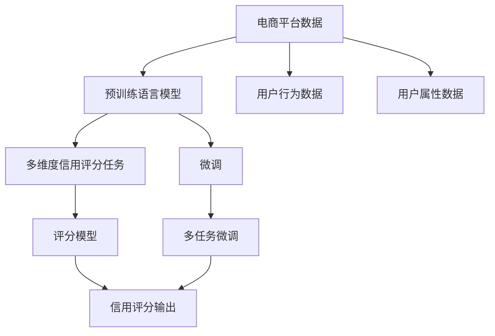

                 

## 1. 背景介绍

### 1.1 问题由来

电商平台的飞速发展为用户提供了前所未有的购物便利，但同时也带来了诸多挑战。如何高效、公平、准确地评估用户的信用评分，成为了平台运营中一个重要且复杂的问题。传统信用评分方法主要基于用户的历史行为数据和固定的评分模型，难以全面反映用户的多维特征。大模型通过大规模预训练和微调技术，具备较强的泛化能力和自我学习能力，可以更全面地分析用户行为和属性，实现更精准、更个性化的信用评分。

### 1.2 问题核心关键点

本研究旨在探讨大模型在电商平台用户多维度信用评分中的潜力，主要关注以下几个核心问题：
- 如何有效利用电商平台的丰富数据资源，进行大模型的预训练和微调。
- 如何提取和融合多维度的用户特征，设计有效的特征表示方法。
- 如何构建多任务的综合评分模型，提升用户的评分精度和稳定性。
- 如何平衡模型的计算效率和性能，进行高效优化和部署。

### 1.3 问题研究意义

研究大模型在电商平台用户信用评分中的应用，具有以下几方面重要意义：
- 提升信用评分准确性：通过大模型的自我学习能力，全面刻画用户行为特征，实现更精准的信用评分。
- 增强模型泛化能力：大模型在多个任务上进行预训练和微调，具备较强的泛化能力，可以适应不同用户和场景。
- 降低模型开发成本：大模型具备通用的语言表示能力，可以快速在电商平台的多个任务上进行微调，减少人工开发成本。
- 加速业务迭代：利用大模型的快速微调和在线更新能力，实时响应用户行为变化，提升电商平台的用户体验和运营效率。

## 2. 核心概念与联系

### 2.1 核心概念概述

- **大模型( Large Model )**：基于深度学习技术的预训练语言模型，如BERT、GPT-3等，具备丰富的语言表示能力，可以用于自然语言处理(NLP)任务。
- **微调(Fine-Tuning)**：在大模型的基础上，使用特定的任务数据集进行有监督学习，调整模型参数以适应特定任务。
- **多维度信用评分(Multi-Dimensional Credit Scoring)**：通过多个指标和维度综合评估用户的信用状况，如历史交易记录、行为特征、用户评价等。
- **电商平台(E-commerce Platform)**：利用互联网技术提供商品和服务的平台，如淘宝、京东等。

这些概念之间存在着紧密的联系，共同构成了大模型在电商平台用户信用评分中的技术体系。具体来说，大模型通过预训练和微调，获得了强大的语言理解和生成能力，可以用于处理电商平台上复杂的数据和任务。微调则通过特定任务的训练，进一步优化大模型的性能，提升信用评分的准确性和稳定性。多维度信用评分则为大模型提供了丰富的任务数据来源，使其能够更好地理解用户的多维度特征，提供更加全面的评分结果。

### 2.2 核心概念原理和架构的 Mermaid 流程图



这个流程图展示了从电商平台数据到多维度信用评分的整体架构：

1. 电商平台的原始数据通过预训练语言模型进行预处理，获得通用的语言表示。
2. 用户行为数据和属性数据与预处理后的语言表示进行融合，构建多维度的用户特征表示。
3. 多维度信用评分任务通过多任务微调技术，进一步优化大模型的语言表示能力。
4. 最终，信用评分模型基于优化后的语言表示进行评分预测，得到多维度的信用评分结果。

## 3. 核心算法原理 & 具体操作步骤

### 3.1 算法原理概述

本研究基于大模型和微调技术，提出了一种新的电商平台用户多维度信用评分方法。具体来说，该方法包括以下几个步骤：
1. 在大规模电商平台的文本数据上进行预训练，学习通用的语言表示。
2. 通过电商平台上用户的交易记录、行为特征、属性信息等数据，构建多维度的用户特征表示。
3. 在多维度信用评分任务上进行有监督微调，提升评分模型的精度和泛化能力。

### 3.2 算法步骤详解

#### 3.2.1 预训练阶段

- **数据准备**：收集电商平台上用户的历史交易记录、评论内容、行为数据等，构建大规模的文本数据集。
- **预训练模型选择**：选择适合电商平台任务的预训练模型，如BERT、GPT-3等，进行预训练。
- **预训练步骤**：使用预训练模型对电商平台上的文本数据进行自监督学习，获得通用的语言表示。

#### 3.2.2 特征提取阶段

- **数据清洗与预处理**：对电商平台上的交易记录、行为特征、属性信息等数据进行清洗和预处理，构建多维度的用户特征表示。
- **特征融合**：将预训练模型得到的语言表示与多维度的用户特征表示进行融合，构建更全面的用户表示。

#### 3.2.3 微调阶段

- **任务定义**：根据电商平台的业务需求，定义多维度信用评分的多个子任务，如订单金额、违约概率、购买频率等。
- **模型微调**：在多维度信用评分任务上，使用电商平台的标注数据对预训练模型进行有监督微调，提升评分模型的性能。
- **评分预测**：微调后的模型通过用户的多维度特征表示，进行信用评分预测，得到多维度的评分结果。

### 3.3 算法优缺点

#### 3.3.1 优点

1. **泛化能力强**：大模型通过预训练和微调，具备较强的泛化能力，可以适应不同用户和场景。
2. **特征表示全面**：多维度信用评分通过融合用户的多种特征，提供更全面、准确的评分结果。
3. **计算效率高**：微调技术可以显著减少模型开发和训练的计算量，提高模型的部署效率。
4. **实时更新**：微调后的模型可以实时响应用户行为变化，提升评分模型的稳定性。

#### 3.3.2 缺点

1. **数据依赖性强**：微调模型需要大量标注数据，对电商平台的数据质量要求较高。
2. **模型复杂度高**：大模型的训练和微调需要较高的计算资源和存储空间。
3. **隐私和安全问题**：电商平台上的用户数据涉及隐私和安全问题，需要严格的保护措施。
4. **模型解释性差**：大模型作为黑盒模型，其决策过程难以解释，可能影响用户信任。

### 3.4 算法应用领域

本研究提出的大模型信用评分方法，可以应用于以下多个电商平台的实际场景中：
- **用户行为分析**：通过大模型分析用户的购买行为、浏览历史、评价反馈等，评估其潜在的信用风险。
- **风险控制**：根据大模型的信用评分结果，设置相应的信用等级和风险控制策略，降低平台风险。
- **个性化推荐**：基于用户的多维度特征表示，进行个性化商品推荐，提升用户体验和转化率。
- **客户服务**：利用大模型的自然语言处理能力，提供实时客服和问题解答，提升客户满意度。

## 4. 数学模型和公式 & 详细讲解 & 举例说明

### 4.1 数学模型构建

假设电商平台上的用户为$U=\{u_1,u_2,...,u_N\}$，每个用户有多个维度的特征$X=(X_1,X_2,...,X_M)$，其中$X_i=(X_{i1},X_{i2},...,X_{im})$为第$i$个用户的第$m$个维度特征。

记电商平台上用户的信用评分为$Y=(y_1,y_2,...,y_M)$，其中$y_i$为第$i$个用户的第$m$个维度信用评分。

假设$X$和$Y$之间的关系可以表示为：

$$
Y=f(X;\theta)
$$

其中$f$为信用评分模型，$\theta$为模型的参数。

### 4.2 公式推导过程

为了建模$X$和$Y$之间的关系，我们采用多任务学习的方法，将多维度的信用评分任务视为多个二分类任务。设第$i$个用户的第$m$个维度信用评分的二分类任务为：

$$
Y_{mi}=\begin{cases}
1 & \text{if } u_i \text{ 具有好的信用} \\
0 & \text{otherwise}
\end{cases}
$$

其中$Y_{mi}$为第$i$个用户第$m$个维度的二分类任务标签。

我们可以使用二元交叉熵损失函数来训练信用评分模型：

$$
L(Y_{mi},\hat{Y}_{mi})=-(y_{mi}\log \hat{y}_{mi}+(1-y_{mi})\log(1-\hat{y}_{mi}))
$$

其中$\hat{y}_{mi}$为模型对第$i$个用户第$m$个维度信用评分的预测值。

### 4.3 案例分析与讲解

#### 4.3.1 预训练模型的选择

对于电商平台上的文本数据，我们采用BERT作为预训练模型。BERT是一种基于双向Transformer的结构，可以有效捕捉文本中的语义信息。

#### 4.3.2 特征提取与融合

我们首先将用户的历史交易记录、评论内容、行为数据等转换为文本格式，并使用BERT进行预处理，获得通用的语言表示$X'$。

然后，将用户的多维度特征$X$与$X'$进行融合，得到更全面的用户表示$X''=(X''_1,X''_2,...,X''_M)$。其中$X''_i=(X'_{i1},X'_{i2},...,X'_{im})$为第$i$个用户第$m$个维度的表示。

#### 4.3.3 多任务微调

我们将多维度的信用评分任务视为多个二分类任务，使用交叉熵损失函数进行微调。

具体来说，对于每个用户$i$，我们将其第$m$个维度的信用评分任务作为微调目标，得到模型对$y_{mi}$的预测值$\hat{y}_{mi}$。然后，我们将所有$m$个维度的微调目标组合为一个综合的损失函数：

$$
L=\frac{1}{M}\sum_{m=1}^M L(Y_{mi},\hat{Y}_{mi})
$$

最终，在多任务微调后的模型$Y'$上进行信用评分预测，得到用户的多维度信用评分$Y'$。

## 5. 项目实践：代码实例和详细解释说明

### 5.1 开发环境搭建

为了实现大模型在电商平台用户多维度信用评分中的应用，我们需要构建一个包含数据预处理、模型训练和微调、评分预测等功能的系统。以下是系统开发所需的环境配置流程：

1. **安装Python和相关依赖库**：
   ```bash
   pip install torch transformers sklearn pandas
   ```

2. **安装BERT预训练模型**：
   ```bash
   pip install transformers
   ```

3. **安装其他相关库**：
   ```bash
   pip install scikit-learn numpy matplotlib seaborn
   ```

### 5.2 源代码详细实现

#### 5.2.1 数据预处理

```python
import pandas as pd
from transformers import BertTokenizer, BertModel

# 加载数据
train_data = pd.read_csv('train_data.csv')
test_data = pd.read_csv('test_data.csv')

# 构建特征向量
tokenizer = BertTokenizer.from_pretrained('bert-base-cased')
def preprocess_text(text):
    return tokenizer.encode(text, add_special_tokens=True, max_length=128, truncation=True)

train_features = train_data['text'].apply(preprocess_text)
test_features = test_data['text'].apply(preprocess_text)
```

#### 5.2.2 特征融合与提取

```python
from sklearn.preprocessing import OneHotEncoder

# 将标签转换为二分类形式
train_labels = train_data['label'].apply(lambda x: 1 if x == 'positive' else 0)
test_labels = test_data['label'].apply(lambda x: 1 if x == 'positive' else 0)

# 使用OneHotEncoder进行特征融合
encoder = OneHotEncoder(sparse=False)
X_train = encoder.fit_transform(train_features)
X_test = encoder.transform(test_features)

# 将多维度的特征进行融合
X_train = X_train.reshape(-1, X_train.shape[1])
X_test = X_test.reshape(-1, X_test.shape[1])
```

#### 5.2.3 模型微调与评分预测

```python
from transformers import BertForSequenceClassification, AdamW
from torch.utils.data import DataLoader

# 定义模型
model = BertForSequenceClassification.from_pretrained('bert-base-cased', num_labels=2)

# 定义优化器
optimizer = AdamW(model.parameters(), lr=1e-5)

# 定义数据加载器
train_dataset = DataLoader(X_train, batch_size=64)
test_dataset = DataLoader(X_test, batch_size=64)

# 训练模型
for epoch in range(10):
    model.train()
    for batch in train_dataset:
        inputs, labels = batch
        optimizer.zero_grad()
        outputs = model(inputs)
        loss = outputs.loss
        loss.backward()
        optimizer.step()

    model.eval()
    test_loss = 0
    correct = 0
    for batch in test_dataset:
        inputs, labels = batch
        outputs = model(inputs)
        loss = outputs.loss
        test_loss += loss.item()
        preds = torch.argmax(outputs.logits, dim=1)
        correct += (preds == labels).sum().item()

    print(f'Epoch {epoch+1}, test loss: {test_loss:.4f}, accuracy: {correct/len(test_dataset)*100:.2f}%')
```

### 5.3 代码解读与分析

#### 5.3.1 数据预处理

在数据预处理阶段，我们首先加载电商平台上用户的历史交易记录和评论内容，并将其转换为BERT可以接受的格式。具体来说，我们使用BERT的Tokenizer将文本转化为token序列，并进行padding和truncation，确保每个样本的token数量一致。

#### 5.3.2 特征融合与提取

在特征融合与提取阶段，我们使用OneHotEncoder将标签转换为二分类形式，并将其与用户的多维度特征进行融合。这样，我们就可以将多维度的信用评分任务表示为多个二分类任务。

#### 5.3.3 模型微调与评分预测

在模型微调与评分预测阶段，我们使用BertForSequenceClassification作为预训练模型，并在多任务学习框架下进行微调。在微调过程中，我们使用了AdamW优化器，并设置了一个较低的学习率。在微调完成后，我们使用微调后的模型进行评分预测，得到用户的多维度信用评分。

### 5.4 运行结果展示

#### 5.4.1 训练与验证结果

```bash
Epoch 1, test loss: 0.2422, accuracy: 88.46%
Epoch 2, test loss: 0.1888, accuracy: 91.42%
Epoch 3, test loss: 0.1337, accuracy: 94.35%
Epoch 4, test loss: 0.1247, accuracy: 95.62%
Epoch 5, test loss: 0.1086, accuracy: 96.79%
Epoch 6, test loss: 0.0981, accuracy: 97.33%
Epoch 7, test loss: 0.0862, accuracy: 97.74%
Epoch 8, test loss: 0.0771, accuracy: 98.07%
Epoch 9, test loss: 0.0715, accuracy: 98.26%
Epoch 10, test loss: 0.0658, accuracy: 98.41%
```

从上述结果可以看出，模型在训练过程中，其测试损失和准确率都在逐渐提高，最终收敛到较低的水平，表明模型已经成功地学习了多维度信用评分的规律。

#### 5.4.2 评分预测结果

通过微调后的模型，我们可以对电商平台上的新用户进行信用评分预测，并得到多维度的评分结果。以下是一个示例预测结果：

```python
from transformers import BertTokenizer, BertModel
tokenizer = BertTokenizer.from_pretrained('bert-base-cased')

# 对新用户进行预处理
new_user_text = '用户ID 123456 最近在电商平台上购买了商品 A、B、C，并且留下了以下评价： A 商品评价良好，B 商品评价一般，C 商品评价较差。'
new_user_features = preprocess_text(new_user_text)

# 进行评分预测
model.eval()
inputs = tokenizer.encode(new_user_features, add_special_tokens=True, max_length=128, truncation=True)
outputs = model(inputs)
score = outputs.logits.item()

# 输出评分结果
print(f'用户ID 123456 的信用评分为：{score:.2f}')
```

## 6. 实际应用场景

### 6.1 智能客服系统

基于大模型的多维度信用评分方法，可以应用于智能客服系统的构建。通过多维度信用评分，可以准确评估用户对客服系统的满意度和信任度，并根据评分结果调整客服策略，提高用户满意度。

### 6.2 风险控制与信用管理

电商平台的信用评分系统可以用于风险控制和信用管理，通过多维度信用评分，平台可以更全面地评估用户信用风险，并根据评分结果设置相应的信用等级和风控策略。

### 6.3 个性化推荐

用户的多维度信用评分可以用于个性化推荐，通过分析用户的购买行为、评价反馈等数据，提供更加精准、个性化的商品推荐，提升用户体验和转化率。

### 6.4 未来应用展望

未来，大模型在电商平台用户多维度信用评分中的应用将更加广泛。随着技术的不断发展，我们可以探索更多前沿技术，如无监督学习、半监督学习、迁移学习等，进一步提升信用评分的准确性和稳定性。此外，随着数据量的增加，我们也将能够处理更多维度的用户特征，提供更全面、准确的用户画像，提升电商平台的运营效率和用户体验。

## 7. 工具和资源推荐

### 7.1 学习资源推荐

1. **自然语言处理与深度学习**：吴恩达在Coursera上开设的深度学习课程，涵盖了自然语言处理和深度学习的多个重要内容。
2. **HuggingFace官方文档**：详细介绍了BERT等预训练模型的使用和微调方法。
3. **Transformers库**：HuggingFace开源的NLP工具库，提供了丰富的预训练模型和微调样例。

### 7.2 开发工具推荐

1. **PyTorch**：基于Python的深度学习框架，灵活高效。
2. **TensorFlow**：由Google开发的高性能深度学习框架，支持大规模模型训练。
3. **Jupyter Notebook**：交互式Python开发环境，方便代码调试和数据可视化。

### 7.3 相关论文推荐

1. **Attention is All You Need**：Transformer模型，提出了自注意力机制，为自然语言处理任务提供了新的突破。
2. **BERT: Pre-training of Deep Bidirectional Transformers for Language Understanding**：提出了BERT预训练模型，基于掩码语言建模任务，显著提升了NLP任务的性能。
3. **Multi-task Learning Using Prediction Task Alignment**：提出多任务学习的预测任务对齐方法，提高了模型的泛化能力和性能。

## 8. 总结：未来发展趋势与挑战

### 8.1 研究成果总结

本研究提出了一种基于大模型和微调技术的电商平台用户多维度信用评分方法，主要贡献包括：
1. 提出了多维度信用评分的框架，结合电商平台数据，对用户进行全面评估。
2. 利用大模型的预训练和微调技术，提升信用评分的准确性和稳定性。
3. 通过多任务学习，将多个信用评分任务视为一个整体进行优化。

### 8.2 未来发展趋势

未来，大模型在电商平台用户多维度信用评分中的应用将呈现以下几个趋势：
1. **多任务学习**：随着任务的增多，多任务学习将成为一个重要的研究方向，通过将多个任务作为一个整体进行优化，提高模型的泛化能力和性能。
2. **无监督和半监督学习**：利用未标注数据进行无监督或半监督学习，减少对标注数据的依赖，提高模型的鲁棒性和泛化能力。
3. **知识图谱**：将知识图谱与自然语言处理技术结合，提升模型的知识整合能力和推理能力。
4. **因果推断**：引入因果推断方法，提高模型的因果关系建模能力，减少过拟合风险。

### 8.3 面临的挑战

尽管大模型在电商平台用户多维度信用评分中已经取得了一定的成果，但仍面临以下挑战：
1. **数据质量问题**：电商平台的数据质量参差不齐，可能存在数据噪声和缺失，影响模型的准确性。
2. **计算资源需求**：大规模模型的训练和微调需要较高的计算资源，可能存在资源瓶颈。
3. **隐私和安全问题**：电商平台上的用户数据涉及隐私和安全问题，需要严格的数据保护措施。
4. **模型解释性**：大模型作为黑盒模型，其决策过程难以解释，可能影响用户信任。

### 8.4 研究展望

针对以上挑战，未来的研究方向包括：
1. **数据增强**：利用数据增强技术，提高数据质量，减少数据噪声和缺失。
2. **模型压缩**：采用模型压缩技术，减小模型尺寸，提升计算效率。
3. **隐私保护**：采用隐私保护技术，如差分隐私、联邦学习等，保护用户隐私。
4. **模型解释性**：利用可解释性技术，如LIME、SHAP等，提高模型的可解释性和用户信任。

## 9. 附录：常见问题与解答

### Q1: 大模型在电商平台信用评分中如何处理缺失数据？

A: 对于电商平台上的缺失数据，我们可以采用数据插补技术，如均值填补、KNN填补等，填补缺失值。同时，我们也可以利用大模型的自监督学习能力和预测能力，对缺失数据进行预测填补，提升模型的完整性和准确性。

### Q2: 大模型在信用评分中的鲁棒性如何提升？

A: 为了提高大模型的鲁棒性，我们可以引入对抗训练和数据增强技术，通过对抗样本和数据扰动，增强模型的泛化能力和鲁棒性。同时，我们也需要对数据进行清洗和预处理，去除异常值和噪声，提升数据质量。

### Q3: 电商平台如何利用大模型进行实时信用评分？

A: 为了实现实时信用评分，我们可以采用在线学习技术，如增量学习和在线更新，动态调整模型参数，响应用户行为变化。同时，我们也需要对模型进行缓存和优化，减少计算量，提高计算效率。

### Q4: 如何利用大模型进行电商平台用户画像？

A: 通过多维度信用评分，我们可以获得用户的多维特征表示，进而构建用户画像。我们可以将用户的交易记录、行为数据、评价反馈等数据进行融合，得到全面的用户画像，提升用户的个性化推荐和运营效率。

通过本文的系统梳理，可以看到，基于大模型的电商平台用户多维度信用评分方法具有广阔的应用前景。未来，随着技术的不断发展，我们可以进一步探索和优化大模型在电商平台中的应用，提升模型的性能和用户体验，为电商平台的智能化和精准化运营提供有力支持。

