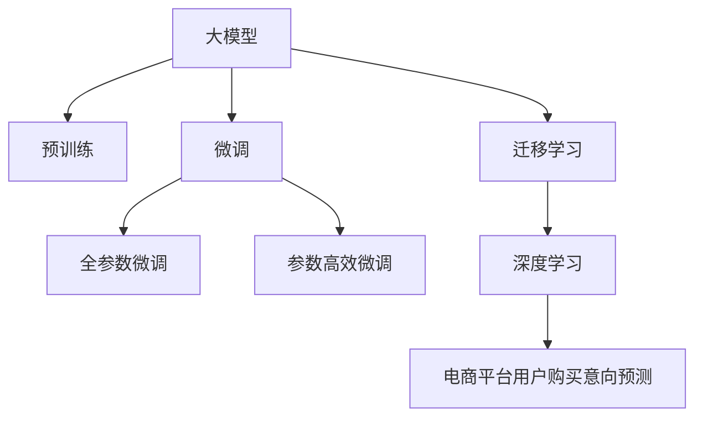

                 

# 探讨大模型在电商平台用户购买意向预测中的潜力

大模型在电商平台用户购买意向预测中的应用已经成为一种趋势，本文将探讨大模型在该领域的应用潜力、核心概念、算法原理以及具体的实践案例。

## 1. 背景介绍

### 1.1 问题由来

电商平台需要精准预测用户购买意向，以优化库存、提升转化率和个性化推荐。传统机器学习模型如线性回归、决策树等，在面对复杂非线性关系和多维度特征时往往难以取得理想的效果。近年来，基于大模型的深度学习方法在电商领域展现了巨大的潜力，被广泛用于用户行为预测、广告点击率预测、个性化推荐等场景。

### 1.2 问题核心关键点

大模型在电商平台用户购买意向预测中的核心挑战包括以下几个方面：

- 高维稀疏数据处理：电商平台的用户数据具有高维稀疏性，如何高效处理这些数据是大模型应用的关键。
- 非线性关系建模：用户的购买意向与行为特征之间存在复杂的非线性关系，如何构建准确的预测模型是大模型需要解决的问题。
- 实时性要求：电商平台需要快速响应用户行为变化，大模型预测的实时性是一个重要考量因素。
- 可解释性需求：电商平台用户对推荐结果的信任度要求较高，模型的可解释性也成为评估模型性能的一个重要指标。

## 2. 核心概念与联系

### 2.1 核心概念概述

为更好地理解大模型在电商平台用户购买意向预测中的应用，本节将介绍几个密切相关的核心概念：

- 大模型：指以自回归或自编码模型为代表的大规模预训练模型，如BERT、GPT等。通过在大规模无标签文本语料上进行预训练，学习到丰富的语言知识和常识。
- 预训练：指在大规模无标签文本语料上，通过自监督学习任务训练通用语言模型的过程。常见的预训练任务包括语言建模、掩码语言模型等。
- 微调：指在预训练模型的基础上，使用下游任务的少量标注数据，通过有监督学习优化模型在特定任务上的性能。
- 迁移学习：指将一个领域学习到的知识，迁移应用到另一个不同但相关的领域的学习范式。大模型的预训练-微调过程即是一种典型的迁移学习方式。
- 深度学习：指通过多层神经网络结构，模拟人脑神经元处理信息的过程，实现复杂非线性关系的建模。

这些核心概念之间的逻辑关系可以通过以下Mermaid流程图来展示：



这个流程图展示了大模型与电商平台用户购买意向预测的密切联系：

1. 大模型通过预训练获得基础能力。
2. 微调是对预训练模型进行任务特定的优化，可以分为全参数微调和参数高效微调（PEFT）。
3. 迁移学习是连接预训练模型与电商平台用户购买意向预测的桥梁，可以通过微调或深度学习实现。
4. 深度学习是构建电商平台用户购买意向预测模型的核心技术。

## 3. 核心算法原理 & 具体操作步骤

### 3.1 算法原理概述

大模型在电商平台用户购买意向预测中的核心算法原理可以概括为：

- 通过预训练模型学习到语言中的语言知识和常识，构建一个通用的语言表示器。
- 将用户行为数据作为输入，通过微调或深度学习，训练模型学习用户行为与购买意向之间的复杂关系。
- 通过优化算法不断调整模型参数，使得预测结果与实际购买行为尽可能一致。

### 3.2 算法步骤详解

1. **准备预训练模型和数据集**：选择合适的预训练语言模型 $M_{\theta}$ 作为初始化参数，如 BERT、GPT等。收集电商平台的标注数据集 $D=\{(x_i,y_i)\}_{i=1}^N$，其中 $x_i$ 为用户的浏览、点击、购买等行为数据，$y_i$ 为用户的购买意向标签。

2. **添加任务适配层**：根据任务类型，在预训练模型顶层设计合适的输出层和损失函数。对于电商平台用户购买意向预测，通常使用sigmoid或softmax输出层，交叉熵或对数损失函数。

3. **设置微调超参数**：选择合适的优化算法及其参数，如 Adam、SGD 等，设置学习率、批大小、迭代轮数等。设置正则化技术及强度，包括权重衰减、Dropout、Early Stopping 等。

4. **执行梯度训练**：将训练集数据分批次输入模型，前向传播计算损失函数。反向传播计算参数梯度，根据设定的优化算法和学习率更新模型参数。周期性在验证集上评估模型性能，根据性能指标决定是否触发 Early Stopping。

5. **测试和部署**：在测试集上评估微调后模型 $M_{\hat{\theta}}$ 的性能，对比微调前后的精度提升。使用微调后的模型对新样本进行推理预测，集成到实际的应用系统中。

### 3.3 算法优缺点

大模型在电商平台用户购买意向预测中具有以下优点：

- 能够处理高维稀疏数据：大模型可以通过自注意力机制，高效地处理高维稀疏的用户行为数据。
- 具备强大的非线性关系建模能力：大模型通过多层网络结构，能够学习到复杂非线性关系，实现高精度的预测。
- 可以通过少量标注数据进行微调：大模型的预训练知识可以大幅降低微调对标注样本的需求，提升模型的泛化能力。

同时，该方法也存在一些局限性：

- 依赖标注数据：微调的效果很大程度上取决于标注数据的质量和数量，获取高质量标注数据的成本较高。
- 模型复杂度高：大模型参数量庞大，对计算资源和存储资源的要求较高。
- 可解释性不足：大模型通常是一个"黑盒"系统，难以解释其内部工作机制和决策逻辑。

尽管存在这些局限性，但就目前而言，基于大模型的微调方法仍是在电商平台用户购买意向预测中最主流范式。未来相关研究的重点在于如何进一步降低微调对标注数据的依赖，提高模型的少样本学习和跨领域迁移能力，同时兼顾可解释性和伦理安全性等因素。

### 3.4 算法应用领域

大模型在电商平台用户购买意向预测中的应用已经得到广泛验证，涵盖了许多电商场景，例如：

- 个性化推荐系统：通过用户的历史浏览、点击、购买等行为数据，预测用户的购买意向，并进行个性化推荐。
- 广告点击率预测：根据用户的浏览历史和兴趣特征，预测用户对不同广告的点击概率，实现精准投放。
- 库存优化：预测未来一段时间内用户购买意向，优化库存配置，减少缺货或库存积压。
- 用户行为分析：分析用户的浏览、点击等行为数据，发现用户兴趣变化趋势，提升用户体验。

除了上述这些经典应用外，大模型还被创新性地应用于内容推荐、价格优化、供应链管理等电商领域，为电商平台的数字化转型升级提供了新的技术路径。

## 4. 数学模型和公式 & 详细讲解 & 举例说明

### 4.1 数学模型构建

在本节中，我们将使用数学语言对大模型在电商平台用户购买意向预测过程进行更加严格的刻画。

记预训练语言模型为 $M_{\theta}:\mathcal{X} \rightarrow \mathcal{Y}$，其中 $\mathcal{X}$ 为用户行为数据，$\mathcal{Y}$ 为购买意向标签。假设电商平台的标注数据集为 $D=\{(x_i,y_i)\}_{i=1}^N$，其中 $x_i$ 为用户的浏览、点击、购买等行为数据，$y_i$ 为用户的购买意向标签。

定义模型 $M_{\theta}$ 在数据样本 $(x,y)$ 上的损失函数为 $\ell(M_{\theta}(x),y)$，则在数据集 $D$ 上的经验风险为：

$$
\mathcal{L}(\theta) = \frac{1}{N} \sum_{i=1}^N \ell(M_{\theta}(x_i),y_i)
$$

微调的优化目标是最小化经验风险，即找到最优参数：

$$
\theta^* = \mathop{\arg\min}_{\theta} \mathcal{L}(\theta)
$$

在实践中，我们通常使用基于梯度的优化算法（如Adam、SGD等）来近似求解上述最优化问题。设 $\eta$ 为学习率，$\lambda$ 为正则化系数，则参数的更新公式为：

$$
\theta \leftarrow \theta - \eta \nabla_{\theta}\mathcal{L}(\theta) - \eta\lambda\theta
$$

其中 $\nabla_{\theta}\mathcal{L}(\theta)$ 为损失函数对参数 $\theta$ 的梯度，可通过反向传播算法高效计算。

### 4.2 公式推导过程

以下我们以电商平台个性化推荐系统为例，推导深度学习模型的预测公式及其梯度的计算公式。

假设模型 $M_{\theta}$ 在输入 $x$ 上的输出为 $\hat{y}=M_{\theta}(x) \in [0,1]$，表示用户对某物品的购买意向概率。真实标签 $y \in \{0,1\}$。则二分类交叉熵损失函数定义为：

$$
\ell(M_{\theta}(x),y) = -[y\log \hat{y} + (1-y)\log (1-\hat{y})]
$$

将其代入经验风险公式，得：

$$
\mathcal{L}(\theta) = -\frac{1}{N}\sum_{i=1}^N [y_i\log M_{\theta}(x_i)+(1-y_i)\log(1-M_{\theta}(x_i))]
$$

根据链式法则，损失函数对参数 $\theta_k$ 的梯度为：

$$
\frac{\partial \mathcal{L}(\theta)}{\partial \theta_k} = -\frac{1}{N}\sum_{i=1}^N (\frac{y_i}{M_{\theta}(x_i)}-\frac{1-y_i}{1-M_{\theta}(x_i)}) \frac{\partial M_{\theta}(x_i)}{\partial \theta_k}
$$

其中 $\frac{\partial M_{\theta}(x_i)}{\partial \theta_k}$ 可进一步递归展开，利用自动微分技术完成计算。

### 4.3 案例分析与讲解

假设我们使用BERT模型进行电商平台用户购买意向预测。在实际应用中，我们需要将用户行为数据进行特征编码，然后将其输入BERT模型，计算模型的输出概率。

具体步骤如下：

1. 将用户的行为数据转换为模型可以处理的格式，例如将浏览数据转换为词向量表示。
2. 将转换后的数据输入BERT模型，得到模型的向量表示 $h = M_{\theta}(x)$。
3. 使用输出层对 $h$ 进行线性变换和激活函数操作，得到预测概率 $\hat{y}=M_{\theta}(x)$。

预测过程的数学公式可以表示为：

$$
\hat{y} = \sigma(W_h h + b)
$$

其中 $W_h$ 为输出层的权重矩阵，$b$ 为偏置向量，$\sigma$ 为激活函数，如Sigmoid。

## 5. 项目实践：代码实例和详细解释说明

### 5.1 开发环境搭建

在进行微调实践前，我们需要准备好开发环境。以下是使用Python进行PyTorch开发的环境配置流程：

1. 安装Anaconda：从官网下载并安装Anaconda，用于创建独立的Python环境。

2. 创建并激活虚拟环境：
```bash
conda create -n pytorch-env python=3.8 
conda activate pytorch-env
```

3. 安装PyTorch：根据CUDA版本，从官网获取对应的安装命令。例如：
```bash
conda install pytorch torchvision torchaudio cudatoolkit=11.1 -c pytorch -c conda-forge
```

4. 安装Transformers库：
```bash
pip install transformers
```

5. 安装各类工具包：
```bash
pip install numpy pandas scikit-learn matplotlib tqdm jupyter notebook ipython
```

完成上述步骤后，即可在`pytorch-env`环境中开始微调实践。

### 5.2 源代码详细实现

下面我们以电商平台用户购买意向预测为例，给出使用Transformers库对BERT模型进行微调的PyTorch代码实现。

首先，定义用户行为数据和标签的处理函数：

```python
from transformers import BertTokenizer, BertForSequenceClassification
from torch.utils.data import Dataset, DataLoader
import torch
import numpy as np

class UserBehaviorDataset(Dataset):
    def __init__(self, user_behaviors, labels, tokenizer, max_len=128):
        self.user_behaviors = user_behaviors
        self.labels = labels
        self.tokenizer = tokenizer
        self.max_len = max_len
        
    def __len__(self):
        return len(self.user_behaviors)
    
    def __getitem__(self, item):
        user_behavior = self.user_behaviors[item]
        label = self.labels[item]
        
        encoding = self.tokenizer(user_behavior, return_tensors='pt', max_length=self.max_len, padding='max_length', truncation=True)
        input_ids = encoding['input_ids'][0]
        attention_mask = encoding['attention_mask'][0]
        
        # 将标签转化为one-hot编码
        encoded_labels = [0 if label == 0 else 1]
        encoded_labels.extend([0] * (self.max_len - len(encoded_labels)))
        labels = torch.tensor(encoded_labels, dtype=torch.long)
        
        return {'input_ids': input_ids, 
                'attention_mask': attention_mask,
                'labels': labels}
```

然后，定义模型和优化器：

```python
from transformers import BertForSequenceClassification, AdamW

model = BertForSequenceClassification.from_pretrained('bert-base-uncased', num_labels=2)

optimizer = AdamW(model.parameters(), lr=2e-5)
```

接着，定义训练和评估函数：

```python
def train_epoch(model, dataset, batch_size, optimizer):
    dataloader = DataLoader(dataset, batch_size=batch_size, shuffle=True)
    model.train()
    epoch_loss = 0
    for batch in dataloader:
        input_ids = batch['input_ids'].to(device)
        attention_mask = batch['attention_mask'].to(device)
        labels = batch['labels'].to(device)
        model.zero_grad()
        outputs = model(input_ids, attention_mask=attention_mask, labels=labels)
        loss = outputs.loss
        epoch_loss += loss.item()
        loss.backward()
        optimizer.step()
    return epoch_loss / len(dataloader)

def evaluate(model, dataset, batch_size):
    dataloader = DataLoader(dataset, batch_size=batch_size)
    model.eval()
    preds, labels = [], []
    with torch.no_grad():
        for batch in dataloader:
            input_ids = batch['input_ids'].to(device)
            attention_mask = batch['attention_mask'].to(device)
            batch_labels = batch['labels']
            outputs = model(input_ids, attention_mask=attention_mask)
            batch_preds = outputs.logits.argmax(dim=2).to('cpu').tolist()
            batch_labels = batch_labels.to('cpu').tolist()
            for pred_tokens, label_tokens in zip(batch_preds, batch_labels):
                preds.append(pred_tokens[:len(label_tokens)])
                labels.append(label_tokens)
                
    print(classification_report(labels, preds))
```

最后，启动训练流程并在测试集上评估：

```python
epochs = 5
batch_size = 16

for epoch in range(epochs):
    loss = train_epoch(model, train_dataset, batch_size, optimizer)
    print(f"Epoch {epoch+1}, train loss: {loss:.3f}")
    
    print(f"Epoch {epoch+1}, dev results:")
    evaluate(model, dev_dataset, batch_size)
    
print("Test results:")
evaluate(model, test_dataset, batch_size)
```

以上就是使用PyTorch对BERT进行电商平台用户购买意向预测微调的完整代码实现。可以看到，得益于Transformers库的强大封装，我们可以用相对简洁的代码完成BERT模型的加载和微调。

### 5.3 代码解读与分析

让我们再详细解读一下关键代码的实现细节：

**UserBehaviorDataset类**：
- `__init__`方法：初始化用户行为数据、标签、分词器等关键组件。
- `__len__`方法：返回数据集的样本数量。
- `__getitem__`方法：对单个样本进行处理，将用户行为数据输入分词器，并生成token ids，将标签转化为one-hot编码，并对其进行定长padding，最终返回模型所需的输入。

**train_epoch函数**：
- 使用PyTorch的DataLoader对数据集进行批次化加载，供模型训练和推理使用。
- 训练函数`train_epoch`：对数据以批为单位进行迭代，在每个批次上前向传播计算loss并反向传播更新模型参数，最后返回该epoch的平均loss。

**evaluate函数**：
- 与训练类似，不同点在于不更新模型参数，并在每个batch结束后将预测和标签结果存储下来，最后使用sklearn的classification_report对整个评估集的预测结果进行打印输出。

**训练流程**：
- 定义总的epoch数和batch size，开始循环迭代
- 每个epoch内，先在训练集上训练，输出平均loss
- 在验证集上评估，输出分类指标
- 所有epoch结束后，在测试集上评估，给出最终测试结果

可以看到，PyTorch配合Transformers库使得BERT微调的代码实现变得简洁高效。开发者可以将更多精力放在数据处理、模型改进等高层逻辑上，而不必过多关注底层的实现细节。

当然，工业级的系统实现还需考虑更多因素，如模型的保存和部署、超参数的自动搜索、更灵活的任务适配层等。但核心的微调范式基本与此类似。

## 6. 实际应用场景

### 6.1 智能推荐系统

智能推荐系统是电商平台用户购买意向预测的重要应用场景。通过微调BERT模型，可以构建更加精准的个性化推荐模型，提升用户满意度和平台收益。

具体而言，可以通过以下步骤进行微调：

1. 收集用户的历史浏览、点击、购买等行为数据。
2. 将用户行为数据转换为BERT模型可接受的格式，例如将浏览数据转换为词向量表示。
3. 使用BERT模型对用户行为进行编码，得到用户表示向量。
4. 使用softmax层对用户表示向量进行线性变换，得到用户对不同商品的购买意向概率。
5. 根据用户购买意向概率进行商品推荐。

智能推荐系统可以通过微调BERT模型，对用户行为进行更深层次的分析和建模，提升推荐效果。例如，可以使用对抗训练技术，增强推荐模型的鲁棒性，避免过拟合。还可以引入对抗样本，增强模型的泛化能力，提升推荐系统的公平性。

### 6.2 广告点击率预测

广告点击率预测是电商平台常见的应用场景。通过微调BERT模型，可以构建精准的广告点击率预测模型，实现广告的精准投放。

具体而言，可以通过以下步骤进行微调：

1. 收集广告的展示次数、点击次数、点击率等数据。
2. 将广告数据转换为BERT模型可接受的格式，例如将展示数据转换为词向量表示。
3. 使用BERT模型对广告数据进行编码，得到广告表示向量。
4. 使用softmax层对广告表示向量进行线性变换，得到广告的点击意向概率。
5. 根据广告点击意向概率进行广告投放优化。

广告点击率预测可以通过微调BERT模型，对广告进行更深层次的分析和建模，提升广告投放效果。例如，可以使用数据增强技术，丰富广告样本，提升模型的泛化能力。还可以引入对抗训练技术，增强广告模型的鲁棒性，避免过拟合。

### 6.3 库存优化

库存优化是电商平台重要的业务环节，通过微调BERT模型，可以构建精准的库存预测模型，优化库存配置，提升库存效率。

具体而言，可以通过以下步骤进行微调：

1. 收集历史订单数据、库存数据、市场数据等。
2. 将订单数据、库存数据、市场数据转换为BERT模型可接受的格式，例如将订单数据转换为词向量表示。
3. 使用BERT模型对订单数据、库存数据、市场数据进行编码，得到预测数据。
4. 使用回归层对预测数据进行线性变换，得到商品的库存需求。
5. 根据库存需求进行库存配置优化。

库存优化可以通过微调BERT模型，对库存进行更深层次的分析和建模，提升库存优化效果。例如，可以使用正则化技术，避免过拟合。还可以引入对抗训练技术，增强库存预测模型的鲁棒性，提升库存预测的准确性。

### 6.4 未来应用展望

随着大模型和微调方法的不断发展，基于BERT的电商平台用户购买意向预测技术将呈现以下几个发展趋势：

1. 模型规模持续增大。随着算力成本的下降和数据规模的扩张，预训练语言模型的参数量还将持续增长。超大规模语言模型蕴含的丰富语言知识，有望支撑更加复杂多变的下游任务微调。

2. 微调方法日趋多样。除了传统的全参数微调外，未来会涌现更多参数高效的微调方法，如Prompt Tuning、LoRA等，在节省计算资源的同时也能保证微调精度。

3. 持续学习成为常态。随着数据分布的不断变化，微调模型也需要持续学习新知识以保持性能。如何在不遗忘原有知识的同时，高效吸收新样本信息，将成为重要的研究课题。

4. 标注样本需求降低。受启发于Prompt Learning的思路，未来的微调方法将更好地利用大模型的语言理解能力，通过更加巧妙的任务描述，在更少的标注样本上也能实现理想的微调效果。

5. 多模态微调崛起。当前的微调主要聚焦于纯文本数据，未来会进一步拓展到图像、视频、语音等多模态数据微调。多模态信息的融合，将显著提升语言模型对现实世界的理解和建模能力。

6. 模型通用性增强。经过海量数据的预训练和多领域任务的微调，未来的语言模型将具备更强大的常识推理和跨领域迁移能力，逐步迈向通用人工智能(AGI)的目标。

以上趋势凸显了大模型微调技术的广阔前景。这些方向的探索发展，必将进一步提升NLP系统的性能和应用范围，为人类认知智能的进化带来深远影响。

## 7. 工具和资源推荐
### 7.1 学习资源推荐

为了帮助开发者系统掌握大模型微调的理论基础和实践技巧，这里推荐一些优质的学习资源：

1. 《Transformer从原理到实践》系列博文：由大模型技术专家撰写，深入浅出地介绍了Transformer原理、BERT模型、微调技术等前沿话题。

2. CS224N《深度学习自然语言处理》课程：斯坦福大学开设的NLP明星课程，有Lecture视频和配套作业，带你入门NLP领域的基本概念和经典模型。

3. 《Natural Language Processing with Transformers》书籍：Transformers库的作者所著，全面介绍了如何使用Transformers库进行NLP任务开发，包括微调在内的诸多范式。

4. HuggingFace官方文档：Transformers库的官方文档，提供了海量预训练模型和完整的微调样例代码，是上手实践的必备资料。

5. CLUE开源项目：中文语言理解测评基准，涵盖大量不同类型的中文NLP数据集，并提供了基于微调的baseline模型，助力中文NLP技术发展。

通过对这些资源的学习实践，相信你一定能够快速掌握大模型微调的精髓，并用于解决实际的NLP问题。
###  7.2 开发工具推荐

高效的开发离不开优秀的工具支持。以下是几款用于大模型微调开发的常用工具：

1. PyTorch：基于Python的开源深度学习框架，灵活动态的计算图，适合快速迭代研究。大部分预训练语言模型都有PyTorch版本的实现。

2. TensorFlow：由Google主导开发的开源深度学习框架，生产部署方便，适合大规模工程应用。同样有丰富的预训练语言模型资源。

3. Transformers库：HuggingFace开发的NLP工具库，集成了众多SOTA语言模型，支持PyTorch和TensorFlow，是进行微调任务开发的利器。

4. Weights & Biases：模型训练的实验跟踪工具，可以记录和可视化模型训练过程中的各项指标，方便对比和调优。与主流深度学习框架无缝集成。

5. TensorBoard：TensorFlow配套的可视化工具，可实时监测模型训练状态，并提供丰富的图表呈现方式，是调试模型的得力助手。

6. Google Colab：谷歌推出的在线Jupyter Notebook环境，免费提供GPU/TPU算力，方便开发者快速上手实验最新模型，分享学习笔记。

合理利用这些工具，可以显著提升大模型微调任务的开发效率，加快创新迭代的步伐。

### 7.3 相关论文推荐

大模型和微调技术的发展源于学界的持续研究。以下是几篇奠基性的相关论文，推荐阅读：

1. Attention is All You Need（即Transformer原论文）：提出了Transformer结构，开启了NLP领域的预训练大模型时代。

2. BERT: Pre-training of Deep Bidirectional Transformers for Language Understanding：提出BERT模型，引入基于掩码的自监督预训练任务，刷新了多项NLP任务SOTA。

3. Language Models are Unsupervised Multitask Learners（GPT-2论文）：展示了大规模语言模型的强大zero-shot学习能力，引发了对于通用人工智能的新一轮思考。

4. Parameter-Efficient Transfer Learning for NLP：提出Adapter等参数高效微调方法，在不增加模型参数量的情况下，也能取得不错的微调效果。

5. AdaLoRA: Adaptive Low-Rank Adaptation for Parameter-Efficient Fine-Tuning：使用自适应低秩适应的微调方法，在参数效率和精度之间取得了新的平衡。

这些论文代表了大模型微调技术的发展脉络。通过学习这些前沿成果，可以帮助研究者把握学科前进方向，激发更多的创新灵感。

## 8. 总结：未来发展趋势与挑战

### 8.1 总结

本文对基于BERT的大模型在电商平台用户购买意向预测中的应用潜力进行了全面系统的介绍。首先阐述了大模型在电商领域的背景和重要性，明确了其在大模型微调中的核心价值。其次，从原理到实践，详细讲解了深度学习模型的构建、优化和评估过程，给出了微调任务开发的完整代码实例。同时，本文还广泛探讨了微调方法在智能推荐、广告点击率预测、库存优化等多个电商场景中的应用前景，展示了微调范式的巨大潜力。此外，本文精选了微调技术的各类学习资源，力求为读者提供全方位的技术指引。

通过本文的系统梳理，可以看到，基于BERT的大模型微调方法正在成为电商平台用户购买意向预测的重要范式，极大地拓展了预训练语言模型的应用边界，催生了更多的落地场景。得益于BERT模型的强大语言理解和生成能力，微调模型能够处理高维稀疏数据，具备强大的非线性关系建模能力，提升电商平台的业务效率和用户体验。未来，伴随BERT模型的不断发展，其在新兴应用场景中的潜力将进一步被挖掘，引领NLP技术的产业化进程。

### 8.2 未来发展趋势

展望未来，基于BERT的大模型微调技术将呈现以下几个发展趋势：

1. 模型规模持续增大。随着算力成本的下降和数据规模的扩张，预训练语言模型的参数量还将持续增长。超大规模语言模型蕴含的丰富语言知识，有望支撑更加复杂多变的下游任务微调。

2. 微调方法日趋多样。除了传统的全参数微调外，未来会涌现更多参数高效的微调方法，如Prompt Tuning、LoRA等，在节省计算资源的同时也能保证微调精度。

3. 持续学习成为常态。随着数据分布的不断变化，微调模型也需要持续学习新知识以保持性能。如何在不遗忘原有知识的同时，高效吸收新样本信息，将成为重要的研究课题。

4. 标注样本需求降低。受启发于Prompt Learning的思路，未来的微调方法将更好地利用大模型的语言理解能力，通过更加巧妙的任务描述，在更少的标注样本上也能实现理想的微调效果。

5. 多模态微调崛起。当前的微调主要聚焦于纯文本数据，未来会进一步拓展到图像、视频、语音等多模态数据微调。多模态信息的融合，将显著提升语言模型对现实世界的理解和建模能力。

6. 模型通用性增强。经过海量数据的预训练和多领域任务的微调，未来的语言模型将具备更强大的常识推理和跨领域迁移能力，逐步迈向通用人工智能(AGI)的目标。

以上趋势凸显了大模型微调技术的广阔前景。这些方向的探索发展，必将进一步提升NLP系统的性能和应用范围，为人类认知智能的进化带来深远影响。

### 8.3 面临的挑战

尽管大模型微调技术已经取得了瞩目成就，但在迈向更加智能化、普适化应用的过程中，它仍面临着诸多挑战：

1. 标注成本瓶颈。虽然微调大大降低了标注数据的需求，但对于长尾应用场景，难以获得充足的高质量标注数据，成为制约微调性能的瓶颈。如何进一步降低微调对标注数据的依赖，将是一大难题。

2. 模型鲁棒性不足。当前微调模型面对域外数据时，泛化性能往往大打折扣。对于测试样本的微小扰动，微调模型的预测也容易发生波动。如何提高微调模型的鲁棒性，避免灾难性遗忘，还需要更多理论和实践的积累。

3. 推理效率有待提高。大规模语言模型虽然精度高，但在实际部署时往往面临推理速度慢、内存占用大等效率问题。如何在保证性能的同时，简化模型结构，提升推理速度，优化资源占用，将是重要的优化方向。

4. 可解释性亟需加强。当前微调模型更像是"黑盒"系统，难以解释其内部工作机制和决策逻辑。对于医疗、金融等高风险应用，算法的可解释性和可审计性尤为重要。如何赋予微调模型更强的可解释性，将是亟待攻克的难题。

5. 安全性有待保障。预训练语言模型难免会学习到有偏见、有害的信息，通过微调传递到下游任务，产生误导性、歧视性的输出，给实际应用带来安全隐患。如何从数据和算法层面消除模型偏见，避免恶意用途，确保输出的安全性，也将是重要的研究课题。

6. 知识整合能力不足。现有的微调模型往往局限于任务内数据，难以灵活吸收和运用更广泛的先验知识。如何让微调过程更好地与外部知识库、规则库等专家知识结合，形成更加全面、准确的信息整合能力，还有很大的想象空间。

正视微调面临的这些挑战，积极应对并寻求突破，将是大模型微调走向成熟的必由之路。相信随着学界和产业界的共同努力，这些挑战终将一一被克服，大模型微调必将在构建安全、可靠、可解释、可控的智能系统铺平道路。

### 8.4 未来突破

面对大模型微调所面临的种种挑战，未来的研究需要在以下几个方面寻求新的突破：

1. 探索无监督和半监督微调方法。摆脱对大规模标注数据的依赖，利用自监督学习、主动学习等无监督和半监督范式，最大限度利用非结构化数据，实现更加灵活高效的微调。

2. 研究参数高效和计算高效的微调范式。开发更加参数高效的微调方法，在固定大部分预训练参数的同时，只更新极少量的任务相关参数。同时优化微调模型的计算图，减少前向传播和反向传播的资源消耗，实现更加轻量级、实时性的部署。

3. 融合因果和对比学习范式。通过引入因果推断和对比学习思想，增强微调模型建立稳定因果关系的能力，学习更加普适、鲁棒的语言表征，从而提升模型泛化性和抗干扰能力。

4. 引入更多先验知识。将符号化的先验知识，如知识图谱、逻辑规则等，与神经网络模型进行巧妙融合，引导微调过程学习更准确、合理的语言模型。同时加强不同模态数据的整合，实现视觉、语音等多模态信息与文本信息的协同建模。

5. 结合因果分析和博弈论工具。将因果分析方法引入微调模型，识别出模型决策的关键特征，增强输出解释的因果性和逻辑性。借助博弈论工具刻画人机交互过程，主动探索并规避模型的脆弱点，提高系统稳定性。

6. 纳入伦理道德约束。在模型训练目标中引入伦理导向的评估指标，过滤和惩罚有偏见、有害的输出倾向。同时加强人工干预和审核，建立模型行为的监管机制，确保输出符合人类价值观和伦理道德。

这些研究方向的探索，必将引领大模型微调技术迈向更高的台阶，为构建安全、可靠、可解释、可控的智能系统铺平道路。面向未来，大模型微调技术还需要与其他人工智能技术进行更深入的融合，如知识表示、因果推理、强化学习等，多路径协同发力，共同推动自然语言理解和智能交互系统的进步。只有勇于创新、敢于突破，才能不断拓展语言模型的边界，让智能技术更好地造福人类社会。

## 9. 附录：常见问题与解答

**Q1：大模型微调是否适用于所有NLP任务？**

A: 大模型微调在大多数NLP任务上都能取得不错的效果，特别是对于数据量较小的任务。但对于一些特定领域的任务，如医学、法律等，仅仅依靠通用语料预训练的模型可能难以很好地适应。此时需要在特定领域语料上进一步预训练，再进行微调，才能获得理想效果。此外，对于一些需要时效性、个性化很强的任务，如对话、推荐等，微调方法也需要针对性的改进优化。

**Q2：微调过程中如何选择合适的学习率？**

A: 微调的学习率一般要比预训练时小1-2个数量级，如果使用过大的学习率，容易破坏预训练权重，导致过拟合。一般建议从1e-5开始调参，逐步减小学习率，直至收敛。也可以使用warmup策略，在开始阶段使用较小的学习率，再逐渐过渡到预设值。需要注意的是，不同的优化器(如Adam、SGD等)以及不同的学习率调度策略，可能需要设置不同的学习率阈值。

**Q3：采用大模型微调时会面临哪些资源瓶颈？**

A: 目前主流的预训练大模型动辄以亿计的参数规模，对算力、内存、存储等资源的要求较高。GPU/TPU等高性能设备是必不可少的，但即便如此，超大批次的训练和推理也可能遇到显存不足的问题。因此需要采用一些资源优化技术，如梯度积累、混合精度训练、模型并行等，来突破硬件瓶颈。同时，模型的存储和读取也可能占用大量时间和空间，需要采用模型压缩、稀疏化存储等方法进行优化。

**Q4：如何缓解微调过程中的过拟合问题？**

A: 过拟合是微调面临的主要挑战，尤其是在标注数据不足的情况下。常见的缓解策略包括：
1. 数据增强：通过回译、近义替换等方式扩充训练集
2. 正则化：使用L2正则、Dropout、Early Stopping等避免过拟合
3. 对抗训练：引入对抗样本，提高模型鲁棒性
4. 参数高效微调：只调整少量参数(如Adapter、Prompt等)，减小过拟合风险
5. 多模型集成：训练多个微调模型，取平均输出，抑制过拟合

这些策略往往需要根据具体任务和数据特点进行灵活组合。只有在数据、模型、训练、推理等各环节进行全面优化，才能最大限度地发挥大模型微调的威力。

**Q5：微调模型在落地部署时需要注意哪些问题？**

A: 将微调模型转化为实际应用，还需要考虑以下因素：
1. 模型裁剪：去除不必要的层和参数，减小模型尺寸，加快推理速度
2. 量化加速：将浮点模型转为定点模型，压缩存储空间，提高计算效率
3. 服务化封装：将模型封装为标准化服务接口，便于集成调用
4. 弹性伸缩：根据请求流量动态调整资源配置，平衡服务质量和成本
5. 监控告警：实时采集系统指标，设置异常告警阈值，确保服务稳定性
6. 安全防护：采用访问鉴权、数据脱敏等措施，保障数据和模型安全

大模型微调为NLP应用开启了广阔的想象空间，但如何将强大的性能转化为稳定、高效、安全的业务价值，还需要工程实践的不断打磨。唯有从数据、算法、工程、业务等多个维度协同发力，才能真正实现人工智能技术在垂直行业的规模化落地。总之，微调需要开发者根据具体任务，不断迭代和优化模型、数据和算法，方能得到理想的效果。

---

作者：禅与计算机程序设计艺术 / Zen and the Art of Computer Programming

