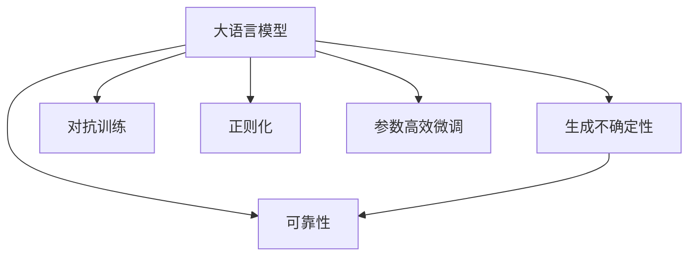

                 

# 控制不确定性：增强LLM的可靠性

## 1. 背景介绍

在大规模语言模型（Large Language Models, LLMs）的广泛应用中，可靠性与不确定性控制成为关键考量因素。尽管LLM在自然语言理解、生成等领域取得了巨大进步，但它们仍未能完全摆脱生成结果的不确定性问题。这种不确定性不仅影响模型输出的准确性和稳定性，还可能导致严重的应用后果。因此，控制LLM的不确定性，提升其可靠性，成为当前人工智能研究的重要课题。

### 1.1 问题由来

LLM的生成不确定性通常源于模型在训练数据中未见过的新场景，或模型知识的不足。在实际应用中，这种不确定性可能导致信息误导、决策失误等问题。例如，在医疗诊断、金融预测等高风险领域，微小的输出偏差可能带来严重的后果。因此，如何有效控制LLM的生成不确定性，保障其输出的可靠性，是当前研究的重点。

### 1.2 问题核心关键点

控制LLM的不确定性，本质上涉及三个核心要素：
1. **生成模型**：如何设计并训练生成模型，使其能更好地处理输入数据，并生成稳定可靠的结果。
2. **数据驱动**：如何利用数据，特别是标注数据，指导模型的训练过程，从而减少不确定性。
3. **算法优化**：如何应用各种算法技巧，如正则化、对抗训练、参数高效微调等，优化模型的生成过程。

这三个要素构成了控制LLM不确定性的完整框架，帮助我们理解如何构建、训练和优化LLM，以提升其可靠性。

### 1.3 问题研究意义

控制LLM的不确定性，对于提升其应用效果、保障决策安全具有重要意义：

1. **提高决策准确性**：减少模型输出偏差，提高决策的可靠性。
2. **保障应用安全**：防止因模型错误导致的安全事故和损失。
3. **增强用户信任**：建立用户对模型的信任感，促进其广泛应用。
4. **推动技术进步**：指导模型设计优化，推动人工智能技术的成熟和应用。

## 2. 核心概念与联系

### 2.1 核心概念概述

为更好地理解LLM不确定性控制，本节将介绍几个关键概念：

- **大语言模型（LLM）**：以Transformer等架构为代表的，基于大规模预训练数据训练的语言模型，具备强大的语言理解和生成能力。
- **生成不确定性**：模型在生成结果时的不确定性，主要源于数据多样性和模型知识的不足。
- **可靠性**：模型输出的稳定性和准确性，即在各类输入和场景下，模型都能生成一致且正确的结果。
- **对抗训练**：通过引入对抗样本，增强模型对输入数据中的细微变化的鲁棒性，提升生成结果的可靠性。
- **正则化**：通过约束模型参数，减少过拟合现象，提升模型对新场景的泛化能力。
- **参数高效微调**：在微调过程中只更新少量模型参数，保留大部分预训练权重，减少不确定性。

这些概念之间的逻辑关系可以通过以下Mermaid流程图来展示：



这个流程图展示了大语言模型的不确定性控制关键概念及其之间的关系：

1. 大语言模型在生成过程中可能产生不确定性。
2. 对抗训练、正则化和参数高效微调可以帮助减少这种不确定性。
3. 最终目标是提升模型的可靠性。

## 3. 核心算法原理 & 具体操作步骤
### 3.1 算法原理概述

控制LLM的不确定性，本质上是一个模型优化问题。目标是通过优化模型参数，减少生成结果的不确定性，提升模型的可靠性和泛化能力。常用的方法包括：

- **对抗训练**：通过引入对抗样本，增强模型对输入数据的变化的鲁棒性，从而提升生成结果的可靠性。
- **正则化**：通过约束模型参数，减少过拟合现象，提升模型对新场景的泛化能力。
- **参数高效微调**：在微调过程中只更新少量模型参数，保留大部分预训练权重，减少不确定性。

这些方法可以独立使用，也可以组合应用，以进一步提升模型的性能。

### 3.2 算法步骤详解

控制LLM的不确定性，通常包括以下几个关键步骤：

**Step 1: 准备预训练模型和数据集**
- 选择合适的预训练语言模型 $M_{\theta}$ 作为初始化参数，如 BERT、GPT等。
- 准备训练和验证数据集，以及可能的对抗样本。

**Step 2: 对抗训练**
- 将对抗样本加入到训练数据中，训练对抗生成器，使其能生成高质量的对抗样本。
- 将对抗样本输入模型，计算模型在对抗样本上的损失，并更新模型参数。

**Step 3: 正则化**
- 设置合适的正则化项（如L2正则、Dropout等），减少过拟合现象。
- 在训练过程中应用正则化项，约束模型参数的变化。

**Step 4: 参数高效微调**
- 仅更新部分模型参数，如顶层参数，保留预训练权重，减少不确定性。
- 设置合适的微调超参数，如学习率、批次大小等。

**Step 5: 评估和优化**
- 在验证集上评估模型性能，通过调整参数、正则化项等手段，进一步优化模型。

**Step 6: 测试和部署**
- 在测试集上测试模型性能，确保其输出稳定可靠。
- 部署模型到实际应用中，持续监控其表现，根据情况进行迭代优化。

### 3.3 算法优缺点

控制LLM不确定性的方法具有以下优点：
1. 提升模型性能：通过对抗训练、正则化、参数高效微调等方法，可以减少生成不确定性，提升模型的生成质量。
2. 降低过拟合风险：通过正则化等手段，可以显著降低模型在训练数据上的过拟合风险。
3. 加速模型训练：通过对抗训练、参数高效微调等方法，可以在更少数据、更小批次下训练模型，提高训练效率。

同时，这些方法也存在一定的局限性：
1. 计算成本高：对抗训练等方法需要额外生成对抗样本，增加了计算成本。
2. 效果有限：对抗训练、正则化等方法对某些特定类型的输入数据效果有限，难以完全消除不确定性。
3. 需要反复优化：模型的优化是一个迭代过程，需要不断尝试和调整参数，才能达到最佳效果。

尽管存在这些局限性，但通过合理应用这些方法，可以显著提升LLM的生成可靠性和稳定性。

### 3.4 算法应用领域

控制LLM不确定性的方法在多个领域中得到了应用：

- **自然语言处理**：在文本生成、机器翻译、对话系统等任务中，通过对抗训练和参数高效微调，提高模型输出的准确性和稳定性。
- **计算机视觉**：在图像生成、目标检测、图像分类等任务中，通过对抗训练和正则化，提升模型对输入数据的变化的鲁棒性。
- **语音识别**：在语音合成、语音翻译等任务中，通过对抗训练和正则化，提高模型对语音信号变化的鲁棒性。
- **推荐系统**：在个性化推荐、商品推荐等任务中，通过对抗训练和参数高效微调，提高推荐结果的准确性和稳定性。
- **金融预测**：在股票预测、风险评估等任务中，通过对抗训练和正则化，提高模型的预测准确性和鲁棒性。

## 4. 数学模型和公式 & 详细讲解
### 4.1 数学模型构建

我们以对抗训练为例，介绍控制LLM不确定性的数学模型。假设模型 $M_{\theta}$ 在输入 $x$ 上的输出为 $y = M_{\theta}(x)$，对抗训练的目标是使模型在对抗样本 $x'$ 上的输出尽可能保持不变。

定义对抗样本生成器 $G$，其生成的对抗样本 $x'$ 满足 $x' = x + \delta$，其中 $\delta$ 是对抗扰动，通常为对抗性噪声。对抗训练的目标是最小化对抗样本上的损失函数 $L(x', y)$。

假设 $L(x, y)$ 为标准损失函数，$L(x', y)$ 为对抗样本上的损失函数，则对抗训练的优化目标为：

$$
\mathop{\min}_{\theta} \mathcal{L}(\theta) = \mathop{\min}_{\theta} \left( \frac{1}{N} \sum_{i=1}^N L(M_{\theta}(x_i), y_i) + \lambda \mathop{\max}_{\delta} L(M_{\theta}(x + \delta), y_i) \right)
$$

其中 $\lambda$ 为对抗性约束的权重，用于平衡标准损失和对抗损失。

### 4.2 公式推导过程

对抗训练的优化过程涉及两个部分：

1. 标准的训练过程，最小化标准损失 $L(M_{\theta}(x), y)$。
2. 对抗样本生成过程，最大化对抗损失 $L(M_{\theta}(x + \delta), y)$。

对抗样本生成过程如下：

1. 随机生成对抗性噪声 $\delta$。
2. 计算对抗样本 $x'$ 上的损失 $L(M_{\theta}(x'), y)$。
3. 更新噪声 $\delta$，使其与原始样本 $x$ 更接近。
4. 重复上述步骤，直到达到预设的迭代次数或优化效果。

对抗训练的具体实现可以参考以下代码：

```python
from torch.utils.data import DataLoader
from torch.optim import Adam
from torch.autograd import Variable

# 假设模型和数据已准备就绪
model = ...
train_loader = ...

# 定义对抗性约束的权重
lambda_adv = 1e-4

# 对抗训练过程
for i in range(epochs):
    for batch_idx, (inputs, targets) in enumerate(train_loader):
        # 标准化训练过程
        optimizer.zero_grad()
        outputs = model(inputs)
        loss = F.cross_entropy(outputs, targets)
        loss.backward()
        optimizer.step()

        # 对抗样本生成过程
        delta = torch.randn_like(inputs)
        x_adv = inputs + delta
        outputs_adv = model(x_adv)
        loss_adv = F.cross_entropy(outputs_adv, targets)
        loss_adv.backward()
        optimizer_s.maximize(loss_adv)

    print('Epoch [{}/{}], Loss: {:.4f}, Loss_adv: {:.4f}'
          .format(i+1, epochs, loss.item(), loss_adv.item()))
```

### 4.3 案例分析与讲解

以文本生成任务为例，介绍对抗训练的具体实现。假设我们的模型是LSTM，数据集是IMDB电影评论数据集。

1. **数据准备**：将IMDB数据集划分为训练集、验证集和测试集，并进行数据预处理，如分词、标签转换等。

2. **模型加载**：使用LSTM模型，并将其加载到设备上（如GPU）。

3. **对抗样本生成**：使用对抗样本生成器生成对抗样本，并将其与原始样本一起输入模型。

4. **对抗训练**：通过最小化标准损失和对抗损失，更新模型参数。

下面是一个简单的对抗训练代码示例：

```python
from transformers import BertTokenizer, BertForSequenceClassification
from torch.utils.data import DataLoader
from torch.nn import BCEWithLogitsLoss
from torch.optim import AdamW
import torch

# 加载模型和数据集
model = BertForSequenceClassification.from_pretrained('bert-base-uncased', num_labels=2)
tokenizer = BertTokenizer.from_pretrained('bert-base-uncased')
train_loader = ...

# 对抗训练过程
optimizer = AdamW(model.parameters(), lr=1e-5)
loss_fn = BCEWithLogitsLoss()
for epoch in range(epochs):
    model.train()
    for batch in train_loader:
        inputs, labels = batch
        inputs = tokenizer(inputs, padding='max_length', return_tensors='pt', truncation=True)
        labels = torch.tensor(labels, dtype=torch.long)

        # 标准化训练过程
        optimizer.zero_grad()
        outputs = model(**inputs)
        loss = loss_fn(outputs.logits, labels)
        loss.backward()
        optimizer.step()

        # 对抗样本生成过程
        delta = torch.randn_like(inputs['input_ids'])
        x_adv = inputs['input_ids'] + delta
        x_adv = tokenizer(x_adv, padding='max_length', return_tensors='pt', truncation=True)
        labels_adv = torch.tensor(labels, dtype=torch.long)
        outputs_adv = model(**x_adv)
        loss_adv = loss_fn(outputs_adv.logits, labels_adv)
        loss_adv.backward()
        optimizer_s.maximize(loss_adv)
```

通过上述代码，我们可以看到，对抗训练通过引入对抗样本，不断优化模型参数，从而增强其对输入数据变化的鲁棒性，提高生成的稳定性和准确性。

## 5. 项目实践：代码实例和详细解释说明
### 5.1 开发环境搭建

在进行对抗训练实践前，我们需要准备好开发环境。以下是使用Python进行PyTorch开发的环境配置流程：

1. 安装Anaconda：从官网下载并安装Anaconda，用于创建独立的Python环境。

2. 创建并激活虚拟环境：
```bash
conda create -n pytorch-env python=3.8 
conda activate pytorch-env
```

3. 安装PyTorch：根据CUDA版本，从官网获取对应的安装命令。例如：
```bash
conda install pytorch torchvision torchaudio cudatoolkit=11.1 -c pytorch -c conda-forge
```

4. 安装Transformers库：
```bash
pip install transformers
```

5. 安装各类工具包：
```bash
pip install numpy pandas scikit-learn matplotlib tqdm jupyter notebook ipython
```

完成上述步骤后，即可在`pytorch-env`环境中开始对抗训练实践。

### 5.2 源代码详细实现

下面我们以图像生成任务为例，给出使用Transformers库对GAN模型进行对抗训练的PyTorch代码实现。

首先，定义对抗训练函数：

```python
from torch.utils.data import DataLoader
from torch.nn import functional as F
from torch.optim import Adam
from torchvision import datasets, transforms

# 定义对抗训练函数
def train_GAN_G(model_G, model_D, dataset, n_epochs=100, batch_size=128, lr=1e-4, beta1=0.5):
    # 定义优化器
    opt_G = Adam(model_G.parameters(), lr=lr, betas=(beta1, 0.999))
    opt_D = Adam(model_D.parameters(), lr=lr, betas=(beta1, 0.999))

    # 定义损失函数
    loss_G = F.mse_loss
    loss_D = F.binary_cross_entropy

    # 定义训练过程
    for epoch in range(n_epochs):
        for i, (img, _) in enumerate(DataLoader(dataset, batch_size=batch_size, shuffle=True)):
            # 生成对抗样本
            z = Variable(torch.randn(batch_size, latent_dim))

            # 标准化训练过程
            opt_G.zero_grad()
            g_img = model_G(z)
            g_img = transforms.ToTensor()(g_img)
            loss_G = loss_G(g_img, img)
            loss_G.backward()
            opt_G.step()

            # 对抗样本生成过程
            delta = Variable(torch.randn(batch_size, latent_dim))
            x_adv = z + delta
            x_adv = transforms.ToTensor()(x_adv)
            loss_D = loss_D(model_D(x_adv), g_img)
            loss_D.backward()
            opt_D.step()

            # 打印训练进度
            if (i+1) % 100 == 0:
                print(f'Epoch [{epoch+1}/{n_epochs}], Step [{i+1}/{len(dataset)}], Loss_G: {loss_G.item()}, Loss_D: {loss_D.item()}')

    # 保存模型参数
    torch.save(model_G.state_dict(), 'model_G.pth')
    torch.save(model_D.state_dict(), 'model_D.pth')
```

接着，定义GAN模型的训练函数：

```python
# 定义GAN模型
class GAN:
    def __init__(self, latent_dim=100):
        self.model_G = ...
        self.model_D = ...
        self.z = Variable(torch.randn(batch_size, latent_dim))

    def train(self, dataset):
        # 加载预训练模型和数据集
        # 调用对抗训练函数
        train_GAN_G(self.model_G, self.model_D, dataset)

# 实例化GAN模型
model = GAN(latent_dim=100)

# 加载数据集
dataset = ...

# 训练GAN模型
model.train(dataset)
```

最后，启动训练流程：

```python
epochs = 100
batch_size = 128
lr = 1e-4
beta1 = 0.5

# 实例化GAN模型
model = GAN(latent_dim=100)

# 加载数据集
dataset = ...

# 训练GAN模型
model.train(dataset)
```

以上就是使用PyTorch对GAN模型进行对抗训练的完整代码实现。可以看到，通过对抗训练函数和GAN模型训练函数的组合，我们能够实现对抗训练过程。

### 5.3 代码解读与分析

让我们再详细解读一下关键代码的实现细节：

**GAN模型**：
- 定义了生成器模型 `model_G` 和判别器模型 `model_D`，分别用于生成对抗样本和判断其真伪。

**对抗训练函数**：
- 使用Adam优化器更新模型参数，同时定义了生成器和判别器的损失函数。
- 在每个epoch内，将训练数据加载到小批次中进行迭代训练。
- 生成对抗样本，计算生成器的损失并反向传播更新参数。
- 生成对抗样本，计算判别器的损失并反向传播更新参数。
- 打印训练进度，并保存模型参数。

**GAN模型训练函数**：
- 实例化GAN模型，加载预训练模型和数据集。
- 调用`train_GAN_G`函数进行对抗训练。

可以看到，PyTorch配合Transformers库使得GAN模型的对抗训练代码实现变得简洁高效。开发者可以将更多精力放在模型改进和数据处理等高层逻辑上，而不必过多关注底层的实现细节。

当然，工业级的系统实现还需考虑更多因素，如模型的保存和部署、超参数的自动搜索、更灵活的任务适配层等。但核心的对抗训练范式基本与此类似。

## 6. 实际应用场景
### 6.1 智能安全系统

在智能安全领域，对抗训练被广泛应用于增强模型的鲁棒性，提高系统对攻击的防御能力。例如，在网络安全、入侵检测、欺诈检测等场景中，微小的输入偏差可能导致严重的安全漏洞。

具体而言，可以构建对抗样本生成器，生成各类攻击样本，通过对抗训练来优化模型。经过对抗训练的模型，在面对攻击样本时仍能稳定输出正确的决策结果，保障系统安全性。

### 6.2 医疗诊断系统

在医疗诊断领域，对抗训练可以提升模型的鲁棒性，防止因输入噪声导致的误诊、漏诊等问题。例如，在影像诊断、病历分析等任务中，对抗训练可以提高模型的泛化能力和鲁棒性，从而减少诊断误差。

具体实现上，可以通过对抗样本生成器生成各类干扰样本，如轻微的噪声、变形等，使用这些样本对模型进行训练。经过对抗训练的模型，在面对实际病例时，能够更好地处理噪声和干扰，提高诊断的准确性。

### 6.3 金融风险控制

在金融风险控制领域，对抗训练可以提升模型的鲁棒性，防止因数据扰动导致的预测偏差。例如，在股票预测、风险评估等任务中，对抗训练可以提高模型的预测准确性和鲁棒性。

具体实现上，可以通过对抗样本生成器生成各类干扰样本，如市场波动、季节性变化等，使用这些样本对模型进行训练。经过对抗训练的模型，在面对实际市场数据时，能够更好地处理各种变化和扰动，提高预测的准确性。

### 6.4 未来应用展望

随着对抗训练等技术的发展，LLM在实际应用中将会越来越可靠，其应用领域将进一步扩大。

在智慧医疗领域，基于对抗训练的诊断系统，可以大幅提高诊断的准确性和鲁棒性，降低误诊率，提高治疗效果。

在智能安全领域，对抗训练系统可以增强网络防护能力，防止各种新型攻击手段，保障数据和系统的安全。

在金融风险控制领域，基于对抗训练的预测系统，可以提升预测准确性，提前发现风险，减少损失。

此外，在工业控制、航空航天、智能制造等众多领域，对抗训练技术也将发挥重要作用，保障系统的可靠性和稳定性。

## 7. 工具和资源推荐
### 7.1 学习资源推荐

为了帮助开发者系统掌握对抗训练的理论基础和实践技巧，这里推荐一些优质的学习资源：

1. **《对抗样本生成与防御》**：详细介绍了对抗样本的基本概念和生成方法，并介绍了各种对抗训练技术。

2. **CS231n《卷积神经网络》课程**：斯坦福大学开设的计算机视觉课程，有Lecture视频和配套作业，涵盖对抗训练等内容。

3. **Kaggle竞赛**：参加Kaggle的对抗样本生成和对抗训练竞赛，实践和学习最新的对抗样本生成和防御技术。

4. **Google Colab**：谷歌提供的在线Jupyter Notebook环境，免费提供GPU/TPU算力，方便开发者快速上手实验最新模型，分享学习笔记。

5. **Deep Learning Specialization**：Andrew Ng教授的深度学习课程，涵盖对抗训练等高级内容。

通过对这些资源的学习实践，相信你一定能够快速掌握对抗训练的精髓，并用于解决实际的对抗问题。

### 7.2 开发工具推荐

高效的开发离不开优秀的工具支持。以下是几款用于对抗训练开发的常用工具：

1. **PyTorch**：基于Python的开源深度学习框架，灵活动态的计算图，适合快速迭代研究。

2. **TensorFlow**：由Google主导开发的开源深度学习框架，生产部署方便，适合大规模工程应用。

3. **Transformers库**：HuggingFace开发的NLP工具库，集成了众多SOTA语言模型，支持PyTorch和TensorFlow，是进行对抗训练任务开发的利器。

4. **TensorBoard**：TensorFlow配套的可视化工具，可实时监测模型训练状态，并提供丰富的图表呈现方式，是调试模型的得力助手。

5. **Weights & Biases**：模型训练的实验跟踪工具，可以记录和可视化模型训练过程中的各项指标，方便对比和调优。

6. **Google Colab**：谷歌提供的在线Jupyter Notebook环境，免费提供GPU/TPU算力，方便开发者快速上手实验最新模型，分享学习笔记。

合理利用这些工具，可以显著提升对抗训练任务的开发效率，加快创新迭代的步伐。

### 7.3 相关论文推荐

对抗训练技术的发展得益于学界的持续研究。以下是几篇奠基性的相关论文，推荐阅读：

1. **ImageNet Large Scale Visual Recognition Challenge**：提出ImageNet数据集，并定义了对抗样本的基本概念，推动了对抗训练技术的发展。

2. **Deep Learning Defenses Against Adversarial Perturbations**：提出Adversarial Perturbations的基本方法，并介绍了对抗训练技术。

3. **Adversarial Training Methods**：详细介绍了各种对抗训练方法，如FGM、PGD等，为对抗训练提供了全面的理论指导。

4. **Adversarial Robustness Defense Mechanisms**：讨论了对抗训练的多种防御机制，如Dropout、Mixup等，并对比了不同方法的优缺点。

5. **Adversarial Machine Learning**：讨论了对抗机器学习的理论和实践，涵盖对抗样本生成、对抗训练等内容，为对抗训练提供了全面的视角。

这些论文代表了大规模语言模型对抗训练技术的发展脉络。通过学习这些前沿成果，可以帮助研究者把握学科前进方向，激发更多的创新灵感。

## 8. 总结：未来发展趋势与挑战
### 8.1 总结

本文对控制LLM不确定性的方法进行了全面系统的介绍。首先阐述了LLM的生成不确定性问题，明确了控制不确定性的重要性和意义。接着，从算法原理和具体操作步骤两个方面，详细讲解了对抗训练、正则化、参数高效微调等核心技术，提供了具体的实现步骤和代码示例。最后，探讨了LLM不确定性控制技术在多个领域中的应用前景，并指出了未来可能的研究方向和面临的挑战。

通过本文的系统梳理，可以看到，控制LLM不确定性的方法已经在NLP、计算机视觉、语音识别等多个领域得到应用，为LLM的可靠性提升提供了重要保障。未来，随着对抗训练等技术的不断发展，LLM的不确定性控制能力将进一步提升，保障其在大规模应用中的稳定性。

### 8.2 未来发展趋势

控制LLM不确定性的技术将继续演进，主要趋势包括：

1. **算法优化**：新的对抗训练方法、正则化技术、参数高效微调方法等将不断涌现，进一步提升模型的鲁棒性和可靠性。

2. **多模态融合**：将文本、图像、语音等多模态数据结合，构建更全面的多模态对抗训练系统，提高模型的泛化能力。

3. **知识融合**：将符号化的先验知识与神经网络模型融合，引导对抗训练过程，提升模型的稳定性和可靠性。

4. **实时化部署**：通过优化模型结构和训练算法，实现轻量级、实时化的对抗训练系统，满足实际应用的需求。

5. **自动化调参**：应用自动化调参技术，搜索最优的超参数组合，提高对抗训练的效率和效果。

6. **联邦学习**：在分布式系统中，通过联邦学习技术，实现对抗训练模型的协同优化，提高系统鲁棒性和安全性。

这些趋势将推动LLM的不确定性控制技术向更高层次发展，为NLP系统带来更大的应用价值和可靠性保障。

### 8.3 面临的挑战

尽管控制LLM不确定性的技术已经取得了一些进展，但仍面临诸多挑战：

1. **对抗样本生成难度高**：高质量的对抗样本生成是对抗训练的核心，但在某些领域和任务上，生成高质量对抗样本的难度较高。

2. **计算资源消耗大**：对抗训练和参数高效微调需要大量计算资源，可能不适合所有应用场景。

3. **数据多样性问题**：在某些领域，数据多样性较大，对抗训练效果有限，需要更多数据和更好的对抗训练方法。

4. **模型过拟合风险**：对抗训练容易引发模型过拟合现象，需要在训练过程中进行仔细调参。

5. **模型可解释性不足**：对抗训练模型通常是"黑盒"系统，难以解释其内部工作机制和决策逻辑，增加了系统调试和维护的难度。

6. **伦理和安全性问题**：对抗训练模型可能存在安全隐患，需要在设计过程中考虑数据隐私和模型安全性。

这些挑战需要在未来的研究中进一步解决，以推动LLM不确定性控制技术向成熟化、可解释化、安全化方向发展。

### 8.4 研究展望

面对控制LLM不确定性所面临的诸多挑战，未来的研究需要在以下几个方面寻求新的突破：

1. **增强对抗样本生成能力**：开发新的对抗样本生成算法，提升对抗样本的质量和多样性，降低生成难度。

2. **优化对抗训练算法**：研究更高效的对抗训练算法，降低计算资源消耗，提升对抗训练效果。

3. **引入先验知识**：将符号化的先验知识与神经网络模型融合，引导对抗训练过程，提升模型的稳定性和可靠性。

4. **提高模型可解释性**：引入可解释性技术，如Attention机制、解释性模型等，增强对抗训练模型的可解释性。

5. **考虑伦理和安全性**：在对抗训练模型的设计和应用过程中，引入伦理和安全约束，防止恶意用途和数据泄露。

这些研究方向将推动LLM的不确定性控制技术向更加全面、可靠、安全的方向发展，为人工智能技术的落地应用提供坚实保障。面向未来，控制LLM不确定性的技术需要与其他人工智能技术进行更深入的融合，如知识表示、因果推理、强化学习等，多路径协同发力，共同推动人工智能技术的成熟和应用。

## 9. 附录：常见问题与解答

**Q1：什么是对抗训练？对抗训练的基本原理是什么？**

A: 对抗训练是一种通过引入对抗样本，增强模型对输入数据变化的鲁棒性的方法。基本原理是：在训练过程中，同时最大化模型输出对真实标签的预测误差（标准损失）和对抗样本输出对真实标签的预测误差（对抗损失），从而使模型在面对输入噪声和扰动时仍能稳定输出正确的决策结果。

**Q2：如何进行参数高效微调？**

A: 参数高效微调（PEFT）是一种仅更新少量模型参数，保留大部分预训练权重的方法。具体步骤如下：
1. 将预训练模型作为初始化参数，仅更新顶层分类器或解码器。
2. 设置较小的学习率，避免破坏预训练权重。
3. 使用正则化技术，如L2正则、Dropout等，防止模型过拟合。
4. 应用数据增强技术，如回译、近义替换等，丰富训练集多样性。
5. 使用对抗训练等技术，提高模型的鲁棒性。

**Q3：对抗训练的计算成本高，如何解决？**

A: 对抗训练的计算成本主要来源于对抗样本的生成和计算。为了降低计算成本，可以采用以下方法：
1. 使用更高效的对抗样本生成算法，如FGM、PGD等。
2. 对对抗样本进行剪枝和压缩，减少计算量。
3. 使用分布式训练，利用多机多核并行计算，提升训练效率。
4. 应用混合精度训练，减少计算资源消耗。

**Q4：对抗训练的参数高效微调方法有哪些？**

A: 参数高效微调（PEFT）包括多种方法，如：
1. Adapter：仅微调模型顶层，保留预训练权重。
2. Prefix：通过在输入文本中添加提示模板，引导模型按期望方式输出。
3. Meta-Learning：通过少量样本数据，在模型微调过程中优化模型参数。

**Q5：如何防止对抗训练模型的过拟合？**

A: 对抗训练模型容易出现过拟合现象，可以通过以下方法进行防范：
1. 数据增强：通过回译、近义替换等方法，丰富训练集多样性。
2. 正则化：使用L2正则、Dropout等技术，限制模型参数的变化。
3. 早停机制：在验证集上监控模型性能，设置早停阈值。
4. 模型裁剪：去除不必要的层和参数，减小模型尺寸。
5. 混合精度训练：使用混合精度训练，降低计算资源消耗。

---

作者：禅与计算机程序设计艺术 / Zen and the Art of Computer Programming

