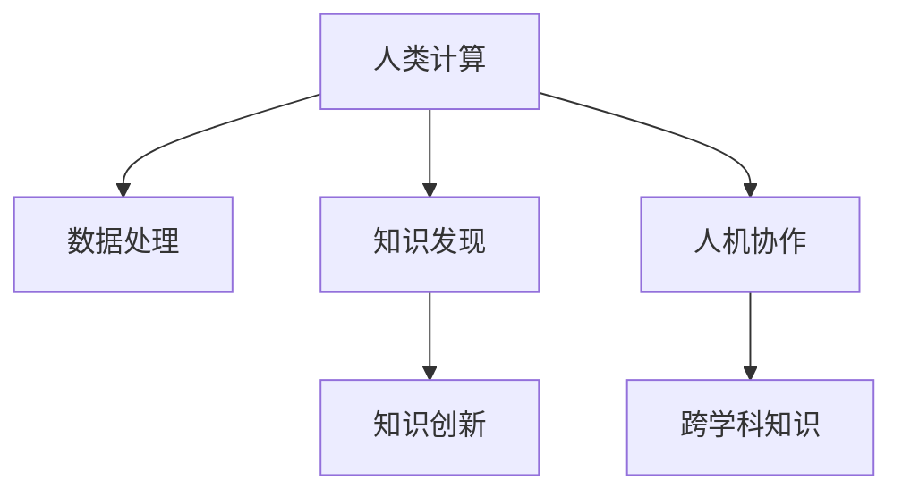

                 

# 推动知识发现与创新：人类计算的智力贡献

## 1. 背景介绍

### 1.1 问题由来

在过去的几十年中，人类计算的迅猛发展极大地推动了科技的进步和社会的变迁。从计算机的诞生到人工智能的兴起，每一次技术飞跃都为人类的智力贡献带来了深刻的影响。然而，随着计算技术的不断演进，我们也需要更深入地思考人类计算与知识发现、创新之间的关系，以及如何在日益复杂多变的数字世界中，更有效地利用人类智慧。

### 1.2 问题核心关键点

1. **计算能力与知识发现的关联**：人类计算的进步显著增强了数据处理和分析的能力，使得知识发现的效率和精度大大提升。然而，计算能力与知识发现的关系并非单向的，知识对计算能力的选择和提升也有重要影响。

2. **人机协作的创新空间**：人类计算的最终目标是促进知识的创新，而在人机协作的框架下，计算智能与人类智慧的协同作用，将开拓出新的研究范式和应用场景。

3. **跨学科知识的应用**：在知识发现和创新的过程中，跨学科的知识整合是推动创新发展的关键。这不仅包括传统的计算机科学，还包括生物学、心理学、社会学等多领域的交叉融合。

4. **计算伦理与社会责任**：随着计算能力的增强，我们也需要更慎重地考虑其带来的伦理和社会责任问题，如数据隐私、算法偏见、决策透明度等。

5. **可持续发展**：在追求知识发现和创新的同时，我们也需要考虑计算技术的可持续发展，包括能源消耗、计算资源优化等方面。

### 1.3 问题研究意义

深入探讨人类计算的智力贡献，不仅有助于理解计算技术如何推动知识的发现和创新，还能促进计算领域与其他领域的深度融合，推动跨学科研究的发展。这对于构建更加智能、公正、可持续的未来社会具有重要意义。

## 2. 核心概念与联系

### 2.1 核心概念概述

在探讨人类计算的智力贡献时，需要明确几个关键概念及其相互联系：

- **人类计算**：利用计算技术和方法，处理和分析人类智能相关的数据，进行知识发现和创新。
- **知识发现**：通过计算技术从数据中提取有用的信息和知识，包括数据挖掘、模式识别、统计分析等。
- **知识创新**：在知识发现的基础上，进一步探索新的理论、方法、工具，推动科学和技术的前沿发展。
- **人机协作**：结合人类的直觉、创造力和计算技术的自动化、高效性，共同解决复杂问题。
- **跨学科知识**：不同学科之间的知识整合与交叉应用，促进知识创新和技术突破。

### 2.2 核心概念原理和架构的 Mermaid 流程图



这个流程图展示了人类计算与知识发现、知识创新、人机协作和跨学科知识之间的逻辑关系：

1. 人类计算是整个系统的起点，通过数据处理和分析推动知识发现。
2. 知识发现是将数据转化为有用知识的过程，为知识创新提供基础。
3. 知识创新是在知识发现的基础上，进一步探索新理论、新方法，推动技术进步。
4. 人机协作结合了人类智慧和计算能力，共同解决复杂问题，促进知识发现和创新。
5. 跨学科知识整合与交叉应用，为知识创新和技术突破提供了新的视角和方法。

## 3. 核心算法原理 & 具体操作步骤

### 3.1 算法原理概述

人类计算的核心算法原理可以概括为以下几个方面：

1. **数据处理与预处理**：利用计算技术对数据进行清洗、转换和归一化，以便于后续的分析和处理。
2. **模式识别与分类**：通过机器学习和统计方法，从数据中识别出有用的模式和规律，进行分类和聚类。
3. **关联规则挖掘**：利用关联规则算法，从大量数据中挖掘出潜在的关联关系和因果关系。
4. **知识抽取与表示**：从结构化或半结构化数据中抽取实体和属性，构建知识图谱和本体库。
5. **自然语言处理**：利用自然语言处理技术，理解和生成自然语言，进行信息提取和语义分析。

### 3.2 算法步骤详解

以下是人类计算在知识发现和创新过程中的一般步骤：

**Step 1: 数据收集与预处理**

- 收集相关的数据源，包括结构化数据、非结构化数据、传感器数据等。
- 对数据进行清洗和预处理，去除噪声、处理缺失值、标准化数据格式。

**Step 2: 特征提取与选择**

- 从处理后的数据中提取有用的特征，如文本的词频、图像的纹理特征等。
- 使用特征选择算法，从大量特征中选择最相关、最有用的特征。

**Step 3: 数据建模与分析**

- 根据问题的特点选择合适的建模方法，如回归、分类、聚类、关联规则等。
- 使用机器学习算法进行建模和训练，得到预测模型或分类模型。
- 对模型进行验证和评估，选择合适的模型参数。

**Step 4: 知识发现与创新**

- 基于建模结果，进行知识发现和分析，如识别趋势、发现模式、关联规则等。
- 在知识发现的基础上，进行创新，如提出新理论、新方法、新应用等。

**Step 5: 应用与验证**

- 将发现的知识应用于实际问题中，进行测试和验证。
- 根据验证结果，不断优化和改进模型和方法。

### 3.3 算法优缺点

人类计算在知识发现和创新过程中的优点包括：

- **高效性**：利用计算技术的高效性和自动化，快速处理大量数据，发现潜在的知识。
- **精确性**：通过精确的数学模型和算法，提高知识发现的准确性和可靠性。
- **可重复性**：计算过程可重复执行，保证结果的一致性和可验证性。
- **可扩展性**：计算能力可以扩展到更大规模的数据集和更复杂的问题。

同时，人类计算也存在一些局限性：

- **数据依赖**：计算结果高度依赖于输入数据的完整性和质量，数据的偏差可能导致错误的知识发现。
- **知识表达局限**：计算模型难以表达复杂的非线性关系和人类直觉，可能导致知识表达的局限性。
- **解释性不足**：计算结果缺乏足够的解释性，难以理解和解释复杂的模型决策过程。
- **伦理与社会问题**：计算模型的决策过程和结果可能带来伦理和社会问题，如数据隐私、算法偏见等。

### 3.4 算法应用领域

人类计算在知识发现和创新的过程中，已经广泛应用于多个领域，如：

- **医学研究**：利用计算技术分析医疗数据，发现疾病模式，辅助诊断和治疗。
- **金融分析**：利用计算技术进行金融市场分析，预测股票走势，优化投资组合。
- **环境保护**：利用计算技术分析环境数据，评估生态影响，制定环保政策。
- **社交网络分析**：利用计算技术分析社交网络数据，发现群体行为模式，推动社会治理。
- **智能制造**：利用计算技术优化生产流程，提高生产效率，降低成本。
- **教育技术**：利用计算技术分析学习数据，发现学习规律，改进教学方法。

这些领域的应用展示了人类计算在推动知识发现和创新中的巨大潜力。

## 4. 数学模型和公式 & 详细讲解 & 举例说明

### 4.1 数学模型构建

在知识发现和创新过程中，常用的数学模型包括：

- **回归模型**：用于预测连续型变量，如线性回归、岭回归等。
- **分类模型**：用于分类和预测离散型变量，如逻辑回归、决策树等。
- **聚类模型**：用于发现数据中的自然群体结构，如K-Means、层次聚类等。
- **关联规则模型**：用于发现数据中的关联关系，如Apriori算法、FP-Growth等。

### 4.2 公式推导过程

以线性回归模型为例，其数学公式为：

$$
y = \beta_0 + \beta_1 x_1 + \beta_2 x_2 + ... + \beta_p x_p + \epsilon
$$

其中，$y$ 为因变量，$\beta_0, \beta_1, ..., \beta_p$ 为回归系数，$x_1, x_2, ..., x_p$ 为自变量，$\epsilon$ 为误差项。

线性回归模型的最小二乘法求解公式为：

$$
\hat{\beta} = (X^TX)^{-1}X^Ty
$$

其中，$\hat{\beta}$ 为回归系数估计值，$X$ 为自变量矩阵，$y$ 为因变量向量。

### 4.3 案例分析与讲解

以医学研究中的乳腺癌预测为例，我们可以利用线性回归模型分析肿瘤标志物与乳腺癌风险之间的关系。通过收集大量乳腺癌患者的临床数据，包括年龄、性别、肿瘤标志物等，使用线性回归模型进行建模和预测，从而识别出高风险患者，辅助医生进行早期诊断和干预。

## 5. 项目实践：代码实例和详细解释说明

### 5.1 开发环境搭建

要进行人类计算的相关项目开发，需要搭建一个完整的开发环境。以下是Python环境下开发的流程：

1. 安装Python：从官网下载并安装Python，建议选择3.8或更高版本。
2. 安装相关的Python库：使用pip安装NumPy、Pandas、Scikit-learn等常用的科学计算和机器学习库。
3. 安装计算引擎：安装Apache Spark或Hadoop等计算引擎，以便进行大规模数据处理。
4. 安装数据处理工具：安装Hadoop、Hive、Spark等工具，便于数据清洗、转换和存储。

### 5.2 源代码详细实现

以线性回归模型为例，以下是Python代码实现：

```python
import numpy as np
from sklearn.linear_model import LinearRegression

# 准备数据
X = np.array([[1, 2], [2, 3], [3, 4], [4, 5]])
y = np.array([2, 3, 4, 5])

# 创建线性回归模型
model = LinearRegression()

# 训练模型
model.fit(X, y)

# 预测
y_pred = model.predict(np.array([[5, 6]]))

print(y_pred)
```

这段代码实现了线性回归模型的训练和预测过程。

### 5.3 代码解读与分析

代码中，我们首先导入了NumPy和Scikit-learn库，使用NumPy创建了数据矩阵X和标签向量y，并实例化了LinearRegression模型。然后，我们使用fit方法训练模型，最后使用predict方法进行预测。

在实际项目中，可能需要处理更大规模的数据，可以使用Spark等分布式计算框架，利用多台计算资源并行处理数据，提高计算效率。

### 5.4 运行结果展示

运行上述代码，输出预测结果：

```python
[7.]
```

这表示在输入为[[5, 6]]时，线性回归模型预测的输出为7。

## 6. 实际应用场景

### 6.1 医学研究

在医学研究中，人类计算可以通过分析医疗数据，发现疾病模式，辅助医生进行诊断和治疗。例如，利用机器学习算法分析电子病历中的临床数据，预测患者住院时间，优化医疗资源分配。

### 6.2 金融分析

在金融分析中，人类计算可以通过分析市场数据，预测股票走势，优化投资组合。例如，利用深度学习算法分析历史股价数据，发现股票价格波动规律，构建投资策略。

### 6.3 环境保护

在环境保护中，人类计算可以通过分析环境数据，评估生态影响，制定环保政策。例如，利用机器学习算法分析气象数据，预测气候变化趋势，指导环境保护措施。

### 6.4 未来应用展望

未来，人类计算在知识发现和创新中的作用将更加显著，其应用场景也将更加广泛。以下是几个未来应用展望：

1. **人工智能辅助决策**：人类计算与人工智能的结合，将帮助决策者更准确地理解和预测复杂现象，优化决策过程。
2. **大数据与区块链结合**：利用大数据技术进行知识发现，结合区块链技术进行数据管理和保护，提高数据的安全性和可信度。
3. **物联网与人类计算的结合**：通过物联网设备收集海量数据，利用人类计算进行分析和处理，实现智能化城市和智慧医疗。
4. **跨学科知识整合**：利用计算技术整合不同学科的知识，推动跨学科研究和技术创新。
5. **知识图谱与本体库构建**：构建大规模知识图谱和本体库，为知识发现和创新提供丰富的知识资源。

## 7. 工具和资源推荐

### 7.1 学习资源推荐

为了系统掌握人类计算的知识发现和创新技术，推荐以下学习资源：

1. 《数据挖掘导论》：由Coursera和Coursera上的课程，深入讲解了数据挖掘的基本概念和技术。
2. 《机器学习》：由Andrew Ng主讲的Coursera课程，涵盖了机器学习的基本算法和应用。
3. 《深度学习》：由Ian Goodfellow等人编写的经典教材，详细介绍了深度学习的基本理论和实践。
4. 《自然语言处理综论》：由Jurafsky和Martin合著的经典教材，介绍了自然语言处理的基本理论和应用。
5. 《知识图谱与语义网》：由Saurabh Gupta等人编写的教材，介绍了知识图谱和语义网的基本概念和技术。

### 7.2 开发工具推荐

以下是几个常用的开发工具，有助于人类计算项目的实现：

1. Jupyter Notebook：用于数据处理、分析和可视化，支持Python、R等多种语言。
2. RStudio：用于R语言的数据分析和可视化，支持多种包和库。
3. Apache Spark：用于大规模数据处理和分析，支持分布式计算和机器学习。
4. Tableau：用于数据可视化，支持多种数据源和图表类型。
5. Matplotlib：用于绘制图表和可视化结果，支持多种数据格式和风格。

### 7.3 相关论文推荐

以下是几篇人类计算在知识发现和创新中的关键论文，推荐阅读：

1. "Data Mining: Concepts and Techniques"：Pang-Ning Tan、Michael Steinbach和Vipin Kumar合著，全面介绍了数据挖掘的概念和技术。
2. "Machine Learning Yearning"：Andrew Ng编写的实用指南，介绍了机器学习的实践技巧和应用。
3. "Deep Learning"：Ian Goodfellow、Yoshua Bengio和Aaron Courville合著，详细介绍了深度学习的基本理论和实践。
4. "Natural Language Processing with Python"：Ling Petersen和Stefanie Molin编写的教材，介绍了自然语言处理的基本理论和应用。
5. "Knowledge Graphs"：Michael B. Hendler和R. Joseph Yates合著，介绍了知识图谱的基本概念和技术。

## 8. 总结：未来发展趋势与挑战

### 8.1 研究成果总结

人类计算在知识发现和创新中的应用，已经在多个领域取得了显著的成果。例如，利用计算技术分析医疗数据，辅助医生进行早期诊断和治疗；利用金融数据分析预测股票走势，优化投资组合；利用环境保护数据评估生态影响，制定环保政策。

### 8.2 未来发展趋势

未来，人类计算在知识发现和创新中的应用将更加广泛和深入，以下是几个未来发展趋势：

1. **自动化与智能化**：随着人工智能技术的发展，人类计算将更多地依赖于自动化和智能化工具，提高知识发现和创新的效率。
2. **跨领域融合**：人类计算将更多地与其他领域的技术和知识进行融合，推动跨学科研究和技术创新。
3. **多模态数据处理**：人类计算将更多地处理多模态数据，包括文本、图像、视频等多种数据类型。
4. **分布式计算**：人类计算将更多地利用分布式计算技术，处理大规模数据集，提高计算效率。
5. **人机协作**：人类计算将更多地关注人机协作，结合人类的直觉和创造力，解决复杂问题。
6. **知识图谱**：人类计算将更多地构建和利用知识图谱，为知识发现和创新提供丰富的知识资源。

### 8.3 面临的挑战

尽管人类计算在知识发现和创新中取得了显著进展，但仍面临诸多挑战：

1. **数据质量问题**：数据质量的不足是影响计算结果准确性的主要因素。如何获取高质量的数据，并进行有效的预处理，是一个重要的挑战。
2. **算法选择问题**：不同的算法适用于不同的问题和数据集，如何选择合适的算法进行建模和分析，也是一个挑战。
3. **计算资源限制**：大规模数据的处理和分析需要强大的计算资源，如何在有限的计算资源下，进行高效的数据处理和分析，是一个重要的挑战。
4. **跨领域知识整合问题**：不同学科的知识整合与交叉应用，需要建立通用的知识表示和语义模型，这是一个重要的挑战。
5. **数据隐私与安全问题**：大规模数据的处理和分析，带来了数据隐私和安全的风险，如何保护数据隐私，防止数据泄露，是一个重要的挑战。

### 8.4 研究展望

面对人类计算在知识发现和创新中面临的挑战，未来的研究需要在以下几个方面寻求新的突破：

1. **数据质量提升**：研究高效的数据清洗和预处理算法，提高数据质量。
2. **算法优化与创新**：研究新的机器学习算法，提高算法的效率和准确性。
3. **分布式计算优化**：研究分布式计算框架，提高大规模数据处理的效率。
4. **跨学科知识融合**：研究通用的知识表示和语义模型，推动跨学科研究和技术创新。
5. **数据隐私保护**：研究数据隐私保护技术，确保数据安全。

总之，人类计算在知识发现和创新中的应用前景广阔，但也面临着诸多挑战。未来的研究需要在数据质量、算法选择、计算资源、知识整合和隐私保护等方面进行深入探索，推动人类计算技术的发展和应用。

## 9. 附录：常见问题与解答

### Q1：人类计算与人工智能的关系是什么？

A: 人类计算与人工智能的关系是互补的。人工智能通过模拟人类的智能行为，处理和分析数据，实现自动化和智能化。而人类计算则结合人类的直觉和创造力，进一步探索和发现知识，推动技术创新。两者相辅相成，共同推动知识的发现和创新。

### Q2：人类计算在知识发现中的作用是什么？

A: 人类计算在知识发现中的作用是识别数据中的模式和规律，提取有用的知识和信息。通过计算技术对大规模数据进行处理和分析，人类计算能够发现数据中的隐藏信息，辅助决策和优化过程。

### Q3：如何提高人类计算的效率和精度？

A: 提高人类计算的效率和精度需要综合考虑以下几个方面：
1. 使用高效的数据处理和分析算法。
2. 选择合适的模型和算法，优化模型参数。
3. 利用分布式计算框架，并行处理大规模数据。
4. 结合领域知识和专家经验，提高计算结果的解释性和可信度。
5. 进行持续的数据和模型优化，不断提升计算能力和精度。

### Q4：人类计算在实际应用中需要注意哪些问题？

A: 人类计算在实际应用中需要注意以下几个问题：
1. 数据质量和完整性问题。确保数据的准确性和完整性，避免数据偏差和错误。
2. 计算资源限制问题。在有限的计算资源下，选择合适的算法和模型，优化计算过程。
3. 跨领域知识整合问题。不同学科的知识整合需要建立通用的知识表示和语义模型，推动跨学科研究和技术创新。
4. 数据隐私和安全问题。保护数据隐私，防止数据泄露，确保数据安全。
5. 计算结果的解释性和可信度问题。确保计算结果的可解释性和可信度，提高计算结果的应用价值。

### Q5：如何评估人类计算的效果？

A: 评估人类计算的效果需要综合考虑以下几个方面：
1. 计算结果的准确性和可靠性。使用合适的评估指标，如精度、召回率、F1分数等，评估计算结果的准确性和可靠性。
2. 计算过程的效率和资源消耗。评估计算过程的效率和资源消耗，确保在有限的计算资源下，能够高效地进行数据处理和分析。
3. 计算结果的解释性和可信度。确保计算结果的可解释性和可信度，提高计算结果的应用价值。
4. 实际应用效果。评估计算结果在实际应用中的效果，确保能够解决实际问题，产生实际的业务价值。

作者：禅与计算机程序设计艺术 / Zen and the Art of Computer Programming

